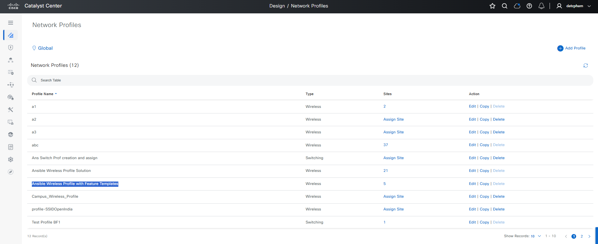
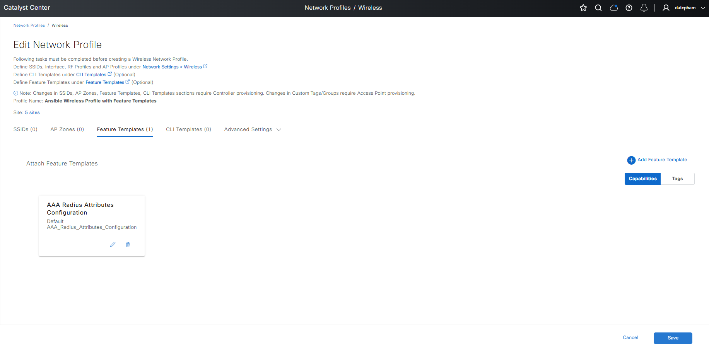
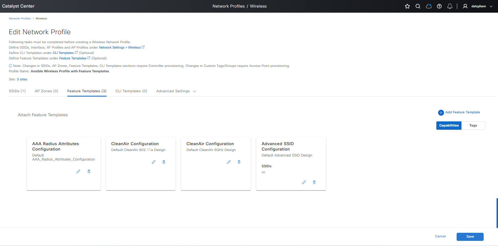
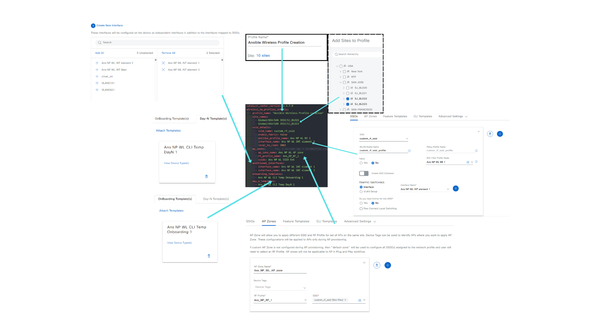

# Cisco Catalyst Center Network Profile Wireless Workflow Playbooks

**Overview**

This module provides a comprehensive toolkit for managing wireless network profiles in *Cisco Catalyst Center*. It supports creating, updating, and deleting profiles with flexible configurations, enabling efficient management across sites, devices, and profiles. Key features include:

- **Wireless Profile Management**:  
  - **Create** profiles with SSIDs, RF profiles, AP zones, and advanced settings.  
  - **Update** or **delete** single, multiple, or bulk profiles.  
  - **Bind** SSIDs to profiles with distinct policy profiles.

- **Site Assignment and Hierarchy**:  
  - **Assign** profiles to sites, buildings, and floors.  
  - **Add** site tags (e.g., *Power Profile*, *Calendar Profile*).  

- **Interface and VLAN Settings**:  
  - **Configure** valid interfaces, VLAN groups, and anchor groups.  
  - **Support** advanced VLAN configurations, including *Local-to-VLAN* mappings.  

- **AP Zone, RF Profile, and Device Tags**:  
  - **Assign** AP zones and RF profiles to wireless profiles.  
  - **Configure** device tags for granular control.  

- **Onboarding and Day-N Templates**:  
  - **Associate** onboarding and *Day-N* templates with profiles.   

- **Feature Template** (available from version 3.1.3.0 onwards):
  - **Create** and **Update** multiple feature templates for wireless profiles.
  - **Delete** multiple feature templates for wireless profiles.

- **Bulk Operations**:  
  - **Create** and **delete** profiles in bulk for scalable deployments.  

**Version Added**: `6.32.0`  
*Note*: This version refers to the Cisco Catalyst Center Ansible collection.

---

## Workflow Steps

Follow these steps to configure and deploy wireless network profiles in *Cisco Catalyst Center* using Ansible playbooks.

### Step 1: Install and Generate Inventory

**Prepare your environment** by installing Ansible and the required *Cisco Catalyst Center* collection, then generate an inventory file.

1. **Install Ansible**:  
   Refer to the [official Ansible documentation](https://docs.ansible.com/ansible/latest/installation_guide/intro_installation.html) for installation instructions.

2. **Install Cisco Catalyst Center Collection**:  
   ```bash
   ansible-galaxy collection install cisco.dnac
   ```

3. **Generate Inventory**:  
   Create an Ansible inventory file (e.g., `inventory.yml`) with your *Cisco Catalyst Center* appliance details. Define variables such as `catalyst_center_host`, `catalyst_center_username`, and `catalyst_center_password`.  
   > **Note**: For security, consider using *Ansible Vault* to encrypt sensitive data like passwords.  
   ```yaml
   catalyst_center_hosts:
       hosts:
           your_catalyst_center_instance_name:
               catalyst_center_host: xx.xx.xx.xx
               catalyst_center_password: XXXXXXXX
               catalyst_center_port: 443
               catalyst_center_timeout: 60
               catalyst_center_username: admin
               catalyst_center_verify: false  # Enable for production with valid certificates
               catalyst_center_version: 2.3.7.9  # Specify the version, Refer the compliance Table for selecting correct version
               catalyst_center_debug: true
               catalyst_center_log_level: INFO
               catalyst_center_log: true
   ```

---

### Step 2: Define Inputs and Validate

Define input variables and validate your configuration to ensure successful profile management.

#### Define Input Variables
Create a variable file (e.g., `vars/network_profile_wireless_inputs.yml`) to specify the desired state of your wireless network profiles for creation, update, or deletion.

#### Schema for Wireless Network Profiles
The following schema outlines the structure for configuring wireless network profiles in *Cisco Catalyst Center*. Parameters are listed with their requirements and descriptions.

| **Parameter**                | **Type**   | **Required** | **Default Value** | **Description**                                                                 |
|------------------------------|------------|--------------|-------------------|---------------------------------------------------------------------------------|
| `wireless_nw_profiles_details` | List       | Yes          | `N/A`             | List of wireless network profiles to create or manage.                           |

##### Wireless Network Profile (`wireless_nw_profiles_type`)

| **Parameter**         | **Type**   | **Required** | **Default Value** | **Description**                                                                 |
|-----------------------|------------|--------------|-------------------|---------------------------------------------------------------------------------|
| `profile_name`        | String     | Yes          | `N/A`             | Name of the wireless network profile.                                           |
| `site_names`          | List       | *No*         | `N/A`             | List of site hierarchies where the profile is applied.                          |
| `ssid_details`        | List       | *No*         | `N/A`             | List of SSIDs associated with the profile. See *SSID Details*.                  |
| `ap_zones`            | List       | *No*         | `N/A`             | List of AP zones associated with the profile. See *AP Zones*.                   |
| `onboarding_templates`| List       | *No*         | `N/A`             | List of onboarding templates associated with the profile.                       |
| `day_n_templates`     | List       | *No*         | `N/A`             | List of *Day-N* templates associated with the profile.                          |
| `feature_template_designs`| List      | *No*         | `N/A`          | List of feature template designs to be assigned or removed. See *Feature Template Designs*. |
| `additional_interfaces`| List      | *No*         | `N/A`             | List of additional interfaces to configure. See *Additional Interfaces*.        |

##### SSID Details (`ssid_details_type`)

| **Parameter**         | **Type**   | **Required** | **Default Value** | **Description**                                                                 |
|-----------------------|------------|--------------|-------------------|---------------------------------------------------------------------------------|
| `ssid_name`           | String     | Yes          | `N/A`             | Name of the SSID.                                                              |
| `dot11be_profile_name`| String     | *No*         | `N/A`             | Name of the *802.11be* profile associated with the SSID.                        |
| `enable_fabric`       | Boolean    | *No*         | `false`           | Enables fabric for the SSID.                                                   |
| `vlan_group_name`     | String     | *No*         | `N/A`             | VLAN group name associated with the SSID.                                      |
| `interface_name`      | String     | *No*         | `N/A`             | Interface name associated with the SSID.                                       |
| `anchor_group_name`   | String     | *No*         | `N/A`             | Anchor group name associated with the SSID.                                    |
| `local_to_vlan`       | Integer    | *No*         | `N/A`             | VLAN ID for *Local-to-VLAN* mapping (range: `1–4094`).                          |

##### AP Zones (`ap_zones_type`)

| **Parameter**         | **Type**   | **Required** | **Default Value** | **Description**                                                                 |
|-----------------------|------------|--------------|-------------------|---------------------------------------------------------------------------------|
| `ap_zone_name`        | String     | Yes          | `N/A`             | Name of the AP zone.                                                           |
| `ssids`               | List       | Yes          | `N/A`             | List of SSIDs associated with the AP zone.                                     |
| `rf_profile_name`     | String     | Yes          | `N/A`             | Name of the RF profile associated with the AP zone.                            |

##### Feature Template Designs (`feature_template_designs_type`)

| **Parameter**         | **Type**   | **Required** | **Default Value** | **Description**                                                                 |
|-----------------------|------------|--------------|-------------------|---------------------------------------------------------------------------------|
| `design_type`         | String     | No           | `N/A`             | Category or name of the feature template to be applied.                         |
| `feature_templates`   | List       | Yes          | `N/A`             | A list of specific design names to apply within the chosen feature template category.                         |
| `applicability_ssids` | List       | No           | ["All"]           | List of SSIDs to which this feature template applies                            |

##### Additional Interfaces (`additional_interfaces_type`)

| **Parameter**         | **Type**   | **Required** | **Default Value** | **Description**                                                                 |
|-----------------------|------------|--------------|-------------------|---------------------------------------------------------------------------------|
| `interface_name`      | String     | Yes          | `N/A`             | Name of the interface.                                                         |
| `vlan_id`             | Integer    | Yes          | `N/A`             | VLAN ID assigned to the interface (range: `1–4094`).                           |

#### Example Input File


**Prerequisites**  
The *Network Profile Wireless* feature relies on optional components. If used, these must be predefined in *Cisco Catalyst Center*:  
- **Site Hierarchy**: Defines the site structure.  
- **SSID and Details**: Specifies SSID configurations.  
- **802.11be Profile**: Configures *802.11be* settings.  
- **Network Interface**: Interface name for the profile.  
- **VLAN Group**: Group for VLAN configurations.  
- **Anchor Group**: Group for anchor configurations.  
- **RF Profile**: Radio frequency settings.  
- **Onboarding Template**: Template for initial setup.  
- **Day-N Template**: Template for ongoing configurations.  
- **Feature Template**: Additional feature settings.

##### 1. **Create Wireless Network Profile**  
a. *Example*: Configure a new wireless profile with specific site assignments and SSID details using interface name
```yaml
catalyst_center_version: 2.3.7.9  # Cisco Catalyst Center version
wireless_nw_profiles_details:
  - profile_name: "Ansible Wireless Profile Creation"  # Name of the profile
    site_names:  # Sites where the profile is applied
      - Global/USA/SAN JOSE/SJ_BLD22
      - Global/USA/SAN JOSE/SJ_BLD23
    ssid_details:  # SSID configurations
      - ssid_name: custom_rf_ssid
        enable_fabric: false
        dot11be_profile_name: Ans NP WL BE 1
        interface_name: Ans NP WL INT element 1
        local_to_vlan: 3002  # VLAN ID for mapping
    ap_zones:  # AP zone configurations
      - ap_zone_name: Ans_NP_WL_AP_zone
        rf_profile_name: Ans_NP_RF_1
        ssids: 
          - custom_rf_ssid
    additional_interfaces:  # Additional interfaces
      - interface_name: Ans NP WL INT element 1
      - interface_name: Ans NP WL INT element 3
    onboarding_templates:  # Onboarding templates
      - Ans NP WL CLI Temp Onboarding 1
    day_n_templates:  # Day-N templates
      - Ans NP WL CLI Temp DayN 1
```

b. *Example*: Configure a new wireless profile with specific site assignments and SSID details using Vlan Group name
```yaml
catalyst_center_version: 2.3.7.9  # Cisco Catalyst Center version
wireless_nw_profiles_details:
  - profile_name: "Ansible Wireless Profile Creation"  # Name of the profile
    site_names:  # Sites where the profile is applied
      - Global/USA/SAN JOSE/SJ_BLD22
      - Global/USA/SAN JOSE/SJ_BLD23
    ssid_details:  # SSID configurations
      - ssid_name: custom_rf_ssid
        enable_fabric: false
        dot11be_profile_name: Ans NP WL BE 1
        vlan_group_name: Ans NP WL INT group 1
        anchor_group_name: Ans_Anchor_1
    ap_zones:  # AP zone configurations
      - ap_zone_name: Ans_NP_WL_AP_zone
        rf_profile_name: Ans_NP_RF_1
        ssids: 
          - custom_rf_ssid
    additional_interfaces:  # Additional interfaces
      - interface_name: Ans NP WL INT element 1
      - interface_name: Ans NP WL INT element 3
    onboarding_templates:  # Onboarding templates
      - Ans NP WL CLI Temp Onboarding 1
    day_n_templates:  # Day-N templates
      - Ans NP WL CLI Temp DayN 1
```

##### 2. **Update Wireless Network Profile**  
*Example*: Update an existing profile with new site assignments or configurations.  
> **Note**: Ensure the profile exists before updating.  
> **Note**: To update a wireless network profile, provide all configurations in the input file. Only modify the specific configurations you want to change. Any omitted configurations will be treated as a request to remove them. In the example below, only the ssid_details configuration is updated, while other settings remain unchanged. As a result, the network profile will reflect the updated SSID details
```yaml
catalyst_center_version: 2.3.7.9
wireless_nw_profiles_details:
  - profile_name: "Ansible Wireless Profile Update"
    site_names:
      - Global/USA/SAN JOSE/SJ_BLD20
      - Global/USA/SAN JOSE/SJ_BLD21
    ssid_details:
      - ssid_name: custom_rf_ssid_1 # update new SSID detail
        enable_fabric: false
        dot11be_profile_name: Ans NP WL BE 1
        interface_name: Ans NP WL INT element 1
        local_to_vlan: 3002
    ap_zones:
      - ap_zone_name: Ans_NP_WL_AP_zone
        rf_profile_name: Ans_NP_RF_1
        ssids: 
          - Ans NP WL SSID Ent
    additional_interfaces:
      - interface_name: Ans NP WL INT element 1
      - interface_name: Ans NP WL INT element 3
    onboarding_templates:
      - Ans NP WL CLI Temp Onboarding 1
    day_n_templates:
      - Ans NP WL CLI Temp DayN 1
```

##### 3. **Delete Wireless Network Profile**  
*Example*: Delete one or more profiles by specifying their names.  
> **Warning**: Deleting profiles may impact existing configurations. Verify before proceeding.  
```yaml
catalyst_center_version: 2.3.7.9
wireless_nw_profiles_details:
  - profile_name: "Ansible Wireless Profile Creation"
  - profile_name: "Ansible Wireless Profile Update"
```

##### 4. **Create Wireless Network Profile with Feature Template Designs**
*Only supports the API for DNAC version 3.1.3 and above*

a. *Example*: Configure wireless profile with AAA RADIUS Attributes Configuration

```yaml
catalyst_center_version: 3.1.3.0
wireless_nw_profiles_details:
  - profile_name: "Ansible Wireless Profile with Feature Templates"
    site_names:
      - Global/USA/SAN JOSE/SJ_BLD22
    feature_template_designs:
      - design_type: AAA_RADIUS_ATTRIBUTES_CONFIGURATION
        feature_templates:
          - Default AAA_Radius_Attributes_Configuration
```
+ Playbook return:
```yaml
  response:
  - profile_name: Ansible Wireless Profile with Feature Templates
    profile_status: Network Profile [6a85f77d-add6-4280-b422-c78690fb58e5] Successfully Created
    site_status: 'Sites ''[''Global/USA/SAN JOSE/SJ_BLD22/FLOOR2'', ''Global/USA/SAN JOSE/SJ_BLD22/FLOOR1'', ''Global/USA/SAN JOSE/SJ_BLD22'', ''Global/USA/SAN JOSE/SJ_BLD22/FLOOR4'', ''Global/USA/SAN JOSE/SJ_BLD22/FLOOR3'']'' successfully associated to network profile: Ansible Wireless Profile with Feature Templates.'
  status: success
```
+ The UI display:



b. *Example*: Configure wireless profile with multiple feature template designs (update)

  Update the feature templates into the network profile that has been previously created with the feature templates. The module will retain the existing feature templates and only add new ones based on the new input.

  *Note: If a feature template of type 'ADVANCED_SSID_CONFIGURATION' is added, it need associate an SSID to enable the addition of the feature template.*

```yaml
catalyst_center_version: 3.1.3.0
wireless_nw_profiles_details:
  - profile_name: "Ansible Wireless Profile with Feature Templates"
    ssid_details:
      - ssid_name: custom_rf_ssid
        enable_fabric: true
    feature_template_designs:
      - design_type: CLEANAIR_CONFIGURATION
        feature_templates:
          - Default CleanAir 6GHz Design
          - Default CleanAir 802.11a Design
      - design_type: ADVANCED_SSID_CONFIGURATION
        feature_templates:
          - Default Advanced SSID Design
```
+ Playbook return:
```yaml
  msg: 'Wireless profile(s) created/updated and verified successfully: [{''profile_name'': ''Ansible Wireless Profile with Feature Templates'', ''profile_status'': ''Network Profile [6a85f77d-add6-4280-b422-c78690fb58e5] Successfully Updated''}]'
  response:
  - profile_name: Ansible Wireless Profile with Feature Templates
    profile_status: Network Profile [6a85f77d-add6-4280-b422-c78690fb58e5] Successfully Updated
  status: success
```
+ The UI display:


c. *Example*: Update wireless profile to remove feature template designs (delete)

  To delete the existing feature template on the network profile, we can provide the feature template to be deleted and use the **state 'deleted'**.
```yaml
catalyst_center_version: 3.1.3.0
wireless_nw_profiles_details:
  - profile_name: "Ansible Wireless Profile with Feature Templates"
    feature_template_designs:
      - design_type: CLEANAIR_CONFIGURATION
        feature_templates:
          - Default CleanAir 6GHz Design
          - Default CleanAir 802.11a Design
```
+ Playbook return:
```yaml
  msg: 'Wireless profile data removed successfully for: [{''Ansible Wireless Profile with Feature Templates'': {''feature_template_designs_status'': "Feature Template Designs ''Default CleanAir 6GHz Design'', ''Default CleanAir 802.11a Design'' removed successfully."}}]'
  response:
  - Ansible Wireless Profile with Feature Templates:
      feature_template_designs_status: Feature Template Designs 'Default CleanAir 6GHz Design', 'Default CleanAir 802.11a Design' removed successfully.
  status: success
```
+ The UI display:


---

#### Validate Configuration
> **Important**: Validate your input schema before executing the playbook to ensure all parameters are correctly formatted.  
Run the following command to validate your input file against the schema:  
```bash
./tools/validate.sh -s ./workflows/network_profile_wireless/schema/network_profile_wireless_schema.yml -d ./workflows/network_profile_wireless/vars/network_profile_wireless_inputs.yml
```
---

### Step 3: Deploy and Verify

**Deploy** your configuration to *Cisco Catalyst Center* and **verify** the changes.

1. **Deploy Configuration**:  
   Run the playbook to apply the wireless network profile configuration. Ensure the input file is validated before execution. Specify the input file path using the `--e` variable (`VARS_FILE_PATH`).

  ### a. Include create/update network profile (state = 'merged')
   ```bash
  ansible-playbook -i inventory/demo_lab/hosts.yaml \
  workflows/network_profile_wireless/playbook/network_profile_wireless_playbook.yml \
  --e VARS_FILE_PATH=./../vars/network_profile_wireless_inputs.yml \
  -vvv
   ```

  ### b. Include delete network profile (state = 'deleted')
   ```bash
  ansible-playbook 
    -i inventory/demo_lab/hosts.yml # refer to Catalyst Center to run
    workflows/network_profile_wireless/playbook/delete_network_profile_wireless_playbook.yml # playbook will run this
    --extra-vars VARS_FILE_PATH=./../vars/delete_network_profile_wireless_inputs.yml # location of the input file for the playbook to execute
    -vvv # return detailed information about the message; the more 'v', more detailed
   ```  
   > **Note**: If an error occurs (e.g., invalid input or API failure), the playbook will halt and display details. Check the `logs/wireless_profile.log` for troubleshooting.

2. **Verify Deployment**:  
   After execution, verify the configuration in the *Cisco Catalyst Center* UI under the wireless design section. If `catalyst_center_debug` is enabled, review the logs for detailed operation information.  

     
   **Figure 1**: *Wireless Profile Configuration in Cisco Catalyst Center*

---

## References

**Environment Details**  
The following environment was used for testing:  

| **Component**         | **Version** |
|-----------------------|-------------|
| Python                | `3.12.0`    |
| Cisco Catalyst Center | `2.3.7.9`   |
| Ansible               | `9.9.0`     |
| cisco.dnac Collection | `6.32.0`    |
| dnacentersdk          | `2.8.8`     |

For detailed documentation, refer to:  
- [Ansible Galaxy: Cisco Catalyst Center Collection](https://galaxy.ansible.com/ui/repo/published/cisco/dnac/content/module/network_profile_wireless_workflow_manager/)  
- [Cisco Catalyst Center Documentation](https://www.cisco.com/c/en/us/support/cloud-systems-management/dna-center/series.html)