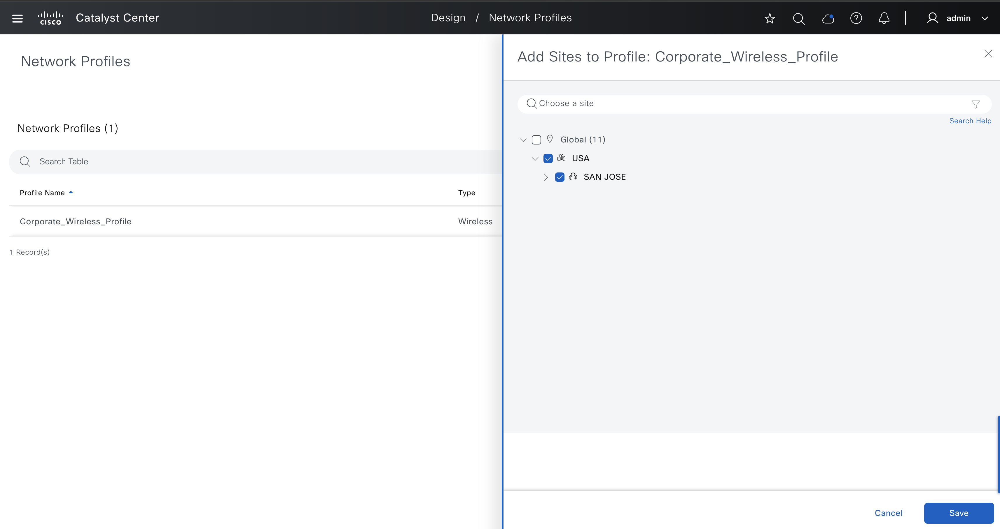

# Cisco Catalyst Center Network Profile Wireless Workflow Playbooks

This is a comprehensive resource module for managing wireless network profiles in Cisco Catalyst Center.
This module provides robust capabilities for creating, updating, and deleting wireless network profiles in Cisco Catalyst Center. It supports a wide range of configurations and workflows, enabling efficient management of wireless settings across sites, devices, and profiles. Key features include:  

- **Wireless Profile Management:**  
  - Create wireless network profiles with SSIDs, RF profiles, AP zones, and advanced settings.  
  - Update and delete single, multiple, or bulk wireless profiles.  
  - Bind SSIDs to profiles with different policy profiles.

- **Site Assignment and Hierarchy:**  
  - Assign wireless network profiles to sites, buildings, and floors.  
  - Add site tags (e.g., Power Profile, Calendar Profile).  

- **Interface and VLAN Settings:**  
  - Configure valid interfaces, VLAN groups, and anchor groups.  
  - Support for advanced VLAN configurations, including Local-to-VLAN mappings.  

- **AP Zone, RF Profile, and Device Tags:**  
  - Assign AP zones and RF profiles to wireless profiles.  
  - Configure device tags for granular control.  

- **Onboarding and DayN Templates:**  
  - Associate onboarding and DayN templates with wireless profiles.   

- **Bulk Operations:**  
  - Create and delete wireless profiles in bulk, ensuring scalability for large deployments.  


**Version Added:**  `6.32.0`

## Workflow Steps

This workflow typically involves the following steps:

### Step 1: Install and Generate Inventory

Before running the playbooks, ensure you have Ansible installed and the necessary collections for Cisco Catalyst Center.

1.  **Install Ansible:** Follow the official Ansible documentation for installation instructions.
2.  **Install Cisco Catalyst Center Collection:**
    ```bash
    ansible-galaxy collection install cisco.dnac
    ```
3.  **Generate Inventory:** Create an Ansible inventory file (e.g., `inventory.yml`) that includes your Cisco Catalyst Center appliance details. You will need to define variables such as the host, username, and password (or other authentication methods).
    ```yaml
    catalyst_center_hosts:
        hosts:
            your_catalyst_center_instance_name:
                catalyst_center_host: xx.xx.xx.xx
                catalyst_center_password: XXXXXXXX
                catalyst_center_port: 443
                catalyst_center_timeout: 60
                catalyst_center_username: admin
                catalyst_center_verify: false # Set to true for production with valid certificates
                catalyst_center_version: 2.3.7.9 # Specify your DNA Center version
                catalyst_center_debug: true
                catalyst_center_log_level: INFO
                catalyst_center_log: true
    ```

### Step 2: Define Inputs and Validate

This step involves preparing the input data for creating or managing wireless network profiles and validating your setup.

1.  **Define Input Variables:** Create variable files (e.g., `vars/network_profile_wireless_inputs.yml`) that define the desired state of your wireless network profiles, including details for creation, update, and deletion. 

#### Schema for Wireless Network Profiles
This schema defines the structure of the input file for configuring wireless network profiles in Cisco Catalyst Center. Below is a breakdown of the parameters, including their requirements and descriptions.

| **Parameter**                | **Type**   | **Required** | **Default Value** | **Description**                                                                 |
|------------------------------|------------|--------------|-------------------|---------------------------------------------------------------------------------|
| `wireless_nw_profiles_details` | List       | Yes          | N/A               | A list of wireless network profiles to be created or managed.                  |

#### Wireless Network Profile (`wireless_nw_profiles_type`)

| **Parameter**         | **Type**   | **Required** | **Default Value** | **Description**                                                                 |
|-----------------------|------------|--------------|-------------------|---------------------------------------------------------------------------------|
| `profile_name`        | String     | Yes          | N/A               | The name of the wireless network profile.                                      |
| `site_names`          | List       | No           | N/A               | A list of site hierarchies where the profile will be applied.                  |
| `ssid_details`        | List       | No           | N/A               | A list of SSIDs to be associated with the profile. See `ssid_details_type`.    |
| `ap_zones`            | List       | No           | N/A               | A list of AP zones to be associated with the profile. See `ap_zones_type`.     |
| `onboarding_templates`| List       | No           | N/A               | A list of onboarding templates to be associated with the profile.              |
| `day_n_templates`     | List       | No           | N/A               | A list of Day-N templates to be associated with the profile.                   |
| `additional_interfaces`| List      | No           | N/A               | A list of additional interfaces to be configured. See `additional_interfaces_type`. |

#### SSID Details (`ssid_details_type`)

| **Parameter**         | **Type**   | **Required** | **Default Value** | **Description**                                                                 |
|-----------------------|------------|--------------|-------------------|---------------------------------------------------------------------------------|
| `ssid`               | String     | Yes          | N/A               | The name of the SSID.                                                          |
| `dot11be_profile_name`| String     | No           | N/A               | The name of the 802.11be profile associated with the SSID.                     |
| `enable_fabric`       | Boolean    | No           | `false`           | Indicates whether fabric is enabled for the SSID.                              |
| `vlan_group_name`     | String     | No           | N/A               | The VLAN group name associated with the SSID.                                  |
| `interface_name`      | String     | No           | N/A               | The interface name associated with the SSID.                                   |
| `anchor_group_name`   | String     | No           | N/A               | The anchor group name associated with the SSID.                                |
| `local_to_vlan`       | Integer    | No           | N/A               | The VLAN ID for local-to-VLAN mapping (range: 1–4094).                         |

#### AP Zones (`ap_zones_type`)

| **Parameter**         | **Type**   | **Required** | **Default Value** | **Description**                                                                 |
|-----------------------|------------|--------------|-------------------|---------------------------------------------------------------------------------|
| `ap_zone_name`        | String     | Yes          | N/A               | The name of the AP zone.                                                       |
| `ssids`               | List       | No           | N/A               | A list of SSIDs to be associated with the AP zone.                             |
| `rf_profile_name`     | String     | No           | N/A               | The name of the RF profile associated with the AP zone.                        |

#### Additional Interfaces (`additional_interfaces_type`)

| **Parameter**         | **Type**   | **Required** | **Default Value** | **Description**                                                                 |
|-----------------------|------------|--------------|-------------------|---------------------------------------------------------------------------------|
| `interface_name`      | String     | Yes          | N/A               | The name of the interface.                                                     |
| `vlan_id`             | Integer    | Yes          | N/A               | The VLAN ID to be assigned to the interface (range: 1–4094).                   |


### Full Workflow Specification: 
Refer to the official documentation for detailed information on defining workflows: https://galaxy.ansible.com/ui/repo/published/cisco/dnac/content/module/network_profile_wireless_workflow_manager/


## Example Input File

a) Create Wireless Network Profile


```yaml
catalyst_center_version: 2.3.7.9
wireless_nw_profiles_details:
  - profile_name: "Ansible Wireless Profile creation"
    site_names:
      - Global/USA/SAN JOSE/SJ_BLD22
      - Global/USA/SAN JOSE/SJ_BLD23
    ssid_details:
      - ssid_name: custom_rf_ssid
        enable_fabric: false
        dot11be_profile_name: Ans NP WL BE 1
        interface_name: Ans NP WL INT element 1
        local_to_vlan: 3002
    ap_zones:
      - ap_zone_name: Ans_NP_WL_AP_zone
        rf_profile_name: Ans_NP_RF_1
        ssids: custom_rf_ssid
    additional_interfaces:
      - interface_name: Ans NP WL INT element 1
      - interface_name: Ans NP WL INT element 3
    onboarding_templates:
      - Ans NP WL CLI Temp Onboarding 1
    day_n_templates:
      - Ans NP WL CLI Temp DayN 1
```

b) Update Wireless Network Profile

To update a Wireless Network Profile, the profile must already exist in Catalyst Center (CatC). The user should first ensure the network profile is created, then provide an input containing the updated configuration to apply the necessary changes.

```yaml
catalyst_center_version: 2.3.7.9
wireless_nw_profiles_details:
  - profile_name: "Ansible Wireless Profile update"
    site_names:
      - Global/USA/SAN JOSE/SJ_BLD20
      - Global/USA/SAN JOSE/SJ_BLD21
    ssid_details:
      - ssid_name: custom_rf_ssid
        enable_fabric: false
        dot11be_profile_name: Ans NP WL BE 1
        interface_name: Ans NP WL INT element 1
        local_to_vlan: 3002
    ap_zones:
      - ap_zone_name: Ans NP WL AP zone
        rf_profile_name: Ans_NP_RF_1
        ssids: Ans NP WL SSID Ent
    additional_interfaces:
      - interface_name: Ans NP WL INT element 1
      - interface_name: Ans NP WL INT element 3
    onboarding_templates:
      - Ans NP WL CLI Temp Onboarding 1
    day_n_templates:
      - Ans NP WL CLI Temp DayN 1
```
c) Delete Wireless Network Profile
To delete a Wireless Network Profile, specify the profile name and execute the playbook in the *deleted* state. This ensures the profile is properly removed from the wireless network configuration in Catalyst Center.

```yaml
catalyst_center_version: 2.3.7.9
wireless_nw_profiles_details:
  - profile_name: "Ansible Wireless Profile San Jose"
  - profile_name: "Ansible Wireless Profile New York"
```

2.  **Validate Configuration:** 
To ensure a successful execution of the playbooks with your specified inputs, follow these steps:

    **Input Validation**:
    Before executing the playbook, it is essential to validate the input schema. This step ensures that all required parameters are included and correctly formatted. Run the following command *./tools/validate.sh -s* to perform the validation providing the schema path -d and the input path.

```bash
./tools/validate.sh -s ./workflows/network_profile_wireless/schema/network_profile_wireless_schema.yml -d ./workflows/network_profile_wireless/vars/network_profile_wireless_inputs.yml
```

### Step 3: Deploy and Verify

This is the final step where you deploy the configuration to Cisco Catalyst Center and verify the changes.

1.  **Deploy Configuration:** 

Run the playbook to seamlessly apply the wireless network profile configuration defined in your input variables to Cisco Catalyst Center. 
Before proceeding, ensure that the input validation step has been completed successfully, with no errors detected in the provided variables. Once validated, execute the playbook by specifying the input file path using the --e variable as VARS_FILE_PATH. The VARS_FILE_PATH must be provided as a full path to the input file.
This ensures that the configuration is accurately deployed to Cisco Catalyst Center, automating the setup process and reducing the risk of manual errors.

```bash

ansible-playbook -i ./inventory/iac2/host.yml workflows/network_profile_wireless/playbook/network_profile_wireless_playbook.yml  --e VARS_FILE_PATH=../vars/network_profile_wireless_inputs.yml > logs/wireless_profile.log -vvvvvv    
```

If there is an error in the input or an issue with the API call during execution, the playbook will halt and display the relevant error details.


2.  **Verify Deployment:** 
After executing the playbook, check the Catalyst Center UI to verify wireless design. If *debug_log* is enabled, you can also review the logs for detailed information on operations performed and any updates made.



---

### References

*Note: The environment used for the references in the above instructions is as follows:*

```yaml
python: 3.12.0
dnac_version: 2.3.7.9
ansible: 9.9.0
cisco.dnac: 6.32.0
dnacentersdk: 2.8.8
```

For detailed information on network wireless profile workflow refer to the following documentation: https://galaxy.ansible.com/ui/repo/published/cisco/dnac/content/module/network_profile_wireless_workflow_manager/

