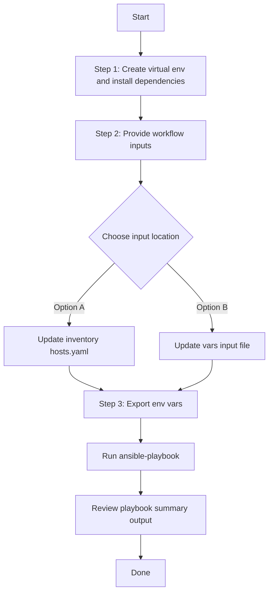

# Network Profile Wireless Config Generator

## Table of Contents

- [User Flow (3 Steps)](#user-flow-3-steps)
- [Overview](#overview)
- [Features](#features)
- [Prerequisites](#prerequisites)
- [Workflow Structure](#workflow-structure)
- [Schema Parameters](#schema-parameters)
- [Getting Started](#getting-started)
- [Operations](#operations)
- [Examples](#examples)
- [Filter Priority System](#filter-priority-system)
- [Troubleshooting](#troubleshooting)

---

## Overview

The Network Profile Wireless Config Generator automates YAML playbook configuration generation for existing wireless profiles in Cisco Catalyst Center. It creates YAML files compatible with `network_profile_wireless_workflow_manager`, reducing manual playbook authoring and helping brownfield extraction workflows.

---

## Features

- **Configuration Generation**: Build YAML output compatible with `network_profile_wireless_workflow_manager`
- **Brownfield Discovery**: Retrieve all wireless profiles when `config` is omitted
- **Filter-based Extraction**: Target output using profile names, Day-N templates, sites, SSIDs, AP zones, feature templates, or additional interfaces
- **Priority-based Filter Processing**: Uses the highest-priority populated filter per request item
- **Flexible Output**: Supports custom `file_path`, auto-generated timestamped filenames, and `overwrite`/`append` modes
- **API-driven Collection**: Uses Catalyst Center APIs via `cisco.catalystcenter` and `catalystcentersdk`

---

## Prerequisites

### Software Requirements

| Component | Version |
|-----------|---------|
| Ansible | 2.13+ |
| cisco.catalystcenter collection | 2.6.0 |
| Python | 3.9+ |
| Cisco Catalyst Center | 2.3.7.9+ |
| catalystcentersdk | 2.10.10+ |

### Required Collections

```bash
ansible-galaxy collection install cisco.catalystcenter
ansible-galaxy collection install ansible.utils
pip install catalystcentersdk
pip install yamale
```

### Access Requirements

- Catalyst Center admin credentials
- Network connectivity to Catalyst Center API
- Existing wireless profiles in Catalyst Center

---

## Workflow Structure

```text
network_profile_wireless_config_generator/
├── playbook/
│   └── network_profile_wireless_config_generator.yml          # Main operations
├── vars/
│   └── network_profile_wireless_config_generator_inputs.yml   # Configuration examples
├── schema/
│   └── network_profile_wireless_config_generator_schema.yml   # Input validation
└── README.md
```

---

## Schema Parameters

### Basic Configuration

| Parameter | Type | Required | Default | Description |
|-----------|------|----------|---------|-------------|
| file_path | string | No | auto-generated | Output file path for generated YAML |
| file_mode | string | No | overwrite | File write mode: `overwrite` replaces, `append` adds |
| config | dict | No | omitted | Optional filter wrapper. Omit or leave `config` empty to gather all wireless profiles |
| global_filters | dict | Yes if `config` is provided | none | Filters for wireless profile selection |

### Global Filters (Priority-Based Behavior)

| Filter | Priority | Type | Description |
|--------|----------|------|-------------|
| profile_name_list | 1 (HIGHEST) | list | Exact wireless profile names |
| day_n_template_list | 2 | list | Day-N template names |
| site_list | 3 | list | Site hierarchy paths |
| ssid_list | 4 | list | SSID names |
| ap_zone_list | 5 | list | AP zone names |
| feature_template_list | 6 | list | Feature template names |
| additional_interface_list | 7 (LOWEST) | list | Additional interface names |

### Filter Behavior Notes

- If `config` is omitted or empty, module gathers all wireless profiles.
- If `config` is provided, `global_filters` is required.
- All filter values are case-sensitive and must match exactly.
- Only one filter type is applied per item: the highest-priority filter with valid data.
- If no valid filter data is provided inside `global_filters`, module execution fails.

---

## Getting Started

## Workflow Steps
## User Flow (3 Steps)



### Installation and Run (Aligned)

1. Create and activate a Python virtual environment, then install dependencies.

```bash
python3 -m venv .venv
source .venv/bin/activate
pip install -r requirements.txt
ansible-galaxy collection install cisco.catalystcenter --force
```

2. Provide workflow inputs in either inventory (`inventory/demo_lab/hosts.yaml`) or vars file (`workflows/network_profile_wireless_config_generator/vars/network_profile_wireless_config_generator_inputs.yml`).

3. Export Catalyst Center environment variables and run the playbook.

```bash
export HOSTIP=<catalyst-center-ip-or-fqdn>
export CATALYST_CENTER_USERNAME=<username>
export CATALYST_CENTER_PASSWORD='<password>'
ansible-playbook -i ./inventory/demo_lab/hosts.yaml ./workflows/network_profile_wireless_config_generator/playbook/network_profile_wireless_config_generator.yml -vvvv
```

---

## Operations

### Generate Operations (state: gathered)

Use `network_profile_wireless_config_generator.yml` for generation operations.

#### Generate All Configurations

**Description**: Omit `config` to retrieve all wireless profiles.

```yaml
network_profile_wireless_config:
  - file_path: "/tmp/complete_wireless_profiles_config.yml"
    file_mode: "overwrite"
```

#### Profile Name Based Generation (Priority 1)

```yaml
network_profile_wireless_config:
  - file_path: "/tmp/profile_name_wireless_profiles.yml"
    file_mode: "overwrite"
    config:
      global_filters:
        profile_name_list:
          - "Campus_Wireless_Profile"
          - "Enterprise_Wireless_Profile"
```

#### Day-N Template Based Generation (Priority 2)

```yaml
network_profile_wireless_config:
  - file_path: "/tmp/day_n_template_wireless_profiles.yml"
    file_mode: "overwrite"
    config:
      global_filters:
        day_n_template_list:
          - "Wireless_Controller_Config"
```

#### Site Based Generation (Priority 3)

```yaml
network_profile_wireless_config:
  - file_path: "/tmp/site_wireless_profiles.yml"
    file_mode: "overwrite"
    config:
      global_filters:
        site_list:
          - "Global/USA/SAN JOSE/SJ_BLD20/FLOOR3"
```

#### SSID Based Generation (Priority 4)

```yaml
network_profile_wireless_config:
  - file_path: "/tmp/ssid_wireless_profiles.yml"
    file_mode: "overwrite"
    config:
      global_filters:
        ssid_list:
          - "Guest_WiFi"
          - "Corporate_WiFi"
```

#### AP Zone Based Generation (Priority 5)

```yaml
network_profile_wireless_config:
  - file_path: "/tmp/ap_zone_wireless_profiles.yml"
    file_mode: "overwrite"
    config:
      global_filters:
        ap_zone_list:
          - "Branch_AP_Zone"
```

#### Feature Template Based Generation (Priority 6)

```yaml
network_profile_wireless_config:
  - file_path: "/tmp/feature_template_wireless_profiles.yml"
    file_mode: "overwrite"
    config:
      global_filters:
        feature_template_list:
          - "Default AAA_Radius_Attributes_Configuration"
```

#### Additional Interface Based Generation (Priority 7)

```yaml
network_profile_wireless_config:
  - file_path: "/tmp/additional_interface_wireless_profiles.yml"
    file_mode: "overwrite"
    config:
      global_filters:
        additional_interface_list:
          - "VLAN_22"
          - "GigabitEthernet0/2"
```

#### Priority Processing Example

If multiple filters are provided in one item, only the highest-priority populated filter is processed.

```yaml
network_profile_wireless_config:
  - file_path: "/tmp/priority_behavior_wireless_profiles.yml"
    file_mode: "overwrite"
    config:
      global_filters:
        profile_name_list:
          - "Campus_Wireless_Profile"
        site_list:
          - "Global/USA/SAN JOSE/SJ_BLD20/FLOOR3"
```

> In this example, `profile_name_list` is used and `site_list` is ignored for this request item.

**Validate and Execute:**

```bash
# Validate
./tools/schemavalidation.sh -s workflows/network_profile_wireless_config_generator/schema/network_profile_wireless_config_generator_schema.yml \
                            -d workflows/network_profile_wireless_config_generator/vars/network_profile_wireless_config_generator_inputs.yml
```

```bash
# Execute
ansible-playbook -i inventory/demo_lab/hosts.yaml \
  workflows/network_profile_wireless_config_generator/playbook/network_profile_wireless_config_generator.yml \
  --extra-vars VARS_FILE_PATH=./workflows/network_profile_wireless_config_generator/vars/network_profile_wireless_config_generator_inputs.yml
```

---

## Examples

### Example 1: Generate ALL Wireless Profiles

```yaml
network_profile_wireless_config:
  - file_path: "/tmp/complete_wireless_infrastructure.yml"
    file_mode: "overwrite"
```

### Example 2: Extract Specific Profiles by Name

```yaml
network_profile_wireless_config:
  - file_path: "/tmp/profile_name_filtered_wireless.yml"
    file_mode: "overwrite"
    config:
      global_filters:
        profile_name_list:
          - "Campus_Wireless_Profile"
```

### Example 3: Extract by SSID

```yaml
network_profile_wireless_config:
  - file_path: "/tmp/ssid_filtered_wireless.yml"
    file_mode: "overwrite"
    config:
      global_filters:
        ssid_list:
          - "Guest_WiFi"
```

### Example 4: Multiple Generation Tasks in One Run

```yaml
network_profile_wireless_config:
  - file_path: "/tmp/all_wireless.yml"
    file_mode: "overwrite"

  - file_path: "/tmp/profile_filtered_wireless.yml"
    file_mode: "overwrite"
    config:
      global_filters:
        profile_name_list:
          - "Campus_Wireless_Profile"

  - file_path: "/tmp/site_filtered_wireless.yml"
    file_mode: "overwrite"
    config:
      global_filters:
        site_list:
          - "Global/USA/SAN JOSE/SJ_BLD20/FLOOR3"
```

### Example 5: Auto-generated File Path

```yaml
network_profile_wireless_config:
  - config:
      global_filters:
        profile_name_list:
          - "Campus_Wireless_Profile"
# Output filename format: network_profile_wireless_playbook_config_<YYYY-MM-DD_HH-MM-SS>.yml
```

---

## Filter Priority System

The module applies this hierarchy when filters are present in one item:

1. `profile_name_list`
2. `day_n_template_list`
3. `site_list`
4. `ssid_list`
5. `ap_zone_list`
6. `feature_template_list`
7. `additional_interface_list`

Processing rule:
- The first filter in this order with non-empty valid data is used.
- Lower-priority filters in the same request item are ignored.

---

## Troubleshooting

### Issue 1: "Variable 'network_profile_wireless_config' is not defined"

**Cause**: Input variable not loaded.

**Solution**:
- Provide `VARS_FILE_PATH` with a valid file.
- Or define `network_profile_wireless_config` in inventory/host vars.

### Issue 2: "global_filters is required"

**Cause**: `config` block exists but `global_filters` is missing.

**Solution**:

```yaml
network_profile_wireless_config:
  - file_path: "/tmp/wireless.yml"
    config:
      global_filters:
        profile_name_list:
          - "Campus_Wireless_Profile"
```

### Issue 3: No profiles returned

**Cause**: Filter values do not exactly match Catalyst Center data.

**Solution**:
- Verify case-sensitive profile/template/site/SSID/AP zone/interface names.

### Issue 4: Permission denied writing file

**Cause**: Insufficient permissions for output directory.

**Solution**:
- Use a writable path such as `/tmp`.
- Ensure parent directories exist or can be created.

### Issue 5: API timeout

**Cause**: Large inventory or slow network/API response.

**Solution**:

```yaml
catalyst_center_api_task_timeout: 3600
```

---

## Additional Resources

- [Cisco Catalyst Center Documentation](https://www.cisco.com/c/en/us/support/cloud-systems-management/dna-center/series.html)
- [Cisco DNA Center SDK](https://catalystcentersdk.readthedocs.io/)
- [Ansible Documentation](https://docs.ansible.com/)
- [Network Profile Wireless Workflow Manager Module](https://galaxy.ansible.com/ui/repo/published/cisco/dnac/)

## Inventory / group_vars Example

You can also run this workflow without `VARS_FILE_PATH` by moving the sample workflow data into inventory, `host_vars`, or `group_vars`.

1. Create an inventory vars file such as `inventory/group_vars/all.yml` or `inventory/host_vars/<host>.yml`.
2. Copy the sample workflow data from `workflows/network_profile_wireless_config_generator/vars/network_profile_wireless_config_generator_inputs.yml` into that inventory vars file.
3. Keep the same top-level variable name in inventory: `network_profile_wireless_config`.
4. Run the playbook without `VARS_FILE_PATH`:

```bash
ansible-playbook -i <inventory-file> workflows/network_profile_wireless_config_generator/playbook/network_profile_wireless_config_generator.yml -vvvv
```

