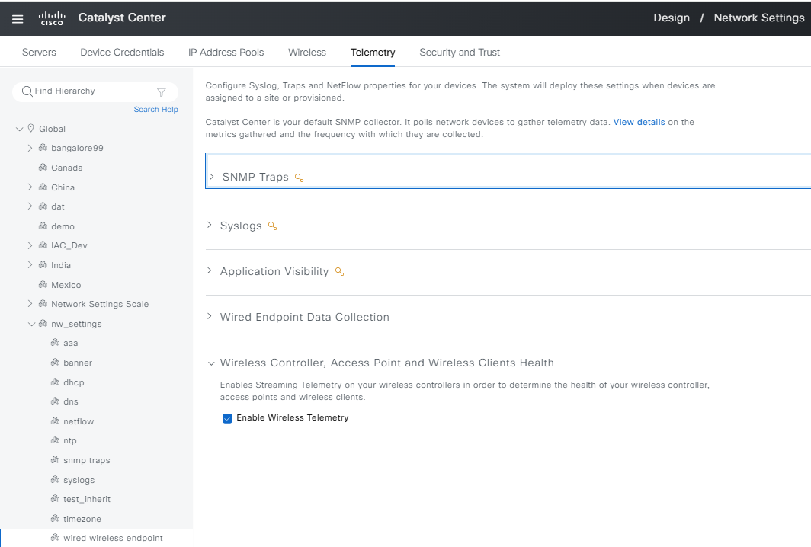

# Network Settings and Ip Pools reservation workflow !!
Workflow Playbook for configuring and updatings Network Settings and Ip Pools reservation on sites
This workflow playbook is supported from Catalyst Center Release version 2.3.7.6

catalyst_center_version: Define the version of Catalyst Center for which Scripts to run for legacy configs, you could keep it same.
role_details defines the accesss destails for the role.
network_settings_details: Details of Network settings 
To define the details you can refer the full workflow specification: https://galaxy.ansible.com/ui/repo/published/cisco/dnac/content/module/network_settings_workflow_manager/

To run this workflow, you follow the README.md 

## Example run: (Create network settings)
ansible-playbook -i host_inventory_dnac1/hosts.yml workflows/network_settings/playbook/network_settings_playbook.yml --e VARS_FILE_PATH=../vars/network_settings_vars.yml -vvv 

## Example run: (Create IP Pools and Reserve IP pools on sites)
ansible-playbook -i host_inventory_dnac1/hosts.yml workflows/network_settings/playbook/network_settings_playbook.yml --e VARS_FILE_PATH=../vars/global_pool_and_reserve_pools_on_sites.yml -vvv 

## Updating servers on sites AAA NTP, DNS, DHCP, TimeZone, SNMP, Logging, Banner etc.
ansible-playbook -i host_inventory_dnac1/hosts.yml workflows/network_settings/playbook/network_settings_playbook.yml --e VARS_FILE_PATH=../vars/server_update_aaa_ntp_dns_dhcp_tz_banner_syslog_snmp_netflow.yml -vvv 

##Example run: Delete Network Settings

ansible-playbook -i host_inventory_dnac1/hosts.yml workflows/network_settings/playbook/delete_network_settings_playbook.yml --e VARS_FILE_PATH=../vars/network_settings_vars.yml -vvv 

##The Sample host_inventory_dnac1/hosts.yml

```bash
catalyst_center_hosts:
    hosts:
        catalyst_center220:
            dnac_host: xx.xx.xx.xx.
            dnac_password: XXXXXXXX
            dnac_port: 443
            dnac_timeout: 60
            dnac_username: admin
            dnac_verify: false
            dnac_version: 2.3.7.6
            dnac_debug: true
            dnac_log_level: INFO
            dnac_log: true
```
User Inputs for Users and roles are stored in  workflows/users_and_roles/vars/users_and_roles_workflow_inputs.yml

##Validate user input before running though ansible
```bash
(pyats) pawansi@PAWANSI-M-81A3 dnac_ansible_workflows % ./tools/validate.sh -s workflows/network_settings/schema/nw_settings_schema.yml -d workflows/network_settings/vars/network_settings_vars.yml
workflows/network_settings/schema/nw_settings_schema.yml
workflows/network_settings/vars/network_settings_vars.yml
yamale   -s workflows/network_settings/schema/nw_settings_schema.yml  workflows/network_settings/vars/network_settings_vars.yml
Validating /Users/pawansi/dnac_ansible_workflows/workflows/network_settings/vars/network_settings_vars.yml...
Validation success! 👍
```

## Understanding the Configs for Network Settings Tasks
1. ### Add/update network servers separate
    #### a. AAA
    Update the network server with only the AAA field (network, client/endpoint):
    + Example input config (1):
      ```yaml
        network_settings_details:
          - network_management_details:
            - site_name: Global/nw_settings/aaa
              settings:
                network_aaa:
                  primary_server_address: 204.192.1.249
                  protocol: RADIUS
                  server_type: AAA
                client_and_endpoint_aaa:
                  primary_server_address: 204.192.1.252
                  secondary_server_address: 204.192.1.249
                  protocol: RADIUS
                  server_type: AAA
      ```
      mapping config to UI Actions:
      
      

    + Example input config (2):
      ```yaml
        network_settings_details:
          - network_management_details:
            - site_name: Global/nw_settings/aaa
              settings:
                network_aaa:
                  pan_address: 172.23.241.229
                  primary_server_address: 204.192.1.245
                  protocol: RADIUS
                  server_type: ISE
                client_and_endpoint_aaa:
                  pan_address: 172.23.241.229
                  primary_server_address: 172.23.241.229
                  protocol: RADIUS
                  server_type: ISE
      ```
      mapping config to UI Actions:
      
      

    #### b. DHCP
    Update the network server with only the 'DHCP' field:
    + Example input config:
      ```yaml
        network_settings_details:
          - network_management_details:
            - site_name: Global/nw_settings/dhcp
              settings:
                dhcp_server:
                  - 204.192.3.40
                  - 2004:192:3::40
      ```
      mapping config to UI Actions:
      

    #### c. DNS
    Update the network server with only the 'DNS' field:
    + Example input config (1):
      ```yaml
        network_settings_details:
          - network_management_details:
            - site_name: Global/nw_settings/dns
              settings:
                dns_server:
                  domain_name: ''
                  primary_ip_address: 204.192.3.40
                  secondary_ip_address: 2040:50:0::0
      ```
      mapping config to UI Actions:
      

    + Example input config (2):
      ```yaml
        network_settings_details:
          - network_management_details:
            - site_name: Global/nw_settings/dns
              settings:
                dns_server:
                  domain_name: cisco.local
                  primary_ip_address: 204.192.3.40
                  secondary_ip_address: 2040:50:0::0
      ```
      mapping config to UI Actions:
      


    #### d. NTP
    Update the network server with only the 'NTP' field:
    + Example input config:
      ```yaml
        network_settings_details:
          - network_management_details:
            - site_name: Global/nw_settings/ntp
              settings:
                ntp_server:
                  - 204.192.3.40
                  - 1.1.1.1
      ```
      mapping config to UI Actions:
      

    #### d. Time Zone
    Update the network server with only the 'Time Zone' field:
    + Example input config:
      ```yaml
        network_settings_details:
          - network_management_details:
            - site_name: Global/nw_settings/timezone
              settings:
                timezone: America/Los_Angeles
      ```
      mapping config to UI Actions:
      

    #### e. Message of the Day
    Update the network server with only the 'Message of the Day' field:
    + Example input config (1):
      ```yaml
        network_settings_details:
          - network_management_details:
            - site_name: Global/nw_settings/banner
              settings:
                message_of_the_day:
                  banner_message: "Test banner separate"
                  retain_existing_banner: false
      ```
      mapping config to UI Actions:
      

    + Example input config (2):
      ```yaml
        network_settings_details:
          - network_management_details:
            - site_name: Global/nw_settings/banner
              settings:
                message_of_the_day:
                  banner_message: "Test banner separate (new)"
                  retain_existing_banner: false
      ```
      mapping config to UI Actions:
      


    #### f. SNMP Traps
    Update the network server with only the 'SNMP Traps' field:
    + Example input config (1):
      ```yaml
        network_settings_details:
          - network_management_details:
            - site_name: Global/nw_settings/snmp traps
              settings:
                snmp_server:
                  configure_dnac_ip: true
                  ip_addresses:
                    - 8.8.8.8
                    - 2.2.2.2
      ```
      mapping config to UI Actions:
      

    + Example input config (2):
      ```yaml
        network_settings_details:
          - network_management_details:
            - site_name: Global/nw_settings/snmp traps
              settings:
                snmp_server:
                  ip_addresses:
                    - 80.80.80.80
      ```
      mapping config to UI Actions:
      

    #### g. Syslogs
    Update the network server with only the 'Syslogs' field:
    + Example input config (1):
      ```yaml
        network_settings_details:
          - network_management_details:
            - site_name: Global/nw_settings/syslogs
              settings:
                syslog_server:
                  configure_dnac_ip: true
                  ip_addresses:
                    - 9.9.9.9
                    - 3.3.3.3
      ```
      mapping config to UI Actions:
      

    + Example input config (2):
      ```yaml
        network_settings_details:
          - network_management_details:
            - site_name: Global/nw_settings/syslogs
              settings:
                syslog_server:
                  ip_addresses:
                    - 90.90.90.90
      ```
      mapping config to UI Actions:
      

    
    #### h. Application Visibility
    Update the network server with only the 'Application Visibility' field:
    + Example input config (1):
      ```yaml
        network_settings_details:
          - network_management_details:
            - site_name: Global/nw_settings/netflow
              settings:
                netflow_collector:
                  collector_type: Telemetry_broker_or_UDP_director
                  ip_address: "1.1.1.2"
                  port: 12
                  enable_on_wired_access_devices: true
      ```
      mapping config to UI Actions:
      

    + Example input config (2):
      ```yaml
        network_settings_details:
          - network_management_details:
            - site_name: Global/nw_settings/netflow
              settings:
                netflow_collector:
                  collector_type: Builtin
      ```
      mapping config to UI Actions:
      

    #### j. Wired Endpoint Data Collection
    Update the network server with only the 'Wired Endpoint Data Collection' field:
    + Example input config:
      ```yaml
        network_settings_details:
          - network_management_details:
            - site_name: Global/nw_settings/wired wireless endpoint
              settings:
                wired_data_collection:
                  enable_wired_data_collection: true
      ```
      mapping config to UI Actions:
      

    #### k. Wireless Controller, Access Point and Wireless Clients Health
    Update the network server with only the 'Wireless Controller, Access Point and Wireless Clients Health' field:
    + Example input config:
      ```yaml
        network_settings_details:
          - network_management_details:
            - site_name: Global/nw_settings/wired wireless endpoint
              settings:
                wireless_telemetry:
                  enable_wireless_telemetry: true
      ```
      mapping config to UI Actions:
      

* Note: If you have updated the network server at the Global site, then at the other sites under Global, if they have not yet updated the network server, they will inherit the values from the Global site
  

2. ### Add/update all network servers in a single input.
Example input config:
```yaml
  network_settings_details:
    - network_management_details:
      - site_name: Global/nw_settings
        settings:
          network_aaa:
            pan_address: 172.23.241.229
            primary_server_address: 204.192.1.245
            protocol: RADIUS
            server_type: ISE
          client_and_endpoint_aaa:
            pan_address: 172.23.241.229
            primary_server_address: 172.23.241.229
            protocol: RADIUS
            server_type: ISE
          dhcp_server:
            - 204.192.3.40
            - 2004:192:3::40
          dns_server:
            domain_name: cisco.local
            primary_ip_address: 204.192.3.40
            secondary_ip_address: 2006:1:1::1
          ntp_server:
            - 204.192.3.40
            - 1.1.1.1
          message_of_the_day:
            banner_message: " This Device is part of Solution Automation Testbed\n Please log off if you are not intended user\n Contact phannguy for further details\n "
            retain_existing_banner: false
          netflow_collector:
            collector_type: Builtin
            enable_on_wired_access_devices: false
          snmp_server:
            configure_dnac_ip: true
            ip_addresses:
              - 8.8.8.8
              - 2.2.2.2
          syslog_server:
            configure_dnac_ip: true
            ip_addresses:
              - 6.6.6.6
              - 3.3.3.3
          wired_data_collection:
            enable_wired_data_collection: true
          wireless_telemetry:
            enable_wireless_telemetry: true
          timezone: GMT
```

* Note: If the 'site' parameter is not provided, it will default to the Global site.
```yaml
  network_settings_details:
    - network_management_details:
        - settings:
          network_aaa:
            pan_address: 172.23.241.229
            primary_server_address: 204.192.1.245
            protocol: RADIUS
            server_type: ISE
          client_and_endpoint_aaa:
            pan_address: 172.23.241.229
            primary_server_address: 172.23.241.229
            protocol: RADIUS
            server_type: ISE
          dhcp_server:
            - 204.192.3.40
            - 2004:192:3::40
          dns_server:
            domain_name: cisco.local
            primary_ip_address: 204.192.3.40
            secondary_ip_address: 2006:1:1::1
          ntp_server:
            - 204.192.3.40
            - 1.1.1.1
          message_of_the_day:
            banner_message: " This Device is part of Solution Automation Testbed\n Please log off if you are not intended user\n Contact phannguy for further details\n "
            retain_existing_banner: false
          netflow_collector:
            collector_type: Builtin
            enable_on_wired_access_devices: false
          snmp_server:
            configure_dnac_ip: true
            ip_addresses:
              - 8.8.8.8
              - 2.2.2.2
          syslog_server:
            configure_dnac_ip: true
            ip_addresses:
              - 6.6.6.6
              - 3.3.3.3
          wired_data_collection:
            enable_wired_data_collection: true
          wireless_telemetry:
            enable_wireless_telemetry: true
          timezone: GMT
```

3. ### Delete & reset value
The API currently does not support the Deleted method in network settings, so we will remove network servers by updating them with empty values
```yaml
  network_settings_details:
    - network_management_details:
      - site_name: Global/nw_settings
        settings:
          # API bug? not support
          network_aaa: {}
          client_and_endpoint_aaa: {}

          # API work, but module bug
          dhcp_server: {}
          dns_server: {}
          ntp_server: {}

          # API document? not need unset
          message_of_the_day: {}
          timezone: {}

          netflow_collector:
            collector_type: Builtin
            enable_on_wired_access_devices: false
          snmp_server:
            configure_dnac_ip: false
            ip_addresses: []
          syslog_server:
            configure_dnac_ip: false
            ip_addresses: []
          wired_data_collection:
            enable_wired_data_collection: false
          wireless_telemetry:
            enable_wireless_telemetry: false
```

4. ### How to run
    #### a. Example of a playbook run with vars_files
    ```yaml
    tasks:
      ...
      #Create Global Pools, and Network Settings etc 
      - name: Create/Update Global Pools, Subpools and Network Settings etc 
        cisco.dnac.network_settings_workflow_manager:
          <<: *dnac_login
          state: merged
          config: "{{ network_settings_details }}"
        when: network_settings_details is defined
      ...
    ```
    -> cmd to run: 
    ```bash
    ansible-playbook
      -i ./inventory/demo_lab/inventory_demo_lab.yml # refer to DNAC to run
      ./workflows/network_settings/playbook/network_settings_playbook.yml # playbook will run this
      --extra-vars VARS_FILE_PATH=./../vars/network_settings_vars.yml # location of the input file for the playbook to execute
      -vvv # return detailed information about the message; the more 'v', more detailed
    ```

## Creating Bulk Network settings confiogurations using JINJA template and using the playbook
To run scale network settings, we need to create a scale site first.
1. ### Create scale site
#### 1a. Jinja for create site:
```bash
design_sites:
  - site:
      area:
        name: Network Settings Scale
        parent_name: Global
    site_type: area

  - site:
      area:
        name: {{site_name}}-{{ i|string }}
        parentName: Global/Network Settings Scale
    type: area

```

#### 1b. Playbook:
```yaml
    - name: Set up site config from the design_sites config
      cisco.dnac.site_workflow_manager:
        <<: *common_config
        state: merged
        config: "{{ design_sites }}"
```

#### 1c. Input file
For example, if the variable (i=10; site_name='country') it will create a site with:
```yaml
design_sites:
  - site:
      area:
        name: Network Settings Scale
        parent_name: Global
    site_type: area

  - site:
      area:
        name: country-1
        parentName: Global/Network Settings Scale
    type: area
  - site:
      area:
        name: country-2
        parentName: Global/Network Settings Scale
    type: area
    ...
  - site:
      area:
        name: country-10
        parentName: Global/Network Settings Scale
    type: area

```

#### 1d. UI action


2. ### Create scale network settings
#### 2a. Jinja for create network settings:
```bash
network_settings:


  - network_management_details:
    - settings:
        network_aaa:
          pan_address: 172.23.241.229
          primary_server_address: 172.23.241.229
          protocol: RADIUS
          server_type: ISE
        message_of_the_day:
          banner_message: "Site-specific: {{ site_name }} . Scale for set up network settings (new)"
          retain_existing_banner: False
        wired_data_collection:
          enable_wired_data_collection: True
        wireless_telemetry:
          enable_wireless_telemetry: True
      site_name: Global/Network Settings Scale/{{ site_name }}

```

#### 2b. Playbook:
```yaml
    - name: Set up network settings config from network_settings config
      cisco.dnac.network_settings_workflow_manager:
        <<: *common_config
        state: merged
        config: "{{ network_settings }}"
```

#### 2c. Input file
For example, if the variable (i=10; site_name='country') it will create a config with:
```yaml
network_settings:
  - network_management_details:
    - settings:
        network_aaa:
          pan_address: 172.23.241.229
          primary_server_address: 172.23.241.229
          protocol: RADIUS
          server_type: ISE
        message_of_the_day:
          banner_message: "Site-specific: country-1 . Scale for set up network settings (new)"
          retain_existing_banner: False
        wired_data_collection:
          enable_wired_data_collection: True
        wireless_telemetry:
          enable_wireless_telemetry: True
      site_name: Global/Network Settings Scale/country-1
  - network_management_details:
    - settings:
        network_aaa:
          pan_address: 172.23.241.229
          primary_server_address: 172.23.241.229
          protocol: RADIUS
          server_type: ISE
        message_of_the_day:
          banner_message: "Site-specific: country-2 . Scale for set up network settings (new)"
          retain_existing_banner: False
        wired_data_collection:
          enable_wired_data_collection: True
        wireless_telemetry:
          enable_wireless_telemetry: True
      site_name: Global/Network Settings Scale/country-2
  ...
  - network_management_details:
    - settings:
        network_aaa:
          pan_address: 172.23.241.229
          primary_server_address: 172.23.241.229
          protocol: RADIUS
          server_type: ISE
        message_of_the_day:
          banner_message: "Site-specific: country-10 . Scale for set up network settings (new)"
          retain_existing_banner: False
        wired_data_collection:
          enable_wired_data_collection: True
        wireless_telemetry:
          enable_wireless_telemetry: True
      site_name: Global/Network Settings Scale/country-10

```

#### 2d. UI action


## Referances
* Note: The environment is used for the references in the above instructions.
```
  python: 3.12.0

  dnac_version: 2.3.7.6

  ansible: 9.9.0
  ansible-core: 2.16.10
  ansible-runner: 2.4.0

  dnacentersdk: 2.8.3
  cisco.dnac: 6.29.0
  ansible.utils: 5.1.2
```