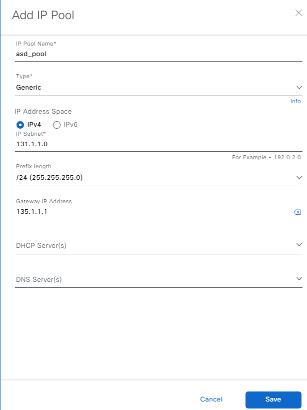

# Network Settings and Ip Pools reservation workflow !!
Workflow Playbook for configuring and updatings Network Settings and Ip Pools reservation on sites
This workflow playbook is supported from Catalyst Center Release version 2.3.7.6

catalyst_center_version: Define the version of Catalyst Center for which Scripts to run for legacy configs, you could keep it same.
role_details defines the accesss destails for the role.
network_settings_details: Details of Network settings 
To define the details you can refer the full workflow specification: https://galaxy.ansible.com/ui/repo/published/cisco/dnac/content/module/network_settings_workflow_manager/

To run this workflow, you follow the README.md 

## Example run: (Create network settings)
ansible-playbook -i host_inventory_dnac1/hosts.yml workflows/network_settings/playbook/network_settings_playbook.yml --e VARS_FILE_PATH=../vars/network_settings_vars.yml -vvv 

## Example run: (Create IP Pools and Reserve IP pools on sites)
ansible-playbook -i host_inventory_dnac1/hosts.yml workflows/network_settings/playbook/network_settings_playbook.yml --e VARS_FILE_PATH=../vars/global_pool_and_reserve_pools_on_sites.yml -vvv 

## Updating servers on sites AAA NTP, DNS, DHCP, TimeZone, SNMP, Logging, Banner etc.
ansible-playbook -i host_inventory_dnac1/hosts.yml workflows/network_settings/playbook/network_settings_playbook.yml --e VARS_FILE_PATH=../vars/server_update_aaa_ntp_dns_dhcp_tz_banner_syslog_snmp_netflow.yml -vvv 

##Example run: Delete Network Settings

ansible-playbook -i host_inventory_dnac1/hosts.yml workflows/network_settings/playbook/delete_network_settings_playbook.yml --e VARS_FILE_PATH=../vars/network_settings_vars.yml -vvv 

##The Sample host_inventory_dnac1/hosts.yml

```bash
catalyst_center_hosts:
    hosts:
        catalyst_center220:
            dnac_host: xx.xx.xx.xx.
            dnac_password: XXXXXXXX
            dnac_port: 443
            dnac_timeout: 60
            dnac_username: admin
            dnac_verify: false
            dnac_version: 2.3.7.6
            dnac_debug: true
            dnac_log_level: INFO
            dnac_log: true
```
User Inputs for Users and roles are stored in  workflows/users_and_roles/vars/users_and_roles_workflow_inputs.yml

##Validate user input before running though ansible
```bash
(pyats) pawansi@PAWANSI-M-81A3 dnac_ansible_workflows % ./tools/validate.sh -s workflows/network_settings/schema/nw_settings_schema.yml -d workflows/network_settings/vars/network_settings_vars.yml
workflows/network_settings/schema/nw_settings_schema.yml
workflows/network_settings/vars/network_settings_vars.yml
yamale   -s workflows/network_settings/schema/nw_settings_schema.yml  workflows/network_settings/vars/network_settings_vars.yml
Validating /Users/pawansi/dnac_ansible_workflows/workflows/network_settings/vars/network_settings_vars.yml...
Validation success! 👍
```

## Understanding the Configs for Network Settings Tasks
### 1. Add/Update Network Servers Separately
  #### a. AAA
  Update the network server with only the AAA field (network, client/endpoint):
  + Example input config (1):
    ```yaml
    network_settings_details:
      - network_management_details:
        - site_name: Global/nw_settings/aaa
          settings:
            network_aaa:
              primary_server_address: 204.192.1.249
              protocol: RADIUS
              server_type: AAA
            client_and_endpoint_aaa:
              primary_server_address: 204.192.1.252
              secondary_server_address: 204.192.1.249
              protocol: RADIUS
              server_type: AAA
    ```
    mapping config to UI Actions:
    
    

  + Example input config (2):
    ```yaml
    network_settings_details:
      - network_management_details:
        - site_name: Global/nw_settings/aaa
          settings:
            network_aaa:
              pan_address: 172.23.241.229
              primary_server_address: 204.192.1.245
              protocol: RADIUS
              server_type: ISE
            client_and_endpoint_aaa:
              pan_address: 172.23.241.229
              primary_server_address: 172.23.241.229
              protocol: RADIUS
              server_type: ISE
    ```
    mapping config to UI Actions:
    
    

  #### b. DHCP
  Update the network server with only the DHCP field:
  + Example input config:
    ```yaml
    network_settings_details:
      - network_management_details:
        - site_name: Global/nw_settings/dhcp
          settings:
            dhcp_server:
              - 204.192.3.40
              - 2004:192:3::40
    ```
    mapping config to UI Actions:
    

  #### c. DNS
  Update the network server with only the DNS field:
  + Example input config (1):
    ```yaml
    network_settings_details:
      - network_management_details:
        - site_name: Global/nw_settings/dns
          settings:
            dns_server:
              domain_name: ''
              primary_ip_address: 204.192.3.40
              secondary_ip_address: 2040:50:0::0
    ```
    mapping config to UI Actions:
    

  + Example input config (2):
    ```yaml
    network_settings_details:
      - network_management_details:
        - site_name: Global/nw_settings/dns
          settings:
            dns_server:
              domain_name: cisco.local
              primary_ip_address: 204.192.3.40
              secondary_ip_address: 2040:50:0::0
    ```
    mapping config to UI Actions:
    

  #### d. NTP
  Update the network server with only the NTP field:
  + Example input config:
    ```yaml
    network_settings_details:
      - network_management_details:
        - site_name: Global/nw_settings/ntp
          settings:
            ntp_server:
              - 204.192.3.40
              - 1.1.1.1
    ```
    mapping config to UI Actions:
    

  #### e. Time Zone
  Update the network server with only the Time Zone field:
  + Example input config:
    ```yaml
    network_settings_details:
      - network_management_details:
        - site_name: Global/nw_settings/timezone
          settings:
            timezone: America/Los_Angeles
    ```
    mapping config to UI Actions:
    

  #### f. Message of the Day
  Update the network server with only the Message of the Day field:
  + Example input config (1):
    ```yaml
    network_settings_details:
      - network_management_details:
        - site_name: Global/nw_settings/banner
          settings:
            message_of_the_day:
              banner_message: "Test banner separate"
              retain_existing_banner: false
    ```
    mapping config to UI Actions:
    

  + Example input config (2):
    ```yaml
    network_settings_details:
      - network_management_details:
        - site_name: Global/nw_settings/banner
          settings:
            message_of_the_day:
              banner_message: "Test banner separate (new)"
              retain_existing_banner: false
    ```
    mapping config to UI Actions:
    

  #### g. SNMP Traps
  Update the network server with only the SNMP Traps field:
  + Example input config (1):
    ```yaml
    network_settings_details:
      - network_management_details:
        - site_name: Global/nw_settings/snmp traps
          settings:
            snmp_server:
              configure_dnac_ip: true
              ip_addresses:
                - 8.8.8.8
                - 2.2.2.2
    ```
    mapping config to UI Actions:
    

  + Example input config (2):
    ```yaml
    network_settings_details:
      - network_management_details:
        - site_name: Global/nw_settings/snmp traps
          settings:
            snmp_server:
              ip_addresses:
                - 80.80.80.80
    ```
    mapping config to UI Actions:
    

  #### h. Syslogs
  Update the network server with only the Syslogs field:
  + Example input config (1):
    ```yaml
    network_settings_details:
      - network_management_details:
        - site_name: Global/nw_settings/syslogs
          settings:
            syslog_server:
              configure_dnac_ip: true
              ip_addresses:
                - 9.9.9.9
                - 3.3.3.3
    ```
    mapping config to UI Actions:
    

  + Example input config (2):
    ```yaml
    network_settings_details:
      - network_management_details:
        - site_name: Global/nw_settings/syslogs
          settings:
            syslog_server:
              ip_addresses:
                - 90.90.90.90
    ```
    mapping config to UI Actions:
    

  #### i. Application Visibility
  Update the network server with only the Application Visibility field:
  + Example input config (1):
    ```yaml
    network_settings_details:
      - network_management_details:
        - site_name: Global/nw_settings/netflow
          settings:
            netflow_collector:
              collector_type: Telemetry_broker_or_UDP_director
              ip_address: "1.1.1.2"
              port: 12
              enable_on_wired_access_devices: true
    ```
    mapping config to UI Actions:
    

  + Example input config (2):
    ```yaml
    network_settings_details:
      - network_management_details:
        - site_name: Global/nw_settings/netflow
          settings:
            netflow_collector:
              collector_type: Builtin
    ```
    mapping config to UI Actions:
    

  #### j. Wired Endpoint Data Collection
  Update the network server with only the Wired Endpoint Data Collection field:
  + Example input config:
    ```yaml
    network_settings_details:
      - network_management_details:
        - site_name: Global/nw_settings/wired wireless endpoint
          settings:
            wired_data_collection:
              enable_wired_data_collection: true
    ```
    mapping config to UI Actions:
    

  #### k. Wireless Controller, Access Point, and Wireless Clients Health
  Update the network server with only the Wireless Controller, Access Point, and Wireless Clients Health field:
  + Example input config:
    ```yaml
    network_settings_details:
      - network_management_details:
        - site_name: Global/nw_settings/wired wireless endpoint
          settings:
            wireless_telemetry:
              enable_wireless_telemetry: true
    ```
    mapping config to UI Actions:
    

*Note:* If you have updated the network server at the Global site, then at other sites under Global, if they have not yet updated the network server, they will inherit the values from the Global site.


### 2. Add/Update All Network Servers in a Single Input
  + Example input config:
    ```yaml
    network_settings_details:
      - network_management_details:
        - site_name: Global/nw_settings
          settings:
            network_aaa:
              pan_address: 172.23.241.229
              primary_server_address: 204.192.1.245
              protocol: RADIUS
              server_type: ISE
            client_and_endpoint_aaa:
              pan_address: 172.23.241.229
              primary_server_address: 172.23.241.229
              protocol: RADIUS
              server_type: ISE
            dhcp_server:
              - 204.192.3.40
              - 2004:192:3::40
            dns_server:
              domain_name: cisco.local
              primary_ip_address: 204.192.3.40
              secondary_ip_address: 2006:1:1::1
            ntp_server:
              - 204.192.3.40
              - 1.1.1.1
            message_of_the_day:
              banner_message: " This Device is part of Solution Automation Testbed\n Please log off if you are not intended user\n Contact phannguy for further details\n "
              retain_existing_banner: false
            netflow_collector:
              collector_type: Builtin
              enable_on_wired_access_devices: false
            snmp_server:
              configure_dnac_ip: true
              ip_addresses:
                - 8.8.8.8
                - 2.2.2.2
            syslog_server:
              configure_dnac_ip: true
              ip_addresses:
                - 6.6.6.6
                - 3.3.3.3
            wired_data_collection:
              enable_wired_data_collection: true
            wireless_telemetry:
              enable_wireless_telemetry: true
            timezone: GMT
    ```

  - Note: If the 'site' parameter is not provided, it will default to the Global site.
    ```yaml
    network_settings_details:
      - network_management_details:
          - settings:
            network_aaa:
              pan_address: 172.23.241.229
              primary_server_address: 204.192.1.245
              protocol: RADIUS
              server_type: ISE
            client_and_endpoint_aaa:
              pan_address: 172.23.241.229
              primary_server_address: 172.23.241.229
              protocol: RADIUS
              server_type: ISE
            dhcp_server:
              - 204.192.3.40
              - 2004:192:3::40
            dns_server:
              domain_name: cisco.local
              primary_ip_address: 204.192.3.40
              secondary_ip_address: 2006:1:1::1
            ntp_server:
              - 204.192.3.40
              - 1.1.1.1
            message_of_the_day:
              banner_message: " This Device is part of Solution Automation Testbed\n Please log off if you are not intended user\n Contact phannguy for further details\n "
              retain_existing_banner: false
            netflow_collector:
              collector_type: Builtin
              enable_on_wired_access_devices: false
            snmp_server:
              configure_dnac_ip: true
              ip_addresses:
                - 8.8.8.8
                - 2.2.2.2
            syslog_server:
              configure_dnac_ip: true
              ip_addresses:
                - 6.6.6.6
                - 3.3.3.3
            wired_data_collection:
              enable_wired_data_collection: true
            wireless_telemetry:
              enable_wireless_telemetry: true
            timezone: GMT
    ```

### 3. Delete & Reset Values
The API currently does not support the Deleted method in network settings, so we will remove network servers by updating them with empty values:
```yaml
network_settings_details:
  - network_management_details:
    - site_name: Global/nw_settings
      settings:
        network_aaa: {}
        client_and_endpoint_aaa: {}
        dhcp_server: {}
        dns_server: {}
        ntp_server: {}
        message_of_the_day: {}
        timezone: {}
        netflow_collector:
          collector_type: Builtin
          enable_on_wired_access_devices: false
        snmp_server:
          configure_dnac_ip: false
          ip_addresses: []
        syslog_server:
          configure_dnac_ip: false
          ip_addresses: []
        wired_data_collection:
          enable_wired_data_collection: false
        wireless_telemetry:
          enable_wireless_telemetry: false
```

### 4. How to Run
  #### a. Example of a Playbook Run with `vars_files`
  ```yaml
  tasks:
    ...
    # Create/Update Global Pools, Subpools, and Network Settings etc.
    - name: Create/Update Global Pools, Subpools, and Network Settings etc 
      cisco.dnac.network_settings_workflow_manager:
        <<: *dnac_login
        state: merged
        config: "{{ network_settings_details }}"
      when: network_settings_details is defined
    ...
  ```
  **Command to Run:**
  ```bash
  ansible-playbook \
    -i ./inventory/demo_lab/inventory_demo_lab.yml \ # refer to DNAC to run
    ./workflows/network_settings/playbook/network_settings_playbook.yml \ # playbook will run this
    --extra-vars VARS_FILE_PATH=./../vars/network_settings_vars.yml \ # location of the input file for the playbook to execute
    -vvv # return detailed information about the message; the more 'v', the more detailed
  ```


## Creating Bulk Network Settings Configurations Using JINJA Templates and Playbooks
To run scale network settings, we need to create a scalable site first.
### 1. Create a Scale Site

  #### 1a. JINJA Template for Creating a Site
  ```jinja
  design_sites:
    - site:
        area:
          name: Network Settings Scale
          parent_name: Global
      site_type: area
  
    - site:
        area:
          name: {{site_name}}-{{ i|string }}
          parentName: Global/Network Settings Scale
      type: area
  
  ```

  #### 1b. Playbook Example
  ```yaml
      - name: Set up site config from the design_sites config
        cisco.dnac.site_workflow_manager:
          <<: *common_config
          state: merged
          config: "{{ design_sites }}"
  ```

  #### 1c. Input File Example
  For instance, with `i=10` and `site_name='country'`, the template creates:
  ```yaml
  design_sites:
    - site:
        area:
          name: Network Settings Scale
          parent_name: Global
      site_type: area

    - site:
        area:
          name: country-1
          parentName: Global/Network Settings Scale
      type: area
    - site:
        area:
          name: country-2
          parentName: Global/Network Settings Scale
      type: area
    ...
    - site:
        area:
          name: country-10
          parentName: Global/Network Settings Scale
      type: area
  ```

  #### 1d. UI Action
  

### 2. Create Scale Network Settings

  #### 2a. JINJA Template for Creating Network Settings
  ```jinja
  network_settings:
  
  
    - network_management_details:
      - settings:
          network_aaa:
            pan_address: 172.23.241.229
            primary_server_address: 172.23.241.229
            protocol: RADIUS
            server_type: ISE
          message_of_the_day:
            banner_message: "Site-specific: {{ site_name }} . Scale for set up network settings (new)"
            retain_existing_banner: false
          wired_data_collection:
            enable_wired_data_collection: true
          wireless_telemetry:
            enable_wireless_telemetry: true
        site_name: Global/Network Settings Scale/{{ site_name }}
  
  ```

  #### 2b. Playbook Example
  ```yaml
      - name: Set up network settings config from network_settings config
        cisco.dnac.network_settings_workflow_manager:
          <<: *common_config
          state: merged
          config: "{{ network_settings }}"
  ```

  #### 2c. Input File Example
  Assuming `i=10` and `site_name='country'`, the configuration looks like:
  ```yaml
  network_settings:
    - network_management_details:
      - settings:
          network_aaa:
            pan_address: 172.23.241.229
            primary_server_address: 172.23.241.229
            protocol: RADIUS
            server_type: ISE
          message_of_the_day:
            banner_message: "Site-specific: country-1 . Scale for set up network settings (new)"
            retain_existing_banner: false
          wired_data_collection:
            enable_wired_data_collection: true
          wireless_telemetry:
            enable_wireless_telemetry: true
        site_name: Global/Network Settings Scale/country-1
    - network_management_details:
      - settings:
          network_aaa:
            pan_address: 172.23.241.229
            primary_server_address: 172.23.241.229
            protocol: RADIUS
            server_type: ISE
          message_of_the_day:
            banner_message: "Site-specific: country-2 . Scale for set up network settings (new)"
            retain_existing_banner: false
          wired_data_collection:
            enable_wired_data_collection: true
          wireless_telemetry:
            enable_wireless_telemetry: true
        site_name: Global/Network Settings Scale/country-2
    ...
    - network_management_details:
      - settings:
          network_aaa:
            pan_address: 172.23.241.229
            primary_server_address: 172.23.241.229
            protocol: RADIUS
            server_type: ISE
          message_of_the_day:
            banner_message: "Site-specific: country-10 . Scale for set up network settings (new)"
            retain_existing_banner: false
          wired_data_collection:
            enable_wired_data_collection: true
          wireless_telemetry:
            enable_wireless_telemetry: true
        site_name: Global/Network Settings Scale/country-10

  ```

  #### 2d. UI Action
  
  
  


## Understanding the Configurations for IP Pool Tasks
Regarding the IP pool, we have two concepts: a global pool (`ip-pool`) and a reserved pool (`sub-pool`).
### 1. Global Pool
Manages IPv4 and IPv6 IP pools at the global level.

  #### a. Add IP Pool (Global Pool)

  + Example input config:
    ```yaml
    network_settings_details:
      - global_pool_details:
          settings:
            ip_pool:
            - name: asd_pool
              pool_type: Generic
              ip_address_space: IPv4
              cidr: 135.1.1.0/24
              gateway: 135.1.1.1
              dhcp_server_ips: null
              dns_server_ips: null
    ```
    mapping config to UI Actions:

    

  * Parameter Explanation:
      ```yaml
      name: The name of the IP address pool.
      pool_type: The type of pool, typically set to Generic.
      ip_address_space: Specifies whether the pool is for IPv4 or IPv6.
      cidr: The CIDR notation for the IP address range (e.g., 40.40.46.0/24).
      gateway: The gateway IP address for the pool. (Optional)
      dhcp_server_ips: A list of DHCP server IPs that has been created in the network server at the global site. (Optional)
      dns_server_ips: A list of DNS server IP addresses that has been created in the network server at the global site. (Optional)
      ```

  #### b. Edit IP Pool (Global Pool)
  We can only edit 'name', 'dhcp_server_ips', and 'dns_server_ips' in the global pool.
  
  + Example input config:
    ```yaml
    network_settings_details:
      - global_pool_details:
          settings:
            ip_pool:
            - prev_name: asd_pool
              name: asd_pool_new
              ip_address_space: ipv4
              cidr: 135.1.1.0/24
              dhcp_server_ips:
                - 1.1.1.1
                - 2.2.2.2
              dns_server_ips:
                - 1.1.1.1
    ```
    The 'cidr' and 'ip_address_space' parameters will be used for identification (not by 'name' parameter).

  #### c. Delete IP Pool (Global Pool)
  + Delete One IP Pool at Global Level:
    ```yaml
    network_settings_details:
      - global_pool_details:
          settings:
            ip_pool:
            - name: asd_pool
    ```

  + Delete All IP Pools with a Flag:
    ```yaml
    network_settings_details:
      - global_pool_details:
          settings:
            ip_pool:
            - force_delete: true
    ```
    mapping config to UI Actions:

    

  - **Note:** If the IP pool has been reserved, it cannot be deleted.

  #### d. Add/Edit/Delete Bulk IP Pool Configurations
  + Example Config for Adding Multiple IP Pools (4 IP Pools):
    ```yaml
    network_settings_details: 
      - global_pool_details:
          settings:
            ip_pool:
            - name: underlay
              gateway: 204.1.1.1
              ip_address_space: IPv4
              cidr: 204.1.1.0/24
              pool_type: Generic
              dhcp_server_ips:
                - 204.192.3.40
              dns_server_ips:
                - 171.70.168.183
            - name: underlay1
              gateway: 204.1.2.1
              ip_address_space: IPv4
              cidr: 204.1.2.0/24
              pool_type: Generic
              dhcp_server_ips:
                - 204.192.3.40
              dns_server_ips:
                - 171.70.168.183
            - name: SENSORPool
              gateway: 204.1.48.1
              ip_address_space: IPv4
              cidr: 204.1.48.0/20
              pool_type: Generic
              dhcp_server_ips:
                - 204.192.3.40
              dns_server_ips:
                - 171.70.168.183
            - name: SENSORPool_V6
              gateway: 2004:1:48::1
              ip_address_space: IPv6
              cidr: 2004:1:48::/64
              pool_type: Generic
              dhcp_server_ips:
                - 2004:192:3::40
              dns_server_ips:
                - 2006:1:1::1
    ```

  + Example Config for Editing Multiple IP Pools (3 IP Pools):
    ```yaml
    network_settings_details: 
      - global_pool_details:
          settings:
            ip_pool:
            - prev_name: underlay
              name: underlay_new
              ip_address_space: IPv4
              cidr: 204.1.1.0/24
            - prev_name: underlay1
              name: underlay1_new
              ip_address_space: IPv4
              cidr: 204.1.2.0/24
            - prev_name: SENSORPool_V6
              name: SENSORPool_V6_new
              ip_address_space: IPv6
              cidr: 2004:1:48::/64
    ```

  + Example Config for Deleting Multiple Specific IP Pools (3 IP Pools):
    ```yaml
    network_settings_details: 
      - global_pool_details:
          settings:
            ip_pool:
            - name: underlay_new
            - name: underlay1_new
            - name: SENSORPool_V6_new
    ```

### 2. Reserve IP Subpool
This task reserves sub-pools from a global IP address pool for specific sites in Cisco Catalyst Center. It allows you to allocate a portion of the global IP address pool to a specific site, ensuring that the site has a dedicated range of IP addresses.
  #### a. Add Sub-pool (Reserve IP Pool)
  **Assumption:** The reserve IP pool has been created globally before with the parameter `name: asd_pool` and `cidr: 135.1.1.0/24`.

  + Example input config (1):
    ```yaml
    network_settings_details:
      - reserve_pool_details:
        - site_name: Global/Canada
          name: asd_pool_sub
          pool_type: LAN
          ipv4_global_pool: 135.1.1.0/24
          ipv4_global_pool_name: asd_pool
          ipv4_prefix: true
          ipv4_prefix_length: 25
          ipv4_subnet: 135.1.1.0
          ipv4_gateway: null
          ipv4_dhcp_servers: null
          ipv4_dns_servers: null
          ipv6_address_space: false
          slaac_support: false
    ```
    mapping config to UI Actions:
    

  + Example input config (2):
    ```yaml
    network_settings_details:
      - reserve_pool_details:
        - site_name: Global/Canada
          name: asd_pool_sub
          pool_type: LAN
          ipv4_global_pool: 135.1.1.0/24
          ipv4_global_pool_name: asd_pool
          ipv4_prefix: false
          ipv4_total_host: 10
          ipv4_dhcp_servers: null
          ipv4_dns_servers: null
          ipv6_address_space: false
          slaac_support: false
    ```
    mapping config to UI Actions:
    

  * Parameter Explanation:
    ```yaml
    site_name: The site hierarchy where the sub-pool will be reserved.
    name: The name of the sub-pool.
    pool_type: The type of pool, typically set to Generic.
    ipv4_global_pool: IP v4 Global pool address with cidr, example 175.175.0.0/16.
    ipv4_global_pool_name: Specifies the name to be associated with the IPv4 Global IP Pool. If both 'ipv4_global_pool' and 'ipv4_global_pool_name' are provided, the 'ipv4_global_pool' will be given priority.
    ipv4_prefix: Specifies whether an IPv4 prefix is used.
    ipv4_prefix_length: The length of the IPv4 prefix (e.g., 27).
    ipv4_total_host: The total number of hosts for IPv4, required when the 'ipv4_prefix' is set to false
    ipv4_subnet: The subnet of the reserved IP address range (e.g., 40.40.46.0).
    ipv4_gateway: Provides the gateway's IPv4 address, for example, "175.175.0.1".
    ipv4_dhcp_servers: A list of DHCP server IP addresses that will serve this sub-pool (Optional).
    ipv4_dns_servers: A list of DNS server IP addresses that will serve this sub-pool.
    ipv6_address_space: Specifies whether IPv6 is enabled for this sub-pool. If true, we will have all parameters similar to the above IPv4. (e.g., ipv6_global_pool, ipv6_prefix, ipv6_dhcp_servers, ... ). 
    slaac_support: Specifies whether SLAAC (Stateless Address Autoconfiguration) is supported for IPv6.
    ```

  #### b. Edit IP Subpool
  We can only edit the `name`, `dhcp_server_ips`, and `dns_server_ips` in the IP subpool.
  + Example input config:
    ```yaml
    network_settings_details:
      - reserve_pool_details:
        - site_name: Global/Canada
          prev_name: asd_pool_sub
          name: asd_pool_sub_new
          pool_type: LAN
          ipv4_global_pool: 135.1.1.0/24
          ipv4_dhcp_servers: 
            - 1.1.1.1
          ipv4_dns_servers:
            - 8.8.8.8
          ipv6_address_space: false
    ```

  #### c. Delete IP Subpool
  + Delete One IP Subpool at the Site Level:
    ```yaml
    network_settings_details:
      - reserve_pool_details:
        - site_name: Global/Canada
          name: asd_pool_sub_new
    ```

  + Delete All IP Subpools at the Site Level with a Flag:
    ```yaml
    network_settings_details:
      - reserve_pool_details:
        - site_name: Global/Canada
          force_delete: true
    ```
    mapping config to UI Actions:
    

  #### d. Add/Edit/Delete Bulk IP Subpool Configurations
  + Example Config Input for Adding Multiple IP Subpools (3 IP Subpools | 2 Fields: 1 IPv4, 1 Field: 1 IPv4 + 1 IPv6):
    ```yaml
    network_settings_details: 
      - reserve_pool_details:
        - ipv6_address_space: false
          ipv4_global_pool: 204.1.1.0/24
          ipv4_prefix: true
          ipv4_prefix_length: 25
          ipv4_subnet: 204.1.1.0
          ipv4_gateway: 204.1.1.1
          name: underlay_sub
          site_name: Global/USA/SAN JOSE
          slaac_support: false
          pool_type: LAN
        - ipv6_address_space: false
          ipv4_global_pool: 204.1.1.0/24
          ipv4_prefix: true
          ipv4_prefix_length: 25
          ipv4_subnet: 204.1.1.128
          ipv4_gateway: 204.1.1.129
          name: underlay_sub_small
          site_name: Global/USA/SAN JOSE
          slaac_support: false
          pool_type: LAN
        - ipv6_address_space: true
          ipv4_global_pool: 204.1.48.0/20
          ipv4_prefix: true
          ipv4_prefix_length: 24
          ipv4_subnet: 204.1.48.0/24
          ipv4_gateway: 204.1.48.1
          ipv4_dhcp_servers:
            - 204.192.3.40
          ipv4_dns_servers:
            - 204.192.3.40
          name: SENSORPool_sub
          ipv6_prefix: true
          ipv6_prefix_length: 112
          ipv6_global_pool: 2004:1:48::/64
          ipv6_subnet: 2004:1:48::1:0
          ipv6_gateway: 2004:1:48::1:1
          ipv6_dhcp_servers: 
            - 2004:192:3::40
          ipv6_dns_servers: 
            - 2006:1:1::1
          site_name: Global/USA/SAN JOSE
          slaac_support: false
          pool_type: Generic
    ```

  + Example Config Input for Editing Multiple IP Subpools (3 IP Subpools):
    ```yaml
    network_settings_details: 
      - reserve_pool_details:
        - ipv6_address_space: false
          ipv4_global_pool: 204.1.1.0/24
          prev_name: underlay_sub
          name: underlay_sub_new
          site_name: Global/USA/SAN JOSE
          pool_type: LAN
        - ipv6_address_space: false
          ipv4_global_pool: 204.1.1.0/24
          prev_name: underlay_sub_small
          name: underlay_sub_small_new
          site_name: Global/USA/SAN JOSE
          pool_type: LAN
        - ipv6_address_space: false
          ipv4_global_pool: 204.1.48.0/20
          prev_name: SENSORPool_sub
          name: SENSORPool_sub_new
          site_name: Global/USA/SAN JOSE
          pool_type: Generic
    ```

  + Example Config Input for Deleting Multiple Specific IP Subpools (3 IP Subpools):
    ```yaml
    network_settings_details:
      - reserve_pool_details:
        - site_name: Global/Canada
          name: underlay_sub_new
        - site_name: Global/Canada
          name: underlay_sub_small_new
        - site_name: Global/Canada
          name: SENSORPool_sub_new
    ```

### 3. Add Global Pool and Reserve IP Subpool in One Input
  + Example input configuration:
    ```yaml
    network_settings_details: 
      - global_pool_details:
          settings:
            ip_pool:
            - name: underlay
              gateway: 204.1.1.1
              ip_address_space: IPv4
              cidr: 204.1.1.0/24
              pool_type: Generic
              dhcp_server_ips:
                - 204.192.3.40
              dns_server_ips:
                - 171.70.168.183
            - name: underlay1
              gateway: 204.1.2.1
              ip_address_space: IPv4
              cidr: 204.1.2.0/24
              pool_type: Generic
              dhcp_server_ips:
                - 204.192.3.40
              dns_server_ips:
                - 171.70.168.183
            - name: SENSORPool
              gateway: 204.1.48.1
              ip_address_space: IPv4
              cidr: 204.1.48.0/20
              pool_type: Generic
              dhcp_server_ips:
                - 204.192.3.40
              dns_server_ips:
                - 171.70.168.183
            - name: SENSORPool_V6
              gateway: 2004:1:48::1
              ip_address_space: IPv6
              cidr: 2004:1:48::/64
              pool_type: Generic
              dhcp_server_ips:
                - 2004:192:3::40
              dns_server_ips:
                - 2006:1:1::1
      - reserve_pool_details:
        - ipv6_address_space: false
          ipv4_global_pool: 204.1.1.0/24
          ipv4_prefix: true
          ipv4_prefix_length: 25
          ipv4_subnet: 204.1.1.0
          ipv4_gateway: 204.1.1.1
          name: underlay_sub
          site_name: Global/USA/SAN JOSE
          slaac_support: false
          pool_type: LAN
        - ipv6_address_space: false
          ipv4_global_pool: 204.1.1.0/24
          ipv4_prefix: true
          ipv4_prefix_length: 25
          ipv4_subnet: 204.1.1.128
          ipv4_gateway: 204.1.1.129
          name: underlay_sub_small
          site_name: Global/USA/SAN JOSE
          slaac_support: false
          pool_type: LAN
        - ipv6_address_space: true
          ipv4_global_pool: 204.1.48.0/20
          ipv4_prefix: true
          ipv4_prefix_length: 24
          ipv4_subnet: 204.1.48.0/24
          ipv4_gateway: 204.1.48.1
          ipv4_dhcp_servers:
            - 204.192.3.40
          ipv4_dns_servers:
            - 204.192.3.40
          name: SENSORPool_sub
          ipv6_prefix: true
          ipv6_prefix_length: 112
          ipv6_global_pool: 2004:1:48::/64
          ipv6_subnet: 2004:1:48::1:0
          ipv6_gateway: 2004:1:48::1:1
          ipv6_dhcp_servers: 
            - 2004:192:3::40
          ipv6_dns_servers: 
            - 2006:1:1::1
          site_name: Global/USA/SAN JOSE
          slaac_support: false
          pool_type: Generic
    ```

### 4. How to Run
  **Example Command to Run the IP Pool Playbook with Merged Method:**
  ```bash
  ansible-playbook 
    -i ./inventory/demo_lab/inventory_demo_lab.yml # Reference to DNAC to run
    ./workflows/network_settings/playbook/network_settings_playbook.yml # Playbook that will execute
    --extra-vars VARS_FILE_PATH=./../vars/global_pool_and_reserve_pools_on_sites.yml # Location of the input file for playbook execution
    -vvv # Returns detailed information about the message; the more 'v', the more detail
  ```

  **For the Deleted Method**, change the destination playbook to: `./workflows/network_settings/playbook/delete_network_settings_playbook.yml`

## References

*Note: The environment used for the references in the above instructions is as follows:*

```yaml
python: 3.12.0

dnac_version: 2.3.7.6

ansible: 9.9.0
ansible-core: 2.16.10
ansible-runner: 2.4.0

dnacentersdk: 2.8.4
cisco.dnac: 6.30.0
```