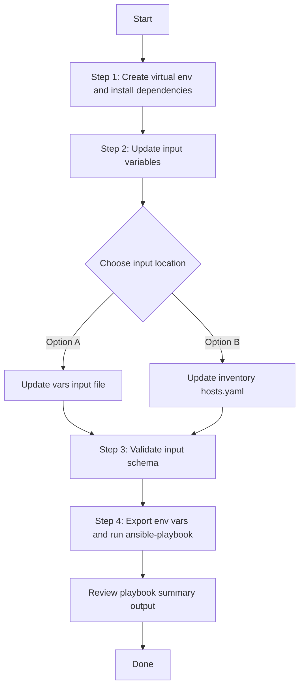

# Network Settings Config Generator

## Table of Contents

- [User Flow (4 Steps)](#user-flow-4-steps)

- [Overview](#overview)
- [Features](#features)
- [Prerequisites](#prerequisites)
- [Workflow Structure](#workflow-structure)
- [Schema Parameters](#schema-parameters)
- [Getting Started](#getting-started)
- [Operations](#operations)
- [Examples](#examples)

## Overview

The Network Settings Config Generator automates YAML playbook generation for existing network settings in Cisco Catalyst Center. It generates output compatible with `network_settings_workflow_manager` for brownfield export, audit, and migration workflows.

---

## Features

- **Configuration Generation**: Generate YAML configurations compatible with `network_settings_workflow_manager`.
  - Extract global pool, reserve pool, network management, and device controllability settings.
  - Transform Catalyst Center data into playbook-ready YAML.
  - Reuse generated files for backup and migration.
- **Component Filtering**: Generate selected components only.
- **Granular Filters**: Filter global pools, reserve pools, and network management by documented attributes.
- **Flexible Output**: Supports custom `file_path` and `file_mode` (`overwrite` / `append`).
- **Brownfield Discovery**: Omit `component_specific_filters`, leave it empty, or set `generate_all_configurations: true` to export all supported network settings in full auto-discovery mode.

---

## Prerequisites

### Software Requirements

| Component | Version |
|-----------|---------|
| Ansible | 2.13+ |
| cisco.catalystcenter collection | 2.6.0 |
| Python | 3.9+ |
| Cisco Catalyst Center | 2.3.7.9+ |
| catalystcentersdk | 2.10.10+ |

### Required Collections

```bash
ansible-galaxy collection install cisco.catalystcenter
ansible-galaxy collection install ansible.utils
pip install catalystcentersdk
pip install yamale
```

### Access Requirements

- Catalyst Center credentials with network settings API access
- Network connectivity to Catalyst Center
- Existing network settings configuration (for targeted export use cases)

---

## Workflow Structure

```
network_settings_config_generator/
├── playbook/
│   └── network_settings_config_generator.yml      # Main operations
├── vars/
│   └── network_settings_config_inputs.yml         # Input examples
├── schema/
│   └── network_settings_config_schema.yml         # Input validation
└── README.md
```

---

## Schema Parameters

### Basic Configuration

| Parameter | Type | Required | Default | Description |
|-----------|------|----------|---------|-------------|
| `generate_all_configurations` | bool | No | `false` | Workflow convenience flag. When `true`, the playbook omits module `config` and runs full auto-discovery. |
| `file_path` | string | No | auto-generated | Output file path for generated YAML. If omitted, module writes `network_settings_playbook_config_<YYYY-MM-DD_HH-MM-SS>.yml` in the current working directory. |
| `file_mode` | string | No | `overwrite` | File write mode: `overwrite` replaces existing file; `append` adds to existing file. Relevant only when `file_path` is provided. |
| `component_specific_filters` | dict | No | omitted | Workflow convenience wrapper mapped to module `config.component_specific_filters`. When omitted or empty, module runs auto-discovery for all supported components. |

### Supported Components

- `global_pool_details`
- `reserve_pool_details`
- `network_management_details`
- `device_controllability_details`

### Component Filter Fields

- `global_pool_details[]` — AND logic within each entry, OR logic across entries
  - `pool_name` — exact name match
  - `pool_type` — `Generic` or `Tunnel`
- `reserve_pool_details[]`
  - `site_name` — exact site name match
  - `site_hierarchy` — includes all child sites under the hierarchy (e.g. `Global/USA` includes all USA sites)
- `network_management_details[]`
  - `site_name_list` — list of full hierarchy paths; defaults to `Global` root site if omitted
- `device_controllability_details[]`
  - include an empty entry `{}` to retrieve device controllability settings

---

## Getting Started

## Workflow Steps
## User Flow (4 Steps)



### Installation and Run (Aligned)

1. Create and activate a Python virtual environment, then install dependencies.

```bash
python3 -m venv .venv
source .venv/bin/activate
pip install -r requirements.txt
ansible-galaxy collection install cisco.catalystcenter --force
```

2. Update input variables.

Edit:

- `workflows/network_settings_config_generator/vars/network_settings_config_inputs.yml`

And configure Catalyst Center credentials and `network_settings_config` directly in your inventory (`inventory/demo_lab/hosts.yaml`). Example:

```yaml
catalyst_center_hosts:
  hosts:
    catalyst_center_primary:
      catalyst_center_host: 10.10.10.10
      catalyst_center_username: admin
      catalyst_center_password: "password"
      catalyst_center_verify: false
      catalyst_center_port: 443
      catalyst_center_version: "2.3.7.9"
      catalyst_center_debug: false
      catalyst_center_log: true
      catalyst_center_log_level: "INFO"
```

3. Validate input schema.

```bash
./tools/schemavalidation.sh \
  -s workflows/network_settings_config_generator/schema/network_settings_config_schema.yml \
  -d workflows/network_settings_config_generator/vars/network_settings_config_inputs.yml
```

4. Export Catalyst Center environment variables and run the playbook.

The playbook supports two input methods:

#### Option A: Vars file input (recommended for version-controlled configs)

```bash
export HOSTIP=<catalyst-center-ip-or-fqdn>
export CATALYST_CENTER_USERNAME=<username>
export CATALYST_CENTER_PASSWORD='<password>'
ansible-playbook -i inventory/demo_lab/hosts.yaml \
  workflows/network_settings_config_generator/playbook/network_settings_config_generator.yml \
  --extra-vars VARS_FILE_PATH=./workflows/network_settings_config_generator/vars/network_settings_config_inputs.yml \
  -vvvv
```

#### Option B: Inventory file input

Omit `VARS_FILE_PATH` and define `network_settings_config` directly as a host variable in your inventory file or in `host_vars`/`group_vars`.

**Example inventory snippet (`inventory/demo_lab/hosts.yaml`):**

```yaml
catalyst_center_hosts:
  hosts:
    catalyst_center220:
      catalyst_center_host: "{{ lookup('ansible.builtin.env', 'HOSTIP') }}"
      catalyst_center_password: "{{ lookup('ansible.builtin.env', 'CATALYST_CENTER_PASSWORD') }}"
      catalyst_center_port: 443
      catalyst_center_username: "{{ lookup('ansible.builtin.env', 'CATALYST_CENTER_USERNAME') }}"
      catalyst_center_verify: false
      catalyst_center_version: 2.3.7.9

      # Workflow data defined as host variables
      network_settings_config:
        - file_path: "{{ playbook_dir }}/network_settings_playbook_config_all.yml"
```

Then run **without** `VARS_FILE_PATH`:

```bash
export HOSTIP=<catalyst-center-ip-or-fqdn>
export CATALYST_CENTER_USERNAME=<username>
export CATALYST_CENTER_PASSWORD='<password>'
ansible-playbook -i inventory/demo_lab/hosts.yaml \
  workflows/network_settings_config_generator/playbook/network_settings_config_generator.yml \
  -vvvv
```

The playbook auto-detects the input source and prints it at the start:
- `Input source: vars file <path>` when using Option A
- `Input source: inventory / host variables (VARS_FILE_PATH not provided)` when using Option B


## Operations

### Generate Operations (state: gathered)

1. **Generate all network settings**
- Omit `component_specific_filters`, leave it empty, or set `generate_all_configurations: true` to trigger full auto-discovery mode (module runs without `config`).

2. **Generate selected component types**
- Set `component_specific_filters.components_list`.

3. **Generate using component-specific filters**
- Use filter blocks under each component name.

4. **Append generated output**
- Set `file_mode: append`.

---

## Examples

### Example 1: Generate all network settings

```yaml
network_settings_config:
  - file_path: "/tmp/network_settings_complete_config.yml"
```

### Example 2: Filter global and reserve pools

```yaml
network_settings_config:
  - file_path: "/tmp/network_settings_pool_filters.yml"
    component_specific_filters:
      components_list: ["global_pool_details", "reserve_pool_details"]
      global_pool_details:
        - pool_name: "Global_LAN_Pool"
          pool_type: "Generic"
      reserve_pool_details:
        - site_hierarchy: "Global/USA"
```

### Example 3: Filter network management by site list

```yaml
network_settings_config:
  - file_path: "/tmp/network_settings_management.yml"
    component_specific_filters:
      components_list: ["network_management_details"]
      network_management_details:
        - site_name_list: ["Global", "Global/USA/SAN JOSE"]
```

---

## Notes

- `network_settings_playbook_config_generator` expects `config` as a dictionary containing `component_specific_filters` when selective export is needed.
- This workflow omits `config` when `generate_all_configurations: true` or `component_specific_filters` is absent or empty, which triggers full auto-discovery mode.
- If component filter blocks are provided without `components_list`, the module infers and auto-adds the relevant components internally.
- `network_management_details` defaults to the `Global` (root) site if `site_name_list` is omitted.
