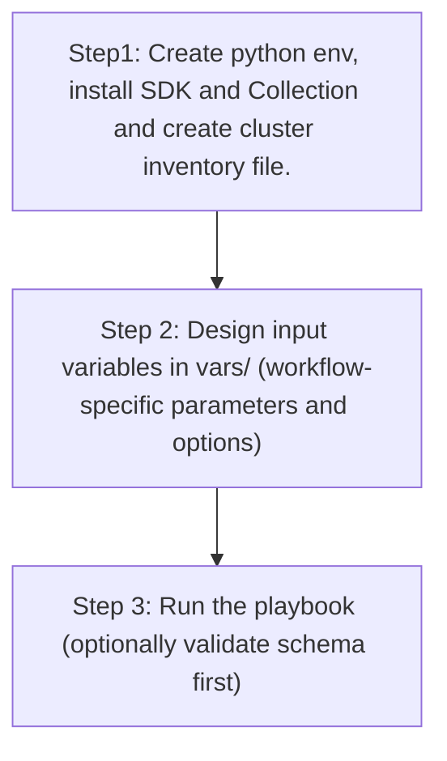

# Network Settings Config Generator

## Table of Contents

- [User Flow (3 Steps)](#user-flow-3-steps)

- [Overview](#overview)
- [Features](#features)
- [Prerequisites](#prerequisites)
- [Workflow Structure](#workflow-structure)
- [Schema Parameters](#schema-parameters)
- [Getting Started](#getting-started)
- [Operations](#operations)
- [Examples](#examples)---

## Overview

The Network Settings config generator automates YAML playbook generation for existing network settings in Cisco Catalyst Center. It generates output compatible with `network_settings_workflow_manager` for brownfield export, audit, and migration workflows.

---

## Features

- **Configuration Generation**: Generate YAML configurations compatible with `network_settings_workflow_manager`.
  - Extract global pool, reserve pool, network management, and device controllability settings.
  - Transform Catalyst Center data into playbook-ready YAML.
  - Reuse generated files for backup and migration.
- **Component Filtering**: Generate selected components only.
- **Granular Filters**: Filter global pools, reserve pools, and network management by documented attributes.
- **Flexible Output**: Supports custom `file_path` and `file_mode` (`overwrite` / `append`).
- **Brownfield Discovery**: Omit `config` (or use workflow convenience flag) to generate all supported network settings.

---

## Prerequisites

### Software Requirements

| Component | Version |
|-----------|---------|
| Ansible | 2.13+ |
| cisco.dnac collection | 6.44.0+ |
| Python | 3.9+ |
| Cisco Catalyst Center | 2.3.7.9+ |
| dnacentersdk | 2.10.10+ |

### Required Collections

```bash
ansible-galaxy collection install cisco.dnac
ansible-galaxy collection install ansible.utils
pip install dnacentersdk
pip install yamale
```

### Access Requirements

- Catalyst Center credentials with network settings API access
- Network connectivity to Catalyst Center
- Existing network settings configuration (for targeted export use cases)

---

## Workflow Structure

```
network_settings_config_generator/
├── playbook/
│   └── network_settings_config_generator.yml      # Main operations
├── vars/
│   └── network_settings_config_inputs.yml         # Input examples
├── schema/
│   └── network_settings_config_schema.yml         # Input validation
└── README.md
```

---

## Schema Parameters

### Basic Configuration

| Parameter | Type | Required | Default | Description |
|-----------|------|----------|---------|-------------|
| `generate_all_configurations` | boolean | No | false | Workflow convenience flag. When true, playbook omits module `config` |
| `file_path` | string | No | auto-generated | Output file path for generated YAML |
| `file_mode` | string | No | `overwrite` | File write mode: `overwrite` or `append` |
| `component_specific_filters` | dict | No | omitted | Component and filters passed to module `config` |

### Supported Components

- `global_pool_details`
- `reserve_pool_details`
- `network_management_details`
- `device_controllability_details`

### Component Filter Fields

- `global_pool_details[]`
  - `pool_name`
  - `pool_type` (`Generic` or `Tunnel`)
- `reserve_pool_details[]`
  - `site_name`
  - `site_hierarchy`
- `network_management_details[]`
  - `site_name_list` (list of hierarchy names)
- `device_controllability_details[]`
  - list entries used to include component output

---

## Getting Started

## Workflow Steps

## User Flow (3 Steps)



### Step 1: Configure Inventory

Example `inventory/demo_lab/hosts.yml`:

```yaml
catalyst_center_hosts:
  hosts:
    catalyst_center_primary:
      catalyst_center_host: 10.0.0.0
      catalyst_center_username: admin
      catalyst_center_password: "password"
      catalyst_center_port: 443
      catalyst_center_verify: false
      catalyst_center_version: 2.3.7.9
```

### Step 2: Configure Variables

Edit:
`workflows/network_settings_config_generator/vars/network_settings_config_inputs.yml`

```yaml
network_settings_config:
  - generate_all_configurations: true
    file_path: "/tmp/network_settings_complete_config.yml"
```

### Step 3: Validate Configuration

```bash
./tools/validate.sh -s workflows/network_settings_config_generator/schema/network_settings_config_schema.yml \
  -d workflows/network_settings_config_generator/vars/network_settings_config_inputs.yml
```

### Step 4: Execute Playbook

```bash
ansible-playbook -i inventory/demo_lab/hosts.yaml \
  workflows/network_settings_config_generator/playbook/network_settings_config_generator.yml \
  --extra-vars VARS_FILE_PATH=./workflows/network_settings_config_generator/vars/network_settings_config_inputs.yml \
  -vvvv
```

---

## Operations

### Generate Operations (state: gathered)

1. **Generate all network settings**
- Set `generate_all_configurations: true`.

2. **Generate selected component types**
- Set `component_specific_filters.components_list`.

3. **Generate using component-specific filters**
- Use filter blocks under component names.

4. **Append generated output**
- Set `file_mode: append`.

---

## Examples

### Example 1: Generate all network settings

```yaml
network_settings_config:
  - generate_all_configurations: true
    file_path: "/tmp/network_settings_complete_config.yml"
```

### Example 2: Filter global and reserve pools

```yaml
network_settings_config:
  - file_path: "/tmp/network_settings_pool_filters.yml"
    component_specific_filters:
      components_list: ["global_pool_details", "reserve_pool_details"]
      global_pool_details:
        - pool_name: "Global_LAN_Pool"
          pool_type: "Generic"
      reserve_pool_details:
        - site_hierarchy: "Global/USA"
```

### Example 3: Filter network management by site list

```yaml
network_settings_config:
  - file_path: "/tmp/network_settings_management.yml"
    component_specific_filters:
      components_list: ["network_management_details"]
      network_management_details:
        - site_name_list: ["Global", "Global/USA/SAN JOSE"]
```

---

## Notes

- `network_settings_playbook_config_generator` expects `config` as a dictionary when filters are used.
- This workflow omits `config` when filters are absent, which triggers full generation mode.
- If component filter blocks are provided without `components_list`, the module can infer and auto-populate components internally.
