# Plug and Play Provisioning Ansible Workflow

## **Overview**

**PnP** (Plug-and-Play) is a network deployment solution that simplifies the process of onboarding new devices by automatically assigning configurations and images to new network devices upon discovery. This automation can be driven by **Cisco Catalyst Center** via **Ansible Playbooks** to handle various deployment scenarios, including:

- **Switches**
- **Wireless LAN Controllers (WLCs)**
- **Access Points (APs)**

## Prerequisites

Before starting, ensure the following requirements are met:
- **Access to Cisco Catalyst Center (DNAC)**: Ensure that PnP (Plug-and-Play) is enabled. 
- **Devices that Support PnP**: Confirm that the devices you intend to onboard are PnP-capable.
- **Ansible Installation**: Ansible must be installed on the machine managing the automation process.
- **Cisco DNA Ansible Collection**: The `cisco.dnac.pnp_workflow_manager` module must be available from the Cisco DNA Ansible Collection.
- **dnacentersdk Python SDK**: This SDK is required to interact with Cisco Catalyst Center.
* Ansible installed
* `yamale` Python library installed (`pip install yamale`)
* Cisco DNA Center or Plug and Play Connect access configured

## **Key Features**

* **Zero-Touch Provisioning:** Remotely configure devices onboarded through PnP
* **Planned Provisioning:** Pre-configure settings and apply them when the device comes online.
* **Unclaimed Provisioning:** Discover and configure new devices that join the network unexpectedly.

### Configure Environment

```bash
catalyst_center_hosts:
    hosts:
        catalyst_center220:
            dnac_host: xx.xx.xx.xx.
            dnac_password: XXXXXXXX
            dnac_port: 443
            dnac_timeout: 60
            dnac_username: admin
            dnac_verify: false
            dnac_version: 2.3.7.6
            dnac_debug: true
            dnac_log_level: INFO
            dnac_log: true
```

## Overview of the PnP Onboarding Process
This diagram provides an overview of the **PnP onboarding process** initiated by an Ansible playbook using the **cisco.dnac.pnp_workflow_manager** module. The module interacts with the **Cisco Catalyst Center** via its API, allowing devices to be onboarded seamlessly into the network.

### Task: Claiming a Cisco Catalyst 9K Switch

The PnP onboarding process in Cisco Catalyst Center allows devices to be automatically recognized and configured as they join the network. This playbook uses the `cisco.dnac.pnp_workflow_manager` module to automate the onboarding process for a variety of device types such as switches, wireless controllers (EWLC), and access points (APs).

### Mapping Config to UI Actions

The `config` parameter within each task corresponds to actions you would normally perform manually in the Cisco Catalyst Center UI, such as: **Provision > Plug and Play > Claim**

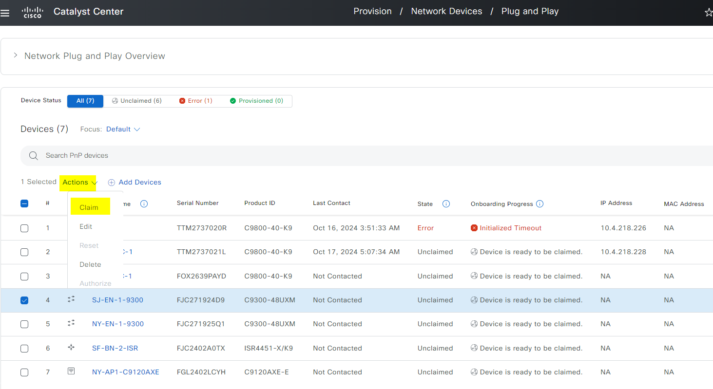
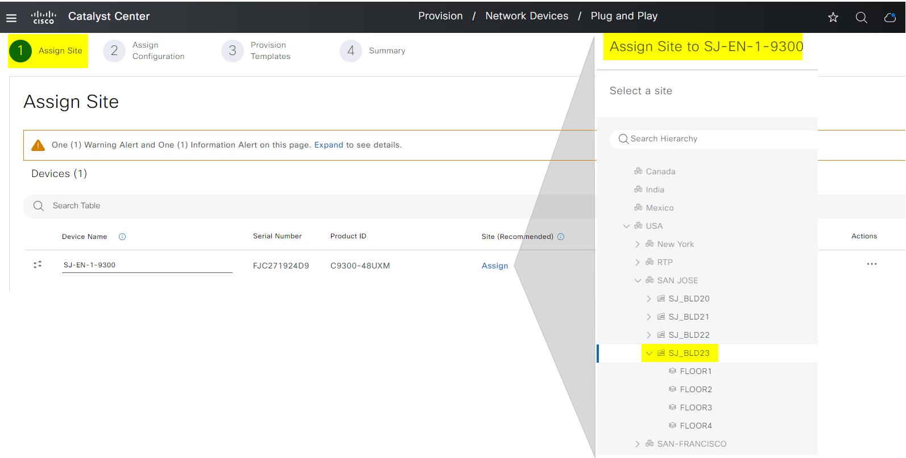
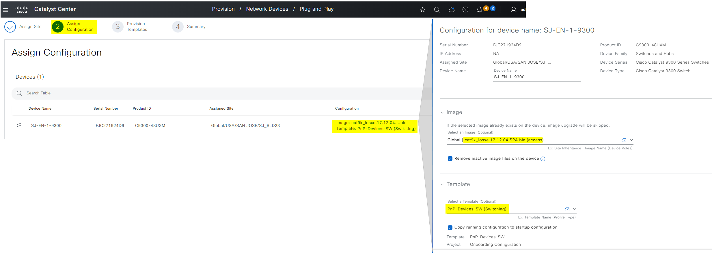
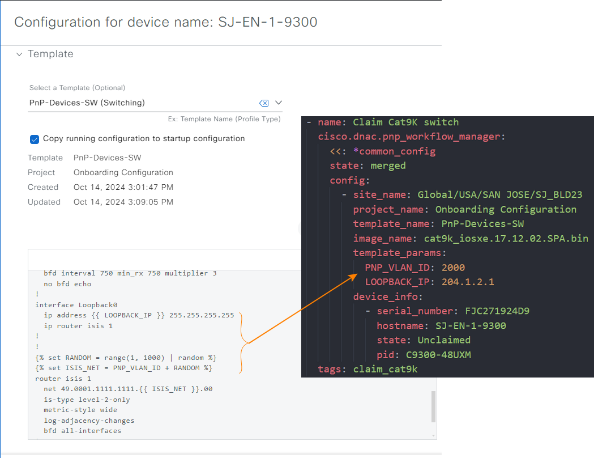
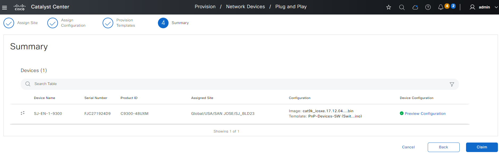

``` yaml
          - site_name: Global/USA/SAN JOSE/SJ_BLD23
            project_name: Onboarding Configuration
            template_name: PnP-Devices-SW
            image_name: cat9k_iosxe.17.12.02.SPA.bin
            template_params:
              PNP_VLAN_ID: 2000
              LOOPBACK_IP: 204.1.2.1
            device_info:
              - serial_number: FJC271924D9
                hostname: SJ-EN-1-9300
                state: Unclaimed
                pid: C9300-48UXM
```

### Task: Claiming a Cisco Catalyst 9K Switch Stack

#### Mapping Config to UI Actions

Similar to the task for claiming a single switch, this task relies on a predefined configuration template in Cisco Catalyst Center. However, in this case, the **StackSwitch** option is selected in the UI to indicate that the device being onboarded is part of a switch stack.

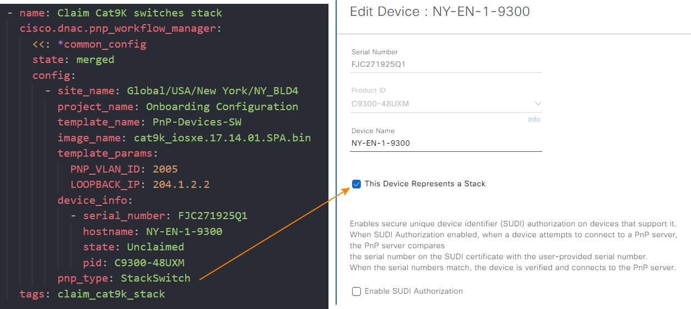

``` yaml
          - site_name: Global/USA/New York/NY_BLD4
            project_name: Onboarding Configuration
            template_name: PnP-Devices-SW
            image_name: cat9k_iosxe.17.14.01.SPA.bin
            template_params:
              PNP_VLAN_ID: 2005
              LOOPBACK_IP: 204.1.2.2
            device_info:
              - serial_number: FJC271925Q1
                hostname: NY-EN-1-9300
                state: Unclaimed
                pid: C9300-48UXM
            pnp_type: StackSwitch
```

### Task: Claiming a Cisco Embedded Wireless Controller (EWLC)

#### Mapping Config to UI Actions

In the Cisco Catalyst Center UI, onboarding a Cisco Embedded Wireless Controller (EWLC) involves specifying parameters such as the site, project, device information, and network settings. This configuration aligns with actions like assigning a site, selecting an image, and setting network interfaces.

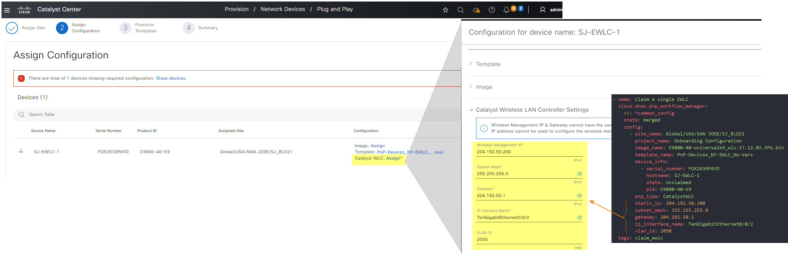

``` yaml
    - name: PnP Tasks
      cisco.dnac.pnp_workflow_manager:
        <<: *dnac_login
        state: merged
        config:
          - site_name: Global/USA/SAN JOSE/SJ_BLD21
            project_name: Onboarding Configuration
            image_name: C9800-40-universalk9_wlc.17.12.02.SPA.bin
            template_name: PnP-Devices_NY-EWLC_No-Vars
            device_info:
              - serial_number: FOX2639PAYD
                hostname: SJ-EWLC-1
                state: Unclaimed
                pid: C9800-40-K9
            pnp_type: CatalystWLC
            static_ip: 204.192.50.200
            subnet_mask: 255.255.255.0
            gateway: 204.192.50.1
            ip_interface_name: TenGigabitEthernet0/0/2
            vlan_id: 2050
      loop: "{{ PnP_Tasks }}"
      when: PnP_Tasks is defined
```

### Task: Claiming Multiple EWLC Devices for High Availability (HA)

#### Mapping Config to UI Actions

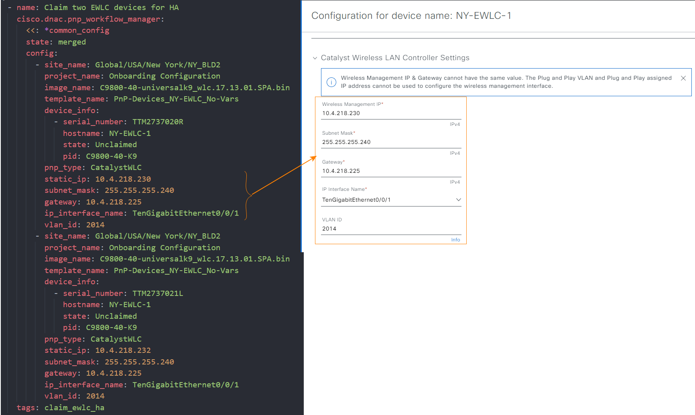

``` yaml
    - name: PnP Tasks
      cisco.dnac.pnp_workflow_manager:
        <<: *dnac_login
        state: merged
        config:
          - site_name: Global/USA/New York/NY_BLD2
            project_name: Onboarding Configuration
            image_name: C9800-40-universalk9_wlc.17.13.01.SPA.bin
            template_name: PnP-Devices_NY-EWLC_No-Vars
            device_info:
              - serial_number: TTM2737020R
                hostname: NY-EWLC-1
                state: Unclaimed
                pid: C9800-40-K9
            pnp_type: CatalystWLC
            static_ip: 10.4.218.230
            subnet_mask: 255.255.255.240
            gateway: 10.4.218.225
            ip_interface_name: TenGigabitEthernet0/0/1
            vlan_id: 2014
          - site_name: Global/USA/New York/NY_BLD2
            project_name: Onboarding Configuration
            image_name: C9800-40-universalk9_wlc.17.13.01.SPA.bin
            template_name: PnP-Devices_NY-EWLC_No-Vars
            device_info:
              - serial_number: TTM2737021L
                hostname: NY-EWLC-1
                state: Unclaimed
                pid: C9800-40-K9
            pnp_type: CatalystWLC
            static_ip: 10.4.218.232
            subnet_mask: 255.255.255.240
            gateway: 10.4.218.225
            ip_interface_name: TenGigabitEthernet0/0/1
            vlan_id: 2014
      loop: "{{ PnP_Tasks }}"
      when: PnP_Tasks is defined
```
#### Key Points

- **HA Setup**: Both EWLCs in the HA pair are configured with their unique IP addresses, subnets, and interfaces.
- **VLAN Configuration**: Each EWLC is assigned to VLAN 2014 and connected through a specific TenGigabitEthernet interface.
- **Templates and Images**: The devices are onboarded using the same project, image, and configuration template.


### Task: Resetting an Error PnP Device (EWLC Type)

#### Mapping Config to UI Actions

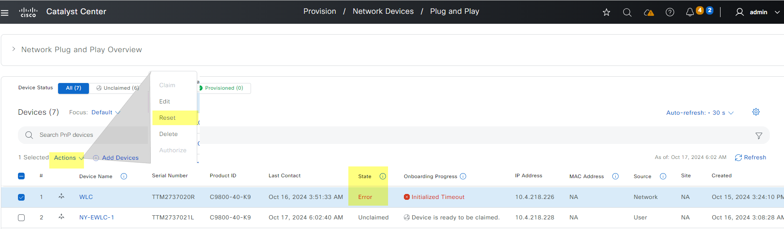

In scenarios where a device encounters errors during onboarding, it can be reset and reattempted. The following task demonstrates how to reset a Catalyst EWLC that is in an error state.

``` yaml
    - name: PnP Tasks
      cisco.dnac.pnp_workflow_manager:
        <<: *dnac_login
        state: merged
        config:
          - site_name: Global/USA/SAN JOSE/BLD23
            project_name: Onboarding Configuration
            template_name: PnP-Devices_SJ-EWLC_No-Vars
            device_info:
              - serial_number: TTM2737020R
                hostname: WLC
                state: Error
                pid: C9800-40-K9
      loop: "{{ PnP_Tasks }}"
      when: PnP_Tasks is defined
```
#### Key Points

- **Error State**: The device is identified as being in an error state.
- **Reset**: The playbook ensures that the device is reset and ready for another onboarding attempt.

### Task: Claiming Access Points (APs)

#### Mapping Config to UI Actions

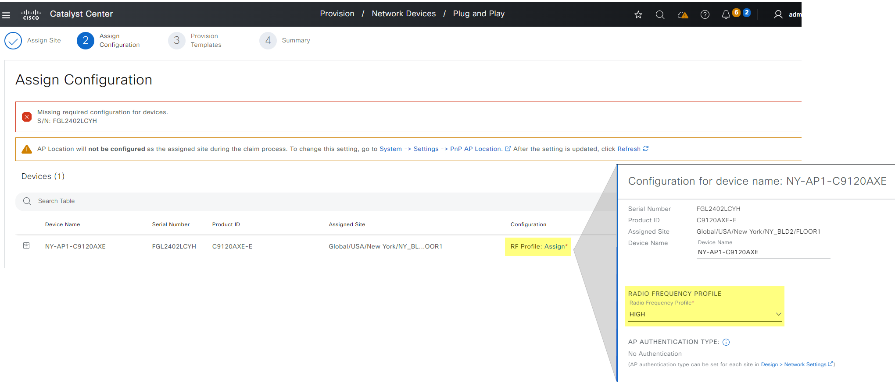

Access Points (APs) play a crucial role in wireless networks, and onboarding them can be automated through Cisco Catalyst Center. The following example shows how to onboard an Access Point (AP) into the network.

``` yaml 
          - site_name: Global/USA/New York/NY_BLD2/FLOOR1
            rf_profile: HIGH
            device_info:
              - serial_number: FGL2402LCYH
                hostname: NY-AP1-C9120AXE
                state: Unclaimed
                pid: C9120AXE-E
            pnp_type: AccessPoint
```
#### Key Points

- **RF Profile**: Specifies the RF profile (e.g., HIGH) that will be applied to the Access Point.
- **Access Point Details**: The serial number, hostname, and product ID (PID) are provided for identification.
- **Important**: Ensure that the Wireless LAN Controller (WLC) is fully onboarded before claiming any Access Points; otherwise, you may encounter an error.

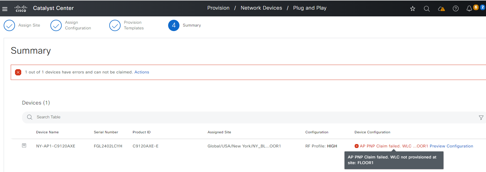

### Task: Bulk Device Onboarding

This task demonstrates how to add multiple devices in bulk. Bulk onboarding is useful when multiple devices need to be configured and onboarded simultaneously, such as in large-scale deployments.

#### Mapping Config to UI Actions

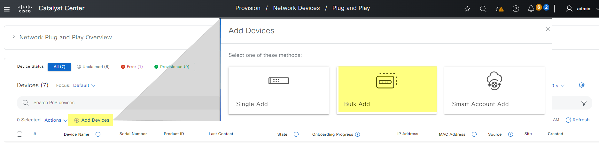

``` yaml

    - name: PnP Tasks
      cisco.dnac.pnp_workflow_manager:
        <<: *dnac_login
        state: merged
        config:
          - device_info:
              - serial_number: FOX2639PAYD
                hostname: SJ-EWLC-1
                state: Unclaimed
                pid: C9800-40-K9
              - serial_number: FJC271924D9
                hostname: SJ-EN-9300
                state: Unclaimed
                pid: C9300-48UXM
              - serial_number: FJC271925Q1
                hostname: NY-EN-9300
                state: Unclaimed
                pid: C9300-48UXM
              - serial_number: FJC2402A0TX
                hostname: SF-BN-ISR
                state: Unclaimed
                pid: ISR4451-X/K9
      loop: "{{ PnP_Tasks }}"
      when: PnP_Tasks is defined

```


**Usage**

1. **Configure Variables**
    * Edit `catalyst_center_pnp_vars.yml` with your specific settings:
        * Catalyst Center credentials
        * Device information
        * Desired configuration templates
2. **Prepare Inventory**
    * Create `host_inventory_dnac1/hosts.yml` listing target devices.

3. **Validate Inputs**
```bash
    yamale -s workflows/plug_and_play/schema/plug_and_play_schema.yml workflows/plug_and_play/vars/catalyst_center_pnp_vars.yml 
```
3. **Execute Playbook**
```bash
    ansible-playbook -i host_inventory_dnac1/hosts.yml workflows/plug_and_play/playbook/catalyst_center_pnp_playbook.yml --e VARS_FILE_PATH=../vars/catalyst_center_pnp_vars.yml
```
**Important Notes**

* Customize the playbook and variables to match your network environment.
* Consult Cisco documentation for in-depth information about Plug and Play.

**Disclaimer**

* This playbook is provided as-is. Use at your own risk.
* Ensure you have proper backups and understand the potential impact before running in a production environment.
## Referances


```yaml
  ansible: 9.9.0
  ansible-core: 2.16.10
  ansible-runner: 2.4.0

  dnacentersdk: 2.8.3
  cisco.dnac: 6.29.0
  ansible.utils: 5.1.2
```

---