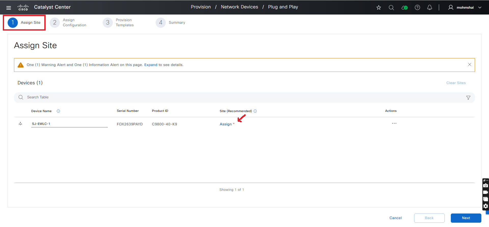
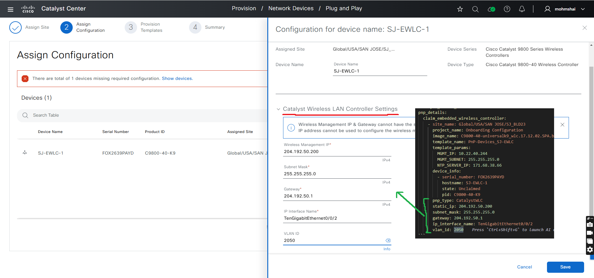
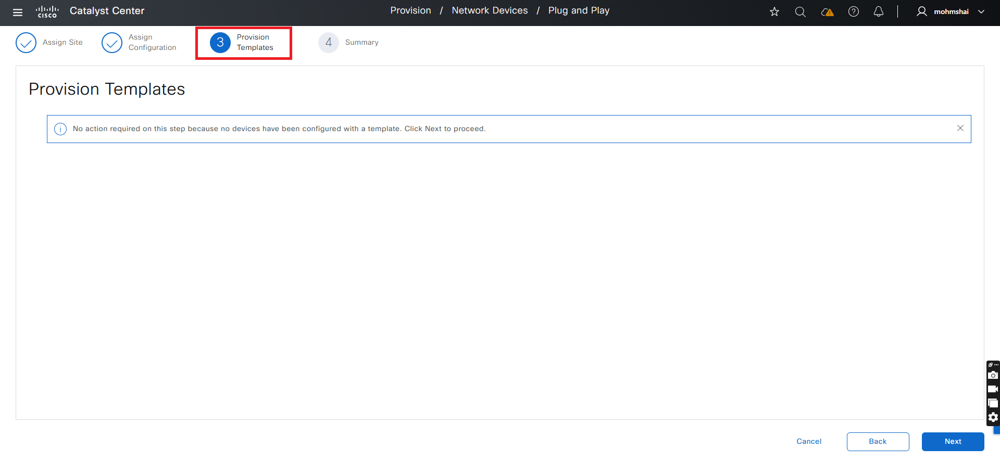

# Plug and Play Provisioning Ansible Playbook

## Overview

**PnP** (Plug-and-Play) is a network deployment solution that simplifies the process of onboarding new devices by automatically assigning configurations and images to new network devices upon discovery. This automation can be driven by **Cisco Catalyst Center** via **Ansible Playbooks** to handle various deployment scenarios, including:

- **Routers**
- **Switches**
- **Wireless LAN Controllers (WLCs)**
- **Access Points (APs)**

## Key Features

* **Zero-Touch Provisioning:** Remotely configure devices onboarded through PnP
* **Planned Provisioning:** Pre-configure settings and apply them when the device comes online.
* **Unclaimed Provisioning:** Discover and configure new devices that join the network unexpectedly.
* **Automatic PnP Device Authorization (2.3.7.9+):** Use `authorize: true` in `device_info` to auto-authorize devices in *Pending Authorization* state.

## Prerequisites

Before starting, ensure the following requirements are met:
- **Access to Cisco Catalyst Center**: Ensure that PnP (Plug-and-Play) is enabled. 
- **Devices that Support PnP**: Confirm that the devices you intend to onboard are PnP-capable.
- **Ansible Installation**: Ansible must be installed on the machine managing the automation process.
- **dnacentersdk Python SDK**: This SDK is required to interact with Cisco Catalyst Center.
- **Ansible installation**: Ensure that Ansible is installed.
- **Yamale Python Library**: The `yamale` Python library installed (`pip install yamale`)
- **Cisco DNA Center or Plug and Play Connect Access**: Ensure access is configured


## Workflow Steps
### Step 1: Install and Generate Inventory

1. **Install Ansible**: Follow the [official Ansible documentation](https://docs.ansible.com/ansible/latest/installation_guide/intro_installation.html) for installation.
2. **Install Cisco Catalyst Center Collection**:
   ```bash
   ansible-galaxy collection install cisco.dnac
   ```
3. **Generate Inventory**: Create an Ansible inventory file (e.g., `inventory.yml`) with your Cisco Catalyst Center details.
   ```yaml
   catalyst_center_hosts:
     hosts:
       your_catalyst_center_instance_name:
         catalyst_center_host: xx.xx.xx.xx
         catalyst_center_password: XXXXXXXX
         catalyst_center_port: 443
         catalyst_center_timeout: 60
         catalyst_center_username: admin
         catalyst_center_verify: false  # Set to true for production
         catalyst_center_version: 2.3.7.9
         catalyst_center_debug: true
         catalyst_center_log_level: INFO
         catalyst_center_log: true
   ```
   

### Step 2: Define Inputs and Validate

This step involves preparing the input data for onboarding or managing devices via PnP and validating your setup.

1.  **Define Input Variables:** Create variable files (e.g., `vars/catalyst_center_pnp_vars.yml`) that define the list of devices to claim, add, or delete.
2.  **Validate Inputs:** Ensure your variable file adheres to the schema defined in `schema/plug_and_play_schema.yml`.

#### PnP Details Configuration

The `pnp_details` section organizes devices by their type or action.

| **Parameter** | **Type** | **Description** |
| :--- | :--- | :--- |
| `claim_wireless_controllers` | List | List of Wireless LAN Controllers (WLC) to claim. |
| `claim_switching_devices` | List | List of switches to claim. |
| `claim_router_devices` | List | List of routers to claim. |
| `claim_access_points` | List | List of Access Points (AP) to claim. |
| `add_network_device` | List | List of devices to add to PnP database (without claiming). |
| `add_bulk_network_devices` | List | List of devices to add in bulk. |
| `network_devices` | List | General list of devices (often used for deletion tasks). |

#### Device Configuration Parameters

Each item in the lists above (e.g., inside `claim_switching_devices`) typically requires the following parameters:

| **Parameter** | **Type** | **Required** | **Description** |
| :--- | :--- | :--- | :--- |
| `site_name` | String | Yes (for Claim) | The full hierarchy path of the site (e.g., `Global/USA/San Jose`). |
| `project_name` | String | No | The project name for configuration templates. |
| `template_name` | String | No | The name of the template to apply. |
| `image_name` | String | No | The name of the software image to provision. |
| `template_params` | Dictionary | No | Variables required by the Jinja2 template (e.g., VLAN ID, IP). |
| `device_info` | List | Yes | A list of specific devices to apply this configuration to. |

#### Device Info Object

The `device_info` list contains the specific identity of the physical devices.

| **Parameter** | **Type** | **Required** | **Description** |
| :--- | :--- | :--- | :--- |
| `serial_number` | String | Yes | The serial number of the device. |
| `pid` | String | No | The Product ID of the device. |
| `hostname` | String | No | The hostname to assign or identify the device. |
| `state` | Enum | No | Expected state (e.g., `Unclaimed`, `Claimed`, `Provisioned`). |
| `authorize` | Boolean | No | **(v2.3.7.9+)** **Galaxy version 6.42.0+** Auto-authorize device if in `Pending Authorization` state. |


## Example Input File

The Plug and Play (PnP) workflow module automates the complete device lifecycle management in Cisco Catalyst Center, from initial device discovery to full provisioning. It supports adding devices to the PnP database, authorizing pending devices, claiming devices to sites, applying configuration templates and software images, and removing devices when needed.


Refer to the full workflow specification for detailed instructions on the available options and their structure: https://galaxy.ansible.com/ui/repo/published/cisco/dnac/content/module/pnp_workflow_manager/

### 1. Add Single Device

Add a single device to the PnP database without claiming it to a site.

```yaml
---
catalyst_center_version: 2.3.7.6
pnp_details:
  add_network_device:
    - device_info:
        - serial_number: FJC27212582
          hostname: DC-T-9300.cisco.local
          state: Unclaimed
          pid: C9300-48T
```

### 2. Claim Switch with Template

Claim a Cisco Catalyst 9K switch with configuration template and software image.

```yaml
---
catalyst_center_version: 2.3.7.6
pnp_details:
  claim_switching_devices:
    - site_name: Global/USA/SAN JOSE/SJ_BLD21
      project_name: Onboarding Configuration
      template_name: PnP-Devices-SW
      image_name: cat9k_iosxe.17.12.04.SPA.bin
      template_params:
        PNP_VLAN_ID: 2000
        LOOPBACK_IP: 204.1.2.100
      device_info:
        - serial_number: FJC272127LW
          hostname: DC-FR-9300.cisco.local
          state: Unclaimed
          pid: C9300-48T
```

### 3. Claim Switch Stack

Onboard a Cisco Catalyst 9K switch stack by specifying `pnp_type: StackSwitch`.

```yaml
---
catalyst_center_version: 2.3.7.6
pnp_details:
  claim_switching_devices:
    - site_name: Global/USA/New York/NY_BLD1
      project_name: Onboarding Configuration
      template_name: PnP-Devices-SW
      image_name: cat9k_iosxe.17.12.02.SPA.bin
      template_params:
        PNP_VLAN_ID: 2005
        LOOPBACK_IP: 204.1.2.2
      device_info:
        - serial_number: FJC271925Q1
          hostname: NY-EN-9300
          state: Unclaimed
          pid: C9300-48UXM
      pnp_type: StackSwitch
```
### 4. Claim Router Device

Onboard a Cisco router with appropriate template and image.

```yaml
---
catalyst_center_version: 2.3.7.6
pnp_details:
  claim_router_devices:
    - site_name: Global/USA/SAN-FRANCISCO/BLD_SF1
      project_name: Onboarding Configuration
      template_name: PnP-Devices_SF-ISR_No-Vars
      image_name: isr4400-universalk9.17.12.02.SPA.bin
      device_info:
        - serial_number: FXS2502Q2HC
          hostname: SF-BN-2-ASR.cisco.local
          state: Unclaimed
          pid: ASR1001-X
```
### 6. Claim Access Point

Onboard an Access Point to a site with RF profile configuration.

**Important:** Ensure the Wireless LAN Controller (WLC) is fully onboarded before claiming Access Points.

```yaml
---
catalyst_center_version: 2.3.7.6
pnp_details:
  claim_access_points:
    - site_name: Global/USA/New York/NY_BLD2/FLOOR1
      rf_profile: HIGH
      device_info:
        - serial_number: FGL2402LCYH
          hostname: NY-AP1-C9120AXE
          state: Unclaimed
          pid: C9120AXE-E
      pnp_type: AccessPoint
```

### 7. Bulk Device Addition with Authorization

Add multiple devices in bulk and automatically authorize them (requires Catalyst Center v2.3.7.9+ and Galaxy collection 6.42.0+).

```yaml
---
catalyst_center_version: 2.3.7.9
pnp_details:
  add_bulk_network_devices:
    - device_info:
        - serial_number: FXS2502Q2HC
          hostname: SF-BN-2-ASR.cisco.local
          state: Unclaimed
          pid: ASR1001-X
          authorize: true
        - serial_number: FJC271923AK
          hostname: NY-EN-9300
          state: Unclaimed
          pid: C9300-48UXM
          authorize: true
        - serial_number: FOX2639PAYD
          hostname: SJ-EWLC-1.cisco.local
          state: Unclaimed
          pid: C9800-40-K9
          authorize: false
```

### 8. Delete Device from PnP

Remove a single device or multiple devices from the PnP database.

**Single Device Deletion:**
```yaml
---
catalyst_center_version: 2.3.7.6
pnp_details:
  network_devices:
    - device_info:
        - serial_number: FJC271923AK
          hostname: NY-EN-9300
          state: Unclaimed
          pid: C9300-48UXM
```

**Bulk Device Deletion:**
```yaml
---
catalyst_center_version: 2.3.7.6
pnp_details:
  network_devices:
    - device_info:
        - serial_number: FXS2502Q2HC
          hostname: SF-BN-2-ASR.cisco.local
          state: Unclaimed
          pid: ASR1001-X
        - serial_number: FJC271923AK
          hostname: NY-EN-9300
          state: Unclaimed
          pid: C9300-48UXM
        - serial_number: FOX2639PAYD
          hostname: SJ-EWLC-1.cisco.local
          state: Unclaimed
          pid: C9800-40-K9
```

### 9. Add, Authorize and Claim Device (v2.3.7.9+)

Complete workflow: Add → Authorize → Claim in a single operation.

```yaml
---
catalyst_center_version: 2.3.7.9
pnp_details:
  claim_switching_devices:
    - site_name: Global/USA/SAN JOSE/SJ_BLD21
      project_name: Onboarding Configuration
      template_name: PnP-Devices-SW
      image_name: cat9k_iosxe.17.12.04.SPA.bin
      template_params:
        PNP_VLAN_ID: 2000
        LOOPBACK_IP: 204.1.2.100
      device_info:
        - serial_number: FJC272127LW
          hostname: DC-FR-9300.cisco.local
          state: Unclaimed
          pid: C9300-48T
          authorize: true
```

### Validation and Execution

### Step 1: Validate Input Schema

To ensure a successful execution of the playbooks with your specified inputs, follow these steps:

Input Validation:
Before executing the playbook, it is essential to validate the input schema. This step ensures that all required parameters are included and correctly formatted. Run the following command *./tools/validate.sh -s* to perform the validation providing the schema path -d and the input path.

```bash
  ./tools/validate.sh \
  -s workflows/plug_and_play/schema/plug_and_play_schema.yml \
  -d workflows/plug_and_play/vars/catalyst_center_pnp_vars.yml
```

**Return result validate**
```
Validating workflows/plug_and_play/vars/catalyst_center_pnp_vars.yml...
Validation success! 👍
```

### Step 2: Execute the Playbook

1. **Run the Playbook**

Run the following command to onboard bulk the device:

```bash
ansible-playbook -i ./inventory/demo_lab/inventory_demo_lab.yml ./workflows/plug_and_play/playbook/catalyst_center_pnp_playbook.yml --extra-vars VARS_FILE_PATH=./../vars/catalyst_center_pnp_vars.yml -vvvv
```

#### a. Bulk Device Onboarding (state = 'merged')
This task demonstrates how to add multiple devices in bulk. Bulk onboarding is useful when multiple devices need to be configured and onboarded simultaneously, such as in large-scale deployments.

Note:
- This example includes router, switch and wlc devices

**Example: Input (YAML)**
```bash
---
catalyst_center_version: 2.3.7.6
pnp_details:
  add_bulk_network_devices:
    - device_info:
      - serial_number: FXS2502Q2HC
        hostname: SF-BN-2-ASR.cisco.local
        state: Unclaimed
        pid: ASR1001-X
      - serial_number: FJC271923AK
        hostname: NY-EN-9300
        state: Unclaimed
        pid: C9300-48UXM
      - serial_number: FOX2639PAYD
        hostname: SJ-EWLC-1.cisco.local
        state: Unclaimed
        pid: C9800-40-K9      
```


#### b.Device Authorization for Bulk Onboarding (Optional)

From Cisco Catalyst Center release **2.3.7.9** onwards, you can automatically authorize PnP devices that are in **"Pending Authorization"** state by using the `authorize` flag inside `device_info`.

- When `authorize: true` is set for a device, the workflow:
  - Imports the device into PnP
  - Looks up the device in Catalyst Center
  - If its state is **Pending Authorization**, automatically calls the PnP `authorize_device` API
- If `authorize` is not set or is `false`, the device remains in its current authorization state.

**Example: Bulk Onboarding with Authorization**

```yaml
---
catalyst_center_version: 2.3.7.9
pnp_details:
  add_bulk_network_devices:
    - device_info:
        - serial_number: FXS2502Q2HC
          hostname: SF-BN-2-ASR.cisco.local
          state: Unclaimed
          pid: ASR1001-X
          authorize: true
        - serial_number: FJC271923AK
          hostname: NY-EN-9300
          state: Unclaimed
          pid: C9300-48UXM
          authorize: true
        - serial_number: FOX2639PAYD
          hostname: SJ-EWLC-1.cisco.local
          state: Unclaimed
          pid: C9800-40-K9
          authorize: false
```
---


#### c.Delete a Device from PnP

This task demonstrates how to delete a device from Plug and Play (PnP).

**Example: Input (YAML)**
```bash
---
catalyst_center_version: 2.3.7.6
pnp_details:
  network_devices:
    - site_name: Global/USA/SAN JOSE/SJ_BLD23/FLOOR1
      project_name: Onboarding Configuration
      template_name: PnP-Devices_No-Vars
      image_name: cat9k_iosxe.17.09.04a.SPA.bin
      device_info:
          - serial_number: FJC271923AK
            hostname: NY-EN-9300
            state: Unclaimed
            pid: C9300-48UXM
```

Step 1: Ensure that the device exists in Plug and Play (PnP) before executing the playbook.


Step 2: Execute the pnp playbook.

Upon successful execution, the device will be deleted from PnP.


Step 4: Verify that device is removed

To ensure the device has been successfully removed, verify the PnP UI.


#### d.Task: Bulk Device Deletion

**Input (YAML)**
```bash
---
catalyst_center_version: 2.3.7.6
pnp_details:
  network_devices:
    - device_info:
      - serial_number: FXS2502Q2HC
        hostname: SF-BN-2-ASR.cisco.local
        state: Unclaimed
        pid: ASR1001-X
      - serial_number: FJC271923AK
        hostname: NY-EN-9300
        state: Unclaimed
        pid: C9300-48UXM
      - serial_number: FOX2639PAYD
        hostname: SJ-EWLC-1.cisco.local
        state: Unclaimed
        pid: C9800-40-K9
```

Step 1: Ensure that the device exists in Plug and Play (PnP) before trying to remove them.


Step 2: Execute the PnP Playbook:

Upon successful execution, the device will be deleted from PnP.


Step 3: Verify that all devices is removed

To ensure the devices has been successfully removed, verify the PnP UI.


#### e. Claiming a Cisco Catalyst 9K Switch

This task demonstrates how to add and claim a Cisco Catalyst 9K switch using the Plug and Play (PnP)

**Example: Input (YAML)**
```bash
---
catalyst_center_version: 2.3.7.6
pnp_details:
  claim_switching_devices:
    - site_name: Global/USA/SAN JOSE/SJ_BLD21
      project_name: Onboarding Configuration
      template_name: PnP-Devices-SW
      image_name: cat9k_iosxe.17.12.04.SPA.bin
      template_params:
        PNP_VLAN_ID: 2000
        LOOPBACK_IP: 204.1.2.100
      device_info:
        - serial_number: FJC272127LW
          hostname: DC-FR-9300.cisco.local
          state: Unclaimed
          pid: C9300-48T
```

Step 1: Execute the PnP playbook

To initiate the device onboarding and claim process execute the PnP workflow playbook using below command.


Step 2: Verify the playbook output 

Ensure that no failures are observed after playbook execution complete.

Step 3: Confirm Device Onboarding in Cisco Catalyst Center

Verify that the device is onboarded and successfully claimed in the Cisco Catalyst Center UI.

Step 3: Mapping Example to UI Actions

#### The screenshots below demonstrate how to manually onboard and claim a device in the Cisco Catalyst Center UI:


#### f. Claiming a Cisco Catalyst 9K Switch Stack

Similar to the task for claiming a single switch, this task relies on a predefined configuration template in Cisco Catalyst Center. However, in this case, the **StackSwitch** option is selected in the UI to indicate that the device being onboarded is part of a switch stack.


**Example: Input (YAML)**
```bash
---
catalyst_center_version: 2.3.7.6
pnp_details:
  claim_switching_devices:
    - site_name:  Global/USA/New York/NY_BLD1
      project_name: Onboarding Configuration
      template_name: PnP-Devices-SW
      image_name: cat9k_iosxe.17.12.02.SPA.bin
      template_params:
        PNP_VLAN_ID: 2005
        LOOPBACK_IP: 204.1.2.2
      device_info:
        - serial_number: FJC271925Q1
          hostname: NY-EN-9300
          state: Unclaimed
          pid: C9300-48UXM
      pnp_type: StackSwitch
```

Step 1: Execute the PnP playbook

Run the PnP workflow playbook to initiate the onboarding and claim process using below command.


Step 2: Verify the playbook output 

Ensure that the playbook execution completes successfully without any failures.

Step 3: Confirm Device Onboarding in Cisco Catalyst Center
Verify that the switch stack is onboarded and successfully claimed in the Cisco Catalyst Center UI.

#### g. Claiming a Cisco Router Device
 
Similar to the task of claiming a single switch, we can onboard the router device as well using the pnp workflow playbook.

**Example: Input (YAML)**
```bash
---
catalyst_center_version: 2.3.7.6
pnp_details:
  claim_router_devices:
    - site_name: Global/USA/SAN-FRANCISCO/BLD_SF1
      project_name: Onboarding Configuration
      template_name: PnP-Devices_SF-ISR_No-Vars
      image_name: isr4400-universalk9.17.12.02.SPA.bin
      device_info:
        - serial_number: FXS2502Q2HC
          hostname: SF-BN-2-ASR.cisco.local
          state: Unclaimed
          pid: ASR1001-X
```

**Note:**
- Ensure that the required configurations are in place before proceeding, including: Template, Image and Device ID Certificate which is compatible to router device


#### h. Claiming a Cisco Embedded Wireless Controller (EWLC)

In the Cisco Catalyst Center UI, onboarding a Cisco Embedded Wireless Controller (EWLC) involves specifying parameters such as the site, project, device information, and network settings. This configuration aligns with actions like assigning a site, selecting an image, and setting network interfaces.

**Note:**
- Ensure that the required configurations are in place before proceeding, including: Template, Image and Catalyst Wireless LAN Controller Settings which is compatible to ewlc device

**Example: Input (YAML)**
```bash
---
catalyst_center_version: 2.3.7.6
pnp_details:
  claim_wireless_controllers:
    - site_name: Global/USA/SAN JOSE/SJ_BLD23
      project_name: Onboarding Configuration
      image_name: C9800-40-universalk9_wlc.17.12.02.SPA.bin
      template_name: PnP-Devices_SJ-EWLC
      template_params:
        MGMT_IP: 10.22.40.244
        MGMT_SUBNET: 255.255.255.0
        NTP_SERVER_IP: 171.68.38.66
      device_info:
        - serial_number: FOX2639PAYD
          hostname: SJ-EWLC-1
          state: Unclaimed
          pid: C9800-40-K9
      pnp_type: CatalystWLC
      static_ip: 204.192.50.200
      subnet_mask: 255.255.255.0
      gateway: 204.192.50.1
      ip_interface_name: TenGigabitEthernet0/0/2
      vlan_id: 2050
```

**Mapping Example to UI Actions**
##### The screenshots below demonstrate how to manually onboard and claim a device in the Cisco Catalyst Center UI:






#### i. Claiming Multiple EWLC Devices for High Availability (HA)

**Example: Input (YAML)**
```bash
---
catalyst_center_version: 2.3.7.6
pnp_details:
  claim_wireless_controllers:
    - site_name: Global/USA/New York/NY_BLD2
      project_name: Onboarding Configuration
      image_name: C9800-40-universalk9_wlc.17.13.01.SPA.bin
      template_name: PnP-Devices_NY-EWLC_No-Vars
      device_info:
        - serial_number: TTM2737020R
          hostname: NY-EWLC-1
          state: Unclaimed
          pid: C9800-40-K9
      pnp_type: CatalystWLC
      static_ip: 10.4.218.230
      subnet_mask: 255.255.255.240
      gateway: 10.4.218.225
      ip_interface_name: TenGigabitEthernet0/0/1
      vlan_id: 2014
    - site_name: Global/USA/New York/NY_BLD2
      project_name: Onboarding Configuration
      image_name: C9800-40-universalk9_wlc.17.13.01.SPA.bin
      template_name: PnP-Devices_NY-EWLC_No-Vars
      device_info:
        - serial_number: TTM2737021L
          hostname: NY-EWLC-1
          state: Unclaimed
          pid: C9800-40-K9
      pnp_type: CatalystWLC
      static_ip: 10.4.218.232
      subnet_mask: 255.255.255.240
      gateway: 10.4.218.225
      ip_interface_name: TenGigabitEthernet0/0/1
      vlan_id: 2014
```
##### Key Points:
- **HA Setup**: Both EWLCs in the HA pair are configured with their unique IP addresses, subnets, and interfaces.
- **VLAN Configuration**: Each EWLC is assigned to VLAN 2014 and connected through a specific TenGigabitEthernet interface.
- **Templates and Images**: The devices are onboarded using the same project, image, and configuration template.

**Mapping Config to UI Actions**

**Step 1: Assign a site to each device**


**Step 2: Assign Configuration for each device, Catalyst WLC Controller Setting is mandatory**


**Step 3: Provision Templates, if there won't be any template configure there won't be any action required**


**Step 4: Summary, can preview the device configuration details**


#### k. Resetting an Error PnP Device (EWLC Type)

In scenarios where a device encounters errors during onboarding, it can be reset and reattempted. The following task demonstrates how to reset a Catalyst EWLC that is in an error state.

**Example: Input (YAML)**
```bash
---
catalyst_center_version: 2.3.7.6
pnp_details:
  claim_wireless_controllers:
    - site_name: Global/USA/SAN JOSE/SJ_BLD23
      project_name: Onboarding Configuration
      template_name: PnP-Devices_SJ-EWLC_No-Vars
      device_info:
        - serial_number: FOX2639PAYD
          hostname: SJ-EWLC-1
          state: Error
          pid: C9800-40-K9
```

##### Key Points

- **Error State**: The device is identified as being in an error state.
- **Reset**: The playbook ensures that the device is reset and ready for another onboarding attempt.

**Mapping Config to UI Actions**


#### l. Claiming Access Points (APs)

Access Points (APs) play a crucial role in wireless networks, and onboarding them can be automated through Cisco Catalyst Center. The following example shows how to onboard an Access Point (AP) into the network.

**Example: Input (YAML)**
```bash
---
catalyst_center_version: 2.3.7.6
pnp_details:
 claim_access_points:
    - site_name: Global/USA/New York/NY_BLD2/FLOOR1
      rf_profile: HIGH
      device_info:
        - serial_number: FGL2402LCYH
          hostname: NY-AP1-C9120AXE
          state: Unclaimed
          pid: C9120AXE-E
      pnp_type: AccessPoint
```

**Mapping Config to UI Actions**


##### Key Points:

- **RF Profile**: Specifies the RF profile (e.g., HIGH) that will be applied to the Access Point.
- **Access Point Details**: The serial number, hostname, and product ID (PID) are provided for identification.
- **Important**: Ensure that the Wireless LAN Controller (WLC) is fully onboarded before claiming any Access Points; otherwise, you may encounter an error.


#### m. Add and Claim and Authorize a Device

This example demonstrates how to add a single device, automatically authorize it (if required), and then claim it to a site.

```yaml
---
catalyst_center_version: 2.3.7.9
pnp_details:
  claim_switching_devices:
    - site_name: Global/USA/SAN JOSE/SJ_BLD21
      project_name: Onboarding Configuration
      template_name: PnP-Devices-SW
      image_name: cat9k_iosxe.17.12.04.SPA.bin
      template_params:
        PNP_VLAN_ID: 2000
        LOOPBACK_IP: 204.1.2.100
      device_info:
        - serial_number: FJC272127LW
          hostname: DC-FR-9300.cisco.local
          state: Unclaimed
          pid: C9300-48T
          authorize: true
```
**Behavior:**

- If the device is added and enters **Pending Authorization**, the workflow will:
  - Call `authorize_device` (supported from **2.3.7.9+**)  
  - Then proceed with the claim to the specified `site_name` using the given `template_name` and `image_name`.

##### Important Notes

* Customize the playbook and variables to match your network environment.
* Consult Cisco documentation for in-depth information about Plug and Play.
* This playbook is provided as-is. Use at your own risk.
* Ensure you have proper backups and understand the potential impact before running in a production environment.


## References

**Environment Details**  
The following environment was used for testing:  

| **Component**         | **Version** |
|-----------------------|-------------|
| Python                | `3.12.0`    |
| Ansible               | `9.9.0`     |
| cisco.dnac Collection | `6.42.0`    |
| dnacentersdk          | `2.10.4`     |

For detailed information on Plug and Play workflow, refer to the official documentation:  Refer to: [https://galaxy.ansible.com/ui/repo/published/cisco/dnac/content/module/pnp_workflow_manager/](https://galaxy.ansible.com/ui/repo/published/cisco/dnac/content/module/pnp_workflow_manager/)

---