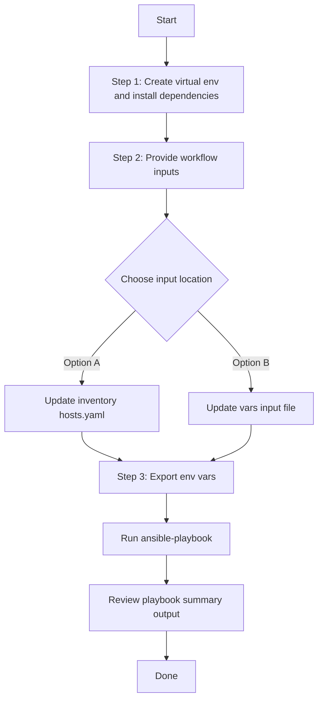

# Plug and Play Config Generator

## Table of Contents

- [User Flow (3 Steps)](#user-flow-3-steps)

- [Overview](#overview)
- [Features](#features)
- [Prerequisites](#prerequisites)
- [Workflow Structure](#workflow-structure)
- [Schema Parameters](#schema-parameters)
- [Getting Started](#getting-started)
- [Operations](#operations)
- [Examples](#examples)

---

## Overview

The Plug and Play config generator automates YAML playbook generation for existing PnP device registrations in Cisco Catalyst Center. It extracts brownfield PnP device information and creates output compatible with `pnp_workflow_manager`, so you can reuse discovered data for automation, migration, and documentation.

---

## Features

- **Configuration Generation**: Generate YAML configurations compatible with `pnp_workflow_manager`.
  - Extract existing PnP device inventory from Catalyst Center.
  - Convert API response data into playbook-ready YAML.
  - Generate files that are ready for Ansible-driven workflows.
- **State-Based Filtering**: Filter output using PnP lifecycle states (`Unclaimed`, `Planned`, `Onboarding`, `Provisioned`, `Error`).
- **Component Filtering**: Restrict generated output to the supported `device_info` component.
- **Flexible Output**: Supports custom file paths and `overwrite` / `append` modes.
- **Brownfield Support**: Automatically discover all registered PnP devices.

---

## Prerequisites

### Software Requirements

| Component | Version |
|-----------|---------|
| Ansible | 2.13+ |
| cisco.catalystcenter collection | 2.6.0 |
| Python | 3.9+ |
| Cisco Catalyst Center | 2.3.7.9+ |
| catalystcentersdk | 2.9.3+ |

### Required Collections

```bash
ansible-galaxy collection install cisco.catalystcenter
ansible-galaxy collection install ansible.utils
pip install catalystcentersdk
pip install yamale
```

### Access Requirements

- Catalyst Center credentials with read access to PnP inventory
- Network connectivity to Catalyst Center APIs
- Existing devices registered in PnP

---

## Workflow Structure

```
pnp_config_generator/
├── playbook/
│   └── pnp_config_generator.yml             # Main operations
├── vars/
│   └── pnp_config_inputs.yml                # Input examples
├── schema/
│   └── pnp_config_schema.yml                # Input validation
└── README.md
```

---

## Schema Parameters

### Basic Configuration

| Parameter | Type | Required | Default | Description |
|-----------|------|----------|---------|-------------|
| `file_path` | string | No | auto-generated | Output file path for YAML configuration file |
| `file_mode` | string | No | `overwrite` | File write mode: `overwrite` or `append` |
| `config` | dict | No | omitted | Module-level filter dict (see [Config Filters](#config-filters) below). Omit or leave empty for full discovery |
| `component_specific_filters` | dict | No | omitted | **Legacy** — component-level filters at item level (auto-wrapped into `config` by the playbook when `config` is not provided) |
| `global_filters` | dict | No | omitted | **Legacy** — global filters at item level (auto-wrapped into `config` by the playbook when `config` is not provided) |

### Config Filters

The `config` dict mirrors the module's `config` parameter and supports:

| Parameter | Type | Required | Description |
|-----------|------|----------|-------------|
| `component_specific_filters` | dict | No | Component-level filters |
| `global_filters` | dict | No | Global filters such as PnP state |

#### Component Specific Filters

| Parameter | Type | Required | Description |
|-----------|------|----------|-------------|
| `components_list` | list[string] | No | Supported value: `device_info` |

#### Global Filters

| Parameter | Type | Required | Description |
|-----------|------|----------|-------------|
| `device_state` | list[string] | No | PnP workflow states to include |

**Valid `device_state` values:**
- `Unclaimed`
- `Planned`
- `Onboarding`
- `Provisioned`
- `Error`

---

## Getting Started

## Workflow Steps
## User Flow (3 Steps)



### Installation and Run (Aligned)

1. Create and activate a Python virtual environment, then install dependencies.

```bash
python3 -m venv .venv
source .venv/bin/activate
pip install -r requirements.txt
ansible-galaxy collection install cisco.catalystcenter --force
```

2. Provide workflow inputs in either inventory (`inventory/demo_lab/hosts.yaml`) or the workflow `vars/` file.

3. Export Catalyst Center environment variables and run the playbook.

```bash
export HOSTIP=<catalyst-center-ip-or-fqdn>
export CATALYST_CENTER_USERNAME=<username>
export CATALYST_CENTER_PASSWORD='<password>'
ansible-playbook -i ./inventory/demo_lab/hosts.yaml \
  workflows/pnp_config_generator/playbook/pnp_config_generator.yml \
  --extra-vars VARS_FILE_PATH=./workflows/pnp_config_generator/vars/pnp_config_inputs.yml -vvvv
```


## Operations

### Generate Operations (state: gathered)

Use `pnp_config_generator.yml` for all generation tasks.

#### Generate All Configurations

**Description**: Retrieves all registered PnP devices from Catalyst Center. To generate all configurations, omit `config` or leave it empty.

```yaml
pnp_config:
  - file_path: "/tmp/pnp_all_device_info.yml"
    file_mode: overwrite
```

#### State-Based Filtering

**Description**: Generates configuration for devices in specific PnP workflow states only.

**Filter Unclaimed Devices**

```yaml
pnp_config:
  - file_path: "/tmp/pnp_unclaimed_devices.yml"
    file_mode: overwrite
    config:
      component_specific_filters:
        components_list: ["device_info"]
      global_filters:
        device_state: ["Unclaimed"]
```

**Filter Planned and Onboarding Devices**

```yaml
pnp_config:
  - file_path: "/tmp/pnp_planned_onboarding.yml"
    file_mode: overwrite
    config:
      component_specific_filters:
        components_list: ["device_info"]
      global_filters:
        device_state: ["Planned", "Onboarding"]
```

**Validate and Execute:**

```bash
# Validate
./tools/schemavalidation.sh -s workflows/pnp_config_generator/schema/pnp_config_schema.yml \
                            -d workflows/pnp_config_generator/vars/pnp_config_inputs.yml
```
Expected validation output:
```
# Command to run (from dnac_ansible_workflows/ directory):
# ./tools/schemavalidation.sh -s workflows/pnp_config_generator/schema/pnp_config_schema.yml \
#                             -d workflows/pnp_config_generator/vars/pnp_config_inputs.yml

# --- Output ---
workflows/pnp_config_generator/schema/pnp_config_schema.yml
workflows/pnp_config_generator/vars/pnp_config_inputs.yml
yamale   -s workflows/pnp_config_generator/schema/pnp_config_schema.yml  workflows/pnp_config_generator/vars/pnp_config_inputs.yml
Validating workflows/pnp_config_generator/vars/pnp_config_inputs.yml...
Validation success! 👍
```

```bash
# Execute
ansible-playbook -i inventory/demo_lab/hosts.yaml \
  workflows/pnp_config_generator/playbook/pnp_config_generator.yml \
  --extra-vars VARS_FILE_PATH=./workflows/pnp_config_generator/vars/pnp_config_inputs.yml
```

Expected Terminal Output:
1. Generate All Configurations
```code
        file_path: /tmp/pnp_all_device_info.yml
      msg:
        YAML config generation Task succeeded for module 'pnp_workflow_manager'.:
          devices_count: 5
          file_path: /tmp/pnp_all_device_info.yml
      response:
        YAML config generation Task succeeded for module 'pnp_workflow_manager'.:
          devices_count: 5
          file_path: /tmp/pnp_all_device_info.yml
      status: success
    skipped: false
```

2. State-Based Filtering:

a. Unclaimed Device Filter:
```code
        config:
          component_specific_filters:
            components_list:
            - device_info
          global_filters:
            device_state:
            - Unclaimed
        file_path: /tmp/pnp_unclaimed_devices.yml
      msg:
        YAML config generation Task succeeded for module 'pnp_workflow_manager'.:
          devices_count: 3
          file_path: /tmp/pnp_unclaimed_devices.yml
      response:
        YAML config generation Task succeeded for module 'pnp_workflow_manager'.:
          devices_count: 3
          file_path: /tmp/pnp_unclaimed_devices.yml
      status: success
    skipped: false
```

b. Planned and Onboarding Device Filter:
```code
        config:
          component_specific_filters:
            components_list:
            - device_info
          global_filters:
            device_state:
            - Planned
            - Onboarding
        file_path: /tmp/pnp_planned_onboarding.yml
      msg:
        YAML config generation Task succeeded for module 'pnp_workflow_manager'.:
          devices_count: 2
          file_path: /tmp/pnp_planned_onboarding.yml
      response:
        YAML config generation Task succeeded for module 'pnp_workflow_manager'.:
          devices_count: 2
          file_path: /tmp/pnp_planned_onboarding.yml
      status: success
    skipped: false
```

---

## Examples

### Example 1: Generate ALL PnP devices (full discovery)

```yaml
pnp_config:
  - file_path: "/tmp/pnp_all_device_info.yml"
```

After running the playbook, the following YAML configuration is generated.

```yaml
---
config:
- deviceInfo:
    hostname: switch-01
    serialNumber: FJC2234L0GH
    pid: C9300-48P
    state: Unclaimed
    sudiRequired: false
    aaaCredentials:
      username: ''
      password: ''
- deviceInfo:
    hostname: switch-02
    serialNumber: FJC2241L0TQ
    pid: C9200-24P
    state: Planned
    sudiRequired: false
    aaaCredentials:
      username: ''
      password: ''
- deviceInfo:
    hostname: router-01
    serialNumber: FGL2214L09J
    pid: ISR4451-X/K9
    state: Onboarding
    sudiRequired: false
    aaaCredentials:
      username: ''
      password: ''
- deviceInfo:
    hostname: switch-03
    serialNumber: FJC2254L0ZR
    pid: C9300-24T
    state: Provisioned
    sudiRequired: false
    aaaCredentials:
      username: ''
      password: ''
- deviceInfo:
    hostname: switch-04
    serialNumber: FJC2261L0MK
    pid: C9200-48P
    state: Error
    sudiRequired: false
    aaaCredentials:
      username: ''
      password: ''
```

### Example 2: Generate only device_info component (config: key)

```yaml
pnp_config:
  - file_path: "/tmp/pnp_device_info_component.yml"
    config:
      component_specific_filters:
        components_list: ["device_info"]
```


After running the playbook, the following YAML configuration is generated.

```yaml
---
config:
- deviceInfo:
    hostname: switch-01
    serialNumber: FJC2234L0GH
    pid: C9300-48P
    state: Unclaimed
    sudiRequired: false
    aaaCredentials:
      username: ''
      password: ''
- deviceInfo:
    hostname: switch-02
    serialNumber: FJC2241L0TQ
    pid: C9200-24P
    state: Planned
    sudiRequired: false
    aaaCredentials:
      username: ''
      password: ''
```

### Example 4: Generate only unclaimed devices (config: key)

```yaml
pnp_config:
  - file_path: "/tmp/pnp_unclaimed_devices.yml"
    config:
      component_specific_filters:
        components_list: ["device_info"]
      global_filters:
        device_state: ["Unclaimed"]
```

After running the playbook, the following YAML configuration is generated having details for only Unclaimed PnP devices.

```yaml
---
config:
- deviceInfo:
    hostname: switch-01
    serialNumber: FJC2234L0GH
    pid: C9300-48P
    state: Unclaimed
    sudiRequired: false
    aaaCredentials:
      username: ''
      password: ''
- deviceInfo:
    hostname: router-02
    serialNumber: FGL2224L08B
    pid: ISR4331/K9
    state: Unclaimed
    sudiRequired: false
    aaaCredentials:
      username: ''
      password: ''
- deviceInfo:
    hostname: ap-01
    serialNumber: KWC2143L0FT
    pid: AIR-AP2802I-B-K9
    state: Unclaimed
    sudiRequired: false
    aaaCredentials:
      username: ''
      password: ''
```

### Example 5: Generate multiple states and append output (config: key)

```yaml
pnp_config:
  - file_path: "/tmp/pnp_device_info_aggregate.yml"
    file_mode: "append"
    config:
      component_specific_filters:
        components_list: ["device_info"]
      global_filters:
        device_state: ["Planned", "Provisioned"]
```

After running the playbook, the following YAML configuration is generated having details for Planned and Provisioned PnP devices.

```yaml
---
config:
- deviceInfo:
    hostname: switch-02
    serialNumber: FJC2241L0TQ
    pid: C9200-24P
    state: Planned
    sudiRequired: false
    aaaCredentials:
      username: ''
      password: ''
- deviceInfo:
    hostname: switch-03
    serialNumber: FJC2254L0ZR
    pid: C9300-24T
    state: Provisioned
    sudiRequired: false
    aaaCredentials:
      username: ''
      password: ''
```

### Example 6: Generate unclaimed devices (legacy item-level filters)

```yaml
pnp_config:
  - file_path: "/tmp/pnp_unclaimed_legacy.yml"
    component_specific_filters:
      components_list: ["device_info"]
    global_filters:
      device_state: ["Unclaimed"]
```

After running the playbook, the following YAML configuration is generated having details for Unclaimed PnP devices using legacy filter format.

```yaml
---
config:
- deviceInfo:
    hostname: switch-01
    serialNumber: FJC2234L0GH
    pid: C9300-48P
    state: Unclaimed
    sudiRequired: false
    aaaCredentials:
      username: ''
      password: ''
- deviceInfo:
    hostname: router-02
    serialNumber: FGL2224L08B
    pid: ISR4331/K9
    state: Unclaimed
    sudiRequired: false
    aaaCredentials:
      username: ''
      password: ''
```

---

## Notes

- `pnp_playbook_config_generator` accepts `config` as a dictionary with `component_specific_filters` and `global_filters` suboptions.
- This workflow supports multiple entries via the `pnp_config` list, executing the module once per entry.
- The playbook resolves `config` using the following priority chain per item:
  1. `config:` dict defined → passed directly to module
  2. `component_specific_filters` / `global_filters` at item level → auto-wrapped into `config` dict (legacy)
  3. None defined → module `config` omitted (full discovery)
- Only `device_info` is currently supported for `components_list`.
- Valid `device_state` values: `Unclaimed`, `Planned`, `Onboarding`, `Provisioned`, `Error`.

---

## Additional Resources

- [Cisco Catalyst Center Documentation](https://www.cisco.com/c/en/us/support/cloud-systems-management/dna-center/series.html)
- [Cisco DNA Center SDK](https://catalystcentersdk.readthedocs.io/)
- [Ansible Documentation](https://docs.ansible.com/)
