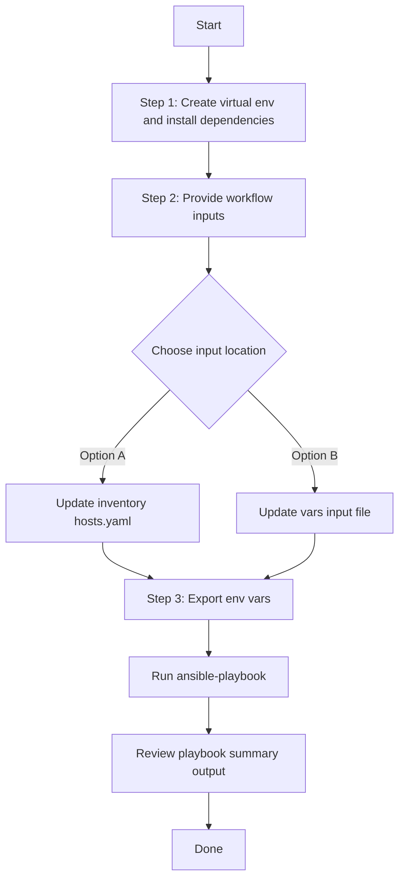

# Plug and Play Config Generator

## Table of Contents

- [User Flow (3 Steps)](#user-flow-3-steps)

- [Overview](#overview)
- [Features](#features)
- [Prerequisites](#prerequisites)
- [Workflow Structure](#workflow-structure)
- [Schema Parameters](#schema-parameters)
- [Getting Started](#getting-started)
- [Operations](#operations)
- [Examples](#examples)---

## Overview

The Plug and Play config generator automates YAML playbook generation for existing PnP device registrations in Cisco Catalyst Center. It extracts brownfield PnP device information and creates output compatible with `pnp_workflow_manager`, so you can reuse discovered data for automation, migration, and documentation.

---

## Features

- **Configuration Generation**: Generate YAML configurations compatible with `pnp_workflow_manager`.
  - Extract existing PnP device inventory from Catalyst Center.
  - Convert API response data into playbook-ready YAML.
  - Generate files that are ready for Ansible-driven workflows.
- **State-Based Filtering**: Filter output using PnP lifecycle states (`Unclaimed`, `Planned`, `Onboarding`, `Provisioned`, `Error`).
- **Component Filtering**: Restrict generated output to the supported `device_info` component.
- **Flexible Output**: Supports custom file paths and `overwrite` / `append` modes.
- **Brownfield Support**: Automatically discover all registered PnP devices.

---

## Prerequisites

### Software Requirements

| Component | Version |
|-----------|---------|
| Ansible | 2.13+ |
| cisco.dnac collection | 6.40.0+ |
| Python | 3.9+ |
| Cisco Catalyst Center | 2.3.7.9+ |
| dnacentersdk | 2.9.3+ |

### Required Collections

```bash
ansible-galaxy collection install cisco.dnac
ansible-galaxy collection install ansible.utils
pip install dnacentersdk
pip install yamale
```

### Access Requirements

- Catalyst Center credentials with read access to PnP inventory
- Network connectivity to Catalyst Center APIs
- Existing devices registered in PnP

---

## Workflow Structure

```
pnp_config_generator/
├── playbook/
│   └── pnp_config_generator.yml             # Main operations
├── vars/
│   └── pnp_config_inputs.yml                # Input examples
├── schema/
│   └── pnp_config_schema.yml                # Input validation
└── README.md
```

---

## Schema Parameters

### Basic Configuration

| Parameter | Type | Required | Default | Description |
|-----------|------|----------|---------|-------------|
| `generate_all_configurations` | boolean | No | false | Workflow convenience flag. When true, playbook omits module `config` and retrieves all PnP devices |
| `file_path` | string | No | auto-generated | Output file path for YAML configuration file |
| `file_mode` | string | No | `overwrite` | File write mode: `overwrite` or `append` |
| `component_specific_filters` | dict | No | omitted | Component-level filters |
| `global_filters` | dict | No | omitted | Global filters such as PnP state |

### Component Filters

| Parameter | Type | Required | Description |
|-----------|------|----------|-------------|
| `components_list` | list[string] | No | Supported value: `device_info` |

### Global Filters

| Parameter | Type | Required | Description |
|-----------|------|----------|-------------|
| `device_state` | list[string] | No | PnP workflow states to include |

**Valid `device_state` values:**
- `Unclaimed`
- `Planned`
- `Onboarding`
- `Provisioned`
- `Error`

---

## Getting Started

## Workflow Steps
## User Flow (3 Steps)



### Installation and Run (Aligned)

1. Create and activate a Python virtual environment, then install dependencies.

```bash
python3 -m venv .venv
source .venv/bin/activate
pip install -r requirements.txt
ansible-galaxy collection install cisco.dnac --force
```

2. Provide workflow inputs in either inventory (`inventory/demo_lab/hosts.yaml`) or the workflow `vars/` file.

3. Export Catalyst Center environment variables and run the playbook.

```bash
export HOSTIP=<catalyst-center-ip-or-fqdn>
export CATALYST_CENTER_USERNAME=<username>
export CATALYST_CENTER_PASSWORD='<password>'
ansible-playbook -i ./inventory/demo_lab/hosts.yaml ./workflows/pnp_config_generator/playbook/pnp_config_generator.yml -vvvv
```


## Operations

### Generate Operations (state: gathered)

Use `pnp_config_generator.yml` for all generation tasks.

1. **Generate All PnP Devices**
- Set `generate_all_configurations: true`
- Playbook omits module `config` and retrieves all supported PnP device information

2. **Generate with Component Filter**
- Use `component_specific_filters.components_list: ["device_info"]`

3. **Generate with State Filter**
- Use `global_filters.device_state` to target one or more PnP states

4. **Append Outputs**
- Set `file_mode: append` to accumulate generated YAML into an existing file

---

## Examples

### Example 1: Generate all PnP device info

```yaml
pnp_config:
  - generate_all_configurations: true
    file_path: "/tmp/pnp_all_device_info.yml"
```

### Example 2: Generate only unclaimed devices

```yaml
pnp_config:
  - file_path: "/tmp/pnp_unclaimed_devices.yml"
    component_specific_filters:
      components_list: ["device_info"]
    global_filters:
      device_state: ["Unclaimed"]
```

### Example 3: Generate multiple states and append output

```yaml
pnp_config:
  - file_path: "/tmp/pnp_device_info_aggregate.yml"
    file_mode: "append"
    component_specific_filters:
      components_list: ["device_info"]
    global_filters:
      device_state: ["Planned", "Provisioned"]
```

---

## Notes

- `pnp_playbook_config_generator` accepts `config` as a dictionary.
- This workflow allows multiple entries via `pnp_config` list and executes the module once per entry.
- If both filters are omitted in an entry, the workflow omits `config` and runs in full discovery mode.
