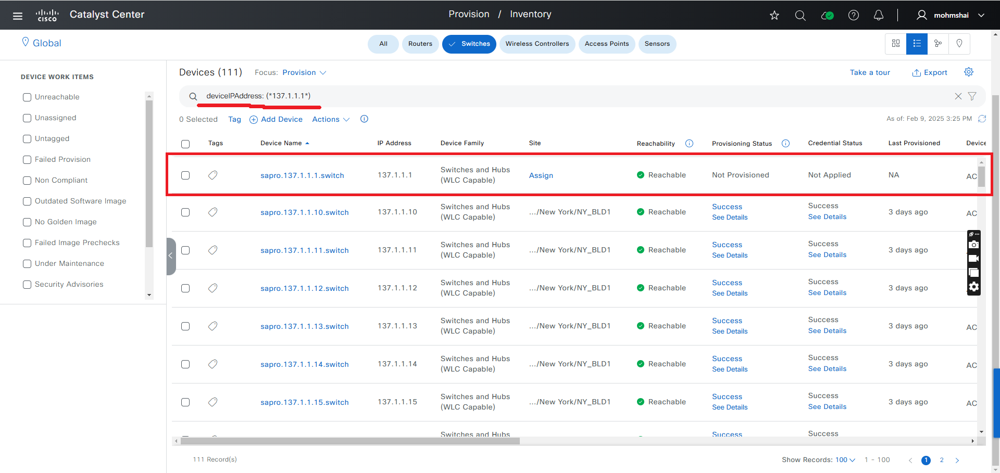
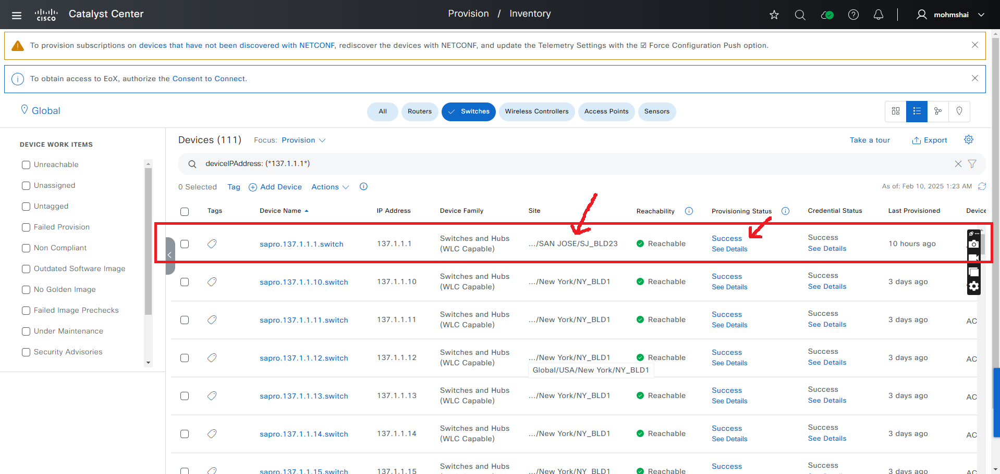
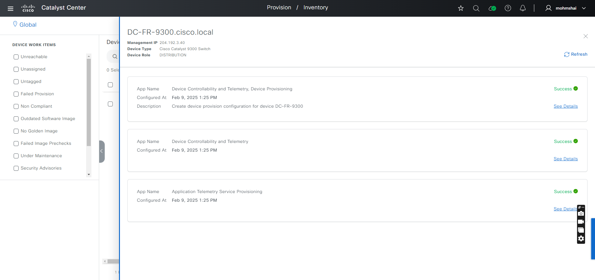
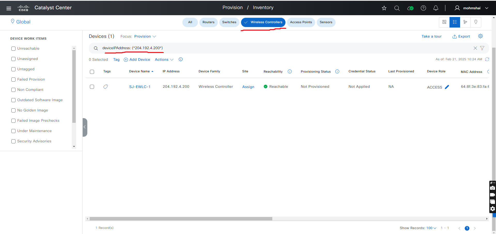
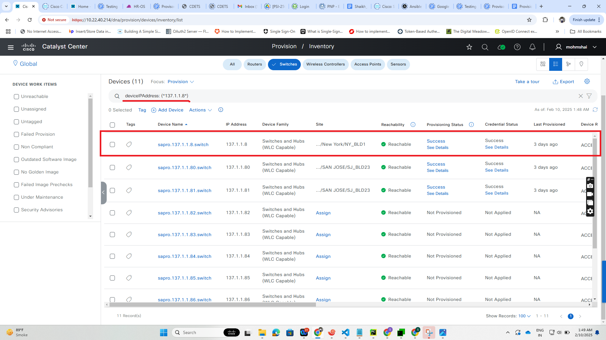

# Provision Workflow Playbook
This workflow playbook automates the process of assigning device to sites, provisioning, reprovisioning and deleting devices in Cisco DNA (Catalyst Center) inventory.
It is supported from Catalyst Center Release version 2.3.7.6

## Workflow Main Tasks
- **Site Assignment**: Assign a device to a site_hierarchy without provisioning
- **Device Provision**: Assign a device to site and provision.
- **Device Re-Provision**: Re-provision an already provisioned device.
- **Device Un-Provision**: Remove a provisioned device from the inventory.

#### To run this workflow, follow the README.md instruction

## Procedure 

### 1. Prepare Your Ansible Environment
- Install ansible if you haven't already installed (recommend ansible:9.9.0 or higher)
- Ensure you have network connectivity to your Catalyst Center instance
- Checkout the project and playbooks: git@github.com:cisco-en-programmability/catalyst-center-ansible-iac.git

###  2. Configure Hosts Inventory
- Update hosts.yml with the connection details of your DNA Center instance. 

#### The Sample host_inventory_dnac1/hosts.yml

```bash
catalyst_center_hosts:
    hosts:
        catalyst_center220:
            dnac_host: xx.xx.xx.xx.
            dnac_password: XXXXXXXX
            dnac_port: 443
            dnac_timeout: 60
            dnac_username: admin
            dnac_verify: false
            dnac_version: 2.3.7.6
            dnac_debug: true
            dnac_log_level: INFO
            dnac_log: true
```

#### User Inputs for Users and roles are stored in workflows/provision/vars/provision_workflow_inputs.yml 

### 3. Defining device details 
provision_details section specifies the list of devices and their configurations for the devices to be run through the playbooks.
To configure this, refer to the full workflow specification: [Ansible Galaxy - Provision Workflow Manager](https://galaxy.ansible.com/ui/repo/published/cisco/dnac/content/module/provision_workflow_manager/).

### Validate the input file using yamale: (recommended)
```bash
#validates input file against the schema
(pyats) dnac_ansible_workflows % ./tools/validate.sh -s workflows/provision/schema/provision_workflow_schema.yml -d workflows/provision/vars/provision_workflow_inputs.yml 
workflows/provision/schema/provision_workflow_schema.yml
workflows/provision/vars/provision_workflow_inputs.yml

#sample output validation
yamale   -s workflows/provision/schema/provision_workflow_schema.yml  workflows/provision/vars/provision_workflow_inputs.yml
Validating /Users/pawansi/dnac_ansible_workflows/workflows/provision/vars/provision_workflow_inputs.yml...
Validation success! 👍
```

## Workflow overview with example

## 1. Site Assignment:
#### Assign a device to a site without provision. set provisioning: False

### Example: Wired device
#### Input (YAML)
```bash
---
catalyst_center_version: 2.3.7.6
provision_details:
# Wired device controller site assignment
  - site_name_hierarchy: Global/USA/SAN JOSE/SJ_BLD21
    management_ip_address: XX.XX.XX.XX
    provisioning: False 
```

### Step1: The device is not assigned or provisioned 

#### Before running the playbook, ensure that the device is neither assigned nor provisioned.


    
### Step2: Execute the site assignment playbook. 

#### Run the following command to assign the device to a site without provisioning:

```bash
ansible-playbook -i ./inventory/demo_lab/inventory_demo_lab.yml ./workflows/provision/playbook/provision_workflow_playbook.yml --extra-vars VARS_FILE_PATH=./../vars/provision_workflow_inputs.yml -vvvv
```

#### Upon successful completion, the device is assigned to a site.



### Step 3: Verify the playbook output

#### Upon successful completion, you will see an output similar to:

response: [] 

### Step 4: Verify site assignment details

#### Site Assignment details can be verified in UI.


### Notes: 
- Site Assignment for wireless device via playbook is not supported yet (Work in progress).
- Site Assignment for bulk wired devices is supported. Please refer to the "Assign devices to sites without provisioning" section in the provision_workflow_inputs.yml.

## 2. Provisioning:
#### Assigns device to a site and configures them.

### Example: Wired device
#### Input (YAML)
```bash
---
catalyst_center_version: 2.3.7.6
provision_details:
# Wired device controller provisioning
  - site_name_hierarchy: Global/USA/SAN JOSE/SJ_BLD21
    management_ip_address: XX.XX.XX.XX
```

### Step 1: Device is in non-provisioned state

#### Before running the playbook, ensure that the device is neither assigned nor provisioned.


### Step 2: Execute the provision workflow playbook

#### Run the following command to initiate the provisioning process: 

```bash
ansible-playbook -i ./inventory/demo_lab/inventory_demo_lab.yml ./workflows/provision/playbook/provision_workflow_playbook.yml --extra-vars VARS_FILE_PATH=./../vars/provision_workflow_inputs.yml -vvvv
```

#### On a successful completion, the device is assigned and provisioned.


### Step 3: Verify playbook output

#### Upon successful completion, the expected output will be:

```bash
"msg": "Provisioning of the device 'xx.xx.xx.xx' completed successfully.",
"response": "Provisioning of the device 'xx.xx.xx.xx' completed successfully."
```

### Step 4: Verify the Provisioning Configuration

#### Provision configuration can be verified in the UI. 



### Example: Wireless device
#### Input (YAML)
```bash
provision_details:
  - site_name_hierarchy: Global/USA/SAN JOSE/SJ_BLD21
    management_ip_address: xx.xx.xx.xx
    managed_ap_locations:
      - Global/USA/SAN JOSE/SJ_BLD21/FLOOR1
      - Global/USA/SAN JOSE/SJ_BLD21/FLOOR2
      - Global/USA/SAN JOSE/SJ_BLD21/FLOOR3
      - Global/USA/SAN JOSE/SJ_BLD21/FLOOR4
```

### Notes: 
- Ensure that the WLC device provision configuration details are added in provision_workflow_inputs.yml before running the playbook.
- Bulk device provision operation can be performed on wired and wirless devices.

### Step 1: WLC Device is in Non-Provisioned State

#### Before running the playbook, ensure that the device is neither assigned nor provisioned.



### Step 2: Execute the provision workflow playbook

#### Run the following command to initiate the provisioning process: 

```bash
ansible-playbook -i ./inventory/demo_lab/inventory_demo_lab.yml ./workflows/provision/playbook/provision_workflow_playbook.yml --extra-vars VARS_FILE_PATH=./../vars/provision_workflow_inputs.yml -vvvv
```

#### On a successful completion, the device is assigned and provisioned.


### Step 3: Verify playbook output

#### Upon successful completion, the expected output will be.

```bash
"msg": "Provisioning of the wireless device 'XX.XX.XX.XX' completed successfully.",
"response": "Provisioning of the wireless device 'XX.XX.XX.XX' completed successfully."
```

### Step 4: Verify the Provisioning Configuration

#### Provision configuration can be verified in the UI. 


## 3. Device Re-Provision: 
#### Re-Provision an already provisioned device by setting re_provisioning: True

### Example: Wired device
#### Input (YAML) 
```bash
---
#Select Catalyst Cennter version, this one overwrite the default version from host file
catalyst_center_version: 2.3.7.6
provision_details:
  #Reprovision wired device Hubs and Switches
  - site_name_hierarchy: Global/USA/SAN JOSE/SJ_BLD21
    management_ip_address: XX.XX.XX.XX
    force_provisioning: True
```

### Step1: Device in a provisioned state

#### Before running the playbook, the device is already in a provisioned state.


    
### Step2: Execute the provision playbook. 

#### Run the following command to reprovision already provision device

```bash
ansible-playbook -i ./inventory/demo_lab/inventory_demo_lab.yml ./workflows/provision/playbook/provision_workflow_playbook.yml --extra-vars VARS_FILE_PATH=./../vars/provision_workflow_inputs.yml -vvvv
```

#### On a successful completion, the device is reprovisioned.


### Step 3: Verify the playbook output

#### If the re-provisioning is successful, the output will be similar to:

```bash
"msg": "Re-Provision for device 'xx.xx.xx.xx' done successfully",
"response": "Wired Device 'xx.xx.xx.xx' re-provisioning completed successfully."
```

### Step 4: Validate Device Re-Provisioning in UI

#### You can verify the re-provisioning details in the Catalyst Center UI.


### Example: Wireless device
#### Input (YAML)
```bash
---
#Select Catalyst Cennter version, this one overwrite the default version from host file
catalyst_center_version: 2.3.7.6
#Reprovision wireless device
provision_details:
  - site_name_hierarchy: Global/USA/SAN JOSE/SJ_BLD21
    management_ip_address: 204.192.4.200
    managed_ap_locations:
      - Global/USA/SAN JOSE/SJ_BLD21/FLOOR1
      - Global/USA/SAN JOSE/SJ_BLD21/FLOOR2
      - Global/USA/SAN JOSE/SJ_BLD21/FLOOR3
      - Global/USA/SAN JOSE/SJ_BLD21/FLOOR4
    force_provisioning: True
```

### Notes: 
- Ensure that the WLC device re-provision configuration details are added in provision_workflow_inputs.yml before running the playbook.
- Bulk device re-provisioning can be performed on both wired and wireless devices.

### Step1: Device in a provisioned state

#### Before running the playbook, the device is already in a provisioned state.


### Step 2: Execute the provision workflow playbook

#### Run the following command to initiate the re-provisioning process: 

```bash
ansible-playbook -i ./inventory/demo_lab/inventory_demo_lab.yml ./workflows/provision/playbook/provision_workflow_playbook.yml --extra-vars VARS_FILE_PATH=./../vars/provision_workflow_inputs.yml -vvvv
```

#### On a successful completion, the device is reprovisioned.


### Step 3: Verify the playbook output

#### If the re-provisioning is successful, the output will be similar to:

```bash
"msg": "Provisioning of the wireless device 'XX.XX.XX.XX' completed successfully.",
"response": "Provisioning of the wireless device 'XX.XX.XX.XX' completed successfully."
```

### Step 4: Validate Device Re-Provisioning in UI

#### You can verify the re-provisioning details in the Catalyst Center UI.


## 4. Device Un-Provision:
#### Un-Provision a previously provisioned device, removing it from the inventory.

### Example: Wired device
#### Input (YAML)
```bash
provision_details:
  - management_ip_address: xx.xx.xx.xx
```

### Step1: The device is in provisioned state

#### Before executing the playbook, the device is in a provisioned state.


### Step2: Execute the Un-Provision playbook. 

#### Run the following command to unprovision the device:

```bash
ansible-playbook -i ./inventory/demo_lab/inventory_demo_lab.yml ./workflows/provision/playbook/delete_provision_workflow_playbook.yml --extra-vars VARS_FILE_PATH=./../vars/un_provision_workflow_inputs.yml -vvvv
```

#### On a successful completion, the device will be removed.

### Step 3: Verify the playbook output

#### If the un-provisioning is successful, the output will be similar to:

```bash
"msg": "Deletion done Successfully for the device 'xx.xx.xx.xx' ",
"response": "Deletion done Successfully for the device 'xx.xx.xx.xx' "
```

### Step 4: Verify Device Removal from Inventory

#### After un-provisioning, the device is removed from the inventory.


### Notes: 
- Un-provision for wireless device is not supported yet (Work In Progress).

## Run line parameters description:

- `-i`: Specifies the inventory file containing host details.  
- `--e VARS_FILE_PATH`: Path to the variable file containing workflow inputs.  
- `-vvvv`: Enables verbose mode for detailed output.  

## Reference 
The environment used for the references in the above examples.

```bash

dnacentersdk: 2.8.3
cisco.dnac: 6.31.0
```
