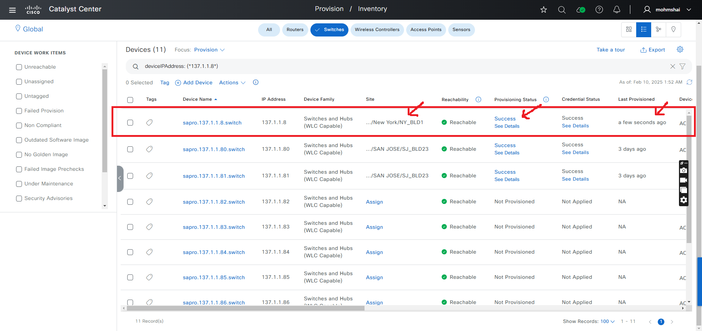

# Provision Workflow Playbook
This workflow playbook automates the process of assigning devices to sites, provisioning, reprovisioning, deleting, and enabling/disabling telemetry on devices in the Cisco DNA Center (Catalyst Center) inventory.
It is supported from Catalyst Center Release version 2.3.7.6

## Workflow Main Tasks
- **Site Assignment**: Assign a device to a site_hierarchy without provisioning.
- **Device Provision**: Assign a device to site and provision.
- **Device Re-Provision**: Re-provision an already provisioned device.
- **Device Un-Provision**: Remove a provisioned device from the inventory.
- **Application Telemetry**: Configure application telemetry to gather detailed insights such as latency, jitter, packet loss and throughput for monitored applications. (Supported from Catalyst Center version 2.3.7.9)

## Workflow Steps

### This workflow typically involves the following steps:

### Step 1: Install and Configure Host Inventory

1.  **Install Ansible:** Follow the official Ansible documentation for installation instructions.
2.  **Install Cisco Catalyst Center Collection:**
    ```bash
    ansible-galaxy collection install cisco.dnac
    ```
3.  **Generate Inventory:** Create an Ansible inventory file (e.g., `inventory.yml`) that includes your Cisco Catalyst Center appliance details. You will need to define variables such as the host, username, and password (or other authentication methods).
    ```yaml
    catalyst_center_hosts:
        hosts:
            your_catalyst_center_instance_name:
                catalyst_center_host: xx.xx.xx.xx
                catalyst_center_password: XXXXXXXX
                catalyst_center_port: 443
                catalyst_center_timeout: 60
                catalyst_center_username: admin
                catalyst_center_verify: false # Set to true for production with valid certificates
                catalyst_center_version: 2.3.7.9 # Specify your DNA Center version
                catalyst_center_debug: true
                catalyst_center_log_level: INFO
                catalyst_center_log: true
    ```

### Step 2: Define Inputs and Schema Overview

This step involves preparing the input data for creating and managing provision workflow manager and validating your setup.

1.  **Define Input Variables:** Create variable files (e.g., `vars/provision_workflow_inputs.yml`) that define the desired state of your provision workflow, including details for provision, unprovision, reprovision, site assignment, and application telemetry.

#### **Schema for Provision Workflow Manager**
The schema file (e.g., `schema/provision_workflow_schema.yml`) defines the structure and validation rules for the input variables. It includes details such as required fields, data types, and constraints.

**provision_details_type**

| **Parameter**                  | **Type**   | **Required** | **Description**                                         |
|-------------------------------|------------|--------------|---------------------------------------------------------|
| site_name_hierarchy           | string     | No           | Site hierarchy (site path)                              |
| management_ip_address         | string     | Yes          | Management IP address of the device                     |
| provisioning                  | bool       | No           | True for provisioning, False for site assignment only   |
| managed_ap_locations          | list       | No           | List of AP site locations (wireless devices)            |
| dynamic_interfaces            | list       | No           | List of dynamic interface configurations                |
| force_provisioning            | bool       | No           | Force reprovisioning (wired devices only)               |
| primary_managed_ap_locations  | list       | No           | Primary AP site locations (wireless devices)            |
| rolling_ap_upgrade            | dict       | No           | Rolling AP upgrade configuration                        |
| secondary_managed_ap_locations| list       | No           | Secondary AP site locations (wireless devices)          |
| skip_ap_provision             | bool       | No           | Skip AP provisioning                                   |

**rolling_ap_upgrade_type**

| **Parameter**               | **Type**   | **Required** | **Description**                                      |
|----------------------------|------------|--------------|------------------------------------------------------|
| ap_reboot_percentage       | int        | No           | Percentage of APs to reboot at once during upgrade   |
| enable_rolling_ap_upgrade  | bool       | No           | Enable rolling AP upgrade                            |

**dynamic_interfaces_type**

| **Parameter**                  | **Type**   | **Required** | **Description**                                   |
|-------------------------------|------------|--------------|---------------------------------------------------|
| interface_gateway             | string     | No           | Gateway IP address for the interface              |
| interface_ip_address          | string     | No           | IP address assigned to the interface              |
| interface_name                | string     | No           | Name of the interface                             |
| interface_netmask_in_c_i_d_r  | int        | No           | Netmask in CIDR format (e.g., 24)                 |
| lag_or_port_number            | int        | No           | Port number or LAG identifier                     |
| vlan_id                       | int        | No           | VLAN ID associated with the
 
**application_telemetry_type**

| **Parameter**         | **Type**   | **Required** | **Description**                                   |
|----------------------|------------|--------------|---------------------------------------------------|
| device_ips           | list       | Yes          | List of device IPs                                |
| telemetry            | string     | Yes          | Telemetry type                                    |
| wlan_mode            | string     | No           | WLAN mode                                         |
| include_guest_ssid   | bool       | No           | Include guest SSID in

Can refer to the full workflow specification details here: [Ansible Galaxy - Provision Workflow Manager](https://galaxy.ansible.com/ui/repo/published/cisco/dnac/content/module/provision_workflow_manager/).


## Workflow overview with example

## a. **Site Assignment**:
### Assign a device to a site without provision. set provisioning: False

**prerequisite**: Ensure the device is present in the inventory and that device is neither assigned nor provisioned.

### Example: Wired device
#### Input (YAML)
```yml
---
catalyst_center_version: 2.3.7.6
provision_details:
# Wired device controller site assignment
  - site_name_hierarchy: Global/USA/SAN JOSE/SJ_BLD21
    management_ip_address: XX.XX.XX.XX
    provisioning: False 
```

#### Upon successful completion, the device is assigned to a site and you will see an output similar to the following:


```bash
"response": [
        "Wired Device 'XX.XX.XX.XX' is assigned to site Global/USA/SAN JOSE/SJ_BLD21."
    ],
"status": "success"
```

### Notes: 
- Site Assignment for **wireless device** via playbook is not supported yet (Work in progress).
- Site Assignment for **bulk wired devices** is supported. Please refer to the "Assign devices to sites without provisioning" section in the provision_workflow_inputs.yml.

## b. Provisioning:
### Assigns device to a site and configures them.

### Example: Wired device
#### Input (YAML)
```yml
---
catalyst_center_version: 2.3.7.6
provision_details:
# Wired device controller provisioning
  - site_name_hierarchy: Global/USA/SAN JOSE/SJ_BLD21
    management_ip_address: XX.XX.XX.XX
```

#### Upon successful completion the device is assigned and provisioned and you will see an output similar to the following:


```yml
"msg": "Provisioning of the device 'xx.xx.xx.xx' completed successfully.",
"response": "Provisioning of the device 'xx.xx.xx.xx' completed successfully."
```

### Assigns wireless device to a site and configures them.

### Example: Wireless device
#### Input (YAML)
```yml
---
provision_details:
  - site_name_hierarchy: Global/USA/SAN JOSE/SJ_BLD21
    management_ip_address: xx.xx.xx.xx
    managed_ap_locations:
      - Global/USA/SAN JOSE/SJ_BLD21/FLOOR1
      - Global/USA/SAN JOSE/SJ_BLD21/FLOOR2
      - Global/USA/SAN JOSE/SJ_BLD21/FLOOR3
      - Global/USA/SAN JOSE/SJ_BLD21/FLOOR4
```

#### Upon successful completion the device is assigned and provisioned and you will see an output similar to the following:


```yml
"msg": "Provisioning of the device 'xx.xx.xx.xx' completed successfully.",
"response": "Provisioning of the device 'xx.xx.xx.xx' completed successfully."
```

### Notes: 
- Ensure that the WLC device provision configuration details are added in **provision_workflow_inputs.yml** before running the playbook.
- Bulk device provision operation can be performed on wired and wireless devices.

## c. Device Re-Provision: 
#### Re-Provision an already provisioned device by setting re_provisioning: True

### Example: Wired device
#### Input (YAML) 
```yml
---
#Select Catalyst Center version, this one overwrite the default version from host file
catalyst_center_version: 2.3.7.6
provision_details:
  #Reprovision wired device Hubs and Switches
  - site_name_hierarchy: Global/USA/SAN JOSE/SJ_BLD21
    management_ip_address: XX.XX.XX.XX
    force_provisioning: True
```

#### Upon a successful completion, the device is reprovisioned and you will see an output similar to the following:



```yml
"msg": "Re-Provision for device 'xx.xx.xx.xx' done successfully",
"response": "Wired Device 'xx.xx.xx.xx' re-provisioning completed successfully."
```

### Reprovisioning for wireless device

### Example: Wireless device
#### Input (YAML)
```yml
---
#Select Catalyst Center version, this one overwrite the default version from host file
catalyst_center_version: 2.3.7.6
#Reprovision wireless device
provision_details:
  - site_name_hierarchy: Global/USA/SAN JOSE/SJ_BLD21
    management_ip_address: XX.XX.XX.XX
    managed_ap_locations:
      - Global/USA/SAN JOSE/SJ_BLD21/FLOOR1
      - Global/USA/SAN JOSE/SJ_BLD21/FLOOR2
      - Global/USA/SAN JOSE/SJ_BLD21/FLOOR3
      - Global/USA/SAN JOSE/SJ_BLD21/FLOOR4
    force_provisioning: True
```

#### Upon a successful completion, the device is reprovisioned and you will see an output similar to the following:


```yml
"msg": "Wireless Device 'xx.xx.xx.xx' is already provisioned.",
"response": "Wireless Device 'xx.xx.xx.xx' is already provisioned.",
```

### Notes: 
- Ensure that the WLC device re-provision configuration details are added in **provision_workflow_inputs.yml** before running the playbook.
- Bulk device re-provisioning can be performed on both wired and wireless devices.

## d. Device Un-Provision:
#### Un-Provision a previously provisioned device, removing it from the inventory.

### Example: Wired device
#### Input (YAML)
```bash
provision_details:
  - management_ip_address: xx.xx.xx.xx
```

#### Upon a successful completion, the device will be removed from the inventory and you will see an output similar to the following:


```yml
"msg": "Deletion done Successfully for the device 'xx.xx.xx.xx' ",
"response": "Deletion done Successfully for the device 'xx.xx.xx.xx' "
```

### Notes: 
- Un-provision for wireless device is not supported yet (Work In Progress).

## e. **Application Telemetry**:
#### Configure application telemetry on devices (enable/disable telemetry). The `telemetry` parameter accepts only `enable` or `disable` values.

### Example: Enable telemetry - Wired device

In this example, we are enabling application telemetry for a wired device. This helps in monitoring detailed telemetry data such as latency, jitter, packet loss etc.

#### Input (YAML)
```yml
---
catalyst_center_version: 2.3.7.9
provision_details:
  - application_telemetry:
    # Define the devices for application telemetry
    # Application telemetry for wired devices
    - device_ips: 
        - "XX.XX.XX.XX"
      telemetry: enable
```

#### Upon a successful completion, application telemetry will be enabled and you will see an output similar to the following:


```yml
{
  "msg": "Application telemetry enabling successfully for all devices.",
  "response": "Application telemetry enabling successfully for all devices.",
  "status": "success"
}
```

#### **Notes**:
To verify if telemetry is enabled on the **wired device**, you can use the following CLI commands:

```bash
show run | include ip flow monitor
sh run | i telemetry
show running-config | section telemetry
show run | sec interface
show telemetry connection all
```

### Example: Enable telemetry - Wireless device

In this example, we are enabling application telemetry for a wireless device including guest ssid and wlan_mode(Local/NON_LOCAL). This helps in monitoring detailed telemetry data such as latency, jitter, packet loss etc.

#### Input (YAML)
```yml
---
catalyst_center_version: 2.3.7.9
provision_details:
# Application telemetry for wireless devices
  - application_telemetry:
      - device_ips: 
          - "XX.XX.XX.XX"  
        telemetry: enable
        wlan_mode: "LOCAL"
        include_guest_ssid: true
```

#### Upon a successful completion, application telemetry will be enabled and you will see an output similar to the following:


```yml
{
  "msg": "Application telemetry enabling successfully for all devices.",
  "response": "Application telemetry enabling successfully for all devices.",
  "status": "success"
}
``` 

#### **Notes**: 
To verify if telemetry is enabled on the **wireless device**, you can use the following CLI commands

```bash
show telemetry connection all
show running-config | include profile
show running-config | section wireless
show flow monitor
show flow exporter
show wireless profile policy summary
show run | section wireless profile policy default-policy-profile
```

### Example: Disable telemetry - Wired device

In this example, we are disabling application telemetry for a wired device. This helps in stopping the collection of telemetry data.

#### Input (YAML)
```yml
---
catalyst_center_version: 2.3.7.9
provision_details:
  - application_telemetry:
    # Define the devices for application telemetry
    # Application telemetry for wired devices
    - device_ips: 
        - "XX.XX.XX.XX"
      telemetry: disable
```

#### Upon a successful completion, app telemetry will be disabled and you will see an output similar to the following:


```yml
{
"msg": "Application telemetry disabling successfully for all devices.",
"response": "Application telemetry disabling successfully for all devices.",
"status": "success"
}
```        

### Example: Disable telemetry - Wireless device

In this example, we are disabling application telemetry for a wireless device. This helps in stopping the collection of telemetry data.

#### Input (YAML)
```yml
---
catalyst_center_version: 2.3.7.9
provision_details:
# Application telemetry for wireless devices
  - application_telemetry:
      - device_ips: 
          - "XX.XX.XX.XX"  
        telemetry: disable
        wlan_mode: "LOCAL"
        include_guest_ssid: true
```

#### Upon a successful completion, app telemetry will be disabled and you will see an output similar to the following:


```yml
{
"msg": "Application telemetry disabling successfully for all devices.",
"response": "Application telemetry disabling successfully for all devices.",
"status": "success"
}
```

### Step 3: Deploy and Verify

a.  **Validate Configuration:** 
To ensure a successful execution of the playbooks with your specified inputs, follow these steps:

**Input Validation Against Schema**:
Before executing the playbook, it is essential to validate the input schema. This step ensures that all required parameters are included and correctly formatted. Run the following command *./tools/validate.sh -s* to perform the validation providing the schema path -d and the input path.

```bash
#validates input file against the schema
./tools/validate.sh -s workflows/provision/schema/provision_workflow_schema.yml -d workflows/provision/vars/provision_workflow_inputs.yml 
```

b.  **Run the Playbook:**

Run the playbook to seamlessly apply the provision configuration defined in your input variables to Cisco Catalyst Center. 

Before proceeding, ensure that the input validation step has been completed successfully, with no errors detected in the provided variables. Once validated, execute the playbook by specifying the input file path using the --e variable as VARS_FILE_PATH. The VARS_FILE_PATH must be provided as a full path to the input file.

```bash
ansible-playbook -i ./inventory/demo_lab/hosts.yaml ./workflows/provision/playbook/provision_workflow_playbook.yml --extra-vars VARS_FILE_PATH=./../vars/provision_workflow_inputs.yml -vvvv  
```

#### Command to unprovision a device
To unprovision a device, you can use the following command. Ensure that the input file `un_provision_workflow_inputs.yml` is correctly defined with the management IP address of the device you wish to unprovision.

```bash
ansible-playbook -i ./inventory/demo_lab/inventory_demo_lab.yml ./workflows/provision/playbook/delete_provision_workflow_playbook.yml --extra-vars VARS_FILE_PATH=./../vars/un_provision_workflow_inputs.yml -vvvv
```

c. **Verify Deployment:** 
After the playbook execution, you can verify the results in the Cisco Catalyst Center UI under the Assurance section. If dnac_debug is enabled in your inventory, you can also review the Ansible logs for detailed information on the API calls and responses.

## Run line parameters description:

- `-i`: Specifies the inventory file containing host details.  
- `--e VARS_FILE_PATH`: Path to the variable file containing workflow inputs.  
- `-vvvv`: Enables verbose mode for detailed output.  

## Reference
Refer to the workflow's schema file (workflows/provision/schema/provision_workflow_schema.yml) for the definitive list of input parameters and their descriptions.

## Note: The environment used for the references in the above instructions is as follows:

```bash
- python: 3.10.10
- dnac_version: 2.3.7.9
- ansible: 9.9.0
- cisco.dnac: 6.35.0
- dnacentersdk: 2.10.14
```