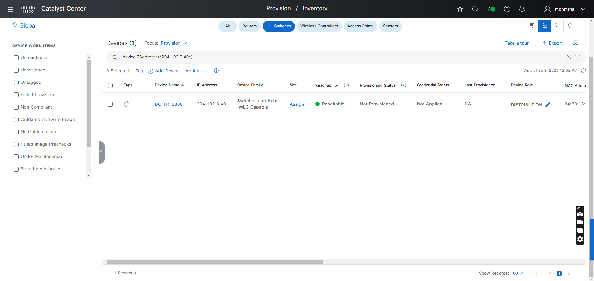
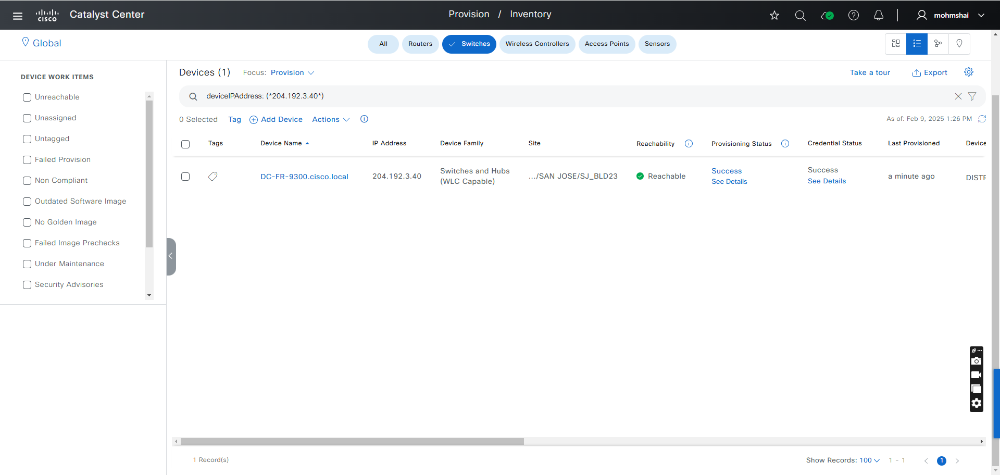
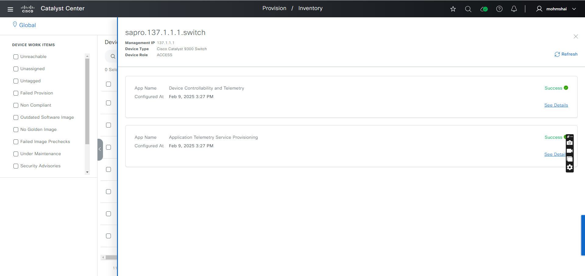
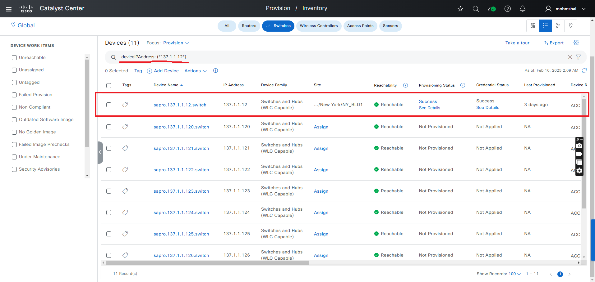
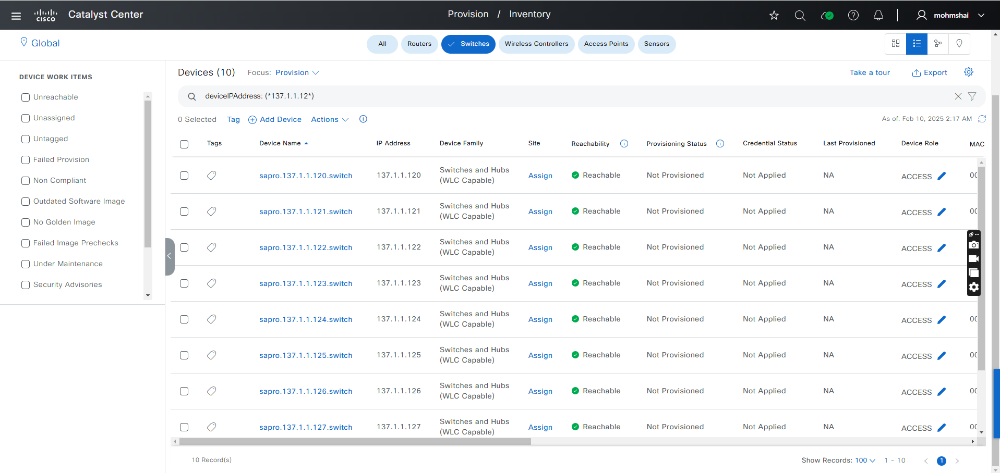

# PROVISION Workflow Playbook
Workflow Playbook for Assigning devices to sites Provisioning, Re-Provisioning and Deleting the devices in Inventory. 
This workflow playbook is supported from Catalyst Center Release version 2.3.7.6

Provision_details defines the list of devices and device details such as management_ip_address, site_name_hierarchy and configuration attributes for the devices to be run through the playbooks

To define the details you can refer the full workflow specification: https://galaxy.ansible.com/ui/repo/published/cisco/dnac/content/module/provision_workflow_manager/

To run this workflow, you follow the README.md

##Example Run:
##Run the following command to execute the playbook

ansible-playbook -i host_inventory_dnac1/hosts.yml workflows/provision/playbook/provision_workflow_playbook.yml --e VARS_FILE_PATH=../vars/provision_workflow_inputs.yml -vvvv

## Parameters:

- `-i`: Specifies the inventory file containing host details.  
- `--e VARS_FILE_PATH`: Path to the variable file containing workflow inputs.  
- `-vvvv`: Enables verbose mode for detailed output.  

## Description of Vars in `hosts.yml`

- **dnac_host**: IP address of the Catalyst Center.  
- **dnac_username**: Catalyst Center login username.  
- **dnac_password**: Catalyst Center login password.  
- **dnac_version**: Catalyst Center version.  
- **dnac_port**: Port number to which Catalyst Center listens.  
- **dnac_timeout**: Timeout for API requests made to Catalyst Center.  
- **dnac_verify**: Indicates whether to verify the SSL certificate of Catalyst Center.  
- **dnac_debug**: Enables or disables debug mode.  
- **dnac_log**: Enables or disables logging for Catalyst Center. 

##The Sample host_inventory_dnac1/hosts.yml

```bash
catalyst_center_hosts:
    hosts:
        catalyst_center220:
            dnac_host: xx.xx.xx.xx.
            dnac_password: XXXXXXXX
            dnac_port: 443
            dnac_timeout: 60
            dnac_username: admin
            dnac_verify: false
            dnac_version: 2.3.7.6
            dnac_debug: true
            dnac_log_level: INFO
            dnac_log: true
```
User Inputs for Users and roles are stored in  workflows/provision/vars/provision_workflow_inputs.yml

## Key Configuration Operation  

### General Options:  
- **config_verify**: Set to `true` to verify the Catalyst Center configuration.  
- **state**: Defines the post-module state.  
- **config**: List of devices being managed.  

### Device-Specific Suboptions:  
- **management_ip_address**: IP address of the device.  
- **provisioning**: Defines whether only site assignment or full provisioning will be performed.  
  - Set to `true` to proceed with provisioning to a site.  
  - Set to `false` to carry out site assignment only.  
- **force_provisioning**: Determines if provisioning should be enforced.  
- **site_name_hierarchy**: Name of the site where the device will be added.  
  - Set to `true` to enforce reprovisioning.  
  - Set to `false` to skip provisioning for devices.  
- **managed_ap_locations**: Site locations allocated for Access Points.  
- **primary_managed_ap_locations**: Site locations assigned to primary managed APs.  
- **secondary_managed_ap_locations**: Site locations assigned to secondary managed APs.

Operations Overview

## Provisioning:
#### Assigns device to a site and configures them.

step 1: Device is in a non-provisioned state



step 2: Execute the provision workflow playbook. Upon a successful completion, the device is assigned and provisioned



Provision configuration can be verified in the UI. 


### Example:
#### ** Input (YAML) **
```bash
provision_details:
  - site_name_hierarchy: Global/USA/SAN JOSE/SJ_BLD23
    management_ip_address: 204.192.3.40
    provisioning: True
```

Upon successfull completion, the output will be.


"msg": "Provisioning of the device '204.192.3.40' completed successfully.",
"response": "Provisioning of the device '204.192.3.40' completed successfully."

## Site Assignment:
#### Assign a device to a site without provision. set provisioning: False

Step1: The device is not assigned to any site or provisioned 


    
Step2: Execute the site assignment playbook. Upon successful completion, the device is assigned to a site


Device site assignment details can be verified


    
## Device Re_Provision:
#### Re-provision an already provisioned device.

Step1: The device is in a provisioned state


    
Step2: After the reprovision operation successful 


Reprovision Device detail can be verified


Upon successful completion, the output will be.


"msg": "Re-Provision for device '137.1.1.8' done successfully",
"response": "Wired Device '137.1.1.8' re-provisioning completed successfully."

## Device Un_Provision:
#### Un_provision the provisioned device.

Step1: The device is in provisioned state



Step2: After the unprovision operation, the device will be removed from the inventory



Upon successfull completetion, the playbook will return the following response


"msg": "Deletion done Successfully for the device '137.1.1.12' ",
"response": "Deletion done Successfully for the device '137.1.1.12' "


Use the following command to validate the input file against the schema:
```bash
#validates input file against the schema
(pyats) dnac_ansible_workflows % ./tools/validate.sh -s workflows/provision/schema/provision_workflow_schema.yml -d workflows/provision/vars/provision_workflow_inputs.yml 
workflows/provision/schema/provision_workflow_schema.yml
workflows/provision/vars/provision_workflow_inputs.yml

#sample output validation
yamale   -s workflows/provision/schema/provision_workflow_schema.yml  workflows/provision/vars/provision_workflow_inputs.yml
Validating /Users/pawansi/dnac_ansible_workflows/workflows/provision/vars/provision_workflow_inputs.yml...
Validation success! 👍
```