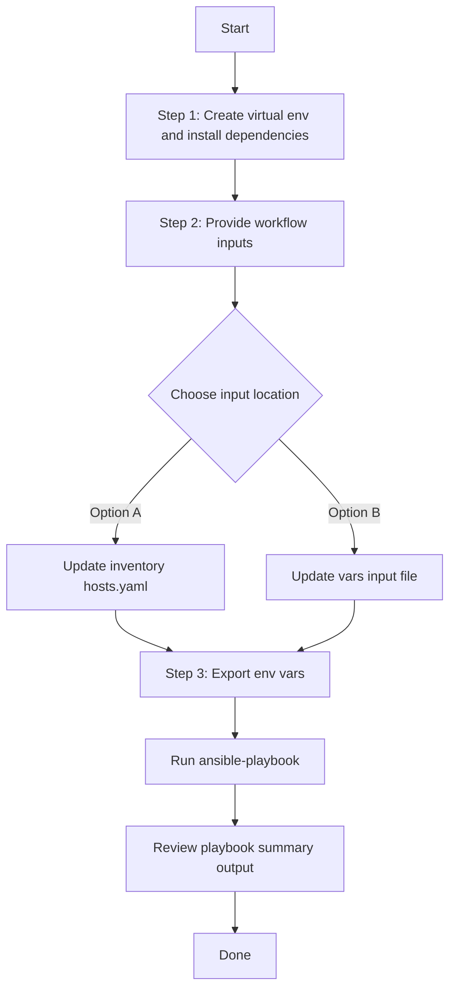

# Provision Playbook Config Generator

## Table of Contents

- [User Flow (3 Steps)](#user-flow-3-steps)

- [Overview](#overview)
- [Features](#features)
- [Prerequisites](#prerequisites)
- [Workflow Structure](#workflow-structure)
- [Schema Parameters](#schema-parameters)
- [Getting Started](#getting-started)
- [Operations](#operations)
- [Examples](#examples)

## Overview

The Provision playbook config generator automates the creation of YAML playbook configurations for provisioned devices configured on Cisco Catalyst Center. This reduces the effort required to manually create Ansible playbooks and enables programmatic modifications.

---

## Features

- **Configuration Generation**: Generate YAML configurations compatible with `provision_workflow_manager`.
- **Component Filtering**: Selective generation of wired or wireless device configurations.
- **File Write Control**: Support for `overwrite` and `append` modes.
- **Flexible Output**: Configurable file paths and naming conventions.
- **Brownfield Support**: Extract configurations from provisioned devices in Cisco Catalyst Center.
- **API Integration**: Leverages native Catalyst Center APIs for data retrieval

---

## Prerequisites

### Software Requirements

| Component | Version |
|-----------|---------|
| Ansible | 6.44.0+ |
| Python | 3.9+ |
| Cisco Catalyst Center SDK | 2.7.2+ |

### Required Collections

```bash
ansible-galaxy collection install cisco.catalystcenter
ansible-galaxy collection install ansible.utils
pip install catalystcentersdk
pip install yamale
```

### Access Requirements

- Catalyst Center admin credentials
- Network connectivity to Catalyst Center API
- Provisioned devices deployed and configured in Catalyst Center
- Existing wired and wireless device provisioning configurations

---

## Workflow Structure

```text
provision_config_generator/
├── playbook/
│   └── provision_config_generator.yml   # Main operations
├── vars/
│   └── provision_config_vars.yml       # Configuration examples
├── schema/
│   └── provision_config_schema.yml     # Input validation
└── README.md
```

---

## Schema Parameters

### Basic Configuration

| Parameter | Type | Required | Default | Description |
|-----------|------|----------|---------|-------------|
| state | string | No | gathered | Desired state of Cisco Catalyst Center after module execution |
| file_path | string | No | auto-generated | Output file path for YAML configuration file |
| file_mode | string | No | overwrite | File write mode (`overwrite` or `append`) |
| config | dict | No | omitted | Configuration dictionary controlling component filters. Omit or leave empty to gather all provisioned devices |

### Component Specific Filtering

| Parameter | Type | Required | Default | Description |
|-----------|------|----------|---------|-------------|
| component_specific_filters | dict | Yes when `config` is provided | none | Filters to specify which components to include |
| components_list | list | No | auto-added when filter blocks are provided | List of device types to include in generation |
| wired | list | No | all wired devices | Wired device filtering criteria |
| wireless | list | No | all wireless devices | Wireless device filtering criteria |

**Valid Component Types:**
- `wired`: Wired device provisioning configurations (Switches, Routers)
- `wireless`: Wireless device provisioning configurations (Wireless Controllers)

### Wired / Wireless Device Filters

| Parameter | Type | Required | Description |
|-----------|------|----------|-------------|
| management_ip_address | list | No | Filter by one or more management IP addresses |
| site_name_hierarchy | list | No | Filter by site hierarchy paths |
| device_family | list | No | Filter by one or more device family values |

---

## Getting Started

## Workflow Steps
## User Flow (3 Steps)



### Installation and Run (Aligned)

1. Create and activate a Python virtual environment, then install dependencies.

```bash
python3 -m venv .venv
source .venv/bin/activate
pip install -r requirements.txt
ansible-galaxy collection install cisco.catalystcenter --force
```

2. Provide workflow inputs in either inventory (`inventory/demo_lab/hosts.yaml`) or the workflow `vars/` file.

3. Export Catalyst Center environment variables and run the playbook.

```bash
export HOSTIP=<catalyst-center-ip-or-fqdn>
export CATALYST_CENTER_USERNAME=<username>
export CATALYST_CENTER_PASSWORD='<password>'
ansible-playbook -i ./inventory/demo_lab/hosts.yaml \
  ./workflows/provision_config_generator/playbook/provision_config_generator.yml \
  --extra-vars VARS_FILE_PATH=./workflows/provision_config_generator/vars/provision_config_vars.yml \
  -vvvv
```


## Operations

### Generate Operations (state: gathered)

Use `provision_config_generator.yml` for generating YAML playbook configuration operations.

#### Generate All Configurations

**Description**: Retrieves all provisioned wired and wireless devices from Catalyst Center. To generate all configurations, omit `config` or leave it empty.

```yaml
provision_playbook_config:
    file_path: "/tmp/complete_provision_config.yml"
    file_mode: overwrite
```

#### Component-Specific Generation

**Description**: Generates configuration for specific device types only.

**Extract Wired Device Configurations Only**

```yaml
provision_playbook_config:
    file_path: "/tmp/wired_devices_config.yml"
    file_mode: overwrite
    config:
      component_specific_filters:
        components_list: ["wired"]
```

**Extract Wireless Device Configurations Only**

```yaml
provision_playbook_config:
    file_path: "/tmp/wireless_devices_config.yml"
    file_mode: overwrite
    config:
      component_specific_filters:
        components_list: ["wireless"]
```

**Validate and Execute:**

```bash
# Validate
./tools/schemavalidation.sh -s workflows/provision_config_generator/schema/provision_config_schema.yml \
                            -d workflows/provision_config_generator/vars/provision_config_vars.yml
```
Return result validate:
```bash
(pyats-priya) [pbalaku2@st-ds-4 dnac_ansible_workflows]$ ./tools/schemavalidation.sh -s workflows/provision_config_generator/schema/provision_config_schema.yml      -d workflows/provision_config_generator/vars/provision_config_vars.yml
workflows/provision_config_generator/schema/provision_config_schema.yml
workflows/provision_config_generator/vars/provision_config_vars.yml
yamale   -s workflows/provision_config_generator/schema/provision_config_schema.yml  workflows/provision_config_generator/vars/provision_config_vars.yml
Validating workflows/provision_config_generator/vars/provision_config_vars.yml...
Validation success! 👍
```

```bash
# Execute
ansible-playbook -i inventory/demo_lab/hosts.yaml \
  workflows/provision_config_generator/playbook/provision_config_generator.yml \
  --extra-vars VARS_FILE_PATH=./workflows/provision_config_generator/vars/provision_config_vars.yml
```

Expected Terminal Output:
1. Generate All Configurations
```code
        file_path: /tmp/complete_provision_config.yml
      msg:
        YAML config generation Task succeeded for module 'provision_workflow_manager'.:
          devices_count: 11
          file_path: /tmp/complete_provision_config.yml
      response:
        YAML config generation Task succeeded for module 'provision_workflow_manager'.:
          devices_count: 11
          file_path: /tmp/complete_provision_config.yml
      status: success
    skipped: false
```

2. Component Specific Generation:

a. Wired Device Filter:
```code
        config:
          component_specific_filters:
            components_list:
            - wired
        file_path: /tmp/wired_devices_config.yml
      msg:
        YAML config generation Task succeeded for module 'provision_workflow_manager'.:
          devices_count: 9
          file_path: /tmp/wired_devices_config.yml
      response:
        YAML config generation Task succeeded for module 'provision_workflow_manager'.:
          devices_count: 9
          file_path: /tmp/wired_devices_config.yml
      status: success
    skipped: false
```

b. Wireless Device Filter:

```code
        config:
          component_specific_filters:
            components_list:
            - wireless
        file_path: /tmp/wireless_devices_config.yml
      msg:
        YAML config generation Task succeeded for module 'provision_workflow_manager'.:
          devices_count: 2
          file_path: /tmp/wireless_devices_config.yml
      response:
        YAML config generation Task succeeded for module 'provision_workflow_manager'.:
          devices_count: 2
          file_path: /tmp/wireless_devices_config.yml
      status: success
    skipped: false
```

---

## Examples

### Example 1: Generate ALL provisioned devices

```yaml
provision_playbook_config:
    file_path: "/tmp/complete_provision_infrastructure.yml"
    file_mode: overwrite
```

After running the playbook, the following YAML configuration is generated.

```yaml
---
config:
- management_ip_address: 204.1.2.6
  site_name_hierarchy: Global/USA/SAN-FRANCISCO/SF_BLD1
  provisioning: true
  force_provisioning: false
- management_ip_address: 204.1.2.7
  site_name_hierarchy: Global/India/Bangalore/bld1
  provisioning: true
  force_provisioning: false
- management_ip_address: 204.1.2.5
  site_name_hierarchy: Global/USA/SAN JOSE/SJ_BLD23
  provisioning: true
  force_provisioning: false
- management_ip_address: 204.1.2.9
  site_name_hierarchy: Global/India/Bangalore/bld1
  provisioning: true
  force_provisioning: false
- management_ip_address: 204.1.2.8
  site_name_hierarchy: Global/USA/SAN-FRANCISCO/SF_BLD1
  provisioning: true
  force_provisioning: false
- management_ip_address: 204.1.2.69
  site_name_hierarchy: Global/USA/SAN JOSE/SJ_BLD23
  provisioning: true
  force_provisioning: false
- management_ip_address: 204.1.2.4
  site_name_hierarchy: Global/USA/New York/NY_BLD3
  provisioning: true
  force_provisioning: false
- management_ip_address: 204.1.2.3
  site_name_hierarchy: Global/USA/SAN JOSE/SJ_BLD23
  provisioning: true
  force_provisioning: false
- management_ip_address: 204.1.1.101
  site_name_hierarchy: Global/India/Bangalore/bld1
  provisioning: true
  force_provisioning: false
- management_ip_address: 204.192.6.200
  site_name_hierarchy: Global/USA/New York/NY_BLD1
  provisioning: true
  force_provisioning: false
  primary_managed_ap_locations:
  - Global/USA/New York/NY_BLD1/FLOOR1
  secondary_managed_ap_locations: []
  dynamic_interfaces:
  - interface_name: Vlan1856
    vlan_id: 1856
    interface_ip_address: 204.192.6.200
    interface_gateway: 204.192.6.0
  skip_ap_provision: false
- management_ip_address: 204.192.4.200
  site_name_hierarchy: Global/USA/SAN JOSE/SJ_BLD23
  provisioning: true
  force_provisioning: false
  primary_managed_ap_locations:
  - Global/USA/SAN JOSE/SJ_BLD23
  secondary_managed_ap_locations: []
  dynamic_interfaces:
  - interface_name: Vlan1854
    vlan_id: 1854
    interface_ip_address: 2001:420:abcd:8004::200
  skip_ap_provision: false
```

### Example 2: Wired Device Configurations Only

Extract all wired device provisioning configurations.

```yaml
provision_playbook_config:
    file_path: "provision/component_wired_only"
    file_mode: overwrite
    config:
      component_specific_filters:
        components_list: ["wired"]
```

After running the playbook, the following YAML configuration is generated having details for only wired devices.

```yaml
---
config:
- management_ip_address: 204.1.2.6
  site_name_hierarchy: Global/USA/SAN-FRANCISCO/SF_BLD1
  provisioning: true
  force_provisioning: false
- management_ip_address: 204.1.2.7
  site_name_hierarchy: Global/India/Bangalore/bld1
  provisioning: true
  force_provisioning: false
- management_ip_address: 204.1.2.5
  site_name_hierarchy: Global/USA/SAN JOSE/SJ_BLD23
  provisioning: true
  force_provisioning: false
- management_ip_address: 204.1.2.9
  site_name_hierarchy: Global/India/Bangalore/bld1
  provisioning: true
  force_provisioning: false
- management_ip_address: 204.1.2.8
  site_name_hierarchy: Global/USA/SAN-FRANCISCO/SF_BLD1
  provisioning: true
  force_provisioning: false
- management_ip_address: 204.1.2.69
  site_name_hierarchy: Global/USA/SAN JOSE/SJ_BLD23
  provisioning: true
  force_provisioning: false
- management_ip_address: 204.1.2.4
  site_name_hierarchy: Global/USA/New York/NY_BLD3
  provisioning: true
  force_provisioning: false
- management_ip_address: 204.1.2.3
  site_name_hierarchy: Global/USA/SAN JOSE/SJ_BLD23
  provisioning: true
  force_provisioning: false
- management_ip_address: 204.1.1.101
  site_name_hierarchy: Global/India/Bangalore/bld1
  provisioning: true
  force_provisioning: false
```

### Example 3: Wireless Device Configurations Only

Extract all wireless device provisioning configurations.

```yaml
provision_playbook_config:
    file_path: "provision/wireless_devices_audit.yml"
    file_mode: overwrite
    config:
      component_specific_filters:
        components_list: ["wireless"]
        wireless:
          - device_family:
              - "Wireless Controller"
```

After running the playbook, the following YAML configuration is generated having details for only wireless devices.

```yaml
---
config:
- management_ip_address: 204.192.6.200
  site_name_hierarchy: Global/USA/New York/NY_BLD1
  provisioning: true
  force_provisioning: false
  primary_managed_ap_locations:
  - Global/USA/New York/NY_BLD1/FLOOR1
  secondary_managed_ap_locations: []
  dynamic_interfaces:
  - interface_name: Vlan1856
    vlan_id: 1856
    interface_ip_address: 204.192.6.200
    interface_gateway: 204.192.6.0
  skip_ap_provision: false
- management_ip_address: 204.192.4.200
  site_name_hierarchy: Global/USA/SAN JOSE/SJ_BLD23
  provisioning: true
  force_provisioning: false
  primary_managed_ap_locations:
  - Global/USA/SAN JOSE/SJ_BLD23
  secondary_managed_ap_locations: []
  dynamic_interfaces:
  - interface_name: Vlan1854
    vlan_id: 1854
    interface_ip_address: 2001:420:abcd:8004::200
  skip_ap_provision: false
```

### Example 4: Filtered Wired Devices by Management IP

```yaml
provision_playbook_config:
    file_path: "provision/filtered_wired_devices.yml"
    file_mode: overwrite
    config:
      component_specific_filters:
        components_list: ["wired"]
        wired:
          - management_ip_address:
              - "204.1.2.69"
```

After running the playbook, the following YAML configuration is generated having details for only the filtered wired device.

```yaml
---
config:
- management_ip_address: 204.1.2.69
  site_name_hierarchy: Global/USA/SAN JOSE/SJ_BLD23
  provisioning: true
  force_provisioning: false
```

### Example 5: Site-Based Wired Device Extraction

```yaml
provision_playbook_config:
    file_path: "provision/site_based_wired_devices.yml"
    file_mode: overwrite
    config:
      component_specific_filters:
        components_list: ["wired"]
        wired:
          - site_name_hierarchy:
              - "Global/USA/SAN JOSE/SJ_BLD23"
            device_family:
              - "Switches and Hubs"
```

After running the playbook, the following YAML configuration is generated having details for only wired devices at the specified site.

```yaml
---
config:
- management_ip_address: 204.1.2.5
  site_name_hierarchy: Global/USA/SAN JOSE/SJ_BLD23
  provisioning: true
  force_provisioning: false
```

### Example 6: IP-Based Filtering Across Wired and Wireless Components

```yaml
provision_playbook_config:
    file_path: "provision/global_ip_filtered_devices.yml"
    file_mode: overwrite
    config:
      component_specific_filters:
        components_list: ["wired", "wireless"]
        wired:
          - management_ip_address:
              - "204.1.2.7"
              - "204.1.2.8"
        wireless:
          - management_ip_address:
              - "204.192.4.200"
```

After running the playbook, the following YAML configuration is generated having details for devices matching the specified management IP addresses across the selected components.

```yaml
---
config:
- management_ip_address: 204.1.2.7
  site_name_hierarchy: Global/India/Bangalore/bld1
  provisioning: true
  force_provisioning: false
- management_ip_address: 204.1.2.8
  site_name_hierarchy: Global/USA/SAN-FRANCISCO/SF_BLD1
  provisioning: true
  force_provisioning: false
- management_ip_address: 204.192.4.200
  site_name_hierarchy: Global/USA/SAN JOSE/SJ_BLD23
  provisioning: true
  force_provisioning: false
  primary_managed_ap_locations:
  - Global/USA/SAN JOSE/SJ_BLD23
  secondary_managed_ap_locations: []
  dynamic_interfaces:
  - interface_name: Vlan1854
    vlan_id: 1854
    interface_ip_address: 2001:420:abcd:8004::200
  skip_ap_provision: false
```

### Example 7: Combined Wired and Wireless with Filters

```yaml
provision_playbook_config:
    file_path: "provision/combined_wired_wireless_filters"
    file_mode: overwrite
    config:
      component_specific_filters:
        components_list: ["wired", "wireless"]
        wired:
          - site_name_hierarchy:
              - "Global/USA/SAN-FRANCISCO/SF_BLD1"
            device_family:
              - "Switches and Hubs"
        wireless:
          - site_name_hierarchy:
              - "Global/USA/SAN JOSE/SJ_BLD23"
            device_family:
              - "Wireless Controller"
```

After running the playbook, the following YAML configuration is generated having details for both wired and wireless devices at the specified site.

```yaml
---
config:
- management_ip_address: 204.1.2.8
  site_name_hierarchy: Global/USA/SAN-FRANCISCO/SF_BLD1
  provisioning: true
  force_provisioning: false
- management_ip_address: 204.192.4.200
  site_name_hierarchy: Global/USA/SAN JOSE/SJ_BLD23
  provisioning: true
  force_provisioning: false
  primary_managed_ap_locations:
  - Global/USA/SAN JOSE/SJ_BLD23
  secondary_managed_ap_locations: []
  dynamic_interfaces:
  - interface_name: Vlan1854
    vlan_id: 1854
    interface_ip_address: 2001:420:abcd:8004::200
  skip_ap_provision: false
```

### Example 8: Append Mode - Combine Multiple Generations

```yaml
# First: extract wired devices
provision_playbook_config:
    file_path: "provision/combined_all_devices.yml"
    file_mode: overwrite
    config:
      component_specific_filters:
        components_list: ["wired"]
        wired:
          - device_family:
              - "Switches and Hubs"

# Then: append wireless devices to the same file
provision_playbook_config:
    file_path: "provision/combined_all_devices.yml"
    file_mode: append
    config:
      component_specific_filters:
        components_list: ["wireless"]
        wireless:
          - device_family:
              - "Wireless Controller"
```

After running the playbook, the first task generates the wired device configurations (overwrite mode), and the second task appends the wireless device configurations to the same file.

```yaml
---
config:
- management_ip_address: 204.1.2.6
  site_name_hierarchy: Global/USA/SAN-FRANCISCO/SF_BLD1
  provisioning: true
  force_provisioning: false
- management_ip_address: 204.1.2.7
  site_name_hierarchy: Global/India/Bangalore/bld1
  provisioning: true
  force_provisioning: false
- management_ip_address: 204.1.2.5
  site_name_hierarchy: Global/USA/SAN JOSE/SJ_BLD23
  provisioning: true
  force_provisioning: false
- management_ip_address: 204.1.2.9
  site_name_hierarchy: Global/India/Bangalore/bld1
  provisioning: true
  force_provisioning: false
- management_ip_address: 204.1.2.8
  site_name_hierarchy: Global/USA/SAN-FRANCISCO/SF_BLD1
  provisioning: true
  force_provisioning: false
- management_ip_address: 204.1.2.69
  site_name_hierarchy: Global/USA/SAN JOSE/SJ_BLD23
  provisioning: true
  force_provisioning: false
- management_ip_address: 204.1.2.4
  site_name_hierarchy: Global/USA/New York/NY_BLD3
  provisioning: true
  force_provisioning: false
- management_ip_address: 204.1.2.3
  site_name_hierarchy: Global/USA/SAN JOSE/SJ_BLD23
  provisioning: true
  force_provisioning: false
- management_ip_address: 204.1.1.101
  site_name_hierarchy: Global/India/Bangalore/bld1
  provisioning: true
  force_provisioning: false
---
config:
- management_ip_address: 204.192.6.200
  site_name_hierarchy: Global/USA/New York/NY_BLD1
  provisioning: true
  force_provisioning: false
  primary_managed_ap_locations:
  - Global/USA/New York/NY_BLD1/FLOOR1
  secondary_managed_ap_locations: []
  dynamic_interfaces:
  - interface_name: Vlan1856
    vlan_id: 1856
    interface_ip_address: 204.192.6.200
    interface_gateway: 204.192.6.0
  skip_ap_provision: false
- management_ip_address: 204.192.4.200
  site_name_hierarchy: Global/USA/SAN JOSE/SJ_BLD23
  provisioning: true
  force_provisioning: false
  primary_managed_ap_locations:
  - Global/USA/SAN JOSE/SJ_BLD23
  secondary_managed_ap_locations: []
  dynamic_interfaces:
  - interface_name: Vlan1854
    vlan_id: 1854
    interface_ip_address: 2001:420:abcd:8004::200
  skip_ap_provision: false
---

## Additional Resources

- [Cisco Catalyst Center Documentation](https://www.cisco.com/c/en/us/support/cloud-systems-management/dna-center/series.html)
- [Cisco DNA Center SDK](https://catalystcentersdk.readthedocs.io/)
- [Ansible Documentation](https://docs.ansible.com/)
