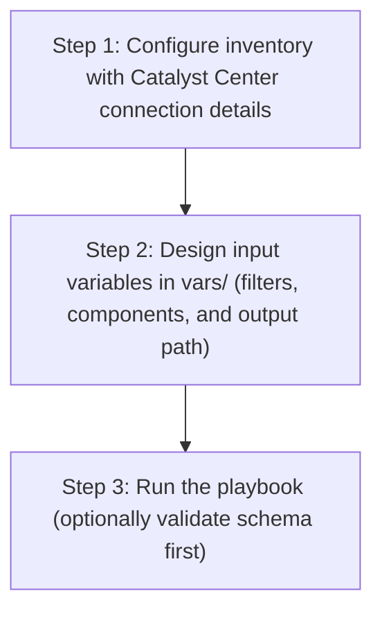

# Provision Playbook Config Generator

## Table of Contents

- [User Flow (3 Steps)](#user-flow-3-steps)

- [Overview](#overview)
- [Features](#features)
- [Prerequisites](#prerequisites)
- [Workflow Structure](#workflow-structure)
- [Schema Parameters](#schema-parameters)
- [Getting Started](#getting-started)
- [Operations](#operations)
- [Examples](#examples)

## User Flow (3 Steps)



---

## Overview

The Provision playbook config generator automates the creation of YAML playbook configurations for existing provisioned devices deployed in Cisco Catalyst Center. This tool reduces the effort required to manually create Ansible playbooks by programmatically generating configurations from existing provisioning infrastructure.

---

## Features

- **Configuration Generation**: Generate YAML configurations compatible with `provision_workflow_manager` module.
Extract existing wired and wireless device provisioning configurations from your Cisco Catalyst Center.
Convert them into properly formatted YAML files.
Generate files that are ready to use with Ansible automation.
- **Component Filtering**: Selective generation of wired or wireless device configurations
- **Global Filtering**: Filter devices by management IP address across all components
- **File Append Mode**: Combine multiple device configurations into a single playbook file
- **Flexible Output**: Configurable file paths and naming conventions
- **Brownfield Support**: Extract configurations from existing Catalyst Center deployments
- **API Integration**: Leverages native Catalyst Center APIs for data retrieval

---

## Prerequisites

### Software Requirements

| Component | Version |
|-----------|---------|
| Ansible | 6.42.0+ |
| Python | 3.9+ |
| Cisco Catalyst Center SDK | 2.9.3+ |

### Required Collections

```bash
ansible-galaxy collection install cisco.dnac
ansible-galaxy collection install ansible.utils
pip install dnacentersdk
pip install yamale
```

### Access Requirements

- Catalyst Center admin credentials
- Network connectivity to Catalyst Center API
- Provisioned devices deployed and configured in Catalyst Center
- Existing wired and wireless device provisioning configurations

---

## Workflow Structure

```
provision_playbook_config_generator/
├── playbook/
│   └── provision_playbook_config_generator_playbook.yml   # Main operations
├── vars/
│   ├── provision_playbook_config_generator_vars.yml       # Configuration examples
├── schema/
│   └── provision_playbook_config_generator_schema.yml     # Input validation
└── README.md
```

---

## Schema Parameters

### Basic Configuration

| Parameter | Type | Required | Default | Description |
|-----------|------|----------|---------|-------------|
| generate_all_configurations | boolean | No | false | Generate all provisioned devices automatically |
| file_path | string | No | auto-generated | Output file path for YAML configuration file |
| file_mode | string | No | overwrite | File write mode (`overwrite` or `append`) |
| global_filters | dict | No | none | Global filters applied across all components |
| component_specific_filters | dict | No | all components | Filters to specify which device types to include |

### Global Filtering

| Parameter | Type | Required | Description |
|-----------|------|----------|-------------|
| management_ip_address | list | No | List of management IP addresses to filter devices globally |

### Component Specific Filtering

| Parameter | Type | Required | Default | Description |
|-----------|------|----------|---------|-------------|
| components_list | list | No | `["wired", "wireless"]` | List of device types to include in generation |
| wired | list | No | all wired devices | Wired device filtering criteria |
| wireless | list | No | all wireless devices | Wireless device filtering criteria |

**Valid Component Types:**
- `wired`: Wired device provisioning configurations (Switches, Routers)
- `wireless`: Wireless device provisioning configurations (Wireless Controllers)

### Wired / Wireless Device Filters

| Parameter | Type | Required | Description |
|-----------|------|----------|-------------|
| management_ip_address | string | No | Filter by device management IP address |
| site_name_hierarchy | list | No | Filter by site hierarchy paths |
| device_family | string | No | Filter by device family type (e.g., `Switches and Hubs`, `Routers`, `Wireless Controller`) |

---

## Getting Started

### Step 1: Install Prerequisites

```bash
ansible-galaxy collection install cisco.dnac
ansible-galaxy collection install ansible.utils
pip install dnacentersdk
pip install yamale
```

### Step 2: Configure Inventory

Edit `inventory/demo_lab/hosts.yml`:

```yaml
catalyst_center_hosts:
  hosts:
    catalyst_center_primary:
      catalyst_center_host: 10.0.0.0
      catalyst_center_username: admin
      catalyst_center_password: "password"
```

### Step 3: Configure Variables

Edit `workflows/provision_playbook_config_generator/vars/provision_playbook_config_generator_vars.yml`:

```yaml
provision_playbook_config:
    generate_all_configurations: true
    file_path: "/tmp/complete_provision_config.yml"
```

### Step 4: Validate Configuration

```bash
./tools/validate.sh -s workflows/provision_playbook_config_generator/schema/provision_playbook_config_generator_schema.yml \
     -d workflows/provision_playbook_config_generator/vars/provision_playbook_config_generator_vars.yml
```

### Step 5: Execute Playbook

```bash
ansible-playbook -i inventory/demo_lab/hosts.yaml \
  workflows/provision_playbook_config_generator/playbook/provision_playbook_config_generator_playbook.yml \
  --extra-vars VARS_FILE_PATH=../vars/provision_playbook_config_generator_vars.yml
```

### Workflow Execution

The workflow follows these steps:

1. **Connect** to Catalyst Center using provided credentials
2. **Retrieve** existing provisioned wired and wireless devices via API calls
3. **Filter** devices based on specified criteria (IP, site, device family)
4. **Transform** API responses into Ansible-compatible format
5. **Generate** YAML configuration file with proper structure
6. **Validate** output file format and content

---

## Operations

### Generate Operations (state: gathered)

Use `provision_playbook_config_generator_playbook.yml` for generating YAML playbook configuration operations.

#### Generate All Configurations

**Description**: Retrieves all provisioned wired and wireless devices from Catalyst Center regardless of any filters.

```yaml
provision_playbook_config:
    generate_all_configurations: true
    file_path: "/tmp/complete_provision_config.yml"
```

#### Component-Specific Generation

**Description**: Generates configuration for specific device types only.

**Extract Wired Device Configurations Only**

```yaml
provision_playbook_config:
    file_path: "/tmp/wired_devices_config.yml"
    component_specific_filters:
      components_list: ["wired"]
```

**Extract Wireless Device Configurations Only**

```yaml
provision_playbook_config:
    file_path: "/tmp/wireless_devices_config.yml"
    component_specific_filters:
      components_list: ["wireless"]
```

**Validate and Execute:**

```bash
# Validate
./tools/validate.sh -s workflows/provision_playbook_config_generator/schema/provision_playbook_config_generator_schema.yml \
     -d workflows/provision_playbook_config_generator/vars/provision_playbook_config_generator_vars.yml
```
Return result validate:
```bash
(pyats-priya) [pbalaku2@st-ds-4 dnac_ansible_workflows]$ ./tools/validate.sh -s workflows/provision_playbook_config_generator/schema/provision_playbook_config_generator_schema.yml      -d workflows/provision_playbook_config_generator/vars/provision_playbook_config_generator_vars.yml
workflows/provision_playbook_config_generator/schema/provision_playbook_config_generator_schema.yml
workflows/provision_playbook_config_generator/vars/provision_playbook_config_generator_vars.yml
yamale   -s workflows/provision_playbook_config_generator/schema/provision_playbook_config_generator_schema.yml  workflows/provision_playbook_config_generator/vars/provision_playbook_config_generator_vars.yml
Validating workflows/provision_playbook_config_generator/vars/provision_playbook_config_generator_vars.yml...
Validation success! 👍
```

```bash
# Execute
ansible-playbook -i inventory/demo_lab/hosts.yaml \
  workflows/provision_playbook_config_generator/playbook/provision_playbook_config_generator_playbook.yml \
  --extra-vars VARS_FILE_PATH=../vars/provision_playbook_config_generator_vars.yml
```

Expected Terminal Output:

1. Generate All Configurations

```code
        file_path: /tmp/complete_provision_config.yml
        generate_all_configurations: true
      msg:
        YAML config generation Task succeeded for module 'provision_workflow_manager'.:
          devices_count: 11
          file_path: /tmp/complete_provision_config.yml
      response:
        YAML config generation Task succeeded for module 'provision_workflow_manager'.:
          devices_count: 11
          file_path: /tmp/complete_provision_config.yml
      status: success
    skipped: false
```

2. Component Specific Generation:

a. Wired Device Filter:

```code
        component_specific_filters:
          components_list:
          - wired
        file_path: /tmp/wired_devices_config.yml
      msg:
        YAML config generation Task succeeded for module 'provision_workflow_manager'.:
          devices_count: 9
          file_path: /tmp/wired_devices_config.yml
      response:
        YAML config generation Task succeeded for module 'provision_workflow_manager'.:
          devices_count: 9
          file_path: /tmp/wired_devices_config.yml
      status: success
    skipped: false
```

b. Wireless Device Filter:

```code
        component_specific_filters:
          components_list:
          - wireless
        file_path: /tmp/wireless_devices_config.yml
      msg:
        YAML config generation Task succeeded for module 'provision_workflow_manager'.:
          devices_count: 2
          file_path: /tmp/wireless_devices_config.yml
      response:
        YAML config generation Task succeeded for module 'provision_workflow_manager'.:
          devices_count: 2
          file_path: /tmp/wireless_devices_config.yml
      status: success
    skipped: false
```

---

## Examples

### Example 1: Generate ALL provisioned devices

```yaml
provision_playbook_config:
    generate_all_configurations: true
    file_path: "/tmp/complete_provision_infrastructure.yml"
```

After running the playbook, the following YAML configuration is generated.

```yaml
---
config:
- management_ip_address: 204.1.2.6
  site_name_hierarchy: Global/USA/SAN-FRANCISCO/SF_BLD1
  provisioning: true
  force_provisioning: false
- management_ip_address: 204.1.2.7
  site_name_hierarchy: Global/India/Bangalore/bld1
  provisioning: true
  force_provisioning: false
- management_ip_address: 204.1.2.5
  site_name_hierarchy: Global/USA/SAN JOSE/SJ_BLD23
  provisioning: true
  force_provisioning: false
- management_ip_address: 204.1.2.9
  site_name_hierarchy: Global/India/Bangalore/bld1
  provisioning: true
  force_provisioning: false
- management_ip_address: 204.1.2.8
  site_name_hierarchy: Global/USA/SAN-FRANCISCO/SF_BLD1
  provisioning: true
  force_provisioning: false
- management_ip_address: 204.1.2.69
  site_name_hierarchy: Global/USA/SAN JOSE/SJ_BLD23
  provisioning: true
  force_provisioning: false
- management_ip_address: 204.1.2.4
  site_name_hierarchy: Global/USA/New York/NY_BLD3
  provisioning: true
  force_provisioning: false
- management_ip_address: 204.1.2.3
  site_name_hierarchy: Global/USA/SAN JOSE/SJ_BLD23
  provisioning: true
  force_provisioning: false
- management_ip_address: 204.1.1.101
  site_name_hierarchy: Global/India/Bangalore/bld1
  provisioning: true
  force_provisioning: false
- management_ip_address: 204.192.6.200
  site_name_hierarchy: Global/USA/New York/NY_BLD1
  provisioning: true
  force_provisioning: false
  primary_managed_ap_locations:
  - Global/USA/New York/NY_BLD1/FLOOR1
  secondary_managed_ap_locations: []
  dynamic_interfaces:
  - interface_name: Vlan1856
    vlan_id: 1856
    interface_ip_address: 204.192.6.200
    interface_gateway: 204.192.6.0
  skip_ap_provision: false
- management_ip_address: 204.192.4.200
  site_name_hierarchy: Global/USA/SAN JOSE/SJ_BLD23
  provisioning: true
  force_provisioning: false
  primary_managed_ap_locations:
  - Global/USA/SAN JOSE/SJ_BLD23
  secondary_managed_ap_locations: []
  dynamic_interfaces:
  - interface_name: Vlan1854
    vlan_id: 1854
    interface_ip_address: 2001:420:abcd:8004::200
  skip_ap_provision: false
```

### Example 2: Wired Device Configurations Only

Extract all wired device provisioning configurations.

```yaml
provision_playbook_config:
    file_path: "provision/component_wired_only"
    component_specific_filters:
      components_list: ["wired"]
```

After running the playbook, the following YAML configuration is generated having details for only wired devices.

```yaml
---
config:
- management_ip_address: 204.1.2.6
  site_name_hierarchy: Global/USA/SAN-FRANCISCO/SF_BLD1
  provisioning: true
  force_provisioning: false
- management_ip_address: 204.1.2.7
  site_name_hierarchy: Global/India/Bangalore/bld1
  provisioning: true
  force_provisioning: false
- management_ip_address: 204.1.2.5
  site_name_hierarchy: Global/USA/SAN JOSE/SJ_BLD23
  provisioning: true
  force_provisioning: false
- management_ip_address: 204.1.2.9
  site_name_hierarchy: Global/India/Bangalore/bld1
  provisioning: true
  force_provisioning: false
- management_ip_address: 204.1.2.8
  site_name_hierarchy: Global/USA/SAN-FRANCISCO/SF_BLD1
  provisioning: true
  force_provisioning: false
- management_ip_address: 204.1.2.69
  site_name_hierarchy: Global/USA/SAN JOSE/SJ_BLD23
  provisioning: true
  force_provisioning: false
- management_ip_address: 204.1.2.4
  site_name_hierarchy: Global/USA/New York/NY_BLD3
  provisioning: true
  force_provisioning: false
- management_ip_address: 204.1.2.3
  site_name_hierarchy: Global/USA/SAN JOSE/SJ_BLD23
  provisioning: true
  force_provisioning: false
- management_ip_address: 204.1.1.101
  site_name_hierarchy: Global/India/Bangalore/bld1
  provisioning: true
  force_provisioning: false
```

### Example 3: Wireless Device Configurations Only

Extract all wireless device provisioning configurations.

```yaml
provision_playbook_config:
    file_path: "provision/wireless_devices_audit.yml"
    component_specific_filters:
      components_list: ["wireless"]
      wireless:
        - device_family: "Wireless Controller"
```

After running the playbook, the following YAML configuration is generated having details for only wireless devices.

```yaml
---
config:
- management_ip_address: 204.192.6.200
  site_name_hierarchy: Global/USA/New York/NY_BLD1
  provisioning: true
  force_provisioning: false
  primary_managed_ap_locations:
  - Global/USA/New York/NY_BLD1/FLOOR1
  secondary_managed_ap_locations: []
  dynamic_interfaces:
  - interface_name: Vlan1856
    vlan_id: 1856
    interface_ip_address: 204.192.6.200
    interface_gateway: 204.192.6.0
  skip_ap_provision: false
- management_ip_address: 204.192.4.200
  site_name_hierarchy: Global/USA/SAN JOSE/SJ_BLD23
  provisioning: true
  force_provisioning: false
  primary_managed_ap_locations:
  - Global/USA/SAN JOSE/SJ_BLD23
  secondary_managed_ap_locations: []
  dynamic_interfaces:
  - interface_name: Vlan1854
    vlan_id: 1854
    interface_ip_address: 2001:420:abcd:8004::200
  skip_ap_provision: false
```

### Example 4: Filtered Wired Devices by Management IP

```yaml
provision_playbook_config:
    file_path: "provision/filtered_wired_devices.yml"
    component_specific_filters:
      components_list: ["wired"]
      wired:
        - management_ip_address: "204.1.2.69"
```

After running the playbook, the following YAML configuration is generated having details for only the filtered wired device.

```yaml
---
config:
- management_ip_address: 204.1.2.69
  site_name_hierarchy: Global/USA/SAN JOSE/SJ_BLD23
  provisioning: true
  force_provisioning: false
```

### Example 5: Site-Based Wired Device Extraction

```yaml
provision_playbook_config:
    file_path: "provision/site_based_wired_devices.yml"
    component_specific_filters:
      components_list: ["wired"]
      wired:
        - site_name_hierarchy:
            - "Global/USA/SAN JOSE/SJ_BLD23"
          device_family: "Switches and Hubs"
```

After running the playbook, the following YAML configuration is generated having details for only wired devices at the specified site.

```yaml
---
config:
- management_ip_address: 204.1.2.5
  site_name_hierarchy: Global/USA/SAN JOSE/SJ_BLD23
  provisioning: true
  force_provisioning: false
```

### Example 6: Global IP Filter Across All Components

```yaml
provision_playbook_config:
    file_path: "provision/global_ip_filtered_devices.yml"
    global_filters:
      management_ip_address:
        - "204.1.2.7"
        - "204.1.2.8"
        - "204.192.4.200"
```

After running the playbook, the following YAML configuration is generated having details for devices matching the specified management IP addresses across all components.

```yaml
---
config:
- management_ip_address: 204.1.2.7
  site_name_hierarchy: Global/India/Bangalore/bld1
  provisioning: true
  force_provisioning: false
- management_ip_address: 204.1.2.8
  site_name_hierarchy: Global/USA/SAN-FRANCISCO/SF_BLD1
  provisioning: true
  force_provisioning: false
- management_ip_address: 204.192.4.200
  site_name_hierarchy: Global/USA/SAN JOSE/SJ_BLD23
  provisioning: true
  force_provisioning: false
  primary_managed_ap_locations:
  - Global/USA/SAN JOSE/SJ_BLD23
  secondary_managed_ap_locations: []
  dynamic_interfaces:
  - interface_name: Vlan1854
    vlan_id: 1854
    interface_ip_address: 2001:420:abcd:8004::200
  skip_ap_provision: false
```

### Example 7: Combined Wired and Wireless with Filters

```yaml
provision_playbook_config:
    file_path: "provision/combined_wired_wireless_filters"
    component_specific_filters:
      components_list: ["wired", "wireless"]
      wired:
        - site_name_hierarchy:
            - "Global/USA/SAN-FRANCISCO/SF_BLD1"
          device_family: "Switches and Hubs"
      wireless:
        - site_name_hierarchy:
            - "Global/USA/SAN JOSE/SJ_BLD23"
          device_family: "Wireless Controller"
```

After running the playbook, the following YAML configuration is generated having details for both wired and wireless devices at the specified site.

```yaml
---
config:
- management_ip_address: 204.1.2.8
  site_name_hierarchy: Global/USA/SAN-FRANCISCO/SF_BLD1
  provisioning: true
  force_provisioning: false
- management_ip_address: 204.192.4.200
  site_name_hierarchy: Global/USA/SAN JOSE/SJ_BLD23
  provisioning: true
  force_provisioning: false
  primary_managed_ap_locations:
  - Global/USA/SAN JOSE/SJ_BLD23
  secondary_managed_ap_locations: []
  dynamic_interfaces:
  - interface_name: Vlan1854
    vlan_id: 1854
    interface_ip_address: 2001:420:abcd:8004::200
  skip_ap_provision: false
```

### Example 8: Append Mode - Combine Multiple Generations

```yaml
provision_playbook_config:
  # First: extract wired devices
    file_path: "provision/combined_all_devices.yml"
    file_mode: overwrite
    component_specific_filters:
      components_list: ["wired"]
      wired:
        - device_family: "Switches and Hubs"

  # Then: append wireless devices to the same file
    file_path: "provision/combined_all_devices.yml"
    file_mode: append
    component_specific_filters:
      components_list: ["wireless"]
      wireless:
        - device_family: "Wireless Controller"
```

After running the playbook, the first task generates the wired device configurations (overwrite mode), and the second task appends the wireless device configurations to the same file.

```yaml
---
config:
- management_ip_address: 204.1.2.6
  site_name_hierarchy: Global/USA/SAN-FRANCISCO/SF_BLD1
  provisioning: true
  force_provisioning: false
- management_ip_address: 204.1.2.7
  site_name_hierarchy: Global/India/Bangalore/bld1
  provisioning: true
  force_provisioning: false
- management_ip_address: 204.1.2.5
  site_name_hierarchy: Global/USA/SAN JOSE/SJ_BLD23
  provisioning: true
  force_provisioning: false
- management_ip_address: 204.1.2.9
  site_name_hierarchy: Global/India/Bangalore/bld1
  provisioning: true
  force_provisioning: false
- management_ip_address: 204.1.2.8
  site_name_hierarchy: Global/USA/SAN-FRANCISCO/SF_BLD1
  provisioning: true
  force_provisioning: false
- management_ip_address: 204.1.2.69
  site_name_hierarchy: Global/USA/SAN JOSE/SJ_BLD23
  provisioning: true
  force_provisioning: false
- management_ip_address: 204.1.2.4
  site_name_hierarchy: Global/USA/New York/NY_BLD3
  provisioning: true
  force_provisioning: false
- management_ip_address: 204.1.2.3
  site_name_hierarchy: Global/USA/SAN JOSE/SJ_BLD23
  provisioning: true
  force_provisioning: false
- management_ip_address: 204.1.1.101
  site_name_hierarchy: Global/India/Bangalore/bld1
  provisioning: true
  force_provisioning: false
---
config:
- management_ip_address: 204.192.6.200
  site_name_hierarchy: Global/USA/New York/NY_BLD1
  provisioning: true
  force_provisioning: false
  primary_managed_ap_locations:
  - Global/USA/New York/NY_BLD1/FLOOR1
  secondary_managed_ap_locations: []
  dynamic_interfaces:
  - interface_name: Vlan1856
    vlan_id: 1856
    interface_ip_address: 204.192.6.200
    interface_gateway: 204.192.6.0
  skip_ap_provision: false
- management_ip_address: 204.192.4.200
  site_name_hierarchy: Global/USA/SAN JOSE/SJ_BLD23
  provisioning: true
  force_provisioning: false
  primary_managed_ap_locations:
  - Global/USA/SAN JOSE/SJ_BLD23
  secondary_managed_ap_locations: []
  dynamic_interfaces:
  - interface_name: Vlan1854
    vlan_id: 1854
    interface_ip_address: 2001:420:abcd:8004::200
  skip_ap_provision: false
---

## Additional Resources

- [Cisco Catalyst Center Documentation](https://www.cisco.com/c/en/us/support/cloud-systems-management/dna-center/series.html)
- [Cisco DNA Center SDK](https://dnacentersdk.readthedocs.io/)
- [Ansible Documentation](https://docs.ansible.com/)
