# Cisco Catalyst Center Reports Management Playbooks

**Overview**

This module provides a comprehensive toolkit for managing reports in *Cisco Catalyst Center*. It supports creating, scheduling, and deleting reports with flexible configurations, enabling efficient report generation and management across your network infrastructure. Key features include:

- **Report Management**:  
  - **Create** reports with customizable views, field groups, and filters.
  - **Schedule** reports with immediate execution (SCHEDULE_NOW).
  - **Schedule** reports for later execution (SCHEDULE_LATER).
  - **Create recurring** reports with daily, weekly, or monthly schedules.
  - **Delete** existing reports and scheduled executions.

- **Flexible Delivery Options**:  
  - **Download** reports to a specified file path.
  - **Email notifications** with report attachments.
  - **Webhook Endpoints** for automated report distribution.

- **Report Types and Views**:  
  - Support for multiple view groups including Compliance, Inventory, Network Devices, Access Point, Client, Security Advisories, and more.
  - Configurable field groups and custom field selection.
  - Multiple format options: CSV, PDF, JSON, TDE.

- **Advanced Filtering**:  
  - **Multi-select filters** for locations, device types, and other criteria.
  - **Time range filters** with predefined options (LAST_7_DAYS, LAST_24_HOURS, CUSTOM).
  - **Tree-based filters** for hierarchical site selection.

- **Bulk Operations**:  
  - **Create** and **schedule** multiple reports in a single operation.
  - **Delete** multiple reports with a single playbook execution.

**Version Added**: `6.43.0`  
*Note*: This version refers to the Cisco Catalyst Center Ansible collection.

---

## Workflow Steps

Follow these steps to configure and manage reports in *Cisco Catalyst Center* using Ansible playbooks.

### Step 1: Install and Generate Inventory

**Prepare your environment** by installing Ansible and the required *Cisco Catalyst Center* collection, then generate an inventory file.

1. **Install Ansible**:  
   Refer to the [official Ansible documentation](https://docs.ansible.com/ansible/latest/installation_guide/intro_installation.html) for installation instructions.

2. **Install Cisco Catalyst Center Collection**:  
   ```bash
   ansible-galaxy collection install cisco.dnac
   ```

3. **Generate Inventory**:  
   Create an Ansible inventory file (e.g., `inventory.yml`) with your *Cisco Catalyst Center* appliance details. Define variables such as `catalyst_center_host`, `catalyst_center_username`, and `catalyst_center_password`.  
   > **Note**: For security, consider using *Ansible Vault* to encrypt sensitive data like passwords.  
   ```yaml
   catalyst_center_hosts:
       hosts:
           your_catalyst_center_instance_name:
               catalyst_center_host: xx.xx.xx.xx
               catalyst_center_password: XXXXXXXX
               catalyst_center_port: 443
               catalyst_center_timeout: 60
               catalyst_center_username: admin
               catalyst_center_verify: false  # Enable for production with valid certificates
               catalyst_center_version: 2.3.7.9  # Specify the version
               catalyst_center_debug: true
               catalyst_center_log_level: INFO
               catalyst_center_log: true
   ```

---

### Step 2: Define Inputs and Validate

Define input variables and validate your configuration to ensure successful report management.

#### Define Input Variables
Create a variable file (e.g., `vars/reports_inputs.yml`) to specify the desired state of your reports for creation, scheduling, or deletion.

#### Schema for Reports Management

The following schema outlines the structure for configuring reports in *Cisco Catalyst Center*. Parameters are listed with their requirements and descriptions.

| **Parameter**       | **Type** | **Required** | **Default Value** | **Description**                                      |
|---------------------|----------|--------------|-------------------|------------------------------------------------------|
| `reports_details`   | List     | Yes          | `N/A`             | List of report configurations to create or manage.   |

##### Report Configuration (`generate_report`)

| **Parameter**         | **Type**   | **Required** | **Default Value** | **Description**                                                                 |
|-----------------------|------------|--------------|-------------------|---------------------------------------------------------------------------------|
| `name`                | String     | Yes (for delete) | `N/A`        | Name of the report. Required for deletion, optional for creation.               |
| `new_report`          | Boolean    | No           | `true`            | Specifies whether to create a new report when a report with the same name already exists.                                     |
| `view_group_name`     | String     | Yes          | `N/A`             | View group name (e.g., "Compliance", "Inventory", "Access Point").              |
| `view_group_version`  | String     | No           | `"2.0.0"`         | Version of the view group.                                                      |
| `tags`                | List       | No           | `N/A`             | List of tags for report categorization.                                         |
| `schedule`            | Dict       | Yes          | `N/A`             | Schedule configuration. See *Schedule Configuration*.                           |
| `deliveries`          | List       | Yes          | `N/A`             | List of delivery configurations. See *Delivery Configuration*.                  |
| `view`                | Dict       | Yes          | `N/A`             | View configuration including fields, format, and filters. See *View Configuration*. |

##### Schedule Configuration

| **Parameter**         | **Type**   | **Required** | **Default Value** | **Description**                                                                 |
|-----------------------|------------|--------------|-------------------|---------------------------------------------------------------------------------|
| `schedule_type`       | String     | Yes          | `N/A`             | Type: "SCHEDULE_NOW", "SCHEDULE_LATER", "SCHEDULE_RECURRENCE".                  |
| `date_time`           | String     | Conditional  | `N/A`             | Date and time for scheduled execution. Format: "YYYY-MM-DD HH:MM AM/PM".        |
| `time_zone`           | String     | Yes          | `N/A`             | Time zone (e.g., "America/New_York", "Asia/Calcutta", "UTC").                   |
| `recurrence`          | Dict       | Conditional  | `N/A`             | Recurrence configuration for recurring reports. See *Recurrence Configuration*. |

##### Recurrence Configuration

| **Parameter**         | **Type**   | **Required** | **Default Value** | **Description**                                                                 |
|-----------------------|------------|--------------|-------------------|---------------------------------------------------------------------------------|
| `recurrence_type`     | String     | Yes          | `N/A`             | Type: "WEEKLY" or "MONTHLY".                                                    |
| `days`                | List       | Conditional  | `N/A`             | Days for weekly recurrence: "MONDAY", "TUESDAY", etc., or "DAILY".              |
| `last_day_of_month`   | Boolean    | No           | `false`           | If true, report runs on the last day of the month (monthly only).               |
| `day_of_month`        | Integer    | No           | `N/A`             | Specific day of month (1-31) for monthly recurrence.                            |

##### Delivery Configuration

| **Parameter**            | **Type**   | **Required** | **Default Value** | **Description**                                                                 |
|--------------------------|------------|--------------|-------------------|---------------------------------------------------------------------------------|
| `delivery_type`          | String     | Yes          | `N/A`             | Type: "DOWNLOAD", "NOTIFICATION", "WEBHOOK".                                    |
| `file_path`              | String     | Conditional  | `N/A`             | File path for DOWNLOAD delivery type.                                           |
| `notification_endpoints` | List       | Conditional  | `N/A`             | Email configuration for NOTIFICATION type. See *Notification Endpoints*.        |
| `email_attach`           | Boolean    | No           | `false`           | Whether to attach the report to notification emails.                            |
| `notify`                 | List       | No           | `N/A`             | Notification triggers: "IN_QUEUE", "IN_PROGRESS", "COMPLETED".                  |
| `webhook_name`           | String     | Conditional  | `N/A`             | Webhook name for WEBHOOK delivery type.                                         |

##### Notification Endpoints

| **Parameter**         | **Type**   | **Required** | **Default Value** | **Description**                                                                 |
|-----------------------|------------|--------------|-------------------|---------------------------------------------------------------------------------|
| `email_addresses`     | List       | Yes          | `N/A`             | List of email addresses to receive notifications.                               |

##### View Configuration

| **Parameter**         | **Type**   | **Required** | **Default Value** | **Description**                                                                 |
|-----------------------|------------|--------------|-------------------|---------------------------------------------------------------------------------|
| `view_name`           | String     | Yes          | `N/A`             | Name of the view to use for the report data.                                    |
| `field_groups`        | List       | No          | `N/A`             | List of field groups to include. See *Field Group Configuration*.              |
| `format`              | Dict       | Yes          | `N/A`             | Specifies the output format of the report. See *Format Configuration*.                        |
| `filters`             | List       | No           | `N/A`             | List of filters to apply to report data. See *Filter Configuration*.           |

##### Field Group Configuration

| **Parameter**               | **Type**   | **Required** | **Default Value** | **Description**                                                                 |
|-----------------------------|------------|--------------|-------------------|---------------------------------------------------------------------------------|
| `field_group_name`          | String     | Yes          | `N/A`             | Name of the field group.                                                        |
| `field_group_display_name`  | String     | No           | `N/A`             | Display name for the field group.                                               |
| `fields`                    | List       | Yes          | `N/A`             | List of fields to include. See *Field Configuration*.                           |

##### Field Configuration

| **Parameter**         | **Type**   | **Required** | **Default Value** | **Description**                                                                 |
|-----------------------|------------|--------------|-------------------|---------------------------------------------------------------------------------|
| `name`                | String     | Yes          | `N/A`             | Name of the field.                                                              |
| `display_name`        | String     | No           | `N/A`             | Display name for the field.                                                     |

##### Format Configuration

| **Parameter**         | **Type**   | **Required** | **Default Value** | **Description**                                                                 |
|-----------------------|------------|--------------|-------------------|---------------------------------------------------------------------------------|
| `format_type`         | String     | Yes          | `N/A`             | Format type: "CSV", "PDF", "JSON", "TDE".                                       |

##### Filter Configuration

| **Parameter**         | **Type**   | **Required** | **Default Value** | **Description**                                                                 |
|-----------------------|------------|--------------|-------------------|---------------------------------------------------------------------------------|
| `name`                | String     | Yes          | `N/A`             | Name of the filter.                                                             |
| `display_name`        | String     | No           | `N/A`             | Display name for the filter.                                                    |
| `filter_type`         | String     | Yes          | `N/A`             | Type: "MULTI_SELECT", "MULTI_SELECT_TREE", "SINGLE_SELECT_ARRAY", "TIME_RANGE", "REGULAR". |
| `value`               | Dict/List  | Yes          | `N/A`             | Structure varies by filter type. See value configuration.|

##### Value configuration

| **Parameter**         | **Type**   | **Required** | **Default Value** | **Description**                                                                 |
|-----------------------|------------|--------------|-------------------|---------------------------------------------------------------------------------|
| `value`                | String     | No          | `N/A`             | Value for the filter selected.                                                              |
| `display_value`        | String     | No           | `N/A`             | Human-readable value displayed in the UI.|

### Supported Report Templates

The following section details the available report templates in *Cisco Catalyst Center*, including their supported filters, scheduling options, delivery methods, and file formats. Each template corresponds to a specific `view_group_name` and `view_name` combination.

**📝 Disclaimer**: The following report templates have been tested and verified from our side.

#### **1. Executive Summary Reports**

**Template Configuration:**
- **View Group Name:** `Executive Summary`
- **View Name:** `Executive Summary`

**Supported Features:**
- **Filters:** 
  - **Location** (`MULTI_SELECT_TREE`)
  - **SSID** (`MULTI_SELECT`)
  - **Band** (`MULTI_SELECT`)
  - **GroupBy** (`SINGLE_SELECT_ARRAY`)
  - **TimeRange** (`TIME_RANGE`) *(Mandatory)*
- **Schedule Types:** 
  - Immediate execution (`SCHEDULE_NOW`)
  - One-time scheduled execution (`SCHEDULE_LATER`)
  - Recurring execution (`SCHEDULE_RECURRENCE`) - Monthly/Weekly

- **Delivery Options:** Email notifications, Webhook Endpoints, Download
- **File Formats:** PDF

---

#### **2. Security Advisories Reports**

**Template Configuration:**
- **View Group Name:** `Security Advisories`
- **View Name:** `Security Advisories Data`

**Supported Features:**
- **Filters:** 
  - **Location** (`MULTI_SELECT_TREE`)
  - **DeviceType** (`MULTI_SELECT`)
  - **Impact** (`MULTI_SELECT`)
  > **Note:** Impact filter values must be in uppercase (case-sensitive)
- **Schedule Types:** 
  - Immediate execution (`SCHEDULE_NOW`)
  - One-time scheduled execution (`SCHEDULE_LATER`)
  - Recurring execution (`SCHEDULE_RECURRENCE`) - Monthly/Weekly

- **Delivery Options:** Email notifications, Webhook Endpoints, Download
- **File Formats:** PDF, CSV, Tableau Data Extract (TDE)
- **Supported fields:** deviceName, deviceIpAddress, deviceType, deviceSerialNumber, deviceImageVersion, deviceSite, advisoryId, advisoryCvssScore, advisoryImpact, advisoryMatchType, advisoryLastScanTime, firstFixedVersion, scanCriteria, scanStatus
- **Field Group Name:** psirtAllData

---

#### **3. Inventory Reports - All Data**

**Template Configuration:**
- **View Group Name:** `Inventory`
- **View Name:** `All Data`

**Supported Features:**
- **Filters:** 
  - **Location** (`MULTI_SELECT_TREE`)
  - **DeviceType** (`MULTI_SELECT`)
  - **DeviceFamily** (`MULTI_SELECT`)
  - **SoftwareVersion** (`MULTI_SELECT`)
- **Schedule Types:** 
  - Immediate execution (`SCHEDULE_NOW`)
  - One-time scheduled execution (`SCHEDULE_LATER`)
  - Recurring execution (`SCHEDULE_RECURRENCE`) - Monthly/Weekly
- **Delivery Options:** Email notifications, Webhook Endpoints, Download

- **File Formats:** PDF, CSV, Tableau Data Extract (TDE)
- **Supported fields:** family, type, hostname, serialNumber, ipAddress, status, softwareVersion, upTime, partNumber, site, numberofUsers, numberofethernetports, timeSinceCodeUpgrade, licenseDnaLevel, networkLicense, fabricRole
- **Field Group Name:** inventoryAllData

---

#### **4. Inventory Reports - All Data Version 2.0**

**Template Configuration:**
- **View Group Name:** `Inventory`
- **View Name:** `All Data Version 2.0`

**Supported Features:**
- **Filters:** 
  - **siteId** (`MULTI_SELECT_TREE`)
  - **deviceFamily** (`MULTI_SELECT`)
  - **deviceType** (`MULTI_SELECT`)
  - **softwareVersion** (`MULTI_SELECT`)
- **Schedule Types:** 
  - Immediate execution (`SCHEDULE_NOW`)
  - One-time scheduled execution (`SCHEDULE_LATER`)
  - Recurring execution (`SCHEDULE_RECURRENCE`) - Monthly/Weekly

- **Delivery Options:** Email notifications, Webhook Endpoints, Download
- **File Formats:** PDF, CSV, Tableau Data Extract (TDE)
- **Supported fields:** rownum, deviceFamily, deviceType, name, serialNumber, managementIpAddress, communicationState, softwareVersion, upTime, platformId, siteHierarchy, clientCount, portCount, completionTime, dnaLevel, networkLicense, uxLevel, fabricRole
- **Field Group Name:** inventory_fields

---

#### **5. Inventory Reports - Port Reclaim View**

**Template Configuration:**
- **View Group Name:** `Inventory`
- **View Name:** `Port Reclaim View`

**Supported Features:**
- **Filters:** 
  - **family** (`REGULAR`)
  - **hostname** (`REGULAR`)
  > **Note:** These filters support single selection only
- **Schedule Types:** 
  - Immediate execution (`SCHEDULE_NOW`)
  - One-time scheduled execution (`SCHEDULE_LATER`)
  - Recurring execution (`SCHEDULE_RECURRENCE`) - Monthly/Weekly

- **Delivery Options:** Email notifications, Webhook Endpoints, Download
- **File Formats:** CSV, Tableau Data Extract (TDE), JSON
- **Supported fields:** rownum, hostname, family, type, managementIpAddress, portname, description, macAddress, adminStatus, status, lastInput, lastOutput
- **Field Group Name:** PortReclaimFieldGroup

---

#### **6. Rogue and aWIPS Reports - New Threat**

**Template Configuration:**
- **View Group Name:** `Rogue and aWIPS`
- **View Name:** `New Threat`

> **⚠️ Important Disclaimer:** Site configuration must include floor plans. Sites without associated floor plans will cause report generation failures. Ensure all sites have proper floor associations before running this report.

**Supported Features:**
- **Filters:** 
  - **Location** (`MULTI_SELECT_TREE`)
  - **ThreatType** (`MULTI_SELECT`)
  - **ThreatLevel** (`MULTI_SELECT`)
  - **TimeRange** (`TIME_RANGE`) *(Mandatory)*
- **Schedule Types:** 
  - Immediate execution (`SCHEDULE_NOW`)
  - One-time scheduled execution (`SCHEDULE_LATER`)
  - Recurring execution (`SCHEDULE_RECURRENCE`) - Monthly/Weekly

- **Delivery Options:** Email notifications, Webhook Endpoints, Download
- **File Formats:** CSV, Tableau Data Extract (TDE), JSON
- **Supported fields:** threatLevel, macAddress, threatType, apName, siteHierarchyName, rssi, ssid, vendor, lastUpdated
- **Field Group Name:** rogue_details

---

#### **7. Rogue and aWIPS Reports - Rogue Additional Detail**

**Template Configuration:**
- **View Group Name:** `Rogue and aWIPS`
- **View Name:** `Rogue Additional Detail`

> **⚠️ Important Disclaimer:** Site configuration must include floor plans. Sites without associated floor plans will cause report generation failures. Ensure all sites have proper floor associations before running this report.

**Supported Features:**
- **Filters:** 
  - **Location** (`MULTI_SELECT_TREE`)
  - **ThreatType** (`MULTI_SELECT`)
  - **ThreatLevel** (`MULTI_SELECT`)
  - **TimeRange** (`TIME_RANGE`) *(Mandatory)*
- **Schedule Types:** 
  - Immediate execution (`SCHEDULE_NOW`)
  - One-time scheduled execution (`SCHEDULE_LATER`)
  - Recurring execution (`SCHEDULE_RECURRENCE`) - Monthly/Weekly

- **Delivery Options:** Email notifications, Webhook Endpoints, Download
- **File Formats:** CSV, Tableau Data Extract (TDE), JSON
- **Supported fields:** threatLevel, macAddress, threatType, apName, siteHierarchyName, rssi, ssid, vendor, lastUpdated
- **Field Group Name:** rogue_ap_bssid_details

---

#### **8. Rogue and aWIPS Reports - Threat Detail**

**Template Configuration:**
- **View Group Name:** `Rogue and aWIPS`
- **View Name:** `Threat Detail`

> **⚠️ Important Disclaimer:** Site configuration must include floor plans. Sites without associated floor plans will cause report generation failures. Ensure all sites have proper floor associations before running this report.

**Supported Features:**
- **Filters:** 
  - **Location** (`MULTI_SELECT_TREE`)
  - **ThreatType** (`MULTI_SELECT`)
  - **ThreatLevel** (`MULTI_SELECT`)
  - **TimeRange** (`TIME_RANGE`) *(Mandatory)*
- **Schedule Types:** 
  - Immediate execution (`SCHEDULE_NOW`)
  - One-time scheduled execution (`SCHEDULE_LATER`)
  - Recurring execution (`SCHEDULE_RECURRENCE`) - Monthly/Weekly

- **Delivery Options:** Email notifications, Webhook Endpoints, Download
- **File Formats:** CSV, Tableau Data Extract (TDE), JSON
- **Supported fields:** macAddress, lastUpdated, firstSeen, mldMacAddress, apName, radioType, controllerIp, siteNameHierarchy, ssid, channelNumber, channelWidth, threatLevel, containment, threatType, encryption, switchIp, switchName, portDescription
- **Field Group Name:** rogue_details

#### **9. Access Point Reports - AP**

**Template Configuration:**
- **View Group Name:** `Access Point`
- **View Name:** `AP`

**Supported Features:**
- **Filters:** 
  - **Location** (`MULTI_SELECT_TREE`) *(Mandatory)*
  - **Wlc** (`MULTI_SELECT`)
  - **AP** (`MULTI_SELECT`)
  - **TimeRange** (`TIME_RANGE`) *(Mandatory)*
- **Schedule Types:** 
  - Immediate execution (`SCHEDULE_NOW`)
  - One-time scheduled execution (`SCHEDULE_LATER`)
  - Recurring execution (`SCHEDULE_RECURRENCE`) - Monthly/Weekly

- **Delivery Options:** Email notifications, Webhook Endpoints, Download
- **File Formats:** CSV, Tableau Data Extract (TDE), JSON
- **Supported fields:** macAddress, ethernetMac, nwDeviceName, managementIpAddress, osVersion, nwDeviceType, platformId, serialNumber, deviceFamily, siteHierarchy, upTime, mode, adminState, opState, overallScore, clCount_avg, cpu, memory, clCount_max, wlcName, powerStatus, regulatoryDomain, cdp, location, flexGroup, apGroup, siteTagName, policyTagName, rfTagName, rxBytes, rxBytes, rxRate, txRate
- **Field Group Name:** apDetailByAP

---

#### **10. Access Point Reports - AP Usage and Client Breakdown**

**Template Configuration:**
- **View Group Name:** `Access Point`
- **View Name:** `AP - Usage and Client Breakdown`

**Supported Features:**
- **Filters:** 
  - **Location** (`MULTI_SELECT_TREE`) *(Mandatory)*
  - **Wlc** (`MULTI_SELECT`)
  - **AP** (`MULTI_SELECT`) *(Mandatory)*
  - **TimeRange** (`TIME_RANGE`) *(Mandatory)*
- **Schedule Types:** 
  - Immediate execution (`SCHEDULE_NOW`)
  - One-time scheduled execution (`SCHEDULE_LATER`)
  - Recurring execution (`SCHEDULE_RECURRENCE`) - Monthly/Weekly

- **Delivery Options:** Email notifications, Webhook Endpoints, Download
- **File Formats:** CSV, Tableau Data Extract (TDE), JSON, PDF
- **Supported fields:** apName, kpiType, kpiName, clientCount, clientPercentage, traffic, trafficPercentage, ethernetMac, location
- **Field Group Name:** apBreakdown

---

#### **11. Access Point Reports - AP Radio**

**Template Configuration:**
- **View Group Name:** `Access Point`
- **View Name:** `AP Radio`

**Supported Features:**
- **Filters:** 
  - **Location** (`MULTI_SELECT_TREE`) *(Mandatory)*
  - **Wlc** (`MULTI_SELECT`)
  - **AP** (`MULTI_SELECT`)
  - **Band** (`MULTI_SELECT`)
  - **SortBy** (`SINGLE_SELECT_ARRAY`) *(Mandatory)*
  - **Limit** (`SINGLE_SELECT_ARRAY`) *(Mandatory)*
  - **TimeRange** (`TIME_RANGE`)
- **Schedule Types:** 
  - Immediate execution (`SCHEDULE_NOW`)
  - One-time scheduled execution (`SCHEDULE_LATER`)
  - Recurring execution (`SCHEDULE_RECURRENCE`) - Monthly/Weekly

- **Delivery Options:** Email notifications, Webhook Endpoints, Download
- **File Formats:** CSV, Tableau Data Extract (TDE), JSON
- **Supported fields:** ethernetMac, apMac, slot, name, radioMode, adminState, operState, frequency, siteHierarchy, channels, txPower, memory, osVersion, cpu, managementIpAddress, deviceModel, deviceFamily, platformId, nwDeviceType, upTime, wlcName, wlcIpAddr, radioNoiseMax_max, radioUtil_max, txUtilPct_max, rxUtilPct_max, radioIntf_max, radioClientCount_max, radioClientCount_avg, txBytes_sum, rxBytes_sum, radioAirQualMax_max, txUtil_avg, rxUtil_avg
- **Field Group Name:** apDetailByRadio

---

#### **12. Access Point Reports - AP RRM Events**

**Template Configuration:**
- **View Group Name:** `Access Point`
- **View Name:** `AP RRM Events`

**Supported Features:**
- **Filters:** 
  - **Location** (`MULTI_SELECT_TREE`) *(Mandatory)*
  - **Wlc** (`MULTI_SELECT`)
  - **AP** (`MULTI_SELECT`)
  - **Band** (`MULTI_SELECT`)
  - **eventType** (`MULTI_SELECT`)
  - **TimeRange** (`TIME_RANGE`) *(Mandatory)*
- **Schedule Types:** 
  - Immediate execution (`SCHEDULE_NOW`)
  - One-time scheduled execution (`SCHEDULE_LATER`)
  - Recurring execution (`SCHEDULE_RECURRENCE`) - Monthly/Weekly

- **Delivery Options:** Email notifications, Webhook Endpoints, Download
- **File Formats:** CSV, Tableau Data Extract (TDE), JSON
- **Supported fields:** time, eventTime, apName, ethernetMac, apMac, managementIpAddr, slotId, wlcName, frequency, eventType, prevChannels, currChannels, prevPower, currPower, oldWidthValue, newWidthValue, reasonType, lastFailureReason, dcaReasonCode, location
- **Field Group Name:** apRRMEventsByAPMac

---

#### **13. Access Point Reports - Worst Interfaces**

**Template Configuration:**
- **View Group Name:** `Access Point`
- **View Name:** `Worst Interfaces`

**Supported Features:**
- **Filters:** 
  - **Location** (`MULTI_SELECT_TREE`) *(Mandatory)*
  - **Wlc** (`MULTI_SELECT`)
  - **AP** (`MULTI_SELECT`)
  - **Band** (`MULTI_SELECT`)
  - **TimeRange** (`TIME_RANGE`) *(Mandatory)*
- **Schedule Types:** 
  - Immediate execution (`SCHEDULE_NOW`)
  - One-time scheduled execution (`SCHEDULE_LATER`)
  - Recurring execution (`SCHEDULE_RECURRENCE`) - Monthly/Weekly

- **Delivery Options:** Email notifications, Webhook Endpoints, Download
- **File Formats:** CSV, Tableau Data Extract (TDE), JSON
- **Supported fields:** deviceType, severity, worstSevTime, deviceMac, rssi, dutyCycle, affectedChannels, apName, slot, band, siteHierarchy, discoveredTime
- **Field Group Name:** worstInterferers

---

#### **14. Network Devices Reports - Channel Change Count**

**Template Configuration:**
- **View Group Name:** `Network Devices`
- **View Name:** `Channel Change Count`

**Supported Features:**
- **Filters:** 
  - **Location** (`MULTI_SELECT_TREE`) *(Mandatory)*
  - **Band** (`MULTI_SELECT`)
  - **TimeRange** (`TIME_RANGE`) *(Mandatory)*
- **Schedule Types:** 
  - Immediate execution (`SCHEDULE_NOW`)
  - One-time scheduled execution (`SCHEDULE_LATER`)
  - Recurring execution (`SCHEDULE_RECURRENCE`) - Monthly/Weekly

- **Delivery Options:** Email notifications, Webhook Endpoints, Download
- **File Formats:** CSV, Tableau Data Extract (TDE), JSON
- **Supported fields:** apName, apMac, slotId, frequency, DCA, DFS, ED-RRM, totalChangeCount, channelsCount, location
- **Field Group Name:** response

---

#### **15. Network Devices Reports - Device CPU and Memory Utilization**

**Template Configuration:**
- **View Group Name:** `Network Devices`
- **View Name:** `Device CPU and Memory Utilization`

**Supported Features:**
- **Filters:** 
  - **Location** (`MULTI_SELECT_TREE`) *(Mandatory)*
  - **DeviceFamily** (`MULTI_SELECT`)
  - **DeviceRole** (`MULTI_SELECT`)
  - **SortBy** (`SINGLE_SELECT_ARRAY`) *(Mandatory)*
  - **Limit** (`SINGLE_SELECT_ARRAY`) *(Mandatory)*
  - **TimeRange** (`TIME_RANGE`) *(Mandatory)*
- **Schedule Types:** 
  - Immediate execution (`SCHEDULE_NOW`)
  - One-time scheduled execution (`SCHEDULE_LATER`)
  - Recurring execution (`SCHEDULE_RECURRENCE`) - Monthly/Weekly

- **Delivery Options:** Email notifications, Webhook Endpoints, Download
- **File Formats:** CSV, Tableau Data Extract (TDE), JSON
- **Supported fields:** deviceName, ipAddr, deviceFamily, deviceRole, deviceModel, minCPU, maxCPU, avgCPU, minMemory, maxMemory, avgMemory
- **Field Group Name:** Device_Health_Details

---

#### **16. Network Devices Reports - Energy Management**

**Template Configuration:**
- **View Group Name:** `Network Devices`
- **View Name:** `Energy Management`

**Supported Features:**
- **Filters:** 
  - **Locations** (`MULTI_SELECT_TREE`)
  - **DeviceCategory** (`SINGLE_SELECT_ARRAY`)
  - **TimeRange** (`TIME_RANGE`) *(Mandatory)*
- **Schedule Types:** 
  - Immediate execution (`SCHEDULE_NOW`)
  - One-time scheduled execution (`SCHEDULE_LATER`)
  - Recurring execution (`SCHEDULE_RECURRENCE`) - Monthly/Weekly

- **Delivery Options:** Email notifications, Webhook Endpoints, Download
- **File Formats:** CSV, Tableau Data Extract (TDE), JSON
- **Supported fields:** timeVal, energyConsumed, carbonIntensity, estimatedEmission, estimatedCost, measured
- **Field Group Name:** response

---

#### **17. Network Devices Reports - Network Device Availability**

**Template Configuration:**
- **View Group Name:** `Network Devices`
- **View Name:** `Network Device Availability`

**Supported Features:**
- **Filters:** 
  - **Location** (`MULTI_SELECT_TREE`) *(Mandatory)*
  - **NwDeviceType** (`MULTI_SELECT`)
  - **TimeRange** (`TIME_RANGE`) *(Mandatory)*
- **Schedule Types:** 
  - Immediate execution (`SCHEDULE_NOW`)
  - One-time scheduled execution (`SCHEDULE_LATER`)
  - Recurring execution (`SCHEDULE_RECURRENCE`) - Monthly/Weekly

- **Delivery Options:** Email notifications, Webhook Endpoints, Download
- **File Formats:** CSV, Tableau Data Extract (TDE), JSON
- **Supported fields:** nwDeviceFamily, nwDeviceRole, nwDeviceName, managementIpAddr, siteHierarchy, softwareVersion, availability
- **Field Group Name:** response

---

#### **18. Network Devices Reports - Network Interface Utilization**

**Template Configuration:**
- **View Group Name:** `Network Devices`
- **View Name:** `Network Interface Utilization`

**Supported Features:**
- **Filters:** 
  - **Location** (`MULTI_SELECT_TREE`) *(Mandatory)*
  - **SortBy** (`SINGLE_SELECT_ARRAY`) *(Mandatory)*
  - **SortOrder** (`SINGLE_SELECT_ARRAY`) *(Mandatory)*
  - **Limit** (`REGULAR`) *(Mandatory)*
  - **TimeRange** (`TIME_RANGE`) *(Mandatory)*
- **Schedule Types:** 
  - Immediate execution (`SCHEDULE_NOW`)
  - One-time scheduled execution (`SCHEDULE_LATER`)
  - Recurring execution (`SCHEDULE_RECURRENCE`) - Monthly/Weekly

- **Delivery Options:** Email notifications, Webhook Endpoints, Download
- **File Formats:** CSV, Tableau Data Extract (TDE), JSON
- **Supported fields:** deviceName, managementIpAddress, location, interfaceName, minTx, maxTx, avgTx, txErrors, txPacketDrops, minRx, maxRx, avgRx, rxErrors, rxPacketDrops
- **Field Group Name:** Interface_Utilization_Details

---

#### **19. Network Devices Reports - PoE**

**Template Configuration:**
- **View Group Name:** `Network Devices`
- **View Name:** `PoE`

**Supported Features:**
- **Filters:** 
  - **Location** (`MULTI_SELECT_TREE`) *(Mandatory)*
- **Schedule Types:** 
  - Immediate execution (`SCHEDULE_NOW`)
  - One-time scheduled execution (`SCHEDULE_LATER`)
  - Recurring execution (`SCHEDULE_RECURRENCE`) - Monthly/Weekly

- **Delivery Options:** Email notifications, Webhook Endpoints, Download
- **File Formats:** CSV, Tableau Data Extract (TDE), JSON
- **Supported fields:** managementIpAddr, nwDeviceName, date, site, powerBudget, powerConsumed, powerConsumedPercentage, poeUsedPortCount, fastPoeEnabledCount, perpetualPoeEnabledCount, PolicePoeEnabledCount, poeOperPriorityHighCount
- **Field Group Name:** response

---

#### **20. Network Devices Reports - Port Capacity**

**Template Configuration:**
- **View Group Name:** `Network Devices`
- **View Name:** `Port Capacity`

**Supported Features:**
- **Filters:** 
  - **Location** (`MULTI_SELECT_TREE`)
  - **DeviceFamily** (`MULTI_SELECT`)
  - **Devicerole** (`MULTI_SELECT`)
  - **utilizationLevel** (`MULTI_SELECT`) *(Mandatory)*
- **Schedule Types:** 
  - Immediate execution (`SCHEDULE_NOW`)
  - One-time scheduled execution (`SCHEDULE_LATER`)
  - Recurring execution (`SCHEDULE_RECURRENCE`) - Monthly/Weekly

- **Delivery Options:** Email notifications, Webhook Endpoints, Download
- **File Formats:** CSV, Tableau Data Extract (TDE)
- **Supported fields:** deviceIp, deviceName, location, deviceFamily, deviceRole, connectedPorts, freePorts, downPorts, totalPorts, usagePercentage
- **Field Group Name:** Port Capacity

---

#### **21. Network Devices Reports - VLAN**

**Template Configuration:**
- **View Group Name:** `Network Devices`
- **View Name:** `VLAN`

**Supported Features:**
- **Filters:** 
  - **Location** (`MULTI_SELECT_TREE`)
  - **DeviceFamily** (`MULTI_SELECT`)
  - **DeviceType** (`MULTI_SELECT`)
- **Schedule Types:** 
  - Immediate execution (`SCHEDULE_NOW`)
  - One-time scheduled execution (`SCHEDULE_LATER`)
  - Recurring execution (`SCHEDULE_RECURRENCE`) - Monthly/Weekly

- **Delivery Options:** Email notifications, Webhook Endpoints, Download
- **File Formats:** CSV, Tableau Data Extract (TDE)
- **Supported fields:** ipAddress, deviceName, location, deviceFamily, deviceType, vlanId, vlanName, interfacename, adminStatus, operStatus
- **Field Group Name:** VLAN Details

---

#### **22. Network Devices Reports - Transmit Power Change Count**

**Template Configuration:**
- **View Group Name:** `Network Devices`
- **View Name:** `Transmit Power Change Count`

**Supported Features:**
- **Filters:** 
  - **Location** (`MULTI_SELECT_TREE`) *(Mandatory)*
  - **Band** (`MULTI_SELECT`)
  - **TimeRange** (`TIME_RANGE`)
- **Schedule Types:** 
  - Immediate execution (`SCHEDULE_NOW`)
  - One-time scheduled execution (`SCHEDULE_LATER`)
  - Recurring execution (`SCHEDULE_RECURRENCE`) - Monthly/Weekly

- **Delivery Options:** Email notifications, Webhook Endpoints, Download
- **File Formats:** CSV, Tableau Data Extract (TDE), JSON
- **Supported fields:** apName, apMac, slotId, frequency, upCount, downCount, totalChangeCount, powerRange, location
- **Field Group Name:** response

#### **23. Audit Log Reports**

**Template Configuration:**
- **View Group Name:** `Audit Log`
- **View Name:** `Audit Log`
- **View Group Version:** `1.0.0`

**Supported Features:**
- **Filters:** 
  - **domain** (`MULTI_SELECT`)
  - **category** (`MULTI_SELECT`) *(Values must be in CAPS)*
  - **sortBy** (`REGULAR`)
  - **order** (`REGULAR`)
  - **TimeRange** (`TIME_RANGE`) *(Mandatory)*
- **Schedule Types:** 
  - Immediate execution (`SCHEDULE_NOW`)
  - One-time scheduled execution (`SCHEDULE_LATER`)
  - Recurring execution (`SCHEDULE_RECURRENCE`) - Monthly/Weekly

- **Delivery Options:** Email notifications, Webhook Endpoints, Download
- **File Formats:** CSV, JSON
- **Supported fields:** eventId, namespace, name, description, type, category, domain, subDomain, severity, timestamp, details, ciscoDnaEventLink, note, userId, i18n, eventHierarchy, message, messageParams, parentInstanceId, network, startTime, childCount
- **Field Group Name:** audit_log

#### **24. Compliance Reports - Network Device Compliance**

**Template Configuration:**
- **View Group Name:** `Compliance`
- **View Name:** `Network Device Compliance`

**Supported Features:**
- **Filters:** 
  - **complianceStatus** (`REGULAR`) *(Values must be in CAPS)*
  - **complianceType** (`REGULAR`) *(Values must be in CAPS)*
  - **family** (`REGULAR`)
  - **DeviceType** (`REGULAR`)
- **Schedule Types:** 
  - Immediate execution (`SCHEDULE_NOW`)
  - One-time scheduled execution (`SCHEDULE_LATER`)
  - Recurring execution (`SCHEDULE_RECURRENCE`) - Monthly/Weekly

- **Delivery Options:** Email notifications, Webhook Endpoints, Download
- **File Formats:** CSV, JSON, PDF
- **Supported fields:** rownum, hostname, family, type, managementIpAddress, complianceStatus, IMAGE, RUNNING_CONFIG, PSIRT, NETWORK_PROFILE, NETWORK_SETTINGS, EOX, FABRIC, APPLICATION_VISIBILITY, CUSTOMIZATION_PROFILE
- **Field Group Name:** Compliance

#### **25. Configuration Archive Reports - Configuration Archive**

**Template Configuration:**
- **View Group Name:** `Configuration Archive`
- **View Name:** `Configuration Archive`

**Supported Features:**
- **Filters:** 
  - **configChangeType** (`REGULAR`) *(Values must be in CAPS)*
  - **family** (`REGULAR`)
  - **DeviceType** (`REGULAR`)
- **Schedule Types:** 
  - Immediate execution (`SCHEDULE_NOW`)
  - One-time scheduled execution (`SCHEDULE_LATER`)
  - Recurring execution (`SCHEDULE_RECURRENCE`) - Monthly/Weekly

- **Delivery Options:** Email notifications, Webhook Endpoints, Download
- **File Formats:** CSV, JSON, PDF
- **Supported fields:** rownum, deviceName, family, type, managementIpAddress, createdTime, createdBy, configChangeType, userName, configMethod, loginIpAddress
- **Field Group Name:** ConfigArchive

#### **26. EoX Reports - EoX Data**

**Template Configuration:**
- **View Group Name:** `EoX`
- **View Name:** `EoX Data`

**Supported Features:**
- **Filters:** 
  - **DeviceType** (`MULTI_SELECT`)
  - **Location** (`MULTI_SELECT_TREE`)
- **Schedule Types:** 
  - Immediate execution (`SCHEDULE_NOW`)
  - One-time scheduled execution (`SCHEDULE_LATER`)
  - Recurring execution (`SCHEDULE_RECURRENCE`) - Monthly/Weekly

- **Delivery Options:** Email notifications, Webhook Endpoints, Download
- **File Formats:** CSV, TDE, PDF
- **Supported fields:** deviceName, deviceIpAddress, deviceType, deviceSerialNumber, deviceImageVersion, deviceSite, deviceModelName, deviceImageType, eoxScanStatus, eoxType, endOfLifeExternalAnnouncementDate, endOfSaleDate, endOfLastHardwareShipDate, endOfSoftwareMaintenanceReleasesDate, endOfHardwareNewServiceAttachmentDate, endOfSoftwareVulnerabilityOrSecuritySupportDate, endOfHardwareServiceContractRenewalDate, lastDateOfSupport, eoxLastScanTime
- **Field Group Name:** eoxAllData
---

#### Example Input Files

**Prerequisites**  
Before creating reports, ensure the following components exist in *Cisco Catalyst Center*:  
- **View Groups and Views**: Must be pre-configured in Catalyst Center for the report types you want to create.
- **Site Hierarchy**: Sites must be defined if using location-based filters.
- **Network Interfaces and VLANs**: Required if reporting on interface or VLAN configurations.
- **Webhook Endpoints**: Must be configured if using webhook delivery type.


##### 1. **Create Report with Immediate Execution**  
*Example*: Create a executive summary that executes immediately with email notification.

```yaml
catalyst_center_version: 3.1.3
reports_details:
  - generate_report:
      - name: "ExecutiveSummary_Report_PDF"
        new_report: true
        view_group_name: "Executive Summary"

        deliveries:
          - delivery_type: "NOTIFICATION"
            notification_endpoints:
              - email_addresses:
                  - "mekandar@cisco.com"
                  - "pbalaku2@cisco.com"
            email_attach: true
            notify: ["COMPLETED"]

        schedule:
          schedule_type: "SCHEDULE_NOW"
          time_zone: "Asia/Calcutta"

        view:
          view_name: "Executive Summary"

          field_groups: []

          format:
            format_type: "PDF"

          filters:
            - name: "Location"
              filter_type: "MULTI_SELECT_TREE"
              value:
                - value: "Global/India"
                - value: "Global/USA"
            - name: "TimeRange"
              filter_type: "TIME_RANGE"
              value:
                time_range_option: "LAST_24_HOURS"
                time_zone: "Asia/Calcutta"
            - name: "SSID"
              filter_type: "MULTI_SELECT"
              value:
                - value: "SSIDDUAL BAND"
                - value: "Random_mac"
                - value: "SSIDScheduler"
                - value: "Single5KBand"
            - name: "Band"
              filter_type: "MULTI_SELECT"
              value:
                - value: "2.4"
                - value: "5"
                - value: "6"
            - name: "GroupBy"
              filter_type: "SINGLE_SELECT_ARRAY"
              value:
                - value: "AREA"
```
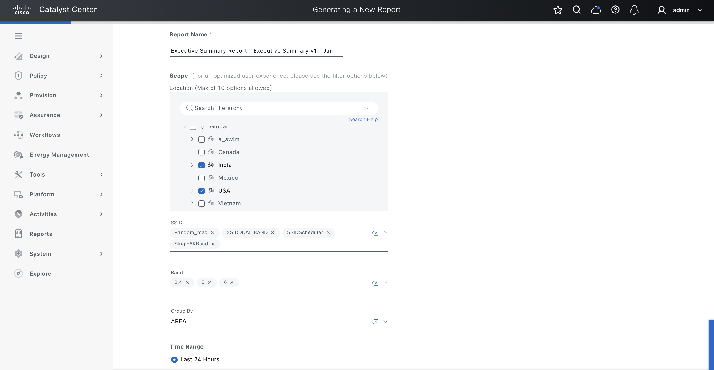
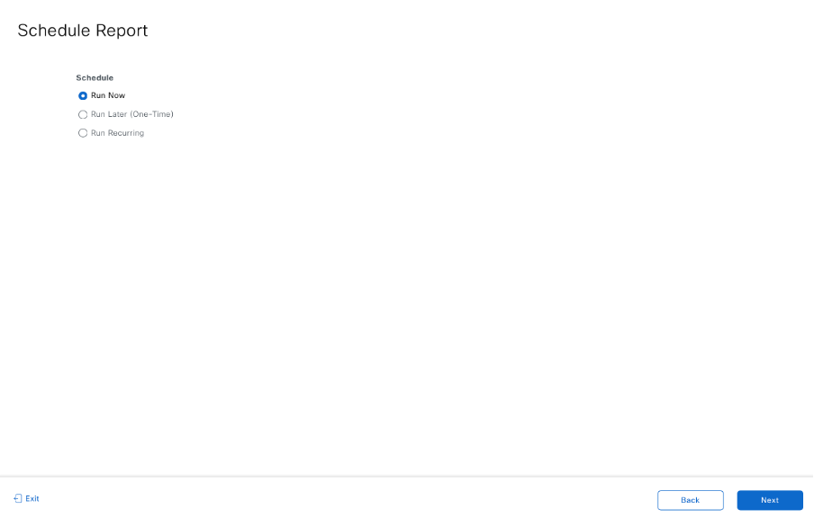
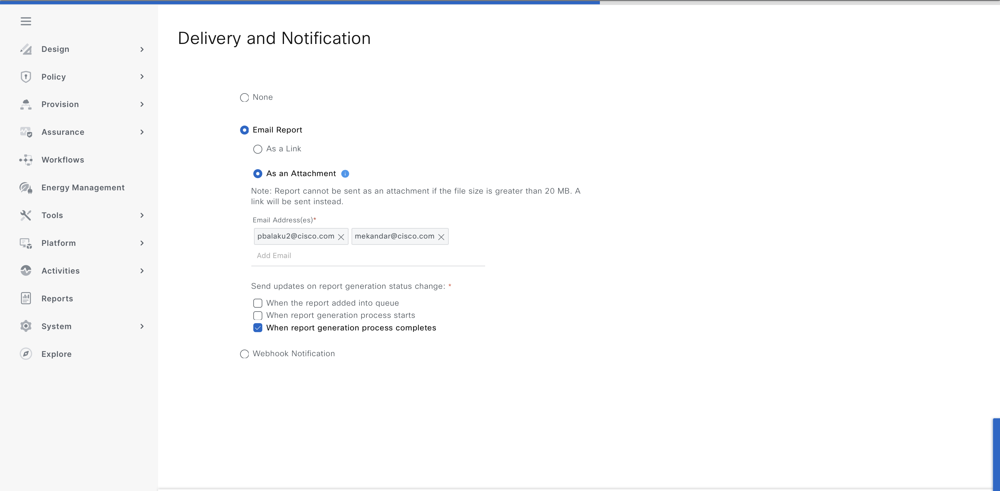

##### 2. **Schedule Report for Later Execution**  
*Example*: Schedule an Rogue aWIPs report for a specific date and time.

```yaml
catalyst_center_version: 3.1.3
reports_details:
  - generate_report:
      - name: "NewThreat_Rogue_aWIPS_Report"
        new_report: true
        view_group_name: "Rogue and aWIPS"
        tags:
          - rogue
          - awips
          - threat

        deliveries:
          - delivery_type: "DOWNLOAD"

        schedule:
          schedule_type: "SCHEDULE_LATER"
          date_time: "2026-01-25 02:00 PM"
          time_zone: "Europe/London"

        view:
          view_name: "New Threat"
          field_groups:
            - field_group_name: "rogue_details"
              field_group_display_name: "Threat Details"
              fields:
                - name: "threatLevel"
                - name: "macAddress"
                - name: "threatType"
                - name: "apName"
                - name: "siteHierarchyName"

          format:
            format_type: "CSV"

          filters:
            - name: "ThreatType"
              filter_type: "MULTI_SELECT"
              value:
                - value: "AirDrop Session"
                - value: "Association Flood"
            - name: "ThreatLevel"
              filter_type: "MULTI_SELECT"
              value:
                - value: "Informational"
                - value: "High"
            - name: "Location"
              filter_type: "MULTI_SELECT_TREE"
              value:
                - value: "Global"
            - name: "TimeRange"
              filter_type: "TIME_RANGE"
              value:
                time_range_option: "CUSTOM"
                start_date_time: "2026-01-15 02:00 PM"
                end_date_time: "2026-01-20 02:00 PM"
                time_zone: "Asia/Calcutta"
```
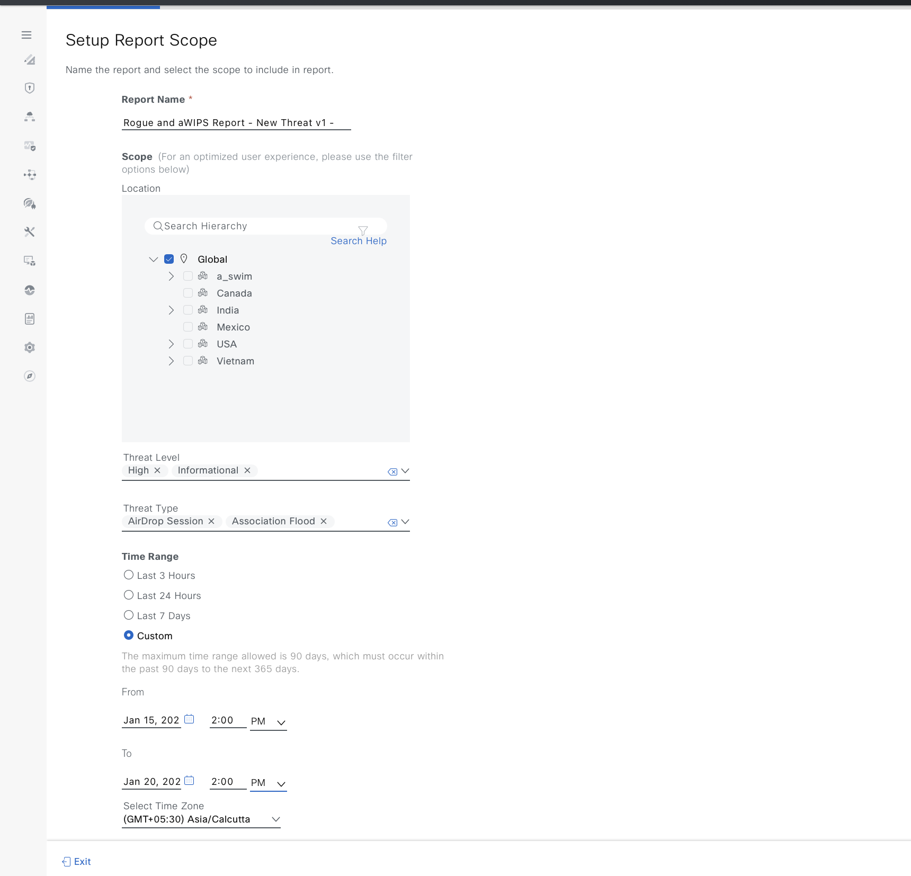
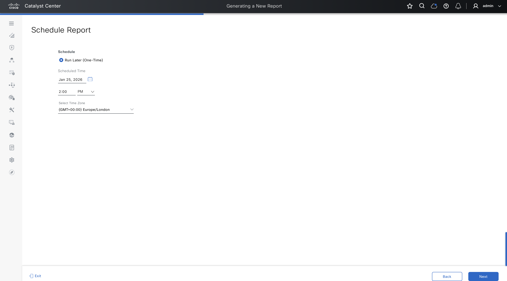
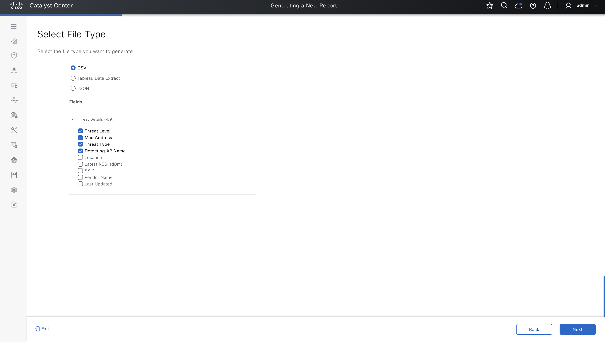
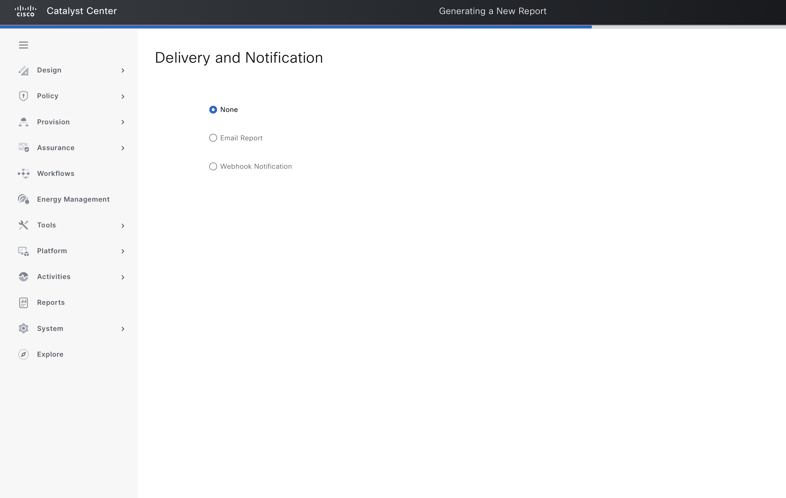

##### 3. **Create Recurring Weekly Report**  
*Example*: Create a weekly security advisory report.

```yaml
catalyst_center_version: 3.1.3
reports_details:
  - generate_report:
      - name: "SecurityAdvisories_module"
        view_group_name: "Security Advisories"

        deliveries:
          - delivery_type: "DOWNLOAD"

        schedule:
          schedule_type: "SCHEDULE_RECURRENCE"
          date_time: "2026-01-25 03:00 PM"
          time_zone: "Asia/Calcutta"
          recurrence:
            recurrence_type: WEEKLY
            days: ["TUESDAY", "WEDNESDAY"]

        view:
          view_name: "Security Advisories Data"
          field_groups:
            - field_group_name: "psirtAllData"
              field_group_display_name: "All Security Advisory Data"
              fields:
                - name: "deviceName"
                - name: "deviceType"
                - name: "deviceSite"
                - name: "deviceIpAddress"

          format:
            format_type: "CSV"

          filters:
            - name: "DeviceType"
              filter_type: "MULTI_SELECT"
              value:
                - value: "Routers"
                - value: "Switches and Hubs"
            - name: "Location"
              filter_type: "MULTI_SELECT_TREE"
              value:
                - value: "Global"
            - name: "Impact"
              filter_type: "MULTI_SELECT"
              value:
                - value: "HIGH"
                - value: "CRITICAL"
```
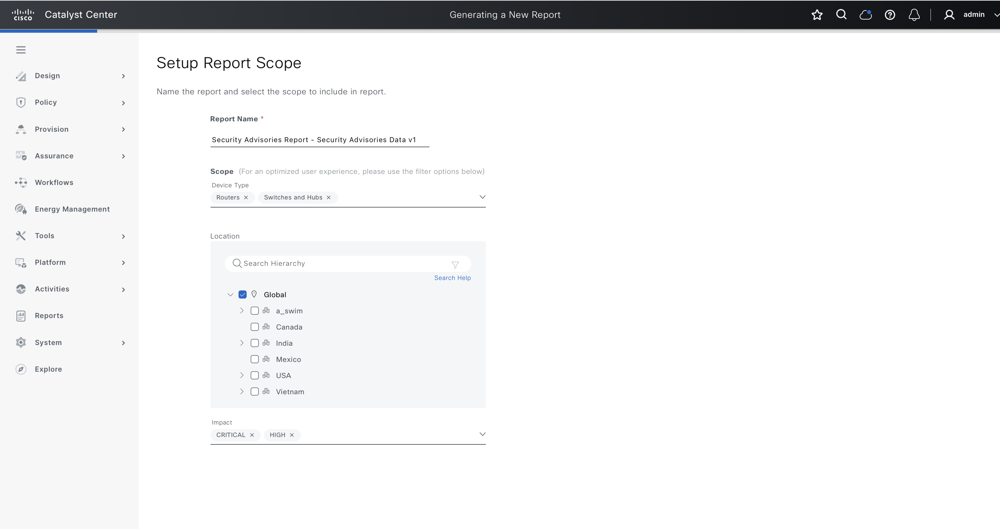
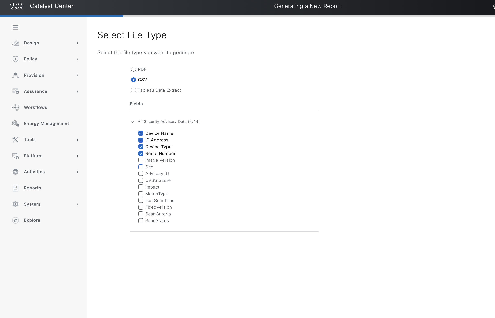
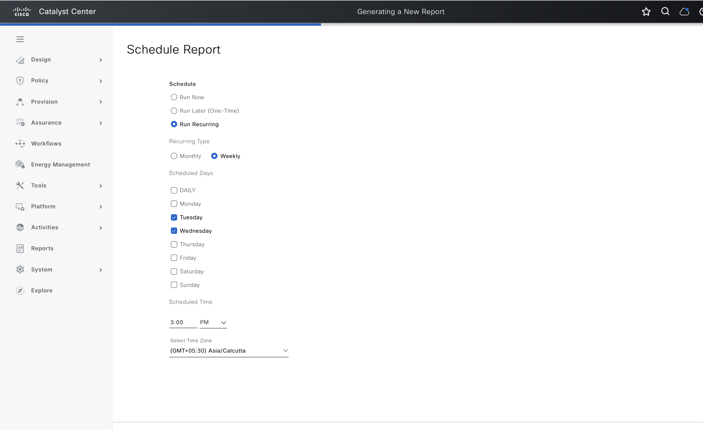


##### 4. **Create Monthly Recurring Report**  
*Example*: Create a Inventory (All Data) Report with monthly recursive Execution and webhook notification.

```yaml
catalyst_center_version: 3.1.3
reports_details:
  - generate_report:
      - name: "Inventory_all_data_report"
        view_group_name: "Inventory"

        deliveries:
          - delivery_type: "WEBHOOK"
            webhook_name: "webhook demo 102"

        schedule:
          schedule_type: "SCHEDULE_RECURRENCE"
          date_time: "2026-01-25 10:00 PM"
          time_zone: "America/New_York"
          recurrence:
            recurrence_type: MONTHLY
            day_of_month: 20

        view:
          view_name: "All Data"

          field_groups:
            - field_group_name: "inventoryAllData"
              field_group_display_name: "All Data"
              fields:
                - name: "family"
                - name: "type"
                - name: "hostname"
                - name: "serialNumber"

          format:
            format_type: "CSV"

          filters:
            - name: "Location"
              filter_type: "MULTI_SELECT_TREE"
              value:
                - value: "Global"
            - name: "DeviceType"
              filter_type: "MULTI_SELECT"
              value:
                - value: "Cisco Catalyst 9300 Switch"
                - value: "Cisco Catalyst 9500 Switch"
            - name: "DeviceFamily"
              filter_type: "MULTI_SELECT"
              value:
                - value: "Routers"
                - value: "Switches and Hubs"
            - name: "SoftwareVersion"
              filter_type: "MULTI_SELECT"
              value:
                - value: "17.12.4"
                - value: "17.12.5"
```
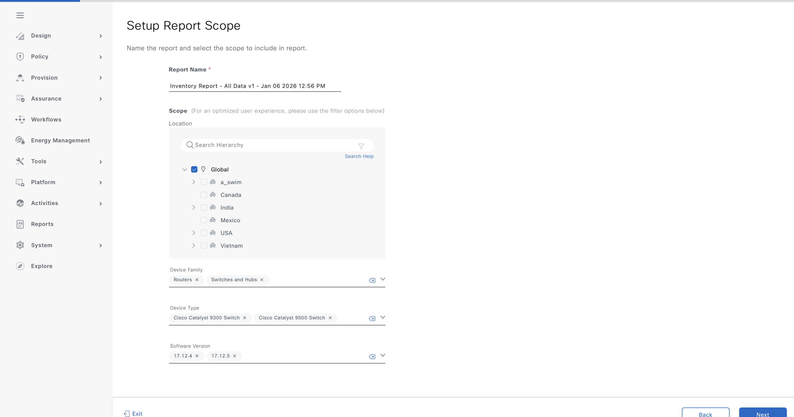
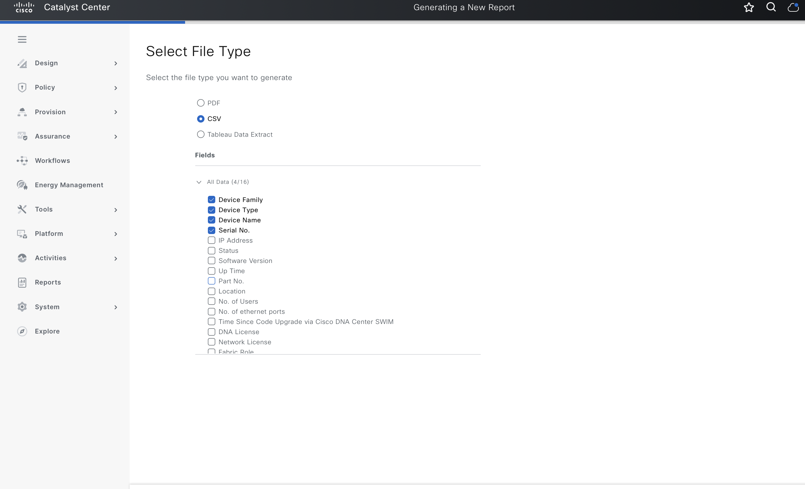
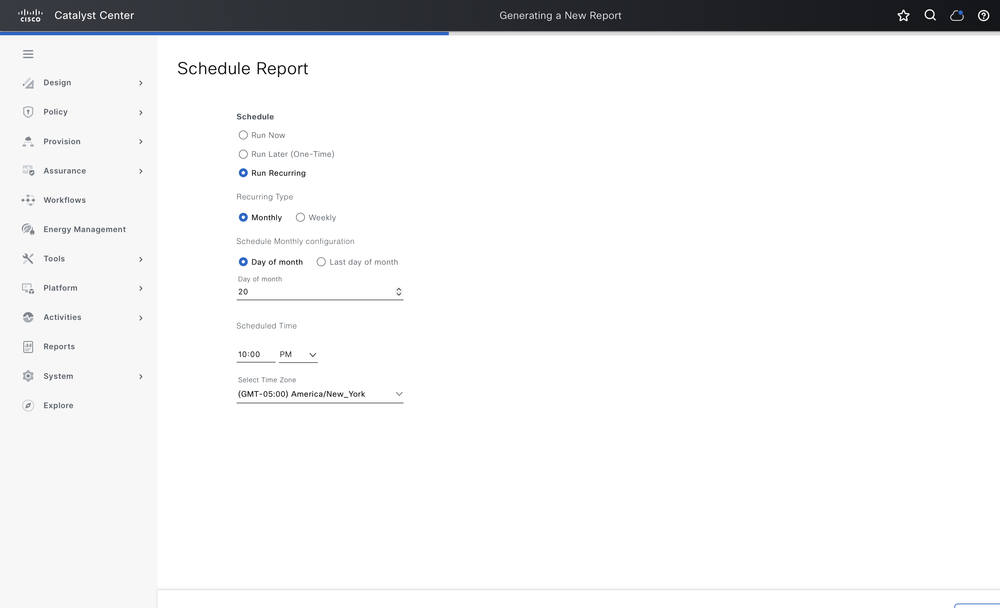
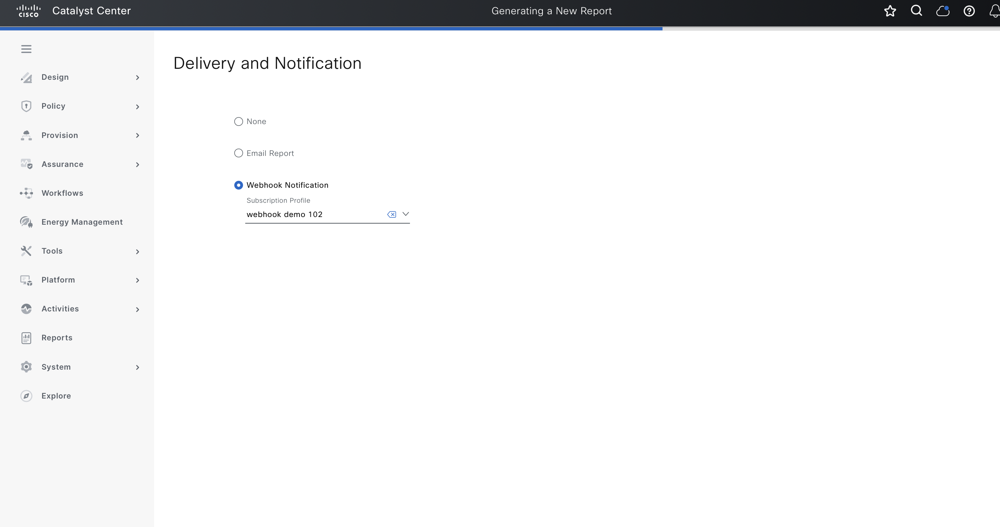

##### 5. **Create Monthly Recurring Report**  
*Example*: Create a Inventory (All data version 2.0) Report with Email Notification and generating report recursively on last day of month.

```yaml
catalyst_center_version: 3.1.3
reports_details:
  - generate_report:
      - name: "Monthly Inventory Report"
        new_report: false
        view_group_name: "Inventory"
        view_group_version: "2.0.0"
        tags:
          - inventory
          - monthly
        
        schedule:
          schedule_type: "SCHEDULE_RECURRENCE"
          date_time: "2026-12-25 09:00 AM"
          time_zone: "Asia/Calcutta"
          recurrence:
            recurrence_type: "MONTHLY"
            last_day_of_month: true
        
        deliveries:
          - delivery_type: "NOTIFICATION"
            notification_endpoints:
              - email_addresses:
                  - "pbalaku2@cisco.com"
            email_attach: true
            notify:
              - "COMPLETED"
        
        view:
          view_name: "All Data Version 2.0"
          
          field_groups:
            - field_group_name: "inventory_fields"
              field_group_display_name: "Inventory Information"
              fields:
                - name: "name"
                  display_name: "Device Name"
                - name: "managementIpAddress"
                  display_name: "IP Address"
                - name: "deviceType"
                  display_name: "Device Type"
                - name: "softwareVersion"
                  display_name: "Software Version"
                - name: "siteHierarchy"
                  display_name: "Location"
                - name: "communicationState"
                  display_name: "Status"

          format:
            format_type: "CSV"
          
          filters:
            - name: "siteId"
              filter_type: "MULTI_SELECT_TREE"
              value:
                - value: "Global/USA"
            - name: "deviceType"
              filter_type: "MULTI_SELECT"
              value:
                - value: "Cisco Catalyst 9300 Switch"
            - name: "deviceFamily"
              filter_type: "MULTI_SELECT"
              value:
                - value: "Routers"
                - value: "Switches and Hubs"
            - name: "softwareVersion"
              filter_type: "MULTI_SELECT"
              value:
                - value: "17.12.4"
                - value: "17.12.5"
```
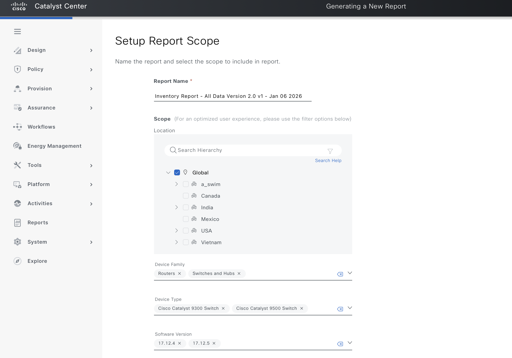
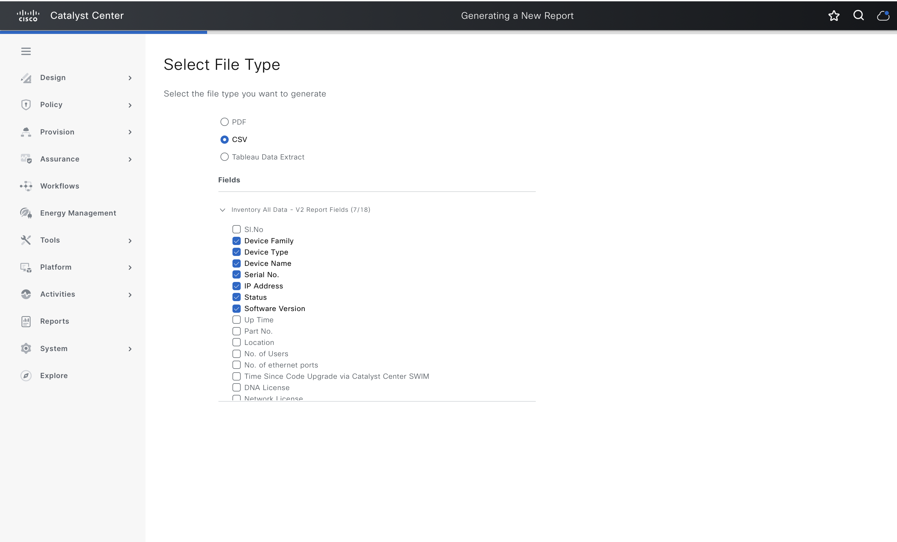


##### 6. **Delete Reports**  
*Example*: Delete one or more reports by specifying their names and view information.  
> **Warning**: Deleting reports will remove all scheduled executions. Verify before proceeding.

```yaml
catalyst_center_version: 3.1.3
reports_details:
  - generate_report:
      - name: "Network_Devices_report_transmit_power_change_count_20260105T212018"
        view_group_name: "Network Devices"
        view:
          view_name: "Transmit Power Change Count"
  
  - generate_report:
      - name: "Monthly Inventory Report"
        view_group_name: "Inventory"
        view:
          view_name: "All Data Version 2.0"
```
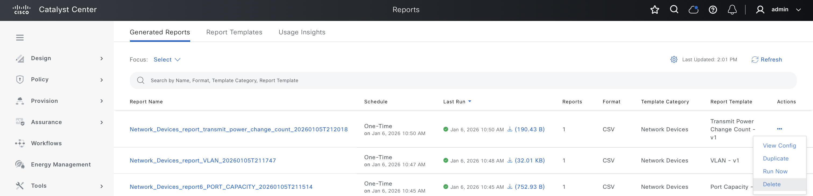
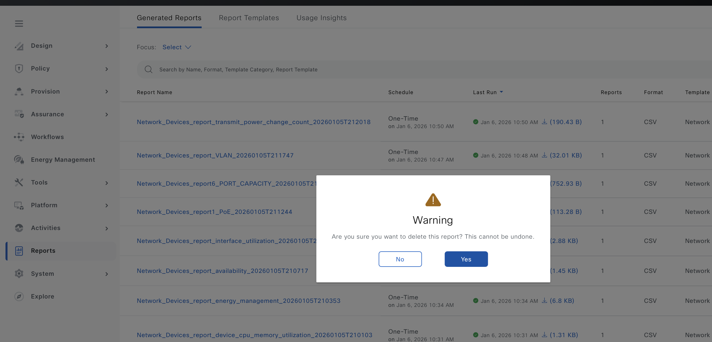

---

#### Validate Configuration
> **Important**: Validate your input schema before executing the playbook to ensure all parameters are correctly formatted.  
Run the following command to validate your input file against the schema:  
```bash
./tools/validate.sh -s ./workflows/reports/schema/reports_schema.yml -d ./workflows/reports/vars/reports_input.yml
```
---

### Step 3: Deploy and Verify

**Deploy** your configuration to *Cisco Catalyst Center* and **verify** the changes.

1. **Deploy Configuration**:  
   Run the playbook to apply the reports configuration. Ensure the input file is validated before execution. Specify the input file path using the `--e` variable (`VARS_FILE_PATH`).

   ### a. Create or Update Reports (state = 'merged')
   ```bash
   ansible-playbook -i inventory/demo_lab/hosts.yaml \
   workflows/reports/playbook/reports_playbook.yml \
   --e VARS_FILE_PATH=./../vars/reports_input.yml \
   -vvv
   ```

   ### b. Delete Reports (state = 'deleted')
   ```bash
   ansible-playbook -i inventory/demo_lab/hosts.yaml \
   workflows/reports/playbook/delete_reports_playbook.yml \
   --e VARS_FILE_PATH=./../vars/delete_reports_input.yml \
   -vvv
   ```

   > **Note**: If an error occurs (e.g., invalid input or API failure), the playbook will halt and display details. Check the execution logs for troubleshooting.

2. **Verify Deployment**:  
   After execution, verify the configuration in the *Cisco Catalyst Center* UI:
   - Navigate to **Reports** > **Report List** to view created reports.
   - Check **Scheduled Reports** to verify scheduled executions.
   - Review report execution history for completed reports.
   - Verify delivery configurations (email notifications, webhooks, or downloads).
   
   If `catalyst_center_debug` is enabled, review the logs for detailed operation information.

---

## Example Output

**Successful Report Creation:**
```yaml
msg: 'Successfully created or scheduled report 'Report - Security Advisories Data - Jan 06 2026 08:22 PM'.'
response:
  - "reportId": "d2e2107b-5b55-4e34-9905-87ea3e63aef5"
    "viewGroupId": "b3760891-1e1f-465a-a018-bbd428c17018"
    "viewsId": "995220e3-3801-44cd-82a7-05d33e6b6676"
status: success
```

**Successful Report Deletion:**
```yaml
msg: 'Report 'Network_Devices_report_transmit_power_change_count_20260105T212018' has been successfully deleted.'
response:
  - "report_id": "b66ceac2-7f59-41b4-882a-860537462c7e"
status: success
```
---

## References

**Environment Details**  
The following environment was used for testing:  

| **Component**         | **Version** |
|-----------------------|-------------|
| Python                | `3.12.0`    |
| Cisco Catalyst Center | `3.1.3`     |
| Ansible               | `9.9.0`     |
| cisco.dnac Collection | `6.43.0`    |
| dnacentersdk          | `2.8.8`     |

For detailed documentation, refer to:  
- [Ansible Galaxy: Cisco Catalyst Center Collection](https://galaxy.ansible.com/ui/repo/published/cisco/dnac/content/module/reports_workflow_manager/)  
- [Cisco Catalyst Center Documentation](https://www.cisco.com/c/en/us/support/cloud-systems-management/dna-center/series.html)
- [Reports Workflow Manager Module Documentation](https://github.com/cisco-en-programmability/catalyst-center-ansible-dev/blob/main/plugins/modules/reports_workflow_manager.py)
