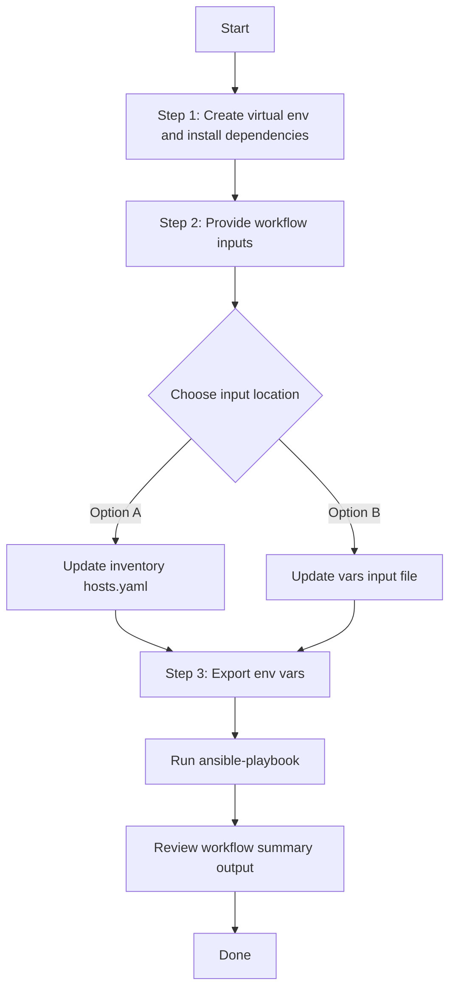

# SDA Device Removal and Unprovision Workflow

This workflow removes an SDA fabric device end to end using a single playbook. It is intended for refresh and cleanup scenarios where a device must be taken out of service cleanly after traffic and access-facing configuration have already been moved elsewhere.

The workflow performs four stages for each device entry:
1. Resolve the device management IP from Catalyst Center inventory using the device name.
2. Clear all SDA host onboarding on that device for the specified fabric site.
3. Remove the device from the SDA fabric site.
4. Unprovision the device and remove it from Catalyst Center inventory.

### Minimum Catalyst Center Version Supported: 2.3.7.6

## Workflow Representation


## Input Data Model

### Definition

| Field | Type | Required | Description |
|---|---|---|---|
| `sda_device_removal_and_unprovision` | `list[object]` | Yes | One or more device-removal entries. |
| `sda_device_removal_and_unprovision[].device_name` | `string` | Yes | Exact device hostname as it appears in Catalyst Center inventory. |
| `sda_device_removal_and_unprovision[].fabric_site_name_hierarchy` | `string` | Yes | Full SDA fabric site hierarchy for host onboarding cleanup and fabric removal. |
| `sda_device_removal_and_unprovision[].device_collection_status_check` | `bool` | No | Skip device collection-status validation during host onboarding delete when set to `false`. |

### Example Input

```yaml
---
catalyst_center_version: 2.3.7.9

sda_device_removal_and_unprovision:
  - device_name: "SJ-EDGE-9300-1.cisco.local"
    fabric_site_name_hierarchy: "Global/USA/SAN JOSE/SJ_BLD23"
```

## Files

- `playbook/sda_device_removal_and_unprovision_playbook.yml`
- `playbook/tasks/remove_single_device.yml`
- `schema/sda_device_removal_and_unprovision_schema.yml`
- `vars/sda_device_removal_and_unprovision_input.yml`

## Workflow Steps

## User Flow (3 Steps)



### Installation and Run

1. Create and activate a Python virtual environment, then install dependencies.

```bash
python3 -m venv .venv
source .venv/bin/activate
pip install -r requirements.txt
ansible-galaxy collection install cisco.catalystcenter --force
```

2. Provide workflow inputs in either inventory (`inventory/demo_lab/hosts.yaml`) or the workflow vars file.

Update:
- `workflows/sda_device_removal_and_unprovision/vars/sda_device_removal_and_unprovision_input.yml`

3. Export Catalyst Center environment variables and run the playbook.

```bash
export HOSTIP=<catalyst-center-ip-or-fqdn>
export CATALYST_CENTER_USERNAME=<username>
export CATALYST_CENTER_PASSWORD='<password>'
```

Run using inventory variables only:

```bash
ansible-playbook -i ./inventory/demo_lab/hosts.yaml \
  ./workflows/sda_device_removal_and_unprovision/playbook/sda_device_removal_and_unprovision_playbook.yml \
  -vvvv
```

Run using the workflow vars file:

```bash
ansible-playbook -i ./inventory/demo_lab/hosts.yaml \
  ./workflows/sda_device_removal_and_unprovision/playbook/sda_device_removal_and_unprovision_playbook.yml \
  --extra-vars VARS_FILE_PATH=${PWD}/workflows/sda_device_removal_and_unprovision/vars/sda_device_removal_and_unprovision_input.yml \
  -vvvv
```

## Stage Details

### Stage 1: Resolve Device Inventory Details

The workflow looks up the device in Catalyst Center by `device_name` and retrieves the management IP needed by the downstream fabric removal and unprovision operations.

### Stage 2: Clear Host Onboarding

The workflow uses the same module and data model as the SDA host onboarding delete workflow to clear all port assignments and port channels for the specified fabric device.

### Stage 3: Remove Device from SDA Fabric

The workflow uses the same module and delete payload shape as the SDA fabric device roles delete workflow to remove the device from the specified fabric site.

### Stage 4: Unprovision and Remove from Inventory

The workflow uses the provision workflow manager in `deleted` state to unprovision the device and remove it from Catalyst Center inventory.

## Validation

Validate the input file against the workflow schema before execution:

```bash
./tools/schemavalidation.sh -s workflows/sda_device_removal_and_unprovision/schema/sda_device_removal_and_unprovision_schema.yml \
  -v workflows/sda_device_removal_and_unprovision/vars/sda_device_removal_and_unprovision_input.yml
```

## References

- [SDA Host Onboarding Workflow](../sda_hostonboarding/README.md)
- [SDA Fabric Device Roles Workflow](../sda_fabric_device_roles/README.md)
- [Provision Workflow](../provision/README.md)
## VARS_FILE_PATH Path Resolution

Ansible resolves `VARS_FILE_PATH` relative to the playbook directory, not the current working directory.

Use either of these forms:

- Relative to the playbook: `../vars/sda_device_removal_and_unprovision_input.yml`
- Fully resolved from the repo root: `${PWD}/workflows/sda_device_removal_and_unprovision/vars/sda_device_removal_and_unprovision_input.yml`

