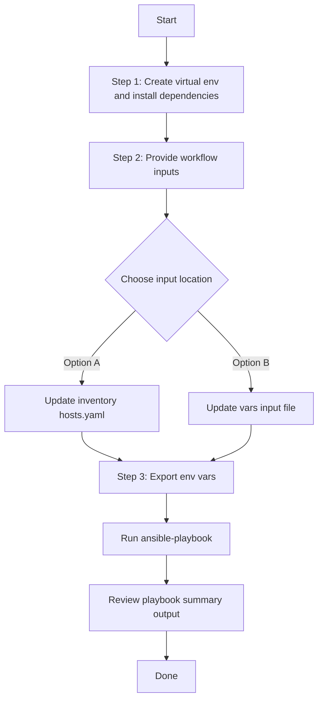

# SDA Extranet Policies Config Generator

## Table of Contents

- [User Flow (3 Steps)](#user-flow-3-steps)

- [Overview](#overview)
- [Features](#features)
- [Prerequisites](#prerequisites)
- [Workflow Structure](#workflow-structure)
- [Schema Parameters](#schema-parameters)
- [Getting Started](#getting-started)
- [Operations](#operations)
- [Examples](#examples)

---

## Overview

The SDA Extranet Policies config generator automates YAML playbook generation for existing SDA extranet policies in Cisco Catalyst Center. It generates output compatible with `sda_extranet_policies_workflow_manager` for brownfield export, audit, and migration workflows.

---

## Features

- **Configuration Generation**: Generate YAML configurations compatible with `sda_extranet_policies_workflow_manager`.
  - Extract existing SDA extranet policy configurations from Catalyst Center.
  - Capture provider virtual networks, subscriber virtual networks, and fabric site assignments.
  - Convert API responses into workflow-manager-ready YAML.
  - Reuse generated output for backup, migration, and audit.
- **Component Filtering**: Generate `extranet_policies` selectively.
- **Policy Filtering**: Filter by exact `extranet_policy_name`.
- **Flexible Output**: Supports custom `file_path` and `file_mode` (`overwrite` / `append`).
- **Brownfield Discovery**: Omit `config` or leave it empty to generate all extranet policy configurations.
- **Site Path Resolution**: Fabric site UUIDs are resolved to human-readable site hierarchy paths in generated playbooks.

---

## Prerequisites

### Software Requirements

| Component | Version |
|-----------|---------|
| Ansible | 2.13+ |
| cisco.dnac collection | 6.45.0+ |
| Python | 3.9+ |
| Cisco Catalyst Center | 2.3.7.9+ |
| dnacentersdk | 2.10.10+ |

### Required Collections

```bash
ansible-galaxy collection install cisco.dnac
ansible-galaxy collection install ansible.utils
pip install dnacentersdk
pip install yamale
```

### Access Requirements

- Catalyst Center credentials with SDA extranet API access
- Network connectivity to Catalyst Center
- Existing SDA extranet policies (for targeted export use cases)
- Cisco Catalyst Center version `2.3.7.9` or later for SDA extranet policy API support

---

## Workflow Structure

```
sda_extranet_policies_config_generator/
├── playbook/
│   └── sda_extranet_policies_config_generator.yml   # Main operations
├── vars/
│   └── sda_extranet_policies_config_inputs.yml      # Input examples
├── schema/
│   └── sda_extranet_policies_config_schema.yml      # Input validation
└── README.md
```

---

## Schema Parameters

### Basic Configuration

| Parameter | Type | Required | Default | Description |
|-----------|------|----------|---------|-------------|
| `file_path` | string | No | auto-generated | Output file path for generated YAML. If omitted, the module creates `sda_extranet_policies_playbook_config_<YYYY-MM-DD_HH-MM-SS>.yml` in the current working directory |
| `file_mode` | string | No | `overwrite` | File write mode: `overwrite` or `append` |
| `config` | dict | No | omitted | Filter dictionary passed to the module. If omitted or empty, all extranet policy configurations are generated |

### Component Filters

| Parameter | Type | Required | Description |
|-----------|------|----------|-------------|
| `component_specific_filters` | dict | Yes when `config` is provided | Component filters for extranet policy generation |

### `component_specific_filters`

| Parameter | Type | Required | Description |
|-----------|------|----------|-------------|
| `components_list` | list[string] | No | Supported value: `extranet_policies` |
| `extranet_policies` | list[dict] | No | Policy filters (`extranet_policy_name`) |

### Supported Components

- `extranet_policies`

### Extranet Policy Filters

| Parameter | Type | Description |
|-----------|------|-------------|
| `extranet_policy_name` | string | Exact extranet policy name configured in Cisco Catalyst Center |

---

## Getting Started

## Workflow Steps
## User Flow (3 Steps)



### Installation and Run (Aligned)

1. Create and activate a Python virtual environment, then install dependencies.

```bash
python3 -m venv .venv
source .venv/bin/activate
pip install -r requirements.txt
ansible-galaxy collection install cisco.dnac --force
```

2. Provide workflow inputs in either inventory (`inventory/demo_lab/hosts.yaml`) or the workflow `vars/` file.

3. Export Catalyst Center environment variables and run the playbook.

```bash
export HOSTIP=<catalyst-center-ip-or-fqdn>
export CATALYST_CENTER_USERNAME=<username>
export CATALYST_CENTER_PASSWORD='<password>'
ansible-playbook -i ./inventory/demo_lab/hosts.yaml ./workflows/sda_extranet_policies_config_generator/playbook/sda_extranet_policies_config_generator.yml -vvvv
```


## Operations

### Generate Operations (state: gathered)

Use `sda_extranet_policies_config_generator.yml` for generating YAML playbook configuration operations.

#### Generate All SDA Extranet Policies

**Description**: Retrieves all SDA extranet policy configurations from Catalyst Center. Omit `config` or leave it empty to trigger full generation mode.

```yaml
sda_extranet_policies_config:
  - file_path: "/tmp/sda_extranet_policies_complete_config.yml"
    file_mode: "overwrite"
```

#### Generate Component Output Only

**Description**: Generates extranet policy output with component filter specified but no policy-name filter.

```yaml
sda_extranet_policies_config:
  - file_path: "/tmp/sda_extranet_policies_component.yml"
    file_mode: "overwrite"
    config:
      component_specific_filters:
        components_list: ["extranet_policies"]
```

#### Filter by Extranet Policy Name

**Description**: Generates extranet policy output for specific policy names only.

```yaml
sda_extranet_policies_config:
  - file_path: "/tmp/sda_extranet_policies_by_name.yml"
    file_mode: "overwrite"
    config:
      component_specific_filters:
        components_list: ["extranet_policies"]
        extranet_policies:
          - extranet_policy_name: "Test_1"
          - extranet_policy_name: "Branch_Extranet_Policy"
```

#### Append Mode Generation

**Description**: Appends generated output to an existing file instead of overwriting.

```yaml
sda_extranet_policies_config:
  - file_path: "/tmp/sda_extranet_policies_aggregate.yml"
    file_mode: "append"
    config:
      component_specific_filters:
        components_list: ["extranet_policies"]
        extranet_policies:
          - extranet_policy_name: "Campus_Extranet"
```

**Validate and Execute:**

```bash
# Validate
./tools/schemavalidation.sh -s workflows/sda_extranet_policies_config_generator/schema/sda_extranet_policies_config_schema.yml \
                            -d workflows/sda_extranet_policies_config_generator/vars/sda_extranet_policies_config_inputs.yml
```

**Return result validate:**

```bash
(pyats-priya) [pbalaku2@st-ds-4 dnac_ansible_workflows]$ ./tools/schemavalidation.sh -s workflows/sda_extranet_policies_config_generator/schema/sda_extranet_policies_config_schema.yml \
>                            -d workflows/sda_extranet_policies_config_generator/vars/sda_extranet_policies_config_inputs.yml
workflows/sda_extranet_policies_config_generator/schema/sda_extranet_policies_config_schema.yml
workflows/sda_extranet_policies_config_generator/vars/sda_extranet_policies_config_inputs.yml
yamale   -s workflows/sda_extranet_policies_config_generator/schema/sda_extranet_policies_config_schema.yml  workflows/sda_extranet_policies_config_generator/vars/sda_extranet_policies_config_inputs.yml
Validating workflows/sda_extranet_policies_config_generator/vars/sda_extranet_policies_config_inputs.yml...
Validation success! 👍
```

```bash
# Execute
ansible-playbook -i inventory/demo_lab/hosts.yaml \
  workflows/sda_extranet_policies_config_generator/playbook/sda_extranet_policies_config_generator.yml \
  --extra-vars VARS_FILE_PATH=./workflows/sda_extranet_policies_config_generator/vars/sda_extranet_policies_config_inputs.yml
```

**Expected Terminal Output:**

1. **Generate All SDA Extranet Policies**

```code
    "msg": {
        "components_processed": 1,
        "components_skipped": 0,
        "configurations_count": 3,
        "file_mode": "overwrite",
        "file_path": "/tmp/sda_extranet_policies_complete_config.yml",
        "message": "YAML configuration file generated successfully for module 'sda_extranet_policies_workflow_manager'",
        "status": "success"
    }
```

2. **Component Output Only:**

```code
    "msg": {
        "components_processed": 1,
        "components_skipped": 0,
        "configurations_count": 3,
        "file_mode": "overwrite",
        "file_path": "/tmp/sda_extranet_policies_component.yml",
        "message": "YAML configuration file generated successfully for module 'sda_extranet_policies_workflow_manager'",
        "status": "success"
    }
```

3. **Extranet Policy Name Filtered Generation:**

```code
    "msg": {
        "components_processed": 1,
        "components_skipped": 0,
        "configurations_count": 2,
        "file_mode": "overwrite",
        "file_path": "/tmp/sda_extranet_policies_by_name.yml",
        "message": "YAML configuration file generated successfully for module 'sda_extranet_policies_workflow_manager'",
        "status": "success"
    }
```

4. **Append Mode Generation:**

```code
    "msg": {
        "components_processed": 1,
        "components_skipped": 0,
        "configurations_count": 1,
        "file_mode": "append",
        "file_path": "/tmp/sda_extranet_policies_aggregate.yml",
        "message": "YAML configuration file generated successfully for module 'sda_extranet_policies_workflow_manager'",
        "status": "success"
}
```

---

## Examples

### Example 1: Generate All SDA Extranet Policies

```yaml
sda_extranet_policies_config:
  - file_path: "/tmp/sda_extranet_policies_complete_config.yml"
    file_mode: "overwrite"
```

**Sample Generated Output**:

Below is a sample YAML configuration file generated by the module when `config` is omitted:

```yaml
---
config:
  - extranet_policy_name: new1
    provider_virtual_network: DEFAULT_VN
    subscriber_virtual_networks:
      - VN3
      - VN1
  - extranet_policy_name: Test2_Policy
    provider_virtual_network: IntraSubnet_VN
    subscriber_virtual_networks:
      - VN3
      - VN4
      - VN7
      - VN6
  - extranet_policy_name: Test1_policy
    provider_virtual_network: Fabric_VN
    subscriber_virtual_networks:
      - VN2
      - VN1
```

### Example 2: Filter by Extranet Policy Name

Extract specific extranet policies only.

```yaml
sda_extranet_policies_config:
  - file_path: "/tmp/sda_extranet_policies_by_name.yml"
    file_mode: "overwrite"
    config:
      component_specific_filters:
        components_list: ["extranet_policies"]
        extranet_policies:
          - extranet_policy_name: "Test2_Policy"
          - extranet_policy_name: "Test1_policy"
```

**Sample Generated Output**:

Below is a sample YAML configuration file generated by the module when `extranet_policy_name` filters are used:

```yaml
---
config:
  - extranet_policy_name: Test2_Policy
    provider_virtual_network: IntraSubnet_VN
    subscriber_virtual_networks:
      - VN3
      - VN4
      - VN7
      - VN6
  - extranet_policy_name: Test1_policy
    provider_virtual_network: Fabric_VN
    subscriber_virtual_networks:
      - VN2
      - VN1
```

> **Note:** Only the specified extranet policies are included in the generated output. Policy names must match the exact names configured in Catalyst Center.

### Example 3: Append Multiple Exports to a Single File

Generate a filtered export and append another filtered export to the same output file.

```yaml
sda_extranet_policies_config:
  - file_path: "/tmp/sda_extranet_policies_aggregate.yml"
    file_mode: "overwrite"
    config:
      component_specific_filters:
        components_list: ["extranet_policies"]
        extranet_policies:
          - extranet_policy_name: "new1"

  - file_path: "/tmp/sda_extranet_policies_aggregate.yml"
    file_mode: "append"
    config:
      component_specific_filters:
        components_list: ["extranet_policies"]
        extranet_policies:
          - extranet_policy_name: "Test2_Policy"
```

**Sample Generated Output**:

After the first run (`overwrite`), the file contains the `new1` policy. After the second run (`append`), the `Test2_Policy` configuration is appended.

```yaml
---
config:
  - extranet_policy_name: new1
    provider_virtual_network: DEFAULT_VN
    subscriber_virtual_networks:
      - VN3
      - VN1

config:
  - extranet_policy_name: Test2_Policy
    provider_virtual_network: IntraSubnet_VN
    subscriber_virtual_networks:
      - VN3
      - VN4
      - VN7
      - VN6
```

### Example 4: Auto-generated File Path

When no `file_path` is specified, the module auto-generates a timestamped filename.

```yaml
sda_extranet_policies_config:
  - config:
      component_specific_filters:
        components_list: ["extranet_policies"]
        extranet_policies:
          - extranet_policy_name: "Test1_policy"
# Output: sda_extranet_policies_playbook_config_2026-04-14_22-00-07.yml
```

---

## Notes

- `sda_extranet_policies_playbook_config_generator` expects `config` as a dictionary when filters are used.
- This workflow omits `config` when filters are absent, which triggers full generation mode.
- Inside `config`, `component_specific_filters` is mandatory when filters are provided.
- If `extranet_policies` filters are provided without `components_list`, the module auto-populates `components_list` internally.
- The generated playbook is compatible with `cisco.dnac.sda_extranet_policies_workflow_manager`.
- Fabric site UUIDs returned by Catalyst Center are resolved into human-readable site hierarchy paths.
- The workflow operates in gathered mode only and does not make changes to Cisco Catalyst Center.
