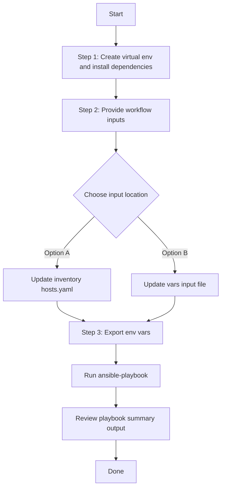

# SDA Extranet Policies Config Generator

## Table of Contents

- [User Flow (3 Steps)](#user-flow-3-steps)

- [Overview](#overview)
- [Features](#features)
- [Prerequisites](#prerequisites)
- [Workflow Structure](#workflow-structure)
- [Schema Parameters](#schema-parameters)
- [Getting Started](#getting-started)
- [Operations](#operations)
- [Examples](#examples)---

## Overview

The SDA Extranet Policies config generator automates YAML playbook generation for existing SDA extranet policies in Cisco Catalyst Center. It generates output compatible with `sda_extranet_policies_workflow_manager` for brownfield export and migration workflows.

---

## Features

- **Configuration Generation**: Generate YAML configurations compatible with `sda_extranet_policies_workflow_manager`.
  - Extract provider and subscriber VN mappings from existing extranet policies.
  - Resolve policy data into workflow-manager-ready YAML.
  - Reuse generated output for backup, audit, and migration.
- **Component Filtering**: Generate `extranet_policies` selectively.
- **Policy Filtering**: Filter by `extranet_policy_name`.
- **Flexible Output**: Supports custom `file_path` and `file_mode` (`overwrite` / `append`).
- **Brownfield Discovery**: Omit `config` (or use workflow convenience flag) to generate all extranet policy configurations.

---

## Prerequisites

### Software Requirements

| Component | Version |
|-----------|---------|
| Ansible | 2.13+ |
| cisco.dnac collection | 6.45.0+ |
| Python | 3.9+ |
| Cisco Catalyst Center | 2.3.7.9+ |
| dnacentersdk | 2.10.10+ |

### Required Collections

```bash
ansible-galaxy collection install cisco.dnac
ansible-galaxy collection install ansible.utils
pip install dnacentersdk
pip install yamale
```

### Access Requirements

- Catalyst Center credentials with SDA extranet API access
- Network connectivity to Catalyst Center
- Existing SDA extranet policies (for targeted export use cases)

---

## Workflow Structure

```
sda_extranet_policies_config_generator/
├── playbook/
│   └── sda_extranet_policies_config_generator.yml   # Main operations
├── vars/
│   └── sda_extranet_policies_config_inputs.yml      # Input examples
├── schema/
│   └── sda_extranet_policies_config_schema.yml      # Input validation
└── README.md
```

---

## Schema Parameters

### Basic Configuration

| Parameter | Type | Required | Default | Description |
|-----------|------|----------|---------|-------------|
| `generate_all_configurations` | boolean | No | false | Workflow convenience flag. When true, playbook omits module `config` |
| `file_path` | string | No | auto-generated | Output file path for generated YAML |
| `file_mode` | string | No | `overwrite` | File write mode: `overwrite` or `append` |
| `component_specific_filters` | dict | No | omitted | Component and filters passed to module `config` |

### Component Filters

| Parameter | Type | Required | Description |
|-----------|------|----------|-------------|
| `components_list` | list[string] | No | Supported value: `extranet_policies` |
| `extranet_policies` | list[dict] | No | Policy filters (`extranet_policy_name`) |

---

## Getting Started

## Workflow Steps
## User Flow (3 Steps)



### Installation and Run (Aligned)

1. Create and activate a Python virtual environment, then install dependencies.

```bash
python3 -m venv .venv
source .venv/bin/activate
pip install -r requirements.txt
ansible-galaxy collection install cisco.dnac --force
```

2. Provide workflow inputs in either inventory (`inventory/demo_lab/hosts.yaml`) or the workflow `vars/` file.

3. Export Catalyst Center environment variables and run the playbook.

```bash
export HOSTIP=<catalyst-center-ip-or-fqdn>
export CATALYST_CENTER_USERNAME=<username>
export CATALYST_CENTER_PASSWORD='<password>'
ansible-playbook -i ./inventory/demo_lab/hosts.yaml ./workflows/sda_extranet_policies_config_generator/playbook/sda_extranet_policies_config_generator.yml -vvvv
```


## Operations

### Generate Operations (state: gathered)

1. **Generate all extranet policies**
- Set `generate_all_configurations: true`.

2. **Generate policy component only**
- Use `component_specific_filters.components_list: ["extranet_policies"]`.

3. **Generate specific policies**
- Use `component_specific_filters.extranet_policies[].extranet_policy_name`.

4. **Append generated output**
- Set `file_mode: append`.

---

## Examples

### Example 1: Generate all SDA extranet policies

```yaml
sda_extranet_policies_config:
  - generate_all_configurations: true
    file_path: "/tmp/sda_extranet_policies_complete_config.yml"
```

### Example 2: Filter by extranet policy name

```yaml
sda_extranet_policies_config:
  - file_path: "/tmp/sda_extranet_policies_by_name.yml"
    component_specific_filters:
      components_list: ["extranet_policies"]
      extranet_policies:
        - extranet_policy_name: "Test_1"
        - extranet_policy_name: "Branch_Extranet_Policy"
```

---

## Notes

- `sda_extranet_policies_playbook_config_generator` expects `config` as a dictionary when filters are used.
- This workflow omits `config` when filters are absent, which triggers full generation mode.
- If `extranet_policies` filters are provided without `components_list`, the module auto-populates `components_list` internally.
