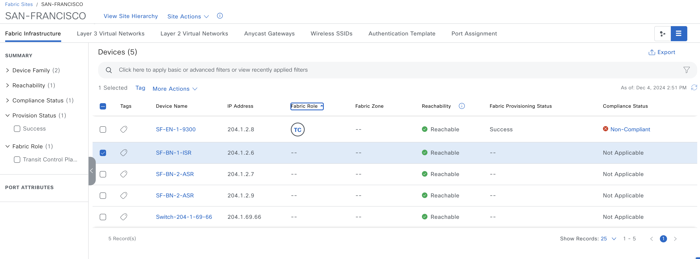
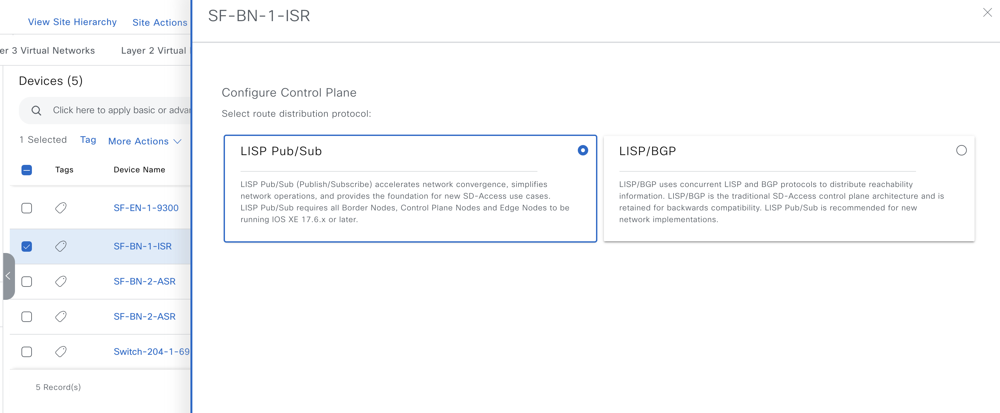
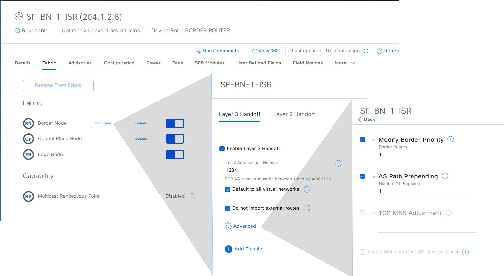
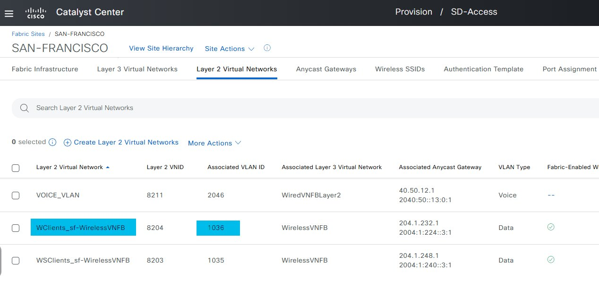
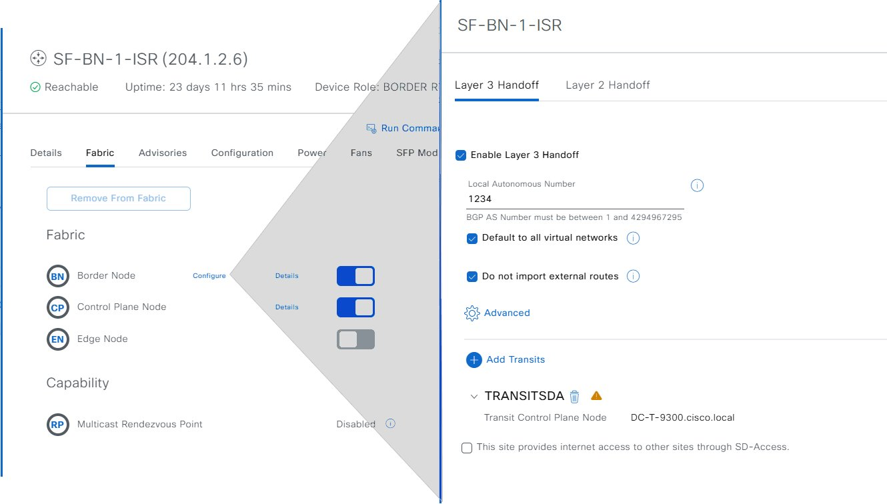
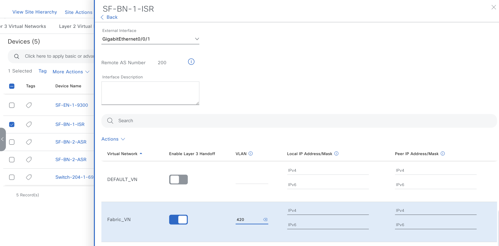
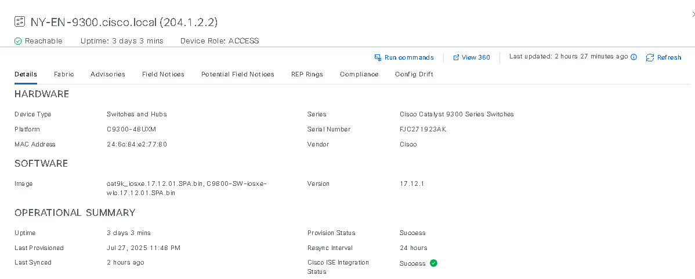
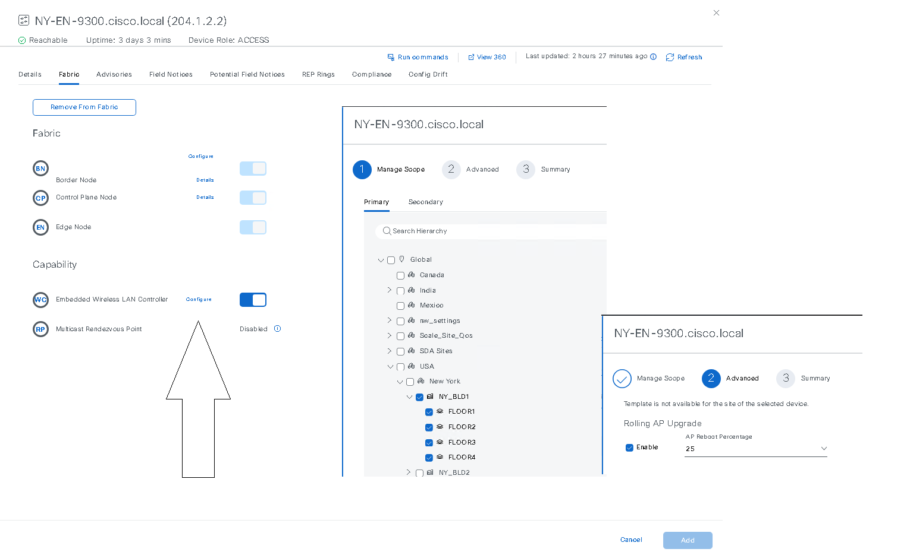

# Catalyst Center SDA Fabric Device Roles Playbook

### Fabric Devices

After you have created a fabric site, you can add devices to the fabric site. You can also specify whether the device should act as a control plane node, an edge node, a border node, or a wireless controller node.

You can add a new device to the fabric site only if IP Device Tracking (IPDT) is configured for the fabric site.

A device that is assigned the Access role and has been provisioned before enabling IPDT on the site can’t be added to the fabric. Reprovision such devices before adding them to the fabric site. Check the Provision workflow to confirm the status of Deployment of IPDT on the device.


Note:

> It’s optional to designate the devices in a fabric site as control plane nodes or border nodes. You might have devices that don’t occupy these roles. However, every fabric site must have at least one control plane node device and one border node device. In the current release for wired fabric, you can add up to six control plane nodes for redundancy.

Currently, the Cisco Wireless Controller communicates only with two control plane nodes.

**SDA Fabric Device Roles Playbook supports the following:**

- [x] Device Role Assignment: Assign and manage device roles (Control Plane Node, Edge Node, Border Node, Wireless Controller) within the SDA fabric.    ​

- [x] Border Configuration: Configure border settings for Layer 2 and Layer 3 handoffs, enabling seamless connectivity between SDA fabric and external networks.    ​

- [x] L2 Handoff: Establish Layer 2 connectivity by defining external and internal VLAN IDs for border devices.    ​

- [x] L3 Handoff: Configure SDA transit and IP transit settings for Layer 3 connectivity, including BGP peering, IP address allocation, and multicast routing.    ​

- [x] Advanced SDA Fabric Settings: Manage advanced configurations such as TCP MSS adjustment, route distribution protocols, and autonomous system numbers.

For more information, please refer to the following documentation: https://galaxy.ansible.com/ui/repo/published/cisco/dnac/content/module/sda_fabric_devices_workflow_manager/?version=6.24.0 

### Before you begin

Provision the device if you haven’t already provisioned it: 
The Provision > Network Devices > Inventory window displays the discovered devices.

The topology view shows a device in gray if it has passed the fabric readiness checks and is ready to be provisioned.

If an error is detected during any of the fabric readiness checks, an error notification is displayed on the topology area. Click See more details to check the problem area listed in the resulting window. Correct the problem and click Re-check to ensure that the problem is resolved.

If you update the device configuration as a part of problem resolution, ensure that you resynchronize the device information by performing an Inventory > Resync for the device.

### Add roles to the fabric devices using the playbook

##### Add Control Plane

From **Provision > Fabric Sites** in Catalyst Center, select the fabric site to add a device.
Next, click a device from the **List** view under the **Fabric Infrastructure** tab and edit Fabric Role under **More Actions**.



Add Control Plane Role for the device and select LISP Pub/Sub as a route distribution protocol in Catalyst Center UI.



##### Add Control Plane Role using Playbook

```bash
fabric_devices_details:
  - fabric_devices:
      fabric_name: Global/USA/SAN-FRANCISCO
      device_config:
        - device_ip: 204.1.2.6
          device_roles: [CONTROL_PLANE_NODE]
```

##### Enable Control Plane - Border Node - Edge Node on Catalyst Center using UI and playbook:



```bash
fabric_devices_details:
  - fabric_devices:
      fabric_name: Global/USA/SAN-FRANCISCO
      device_config:
        - device_ip: 204.1.2.6
          device_roles: [CONTROL_PLANE_NODE, BORDER_NODE, EDGE_NODE]
          borders_settings:
            layer3_settings:
              local_autonomous_system_number: 1234
              is_default_exit: true
              import_external_routes: true
              border_priority: 1
              prepend_autonomous_system_count: 1
```

##### Update Border Node and add L2 Handoff using Catalyst Center UI and playbook:



```bash
fabric_devices_details:
  - fabric_devices:
      fabric_name: Global/USA/SAN-FRANCISCO
      device_config:
        - device_ip: 204.1.2.6
          device_roles: [CONTROL_PLANE_NODE, BORDER_NODE]
          borders_settings:
            layer3_settings:
              local_autonomous_system_number: 1234
              is_default_exit: true
              import_external_routes: true
              border_priority: 2
              prepend_autonomous_system_count: 2
            layer2_handoff:
              - interface_name: GigabitEthernet0/0/1
                internal_vlan_id: 1036
                external_vlan_id: 550
```

##### Add Layer 3 Handoff with SDA Transit through Catalyst Center UI and playbook:



```bash
fabric_devices_details:
  - fabric_devices:
      fabric_name: Global/USA/SAN-FRANCISCO
      device_config:
        - device_ip: 204.1.2.6
          device_roles: [CONTROL_PLANE_NODE, BORDER_NODE, EDGE_NODE]
          borders_settings:
            layer3_handoff_sda_transit:
              transit_network_name: TRANSITSDA
              connected_to_internet: true
              is_multicast_over_transit_enabled: false
```

##### Add Layer 3 Handoff with IP Transit using Catalyst Center and sample playbook:



```bash
fabric_devices_details:
  - fabric_devices:
      fabric_name: Global/USA/SAN-FRANCISCO
      device_config:
        - device_ip: 204.1.2.6
          device_roles: [CONTROL_PLANE_NODE, BORDER_NODE, EDGE_NODE]
          borders_settings:
            layer3_handoff_ip_transit:
                - transit_network_name: iptransit
                  interface_name: GigabitEthernet0/0/1
                  external_connectivity_ip_pool_name: Reserved_sda_test_1
                  virtual_network_name: Fabric_VN
                  vlan_id: 440
                  tcp_mss_adjustment: 510
```

##### Enable device roles with support ECA device:
To enable the ECA device, it means we will add it as at least the device roles of Control Plane and Border Node (CP, BN) and also enable the role of Embedded Wireless LAN Controller (WC).

*Note: Typically, the Wireless LAN Controller (WC) role is only available on the Wireless Controller. To enable the WC role on a switch, we need to update the device with an image that includes the accompanying sub-packet. For example base image 'cat9k_iosxe.17.12.01.SPA.bin', sub-packet image 'C9800-SW-iosxe-wlc.17.12.01.SPA.bin'*


**Catalyst Center UI and playbook:**


```bash
fabric_devices_details:
  - fabric_devices:
      fabric_name: Global/USA/New York
      device_config:
      - device_ip: 204.1.2.2
        device_roles: [CONTROL_PLANE_NODE, EDGE_NODE, BORDER_NODE, WIRELESS_CONTROLLER_NODE]
        borders_settings:
          layer3_settings:
            local_autonomous_system_number: 6100
            is_default_exit: true
            import_external_routes: true 
            border_priority: 5
            prepend_autonomous_system_count: 5
        wireless_controller_settings:
          enable: true
          reload: true
          primary_managed_ap_locations:
            - Global/USA/New York/NY_BLD1
          secondary_managed_ap_locations:
            - Global/USA/New York/NY_BLD2
          rolling_ap_upgrade:
            enable: true
            ap_reboot_percentage: 25
```

### Execute the playbook

To ensure a successful execution of the playbooks with your specified inputs, follow these steps:

##### Input Validation:

Before executing the playbook, it is essential to validate the input schema. This step ensures that all required parameters are included and correctly formatted. Run the following command *./tools/validate.sh -s* to perform the validation providing the schema path -d and the input path.

```bash
  ./tools/validate.sh \
  -s workflows/sda_fabric_device_roles/schema/sda_fabric_device_roles_schema.yml \
  -d workflows/sda_fabric_device_roles/vars/sda_fabric_device_roles_input.yml
```

##### Running the Playbook:

Once the input validation is complete and no errors are found, you can run the playbook. Provide your input file path using the --e variable as VARS_FILE_PATH:

```bash

     ansible-playbook -i host_inventory_dnac1/hosts.yml workflows/sda_fabric_device_roles/playbook/sda_fabric_device_roles_playbook.yml --e VARS_FILE_PATH=/Users/majlona/dnac_ansible_workflows/workflows/sda_fabric_device_roles/vars/sda_fabric_device_roles_input.yml -vvv
```

If there is an error in the input or an issue with the API call during execution, the playbook will halt and display the relevant error details.

##### Post-Execution Verification:

After executing the playbook, check the Catalyst Center UI to verify SDA device roles. If *debug_log* is enabled, you can also review the logs for detailed information on operations performed and any updates made.


### Add roles to the fabric devices using Jinja Templates

##### Add roles to many devices concurrently

The following Jinja Template available in *workflows/sda_fabric_device_roles/jinja_template/sda_fabric_device_roles_jinja_template.j2* can be customized to assign roles to many devices simultaneously. 

```bash
---
catalyst_center_version: 2.3.7.6
fabric_devices_details:
  - fabric_devices:
      fabric_name: Global/USA
      device_config:

        - device_ip: "204.1.2.{{ ip }}"
          device_roles: [CONTROL_PLANE_NODE]



        - device_ip: "204.1.2.{{ ip }}"
          device_roles: [EDGE_NODE]



        - device_ip: "204.1.2.{{ ip }}"
          device_roles: [BORDER_NODE]
          borders_settings:
            layer3_settings:
              local_autonomous_system_number: 65001
              is_default_exit: true
              import_external_routes: true
              border_priority: 1
              prepend_autonomous_system_count: 2
            layer2_handoff:
              - interface_name: "GigabitEthernet0/0/2"
                internal_vlan_id: 101
                external_vlan_id: 201
              - interface_name: "GigabitEthernet0/0/3"
                internal_vlan_id: 102
                external_vlan_id: 202
            layer3_handoff_ip_transit:
              - transit_network_name: "iptransit201"
                interface_name: "GigabitEthernet0/0/4"
                external_connectivity_ip_pool_name: "Reserved_sda_test_201"
                virtual_network_name: "TransitVN201"
                vlan_id: 201
                tcp_mss_adjustment: 1460
              - transit_network_name: "iptransit202"
                interface_name: "GigabitEthernet0/0/5"
                external_connectivity_ip_pool_name: "Reserved_sda_test_202"
                virtual_network_name: "TransitVN202"
                vlan_id: 202
                tcp_mss_adjustment: 1420
            layer3_handoff_sda_transit:
              transit_network_name: "SDATransit"
              affinity_id_prime: 1
              affinity_id_decider: 2
              connected_to_internet: true
              is_multicast_over_transit_enabled: true


```
Use the input var file: workflows/sda_fabric_device_roles/vars/jinja_template_sda_fabric_device_roles.yml

##### Execute the Jinja Template

```bash
    ansible-playbook -i host_inventory_dnac1/hosts.yml workflows/sda_fabric_device_roles/playbook/sda_fabric_device_roles_playbook_jinja.yml --e VARS_FILE_PATH=workflows/sda_fabric_device_roles/vars/jinja_template_sda_fabric_device_roles.yml -vvv
```


### Delete SDA Fabric Device Roles

To remove a device from SDA Fabric, provide a similar input file as following: /workflows/sda_fabric_device_roles/vars/delete_sda_fabric_device_roles_input.yml.

```bash
fabric_devices_details:
  - fabric_devices:
      fabric_name: Global/USA/SAN-JOSE
      device_config:
      - device_ip: 10.0.0.1   
        
```

##### Execute the Playbook

```bash
    ansible-playbook -i host_inventory_dnac1/hosts.yml workflows/sda_fabric_device_roles/playbook/delete_sda_fabric_device_roles_playbook.yml --e VARS_FILE_PATH=w/Users/majlona/Desktop/dnac_ansible_workflows_vs_copilot/workflows/sda_fabric_device_roles/vars/delete_sda_fabric_device_roles_input.yml -vvv
```

#### Delete SDA Fabric Device Roles

To delete Layer 3 Handoff IP Transit and Layer 2 Handoff, provide a similar input file as: /workflows/sda_fabric_device_roles/vars/delete_sda_fabric_device_roles_input.yml.

```bash
fabric_devices_details:
  - fabric_devices:
      fabric_name: Global/USA/SAN-JOSE
      device_config:
      - device_ip: 10.0.0.1    
        borders_settings:
          layer3_handoff_ip_transit:
          - transit_network_name: IP_TRANSIT_1
            interface_name: FortyGigabitEthernet1/1/1
            virtual_network_name: L3VN1
        
          layer2_handoff:
          - interface_name: FortyGigabitEthernet1/1/1
            internal_vlan_id: 550
```

##### Execute the Playbook

```bash
    ansible-playbook -i host_inventory_dnac1/hosts.yml workflows/sda_fabric_device_roles/playbook/delete_sda_fabric_device_roles_playbook.yml --e VARS_FILE_PATH=w/Users/majlona/Desktop/dnac_ansible_workflows_vs_copilot/workflows/sda_fabric_device_roles/vars/delete_sda_fabric_device_roles_input.yml -vvv
```
