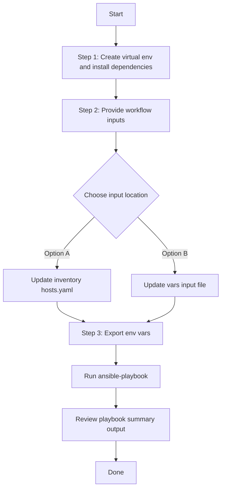

# SDA Fabric Devices Config Generator

## Table of Contents

- [User Flow (3 Steps)](#user-flow-3-steps)
- [Overview](#overview)
- [Features](#features)
- [Prerequisites](#prerequisites)
- [Workflow Structure](#workflow-structure)
- [Schema Parameters](#schema-parameters)
- [Getting Started](#getting-started)
- [Operations](#operations)
- [Examples](#examples)

## Overview

The SDA Fabric Devices config generator automates YAML playbook generation for existing SDA fabric devices in Cisco Catalyst Center. It generates output compatible with `sda_fabric_devices_workflow_manager` for brownfield export and migration of fabric device-role assignments and handoff-related configuration.

## Features

- **Configuration Generation**: Generate YAML configurations compatible with `sda_fabric_devices_workflow_manager`.
- **Component Filtering**: Selective export for `fabric_devices`.
- **Flexible Device Filters**: Filter by `fabric_name`, `device_ip`, and/or `device_roles`.
- **Multi-Fabric Selection**: Provide multiple `fabric_devices` entries in one run.
- **Flexible Output**: Supports custom `file_path` and `file_mode` (`overwrite` / `append`).
- **Brownfield Discovery**: Omit `component_specific_filters` to export all fabrics/devices.

## Prerequisites

### Software Requirements

| Component | Version |
|-----------|---------|
| Ansible | 2.13+ |
| cisco.dnac collection | 6.49.0+ |
| Python | 3.9+ |
| Cisco Catalyst Center | 2.3.7.6+ |
| dnacentersdk | 2.4.5+ |

### Required Collections

```bash
ansible-galaxy collection install cisco.dnac
ansible-galaxy collection install ansible.utils
pip install dnacentersdk
pip install yamale
```

### Access Requirements

- Catalyst Center credentials with SDA fabric API access
- Network connectivity to Catalyst Center
- Existing SDA fabric devices (for targeted export use cases)

## Workflow Structure

```text
sda_fabric_devices_config_generator/
├── playbook/
│   └── sda_fabric_devices_config_generator.yml
├── vars/
│   └── sda_fabric_devices_config_inputs.yml
├── schema/
│   └── sda_fabric_devices_config_schema.yml
└── README.md
```

## Schema Parameters

### Basic Configuration

| Parameter | Type | Required | Default | Description |
|-----------|------|----------|---------|-------------|
| `file_path` | string | No | auto-generated | Output file path for generated YAML |
| `file_mode` | string | No | `overwrite` | File write mode: `overwrite` or `append` |
| `component_specific_filters` | dict | No | omitted | Component filters passed to module `config` |

### Component Filters

| Parameter | Type | Required | Description |
|-----------|------|----------|-------------|
| `components_list` | list[string] | No | Supported value: `fabric_devices` |
| `fabric_devices` | list[dict] | No | Fabric device filter entries (OR across entries) |

### Fabric Devices Entry Fields

| Parameter | Type | Required | Description |
|-----------|------|----------|-------------|
| `fabric_name` | string | Yes | Fabric hierarchy name for this entry |
| `device_ip` | string | No | Specific device management IP in selected fabric |
| `device_roles` | list[string] | No | Device role filter list |

`device_roles` supported values:
- `CONTROL_PLANE_NODE`
- `EDGE_NODE`
- `BORDER_NODE`
- `WIRELESS_CONTROLLER_NODE`
- `EXTENDED_NODE`

### Filter Logic

- `fabric_devices` list entries are combined with **OR** logic.
- Inside each `fabric_devices` entry, specified fields are combined with **AND** logic.

## Getting Started

## Workflow Steps
## User Flow (3 Steps)



### Installation and Run (Aligned)

1. Create and activate a Python virtual environment, then install dependencies.

```bash
python3 -m venv .venv
source .venv/bin/activate
pip install -r requirements.txt
ansible-galaxy collection install cisco.dnac --force
```

2. Provide workflow inputs in either inventory (`inventory/demo_lab/hosts.yaml`) or the workflow `vars/` file.

3. Export Catalyst Center environment variables and run the playbook.

```bash
export HOSTIP=<catalyst-center-ip-or-fqdn>
export CATALYST_CENTER_USERNAME=<username>
export CATALYST_CENTER_PASSWORD='<password>'
ansible-playbook -i ./inventory/demo_lab/hosts.yaml ./workflows/sda_fabric_devices_config_generator/playbook/sda_fabric_devices_config_generator.yml -vvvv
```

## Operations

### Generate Operations (state: gathered)

1. **Generate all fabric devices**
- Omit `component_specific_filters`.

2. **Generate all devices in one fabric**
- Set one `fabric_devices` entry with `fabric_name`.

3. **Generate specific device in one fabric**
- Set one `fabric_devices` entry with `fabric_name` and `device_ip`.

4. **Generate by device roles**
- Set one or more `fabric_devices` entries with `fabric_name` and `device_roles`.

5. **Generate from multiple fabrics in one run**
- Add multiple `fabric_devices` entries under the same request.

## Examples

### Example 1: Generate all SDA fabric devices

```yaml
sda_fabric_devices_config:
  - file_path: "/tmp/sda_fabric_devices_complete_config.yml"
```

### Example 2: Generate all devices for one fabric site

```yaml
sda_fabric_devices_config:
  - file_path: "/tmp/sda_fabric_devices_by_fabric.yml"
    component_specific_filters:
      components_list: ["fabric_devices"]
      fabric_devices:
        - fabric_name: "Global/USA/SAN JOSE"
```

### Example 3: Generate one specific device

```yaml
sda_fabric_devices_config:
  - file_path: "/tmp/sda_fabric_device_by_ip.yml"
    component_specific_filters:
      components_list: ["fabric_devices"]
      fabric_devices:
        - fabric_name: "Global/USA/SAN JOSE"
          device_ip: "10.10.10.21"
```

### Example 4: Generate by roles from multiple fabrics

```yaml
sda_fabric_devices_config:
  - file_path: "/tmp/sda_fabric_devices_multi_fabric.yml"
    component_specific_filters:
      components_list: ["fabric_devices"]
      fabric_devices:
        - fabric_name: "Global/USA/SAN JOSE"
          device_roles: ["BORDER_NODE", "CONTROL_PLANE_NODE"]
        - fabric_name: "Global/India/Bangalore"
          device_roles: ["EDGE_NODE"]
```

### Validate and Execute

```bash
# Validate
./tools/validate.sh -s workflows/sda_fabric_devices_config_generator/schema/sda_fabric_devices_config_schema.yml \
                   -d workflows/sda_fabric_devices_config_generator/vars/sda_fabric_devices_config_inputs.yml
```

```bash
# Execute
ansible-playbook -i inventory/demo_lab/hosts.yaml \
  workflows/sda_fabric_devices_config_generator/playbook/sda_fabric_devices_config_generator.yml \
  --extra-vars VARS_FILE_PATH=./workflows/sda_fabric_devices_config_generator/vars/sda_fabric_devices_config_inputs.yml
```

## Notes

- `sda_fabric_devices_playbook_config_generator` expects `config` as a dictionary when filters are used.
- This workflow omits `config` when filters are absent.
- If `fabric_devices` is provided without `components_list`, the module auto-populates `components_list` internally.

## Validate and Execute

```bash
# Validate
./tools/validate.sh -s workflows/sda_fabric_devices_config_generator/schema/sda_fabric_devices_config_schema.yml \
                   -d workflows/sda_fabric_devices_config_generator/vars/sda_fabric_devices_config_inputs.yml
```

```bash
# Execute
ansible-playbook -i inventory/demo_lab/hosts.yaml \
  workflows/sda_fabric_devices_config_generator/playbook/sda_fabric_devices_config_generator.yml \
  --extra-vars VARS_FILE_PATH=workflows/sda_fabric_devices_config_generator/vars/sda_fabric_devices_config_inputs.yml
```
