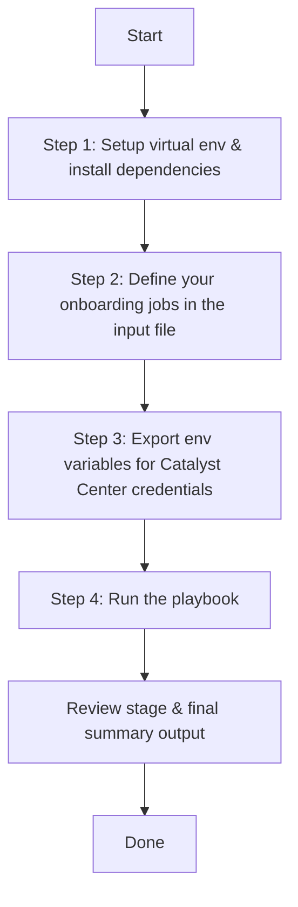
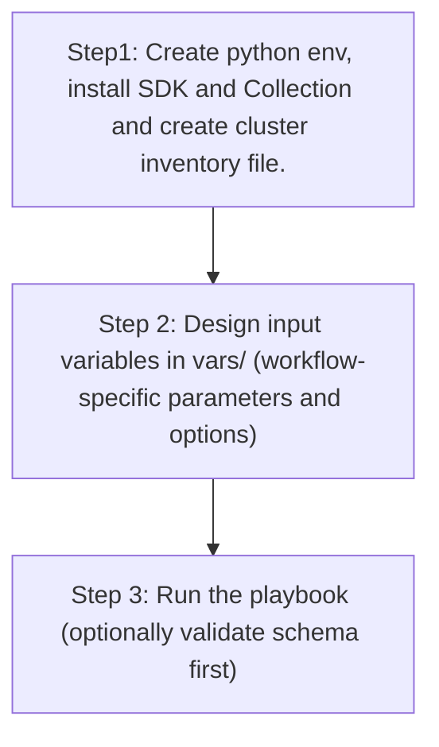

# SDA Fabric Discover and Onboard Fabric Devices

Automates end-to-end onboarding of devices into an SDA fabric through 6 sequential stages:

| Stage | What It Does | Ansible Module |
|-------|-------------|----------------|
| 1 | Discover devices using discovery tool | `cisco.dnac.discovery_workflow_manager` |
| 2 | LAN automate & discover devices into inventory | `cisco.dnac.lan_automation_workflow_manager` |
| 3 | Fix device roles in inventory | `cisco.dnac.inventory_workflow_manager` |
| 4 | Provision devices to sites | `cisco.dnac.provision_workflow_manager` |
| 5 | Add devices to SDA fabric | `cisco.dnac.sda_fabric_devices_workflow_manager` |
| 6 | Configure host port onboarding | `cisco.dnac.sda_host_port_onboarding_workflow_manager` |

> **Note:** Stages 1 (Discovery) and 2 (LAN Automation) are both optional device discovery methods. You can use either one, both, or neither depending on your needs.

## User Flow



## Step 1: Setup Environment

From the repository root:

```bash
python3 -m venv .venv
source .venv/bin/activate
pip install --upgrade pip setuptools wheel
pip install -r requirements.txt
ansible-galaxy collection install cisco.dnac --force
```

## Step 2: Define Your Onboarding Jobs

Edit the input file:
- `vars/sda_fabric_discover_and_onboard_fabric_devices_input.yml`

Each job can include any combination of the 6 stages — only include the stages you need. Stages 1 (Discovery) and 2 (LAN Automation) are alternative device discovery methods; you can use either, both, or neither.

### Combined Data Model

Top-level structure:

```yaml
sda_fabric_discover_and_onboard_fabric_devices:
  jobs:
    - job_name: "my_job"          # optional
      discovery: [...]            # optional — Stage 1 entries (discovery tool)
      lan_automation: [...]       # optional — Stage 2 entries (LAN automation)
      inventory_roles: [...]      # optional — Stage 3 entries
      provision: [...]            # optional — Stage 4 entries
      fabric_devices: [...]       # optional — Stage 5 entries
      host_port_onboarding: [...] # optional — Stage 6 entries
```

Each stage entry has a `config` dict (required) and an optional `state` (`merged` or `deleted`, default `merged`).

---

### Stage 1: Device Discovery

Discovers devices using the Catalyst Center discovery tool. Supports multiple discovery methods: SINGLE, RANGE, MULTI RANGE, CDP, LLDP, and CIDR.

| Field | Type | Required | Description |
|-------|------|----------|-------------|
| `config.discovery_name` | string | Yes | Name for this discovery job |
| `config.discovery_type` | enum | Yes | `SINGLE`, `RANGE`, `MULTI RANGE`, `CDP`, `LLDP`, `CIDR` |
| `config.ip_address_list` | list[string] | Yes | IP addresses to discover (format depends on `discovery_type`) |
| `config.ip_filter_list` | list[string] | No | IP addresses to exclude from discovery |
| `config.protocol_order` | enum | No | `ssh` (default) or `telnet` |
| `config.devices_list` | list[string] | No | Specific devices to discover |
| `config.discovery_specific_credentials` | dict | No | Inline credentials (CLI, HTTP, SNMP) for this discovery |
| `config.global_credentials` | dict | No | References to pre-configured global credentials in Catalyst Center |
| `config.preferred_mgmt_ip_method` | string | No | `None` or `UseLoopBack` |
| `config.retry` | int | No | Number of connection retry attempts |
| `config.timeout` | int | No | Timeout in seconds for device response |
| `config.use_global_credentials` | bool | No | Use pre-configured global credentials (default `true`) |
| `config.lldp_level` | int | No | Number of LLDP discovery levels (default 16) |
| `config.net_conf_port` | string | No | NETCONF port number |
| `config.enable_password_list` | list[string] | No | Enable passwords for discovered devices |

---

### Stage 2: LAN Automation

| Field | Type | Required | Description |
|-------|------|----------|-------------|
| `config.lan_automation.discovered_device_site_name_hierarchy` | string | Yes | Site where discovered devices will be placed |
| `config.lan_automation.primary_device_management_ip_address` | string | Yes | Seed device management IP |
| `config.lan_automation.peer_device_management_ip_address` | string | No | Peer device IP for redundancy |
| `config.lan_automation.primary_device_interface_names` | list[string] | Yes | Interfaces on seed device for LAN automation |
| `config.lan_automation.ip_pools` | list | Yes | IP pools (`ip_pool_name`, `ip_pool_role`: `MAIN_POOL` / `PHYSICAL_LINK_POOL`) |
| `config.lan_automation.multicast_enabled` | bool | No | Enable multicast routing |
| `config.lan_automation.redistribute_isis_to_bgp` | bool | No | Redistribute IS-IS to BGP |
| `config.lan_automation.host_name_prefix` | string | No | Prefix for auto-generated hostnames |
| `config.lan_automation.isis_domain_pwd` | string | No | IS-IS domain password |
| `config.lan_automation.discovery_level` | int (1–5) | No | Depth of discovery below seed device |
| `config.lan_automation.discovery_timeout` | int | No | Discovery timeout in minutes |
| `config.lan_automation.discovery_devices` | list | No | Specific devices to discover (`device_serial_number`, `device_host_name`, `device_site_name_hierarchy`, `device_management_ip_address`) |
| `config.lan_automation.launch_and_wait` | bool | No | Wait for session to complete |
| `config.lan_automation.pnp_authorization` | bool | No | Enable PnP authorization |
| `config.lan_automation.device_serial_number_authorization` | list[string] | No | Serial numbers to authorize |

---

### Stage 3: Inventory Role Updates

| Field | Type | Required | Description |
|-------|------|----------|-------------|
| `config.management_ip_address` | string | Yes* | Device management IP |
| `config.ip_address_list` | list[string] | Yes* | List of device IPs (alternative to `management_ip_address`) |
| `config.role` | enum | No | `ACCESS`, `CORE`, `DISTRIBUTION`, `BORDER_ROUTER`, `UNKNOWN` |

\* Provide either `management_ip_address` or `ip_address_list` to identify the device(s).

---

### Stage 4: Provision Devices to Sites

| Field | Type | Required | Description |
|-------|------|----------|-------------|
| `config.management_ip_address` | string | Yes | Device management IP |
| `config.site_name_hierarchy` | string | Yes | Target site (e.g. `Global/California/23`) |
| `config.provisioning` | bool | No | `false` = site assignment only, `true` = full provision |
| `config.force_provisioning` | bool | No | Force re-provision |
| `config.managed_ap_locations` | list[string] | No | AP site locations (wireless devices) |
| `config.primary_managed_ap_locations` | list[string] | No | Primary AP locations (v2.3.7.6+) |
| `config.secondary_managed_ap_locations` | list[string] | No | Secondary AP locations |
| `config.dynamic_interfaces` | list | No | Dynamic interfaces (`interface_name`, `vlan_id`, `interface_ip_address`, `interface_gateway`, `interface_netmask_in_c_i_d_r`) |
| `config.skip_ap_provision` | bool | No | Skip AP provisioning |
| `config.ap_authorization_list_name` | string | No | AP authorization list name |
| `config.rolling_ap_upgrade` | dict | No | `enable_rolling_ap_upgrade`, `ap_reboot_percentage` |

---

### Stage 5: Add Devices to SDA Fabric

| Field | Type | Required | Description |
|-------|------|----------|-------------|
| `config.fabric_devices.fabric_name` | string | Yes | Fabric site name |
| `config.fabric_devices.device_config[].device_ip` | string | Yes | Device IP |
| `config.fabric_devices.device_config[].device_roles` | list[enum] | Yes (add) | `CONTROL_PLANE_NODE`, `EDGE_NODE`, `BORDER_NODE`, `WIRELESS_CONTROLLER_NODE` |
| `config.fabric_devices.device_config[].delete_fabric_device` | bool | No | `true` to remove device (state=deleted) |
| `config.fabric_devices.device_config[].borders_settings.layer3_settings` | dict | No | `local_autonomous_system_number` (required), `is_default_exit`, `import_external_routes`, `border_priority` (1–9), `prepend_autonomous_system_count` (0–10) |
| `config.fabric_devices.device_config[].borders_settings.layer2_handoff` | list | No | `interface_name`, `internal_vlan_id`, `external_vlan_id` |
| `config.fabric_devices.device_config[].borders_settings.layer3_handoff_ip_transit` | list | No | `transit_network_name`, `interface_name`, `external_connectivity_ip_pool_name`, `virtual_network_name`, `vlan_id`, `tcp_mss_adjustment` |
| `config.fabric_devices.device_config[].borders_settings.layer3_handoff_sda_transit` | dict | No | `transit_network_name`, `affinity_id_prime`, `affinity_id_decider`, `connected_to_internet`, `is_multicast_over_transit_enabled` |

---

### Stage 6: Host Port Onboarding

| Field | Type | Required | Description |
|-------|------|----------|-------------|
| `config.ip_address` | string | Yes* | Device management IP |
| `config.hostname` | string | Yes* | Device hostname (alternative to `ip_address`) |
| `config.fabric_site_name_hierarchy` | string | Yes | Fabric site name |
| `config.port_assignments` | list | No | See port assignment fields below |
| `config.port_channels` | list | No | See port channel fields below |
| `config.wireless_ssids` | list | No | See wireless SSID fields below |

\* Provide either `ip_address` or `hostname` to identify the device.

**Port assignment fields:** `interface_name` (required), `connected_device_type` (`USER_DEVICE`/`ACCESS_POINT`/`TRUNKING_DEVICE`, required), `data_vlan_name`, `voice_vlan_name`, `security_group_name`, `authentication_template_name`, `interface_description`

**Port channel fields:** `interface_names` (list, required), `connected_device_type` (`TRUNK`/`EXTENDED_NODE`, required), `protocol` (`ON`/`LACP`/`PAGP`), `port_channel_description`, `port_channel_name`

**Wireless SSID fields:** `vlan_name` (required), `ssid_details` → `ssid_name` (required), `security_group_name`

---

### When to Use Discovery vs LAN Automation

| Use Case | Stage 1 (Discovery) | Stage 2 (LAN Automation) | Description |
|----------|:-------------------:|:------------------------:|-------------|
| Pre-existing devices with known IPs | ✅ | — | Devices are already cabled and have management IPs. Use the discovery tool to scan IP ranges, CDP/LLDP neighbors, or CIDR subnets to add them to inventory. |
| Greenfield deployment with PnP | — | ✅ | New devices boot via PnP. LAN Automation assigns underlay IPs, hostnames, and discovers devices through seed device interfaces. |
| Seed device discovery + greenfield | ✅ | ✅ | First discover the seed/border devices by IP range, then use LAN Automation from those seeds to bring up the rest of the fabric. |
| Devices already in inventory | — | — | Skip both stages. Start directly from Stage 3 (inventory roles) or later. |

---

### Example 1: Discovery-Based Onboarding (Stages 1, 3–6)

Use this when devices are already cabled and reachable via known IP addresses. The discovery tool scans the network, adds devices to Catalyst Center inventory, then the remaining stages provision and onboard them into the SDA fabric.

```yaml
sda_fabric_discover_and_onboard_fabric_devices:
  jobs:
    - job_name: "sanjose_bld23_discovery_onboarding"

      # Stage 1: Discover seed and edge devices by IP range
      discovery:
        - config:
            discovery_name: "BLD23_Seed_Discovery"
            discovery_type: "MULTI RANGE"
            ip_address_list:
              - "204.1.1.5-204.1.1.6"
              - "204.1.1.10-204.1.1.16"
            protocol_order: "ssh"
            timeout: 30
            retry: 2
            global_credentials:
              cli_credentials_list:
                - description: "switch_cli"
                  username: "admin"
              snmp_v3_credential_list:
                - description: "SNMPv3-credentials"
                  username: "admin"
              http_read_credential_list:
                - description: "http_read"
                  username: "admin"
              http_write_credential_list:
                - description: "httpwrite"
                  username: "admin"

        # Discover a WLC separately using CDP from a known seed IP
        - config:
            discovery_name: "BLD23_CDP_WLC_Discovery"
            discovery_type: "CDP"
            ip_address_list:
              - "204.1.1.20"
            protocol_order: "ssh"
            discovery_specific_credentials:
              cli_credentials_list:
                - username: "wlcadmin"
                  password: "Cisco#123"
                  enable_password: "Cisco#123"
              snmp_v3_credential:
                description: "snmpv3_wlc"
                username: "wlcadmin"
                snmp_mode: "AUTHPRIV"
                auth_password: "Cisco#123"
                auth_type: "SHA"
                privacy_type: "AES128"
                privacy_password: "Cisco#123"
              net_conf_port: "830"
            retry: 2

      # Stage 3: Fix device roles after discovery
      inventory_roles:
        - config:
            ip_address_list:
              - "204.1.1.5"
              - "204.1.1.6"
            role: "BORDER_ROUTER"
        - config:
            ip_address_list:
              - "204.1.1.10"
              - "204.1.1.11"
              - "204.1.1.12"
              - "204.1.1.13"
              - "204.1.1.14"
              - "204.1.1.15"
              - "204.1.1.16"
            role: "ACCESS"

      # Stage 4: Provision discovered devices to sites
      provision:
        - config:
            management_ip_address: "204.1.1.5"
            site_name_hierarchy: "Global/USA/SAN JOSE/BLD23"
        - config:
            management_ip_address: "204.1.1.6"
            site_name_hierarchy: "Global/USA/SAN JOSE/BLD20"
        - config:
            management_ip_address: "204.1.1.10"
            site_name_hierarchy: "Global/USA/SAN JOSE/BLD23"
        - config:
            management_ip_address: "204.1.1.11"
            site_name_hierarchy: "Global/USA/SAN JOSE/BLD20"
        - config:
            management_ip_address: "204.1.1.13"
            site_name_hierarchy: "Global/USA/SAN JOSE/BLD20/BLD20_FLOOR1"
        - config:
            management_ip_address: "204.1.1.15"
            site_name_hierarchy: "Global/USA/SAN JOSE/BLD23/FLOOR1_LEVEL1"

      # Stage 5: Add devices to SDA fabric
      fabric_devices:
        - config:
            fabric_devices:
              fabric_name: "Global/USA/SAN JOSE"
              device_config:
                - device_ip: "204.1.1.5"
                  device_roles: ["BORDER_NODE", "CONTROL_PLANE_NODE"]
                  borders_settings:
                    layer3_settings:
                      local_autonomous_system_number: 65001
                      is_default_exit: true
                      import_external_routes: true
                      border_priority: 1
                    layer3_handoff_ip_transit:
                      - transit_network_name: "IP_TRANSIT_1"
                        interface_name: "GigabitEthernet0/0/1"
                        external_connectivity_ip_pool_name: "BORDER_POOL"
                        virtual_network_name: "EMPLOYEE_VN"
                        vlan_id: 400
                - device_ip: "204.1.1.6"
                  device_roles: ["BORDER_NODE", "CONTROL_PLANE_NODE"]
                  borders_settings:
                    layer3_settings:
                      local_autonomous_system_number: 65001
                      is_default_exit: false
                      border_priority: 2
                - device_ip: "204.1.1.10"
                  device_roles: ["EDGE_NODE"]
                - device_ip: "204.1.1.11"
                  device_roles: ["EDGE_NODE"]
                - device_ip: "204.1.1.15"
                  device_roles: ["EDGE_NODE"]

      # Stage 6: Configure host-facing ports on edge switches
      host_port_onboarding:
        - config:
            ip_address: "204.1.1.10"
            fabric_site_name_hierarchy: "Global/USA/SAN JOSE/BLD23"
            port_assignments:
              - interface_name: "GigabitEthernet1/0/10"
                connected_device_type: "USER_DEVICE"
                data_vlan_name: "EMPLOYEEPOOL_Employee_VN"
                voice_vlan_name: "VOICEPOOL_Employee_VN"
              - interface_name: "GigabitEthernet1/0/11"
                connected_device_type: "ACCESS_POINT"
                data_vlan_name: "APPOOL_INFRA_VN"
        - config:
            ip_address: "204.1.1.15"
            fabric_site_name_hierarchy: "Global/USA/SAN JOSE/BLD23/FLOOR1_LEVEL1"
            port_assignments:
              - interface_name: "GigabitEthernet1/0/5"
                connected_device_type: "USER_DEVICE"
                data_vlan_name: "EMPLOYEEPOOL_Employee_VN"
            wireless_ssids:
              - vlan_name: "EMPLOYEEPOOL_Employee_VN"
                ssid_details:
                  - ssid_name: "Corporate-WiFi"
                    security_group_name: "Employees"
```

---

### Example 2: LAN Automation-Based Onboarding (Stages 2–6)

Use this for greenfield deployments where new devices boot through Plug and Play (PnP). LAN Automation handles underlay IP assignment, hostname assignment, and device discovery through the seed device's interfaces.

```yaml
sda_fabric_discover_and_onboard_fabric_devices:
  jobs:
    - job_name: "sanjose_bld23_lan_auto_onboarding"

      # Stage 2: LAN Automation — discover devices through seed switches
      lan_automation:
        - config:
            lan_automation:
              discovered_device_site_name_hierarchy: "Global/USA/SAN JOSE"
              primary_device_management_ip_address: "204.1.1.6"
              peer_device_management_ip_address: "204.1.1.5"
              primary_device_interface_names:
                - "HundredGigE1/0/2"
                - "HundredGigE1/0/29"
                - "HundredGigE1/0/31"
                - "HundredGigE1/0/33"
                - "HundredGigE1/0/35"
              ip_pools:
                - ip_pool_name: "underlay_sub"
                  ip_pool_role: "MAIN_POOL"
                - ip_pool_name: "underlay_sub_small"
                  ip_pool_role: "PHYSICAL_LINK_POOL"
              multicast_enabled: true
              redistribute_isis_to_bgp: true
              isis_domain_pwd: "cisco"
              discovery_level: 5
              discovery_timeout: 40
              discovery_devices:
                - device_serial_number: "FJC27172JDX"
                  device_host_name: "SR-LAN-9300-IM1"
                  device_site_name_hierarchy: "Global/USA/SAN JOSE/BLD23"
                  device_management_ip_address: "204.1.1.10"
                - device_serial_number: "FJC2721261G"
                  device_host_name: "SR-LAN-9300-IM2"
                  device_site_name_hierarchy: "Global/USA/SAN JOSE/BLD20"
                  device_management_ip_address: "204.1.1.11"
                - device_serial_number: "FCW2152L02V"
                  device_host_name: "SR-LAN-9300-TRANSIT"
                  device_site_name_hierarchy: "Global/USA/SAN JOSE/BLD23"
                  device_management_ip_address: "204.1.1.12"
                - device_serial_number: "FXS2429Q0WE"
                  device_host_name: "SR-LAN-9400X-EDGE1"
                  device_site_name_hierarchy: "Global/USA/SAN JOSE/BLD20/BLD20_FLOOR1"
                  device_management_ip_address: "204.1.1.13"
                - device_serial_number: "FOC2722YGWW"
                  device_host_name: "SR-LAN-9300X-EDGE2"
                  device_site_name_hierarchy: "Global/USA/SAN JOSE/BLD20/BLD20_FLOOR1"
                  device_management_ip_address: "204.1.1.14"
                - device_serial_number: "FCW2213G01S"
                  device_host_name: "SR-LAN-9300-EDGE3"
                  device_site_name_hierarchy: "Global/USA/SAN JOSE/BLD23/FLOOR1_LEVEL1"
                  device_management_ip_address: "204.1.1.15"

      # Stage 3: Update roles — LAN Automation may assign default roles
      inventory_roles:
        - config:
            ip_address_list:
              - "204.1.1.10"
              - "204.1.1.11"
              - "204.1.1.12"
              - "204.1.1.13"
              - "204.1.1.14"
              - "204.1.1.15"
            role: "ACCESS"

      # Stage 4: Provision devices to sites
      provision:
        - config:
            management_ip_address: "204.1.1.10"
            site_name_hierarchy: "Global/USA/SAN JOSE/BLD23"
        - config:
            management_ip_address: "204.1.1.11"
            site_name_hierarchy: "Global/USA/SAN JOSE/BLD20"
        - config:
            management_ip_address: "204.1.1.12"
            site_name_hierarchy: "Global/USA/SAN JOSE/BLD23"
        - config:
            management_ip_address: "204.1.1.13"
            site_name_hierarchy: "Global/USA/SAN JOSE/BLD20/BLD20_FLOOR1"
        - config:
            management_ip_address: "204.1.1.14"
            site_name_hierarchy: "Global/USA/SAN JOSE/BLD20/BLD20_FLOOR1"
        - config:
            management_ip_address: "204.1.1.15"
            site_name_hierarchy: "Global/USA/SAN JOSE/BLD23/FLOOR1_LEVEL1"

      # Stage 5: Add devices into fabric as edge nodes
      fabric_devices:
        - config:
            fabric_devices:
              fabric_name: "Global/USA/SAN JOSE"
              device_config:
                - device_ip: "204.1.1.10"
                  device_roles: ["EDGE_NODE"]
                - device_ip: "204.1.1.11"
                  device_roles: ["EDGE_NODE"]
                - device_ip: "204.1.1.12"
                  device_roles: ["EDGE_NODE"]
                - device_ip: "204.1.1.13"
                  device_roles: ["EDGE_NODE"]
                - device_ip: "204.1.1.14"
                  device_roles: ["EDGE_NODE"]
                - device_ip: "204.1.1.15"
                  device_roles: ["EDGE_NODE"]

      # Stage 6: Onboard host ports on edge switches
      host_port_onboarding:
        - config:
            ip_address: "204.1.1.13"
            fabric_site_name_hierarchy: "Global/USA/SAN JOSE/BLD20/BLD20_FLOOR1"
            port_assignments:
              - interface_name: "GigabitEthernet1/0/1"
                connected_device_type: "USER_DEVICE"
                data_vlan_name: "EMPLOYEEPOOL_Employee_VN"
                voice_vlan_name: "VOICEPOOL_Employee_VN"
              - interface_name: "GigabitEthernet1/0/2"
                connected_device_type: "ACCESS_POINT"
                data_vlan_name: "APPOOL_INFRA_VN"
            port_channels:
              - interface_names:
                  - "GigabitEthernet1/0/23"
                  - "GigabitEthernet1/0/24"
                connected_device_type: "TRUNK"
                protocol: "LACP"
```

---

### Example 3: Combined Discovery + LAN Automation (All 6 Stages)

Use this when you need to first discover seed/border devices by IP (they are already online), then use LAN Automation from those seeds to bring up additional greenfield devices.

```yaml
sda_fabric_discover_and_onboard_fabric_devices:
  jobs:
    - job_name: "sanjose_combined_onboarding"

      # Stage 1: Discover seed/border devices that are already online
      discovery:
        - config:
            discovery_name: "Seed_Border_Discovery"
            discovery_type: "MULTI RANGE"
            ip_address_list:
              - "91.1.1.2-91.1.1.2"
              - "91.1.1.6-91.1.1.6"
            protocol_order: "ssh"
            timeout: 30
            retry: 2
            global_credentials:
              cli_credentials_list:
                - description: "switch_cli"
                  username: "admin"
              snmp_v3_credential_list:
                - description: "SNMPv3-credentials"
                  username: "admin"
              http_read_credential_list:
                - description: "http_read"
                  username: "admin"
              http_write_credential_list:
                - description: "httpwrite"
                  username: "admin"
            enable_password_list:
              - "Cisco#123"

      # Stage 2: LAN Automation — use discovered seeds to bring up greenfield devices
      lan_automation:
        - config:
            lan_automation:
              discovered_device_site_name_hierarchy: "Global/USA/SAN JOSE"
              primary_device_management_ip_address: "91.1.1.6"
              peer_device_management_ip_address: "91.1.1.2"
              primary_device_interface_names:
                - "HundredGigE1/0/2"
                - "HundredGigE1/0/29"
                - "HundredGigE1/0/35"
              ip_pools:
                - ip_pool_name: "underlay_sub"
                  ip_pool_role: "MAIN_POOL"
                - ip_pool_name: "underlay_sub_small"
                  ip_pool_role: "PHYSICAL_LINK_POOL"
              multicast_enabled: true
              redistribute_isis_to_bgp: true
              isis_domain_pwd: "cisco"
              discovery_level: 3
              discovery_timeout: 40
              discovery_devices:
                - device_serial_number: "FJC27172JDX"
                  device_host_name: "SR-LAN-9300-IM1"
                  device_site_name_hierarchy: "Global/USA/SAN JOSE/BLD23"
                  device_management_ip_address: "204.1.1.10"
                - device_serial_number: "FJC2721261G"
                  device_host_name: "SR-LAN-9300-IM2"
                  device_site_name_hierarchy: "Global/USA/SAN JOSE/BLD20"
                  device_management_ip_address: "204.1.1.11"

      # Stage 3: Fix roles for all devices (seeds become border routers)
      inventory_roles:
        - config:
            ip_address_list:
              - "204.1.1.5"
              - "204.1.1.6"
            role: "BORDER_ROUTER"
        - config:
            ip_address_list:
              - "204.1.1.10"
              - "204.1.1.11"
            role: "ACCESS"

      # Stage 4: Provision to sites
      provision:
        - config:
            management_ip_address: "204.1.1.5"
            site_name_hierarchy: "Global/USA/SAN JOSE/BLD23"
        - config:
            management_ip_address: "204.1.1.6"
            site_name_hierarchy: "Global/USA/SAN JOSE/BLD20"
        - config:
            management_ip_address: "204.1.1.10"
            site_name_hierarchy: "Global/USA/SAN JOSE/BLD23"
        - config:
            management_ip_address: "204.1.1.11"
            site_name_hierarchy: "Global/USA/SAN JOSE/BLD20"

      # Stage 5: Add to SDA fabric with roles and border settings
      fabric_devices:
        - config:
            fabric_devices:
              fabric_name: "Global/USA/SAN JOSE"
              device_config:
                - device_ip: "204.1.1.5"
                  device_roles: ["BORDER_NODE", "CONTROL_PLANE_NODE"]
                  borders_settings:
                    layer3_settings:
                      local_autonomous_system_number: 65001
                      is_default_exit: true
                      import_external_routes: true
                - device_ip: "204.1.1.6"
                  device_roles: ["BORDER_NODE", "CONTROL_PLANE_NODE"]
                  borders_settings:
                    layer3_settings:
                      local_autonomous_system_number: 65001
                      is_default_exit: false
                - device_ip: "204.1.1.10"
                  device_roles: ["EDGE_NODE"]
                - device_ip: "204.1.1.11"
                  device_roles: ["EDGE_NODE"]

      # Stage 6: Configure host-facing ports
      host_port_onboarding:
        - config:
            ip_address: "204.1.1.10"
            fabric_site_name_hierarchy: "Global/USA/SAN JOSE/BLD23"
            port_assignments:
              - interface_name: "GigabitEthernet1/0/10"
                connected_device_type: "USER_DEVICE"
                data_vlan_name: "EMPLOYEEPOOL_Employee_VN"
              - interface_name: "GigabitEthernet1/0/11"
                connected_device_type: "ACCESS_POINT"
                data_vlan_name: "APPOOL_INFRA_VN"
```

## Step 3: Export Credentials

```bash
export HOSTIP=<catalyst_center_ip>
export CATALYST_CENTER_USERNAME=admin
export CATALYST_CENTER_PASSWORD='your_password'
```

## Step 4: Run the Playbook

The playbook supports two input methods:

### Option A: Vars file input (recommended for version-controlled configs)

Pass the input vars file via `VARS_FILE_PATH`:

```bash
ansible-playbook -i ./inventory/demo_lab/hosts.yaml \
  ./workflows/sda_fabric_discover_and_onboard_fabric_devices/playbook/sda_fabric_discover_and_onboard_fabric_devices_playbook.yml \
  --extra-vars VARS_FILE_PATH=./workflows/sda_fabric_discover_and_onboard_fabric_devices/vars/sda_fabric_discover_and_onboard_fabric_devices_input.yml \
  -vvvv
```

### Option B: Inventory file input

Omit `VARS_FILE_PATH` and define the workflow variables directly as host variables in the inventory file. This is useful when you want to keep all configuration (credentials + workflow data) in a single inventory file or when using `host_vars`/`group_vars` directories.

**Example inventory file (`inventory/demo_lab/hosts.yaml`):**

```yaml
---
catalyst_center_hosts:
  hosts:
    catalyst_center220:
      catalyst_center_host: "{{ lookup('ansible.builtin.env', 'HOSTIP') }}"
      catalyst_center_password: "{{ lookup('ansible.builtin.env', 'CATALYST_CENTER_PASSWORD') }}"
      catalyst_center_port: 443
      catalyst_center_timeout: 60
      catalyst_center_username: "{{ lookup('ansible.builtin.env', 'CATALYST_CENTER_USERNAME') }}"
      catalyst_center_verify: false
      catalyst_center_version: 2.3.7.9
      catalyst_center_debug: true
      catalyst_center_log_level: INFO
      catalyst_center_log: true
      ansible_python_interpreter: "{{ lookup('ansible.builtin.env', 'ANSIBLE_PYTHON_INTERPRETER') | default(ansible_playbook_python, true) }}"

      # Workflow data defined as host variables
      state: merged
      sda_fabric_discover_and_onboard_fabric_devices:
        jobs:
          - job_name: "sanjose_bld23_discovery_onboarding"
            discovery:
              - config:
                  discovery_name: "BLD23_Seed_Discovery"
                  discovery_type: "MULTI RANGE"
                  ip_address_list:
                    - "204.1.1.5-204.1.1.6"
                    - "204.1.1.10-204.1.1.16"
                  protocol_order: "ssh"
                  timeout: 30
                  retry: 2
                  global_credentials:
                    cli_credentials_list:
                      - description: "switch_cli"
                        username: "admin"
            inventory_roles:
              - config:
                  ip_address_list:
                    - "204.1.1.5"
                    - "204.1.1.6"
                  role: "BORDER_ROUTER"
            provision:
              - config:
                  management_ip_address: "204.1.1.5"
                  site_name_hierarchy: "Global/USA/SAN JOSE/BLD23"
            fabric_devices:
              - config:
                  fabric_devices:
                    fabric_name: "Global/USA/SAN JOSE"
                    device_config:
                      - device_ip: "204.1.1.5"
                        device_roles: ["BORDER_NODE", "CONTROL_PLANE_NODE"]
```

Then run **without** `VARS_FILE_PATH`:

```bash
ansible-playbook -i ./inventory/demo_lab/hosts.yaml \
  ./workflows/sda_fabric_discover_and_onboard_fabric_devices/playbook/sda_fabric_discover_and_onboard_fabric_devices_playbook.yml \
  -vvvv
```

The playbook auto-detects the input source and prints it at the start:
- `Input source: vars file <path>` when using Option A
- `Input source: inventory variables (VARS_FILE_PATH not provided)` when using Option B

### Running specific stages using tags

```bash
# Run only discovery
ansible-playbook -i ./inventory/demo_lab/hosts.yaml \
  ./workflows/sda_fabric_discover_and_onboard_fabric_devices/playbook/sda_fabric_discover_and_onboard_fabric_devices_playbook.yml \
  --extra-vars VARS_FILE_PATH=./workflows/sda_fabric_discover_and_onboard_fabric_devices/vars/sda_fabric_discover_and_onboard_fabric_devices_input.yml \
  --tags discovery -vvvv

# Run LAN automation and all later stages
ansible-playbook -i ./inventory/demo_lab/hosts.yaml \
  ./workflows/sda_fabric_discover_and_onboard_fabric_devices/playbook/sda_fabric_discover_and_onboard_fabric_devices_playbook.yml \
  --extra-vars VARS_FILE_PATH=./workflows/sda_fabric_discover_and_onboard_fabric_devices/vars/sda_fabric_discover_and_onboard_fabric_devices_input.yml \
  --tags lan_automation,inventory_roles,provision,fabric_devices,host_port_onboarding -vvvv

# Run any single stage (replace TAG with one from the table below)
ansible-playbook -i ./inventory/demo_lab/hosts.yaml \
  ./workflows/sda_fabric_discover_and_onboard_fabric_devices/playbook/sda_fabric_discover_and_onboard_fabric_devices_playbook.yml \
  --extra-vars VARS_FILE_PATH=./workflows/sda_fabric_discover_and_onboard_fabric_devices/vars/sda_fabric_discover_and_onboard_fabric_devices_input.yml \
  --tags TAG -vvvv
```

| Tag | Alias | Stage |
|-----|-------|-------|
| `discovery` | `stage_1` | Device discovery (discovery tool) |
| `lan_automation` | `stage_2` | LAN automation & discovery |
| `inventory_roles` | `stage_3` | Device role fix |
| `provision` | `stage_4` | Provision to sites |
| `fabric_devices` | `stage_5` | Add to SDA fabric |
| `host_port_onboarding` | `stage_6` | Host port onboarding |

> **Note:** Tags work with both input methods (vars file and inventory).

## Check Mode (Dry Run)

Run with `--check` to validate inputs and preview what would be configured **without making any changes** to Catalyst Center:

```bash
ansible-playbook -i ./inventory/demo_lab/hosts.yaml \
  ./workflows/sda_fabric_discover_and_onboard_fabric_devices/playbook/sda_fabric_discover_and_onboard_fabric_devices_playbook.yml \
  --extra-vars VARS_FILE_PATH=./workflows/sda_fabric_discover_and_onboard_fabric_devices/vars/sda_fabric_discover_and_onboard_fabric_devices_input.yml \
  --check -vvvv
```

In check mode the playbook will:
- **Load and validate** all input variables and job definitions
- **Print a per-item dry-run summary** for each stage showing exactly what would be configured (IPs, sites, roles, discovery names, etc.)
- **Skip all Catalyst Center API calls** — no discoveries are started, no devices are provisioned, no fabric changes are made
- **Show a final summary** with all stage statuses reported as `check_mode`
- **Never fail** the workflow (the fail-on-error guard is bypassed)

Combine `--check` with tags to dry-run a single stage:

```bash
ansible-playbook ... --check --tags discovery -vvvv
```

## Output

The playbook prints:
- **Per-stage summary** — configured, attempted, changed, failed, status
- **Final summary** — total jobs processed, stages ran, stages failed, per-stage status

Possible stage status values: `no_entries`, `not_run`, `check_mode`, `success`, `failed`.

If any stage fails, the playbook completes all stages first, then fails at the end with a summary.

## Files

| File | Purpose |
|------|---------|
| `playbook/sda_fabric_discover_and_onboard_fabric_devices_playbook.yml` | Main playbook |
| `vars/sda_fabric_discover_and_onboard_fabric_devices_input.yml` | Example input (edit this) |
| `schema/sda_fabric_discover_and_onboard_fabric_devices_schema.yml` | Yamale validation schema |

## Notes

- Global `state` defaults to `merged` when not set. Per-entry `state` overrides global `state` for supported stages.
- Each job can include any subset of the 6 stages — omit stages you don't need.
- Stages 1 (Discovery) and 2 (LAN Automation) are alternative device discovery methods. Use either, both, or neither.
- The playbook evaluates all stages first, then fails at the end if one or more stages report `failed`.
- Refer to the [discovery_workflow_manager](https://galaxy.ansible.com/ui/repo/published/cisco/dnac/content/module/discovery_workflow_manager) and [lan_automation_workflow_manager](https://galaxy.ansible.com/ui/repo/published/cisco/dnac/content/module/lan_automation_workflow_manager) module documentation for the full list of supported parameters.
## Workflow Steps

## User Flow (3 Steps)


