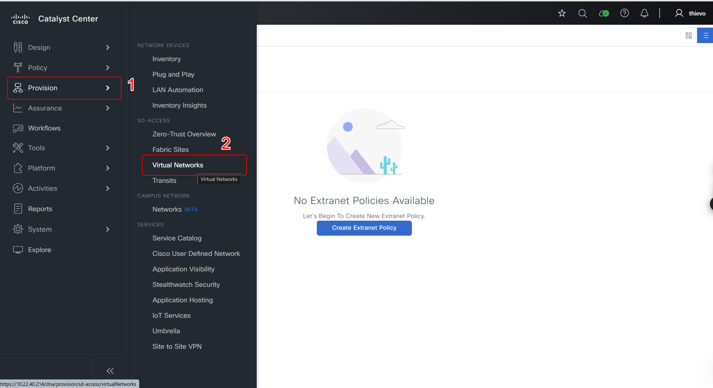
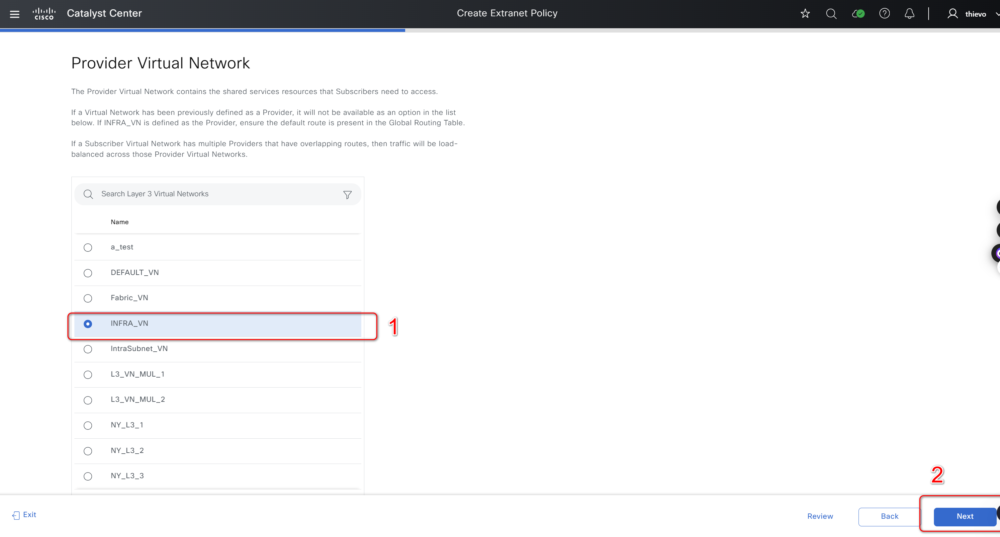
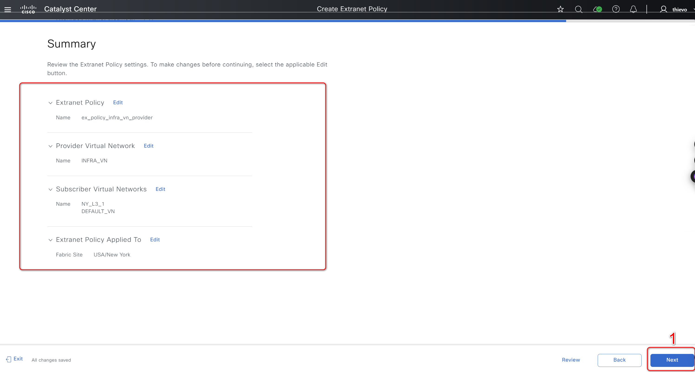
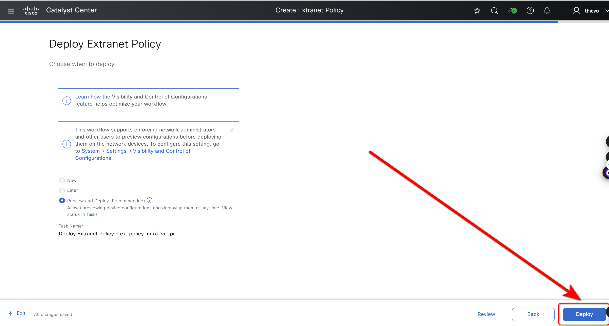
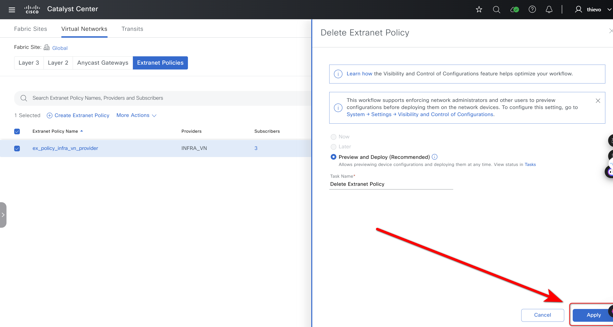

# Catalyst Center SDA Fabric Extranet Policies Playbooks

## I. Overview
### 1. Extranet Policy Playbook Overview

Configure an Extranet Policy to allow route leaks between Layer 3 virtual networks (VNs), without using a fusion device. Use an Extranet Policy to provide the endpoints (hosts or users) with access to shared services like DHCP, DNS, Internet, and so on, through Catalyst Center automation. The shared services connect to a Provider VN. The endpoints that use the shared services reside in a Subscriber VN. An Extranet Policy establishes communication between the Provider VN and the Subscriber VNs.

You can create an Extranet Policy, edit an Extranet Policy, and delete an Extranet Policy for the following deployments:
    Single site fabric with IP Transit.
    Multi-site fabric with SDA Transit.

### 2. Important Notes
- Refer to the Catalyst Center documentation for detailed instructions on configuring fabric Extranet Policies parameters and using the Ansible playbooks.
- Consider backing up your configuration before running the playbooks, especially the delete playbook.
- If you encounter any issues, review the Ansible playbook output for error messages and consult the Catalyst Center documentation or support resources.


### 3. Detailed Input Specification
Refer to: [https://galaxy.ansible.com/ui/repo/published/cisco/dnac/content/module/sda_extranet_policies_workflow_manager/](https://galaxy.ansible.com/ui/repo/published/cisco/dnac/content/module/sda_extranet_policies_workflow_manager/)

### 4. Features
  - Manage SD-Access Extranet Policy operations such as create, update, or delete extranet policies in Cisco Catalyst Center.
  - API to create a new Extranet Policy.
  - API to update an existing or edit an existing Extranet Policy.
  - API for deletion of an existing Extranet Policy using the policy name.

### 5. Prerequisites
Consider the following guidelines before you configure an Extranet Policy:

- To configure an Extranet Policy, a device should operate Cisco IOS XE 17.9.1 or a later release.

- Extranet Policy is supported only on the fabric sites that have a LISP Pub/Sub control plane.

- To configure an Extranet Policy on a multi site fabric with SD-Access transit, ensure that all the sites have the provider VN.

- If you configure multiple VN policies in your network, the same VN cannot be the Provider VN in more than one policy.

- Extranet Policy does not support overlapping IP pools.

- Provider VN in a policy cannot be configured as a Subscriber VN in another VN Policy and conversely.

- Add the Provider VN to all the fabric sites where an Extranet Policy is applicable.

- Ensure that the Provider VNs do not leak into each other outside the fabric. Else, it might result in route leaks between the Subscriber VNs.

- Extranet Policy is not supported on router devices.

- Inter-VN multicast through an Extranet Policy is not supported. You cannot route multicast between the Layer 3 virtual networks that are interconnected through an Extranet Policy.


## II. Procedure
### 1. Prepare your Ansible environment

- Install Ansible if you haven't already.
- Ensure you have network connectivity to your Catalyst Center instance.
- Checkout the project and playbooks: git@github.com:cisco-en-programmability/catalyst-center-ansible-iac.git.

### 2. Configure Host Inventory
- The host_inventory_catalyst_center1/hosts.yml file specifies the connection details (IP address, credentials, etc.) for your Catalyst Center instance.
- Make sure the catalyst_center_version in this file matches your actual Catalyst Center version.
- The Sample host_inventory_catalyst_center1/hosts.yml.

```bash
catalyst_center_hosts:
    hosts:
        catalyst_center220:
            catalyst_center_host: xx.xx.xx.xx.
            catalyst_center_password: XXXXXXXX
            catalyst_center_port: 443
            catalyst_center_timeout: 60
            catalyst_center_username: admin
            catalyst_center_verify: false
            catalyst_center_version: 2.3.7.6
            catalyst_center_debug: true
            catalyst_center_log_level: INFO
            catalyst_center_log: true
```

### 3. Define input
The /vars/fabric_extranet_policy_inputs.yml file stores the sites details you want to configure.

```bash
# Description: This file contains the input variables for the fabric Extranet Policy workflow.
extranet_policies:
    - extranet_policy_name: ex_policy_infra_vn_provider
      provider_virtual_network: INFRA VN
      subscriber_virtual_networks: 
          - DEFAULT_VN
          - VN_1
    - extranet_policy_name: ex_policy_default_vn_provider
      provider_virtual_network: VN_1
      subscriber_virtual_networks: 
          - VN_2
          - VN_3
      fabric_sites: 
          - Global/USA/SAN JOSE
          - Global/USA/SAN-FRANCISCO

```

### 4. How to Validate Input

**a. Validate Your Input:**

```bash
yamale -s workflows/sda_fabric_extranet_policy/schema/fabric_extranet_policy_schema.yml /auto/dna-sol/ws/thienvo/dnac_ansible_workflows/workflows/sda_fabric_extranet_policy/vars/fabric_extranet_policy_inputs.yml
```
**b. Execute the Playbook:**

- Playbook: workflows/fabric_extranet_policy/playbook/fabric_extranet_policy_playbook.yml

**c. To create or update the SDA Fabric Extranet Policy.**
```bash
ansible-playbook -i host_inventory_dnac1/hosts.yml workflows/fabric_extranet_policy/playbook/fabric_extranet_policy_playbook.yml --e VARS_FILE_PATH=../vars/fabric_extranet_policy_inputs.yml
```
**d. To delete existing  SDA Fabric Extranet Policy.**
```bash
 ansible-playbook -i host_inventory_catalyst_center1/hosts.yml workflows/fabric_extranet_policy/playbook/delete_fabric_extranet_policy_playbook.yml --e VARS_FILE_PATH=../vars/fabric_extranet_policy_inputs.yml
```

## III. Detailed steps to perform

### 1. Create SDA Extranet Policies
#### **Mapping config to UI Actions.**
- The config parameter within this task corresponds to the "Provision > Virtual Networks> Create Template" action in the Cisco Catalyst Center UI.
- Select "Provision" -> "Virtual Networks" to access the Virtual Networks page.


-  Click Layer3 Virtual Network.


- Click "Extranet Policies" -> "Create Extranet Policy" to start creating a new policy.


- ext4.png: Enter the Extranet Policy name (eg: "ex_policy_infra_vn_provider") and click "Next".


- Select Provider Virtual Network (eg: "INFRA_VN") and click "Next".


- Select Subscriber Virtual Networks (eg: "DEFAULT_VN", "NY_L3_1") and click "Next".


- Select "New York" in Fabric Sites, click "Next" to specify the site for the Extranet Policy.


- Check "Summary," click "Next" to confirm the configuration.


- Select "Preview and Deploy," click "Deploy" to deploy the Extranet Policy.


- Click "Save Intent," then click "Submit" to save and submit the configuration.


- Confirm "ex_policy_infra_vn_provider" in the Extranet Policies list to test the policy in action.


- Check Extranet Policy created.


#### **Example Input File.**

```bash
extranet_policies:
    - extranet_policy_name: ex_policy_infra_vn_provider
      provider_virtual_network: INFRA VN
      subscriber_virtual_networks: 
          - DEFAULT_VN
          - NY_L3_1
      fabric_sites: 
          - Global/USA/New York
```

### 2. Update SDA Extranet Policies
#### **Mapping config to UI Actions.**
- Select Extranet Policy Name to update -> "More Action" -> "Edit Extranet Policy" to update Extranet Policy.


- In Subscriber Virtual Networks section -> "Edit" to update Subscriber Virtual Networks.


- Check all Subscriber Virtual Networks that have been added and Subscriber Virtual Networks that you want to add.


- Select Subscriber Virtual Networks that you want to add -> "Next" to update Subscriber Virtual Networks.


- Select Fabric Sites that you want to Update, if not updated, you can skip this step -> "Next".


- Check the configuration information that has changed -> "Next".


- Deploy Extranet Policy that has just been updated.


- Enter "Task Name" for the update task -> Submit.


- Execute "Save Intent".


- Update notification successful.


- Check configuration update.


#### **Example Input File.**

```bash
extranet_policies:
    - extranet_policy_name: ex_policy_infra_vn_provider
      provider_virtual_network: INFRA VN
      subscriber_virtual_networks: 
          - DEFAULT_VN
          - NY_L3_1
          - NY_L3_2
      fabric_sites: 
          - Global/USA/New York
```

### 2. Delete SDA Extranet Policies
#### **Mapping config to UI Actions.**
- Select Extranet Policy Name to update -> "More Action" -> "Delete Extranet Policy" to update Extranet Policy.


- Click "Apply" to delete.


- Click "Next" -> to continue deleting Extranet Policy.


- Check the deleted Extranet Policy.

 
#### **Example Input File.**

```bash
extranet_policies:
    - extranet_policy_name: ex_policy_infra_vn_provider
```

## IV. References

Note: The environment is used for the references in the above instructions.

```
  ansible: 9.9.0
  ansible-core: 2.16.10
  ansible-runner: 2.4.0
  dnacentersdk: 2.8.3
  cisco.dnac: 6.30.0
  ansible.utils: 5.1.2
```
Cisco Catalyst Center Ansible Module Documentation: [sda_extranet_policies_workflow_manager](https://cisco-en-programmability.github.io/dnacenter-ansible/main/plugins/sda_extranet_policies_module)

GitHub Source Code: [sda_extranet_policies_workflow_manager.py](https://github.com/cisco-en-programmability/dnacenter-ansible/blob/main/plugins/modules/sda_extranet_policies_workflow_manager.py)