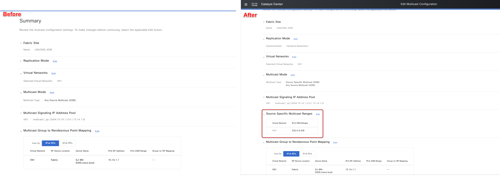
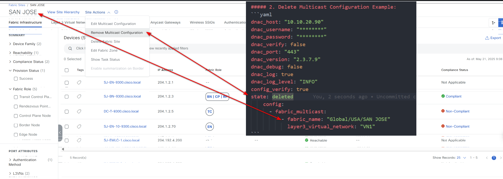
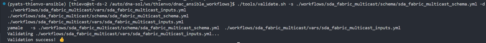
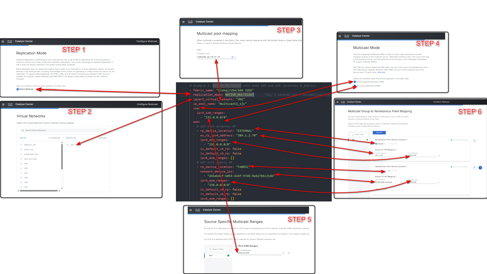

# Cisco Catalyst Center SDA Fabric Multicast Workflow Playbooks

This is a comprehensive resource module for managing SDA (Software-Defined Access) Fabric Multicast configurations in Cisco Catalyst Center. The module enables network administrators to automate and standardize multicast routing configurations within SDA environments, simplifying complex multicast deployments and ensuring consistent implementation across the network infrastructure.

## Key Features

- **Multicast Configuration Management:**
  - Create complete multicast configurations with fine-grained control over routing parameters.
  - Configure SSM (Source Specific Multicast) for secure, source-based multicast delivery.
  - Set up ASM (Any Source Multicast) for broader multicast applications.
  - Manage multicast settings per virtual network, allowing for isolated multicast domains.
  - Perform targeted updates to specific multicast parameters without disrupting existing traffic.

- **Flexible Replication Mode Options:**
  - Configure Native Multicast using PIM (Protocol Independent Multicast) routing for efficient multicast delivery across the fabric.
  - Implement Headend Replication for environments where traditional multicast routing is unavailable or impractical.
  - Seamlessly switch between replication modes to adapt to changing network requirements.

- **Advanced Rendezvous Point Management:**
  - Define Fabric RPs within your SDA environment with automatic RP candidate selection.
  - Specify multiple network devices as RP candidates for high availability.
  - Configure External RPs with precise IP address and multicast range mapping.
  - Designate default RPs for simplified network design.
  - Support dual-stack deployments with both IPv4 and IPv6 RP configurations.

- **Comprehensive Multicast Range Control:**
  - Define specific SSM address ranges to optimize network traffic patterns.
  - Configure multiple ASM address ranges with different Rendezvous Points for traffic engineering.
  - Support IPv4 ranges (e.g., 232.0.0.0/8, 239.0.0.0/8) for standard deployments.
  - Configure IPv6 multicast ranges (e.g., FF08::/16) for next-generation networks.
The workflow automates repetitive multicast configuration tasks, reducing manual errors and ensuring consistent implementation across your SDA fabric. Whether deploying native multicast with PIM routing or headend replication for environments with limited multicast support, this module provides the tools needed for efficient multicast management.

## Workflow Steps

This workflow typically involves the following steps:

### Step 1: Install and Generate Inventory

Before running the playbooks, ensure you have Ansible installed and the necessary collections for Cisco Catalyst Center.

1.  **Install Ansible:** Follow the official Ansible documentation for installation instructions.
2.  **Install Cisco Catalyst Center Collection:**
    ```bash
    ansible-galaxy collection install cisco.dnac
    ```
3.  **Generate Inventory:** Create an Ansible inventory file (e.g., `inventory.yml`) that includes your Cisco Catalyst Center appliance details. You will need to define variables such as the host, username, and password (or other authentication methods).
    ```yaml
    catalyst_center_hosts:
        hosts:
            catalyst_center220:
                catalyst_center_host: <CatC IP Address>
                catalyst_center_password: <CatC UI admin Password>
                catalyst_center_port: 443
                catalyst_center_timeout: 60
                catalyst_center_username: <CatC UI admin username>
                catalyst_center_verify: false
                catalyst_center_version: <CatC Release version>
                catalyst_center_debug: true
                catalyst_center_log_level: INFO
                catalyst_center_log: true
    ```

### Step 2: Define Inputs and Validate

This step involves preparing the input data for creating or managing SDA fabric multicast configurations and validating your setup.

1. **Define Input Variables:** Create variable files (e.g., `vars/sda_fabric_multicast_inputs.yml`) that define the desired state of your multicast configurations, including details for creation, update, and deletion.

#### Schema for SDA Fabric Multicast
This schema defines the structure of the input file for configuring SDA fabric multicast in Cisco Catalyst Center. Below is a breakdown of the parameters, including their requirements and descriptions.

| **Parameter**    | **Type** | **Required** | **Default Value** | **Description**                                     |
|------------------|----------|--------------|-------------------|-----------------------------------------------------|
| `fabric_multicast` | List   | Yes          | N/A               | A list of multicast configurations for SDA fabrics. |

#### Fabric Multicast Configuration

| **Parameter**           | **Type** | **Required** | **Default Value** | **Description**                                                      |
|-------------------------|----------|--------------|-------------------|----------------------------------------------------------------------|
| `fabric_name`           | String   | Yes          | N/A               | The name of the SDA fabric.                                          |
| `layer3_virtual_network`| String   | Yes          | N/A               | The name of the Layer 3 Virtual Network.                             |
| `replication_mode`      | String   | No           | NATIVE_MULTICAST  | Replication mode: NATIVE_MULTICAST or HEADEND_REPLICATION.           |
| `ip_pool_name`          | String   | Yes          | N/A               | The name of the IP pool to be used for multicast.                    |
| `ssm`                   | Dict     | No           | N/A               | Source-Specific Multicast configuration. See `ssm_type`.             |
| `asm`                   | List     | No           | N/A               | Any-Source Multicast configuration. See `asm_type`.                  |

#### SSM Configuration (`ssm_type`)

| **Parameter**      | **Type** | **Required** | **Default Value** | **Description**                                |
|--------------------|----------|--------------|-------------------|------------------------------------------------|
| `ipv4_ssm_ranges`  | List     | Yes          | N/A               | List of IPv4 SSM address ranges (e.g., "232.0.0.0/8"). |

#### ASM Configuration (`asm_type`)

| **Parameter**        | **Type** | **Required** | **Default Value** | **Description**                                              |
|----------------------|----------|--------------|-------------------|--------------------------------------------------------------|
| `rp_device_location` | String   | Yes          | N/A               | Location of RP device: FABRIC or EXTERNAL.                   |
| `network_device_ips` | List     | Conditional  | N/A               | Required when rp_device_location is FABRIC. List of device IPs. |
| `is_default_v4_rp`   | Boolean  | Conditional  | false             | Indicates if this is the default IPv4 RP.                    |
| `is_default_v6_rp`   | Boolean  | Conditional  | false             | Indicates if this is the default IPv6 RP.                    |
| `ex_rp_ipv4_address` | String   | Conditional  | N/A               | Required when rp_device_location is EXTERNAL. External RP IPv4 address. |
| `ex_rp_ipv6_address` | String   | Conditional  | N/A               | External RP IPv6 address for dual-stack configurations.      |
| `ipv4_asm_ranges`    | List     | Conditional  | N/A               | Required when rp_device_location is EXTERNAL. List of IPv4 ASM ranges. |
| `ipv6_asm_ranges`    | List     | Conditional  | N/A               | List of IPv6 ASM ranges for dual-stack configurations.       |

#### Example Input Files

**Prerequisites**  
The *SDA Fabric Multicast* feature relies on these components that must be predefined in Cisco Catalyst Center:  
- **SDA Fabric**: The fabric must be created and operational  
- **Layer 3 Virtual Network**: Virtual network must be created within the fabric  
- **IP Pool**: IP pool for multicast must be configured and available  

##### 1. Create Multicast Configuration Example (state: merged):

###### a. HEADEND_REPLICATION with both SSM and ASM (external)
```yaml
- fabric_multicast:
  - fabric_name: "Global/USA/SAN JOSE"
    layer3_virtual_network: "VN1"
    replication_mode: HEADEND_REPLICATION
    ip_pool_name: "multicast2_sjc"
    ssm:
      ipv4_ssm_ranges:
        - "229.0.0.0/8"
        - "230.0.0.0/8"
    asm:
      # ASM with external RP
      - rp_device_location: "EXTERNAL"
        ex_rp_ipv4_address: "204.1.2.70"
        ipv4_asm_ranges:
          - "236.0.0.0/8"
      # ASM with fabric RP
      - rp_device_location: "FABRIC"
        network_device_ips:
          - "d41ebdcf-b054-424f-97d6-9ed2766c214b"
        ipv4_asm_ranges:
          - "233.0.0.0/8"
```
###### b. NATIVE_MULTICAST with both SSM and ASM (external & fabric)
```yaml
- fabric_multicast:
  - fabric_name: "Global/USA/SAN JOSE"
    replication_mode: NATIVE_MULTICAST
    layer3_virtual_network: "VN1"
    ip_pool_name: "multicast2_sjc"
    ssm:
      ipv4_ssm_ranges:
        - "232.0.0.0/8"
    asm:
      # ASM with external RP
      - rp_device_location: "EXTERNAL"
        ex_rp_ipv4_address: "204.1.2.70"
        ipv4_asm_ranges:
          - "239.0.0.0/8"
        is_default_v4_rp: false
        is_default_v6_rp: false
        ipv6_asm_ranges: []
      # ASM with fabric RP
      - rp_device_location: "FABRIC"
        network_device_ips:
          - "d41ebdcf-b054-424f-97d6-9ed2766c214b"
        ipv4_asm_ranges:
          - "238.0.0.0/8"
        is_default_v4_rp: false
        is_default_v6_rp: false
        ipv6_asm_ranges: []
```
###### c. NATIVE_MULTICAST with ASM (fabric)
```yaml
- fabric_multicast:
  - fabric_name: "Global/USA/SAN JOSE"
    replication_mode: NATIVE_MULTICAST
    layer3_virtual_network: "VN1"
    ip_pool_name: "multicast2_sjc"
      - rp_device_location: "FABRIC"
        network_device_ips:
          - "d41ebdcf-b054-424f-97d6-9ed2766c214b"
        is_default_v4_rp: true    
        is_default_v6_rp: true
        ipv6_asm_ranges: []
```
###### d. HEADEND_MULTICAST with ASM (external) ipv6

```yaml
- fabric_multicast:
  - fabric_name: "Global/USA/SAN JOSE"
    replication_mode: NATIVE_MULTICAST
    layer3_virtual_network: "VN1"
    ip_pool_name: "multicast2_sjc"
    asm:
      # ASM with external RP
      - rp_device_location: "EXTERNAL"
        ex_rp_ipv4_address: "204.1.2.70"
        ex_rp_ipv6_address: "2004:15:14::1:0:1"
        ipv4_asm_ranges:
          - "239.0.0.0/8"
          - "235.0.0.0/8"
        is_default_v4_rp: false
        is_default_v6_rp: false
        ipv6_asm_ranges: 
          - "FF08::/16"
```
###### e. HEADEND_MULTICAST with ASM (external)
```yaml
- fabric_multicast:
  - fabric_name: "Global/USA/SAN JOSE"
    replication_mode: NATIVE_MULTICAST
    layer3_virtual_network: "VN1"
    ip_pool_name: "multicast2_sjc"
    asm:
      # ASM with external RP
      - rp_device_location: "EXTERNAL"
        ex_rp_ipv4_address: "204.1.2.70"
        ipv4_asm_ranges:
          - "239.0.0.0/8"
        is_default_v4_rp: false
        is_default_v6_rp: false
        ipv6_asm_ranges: []
```

##### 2. Update Multicast Configuration Example (state: merged):

```yaml
- fabric_multicast:
  - fabric_name: "Global/USA/SAN JOSE"
    layer3_virtual_network: "VN1"
    replication_mode: HEADEND_REPLICATION
    ip_pool_name: "multicast1_sjc"
    ssm:
      ipv4_ssm_ranges:
        - "232.0.0.0/8"
```
  ######   
  ###### **Figure 1**: *Update SDA Multicasts Example*
---

##### 3. Delete Multicast Configuration Example (state: deleted):

###### a. Delete SDA multicast with fabric_name and layer3_virtual_network
```yaml
  - fabric_multicast:
      - fabric_name: "Global/USA/SAN JOSE"
        layer3_virtual_network: "VN1"
```
###### b. Delete the source '226.0.0.0/8' from the ssm multicast configuration
```yaml
- fabric_multicast:
  - fabric_name: "Global/USA/SAN JOSE"
    layer3_virtual_network: "VN1"
    ssm:
      ipv4_ssm_ranges:
        - "226.0.0.0/8"
```
###### c. Delete the RP '204.1.2.70' from the asm multicast configuration
```yaml
  - fabric_multicast:
      - fabric_name: "Global/USA/SAN JOSE"
        layer3_virtual_network: "VN1"
        asm:
          - rp_device_location: "EXTERNAL"
            ex_rp_ipv4_address: "204.1.2.70"
```

  ######   
  ###### **Figure 2**: *Delete SDA Multicasts Example*
---


#### Validate Configuration
> **Important**: Validate your input schema before executing the playbook to ensure all parameters are correctly formatted.  
Run the following command to validate your input file against the schema:  
```bash
./tools/validate.sh -s ./workflows/sda_fabric_multicast/schema/sda_fabric_multicast_schema.yml -d ./workflows/sda_fabric_multicast/vars/sda_fabric_multicast_inputs.yml
```

#####   
##### **Figure 3**: *Validate parameters Multicast Configuration*
---

### Step 3: Deploy and Verify

**Deploy** your configuration to Cisco Catalyst Center and **verify** the changes.

1. **Deploy Configuration**:  
   Run the playbook to apply the SDA fabric multicast configuration. Ensure the input file is validated before execution. Specify the input file path using the `--e` variable (`VARS_FILE_PATH`):  
   ```bash
   ansible-playbook -i inventory/iac/host.yml workflows/sda_fabric_multicast/playbook/sda_fabric_multicast_playbook.yml --e VARS_FILE_PATH=../vars/sda_fabric_multicast_inputs.yml -vvvv
   ```
   > **Note**: If an error occurs (e.g., invalid input or API failure), the playbook will halt and display details.

2. **Verify Deployment**:  
   After execution, verify the configuration in the Cisco Catalyst Center UI under the SDA fabric multicast section. If `catalyst_center_debug` is enabled, review the logs for detailed operation information.

     
   **Figure 4**: *SDA Fabric Multicast Configuration in Cisco Catalyst Center*

---

## References

**Environment Details**  
The following environment was used for testing:  

| **Component**         | **Version** |
|-----------------------|-------------|
| Python                | `3.12.0`    |
| Cisco Catalyst Center | `2.3.7.9`   |
| Ansible               | `9.9.0`     |
| cisco.dnac Collection | `6.36.0`    |
| dnacentersdk          | `2.8.8`     |

For detailed information on SDA fabric multicast workflow, refer to the official documentation:  Refer to: [https://galaxy.ansible.com/ui/repo/published/cisco/dnac/content/module/sda_fabric_multicast_workflow_manager/](https://galaxy.ansible.com/ui/repo/published/cisco/dnac/content/module/sda_fabric_multicast_workflow_manager/)
