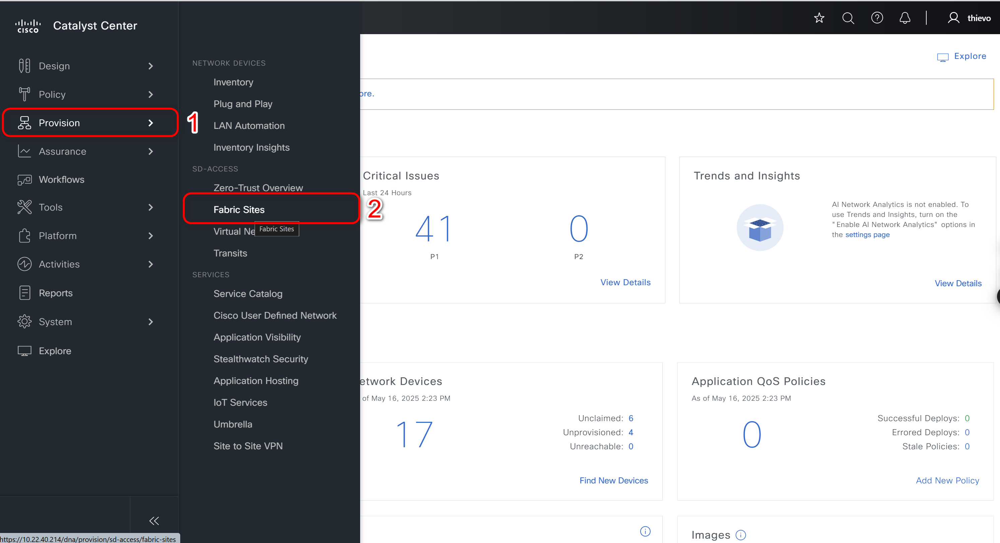
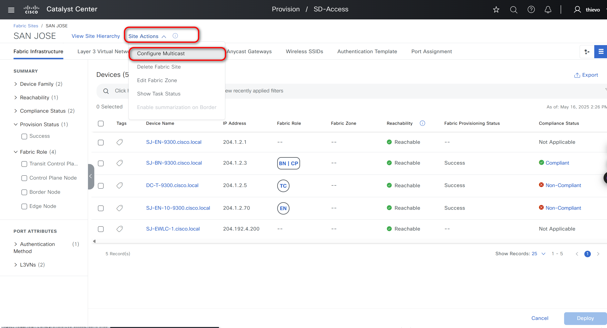
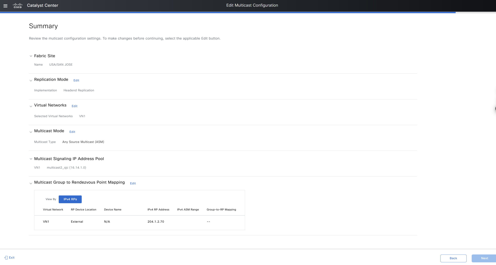

# Cisco Catalyst Center SDA Fabric Multicast

    This playbook provides functionality to manage SDA (Software-Defined Access) Fabric Multicast configurations in Cisco Catalyst Center. It allows you to configure, manage and monitor multicast routing settings within your SDA fabric, including Source Specific Multicast (SSM), Any Source Multicast (ASM), and replication modes across Layer 3 Virtual Networks.

    The workflow simplifies the configuration of multicast within SDA fabrics by automating repetitive tasks and ensuring consistency across your network infrastructure. It supports both native multicast with traditional PIM routing as well as headend replication for environments where multicast routing protocols cannot be used.

## Requirements

- **Python**: 3.6 or higher
- **Ansible**: 2.9 or higher
- **Cisco Catalyst Center**: 2.3.7.9 or higher
- **Cisco DNA Ansible Collection**: Installed via `ansible-galaxy collection install cisco.dnac`
- **Python SDK**: Install `dnacentersdk` via `pip install dnacentersdk`


## Installation
### 1. Prepare your Ansible Environment

- Install Ansible if you haven't already.
- Ensure you have network connectivity to your Catalyst Center instance.
-  Clone the project and playbooks:
  ```bash
  git clone git@github.com:cisco-en-programmability/catalyst-center-ansible-iac.git


### 2. Configure Host Inventory

Update the host_inventory_dnac1/hosts.yml file with your Catalyst Center details (IP address, credentials, etc.) and ensure the dnac_version in this file matches your actual Catalyst Center version as below:

```bash
---
catalyst_center_hosts:
    hosts:
        catalyst_center220:
            #(Mandatory) CatC Ip address
            catalyst_center_host:  <CatC IP Address>
            #(Mandatory) CatC UI admin Password
            catalyst_center_password: <CatC UI admin Password>
            catalyst_center_port: 443
            catalyst_center_timeout: 60
            #(Mandatory) CatC UI admin username
            catalyst_center_username: <CatC UI admin username> 
            catalyst_center_verify: false
            #(Mandatory) CatC Release version
            catalyst_center_version: <CatC Release version>
            catalyst_center_debug: true
            catalyst_center_log_level: INFO
            catalyst_center_log: true
```
## Usage
The SDA Fabric Multicast module allows you to configure and manage multicast settings for your SDA fabric through Cisco Catalyst Center. The configuration is structured into several key components:




Refer to the full workflow specification for detailed instructions on the available options and their structure: https://galaxy.ansible.com/ui/repo/published/cisco/dnac/docs/

### 1. Key Multicast Components

#### Replication Modes
Native Multicast (NATIVE_MULTICAST): Leverages traditional multicast routing protocols like PIM to build distribution trees, efficiently delivering traffic to multiple receivers.
Headend Replication (HEADEND_REPLICATION): Replicates packets at the source node without requiring multicast routing protocols, useful in environments where multicast routing cannot be deployed.

#### Multicast Types
Source-Specific Multicast (SSM): Receivers specify both the multicast group (G) and the source (S), enhancing security and efficiency.
Any-Source Multicast (ASM): Receivers join a multicast group without specifying a source, allowing traffic from any source to be delivered to the group.

### 2. Multicast Configuration

Multicast configuration enables you to define how multicast traffic is handled within your SDA fabric, including the selection of multicast mode (native or headend replication), multicast type (SSM, ASM, or both).

##### a. Native Multicast with SSM Only
```yaml
  - fabric_multicast:
    - fabric_name: "Global/USA/SAN JOSE"
      layer3_virtual_network: "VN1"
      replication_mode: NATIVE_MULTICAST
      ip_pool_name: "multicast2_sjc"
      ssm:
        ipv4_ssm_ranges:
          - "232.0.0.0/8"
          - "233.0.0.0/8"
```

##### b. Headend Replication with SSM Only
```yaml
  - fabric_multicast:
    - fabric_name: "Global/USA/SAN JOSE"
      layer3_virtual_network: "VN1"
      replication_mode: HEADEND_REPLICATION
      ip_pool_name: "multicast2_sjc"
      ssm:
        ipv4_ssm_ranges:
          - "232.0.0.0/8"
          - "233.0.0.0/8"
```

##### c. Native Multicast with ASM Only (Fabric RP)
```yaml
  - fabric_multicast:
    - fabric_name: "Global/USA/SAN JOSE"
      layer3_virtual_network: "VN1"
      replication_mode: NATIVE_MULTICAST
      ip_pool_name: "multicast2_sjc"
      asm:
        - rp_device_location: "FABRIC"
          network_device_ips:
            - "204.1.2.70"
            - "10.1.2.4"
          is_default_v4_rp: true
```

##### d. Headend Replication with ASM Only (External RP)

```yaml
  - fabric_multicast:
    - fabric_name: "Global/USA/SAN JOSE"
      layer3_virtual_network: "VN1"
      replication_mode: HEADEND_REPLICATION
      ip_pool_name: "multicast2_sjc"
      asm:
        - rp_device_location: "EXTERNAL"
          ex_rp_ipv4_address: "204.1.2.70"
          ipv4_asm_ranges:
            - "239.0.0.0/8"
```

##### e. Native Multicast with both SSM and ASM

```yaml
  - fabric_multicast:
    - fabric_name: "Global/USA/SAN JOSE"
      layer3_virtual_network: "VN1"
      replication_mode: NATIVE_MULTICAST
      ip_pool_name: "multicast2_sjc"
      ssm:
        ipv4_ssm_ranges:
          - "232.0.0.0/8"
      asm:
        - rp_device_location: "FABRIC"
          network_device_ips:
            - "204.1.2.70"
          is_default_v4_rp: true
```

##### f. Multiple ASM Configurations (Both Fabric and External RPs)

```yaml
  - fabric_multicast:
    - fabric_name: "Global/USA/SAN JOSE"
      layer3_virtual_network: "VN1"
      replication_mode: NATIVE_MULTICAST
      ip_pool_name: "multicast2_sjc"
      asm:
        - rp_device_location: "FABRIC"
          network_device_ips:
            - "204.1.2.70"
          is_default_v4_rp: true
        - rp_device_location: "EXTERNAL"
          ex_rp_ipv4_address: "172.16.1.1"
          ipv4_asm_ranges:
            - "239.1.0.0/16"
            - "239.2.0.0/16"
        - rp_device_location: "EXTERNAL"
          ex_rp_ipv4_address: "172.16.1.2"
          ipv4_asm_ranges:
            - "239.3.0.0/16"
```

##### g. Dual-Stack Configuration (IPv4 and IPv6)

```yaml
  - fabric_multicast:
    - fabric_name: "Global/USA/SAN JOSE"
      layer3_virtual_network: "VN1"
      replication_mode: NATIVE_MULTICAST
      ip_pool_name: "Corp_Dual_Stack_Pool"
      asm:
        - rp_device_location: "EXTERNAL"
          ex_rp_ipv4_address: "172.16.1.1"
          ipv4_asm_ranges:
            - "239.0.0.0/8"
          ex_rp_ipv6_address: "2001:db8::1"
          ipv6_asm_ranges:
            - "FF08::/16"
            - "FF09::/16"
```

##### h. Dual-Stack Configuration (IPv4 and IPv6)

```yaml
  - fabric_multicast:
    - fabric_name: "Global/USA/SAN JOSE"
      layer3_virtual_network: "VN1"
      replication_mode: HEADEND_REPLICATION
```


### 3. Delete Operations

#### a. Delete Specific SSM Range
```yaml
  - name: Delete Specific SSM Range 
    cisco.dnac.sda_fabric_multicast_workflow_manager:
      dnac_host: "{{ dnac_host }}"
      dnac_username: "{{ dnac_username }}"
      dnac_password: "{{ dnac_password }}"
      dnac_verify: "{{ dnac_verify }}"
      dnac_port: "{{ dnac_port }}"
      dnac_version: "{{ dnac_version }}"
      state: deleted
      config_verify: true
      config:
        - fabric_multicast:
            - fabric_name: "Global/USA/SAN JOSE"
              layer3_virtual_network: "VN1"
              ssm:
                ipv4_ssm_ranges:
                  - "232.0.0.0/8"
```
#### b. Delete External RP from ASM Configuration

```yaml
- name: Delete External RP from ASM Configuration
  cisco.dnac.sda_fabric_multicast_workflow_manager:
    dnac_host: "{{ dnac_host }}"
    dnac_username: "{{ dnac_username }}"
    dnac_password: "{{ dnac_password }}"
    dnac_verify: "{{ dnac_verify }}"
    dnac_port: "{{ dnac_port }}"
    dnac_version: "{{ dnac_version }}"
    state: deleted
    config_verify: true
    config:
      - fabric_multicast:
          - fabric_name: "Global/USA/SAN JOSE"
            layer3_virtual_network: "VN1"
            asm:
              - rp_device_location: "EXTERNAL"
                ex_rp_ipv4_address: "172.16.1.1"
```
#### c. Delete Fabric RP from ASM Configuration

```yaml
- name: Delete External RP from ASM Configuration
  cisco.dnac.sda_fabric_multicast_workflow_manager:
    dnac_host: "{{ dnac_host }}"
    dnac_username: "{{ dnac_username }}"
    dnac_password: "{{ dnac_password }}"
    dnac_verify: "{{ dnac_verify }}"
    dnac_port: "{{ dnac_port }}"
    dnac_version: "{{ dnac_version }}"
    state: deleted
    config_verify: true
    config:
      - fabric_multicast:
          - fabric_name: "Global/USA/SAN JOSE"
            layer3_virtual_network: "VN1"
            asm:
              - rp_device_location: "EXTERNAL"
                ex_rp_ipv4_address: "172.16.1.1"
```
#### d. Delete Entire Multicast Configuration for a Virtual Network

```yaml
- name: Delete Entire Multicast Configuration for a Virtual Network
  cisco.dnac.sda_fabric_multicast_workflow_manager:
    dnac_host: "{{ dnac_host }}"
    dnac_username: "{{ dnac_username }}"
    dnac_password: "{{ dnac_password }}"
    dnac_verify: "{{ dnac_verify }}"
    dnac_port: "{{ dnac_port }}"
    dnac_version: "{{ dnac_version }}"
    state: deleted
    config_verify: true
    config:
      - fabric_multicast:
          - fabric_name: "Global/USA/SAN JOSE"
            layer3_virtual_network: "VN1"
```

### 4. Update Operations

#### a. Update SSM Ranges
```yaml
- name: Update SSM Ranges
  cisco.dnac.sda_fabric_multicast_workflow_manager:
    dnac_host: "{{ dnac_host }}"
    dnac_username: "{{ dnac_username }}"
    dnac_password: "{{ dnac_password }}"
    dnac_verify: "{{ dnac_verify }}"
    dnac_port: "{{ dnac_port }}"
    dnac_version: "{{ dnac_version }}"
    state: merged
    config_verify: true
    config:
      - fabric_multicast:
          - fabric_name: "Global/USA/SAN JOSE"
            layer3_virtual_network: "VN1"
            ssm:
              ipv4_ssm_ranges:
                - "234.0.0.0/8"
                - "235.0.0.0/8"
```

#### b. Update Replication Mode
```yaml
- name: Update Replication Mode from Native to Headend
  cisco.dnac.sda_fabric_multicast_workflow_manager:
    dnac_host: "{{ dnac_host }}"
    dnac_username: "{{ dnac_username }}"
    dnac_password: "{{ dnac_password }}"
    dnac_verify: "{{ dnac_verify }}"
    dnac_port: "{{ dnac_port }}"
    dnac_version: "{{ dnac_version }}"
    state: merged
    config_verify: true
    config:
      - fabric_multicast:
          - fabric_name: "Global/USA/SAN JOSE"
            layer3_virtual_network: "VN1"
            replication_mode: HEADEND_REPLICATION
```

#### c. Update ASM Configuration with Fabric RP
```yaml
- name: Update ASM Configuration with Fabric RP
  cisco.dnac.sda_fabric_multicast_workflow_manager:
    dnac_host: "{{ dnac_host }}"
    dnac_username: "{{ dnac_username }}"
    dnac_password: "{{ dnac_password }}"
    dnac_verify: "{{ dnac_verify }}"
    dnac_port: "{{ dnac_port }}"
    dnac_version: "{{ dnac_version }}"
    state: merged
    config_verify: true
    config:
      - fabric_multicast:
          - fabric_name: "Global/USA/SAN JOSE"
            layer3_virtual_network: "VN1"
            asm:
              - rp_device_location: "FABRIC"
                network_device_ips:
                  - "10.1.2.5"
                  - "10.1.2.6"
                is_default_v4_rp: true
```

### 5. Validate the playbook

To ensure a successful execution of the playbooks with your specified inputs, follow these steps:

Input Validation:
Before executing the playbook, it is essential to validate the input schema. This step ensures that all required parameters are included and correctly formatted. Run the following command *./tools/validate.sh -s* to perform the validation providing the schema path -d and the input path.

```bash

     ./tools/validate.sh -s /auto/dna-sol/ws/thienvo/dnac_ansible_workflows/workflows/sda_fabric_multicast/schema/sda_fabric_multicast_schema.yml -d /auto/dna-sol/ws/thienvo/dnac_ansible_workflows/workflows/sda_fabric_multicast/vars/sda_fabric_multicast_inputs.yml
```

### 4. Running the Playbook

Once the input validation is complete and no errors are found, you can run the playbook. Provide your input file path using the --e variable as VARS_FILE_PATH:

```bash
      ansible-playbook -i inventory/iac/host.yml workflows/sda_fabric_multicast/playbook/sda_fabric_multicast_playbook.yml --e VARS_FILE_PATH=../vars/sda_fabric_multicast_inputs.yml -vvvv
```

If there is an error in the input or an issue with the API call during execution, the playbook will halt and display the relevant error details.

##### Example configue Headend Replication with ASM Only (External RP)

```yaml
  - fabric_multicast:
    - fabric_name: "Global/USA/SAN JOSE"
      layer3_virtual_network: "VN1"
      replication_mode: HEADEND_REPLICATION
      ip_pool_name: "multicast2_sjc"
      asm:
        - rp_device_location: "EXTERNAL"
          ex_rp_ipv4_address: "204.1.2.70"
          ipv4_asm_ranges:
            - "239.0.0.0/8"
```

Here is the UI page after the playbook runs successfully:
 
### 5. References

*Note: The environment used for the references in the above instructions is as follows:*

```yaml
python: 3.12.0
dnac_version: 2.3.7.9
ansible: 9.9.0
dnacentersdk: 2.8.8
```

