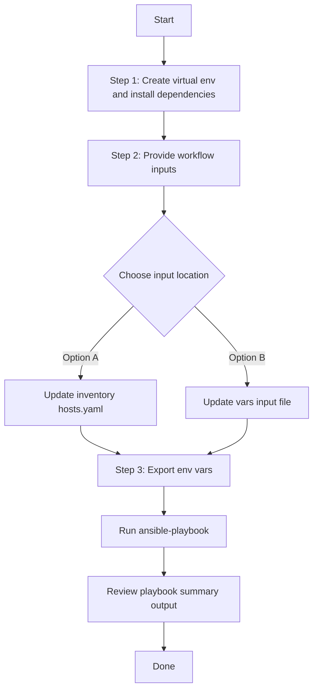

# SDA Fabric Multicast Config Generator

## Table of Contents

- [User Flow (3 Steps)](#user-flow-3-steps)

- [Overview](#overview)
- [Key Capabilities](#key-capabilities)
- [Workflow Structure](#workflow-structure)
- [Prerequisites](#prerequisites)
- [Input Data Model](#input-data-model)
- [Operational Behavior](#operational-behavior)
- [Quick Start](#quick-start)
- [Input Examples](#input-examples)
- [Generated Output](#generated-output)
- [Using Generated Output with Workflow Manager](#using-generated-output-with-workflow-manager)
- [Troubleshooting](#troubleshooting)
- [Best Practices](#best-practices)
- [References](#references)

## Overview

This workflow exports existing SDA Fabric Multicast configuration from Cisco Catalyst Center and generates YAML files compatible with:

- `cisco.catalystcenter.sda_fabric_multicast_workflow_manager`

It is designed for brownfield operations where multicast already exists and you need reusable, versionable infrastructure-as-code artifacts.

---

## Key Capabilities

- Generates workflow-manager-ready YAML from live Catalyst Center data.
- Supports full export (`generate_all_configurations: true`) and selective export with filters.
- Supports multiple export jobs in one playbook run.
- Supports deterministic output path via `file_path` and dynamic pathing via `{{ playbook_dir }}`.
- Keeps output user-independent (no hardcoded `/ws/<username>` path required).

---

## Workflow Structure

```text
sda_fabric_multicast_config_generator/
├── README.md
├── description.json
├── playbook/
│   └── sda_fabric_multicast_config_generator.yml
├── schema/
│   └── sda_fabric_multicast_config_generator_schema.yml
└── vars/
    └── sda_fabric_multicast_config_generator_inputs.yml
```

---

## Prerequisites

### Software

| Component | Recommended |
|---|---|
| Cisco Catalyst Center | 2.3.7.9+ |
| Python | 3.9+ |
| Ansible | 2.13+ |

### Required packages

```bash
ansible-galaxy collection install cisco.catalystcenter
ansible-galaxy collection install ansible.utils
pip install catalystcentersdk
pip install yamale
```

### Access requirements

- Valid Catalyst Center credentials.
- Network access from Ansible control node to Catalyst Center API.
- Existing SDA fabric multicast configuration for export use cases.

---

## Input Data Model

Top-level variable:

- `sda_fabric_multicast_config` (list, required)

Each list item supports:

| Parameter | Type | Required | Description |
|---|---|---|---|
| `generate_all_configurations` | bool | No | When `true`, the playbook omits `config` so the module exports **all** multicast configuration (full-discovery mode). Filters are ignored. |
| `file_path` | str | No | Output file path for generated YAML. If omitted, module auto-generates a timestamped filename. |
| `file_mode` | str | No | `overwrite` (default) replaces existing file; `append` adds to an existing file. |
| `component_specific_filters` | dict | No | Selective export filters (ignored when `generate_all_configurations` is `true`). |

`component_specific_filters` supports:

| Parameter | Type | Required | Description |
|---|---|---|---|
| `components_list` | list[str] | No | Supported value: `fabric_multicast` |
| `fabric_multicast` | list[dict] | No | Filter entries by `fabric_name` and/or `layer3_virtual_network` |

`fabric_multicast` filter item:

| Parameter | Type | Required | Description |
|---|---|---|---|
| `fabric_name` | str | No | Site hierarchy, for example `Global/USA/SAN JOSE` |
| `layer3_virtual_network` | str | No | L3 VN name, for example `VN1` |

---

## Operational Behavior

1. The playbook loads input from `VARS_FILE_PATH` (if provided) or falls back to inventory/host variables.
2. It loops each item in `sda_fabric_multicast_config`.
3. For each item, the playbook extracts `file_path` and `file_mode` as top-level module parameters and passes `component_specific_filters` inside `config`.
4. If `generate_all_configurations: true`, the playbook omits `config` entirely so the module runs in full-discovery mode.
5. If `file_path` is set, output is written exactly there. If omitted, module auto-generates:
   `sda_fabric_multicast_playbook_config_<YYYY-MM-DD_HH-MM-SS>.yml`
6. Generated file uses top-level key `config`, ready for workflow manager consumption.

---

## Quick Start

### 1. Prepare inventory

Configure Catalyst Center credentials in your inventory, for example:

```yaml
catalyst_center_hosts:
  hosts:
    catalyst_center_primary:
      catalyst_center_host: 10.10.10.10
      catalyst_center_username: admin
      catalyst_center_password: "password"
      catalyst_center_verify: false
      catalyst_center_port: 443
      catalyst_center_version: "2.3.7.9"
      catalyst_center_debug: false
      catalyst_center_log: true
      catalyst_center_log_level: "INFO"
```

### 2. Update input variables

Edit:

- `workflows/sda_fabric_multicast_config_generator/vars/sda_fabric_multicast_config_generator_inputs.yml`

### 3. Validate input schema

```bash
./tools/schemavalidation.sh \
  -s workflows/sda_fabric_multicast_config_generator/schema/sda_fabric_multicast_config_generator_schema.yml \
  -d workflows/sda_fabric_multicast_config_generator/vars/sda_fabric_multicast_config_generator_inputs.yml
```

### 4. Execute workflow

The playbook supports two input methods:

#### Option A: Vars file input (recommended for version-controlled configs)

```bash
ansible-playbook -i inventory/demo_lab/hosts.yaml \
  workflows/sda_fabric_multicast_config_generator/playbook/sda_fabric_multicast_config_generator.yml \
  --extra-vars VARS_FILE_PATH=./workflows/sda_fabric_multicast_config_generator/vars/sda_fabric_multicast_config_generator_inputs.yml \
  -vvvv
```

#### Option B: Inventory file input

Omit `VARS_FILE_PATH` and define `sda_fabric_multicast_config` directly as a host variable in your inventory file or in `host_vars`/`group_vars`.

**Example inventory snippet (`inventory/demo_lab/hosts.yaml`):**

```yaml
catalyst_center_hosts:
  hosts:
    catalyst_center220:
      catalyst_center_host: "{{ lookup('ansible.builtin.env', 'HOSTIP') }}"
      catalyst_center_password: "{{ lookup('ansible.builtin.env', 'CATALYST_CENTER_PASSWORD') }}"
      catalyst_center_port: 443
      catalyst_center_username: "{{ lookup('ansible.builtin.env', 'CATALYST_CENTER_USERNAME') }}"
      catalyst_center_verify: false
      catalyst_center_version: 2.3.7.9

      # Workflow data defined as host variables
      sda_fabric_multicast_config:
        - generate_all_configurations: true
          file_path: "{{ playbook_dir }}/sda_fabric_multicast_playbook_config_all.yml"
```

Then run **without** `VARS_FILE_PATH`:

```bash
ansible-playbook -i inventory/demo_lab/hosts.yaml \
  workflows/sda_fabric_multicast_config_generator/playbook/sda_fabric_multicast_config_generator.yml \
  -vvvv
```

The playbook auto-detects the input source and prints it at the start:
- `Input source: vars file <path>` when using Option A
- `Input source: inventory variables (VARS_FILE_PATH not provided)` when using Option B

---

## Input Examples

### Example 1: Export all multicast configuration

```yaml
sda_fabric_multicast_config:
  - generate_all_configurations: true
    file_path: "{{ playbook_dir }}/sda_fabric_multicast_playbook_config_all.yml"
```

### Example 2: Export by fabric site

```yaml
sda_fabric_multicast_config:
  - file_path: "{{ playbook_dir }}/sda_fabric_multicast_playbook_config_sanjose.yml"
    component_specific_filters:
      components_list:
        - fabric_multicast
      fabric_multicast:
        - fabric_name: "Global/USA/SAN JOSE"
```

### Example 3: Export by fabric site + L3 VN

```yaml
sda_fabric_multicast_config:
  - file_path: "{{ playbook_dir }}/sda_fabric_multicast_playbook_config_sanjose_vn1.yml"
    component_specific_filters:
      components_list:
        - fabric_multicast
      fabric_multicast:
        - fabric_name: "Global/USA/SAN JOSE"
          layer3_virtual_network: "VN1"
```

### Example 4: Export VN across all eligible sites

```yaml
sda_fabric_multicast_config:
  - file_path: "{{ playbook_dir }}/sda_fabric_multicast_playbook_config_fabric_vn.yml"
    component_specific_filters:
      components_list:
        - fabric_multicast
      fabric_multicast:
        - layer3_virtual_network: "Fabric_VN"
```

### Example 5: Append mode

```yaml
sda_fabric_multicast_config:
  - file_path: "{{ playbook_dir }}/sda_fabric_multicast_playbook_config_all.yml"
    file_mode: append
    component_specific_filters:
      components_list:
        - fabric_multicast
      fabric_multicast:
        - fabric_name: "Global/Europe/London/DataCenter1"
```

### Example 6: Auto-generated timestamp filename

```yaml
sda_fabric_multicast_config:
  - generate_all_configurations: true
```

---

## Generated Output

Each generated file contains a top-level `config` key. Example structure:

```yaml
---
config:
  - fabric_multicast:
      - fabric_name: "Global/USA/SAN JOSE"
        layer3_virtual_network: "VN1"
        replication_mode: "HEADEND_REPLICATION"
        ip_pool_name: "MULTICASTPOOL_sjc"
        ssm:
          ipv4_ssm_ranges:
            - "232.0.0.0/8"
```

In this workflow, sample paths use `{{ playbook_dir }}` so output remains portable across users and workspaces.

---

## Using Generated Output with Workflow Manager

Use the exported file directly as `vars_files`, then pass `config` to the manager module.

```yaml
---
- name: Apply generated SDA multicast configuration
  hosts: catalyst_center_hosts
  connection: local
  gather_facts: no

  vars_files:
    - "{{ playbook_dir }}/sda_fabric_multicast_playbook_config_sanjose.yml"

  tasks:
    - name: Apply multicast configuration
      cisco.catalystcenter.sda_fabric_multicast_workflow_manager:
        catalystcenter_host: "{{ catalyst_center_host }}"
        catalystcenter_username: "{{ catalyst_center_username }}"
        catalystcenter_password: "{{ catalyst_center_password }}"
        catalystcenter_verify: "{{ catalyst_center_verify }}"
        catalystcenter_port: "{{ catalyst_center_port }}"
        catalystcenter_version: "{{ catalyst_center_version }}"
        state: merged
        config: "{{ config }}"
```

---

## Troubleshooting

| Symptom | Likely Cause | Resolution |
|---|---|---|
| File appears in unexpected directory | `file_path` omitted | Set explicit `file_path` (recommended: `{{ playbook_dir }}/...`) |
| No data exported | Filters too narrow or site/VN mismatch | Validate `fabric_name` hierarchy and VN naming in Catalyst Center |
| Filters ignored | `generate_all_configurations: true` | Set to `false` or remove it when selective export is needed |
| Schema validation fails | Typo or wrong YAML structure | Re-run `./tools/schemavalidation.sh` and fix reported field |
| Module fails on version check | Catalyst Center < 2.3.7.9 | Upgrade Catalyst Center or use compatible workflow |
| `yamale: command not found` | Missing validation dependency | `pip install yamale` in your active environment |

---

## Best Practices

- Keep one output file per intent (all/site/site+VN) for cleaner Git diffs and easier rollback.
- Use `{{ playbook_dir }}` in `file_path` for user-independent, portable paths.
- Start with selective filters in production to avoid exporting unnecessary configuration.
- Commit generated files that represent intended state, not every ad-hoc run.
- Enable Catalyst Center logging (`catalyst_center_log: true`) when troubleshooting.

---

## References

- Workflow playbook:
  `workflows/sda_fabric_multicast_config_generator/playbook/sda_fabric_multicast_config_generator.yml`
- Input file:
  `workflows/sda_fabric_multicast_config_generator/vars/sda_fabric_multicast_config_generator_inputs.yml`
- Schema:
  `workflows/sda_fabric_multicast_config_generator/schema/sda_fabric_multicast_config_generator_schema.yml`
- Target module:
  `cisco.catalystcenter.sda_fabric_multicast_playbook_config_generator`
- Consumer module:
  `cisco.catalystcenter.sda_fabric_multicast_workflow_manager`

## Workflow Steps
## User Flow (3 Steps)



### Installation and Run (Aligned)

1. Create and activate a Python virtual environment, then install dependencies.

```bash
python3 -m venv .venv
source .venv/bin/activate
pip install -r requirements.txt
ansible-galaxy collection install cisco.catalystcenter --force
```

2. Provide workflow inputs in either inventory (`inventory/demo_lab/hosts.yaml`) or the workflow `vars/` file.

3. Export Catalyst Center environment variables and run the playbook.

```bash
export HOSTIP=<catalyst-center-ip-or-fqdn>
export CATALYST_CENTER_USERNAME=<username>
export CATALYST_CENTER_PASSWORD='<password>'
ansible-playbook -i ./inventory/demo_lab/hosts.yaml ./workflows/sda_fabric_multicast_config_generator/playbook/sda_fabric_multicast_config_generator.yml -vvvv
```
