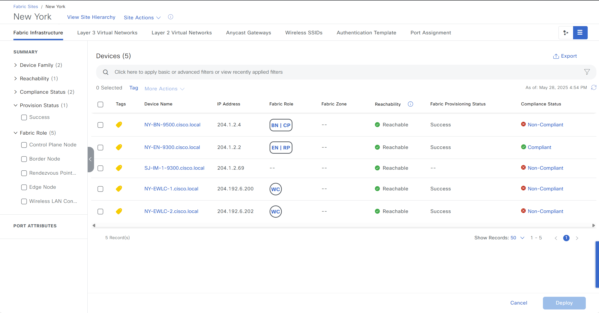

# Catalyst Center SDA Fabric Sites and Fabric Zones Playbook

## Fabric Sites

A fabric site is an independent area with a unique set of network devices, including control plane, border, edge, wireless controllers, and ISE PSNs. Different levels of redundancy and scale can be designed per site by including local resources such as DHCP, AAA, DNS, and Internet.

A fabric site can cover a single physical location, multiple locations, or only a subset of a location:

- **Single location**: branch, campus, or metro campus
- **Multiple locations**: metro campus + multiple branches
- **Subset of a location**: building or area within a campus

A Software-Defined Access (SDA) fabric network may comprise multiple sites. Each site benefits from scale, resiliency, survivability, and mobility. The overall aggregation of fabric sites accommodates a large number of endpoints and scales modularly or horizontally. Multiple fabric sites are interconnected using a transit.

**Key Features:**
  - Fabric Site & Zone Management: Create, update, or delete SDA fabric sites and their associated zones.
  - Authentication Control: Apply different authentication profiles (Closed, Open, Low Impact, None) per site or zone.
  - Per-Zone Customization: Customize settings such as 802.1X fallback timeout, Wake-on-LAN, BPDU Guard, and Pre-Auth ACLs at the zone level.
  - Supports managing queuing profiles and application policies for traffic classification and prioritization.
  - Apply Pending Events: Supports applying pending fabric updates caused by changes like IP address pool modifications, ensuring configurations are fully synchronized and devices are updated accordingly.

**Version Information:**
- Fabric Site & Zone Management introduced in Ansible Galaxy cisco.dnac: **v6.21.0**
- Pre-Authentication ACL and Apply Pending Events in Ansible Galaxy cisco.dnac: **v6.32.0**
---

This README outlines the steps to use the Ansible playbooks for managing Application Policies in Cisco Catalyst Center.

## Workflow Steps

You can create a fabric site only if IP Device Tracking (IPDT) is already configured for the site.

Before running the playbooks, ensure you have Ansible installed and the necessary collections for Cisco Catalyst Center.

1.  **Install Ansible:** Follow the official Ansible documentation for installation instructions.
2.  **Install Cisco Catalyst Center Collection:**
    ```bash
    ansible-galaxy collection install cisco.dnac
    ```
3.  **Generate Inventory:** Create an Ansible inventory file (e.g., `inventory.yml`) that includes your Cisco Catalyst Center appliance details. You will need to define variables such as the host, username, and password (or other authentication methods).
### Configure Host Inventory

Update your Ansible hosts.yml inventory file with the connection details of your Cisco Catalyst Center instance. Replace the placeholder values with your actual Catalyst Center information.

```yaml
catalyst_center_hosts:
    hosts:
        your_catalyst_center_instance_name:
            catalyst_center_host: xx.xx.xx.xx
            catalyst_center_password: XXXXXXXX
            catalyst_center_port: 443
            catalyst_center_timeout: 60
            catalyst_center_username: admin
            catalyst_center_verify: false # Set to true for production with valid certificates
            catalyst_center_version: 2.3.7.6 # Specify your DNA Center version
            catalyst_center_debug: true
            catalyst_center_log_level: INFO
            catalyst_center_log: true
```

### Step 2: Define Inputs and Validate

1. **Prerequisite:**
  - Need Site Hierarchy created
  - ISE setup required

2.  **Define Input Variables:** Create variable files (e.g., `vars/sda_fabric_sites_zones_inputs.yml`) that define the desired state of your fabric sites, including zones and authentication profile configurations. Refer to the schema below to structure the input variables correctly.

#### Fabric Site And Fabric Zone Schema

This schema defines the structure of the input file for configuring Fabric Site and Fabric zone in Cisco Catalyst Center. Below is a breakdown of the parameters, including their requirements and descriptions.

#### Fabric Site (fabric_sites):

| **Parameter**                   | **Type**     | **Required** | **Default**   | **Description**                                                                                             |
| ------------------------------- | ------------ | ------------ | ------------- | ----------------------------------------------------------------------------------------------------------- |
| `site_name_hierarchy`           | `String`     | Yes          | N/A           | Unique identifier of the site or zone for operations such as create/update/delete.                          |
| `fabric_type`                   | `String`     | Yes          | `fabric_site` | Type of fabric entity: `fabric_site` or `fabric_zone`.                                                      |
| `authentication_profile`        | `String`     | No           | N/A           | Authentication profile (`Closed Authentication`, `Low Impact`, `No Authentication`, `Open Authentication`). |
| `is_pub_sub_enabled`            | `Boolean`    | No           | `True`        | Enables pub/sub mechanism (only applicable to `fabric_site`).                                               |
| `apply_pending_events`          | `Boolean`    | No           | `False`       | Applies any pending IP pool-related updates to the site.                                                    |
| `update_authentication_profile` | `Dictionary` | No           | `{}`          | Advanced settings for updating authentication profile templates.                                            |

#### Update Authentication Profile (update_authentication_profile):

| **Parameter**            | **Type**     | **Required** | **Default** | **Description**                                                   |
| ------------------------ | ------------ | ------------ | ----------- | ----------------------------------------------------------------- |
| `authentication_order`   | `String`     | No           | N/A         | Primary authentication order: `dot1x` or `mac`.                   |
| `dot1x_fallback_timeout` | `Integer`    | No           | N/A         | Timeout (3–120s) for 802.1X fallback.                             |
| `wake_on_lan`            | `Boolean`    | No           | N/A         | Enables Wake-on-LAN support.                                      |
| `number_of_hosts`        | `String`     | No           | N/A         | Hosts per port: `Single` or `Unlimited`.                          |
| `enable_bpu_guard`       | `Boolean`    | No           | `True`      | Enables BPDU Guard (only for "Closed Authentication").            |
| `pre_auth_acl`           | `Dictionary` | No           | N/A         | Pre-authentication ACL (only applicable to "Low Impact" profile). |


#### Pre-Authentication ACL (pre_auth_acl):

| **Parameter**      | **Type**     | **Required** | **Default** | **Description**                                   |
| ------------------ | ------------ | ------------ | ----------- | ------------------------------------------------- |
| `enabled`          | `Boolean`    | No           | `False`     | Enables or disables the ACL.                      |
| `implicit_action`  | `String`     | No           | `DENY`      | Action for unmatched traffic: `PERMIT` or `DENY`. |
| `description`      | `String`     | No           | N/A         | Description of the ACL.                           |
| `access_contracts` | `List[Dict]` | No           | `[]`        | Up to 3 rules defining traffic handling logic.    |


#### Access Contracts (access_contracts):

| **Parameter** | **Type** | **Required** | **Default** | **Description**                                                                             |
| ------------- | -------- | ------------ | ----------- | ------------------------------------------------------------------------------------------- |
| `action`      | `String` | Yes          | N/A         | Action: `PERMIT` or `DENY`.                                                                 |
| `protocol`    | `String` | Yes          | N/A         | Protocol: `UDP`, `TCP`, or `TCP_UDP` (only `TCP`, `TCP_UDP` allowed when port is `domain`). |
| `port`        | `String` | Yes          | N/A         | Port name: `domain`, `bootpc`, or `bootps`. Unique per access contract list.                |

#### Authentication Profile Options:

When configuring a fabric site, you must choose an appropriate authentication profile based on the desired network access policy and security posture. Below are the available options and what they imply:

#### Authentication Templates

| **Option**                | **Description**                                                                                                                                                  |
| ------------------------- | ---------------------------------------------------------------------------------------------------------------------------------------------------------------- |
| **Closed Authentication** | All traffic is blocked **before authentication**, including essential services like **DHCP, DNS, and ARP**. This provides the **strictest security**.            |
| **Open Authentication**   | Hosts are allowed full **network access without authentication**. This is the most **permissive** option and often used in trusted environments.                 |
| **Low Impact**            | A **limited ACL** is applied pre-authentication, permitting only minimal services (e.g., DHCP). Full access is granted only **after successful authentication**. |
| **None**                  | No authentication profile is applied. This is used when authentication behavior is managed externally or not required.                                           |

#### Optional Advanced Settings

If you select Closed Authentication, Open Authentication, or Low Impact, you can further customize the behavior using the following settings:

| **Setting**                     | **Values**              | **Description**                                                                                                                                                        |
| ------------------------------- | ----------------------- | ---------------------------------------------------------------------------------------------------------------------------------------------------------------------- |
| **First Authentication Method** | `dot1x` or `mac`        | Determines whether the primary method is **IEEE 802.1X** or **MAC Authentication Bypass (MAB)**.                                                                       |
| **802.1X Timeout**              | Integer (3–120 seconds) | How long the system should wait before falling back to another method (e.g., MAC) if 802.1X fails.                                                                     |
| **Wake on LAN**                 | `true` / `false`        | Enables remote wake-up of devices in low-power states via Wake-on-LAN.                                                                                                 |
| **Number of Hosts**             | `Single` / `Unlimited`  | Controls the number of devices allowed per port. Use `Single` for strict environments.                                                                                 |
| **BPDU Guard**                  | `true` / `false`        | Enables **Bridge Protocol Data Unit (BPDU) Guard**, which shuts down ports receiving unexpected BPDUs to prevent loops. Only applicable for **Closed Authentication**. |

#### Example Input File

These examples show how to define input YAML files for Fabric Site & Zone Management, Authentication Control and Apply Pending Events in Cisco Catalyst Center.


A. Create Fabric Sites and Fabric Zones (state: merged)
Figure 1: Creating Fabric Sites and Fabric Zones


Figure 2 Select the Authentication profile for the fabric site


Figure 3 Select the fabric zones


Figure 4 Configuratin Summary


This configuration sets up a fabric site (AREA1 BLD1) and two fabric zones (FLOOR1 and FLOOR2) under it.
All areas use No Authentication, and pub/sub is enabled for the fabric site to support real-time event sync

This can be achieved using the following input YAML configuration:

```yaml
    - fabric_sites:
        - fabric_type: fabric_site
          site_name: Global/USA/AREA1/AREA1 BLD1
          authentication_profile: No Authentication
          is_pub_sub_enabled: true
        - fabric_type: fabric_zone
          site_name: Global/USA/AREA1/AREA1 BLD1/AREA1 BLD1 FLOOR1
          authentication_profile: No Authentication
          is_pub_sub_enabled: true
        - fabric_type: fabric_zone
          site_name: Global/USA/AREA1/AREA1 BLD1/AREA1 BLD1 FLOOR2
          authentication_profile: No Authentication
          is_pub_sub_enabled: true
```

B. Authentication Control: Apply different authentication profiles (state: merged)

Figure 1: Apply Closed Authentication


Figure 2: Customize settings Closed Authentication


Figure 3: Customize settings Low Impact (include pre_auth_acl)


Updated Closed Authentication for San Jose site

```yaml
    - fabric_sites:
        - fabric_type: fabric_site
          site_name: Global/USA/SAN JOSE
          authentication_profile: Closed Authentication
          is_pub_sub_enabled: true
```

Customize settings Closed Authentication such as 802.1X fallback timeout, Wake-on-LAN, BPDU Guard 

```yaml
    - fabric_sites:
        - fabric_type: fabric_site
          site_name: Global/USA/SAN JOSE
          authentication_profile: Closed Authentication
          is_pub_sub_enabled: true
          update_authentication_profile:
            authentication_order: "dot1x"
            dot1x_fallback_timeout: 28
            wake_on_lan: True
            number_of_hosts: "Single"
            enable_bpu_guard: true
```

Customize settings such as 802.1X fallback timeout, Wake-on-LAN, and Pre-Auth ACLs

```yaml
    - fabric_sites:
        - fabric_type: fabric_site
          site_name: Global/USA/SAN JOSE
          authentication_profile: Low Impact
          is_pub_sub_enabled: true
          update_authentication_profile:
            authentication_order: "dot1x"
            dot1x_fallback_timeout: 28
            wake_on_lan: True
            number_of_hosts: "Single"
            pre_auth_acl:
                enabled: true
                implicit_action: "PERMIT"
                description: "low auth profile description"
                access_contracts:
                  - action: "PERMIT"
                    protocol: "UDP"
                    port: "bootps"
                  - action: "PERMIT"
                    protocol: "UDP"
                    port: "bootpc"
                  - action: "PERMIT"
                    protocol: "UDP"
                    port: "domain"                           
```

C. Apply Pending Events (state: merged)

Figure 1: Apply Pending Events


The following input will update the fabric configuration after changes that have not been applied.

```yaml
    - fabric_sites:
        - fabric_type: fabric_site
          site_name: Global/USA/SAN JOSE
          authentication_profile: Closed Authentication
          apply_pending_events: true
```

D. Remove Fabric Zone (state: deleted)

Figure 1: Remove Fabric Zone By Unchecking Those Fabric Zones


This action will delete 2 fabric zones of the RTP site, RTP_BLD10 and RTP_BLD11

```yaml
    - fabric_sites:
        - fabric_type: fabric_zone
          site_name: Global/USA/RTP/RTP_BLD10
        - fabric_type: fabric_zone
          site_name: Global/USA/RTP/RTP_BLD11
```

E. Remove Fabric Site (state: deleted)

This action will delete fabric site RTP

Figure 1: Delete Fabric Site


```yaml
    - fabric_sites:
        - fabric_type: fabric_site
          site_name: Global/USA/RTP
```

3. **Validate Your Input:**

```bash
   yamale -s workflows/sda_fabric_sites_zones/schema/sda_fabric_sites_zones_schema.yml workflows/sda_fabric_sites_zones/vars/sda_fabric_sites_zones_inputs.yml
```

result:

```
    Validating /auto/dna-sol/ws/thanduong/dnac-auto/dnac_ansible_workflows/workflows/sda_fabric_sites_zones/vars/sda_fabric_sites_zones_inputs.yml...
    Validation success! 👍
```

### Step 3: Execute the Playbook and Verify

1.  **Deploy Configuration:** 

Run the playbook to seamlessly apply the wireless network profile configuration defined in your input variables to Cisco Catalyst Center. Before proceeding, ensure that the input validation step has been completed successfully, with no errors detected in the provided variables. Once validated, execute the playbook by specifying the input file path using the --e variable as VARS_FILE_PATH. The VARS_FILE_PATH must be provided as a full path to the input file. This ensures that the configuration is accurately deployed to Cisco Catalyst Center, automating the setup process and reducing the risk of manual errors.

```bash
ansible-playbook -i host_inventory_dnac1/hosts.yml workflows/sda_fabric_sites_zones/playbook/sda_fabric_sites_zones_playbook.yml --e VARS_FILE_PATH=<your input file>
```

If there is an error in the input or an issue with the API call during execution, the playbook will halt and display the relevant error details.

2. **Verify Deployment:**
After executing the playbook, check the Catalyst Center UI to verify switch profile has been created. If debug_log is enabled, you can also review the logs for detailed information on operations performed and any updates made.

Figure 1: Successfully Created Site AREA1 BLD1


Figure 2: Successfully Updated Authentication For San Jose Site


Figure 3: After Using apply_pending_events: true



4. **Creating Bulk Site Configurations using JINJA Template and Using the Playbook**

Create a Jinja template for your desired input. An example Jinja template for sites is shown below.
This Example create 3 Areas and in Each Areas create 3 buildings and in each building it creates 3 floors. 
This example can be reused and customized to meet your requirements and scale as needed.

#### Creating bulk sites with jinja template
workflow/sites/jinja_template/site_generation_template.j2 template can be used to customize the template and generate bulk sites.

```bash
---
#Select Catalyst Cennter version, this one overwrite the default version from host file
catalyst_center_version: 2.3.7.6
fabric_sites_and_zones:

    - fabric_sites:
        - fabric_type: fabric_site
          site_name: Global/USA/AREA{{i}}/AREA{{i}} BLD{{i}}
          authentication_profile: No Authentication
          is_pub_sub_enabled: true

        - fabric_type: fabric_zone
          site_name: Global/USA/AREA{{i}}/AREA{{i}} BLD{{i}}/AREA{{i}} BLD{{i}} FLOOR{{j}}
          authentication_profile: No Authentication
          is_pub_sub_enabled: true


```

Use the input var file: jinja_template_site_hierarchy_design_vars.yml and specify the name of your Jinja template in the input vars file.

5. Execute with Jinja template:
```bash
    ansible-playbook -i host_inventory_dnac1/hosts.yml workflows/sda_fabric_sites_zones/playbook/sda_fabric_sites_zones_playbook.yml --e VARS_FILE_PATH=../vars/sda_j2_template_fabric_sites_input.yml

TASK [Print the fabric site(s)/zone(s) output] *************************************************************************************************************************************************************************************************************
ok: [catalyst_center220] => {
    "msg": {
        "changed": true,
        "diff": [],
        "failed": false,
        "response": "Fabric site(s) '['Global/USA/AREA2/AREA2 BLD2', 'Global/USA/AREA3/AREA3 BLD3']' created successfully in Cisco Catalyst Center. Fabric site(s) '['Global/USA/AREA1/AREA1 BLD1']' need no update in Cisco Catalyst Center. Fabric zone(s) '['Global/USA/AREA2/AREA2 BLD2/AREA2 BLD2 FLOOR1', 'Global/USA/AREA2/AREA2 BLD2/AREA2 BLD2 FLOOR2', 'Global/USA/AREA2/AREA2 BLD2/AREA2 BLD2 FLOOR3', 'Global/USA/AREA3/AREA3 BLD3/AREA3 BLD3 FLOOR1', 'Global/USA/AREA3/AREA3 BLD3/AREA3 BLD3 FLOOR2', 'Global/USA/AREA3/AREA3 BLD3/AREA3 BLD3 FLOOR3']' created successfully in Cisco Catalyst Center. Fabric zone(s) '['Global/USA/AREA1/AREA1 BLD1/AREA1 BLD1 FLOOR1', 'Global/USA/AREA1/AREA1 BLD1/AREA1 BLD1 FLOOR2', 'Global/USA/AREA1/AREA1 BLD1/AREA1 BLD1 FLOOR3']' need no update in Cisco Catalyst Center."
    }
}
#=========run logs================================
TASK [Delete the template file] ****************************************************************************************************************************************************************************************************************************
changed: [catalyst_center220]

TASK [Fabric site(s)/zone(s) playbook end time] ************************************************************************************************************************************************************************************************************
ok: [catalyst_center220]

TASK [Print fabric site(s)/zone(s) playbook execution time] ************************************************************************************************************************************************************************************************
ok: [catalyst_center220] => {
    "msg": "Fabric site(s)/zone(s) playbook run time: 2024-10-17 17:07:33.629001, end: 2024-10-17 17:08:46.419055"
}

TASK [run command module to find python version] ***********************************************************************************************************************************************************************************************************
changed: [catalyst_center220 -> catalyst_center_hosts]

PLAY RECAP *************************************************************************************************************************************************************************************************************************************************
catalyst_center220         : ok=9    changed=3    unreachable=0    failed=0    skipped=0    rescued=0    ignored=0   
```
Figure 1 Jinja created fabric sites


## References

```yaml
  ansible: 9.9.0
  ansible-core: 2.16.10
  ansible-runner: 2.4.0

  dnacentersdk: 2.8.3
  cisco.dnac: 6.29.0
  ansible.utils: 5.1.2
```
For detailed information on network wireless profile workflow refer to the following documentation: https://galaxy.ansible.com/ui/repo/published/cisco/dnac/content/module/sda_fabric_sites_zones_workflow_manager

## Important Notes
- Refer to the Catalyst Center documentation for detailed instructions on configuring fabric sites and fabric zones and using the Ansible playbooks.
- Consider backing up your configuration before running the playbooks, especially the delete playbook.
- If you encounter any issues, review the Ansible playbook output for error messages and consult the Catalyst Center documentation or support resources.
