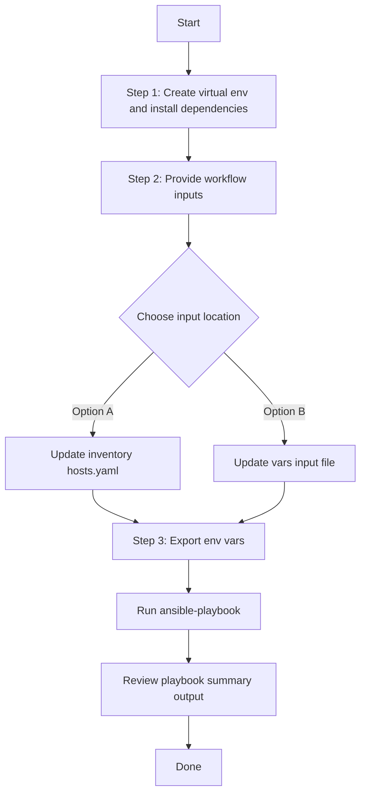

# SDA Fabric Sites Zones Config Generator

## Table of Contents

- [User Flow (3 Steps)](#user-flow-3-steps)

- [Overview](#overview)
- [Features](#features)
- [Prerequisites](#prerequisites)
- [Workflow Structure](#workflow-structure)
- [Schema Parameters](#schema-parameters)
- [Getting Started](#getting-started)
- [Operations](#operations)
- [Examples](#examples)

---
## Overview

The SDA Fabric Sites Zones Configuration Generator automates the creation of YAML configurations for existing fabric sites and zones deployed in Cisco Catalyst Center. This tool reduces the effort required to manually create Ansible playbooks by programmatically generating configurations from existing infrastructure.

---
## Features

- **Configuration Generation**: Generate YAML configurations compatible with `sda_fabric_sites_zones_workflow_manager` module.
Extract existing SDA fabric sites and zones configurations from your Cisco Catalyst Center
Convert them into properly formatted YAML files.
Generate files that are ready to use with Ansible automation.
- **Component Filtering**: Selective generation of fabric sites, fabric zones, or both components
- **Flexible Output**: Configurable file paths and naming conventions
- **Brownfield Support**: Extract configurations from existing Catalyst Center deployments
- **API Integration**: Leverages native Catalyst Center APIs for data retrieval
- **Authentication Profiles**: Includes authentication profile configurations for sites and zones

---
## Prerequisites

### Software Requirements

| Component | Version |
|-----------|---------|
| cisco.catalystcenter collection| 6.49.0+ |
| Python | 3.9+ |
| Cisco Catalyst Center SDK | 2.3.7.9+ |

### Required Collections

```bash
ansible-galaxy collection install cisco.catalystcenter
ansible-galaxy collection install ansible.utils
pip install catalystcentersdk
pip install yamale
```

### Access Requirements

- Catalyst Center admin credentials with SDA fabric read permissions
- Network connectivity to Catalyst Center API
- Firewall rules for HTTPS (443) and SSH (22) if needed
- SDA fabric sites and zones must be pre-configured in Catalyst Center

---

## Workflow Structure

```
sda_fabric_sites_zones_config_generator/
├── playbook/
│   └── sda_fabric_sites_zones_config_generator.yml    # Main configuration generator
├── vars/
│   └── sda_fabric_sites_zones_config_input.yml       # Input parameters and examples
├── schema/
│   └── sda_fabric_sites_zones_config_schema.yml      # Configuration validation
└── README.md
```

---

## Schema Parameters

### Top-Level Parameters

| Parameter | Type | Required | Default | Description |
|-----------|------|----------|---------|-------------|
| file_path | string | No | auto-generated | Output file path for YAML configuration file. Default filename: `sda_fabric_sites_zones_playbook_config_<YYYY-MM-DD_HH-MM-SS>.yml` |
| file_mode | string | No | overwrite | File write mode — `overwrite` replaces the file, `append` adds to it. Only applicable when `file_path` is provided. |
| config | dict | No | omitted (all components) | Configuration filters dict. When omitted, all fabric_sites and fabric_zones configurations are retrieved. When provided, `component_specific_filters` is mandatory. |

### Component Specific Filtering (within `config` parameter)

| Parameter      | Type | Required | Default | Description |
|--------------|------|----------|-------------|-----------|
| component_specific_filters | dict | Yes (when `config` provided) | N/A | Required when `config` is provided. Filters to specify which components to include. |
| components_list | list | Conditional | N/A | List of components to include. **Required when no component filter blocks are provided.** Empty list is invalid when no filter blocks exist. |
| fabric_sites | list | No | all sites | Filter fabric sites by specific criteria |
| fabric_zones | list | No | all zones | Filter fabric zones by specific criteria |

**Component Logic Rules:**
- **No `config`**: All components are retrieved (equivalent to both `fabric_sites` and `fabric_zones`)
- **`config` provided**: `component_specific_filters` is mandatory
- **Component filter blocks provided** (e.g., `fabric_sites`): Those components are automatically added to `components_list` when missing
- **No component filter blocks**: `components_list` is required and must not be empty

### Fabric Sites Sub-Filter Parameters

| Parameter          | Type  | Required | Default | Description |
|--------------------|------  |----------|---------|-------------|
| site_name_hierarchy | string | Yes     | N/A     | Full hierarchical site path to filter specific fabric site |

**Examples**:
- `"Global/USA/San Jose"` - Filters fabric site at San Jose location
- `"Global/Test_Fabric"` - Filters fabric site named Test_Fabric
- `"Global/Area/Building1"` - Filters fabric site at Building1

### Fabric Zones Sub-Filter Parameters

| Parameter           | Type  | Required | Default | Description |
|---------------------|-------|----------|---------|-------------|
| site_name_hierarchy | string| Yes      | N/A     | Full hierarchical zone path to filter specific fabric zone |

**Examples**:
- `"Global/USA/San Jose/Building1/Zone1"` - Filters fabric zone Zone1 in Building1
- `"Global/Test_Fabric/Bld1"` - Filters fabric zone Bld1 in Test_Fabric
- `"Global/Area/Building1/Floor2"` - Filters fabric zone Floor2 in Building1

---

## Getting Started

## Workflow Steps
## User Flow (3 Steps)



### Installation and Run (Aligned)

1. Create and activate a Python virtual environment, then install dependencies.

```bash
python3 -m venv .venv
source .venv/bin/activate
pip install -r requirements.txt
ansible-galaxy collection install cisco.catalystcenter --force
```

2. Provide workflow inputs in either inventory (`inventory/demo_lab/hosts.yaml`) or the workflow `vars/` file.

3. Export Catalyst Center environment variables and run the playbook.

```bash
export HOSTIP=<catalyst-center-ip-or-fqdn>
export CATALYST_CENTER_USERNAME=<username>
export CATALYST_CENTER_PASSWORD='<password>'
ansible-playbook -i ./inventory/demo_lab/hosts.yaml ./workflows/sda_fabric_sites_zones_config_generator/playbook/sda_fabric_sites_zones_config_generator.yml -vvvv
```

### Workflow Execution

The workflow follows these steps:

1. **Connect** to Catalyst Center using provided credentials
2. **Retrieve** existing fabric sites and zones via API calls
3. **Filter** components based on specified criteria
4. **Transform** API responses into Ansible-compatible format
5. **Generate** YAML configuration file with proper structure
6. **Validate** output file format and content

---

## Operations

### Generate Operations (state : gathered)

Use `sda_fabric_sites_zones_config_generator.yml` for generating yaml playbook configuration operations.


#### 1. Generate All Configurations

**Description**: Retrieves all fabric sites and fabric zones from Catalyst Center regardless of any filters.

```yaml
# No config at all - only DNAC connection details
# Expected: defaults to generates all configs
 sda_fabric_sites_zones_config:
   - file_path: "/tmp/complete_sda_fabric_sites_zones_config1.yaml"
```


#### 2. Component-Specific Generation

a.**Description**: Generates configuration for specific component type fabric sites only.


```yaml
# Test Fabric_sites filter 
sda_fabric_sites_zones_config:
  - file_path: "/tmp/fabric_sites_only.yaml"
    config:
      component_specific_filters:
        components_list: ["fabric_sites"]
```

b. **Description**: Generates configuration for specific component type fabric zones only.

```yaml
sda_fabric_sites_zones_config:
  - file_path: "/tmp/fabric_zones_only.yaml"
    config:
      component_specific_filters:
        components_list: ["fabric_zones"]
```

**Validate**
Validate Configuration: To ensure a successful execution of the playbooks with your specified inputs, follow these steps:
Input Validation: Before executing the playbook, it is essential to validate the input schema. This step ensures that all required parameters are included and correctly formatted. Run the following command ./tools/validate.sh -s to perform the validation providing the schema path -d and the input path.


```bash
# Validate

./tools/schemavalidation.sh -s workflows/sda_fabric_sites_zones_config_generator/schema/sda_fabric_sites_zones_config_schema.yml \
                            -d workflows/sda_fabric_sites_zones_config_generator/vars/sda_fabric_sites_zones_config_input.yml
```

Return result validate:

```bash
./tools/schemavalidation.sh -s workflows/sda_fabric_sites_zones_config_generator/schema/sda_fabric_sites_zones_config_schema.yml \
>       -d workflows/sda_fabric_sites_zones_config_generator/vars/sda_fabric_sites_zones_config_input.yml
workflows/sda_fabric_sites_zones_config_generator/schema/sda_fabric_sites_zones_config_schema.yml
workflows/sda_fabric_sites_zones_config_generator/vars/sda_fabric_sites_zones_config_input.yml
yamale   -s workflows/sda_fabric_sites_zones_config_generator/schema/sda_fabric_sites_zones_config_schema.yml  workflows/sda_fabric_sites_zones_config_generator/vars/sda_fabric_sites_zones_config_input.yml
Validating workflows/sda_fabric_sites_zones_config_generator/vars/sda_fabric_sites_zones_config_input.yml...
Validation success! 👍

```

```bash
# Execute
ansible-playbook -i inventory/demo_lab/hosts.yaml \
 workflows/sda_fabric_sites_zones_config_generator/playbook/sda_fabric_sites_zones_config_generator.yml \
  --extra-vars VARS_FILE_PATH=./workflows/sda_fabric_sites_zones_config_generator/vars/sda_fabric_sites_zones_config_input.yml
```

1.Generate All SDA Components

Terminal Return

```code
 components_processed: 2
        components_skipped: 0
        configurations_count: 9
        file_mode: overwrite
        file_path: /tmp/complete_sda_fabric_sites_zones_config1.yaml
        message: YAML configuration file generated successfully for module 'sda_fabric_sites_zones_workflow_manager'
        status: success
      status: success
```
2.Component-Specific Generation

a. fabric_sites filter
Terminal Return 

```code
 components_processed: 1
        components_skipped: 0
        configurations_count: 7
        file_mode: overwrite
        file_path: /tmp/fabric_sites_only.yaml
        message: YAML configuration file generated successfully for module 'sda_fabric_sites_zones_workflow_manager'
        status: success
      status: success
```
b. fabric_zones filter
Terminal Return 

```code
components_processed: 1
        components_skipped: 0
        configurations_count: 2
        file_mode: overwrite
        file_path: /tmp/fabric_zones_only.yaml
        message: YAML configuration file generated successfully for module 'sda_fabric_sites_zones_workflow_manager'
        status: success
      status: success
```

---

## Examples

### Example 1: Generate All SDA Components

```yaml

# Generate complete SDA fabric configuration
sda_fabric_sites_zones_config:
  - file_path: "/tmp/complete_sda_fabric_sites_zones_config1.yaml"
```

After running the playbook, the following YAML configuration is generated:

```yaml
---
config:
- fabric_sites:
  - site_name_hierarchy: Global/USA/SAN-FRANCISCO
    fabric_type: fabric_site
    is_pub_sub_enabled: true
    authentication_profile: No Authentication
  - site_name_hierarchy: Global/USA/SAN JOSE
    fabric_type: fabric_site
    is_pub_sub_enabled: true
    authentication_profile: Closed Authentication
  - site_name_hierarchy: Global/UK
    fabric_type: fabric_site
    is_pub_sub_enabled: false
    authentication_profile: No Authentication
  - site_name_hierarchy: Global/test_site_extranet
    fabric_type: fabric_site
    is_pub_sub_enabled: false
    authentication_profile: Low Impact
  - site_name_hierarchy: Global/USA/RTP
    fabric_type: fabric_site
    is_pub_sub_enabled: false
    authentication_profile: Closed Authentication
  - site_name_hierarchy: Global/USA/New York
    fabric_type: fabric_site
    is_pub_sub_enabled: true
    authentication_profile: No Authentication
  - site_name_hierarchy: Global/Mexico
    fabric_type: fabric_site
    is_pub_sub_enabled: false
    authentication_profile: No Authentication
  - site_name_hierarchy: Global/USA/SAN JOSE/SJ_BLD20
    fabric_type: fabric_zone
    authentication_profile: No Authentication
  - site_name_hierarchy: Global/USA/SAN JOSE/SJ_BLD21
    fabric_type: fabric_zone
    authentication_profile: No Authentication

```
### Example 2: Generate Fabric Sites Only

```yaml
---
# Generate fabric sites configuration only
sda_fabric_sites_zones_config:
  - file_path: "/tmp/fabric_sites_only.yaml"
    config:
      component_specific_filters:
        components_list: ["fabric_sites"]
```
After running the playbook, the following YAML configuration is generated:

```yaml
---
config:
- fabric_sites:
  - site_name_hierarchy: Global/USA/SAN-FRANCISCO
    fabric_type: fabric_site
    is_pub_sub_enabled: true
    authentication_profile: No Authentication
  - site_name_hierarchy: Global/USA/SAN JOSE
    fabric_type: fabric_site
    is_pub_sub_enabled: true
    authentication_profile: Closed Authentication
  - site_name_hierarchy: Global/UK
    fabric_type: fabric_site
    is_pub_sub_enabled: false
    authentication_profile: No Authentication
  - site_name_hierarchy: Global/test_site_extranet
    fabric_type: fabric_site
    is_pub_sub_enabled: false
    authentication_profile: Low Impact
  - site_name_hierarchy: Global/USA/RTP
    fabric_type: fabric_site
    is_pub_sub_enabled: false
    authentication_profile: Closed Authentication
  - site_name_hierarchy: Global/USA/New York
    fabric_type: fabric_site
    is_pub_sub_enabled: true
    authentication_profile: No Authentication
  - site_name_hierarchy: Global/Mexico
    fabric_type: fabric_site
    is_pub_sub_enabled: false
    authentication_profile: No Authentication
```
### Example 3: Generate Fabric Zones Only

```yaml
---
# Generate fabric zones configuration only
sda_fabric_sites_zones_config:
  - file_path: "/tmp/fabric_zones_only.yaml"
    config:
      component_specific_filters:
        components_list: ["fabric_zones"]
```

```yaml
---
config:
- fabric_sites:
  - site_name_hierarchy: Global/USA/SAN JOSE/SJ_BLD20
    fabric_type: fabric_zone
    authentication_profile: No Authentication
  - site_name_hierarchy: Global/USA/SAN JOSE/SJ_BLD21
    fabric_type: fabric_zone
    authentication_profile: No Authentication

```

### Example 4: Default Output Path

**Output**: Auto-generates filename like `sda_fabric_sites_zones_playbook_config_2026-01-28_20-24-06.yml`

```yaml
---
# Generate with auto-generated filename
sda_fabric_sites_zones_config:
  - config:
      component_specific_filters:
        components_list: ["fabric_sites", "fabric_zones"]
```


### Example 5: Fabric Sites with Specific Site Filter

**Description**: Generates configuration only for the fabric site at "Global/Test_Fabric" location.


```yaml
---
# Generate fabric sites configuration for specific site
sda_fabric_sites_zones_config: 
  - file_path: "/tmp/specific_fabric_site_config.yaml"
    config:
      component_specific_filters:
        components_list: ["fabric_sites"]
        fabric_sites:
          - site_name_hierarchy: "Global/Test_Fabric"
```


### Example 6: Fabric Zones with Specific Zone Filter

**Description**: Generates configuration only for the fabric zone at "Global/Test_Fabric/Bld1" location.


```yaml
---
# Generate fabric zones configuration for specific zone
sda_fabric_sites_zones_config:
  - file_path: "/tmp/specific_fabric_zone_config.yaml"
    config:
      component_specific_filters:
        components_list: ["fabric_zones"]
        fabric_zones:
          - site_name_hierarchy: "Global/Test_Fabric/Bld1"
```


### Example 7: Combined Sites and Zones with Specific Filters

**Description**: Generates configuration for both a specific fabric site and a specific fabric zone.


```yaml
---
# Generate both fabric sites and zones with specific filters
sda_fabric_sites_zones_config:
  - file_path: "/tmp/filtered_sites_and_zones_config.yaml"
    config:
      component_specific_filters:
        components_list: ["fabric_sites", "fabric_zones"]
        fabric_sites:
          - site_name_hierarchy: "Global/Test_Fabric"
        fabric_zones:
          - site_name_hierarchy: "Global/Test_Fabric/Bld1"
```


## Additional Resources

- [Cisco Catalyst Center Documentation](https://www.cisco.com/c/en/us/support/cloud-systems-management/dna-center/series.html)
- [Cisco DNA Center SDK](https://catalystcentersdk.readthedocs.io/)
- [Ansible Documentation](https://docs.ansible.com/)
