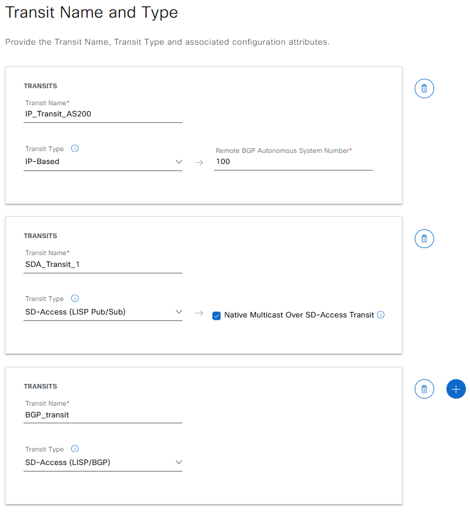
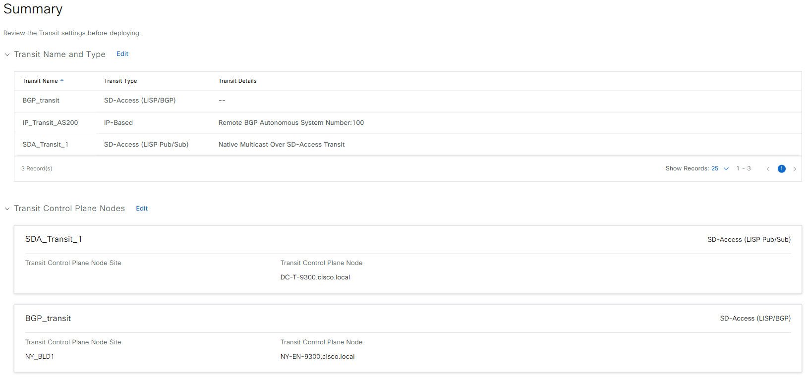
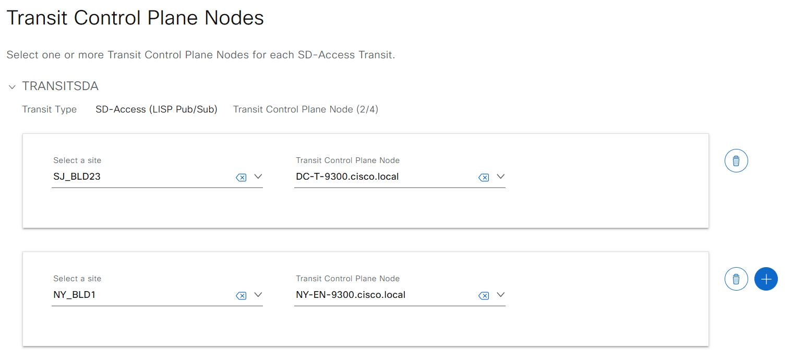
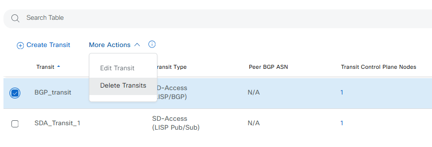

# Catalyst Center SDA Fabric transits (IP/SDA) workflow

## Fabric Transits

### Transits
A transit is a site that interconnects two or more fabric sites or connects the fabric site with external networks (Internet, data center, and so on). There are two types of transit networks:

### IP transit
Uses a regular IP network to connect to an external network or to connect two or more fabric sites. It leverages a traditional IP-based (VRF-LITE, MPLS) network, which requires remapping of VRFs and SGTs between sites.

### SD-Access transit
Uses LISP/VxLAN encapsulation to connect two fabric sites. The SD-Access transit area may be defined as a portion of the fabric that has its own control plane nodes, but does not have edge or border nodes. However, it can work with a fabric that has an external border. With an SD-Access transit, an end-to-end policy plane is maintained using SGT group tags.

## Before you begin

### Prepare Your Ansible Environment
- Install ansible if you haven't already installed 
- Ensure you have network connectivity to your Catalyst Center instance
- Checkout the project and playbooks: git@github.com:cisco-en-programmability/catalyst-center-ansible-iac.git

###  Configure Hosts Inventory
- Update hosts.yml with the connection details of your DNA Center instance. 

#### The Sample host_inventory_dnac1/hosts.yml

```bash
catalyst_center_hosts:
    hosts:
        catalyst_center:
            dnac_host: xx.xx.xx.xx.
            dnac_password: XXXXXXXX
            dnac_port: 443
            dnac_timeout: 60
            dnac_username: admin
            dnac_verify: false
            dnac_version: 2.3.7.6
            dnac_debug: true
            dnac_log_level: INFO
            dnac_log: true
```

### Note:
1. You can’t add an SD-Access (LISP Pub/Sub) transit to a fabric site that uses LISP/BGP control plane. You can’t add SD-Access (LISP/BGP) transit to a fabric site that uses LISP Pub/Sub control plane.

2. To complete the native multicast configuration over multiple sites that are connected to the SD-Access transit, ensure that you enable multicast over SD-Access transit on the border nodes.

3. To create SD-Access Transit at least one Transit CP device must be provided. 

## Create Fabric transits
=======
- Playbook: workflows/sda_fabric_transits/playbook/playbook/sda_fabric_transits_workflow_playbook.yml
- Schema: workflows/sda_fabric_transits/schema/sda_fabric_transits_workflow_schema.yml
- Input Variables: [Title](vars/sda_fabric_transits_workflow_inputs.yml)

### Input example for Create IP based transit, Lisp PUB/SUB Transit and Lisp BGP transits

``` yaml
fabric_transits:
  - sda_fabric_transits:
      - ip_transit_settings:
          autonomous_system_number: "100"
          routing_protocol_name: BGP
        name: IP_Transit_AS200
        transit_type: IP_BASED_TRANSIT
      - sda_transit_settings:
          control_plane_network_device_ips:
            - 204.1.2.5
          is_multicast_over_transit_enabled: true
        name: SDA_Transit_1
        transit_type: SDA_LISP_PUB_SUB_TRANSIT
      - sda_fabric_transits:
        - name: BGP_transit
        transit_type: SDA_LISP_BGP_TRANSIT
        sda_transit_settings:
          control_plane_network_device_ips:
          - 204.1.2.5
```



### Command to validate and running the playbook

#### Validate the input
``` bash
yamale -s workflows/sda_fabric_transits/schema/sda_fabric_transits_workflow_schema.yml workflows/sda_fabric_transits/vars/sda_fabric_transits_workflow_inputs.yml
```
#### Running the playbook
``` bash
ansible-playbook -i inventory/iac2/host.yml  workflows/sda_fabric_transits/playbook/sda_fabric_transits_workflow_playbook.yml --e  VARS_FILE_PATH=../vars/sda_fabric_transits_workflow_inputs.yml > logs/transits.log -vvvvvv  
```

## Edit/Update Fabric transits
- Playbook: workflows/sda_fabric_transits/playbook/playbook/sda_fabric_transits_workflow_playbook.yml
- Schema: workflows/sda_fabric_transits/schema/sda_fabric_transits_workflow_schema.yml
- Input Variables: [Title](vars/sda_fabric_transits_workflow_inputs.yml)

### Input example for Edit/Update IP based transit, Lisp PUB/SUB Transit and Lisp BGP transits

- SDA Transit are not allowed to change the autonomous_system_number of IP Based Transits after created
- Add/Remove 2nd or more Control Plane Node are allowed in Lisp PUB/SUB Transit and Lisp BGP transits. Just change the IP address of device

``` yaml
fabric_transits:
  - sda_fabric_transits:
      - sda_transit_settings:
          control_plane_network_device_ips:
            - 204.1.2.5
          is_multicast_over_transit_enabled: true
        name: SDA_Transit_1
        transit_type: SDA_LISP_PUB_SUB_TRANSIT
      - sda_fabric_transits:
        - name: BGP_transit
        transit_type: SDA_LISP_BGP_TRANSIT
        sda_transit_settings:
          control_plane_network_device_ips:
          - 204.1.2.5
```


### Command to validate and running the playbook

#### Validate the input
``` bash
yamale -s workflows/sda_fabric_transits/schema/sda_fabric_transits_workflow_schema.yml workflows/sda_fabric_transits/vars/sda_fabric_transits_workflow_inputs.yml
```
#### Running the playbook
``` bash
ansible-playbook -i inventory/iac2/host.yml  workflows/sda_fabric_transits/playbook/sda_fabric_transits_workflow_playbook.yml --e  VARS_FILE_PATH=../vars/sda_fabric_transits_workflow_inputs.yml > logs/transits.log -vvvvvv  
```

## Delete Fabric transits: Running the Playbook
- Playbook: workflows/sda_fabric_transits/playbook/delete_sda_fabric_transits_workflow_playbook.yml
- Schema: workflows/sda_fabric_transits/schema/sda_fabric_transits_workflow_schema.yml
- Input Variables: [Title](vars/sda_fabric_transits_workflow_inputs.yml)

### Input example for delete transits


``` yaml
fabric_transits:
  - sda_fabric_transits:
    - name: Transit_AS200
    - name: SDA_Transit_1
    - name: BGP_transit
```

1. **Validate Your Input**

```bash
yamale -s workflows/sda_fabric_transits/schema/sda_fabric_transits_workflow_schema.yml workflows/sda_fabric_transits/vars/sda_fabric_transits_workflow_inputs.yml
```
2. **Execute the Playbook**
- ``User inputs``: **./workflows/sda_fabric_transits/vars/fabric_sites_zones_inputs.yml**
- ``Playbook``: **workflows/sda_fabric_transits/playbook/fabric_extranet_policy_playbook.yml**
```bash
ansible-playbook -i host_inventory_dnac1/hosts.yml workflows/sda_fabric_transits/playbook/sda_fabric_transits_workflow_playbook.yml --e VARS_FILE_PATH=<your input file>
```
###  To create or update the fabric transits and zones example
```bash
ansible-playbook -i host_inventory_dnac1/hosts.yml workflows/sda_fabric_transits/playbook/sda_fabric_transits_workflow_playbook.yml --e VARS_FILE_PATH=../vars/sda_fabric_transits_workflow_inputs.yml
```
###  To delete existing fabric transits
```bash
 ansible-playbook -i host_inventory_dnac1/hosts.yml workflows/sda_fabric_transits/playbook/delete_sda_fabric_transits_workflow_playbook.yml --e VARS_FILE_PATH=../vars/sda_fabric_transits_workflow_inputs.yml
```
## References

``` yaml
  dnac_version: 2.3.7.6
  dnacentersdk: 2.8.3
  cisco.dnac: 6.29.0
```

## Important Notes
Refer to the Catalyst Center documentation for detailed instructions on configuring fabric sites and fabric transits and using the Ansible playbooks.
Consider backing up your configuration before running the playbooks, especially the delete playbook.
If you encounter any issues, review the Ansible playbook output for error messages and consult the Catalyst Center documentation or support resources.
