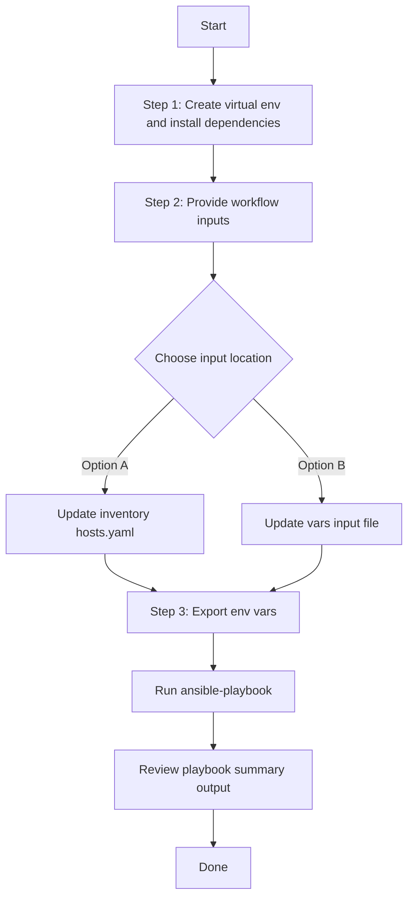

# SDA Fabric Transits Config Generator

## Table of Contents

- [User Flow (3 Steps)](#user-flow-3-steps)
- [Overview](#overview)
- [Features](#features)
- [Prerequisites](#prerequisites)
- [Workflow Structure](#workflow-structure)
- [Schema Parameters](#schema-parameters)
- [Getting Started](#getting-started)
- [Operations](#operations)
- [Examples](#examples)

---

## Overview

The SDA Fabric Transits Config Generator automates YAML configurations for existing SDA transit networks in Cisco Catalyst Center. It extracts transit configurations using the `sda_fabric_transits_playbook_config_generator` module and generates output compatible with `sda_fabric_transits_workflow_manager` for brownfield export, audit, and migration workflows.

---
## Features

- **Brownfield Discovery**: Omit `config` parameter to generate all SDA fabric transit configurations
- **Selective Filtering**: Filter transits by exact name matches and/or transit types
- **Component-Based Generation**: Generate specific components using `components_list` 
- **Auto-Population**: Components automatically added to `components_list` when filters provided
- **Flexible Output**: Custom file paths with overwrite/append modes
- **Idempotent Operations**: Content comparison prevents unnecessary file writes
- **Comprehensive Coverage**: Includes IP-based, SDA LISP Pub/Sub, and SDA LISP BGP transits

---

## Prerequisites

### Software Requirements

| Component | Version |
|-----------|---------|
| Ansible | 2.13+ |
| cisco.catalystcenter collection | 6.49.0+ |
| Python | 3.9+ |
| Cisco Catalyst Center | 2.3.7.9+ |
| catalystcentersdk | 2.3.7.9+ |

### Required Collections

```bash
ansible-galaxy collection install cisco.catalystcenter
ansible-galaxy collection install ansible.utils
pip install catalystcentersdk
pip install yamale
```

### Access Requirements

- Catalyst Center credentials with SDA fabric API access
- Network connectivity to Catalyst Center API endpoints
- Existing SDA fabric transits (for filtered export use cases)
- Read permissions for sites, devices, and SDA fabric configurations

---

## Workflow Structure

```
sda_fabric_transits_config_generator/
├── playbook/
│   └── sda_fabric_transits_config_generator.yml   # Main workflow playbook
├── vars/
│   └── sda_fabric_transits_config_inputs.yml      # Input configuration examples
├── schema/
│   └── sda_fabric_transits_config_schema.yml      # Input validation schema
└── README.md                                        # This documentation
```

---

## Schema Parameters

### Basic Configuration

| Parameter | Type | Required | Default | Description | Examples |
|-----------|------|----------|---------|-------------|-----------|
| `file_path` | string | No | auto-generated | Output file path for generated YAML. Auto-generates timestamped filename if omitted: `sda_fabric_transits_playbook_config_<YYYY-MM-DD_HH-MM-SS>.yml` | `"/tmp/sda_transits_backup.yml"` |
| `file_mode` | string | No | `"overwrite"` | File write mode. `"overwrite"` replaces file content, `"append"` adds to existing file. | `"append"` |
| `config` | dict | No | omitted (all components) | Configuration filters dict. When omitted or empty, all SDA fabric transit configurations are retrieved. When provided, `component_specific_filters` is mandatory. |
| `component_specific_filters` | dict | No | omitted | Component filters passed to module `config` parameter. Required when selective generation needed. | See component filters below |

### Component specific Filtering (within `config` parameter)

| Parameter | Type | Required | Elements | Description | Examples |
|-----------|------|----------|----------|-------------|-----------|
| `component_specific_filters` | dict | Yes (when `config` provided) | N/A | Required when `config` is provided. Filters to specify which components to include. |
| `components_list` | list[str] | No | str | List of components to generate. Valid values: `["sda_fabric_transits"]`. Auto-populated when component filters provided. | `["sda_fabric_transits"]` |
| `sda_fabric_transits` | list[dict] | No | dict | Transit filter objects containing `name` and/or `transit_type` criteria. Multiple entries create OR conditions. | See transit filters below |

### Transit Filters

| Parameter | Type | Required | Description | Examples |
|-----------|------|----------|-------------|-----------|
| `name` | string | No | Transit name for exact matching. Case-sensitive exact match against Catalyst Center transit names. | `"IP-Transit-West"`, `"SDA-BGP-Transit-East"` |
| `transit_type` | string | No | Transit type filter. Valid values: `"IP_BASED_TRANSIT"`, `"SDA_LISP_PUB_SUB_TRANSIT"`, `"SDA_LISP_BGP_TRANSIT"` | `"IP_BASED_TRANSIT"` |

### Transit Type Values

| Transit Type | Description | Use Case |
|-------------|-------------|----------|
| `IP_BASED_TRANSIT` | IP-based fabric transit networks | Traditional IP routing between fabric sites |
| `SDA_LISP_PUB_SUB_TRANSIT` | SDA LISP Publisher/Subscriber transit | LISP-based fabric interconnect with pub/sub model |
| `SDA_LISP_BGP_TRANSIT` | SDA LISP BGP-based transit | LISP fabric with BGP routing protocol |


---

## Getting Started

## Workflow Steps
## User Flow (3 Steps)



### Installation and Run (Aligned)

1. Create and activate a Python virtual environment, then install dependencies.

```bash
python3 -m venv .venv
source .venv/bin/activate
pip install -r requirements.txt
ansible-galaxy collection install cisco.catalystcenter --force
```

2. Provide workflow inputs in either inventory (`inventory/demo_lab/hosts.yaml`) or the workflow `vars/` file.

3. Export Catalyst Center environment variables and run the playbook.

```bash
export HOSTIP=<catalyst-center-ip-or-fqdn>
export CATALYST_CENTER_USERNAME=<username>
export CATALYST_CENTER_PASSWORD='<password>'
ansible-playbook -i ./inventory/demo_lab/hosts.yaml ./workflows/sda_fabric_transits_config_generator/playbook/sda_fabric_transits_config_generator.yml -vvvv
```


## Operations

### Generate Operations (state: gathered)

Use `sda_fabric_transits_config_generator.yml` for all generation tasks.

1. **Generate all transit networks**
```yaml
# No config at all - only DNAC connection details
# Expected: defaults to generates all configs
 sda_fabric_transits_config:
   - file_path: "/tmp/sda_fabric_transits_complete_config.yml"
```

2. **Generate transits by name**

```yaml
sda_fabric_transits_config:
  - file_path: "/tmp/sda_fabric_transits_by_name.yml"
    config:
      component_specific_filters:
        components_list: ["sda_fabric_transits"]
        sda_fabric_transits:
          - name: "ip_transit_2"
```

3. **Generate transits by transit type**
```yaml
sda_fabric_transits_config:
  - file_path: "/tmp/sda_fabric_transits_lisp_pub_only.yml"
    config:
      component_specific_filters:
        components_list: ["sda_fabric_transits"]
        sda_fabric_transits:
          - transit_type: "SDA_LISP_PUB_SUB_TRANSIT"
```


**Validate and Execute:**
Validate Configuration: To ensure a successful execution of the playbooks with your specified inputs, follow these steps:
Input Validation: Before executing the playbook, validate the input schema so the workflow shape matches the module contract.


```bash
# Validate
./tools/schemavalidation.sh -s workflows/sda_fabric_transits_config_generator/schema/sda_fabric_transits_config_schema.yml \
                            -d workflows/sda_fabric_transits_config_generator/vars/sda_fabric_transits_config_inputs.yml

```

Return result validate:
```bash
(pyats-nalakkam) [nalakkam@st-ds-4 dnac_ansible_workflows]$ ./tools/schemavalidation.sh -s workflows/sda_fabric_transits_config_generator/schema/sda_fabric_transits_config_schema.yml  -d workflows/sda_fabric_transits_config_generator/vars/sda_fabric_transits_config_inputs.yml
workflows/sda_fabric_transits_config_generator/schema/sda_fabric_transits_config_schema.yml
workflows/sda_fabric_transits_config_generator/vars/sda_fabric_transits_config_inputs.yml
yamale   -s workflows/sda_fabric_transits_config_generator/schema/sda_fabric_transits_config_schema.yml  workflows/sda_fabric_transits_config_generator/vars/sda_fabric_transits_config_inputs.yml
Validating workflows/sda_fabric_transits_config_generator/vars/sda_fabric_transits_config_inputs.yml...
Validation success! 👍

```

```bash
# Execute
ansible-playbook -i inventory/demo_lab/hosts.yaml \
  workflows/sda_fabric_transits_config_generator/playbook/sda_fabric_transits_config_generator.yml \
  --extra-vars VARS_FILE_PATH=./workflows/sda_fabric_transits_config_generator/vars/sda_fabric_transits_config_inputs.yml
```

1.**Generate All Configurations**

Terminal Return 

```code
response:
        components_processed: 1
        components_skipped: 0
        configurations_count: 1
        file_mode: overwrite
        file_path: /tmp/sda_fabric_transits_complete_config.yml
        message: YAML configuration file generated successfully for module 'sda_fabric_transits_workflow_manager'
        status: success
      status: success
```
2. **Generate transits by name**

Terminal Return 

```code
response:
        components_processed: 1
        components_skipped: 0
        configurations_count: 1
        file_mode: overwrite
        file_path: /tmp/sda_fabric_transits_by_name.yml
        message: YAML configuration file generated successfully for module 'sda_fabric_transits_workflow_manager'
        status: success
      status: success
```

3. **Generate transits by transit type**

Terminal Return 

```code
response:
        components_processed: 1
        components_skipped: 0
        configurations_count: 1
        file_mode: overwrite
        file_path: /tmp/sda_fabric_transits_lisp_pub_only.yml
        message: YAML configuration file generated successfully for module 'sda_fabric_transits_workflow_manager'
        status: success
      status: success
```
---

## Examples

### Example 1: Generate all SDA fabric transit configurations

```yaml
sda_fabric_transits_config:
   - file_path: "/tmp/sda_fabric_transits_complete_config.yml"
```

After running the playbook, the following YAML configuration is generated:


```yaml
---
config:
- sda_fabric_transits:
  - name: test_fabric
    transit_site_hierarchy: Global
    transit_type: IP_BASED_TRANSIT
    ip_transit_settings:
      routing_protocol_name: BGP
      autonomous_system_number: '143'
  - name: TRANSITSDA
    transit_site_hierarchy: Global
    transit_type: SDA_LISP_PUB_SUB_TRANSIT
    sda_transit_settings:
      is_multicast_over_transit_enabled: false
      control_plane_network_device_ips:
      - 204.1.2.5
  - name: sample_transit3
    transit_site_hierarchy: Global
    transit_type: IP_BASED_TRANSIT
    ip_transit_settings:
      routing_protocol_name: BGP
      autonomous_system_number: '1756'
  - name: ip_transit_12
    transit_site_hierarchy: Global/USA/New York
    transit_type: IP_BASED_TRANSIT
    ip_transit_settings:
      routing_protocol_name: BGP
      autonomous_system_number: '502'
  - name: iptransit
    transit_site_hierarchy: Global
    transit_type: IP_BASED_TRANSIT
    ip_transit_settings:
      routing_protocol_name: BGP
      autonomous_system_number: '200'
  - name: ip_transit_4
    transit_site_hierarchy: Global
    transit_type: IP_BASED_TRANSIT
    ip_transit_settings:
      routing_protocol_name: BGP
      autonomous_system_number: '1114'
  - name: ip_transit_5
    transit_site_hierarchy: Global
    transit_type: IP_BASED_TRANSIT
    ip_transit_settings:
      routing_protocol_name: BGP
      autonomous_system_number: '1115'
  - name: ip_transit_3
    transit_site_hierarchy: Global
    transit_type: IP_BASED_TRANSIT
    ip_transit_settings:
      routing_protocol_name: BGP
      autonomous_system_number: '1113'
  - name: ip_transit_2
    transit_site_hierarchy: Global
    transit_type: IP_BASED_TRANSIT
    ip_transit_settings:
      routing_protocol_name: BGP
      autonomous_system_number: '1111'
```

### Example 2: Filter by transit names

```yaml
sda_fabric_transits_config:
  - file_path: "/tmp/sda_fabric_transits_by_name.yml"
    config:
      component_specific_filters:
        components_list: ["sda_fabric_transits"]
        sda_fabric_transits:
          - name: "ip_transit_2"
```
After running the playbook, the following YAML configuration is generated:

```yaml
---
config:
- sda_fabric_transits:
  - name: ip_transit_2
    transit_site_hierarchy: Global
    transit_type: IP_BASED_TRANSIT
    ip_transit_settings:
      routing_protocol_name: BGP
      autonomous_system_number: '1111'
```

### Example 3: Filter by transit type

```yaml
sda_fabric_transits_config:
  - file_path: "/tmp/sda_fabric_transits_lisp_pub_only.yml"
    component_specific_filters:
      components_list: ["sda_fabric_transits"]
      sda_fabric_transits:
        - transit_type: "SDA_LISP_PUB_SUB_TRANSIT"
```
After running the playbook, the following YAML configuration is generated:

```yaml
---
config:
- sda_fabric_transits:
  - name: TRANSITSDA
    transit_site_hierarchy: Global
    transit_type: SDA_LISP_PUB_SUB_TRANSIT
    sda_transit_settings:
      is_multicast_over_transit_enabled: false
      control_plane_network_device_ips:
      - 204.1.2.5
```

### Example 4: Multiple Transit Types

```yaml
sda_fabric_transits_config:
  - file_path: "/tmp/sda_fabric_transits_types_only.yml"
    component_specific_filters:
      sda_fabric_transits:
        - transit_type: "IP_BASED_TRANSIT"
        - transit_type: "SDA_LISP_PUB_SUB_TRANSIT"

```

### Example 5: Combined Name and Type Filters (AND Condition)

```yaml
sda_fabric_transits_config:
  - file_path: "/tmp/sda_fabric_transits_test2.yml"
    component_specific_filters:
      sda_fabric_transits:
        - transit_type: IP_BASED_TRANSIT
            name: ip_transit_5
        - name: "TRANSITSDA"
            transit_type: "SDA_LISP_PUB_SUB_TRANSIT"
```
---

## Additional Resources

- [Cisco Catalyst Center Documentation](https://www.cisco.com/c/en/us/support/cloud-systems-management/dna-center/series.html)
- [Cisco DNA Center SDK](https://catalystcentersdk.readthedocs.io/)
- [Ansible Documentation](https://docs.ansible.com/)
