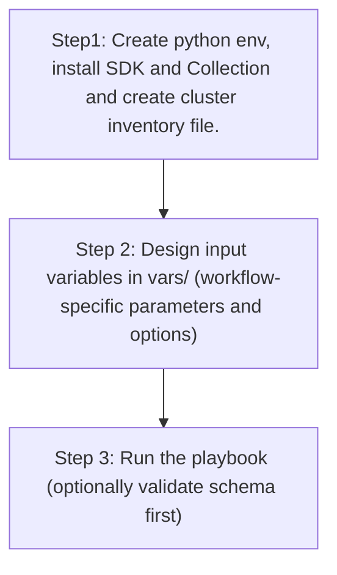

# SDA Fabric Transits Config Generator

## Table of Contents

- [User Flow (3 Steps)](#user-flow-3-steps)

- [Overview](#overview)
- [Features](#features)
- [Prerequisites](#prerequisites)
- [Workflow Structure](#workflow-structure)
- [Schema Parameters](#schema-parameters)
- [Getting Started](#getting-started)
- [Operations](#operations)
- [Examples](#examples)---

## Overview

The SDA Fabric Transits config generator automates YAML playbook generation for existing SDA transit networks in Cisco Catalyst Center. It generates output compatible with `sda_fabric_transits_workflow_manager` for brownfield export, audit, and migration workflows.

---

## Features

- **Configuration Generation**: Generate YAML configurations compatible with `sda_fabric_transits_workflow_manager`.
  - Extract existing SDA transit network definitions from Catalyst Center.
  - Convert API responses into playbook-ready YAML.
  - Reuse generated files for backup and migration.
- **Component Filtering**: Generate `sda_fabric_transits` selectively.
- **Transit Filtering**: Filter transit networks by `name` and/or `transit_type`.
- **Flexible Output**: Supports custom `file_path` and `file_mode` (`overwrite` / `append`).
- **Brownfield Discovery**: Omit `config` (or use workflow convenience flag) to generate all transit configurations.

---

## Prerequisites

### Software Requirements

| Component | Version |
|-----------|---------|
| Ansible | 2.13+ |
| cisco.dnac collection | 6.44.0+ |
| Python | 3.9+ |
| Cisco Catalyst Center | 2.3.7.9+ |
| dnacentersdk | 2.3.7.9+ |

### Required Collections

```bash
ansible-galaxy collection install cisco.dnac
ansible-galaxy collection install ansible.utils
pip install dnacentersdk
pip install yamale
```

### Access Requirements

- Catalyst Center credentials with SDA transit API access
- Network connectivity to Catalyst Center
- Existing SDA fabric transits (for filtered export use cases)

---

## Workflow Structure

```
sda_fabric_transits_config_generator/
├── playbook/
│   └── sda_fabric_transits_config_generator.yml   # Main operations
├── vars/
│   └── sda_fabric_transits_config_inputs.yml      # Input examples
├── schema/
│   └── sda_fabric_transits_config_schema.yml      # Input validation
└── README.md
```

---

## Schema Parameters

### Basic Configuration

| Parameter | Type | Required | Default | Description |
|-----------|------|----------|---------|-------------|
| `generate_all_configurations` | boolean | No | false | Workflow convenience flag. When true, playbook omits module `config` |
| `file_path` | string | No | auto-generated | Output file path for generated YAML |
| `file_mode` | string | No | `overwrite` | File write mode: `overwrite` or `append` |
| `component_specific_filters` | dict | No | omitted | Component and filters passed to module `config` |

### Component Filters

| Parameter | Type | Required | Description |
|-----------|------|----------|-------------|
| `components_list` | list[string] | No | Supported value: `sda_fabric_transits` |
| `sda_fabric_transits` | list[dict] | No | Transit filters (`name`, `transit_type`) |

### Transit Type Values

- `IP_BASED_TRANSIT`
- `SDA_LISP_PUB_SUB_TRANSIT`
- `SDA_LISP_BGP_TRANSIT`

---

## Getting Started

## Workflow Steps

## User Flow (3 Steps)



### Step 1: Configure Inventory

Example `inventory/demo_lab/hosts.yml`:

```yaml
catalyst_center_hosts:
  hosts:
    catalyst_center_primary:
      catalyst_center_host: 10.0.0.0
      catalyst_center_username: admin
      catalyst_center_password: "password"
      catalyst_center_port: 443
      catalyst_center_verify: false
      catalyst_center_version: 2.3.7.9
```

### Step 2: Configure Variables

Edit:
`workflows/sda_fabric_transits_config_generator/vars/sda_fabric_transits_config_inputs.yml`

```yaml
sda_fabric_transits_config:
  - generate_all_configurations: true
    file_path: "/tmp/sda_fabric_transits_complete_config.yml"
```

### Step 3: Validate Configuration

```bash
./tools/validate.sh -s workflows/sda_fabric_transits_config_generator/schema/sda_fabric_transits_config_schema.yml \
  -d workflows/sda_fabric_transits_config_generator/vars/sda_fabric_transits_config_inputs.yml
```

### Step 4: Execute Playbook

#### Option A: Vars file input (recommended)

```bash
ansible-playbook -i inventory/demo_lab/hosts.yaml \
  workflows/sda_fabric_transits_config_generator/playbook/sda_fabric_transits_config_generator.yml \
  --extra-vars VARS_FILE_PATH=./workflows/sda_fabric_transits_config_generator/vars/sda_fabric_transits_config_inputs.yml \
  -vvvv
```

#### Option B: Inventory / host variable input

Omit `VARS_FILE_PATH` and define `sda_fabric_transits_config` in inventory or `host_vars`.

---

## Operations

### Generate Operations (state: gathered)

Use `sda_fabric_transits_config_generator.yml` for all generation tasks.

1. **Generate all transit networks**
- Set `generate_all_configurations: true`.

2. **Generate transits by name**
- Use `component_specific_filters.sda_fabric_transits[].name`.

3. **Generate transits by transit type**
- Use `component_specific_filters.sda_fabric_transits[].transit_type`.

4. **Append generated output**
- Set `file_mode: append`.

---

## Examples

### Example 1: Generate all SDA fabric transit configurations

```yaml
sda_fabric_transits_config:
  - generate_all_configurations: true
    file_path: "/tmp/sda_fabric_transits_complete_config.yml"
```

### Example 2: Filter by transit names

```yaml
sda_fabric_transits_config:
  - file_path: "/tmp/sda_fabric_transits_by_name.yml"
    component_specific_filters:
      components_list: ["sda_fabric_transits"]
      sda_fabric_transits:
        - name: "IP-Transit-West"
        - name: "SDA-BGP-Transit-East"
```

### Example 3: Filter by transit type

```yaml
sda_fabric_transits_config:
  - file_path: "/tmp/sda_fabric_transits_ip_based_only.yml"
    component_specific_filters:
      components_list: ["sda_fabric_transits"]
      sda_fabric_transits:
        - transit_type: "IP_BASED_TRANSIT"
```

---

## Notes

- `sda_fabric_transits_playbook_config_generator` expects `config` as a dictionary when filters are used.
- This workflow omits `config` when filters are absent, which triggers full generation mode.
- If `sda_fabric_transits` filters are provided without `components_list`, the module auto-populates `components_list` internally.
