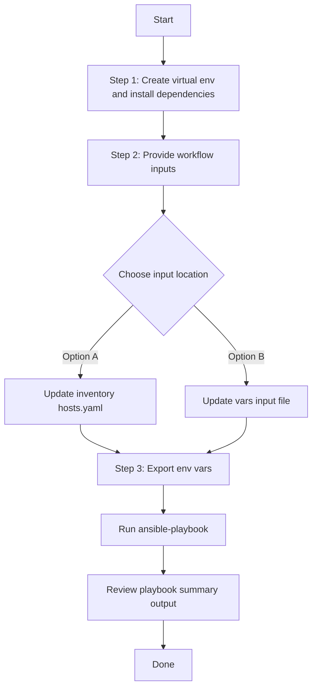

# SDA Fabric Virtual Networks Playbook Config Generator

## Table of Contents

- [User Flow (3 Steps)](#user-flow-3-steps)

- [Overview](#overview)
- [Features](#features)
- [Prerequisites](#prerequisites)
- [Workflow Structure](#workflow-structure)
- [Schema Parameters](#schema-parameters)
- [Getting Started](#getting-started)
- [Operations](#operations)
- [Examples](#examples)

---
## Overview

The SDA Fabric Virtual Networks config generator automates the creation of YAML configurations for existing fabric vlans,virtual networks and anycast gateways deployed in Cisco Catalyst Center. This tool reduces the effort required to manually create Ansible playbooks by programmatically generating configurations from existing infrastructure.

---
## Features

- **Configuration Generation**: Generate YAML configurations compatible with `sda_fabric_virtual_networks_workflow_manager` module.
Extract existing SDA fabric VLANs, virtual networks, or anycast gateways configurations from your Cisco Catalyst Center.
Convert them into properly formatted YAML files.
Generate files that are ready to use with Ansible automation.
- **Component Filtering**: Selective generation of fabric VLANs, virtual networks, or anycast gateways
- **Flexible Output**: Configurable file paths and naming conventions
- **Brownfield Support**: Extract configurations from existing Catalyst Center deployments
- **API Integration**: Leverages native Catalyst Center APIs for data retrieval
---

## Prerequisites

### Software Requirements

| Component | Version |
|-----------|---------|
| cisco.dnac collection | 6.49.0+ |
| Python | 3.9+ |
| Cisco Catalyst Center SDK | 2.3.7.9+ |

### Required Collections

```bash
ansible-galaxy collection install cisco.dnac
ansible-galaxy collection install ansible.utils
pip install dnacentersdk
pip install yamale
```

### Access Requirements

- Catalyst Center admin credentials
- Network connectivity to Catalyst Center API
- SDA fabric infrastructure deployed and configured
- Existing fabric VLANs, virtual networks, and anycast gateways

---

## Workflow Structure

```
sda_fabric_virtual_networks_config_generator/
├── playbook/
│   └── sda_fabric_virtual_networks_config_generator.yml   # Main operations
├── vars/
│   ├── sda_fabric_virtual_networks_config_inputs.yml     # Configuration examples
├── schema/
│   └── sda_fabric_virtual_networks_config_schema.yml     # Input validation
└── README.md                                                
```

---

## Schema Parameters

### Top-Level Parameters

| Parameter | Type | Required | Default | Description |
|-----------|------|----------|---------|-------------|
| file_path | string | No | auto-generated | Output file path for YAML configuration file. Default filename: `sda_fabric_virtual_networks_playbook_config_<YYYY-MM-DD_HH-MM-SS>.yml` |
| file_mode | string | No | overwrite | File write mode — `overwrite` replaces the file, `append` adds to it. Only applicable when `file_path` is provided. |
| config | dict | No | omitted (all components) | Configuration filters dict. When omitted, all fabric vlans, virtual netwokrs and anycast gateways configurations are retrieved. When provided, `component_specific_filters` is mandatory. |

### Component specific Filtering (within `config` parameter)

 Parameter      | Type | Required | Default | Description |
|--------------|------|----------|-------------|-----------|
| component_specific_filters | dict | Yes (when `config` provided) | N/A | Required when `config` is provided. Filters to specify which components to include. |
| components_list | list | Conditional | N/A | List of components to include. **Required when no component filter blocks are provided.** Empty list is invalid when no filter blocks exist. |
| fabric_vlan      | list | No | all fabric vlans|Fabric VLAN filtering criteria |
| virtual_networks | list | No | all virtual networks| Virtual network filtering criteria |
| anycast_gateways | list | No | all anycast gateways|Anycast gateway filtering criteria |

**Component Logic Rules:**
- **No `config`**: All components are retrieved (equivalent to both fabric_vlan,virtual_networks, and anycast_gateways)
- **`config` provided**: `component_specific_filters` is mandatory
- **Component filter blocks provided** (e.g., `fabric_vlans`): Those components are automatically added to `components_list` when missing
- **No component filter blocks**: `components_list` is required and must not be empty

**Valid Component Types:**
- `fabric_vlan`: Layer 2 fabric VLANs
- `virtual_networks`: Layer 3 virtual networks  
- `anycast_gateways`: Anycast gateway configurations

### Fabric VLAN Filters

| Parameter | Type   | Description 
|-----------|--------|-------------|
| vlan_name | string | Filter by VLAN name | 
| vlan_id   | integer| Filter by VLAN ID ( 2 to 4094, excluding reserved VLANs 1002-1005 and 2046) |

### Virtual Network Filters

| Parameter | Type | Description |
|-----------|------|-------------|
| vn_name    string | Filter by VN name | 

### Anycast Gateway Filters

| Parameter  | Type | Description | 
|------------|------|-------------|
| vn_name    | string | Virtual Network name to filter anycast gateways |
| vlan_name  | string | VLAN name to filter anycast gateways  |
| vlan_id    | integer | VLAN ID to filter anycast gateways  |
| ip_pool_name| string | IP Pool name to filter anycast gateways | 

---

## Getting Started

## Workflow Steps
## User Flow (3 Steps)



### Installation and Run (Aligned)

1. Create and activate a Python virtual environment, then install dependencies.

```bash
python3 -m venv .venv
source .venv/bin/activate
pip install -r requirements.txt
ansible-galaxy collection install cisco.dnac --force
```

2. Provide workflow inputs in either inventory (`inventory/demo_lab/hosts.yaml`) or the workflow `vars/` file.

3. Export Catalyst Center environment variables and run the playbook.

```bash
export HOSTIP=<catalyst-center-ip-or-fqdn>
export CATALYST_CENTER_USERNAME=<username>
export CATALYST_CENTER_PASSWORD='<password>'
ansible-playbook -i ./inventory/demo_lab/hosts.yaml ./workflows/sda_fabric_virtual_networks_config_generator/playbook/sda_fabric_virtual_networks_config_generator.yml -vvvv
```


## Operations

### Generate Operations (state: gathered)

Use `sda_fabric_virtual_networks_config_generator.yml` for generating yaml configuration operations.

#### Generate All Configurations

1. **Description**

Retrieves all fabric vlans,virtual networks and anycast gateways from Catalyst Center regardless of any filters.

```yaml
# No config at all - only DNAC connection details
# Expected: defaults to generates all configs
 sda_fabric_virtual_networks_config:
   - file_path: "/tmp/complete_sda_fabric_virtual_networks_config.yml"
```

#### 2.Component-Specific Generation

**Description**: Generates configuration for specific component types only.

 **Extract Fabric VLANs Only**

```yaml
sda_fabric_virtual_networks_config:
  - file_path: "/tmp/sda_fabric_vn_components_config1.yml"
    config:
      component_specific_filters:
        components_list: ["fabric_vlan"]
```

 **Extract Virtual Networks Only**

```yaml
sda_fabric_virtual_networks_config:
  - file_path: "/tmp/sda_virtual_networks_components_config3.yml"
    config:
      component_specific_filters:
        components_list: ["virtual_networks"]
```

 **Extract Anycast Gateways Only**

```yaml
sda_fabric_virtual_networks_config:
  - file_path: "/tmp/sda_anycast_gateways_components_config4.yml"
    config:
      component_specific_filters:
        components_list: ["anycast_gateways"]
```

**Validate and Execute:**
Validate Configuration: To ensure a successful execution of the playbooks with your specified inputs, follow these steps:
Input Validation: Before executing the playbook, it is essential to validate the input schema. This step ensures that all required parameters are included and correctly formatted. Run the following command ./tools/validate.sh -s to perform the validation providing the schema path -d and the input path.


```bash
# Validate
./tools/validate.sh -s workflows/sda_fabric_virtual_networks_config_generator/schema/sda_fabric_virtual_networks_config_schema.yml \
 -d workflows/sda_fabric_virtual_networks_config_generator/vars/sda_fabric_virtual_networks_config_inputs.yml

```

Return result validate:
```bash
(pyats-nalakkam) [nalakkam@st-ds-4 dnac_ansible_workflows]$ ./tools/validate.sh -s workflows/sda_fabric_virtual_networks_config_generator/schema/sda_fabric_virtual_networks_config_schema.yml \
>  -d workflows/sda_fabric_virtual_networks_config_generator/vars/sda_fabric_virtual_networks_config_inputs.yml
workflows/sda_fabric_virtual_networks_config_generator/schema/sda_fabric_virtual_networks_config_schema.yml
workflows/sda_fabric_virtual_networks_config_generator/vars/sda_fabric_virtual_networks_config_inputs.yml
yamale   -s workflows/sda_fabric_virtual_networks_config_generator/schema/sda_fabric_virtual_networks_config_schema.yml  workflows/sda_fabric_virtual_networks_config_generator/vars/sda_fabric_virtual_networks_config_inputs.yml
Validating workflows/sda_fabric_virtual_networks_config_generator/vars/sda_fabric_virtual_networks_config_inputs.yml...
Validation success! 👍

```

```bash
# Execute
ansible-playbook -i inventory/demo_lab/hosts.yaml \
  workflows/sda_fabric_virtual_networks_config_generator/playbook/sda_fabric_virtual_networks_config_generator.yml \
  --extra-vars VARS_FILE_PATH=../vars/sda_fabric_virtual_networks_config_inputs.yml
```

1.Generate All Configurations

Terminal Return 

```code 

 response:
        components_processed: 3
        components_skipped: 0
        configurations_count: 3
        file_mode: overwrite
        file_path: /tmp/complete_sda_fabric_virtual_networks_config.yml
        message: YAML configuration file generated successfully for module 'sda_fabric_virtual_networks_workflow_manager'
        status: success
      status: success

```

2.Component Specific Generation:

a.Fabric Vlan filter:

```code
response:
        components_processed: 1
        components_skipped: 0
        configurations_count: 1
        file_mode: overwrite
        file_path: /tmp/sda_fabric_vn_components_config1.yml
        message: YAML configuration file generated successfully for module 'sda_fabric_virtual_networks_workflow_manager'
        status: success
      status: success
```

b.Virtual Neworks Filter:

```code
 response:
        components_processed: 1
        components_skipped: 0
        configurations_count: 1
        file_mode: overwrite
        file_path: /tmp/sda_virtual_networks_components_config3.yml
        message: YAML configuration file generated successfully for module 'sda_fabric_virtual_networks_workflow_manager'
        status: success
      status: success
```

c.Anycast Gateways Filter :

```code
 response:
        components_processed: 1
        components_skipped: 0
        configurations_count: 1
        file_mode: overwrite
        file_path: /tmp/sda_anycast_gateways_components_config4.yml
        message: YAML configuration file generated successfully for module 'sda_fabric_virtual_networks_workflow_manager'
        status: success
      status: success
```

---

## Examples

### Example 1: Fabric VLAN Filters only

Extract all fabric VLANs.

```yaml
sda_fabric_virtual_networks_config:
  - file_path: "/tmp/sda_fabric_vn_components_config1.yml"
    config:
      component_specific_filters:
        components_list: ["fabric_vlan"]
```
After running the playbook, the following YAML configuration is generated:

```yaml
- fabric_vlan:
  - vlan_name: test1
    vlan_id: 1024
    fabric_site_locations:
    - site_name_hierarchy: Global/USA/New York
      fabric_type: fabric_site
    traffic_type: DATA
    fabric_enabled_wireless: false
    associated_layer3_virtual_network: Fabric_VN
    is_wireless_flooding_enable: false
    is_resource_guard_enable: false
    flooding_address_assignment: SHARED
  - vlan_name: 80net_sub-WiredVNFB1
    vlan_id: 1021
    fabric_site_locations:
    - site_name_hierarchy: Global/USA/SAN JOSE
      fabric_type: fabric_site
    traffic_type: DATA
    fabric_enabled_wireless: false
    associated_layer3_virtual_network: WiredVNFB1
    is_wireless_flooding_enable: false
    is_resource_guard_enable: false
    flooding_address_assignment: SHARED
  - vlan_name: Test_Vlan
    vlan_id: 1000
    fabric_site_locations:
    - site_name_hierarchy: Global/USA/SAN JOSE
      fabric_type: fabric_site
    traffic_type: DATA
    fabric_enabled_wireless: true
    is_wireless_flooding_enable: true
    is_resource_guard_enable: false
    flooding_address_assignment: SHARED
    flooding_address: 239.0.17.3
  - vlan_name: 112net_sub-WiredVNFBLayer2
    vlan_id: 1028
    fabric_site_locations:
    - site_name_hierarchy: Global/USA/SAN JOSE
      fabric_type: fabric_site
    traffic_type: DATA
    fabric_enabled_wireless: false
    associated_layer3_virtual_network: WiredVNFBLayer2
    is_wireless_flooding_enable: false
    is_resource_guard_enable: false
    flooding_address_assignment: SHARED
    flooding_address: 239.0.17.3
  - vlan_name: test2
    vlan_id: 1023
    fabric_site_locations:
    - site_name_hierarchy: Global/USA/New York
      fabric_type: fabric_site
    traffic_type: DATA
    fabric_enabled_wireless: false
    associated_layer3_virtual_network: INFRA_VN
    is_wireless_flooding_enable: false
    is_resource_guard_enable: false
    flooding_address_assignment: SHARED
  - vlan_name: CRITICAL_VLAN
    vlan_id: 1029
    fabric_site_locations:
    - site_name_hierarchy: Global/USA/SAN JOSE
      fabric_type: fabric_site
    traffic_type: DATA
    fabric_enabled_wireless: false
    associated_layer3_virtual_network: WiredVNFBLayer2
    is_wireless_flooding_enable: false
    is_resource_guard_enable: false
    flooding_address_assignment: SHARED

```
### Example 2: Virtual Network Filters only

Extract all virtual networks

```yaml
sda_fabric_virtual_networks_config:
  - file_path: "/tmp/sda_virtual_networks_components_config3.yml"
    config:
      component_specific_filters:
        components_list: ["virtual_networks"]
```

After running the playbook, the following YAML configuration is generated:

```yaml
---
config:
- virtual_networks:
  - vn_name: VN_SanJose_1
    fabric_site_locations:
    - site_name_hierarchy: Global/USA/SAN JOSE
      fabric_type: fabric_site
  - vn_name: VN7
    fabric_site_locations:
    - site_name_hierarchy: Global/USA/SAN JOSE
      fabric_type: fabric_site
  - vn_name: WirelessVNFGuest
    fabric_site_locations:
    - site_name_hierarchy: Global/USA/SAN-FRANCISCO
      fabric_type: fabric_site
    - site_name_hierarchy: Global/USA/SAN JOSE
      fabric_type: fabric_site
    - site_name_hierarchy: Global/USA/New York
      fabric_type: fabric_site
  - vn_name: test_vlan_layer3
    fabric_site_locations:
    - site_name_hierarchy: Global/USA/SAN JOSE
      fabric_type: fabric_site
  - vn_name: VN1
    fabric_site_locations:
    - site_name_hierarchy: Global/USA/SAN JOSE
      fabric_type: fabric_site
    - site_name_hierarchy: Global/USA/New York
      fabric_type: fabric_site
    - site_name_hierarchy: Global/USA/SAN-FRANCISCO
      fabric_type: fabric_site
    - site_name_hierarchy: Global/USA/SAN JOSE/SJ_BLD21
      fabric_type: fabric_zone
    - site_name_hierarchy: Global/USA/SAN JOSE/SJ_BLD20
      fabric_type: fabric_zone
```

### Example 3: Anycast Gateway Filters only


```yaml
sda_fabric_virtual_networks_config:
  - file_path: "/tmp/sda_anycast_gateways_components_config4.yml"
    config:
      component_specific_filters:
        components_list: ["anycast_gateways"]
```
After running the playbook, the following YAML configuration is generated:

```yaml
---
config:
- anycast_gateways:
  - vn_name: WirelessVNFB
    ip_pool_name: WSClients_sub
    vlan_name: WSClients_sub-WirelessVNFB
    vlan_id: 1023
    traffic_type: DATA
    is_critical_pool: false
    layer2_flooding_enabled: true
    fabric_enabled_wireless: true
    is_wireless_flooding_enable: false
    is_resource_guard_enable: false
    ip_directed_broadcast: false
    intra_subnet_routing_enabled: false
    multiple_ip_to_mac_addresses: false
    supplicant_based_extended_node_onboarding: false
    group_policy_enforcement_enabled: true
    flooding_address_assignment: SHARED
    flooding_address: 239.0.17.3
    fabric_site_location:
      site_name_hierarchy: Global/USA/SAN JOSE
      fabric_type: fabric_site
  - vn_name: WiredVNFB1
    ip_pool_name: 64net_sub
    vlan_name: 64net_sub-WiredVNFB1
    vlan_id: 1022
    traffic_type: VOICE
    is_critical_pool: false
    layer2_flooding_enabled: false
    fabric_enabled_wireless: false
    is_wireless_flooding_enable: false
    is_resource_guard_enable: false
    ip_directed_broadcast: false
    intra_subnet_routing_enabled: false
    multiple_ip_to_mac_addresses: false
    supplicant_based_extended_node_onboarding: false
    group_policy_enforcement_enabled: true
    fabric_site_location:
      site_name_hierarchy: Global/USA/SAN JOSE
      fabric_type: fabric_site
  - vn_name: WiredVNFBLayer2
    ip_pool_name: 96net_sub
    vlan_name: 96net_sub-WiredVNFBLayer2
    vlan_id: 1030
    traffic_type: DATA
    is_critical_pool: false
    layer2_flooding_enabled: true
    fabric_enabled_wireless: false
    is_wireless_flooding_enable: false
    is_resource_guard_enable: false
    ip_directed_broadcast: false
    intra_subnet_routing_enabled: false
    multiple_ip_to_mac_addresses: false
    supplicant_based_extended_node_onboarding: false
    group_policy_enforcement_enabled: true
    flooding_address_assignment: SHARED
    flooding_address: 239.0.17.3
    fabric_site_location:
      site_name_hierarchy: Global/USA/SAN JOSE
      fabric_type: fabric_site
```

### Example 4: Multi-Filter configurations


```yaml
sda_fabric_virtual_networks_config:
  - file_path: "/tmp/vlans_and_vns.yml"
    config:
      component_specific_filters:
        components_list: ["fabric_vlan", "virtual_networks"]
        fabric_vlan:
          - vlan_name: "Data-VLAN-100"
          - vlan_name: "Voice-VLAN-200"
        virtual_networks:
          - vn_name: "Corporate-VN"
          - vn_name: "Voice-VN"
```

### Example 5: Fabric VLANS within specific VLAN ID 

```yaml
sda_fabric_virtual_networks_config:
  - file_path: "/tmp/vlan_range_100_200.yml"
    config:
      component_specific_filters:
        components_list: ["fabric_vlan"]
        fabric_vlan:
          - vlan_id: 1023
          - vlan_id: 1028
          - vlan_id: 1029
```
---

## Additional Resources

- [Cisco Catalyst Center Documentation](https://www.cisco.com/c/en/us/support/cloud-systems-management/dna-center/series.html)
- [Cisco DNA Center SDK](https://dnacentersdk.readthedocs.io/)
- [Ansible Documentation](https://docs.ansible.com/)
