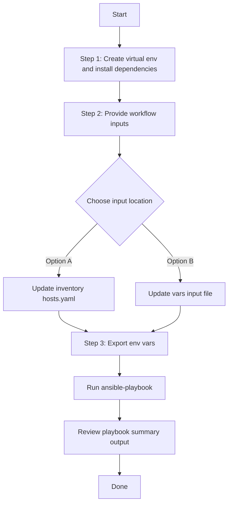

# SDA Host Port Onboarding Config Generator

## Table of Contents

- [User Flow (3 Steps)](#user-flow-3-steps)

- [Overview](#overview)
- [Key Capabilities](#key-capabilities)
- [Workflow Structure](#workflow-structure)
- [Prerequisites](#prerequisites)
- [Input Data Model](#input-data-model)
- [Operational Behavior](#operational-behavior)
- [Quick Start](#quick-start)
- [Input Examples](#input-examples)
- [Generated Output](#generated-output)
- [Using Generated Output with Workflow Manager](#using-generated-output-with-workflow-manager)
- [Troubleshooting](#troubleshooting)
- [Best Practices](#best-practices)
- [References](#references)

---

## Overview

This workflow exports existing SDA (Software-Defined Access) host port onboarding configurations from Cisco Catalyst Center and generates YAML files compatible with:

- `cisco.catalystcenter.sda_host_port_onboarding_workflow_manager`

It is designed for brownfield operations where SDA host port onboarding configurations already exist and you need reusable, versionable infrastructure-as-code artifacts.

---

## Key Capabilities

- Generates workflow-manager-ready YAML from live Catalyst Center data.
- Supports full export (`generate_all_configurations: true`) and selective export with component and device filters.
- Extracts SDA host port onboarding components: Port Assignments, Port Channels, and Wireless SSIDs.
- Supports device targeting for `port_assignments` and `port_channels` by IP address, hostname, or serial number.
- Supports fabric-site filtering via `fabric_site_name_hierarchy` for all components.
- Supports two file write modes: `overwrite` (default) and `append` for aggregating multiple exports.
- Supports deterministic output path via `file_path` and dynamic pathing via `{{ playbook_dir }}`.
- Provides idempotency: re-runs do not rewrite the file when generated content is unchanged.

---

## Workflow Structure

```text
sda_host_port_onboarding_config_generator/
├── README.md
├── playbook/
│   └── sda_host_port_onboarding_config_generator.yml
├── schema/
│   └── sda_host_port_onboarding_config_schema.yml
└── vars/
    └── sda_host_port_onboarding_config_input.yml
```

---

## Prerequisites

### Software

| Component | Recommended |
|---|---|
| Cisco Catalyst Center | 2.3.7.9+ |
| Python | 3.9+ |
| Ansible | 2.13+ |
| catalystcentersdk | 2.10.10+ |

### Required packages

```bash
ansible-galaxy collection install cisco.catalystcenter    # >= 6.40.0
ansible-galaxy collection install ansible.utils
pip install catalystcentersdk
pip install yamale
```

### Access requirements

- Valid Catalyst Center credentials.
- Network access from Ansible control node to Catalyst Center API.
- Existing SDA fabric and host port onboarding configurations deployed.

### Supported devices

- SDA fabric edge / border / control-plane devices managed by Catalyst Center.
- Catalyst 9000 series switches running supported IOS-XE versions.

---

## Input Data Model

Top-level variable:

- `sda_host_port_onboarding_config` (list, required)

Each list item supports:

| Parameter | Type | Required | Description |
|---|---|---|---|
| `generate_all_configurations` | bool | No | When `true`, exports all SDA host port onboarding configurations from all fabric sites. Filters are ignored. |
| `file_path` | str | No | Output file path for generated YAML. If omitted, module auto-generates a timestamped filename. |
| `file_mode` | str | No | File write mode: `overwrite` (default) or `append`. |
| `component_specific_filters` | dict | No | Component and device filters (ignored when `generate_all_configurations` is `true`). |

`component_specific_filters` supports:

| Parameter | Type | Required | Description |
|---|---|---|---|
| `components_list` | list[str] | No | Components to extract: `port_assignments`, `port_channels`, `wireless_ssids` |
| `port_assignments` | dict | No | Port assignment filter (supports device-level filters) |
| `port_channels` | dict | No | Port channel filter (supports device-level filters) |
| `wireless_ssids` | dict | No | Wireless SSID filter (fabric site filter only) |

`port_assignments` and `port_channels` (device filter) support:

| Parameter | Type | Required | Description |
|---|---|---|---|
| `fabric_site_name_hierarchy` | list[str] | No | Fabric site hierarchy paths to filter by |
| `device_ips` | list[str] | No | Device management IP addresses |
| `serial_numbers` | list[str] | No | Device serial numbers |
| `hostnames` | list[str] | No | Device hostnames |

`wireless_ssids` (fabric site filter only) supports:

| Parameter | Type | Required | Description |
|---|---|---|---|
| `fabric_site_name_hierarchy` | list[str] | No | Fabric site hierarchy paths to filter by |

> **Note:** For `port_assignments` and `port_channels`, all provided filter criteria are applied with **AND** logic — a device must match every specified criterion. `wireless_ssids` does not support device-level filters.

---

## Operational Behavior

1. The playbook loads input from `VARS_FILE_PATH` (if provided) or falls back to inventory/host variables.
2. It loops each item in `sda_host_port_onboarding_config`.
3. For each item, the playbook passes the item's filter section to the module's `config` parameter.
4. If `generate_all_configurations: true` or no `component_specific_filters` are provided, the module discovers all fabric sites and extracts all supported components.
5. If `component_specific_filters` is provided, the module restricts extraction to the listed components and applies the per-component filters.
6. If `file_path` is set, output is written exactly there. If omitted, module auto-generates:
   `sda_host_port_onboarding_config_generator_<YYYY-MM-DD_HH-MM-SS>.yml`
7. `file_mode: overwrite` (default) replaces existing file content. `file_mode: append` adds the new YAML document to the existing file.
8. Generated file uses top-level key `config`, ready for workflow manager consumption.

> **Idempotency:** In overwrite mode, full file content is compared (excluding timestamps and playbook path). In append mode, only the last YAML document in the file is compared against the newly generated configuration.

---

## Quick Start

### 1. Prepare inventory

Configure Catalyst Center credentials in your inventory, for example:

```yaml
catalyst_center_hosts:
  hosts:
    catalyst_center_primary:
      catalyst_center_host: 10.10.10.10
      catalyst_center_username: admin
      catalyst_center_password: "password"
      catalyst_center_verify: false
      catalyst_center_port: 443
      catalyst_center_version: "2.3.7.9"
      catalyst_center_debug: false
      catalyst_center_log: true
      catalyst_center_log_level: "INFO"
```

### 2. Update input variables

Edit:

- `workflows/sda_host_port_onboarding_config_generator/vars/sda_host_port_onboarding_config_input.yml`

### 3. Validate input schema

```bash
./tools/schemavalidation.sh \
  -s workflows/sda_host_port_onboarding_config_generator/schema/sda_host_port_onboarding_config_schema.yml \
  -d workflows/sda_host_port_onboarding_config_generator/vars/sda_host_port_onboarding_config_input.yml
```

### 4. Execute workflow

The playbook supports two input methods:

#### Option A: Vars file input (recommended for version-controlled configs)

```bash
ansible-playbook -i inventory/demo_lab/hosts.yaml \
  workflows/sda_host_port_onboarding_config_generator/playbook/sda_host_port_onboarding_config_generator.yml \
  --extra-vars VARS_FILE_PATH=./workflows/sda_host_port_onboarding_config_generator/vars/sda_host_port_onboarding_config_input.yml \
  -vvvv
```

#### Option B: Inventory file input

Omit `VARS_FILE_PATH` and define `sda_host_port_onboarding_config` directly as a host variable in your inventory file or in `host_vars`/`group_vars`.

**Example inventory snippet (`inventory/demo_lab/hosts.yaml`):**

```yaml
catalyst_center_hosts:
  hosts:
    catalyst_center220:
      catalyst_center_host: "{{ lookup('ansible.builtin.env', 'HOSTIP') }}"
      catalyst_center_password: "{{ lookup('ansible.builtin.env', 'CATALYST_CENTER_PASSWORD') }}"
      catalyst_center_port: 443
      catalyst_center_username: "{{ lookup('ansible.builtin.env', 'CATALYST_CENTER_USERNAME') }}"
      catalyst_center_verify: false
      catalyst_center_version: 2.3.7.9

      # Workflow data defined as host variables
      sda_host_port_onboarding_config:
        - generate_all_configurations: true
          file_path: "{{ playbook_dir }}/sda_host_port_onboarding_playbook_config_all.yml"
```

Then run **without** `VARS_FILE_PATH`:

```bash
ansible-playbook -i inventory/demo_lab/hosts.yaml \
  workflows/sda_host_port_onboarding_config_generator/playbook/sda_host_port_onboarding_config_generator.yml \
  -vvvv
```

The playbook auto-detects the input source and prints it at the start:
- `Input source: vars file <path>` when using Option A
- `Input source: inventory / host variables (VARS_FILE_PATH not provided)` when using Option B

---

## Input Examples

### Example 1: Export all SDA host port onboarding configurations

```yaml
sda_host_port_onboarding_config:
  - generate_all_configurations: true
    file_path: "{{ playbook_dir }}/sda_host_port_onboarding_playbook_config_all.yml"
```

### Example 2: Export only port assignments

```yaml
sda_host_port_onboarding_config:
  - file_path: "{{ playbook_dir }}/port_assignments_config.yml"
    component_specific_filters:
      components_list:
        - port_assignments
```

### Example 3: Export port assignments by fabric site

```yaml
sda_host_port_onboarding_config:
  - file_path: "{{ playbook_dir }}/port_assignments_by_site.yml"
    component_specific_filters:
      components_list:
        - port_assignments
      port_assignments:
        fabric_site_name_hierarchy:
          - "Global/California/23"
          - "Global/USA/SAN JOSE"
```

### Example 4: Export port channels by device IPs

```yaml
sda_host_port_onboarding_config:
  - file_path: "{{ playbook_dir }}/port_channels_by_ip.yml"
    component_specific_filters:
      components_list:
        - port_channels
      port_channels:
        device_ips:
          - "204.1.2.8"
          - "204.1.2.69"
```

### Example 5: Combined components with mixed filters

```yaml
sda_host_port_onboarding_config:
  - file_path: "{{ playbook_dir }}/combined_filtered_config.yml"
    component_specific_filters:
      components_list:
        - port_assignments
        - port_channels
        - wireless_ssids
      port_assignments:
        fabric_site_name_hierarchy:
          - "Global/California/23"
        hostnames:
          - "edge-switch-01"
      port_channels:
        fabric_site_name_hierarchy:
          - "Global/USA/SAN JOSE"
      wireless_ssids:
        fabric_site_name_hierarchy:
          - "Global/USA/SAN JOSE"
```

### Example 6: Aggregate multiple exports with append mode

```yaml
sda_host_port_onboarding_config:
  - file_path: "{{ playbook_dir }}/sda_aggregate.yml"
    file_mode: append
    component_specific_filters:
      components_list:
        - port_assignments
      port_assignments:
        fabric_site_name_hierarchy:
          - "Global/California/23"

  - file_path: "{{ playbook_dir }}/sda_aggregate.yml"
    file_mode: append
    component_specific_filters:
      components_list:
        - port_channels
      port_channels:
        fabric_site_name_hierarchy:
          - "Global/USA/SAN JOSE"
```

### Example 7: Auto-generated timestamp filename

```yaml
sda_host_port_onboarding_config:
  - generate_all_configurations: true
```

---

## Generated Output

Each generated file contains a top-level `config` key. Example structure:

```yaml
---
config:
  - ip_address: 204.1.2.8
    fabric_site_name_hierarchy: Global/California/23
    port_assignments:
      - interface_name: FiveGigabitEthernet1/0/22
        connected_device_type: TRUNKING_DEVICE
        authentication_template_name: No Authentication
        interface_description: Port 1
        native_vlan_id: 100
        allowed_vlan_ranges: all
  - ip_address: 204.1.2.69
    fabric_site_name_hierarchy: Global/California/23
    port_channels:
      - interface_names:
          - GigabitEthernet1/0/3
        connected_device_type: TRUNK
        protocol: 'ON'
        native_vlan_id: 100
        allowed_vlan_ranges: all
  - fabric_site_name_hierarchy: Global/California/23
    wireless_ssids:
      - vlan_name: SGT_Port_test_sub-SGT_Port_test
        ssid_details:
          - ssid_name: corp-ssid
```

In this workflow, sample paths use `{{ playbook_dir }}` so output remains portable across users and workspaces.

---

## Using Generated Output with Workflow Manager

Use the exported file directly as `vars_files`, then pass `config` to the manager module.

```yaml
---
- name: Apply generated SDA host port onboarding configuration
  hosts: catalyst_center_hosts
  connection: local
  gather_facts: no

  vars_files:
    - "{{ playbook_dir }}/sda_host_port_onboarding_playbook_config_all.yml"

  tasks:
    - name: Apply SDA host port onboarding configuration
      cisco.catalystcenter.sda_host_port_onboarding_workflow_manager:
        catalystcenter_host: "{{ catalyst_center_host }}"
        catalystcenter_username: "{{ catalyst_center_username }}"
        catalystcenter_password: "{{ catalyst_center_password }}"
        catalystcenter_verify: "{{ catalyst_center_verify }}"
        catalystcenter_port: "{{ catalyst_center_port }}"
        catalystcenter_version: "{{ catalyst_center_version }}"
        state: merged
        config: "{{ config }}"
```

---

## Troubleshooting

| Symptom | Likely Cause | Resolution |
|---|---|---|
| File appears in unexpected directory | `file_path` omitted | Set explicit `file_path` (recommended: `{{ playbook_dir }}/...`) |
| No data exported | Filters too narrow or fabric site not found | Validate fabric site hierarchy / device IP / hostname / serial against Catalyst Center inventory |
| Empty configuration for a component | Component not configured on target fabric site | Verify the component exists in Catalyst Center for the targeted fabric site |
| Invalid component error | Typo in `components_list` | Use only `port_assignments`, `port_channels`, or `wireless_ssids` |
| Wireless SSID device filter ignored | `wireless_ssids` does not support device filters | Use `fabric_site_name_hierarchy` only for `wireless_ssids` |
| Schema validation fails | Typo or wrong YAML structure | Re-run `./tools/schemavalidation.sh` and fix the reported field |
| Module fails on version check | Catalyst Center < 2.3.7.9 | Upgrade Catalyst Center or use a compatible workflow |
| `yamale: command not found` | Missing validation dependency | `pip install yamale` in your active environment |
| Append file grows unexpectedly | `file_mode: append` reused without intent | Switch to `overwrite` or rotate the target file |

---

## Best Practices

- Use `component_specific_filters` with explicit `components_list` in production to keep exports focused.
- Combine fabric-site and device-level filters to scope exports to a meaningful blast radius.
- Use `{{ playbook_dir }}` in `file_path` for user-independent, portable paths.
- Start with `generate_all_configurations: true` for initial brownfield discovery, then refine with filters.
- Use `file_mode: append` only when intentionally aggregating multiple exports into one file.
- Commit generated files that represent intended state, not every ad-hoc run.
- Enable Catalyst Center logging (`catalyst_center_log: true`) when troubleshooting.
- Verify fabric site hierarchy strings match exactly (case-sensitive) what is configured in Catalyst Center.

---

## References

- Workflow playbook:
  `workflows/sda_host_port_onboarding_config_generator/playbook/sda_host_port_onboarding_config_generator.yml`
- Input file:
  `workflows/sda_host_port_onboarding_config_generator/vars/sda_host_port_onboarding_config_input.yml`
- Schema:
  `workflows/sda_host_port_onboarding_config_generator/schema/sda_host_port_onboarding_config_schema.yml`
- Target module:
  `cisco.catalystcenter.sda_host_port_onboarding_playbook_config_generator`
- Consumer module:
  `cisco.catalystcenter.sda_host_port_onboarding_workflow_manager`

## Workflow Steps
## User Flow (3 Steps)



### Installation and Run (Aligned)

1. Create and activate a Python virtual environment, then install dependencies.

```bash
python3 -m venv .venv
source .venv/bin/activate
pip install -r requirements.txt
ansible-galaxy collection install cisco.catalystcenter --force
```

2. Provide workflow inputs in either inventory (`inventory/demo_lab/hosts.yaml`) or the workflow `vars/` file.

3. Export Catalyst Center environment variables and run the playbook.

```bash
export HOSTIP=<catalyst-center-ip-or-fqdn>
export CATALYST_CENTER_USERNAME=<username>
export CATALYST_CENTER_PASSWORD='<password>'
ansible-playbook -i ./inventory/demo_lab/hosts.yaml ./workflows/sda_host_port_onboarding_config_generator/playbook/sda_host_port_onboarding_config_generator.yml -vvvv
```