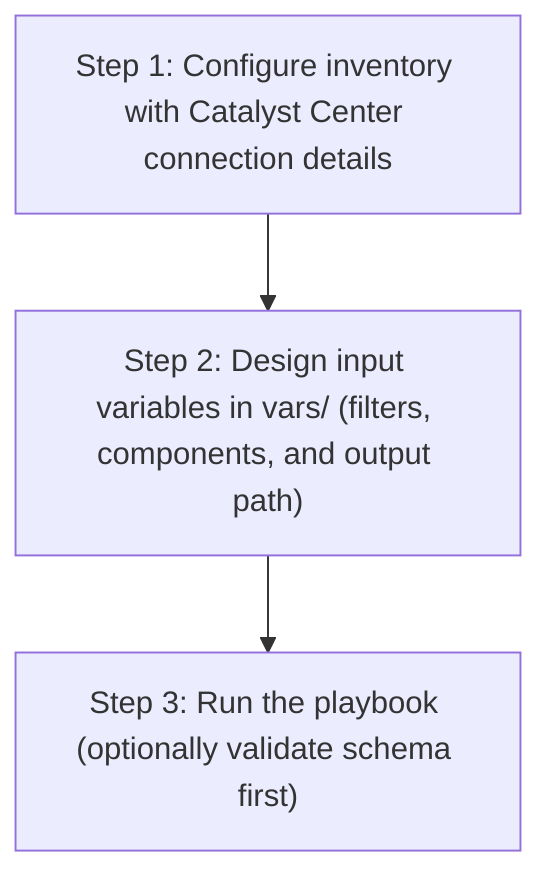

# SDA Host Port Onboarding Config Generator

This workflow runs the `cisco.dnac.sda_host_port_onboarding_playbook_config_generator` module to export host port onboarding configurations from Cisco Catalyst Center into a YAML file that is compatible with `sda_host_port_onboarding_workflow_manager`.

## Files

- `playbook/sda_host_port_onboarding_config_generator.yml`
- `schema/sda_host_port_onboarding_config_schema.yml`
- `vars/sda_host_port_onboarding_config_input.yml`

## User Flow (3 Steps)



## Run

The playbook supports two input methods:

### Option A: Vars file input (recommended for version-controlled configs)

```bash
ansible-playbook -i inventory/demo_lab/hosts.yaml \
  workflows/sda_host_port_onboarding_config_generator/playbook/sda_host_port_onboarding_config_generator.yml \
  --extra-vars VARS_FILE_PATH=/absolute/path/to/dnac_ansible_workflows/workflows/sda_host_port_onboarding_config_generator/vars/sda_host_port_onboarding_config_input.yml \
  -vvvv
```

### Option B: Inventory / host variable input

Omit `VARS_FILE_PATH` and define `sda_host_port_onboarding_config` directly as a host variable in your inventory file or in `host_vars`/`group_vars`.

```bash
ansible-playbook -i inventory/demo_lab/hosts.yaml \
  workflows/sda_host_port_onboarding_config_generator/playbook/sda_host_port_onboarding_config_generator.yml \
  -vvvv
```

The playbook auto-detects the input source and prints it at the start:
- `Input source: vars file <path>` when using Option A
- `Input source: inventory / host variables (VARS_FILE_PATH not provided)` when using Option B

> **Note:** When `VARS_FILE_PATH` is provided, it takes **precedence** over inventory variables.

## Notes

- `state` supports only `gathered`.
- If `generate_all_configurations: true`, all supported onboarding components are exported.
- `file_mode` supports `overwrite` (default) and `append`.
- Uses list-based configuration structure with `sda_host_port_onboarding_config` variable.
- Supports conditional `include_vars` for flexible input methods.
