# SDA Host Onboarding Workflow Manager
This Ansible workflow playbook manages host onboarding operations within a Cisco SD-Access fabric through the Cisco DNA Center. It provides the ability to add, update, and delete port assignments and port channels for network devices, enabling seamless automation of host onboarding workflows on single or bulk interfaces on a single or a number of access devices.
### Minimum Catalyst Cennter Version Supported : 2.3.7.6

# Playbook Use Cases
This Playbook can be used to automate various host onboarding tasks, including:
1. Adding a group of hosts or different types of host on one or more edge devices.
2. Updating host port assignment: Move a host to a different port or port channel.
3. Deleting host port assignment: Remove a host's port assignment, effectively disconnecting it from the network.
4. Creating and managing port channels: Configure port channels for link aggregation and redundancy.
5. Onboard hosts on link aggregation (port Channels)
6. Delete ALL port assignments and port channels for the fabric device using ip_address
7. Remove provided hosts from interfaces and port channels.

## Playbook parameters spec
https://galaxy.ansible.com/ui/repo/published/cisco/dnac/content/module/sda_host_port_onboarding_workflow_manager/

Host Onboarding Figure:
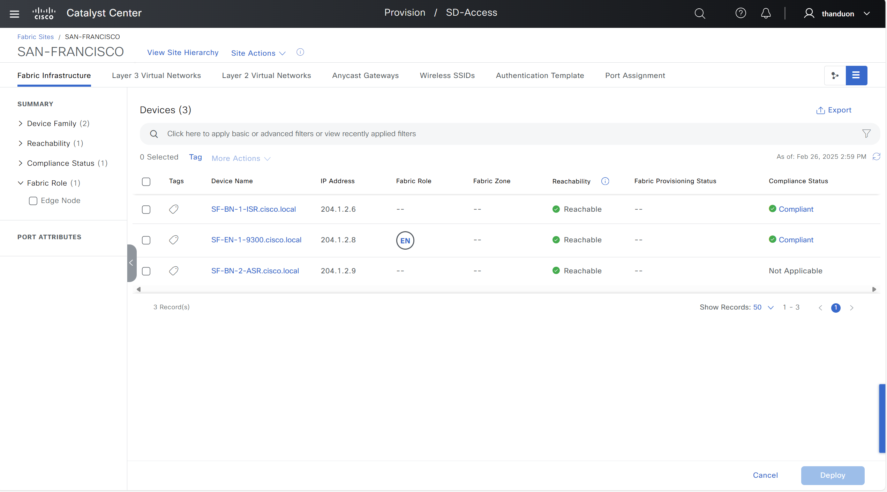

## I. Key Features.
### 1. Port Assignments Management.
    - Add, Update, and Delete Ports: The Workflow Manager enables administrators to easily add, update, or delete port assignments for network devices. This functionality ensures accurate and efficient configuration for each device.

### 2. Port Channel Management.
    - The tool supports the configuration and management of port channels for network devices. This capability ensures that network traffic is optimized and evenly distributed across ports.

### 3. Automation of Onboarding Processes.
    - The Workflow Manager provides the ability to automate the onboarding processes for devices, not only for a single interface but also for multiple interfaces across one or several access devices. This significantly reduces the time and effort required for network configuration.

### 4. Bulk Operations Support.
    - The tool can perform bulk operations, allowing administrators to implement changes across multiple devices simultaneously, enhancing network management efficiency.

### 5. Integration with Cisco DNA Center.
    - The Workflow Manager seamlessly integrates with Cisco DNA Center, enabling the use of existing management and monitoring features within the platform. This integration facilitates easy tracking of changes and updates within the network.

## II. Procedure.

### 1. Prepare your environment.

- Install Ansible if you haven't already
- Ensure you have network connectivity to your Catalyst Center instance.
- Minimum Catalyst Centner Version Supported : 2.3.7.6
- Checkout the project and playbooks: git@github.com:cisco-en-programmability/catalyst-center-ansible-iac.git

### 2. Configure Host Inventory.

- Update hosts.yml (or your preferred inventory file) with the connection details for your DNA Center instance.
- The **host_inventory_dnac1/hosts.yml** file specifies the connection details (IP address, credentials, etc.) for your Catalyst Center instance.

```yaml
---
catalyst_center_hosts:
    hosts:
        catalyst_center220:
            dnac_host: xx.xx.xx.xx.
            dnac_password: XXXXXXXX
            dnac_port: 443
            dnac_timeout: 60
            dnac_username: admin
            dnac_verify: false
            dnac_version: 2.3.7.6
            dnac_debug: true
            dnac_log_level: INFO
            dnac_log: true
```

### 3. Generate your Input.
- Create a YAML file (e.g., vars.yml) to store the required variables for the workflow.
- Refer to the **sda_host_port_onboarding_workflow_manager** module documentation for details on the available variables and their formats.
- Example:
 - The **workflows/sda_hostonboarding/vars/sda_host_onboarding_input.yml** file should be configured .
 - Refer to the full workflow specification for detailed instructions on the available options and their structure:[full workflow specification](https://galaxy.ansible.com/ui/repo/published/cisco/dnac/content/module/sda_host_port_onboarding_workflow_manager)


### 4. Add port interfaces and port channels for a specific fabric device.

#### 4.1 Add port interfaces.

- Provision -> Fabric Sites -> Chose Fabric Site -> Port Assignment Tab

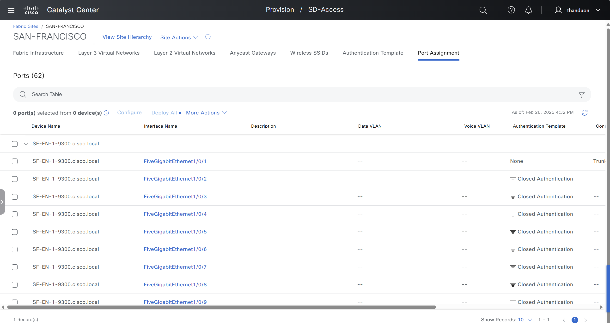

- Select Interface -> Select Configure


- Select one of the 3 options: Access Point, Trunking Device, User Devices and Endpoints, each option will require a different parameter

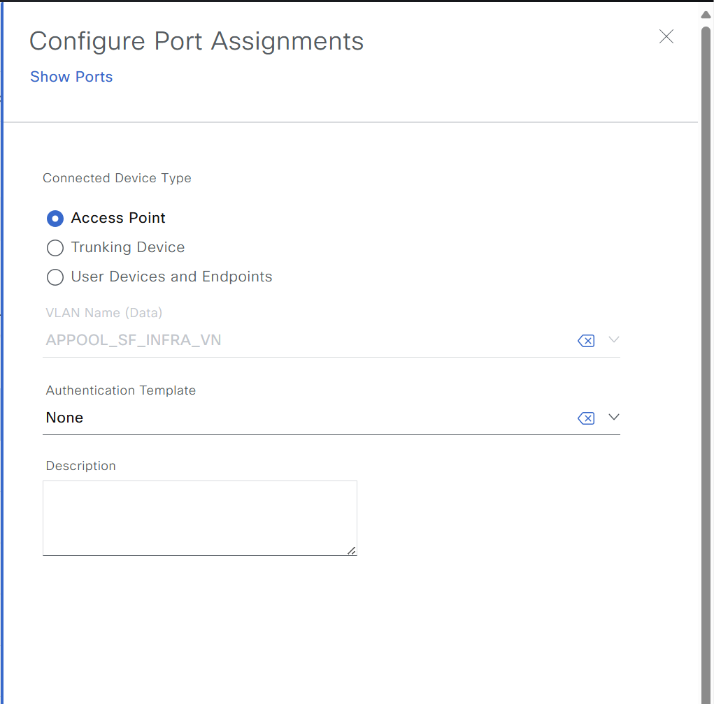

- Then you can check the information you entered -> Click Deploy All to complete.

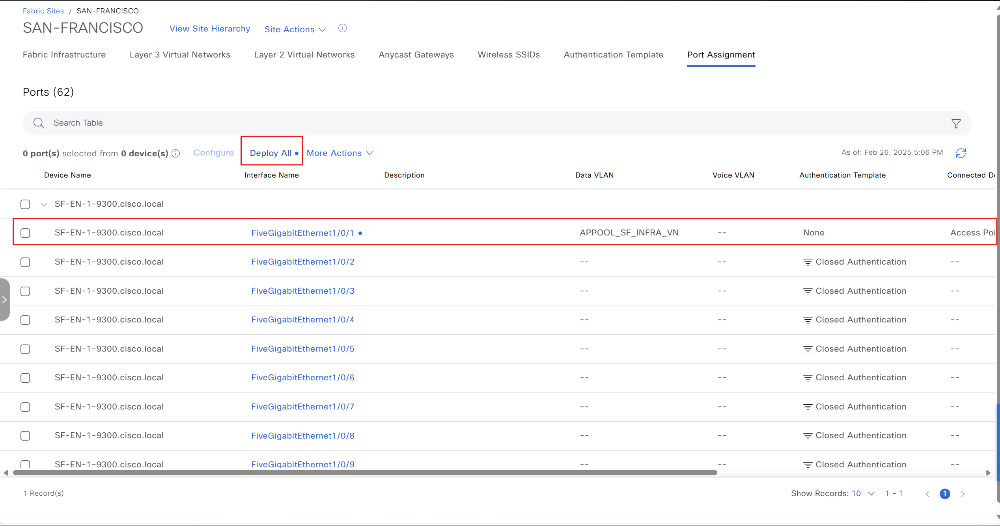


#### 4.2. Add port channel. 

- Provision -> Fabric Sites -> Chose Fabric Site -> Port Assignment Tab


- Select More Actions Tab -> Chose Create Port Channel

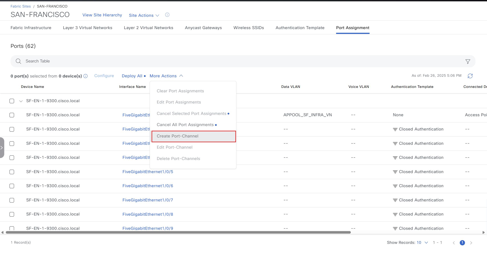

- Chose Device

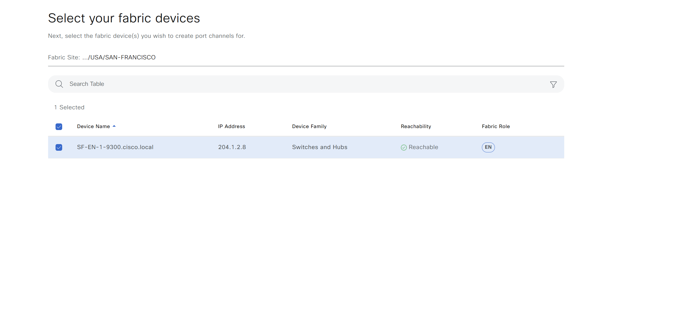

- Chose parameter (Note: Connected Device Type: Extended Node can only select Protocol PAgP)

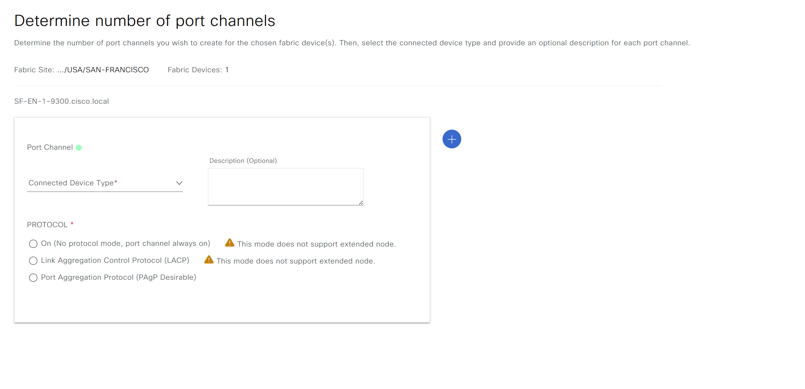

- Chose Interface 

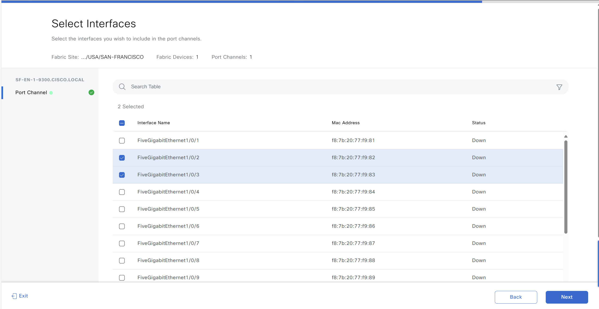

- Deploy Port Channel

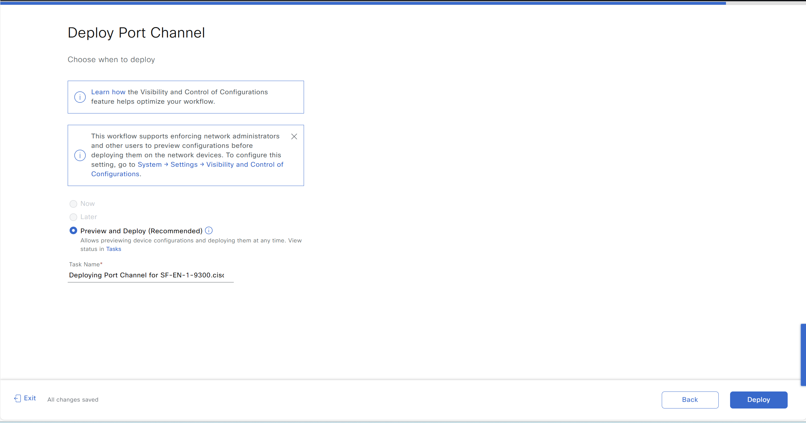

### 5. Generate Input.

```yaml
---
#Select Catalyst Center version, this one overwrite the default version from host file
catalyst_center_version: 2.3.7.6
sda_host_onboarding_details: 
  - ip_address: 204.1.2.8
    fabric_site_name_hierarchy: Global/USA/SAN-FRANCISCO
    port_assignments:
      - interface_name: FiveGigabitEthernet1/0/1
        connected_device_type: TRUNKING_DEVICE
      - interface_name: FiveGigabitEthernet1/0/2
        connected_device_type: TRUNKING_DEVICE
        authentication_template_name: "No Authentication"
        interface_description: "Trunk Port"
      - interface_name: "FiveGigabitEthernet1/0/3"
        connected_device_type: ACCESS_POINT
        data_vlan_name: APPOOL_SF_INFRA_VN
      - interface_name: "FiveGigabitEthernet1/0/4"
        connected_device_type: ACCESS_POINT
        data_vlan_name: "APPOOL_SF_INFRA_VN"
        interface_description: "Access Point Port"
      - interface_name: "FiveGigabitEthernet1/0/5"
        connected_device_type: "USER_DEVICE"
        data_vlan_name: "EMPLOYEEPOOL_sf_Employee_VN"
        security_group_name: Employees
        voice_vlan_name: VOICEPOOL_sf_Employee_VN
        authentication_template_name: "No Authentication"
        interface_description: "IPPhone and Laptop"
    port_channels:
      - interface_names: 
          - FiveGigabitEthernet1/0/6
          - FiveGigabitEthernet1/0/7
        connected_device_type: "TRUNK"
      - interface_names: 
          - FiveGigabitEthernet1/0/8
          - FiveGigabitEthernet1/0/9
          - FiveGigabitEthernet1/0/10
        connected_device_type: "TRUNK"
        protocol: "PAGP"
```
### 6. Result.

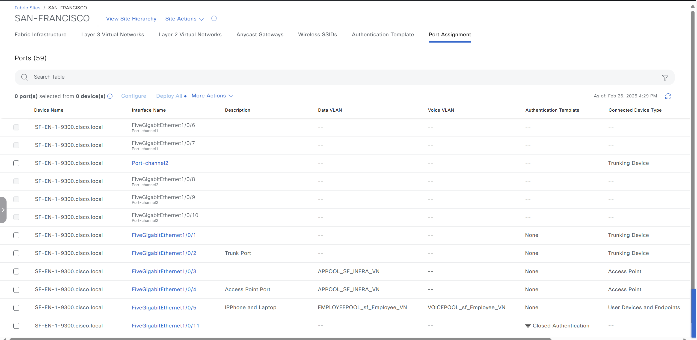


### 7. Update port interfaces and port channels for a specific fabric device.

#### 7.1. Update port interfaces.

- Provision -> Fabric Sites -> Chose Fabric Site -> Port Assignment Tab


- Select Interface -> More Actions -> Edit Port Assignment

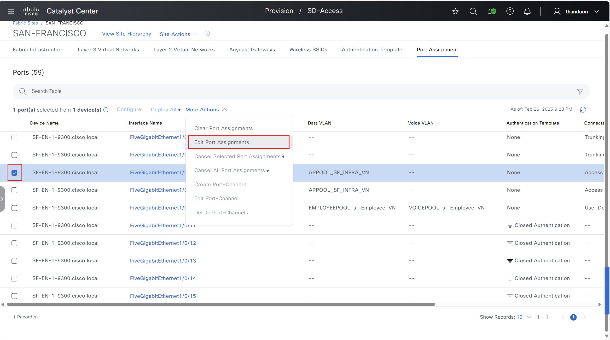

- Chose parameter -> update new parameter

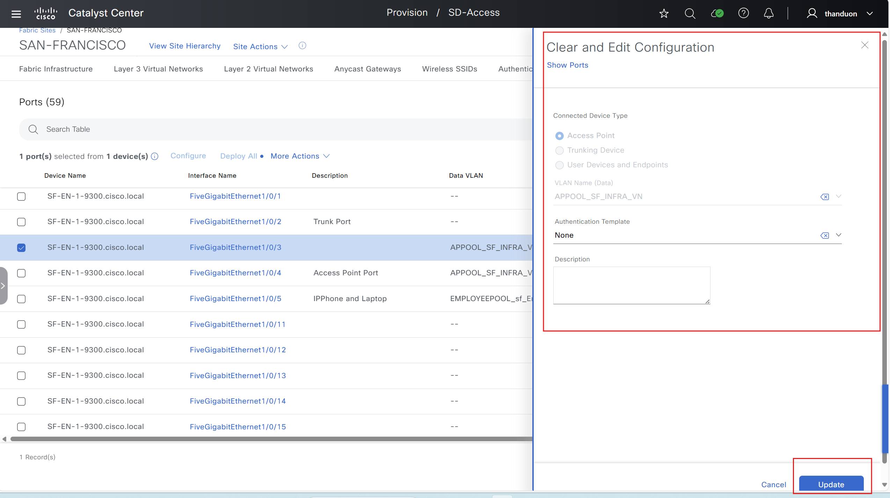

#### 7.2. Update port channel.

- Provision -> Fabric Sites -> Chose Fabric Site -> Port Assignment Tab


- Select Port Channel -> More Actions -> Edit Port Channel

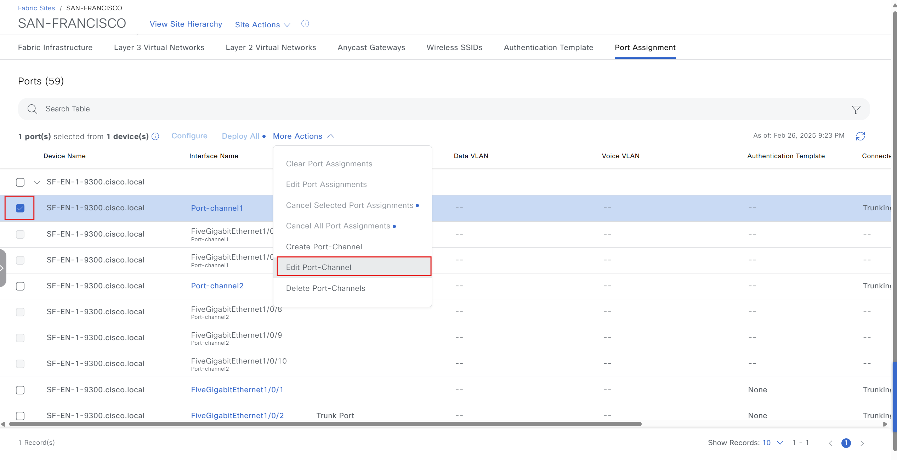

- Chose parameter -> update new parameter

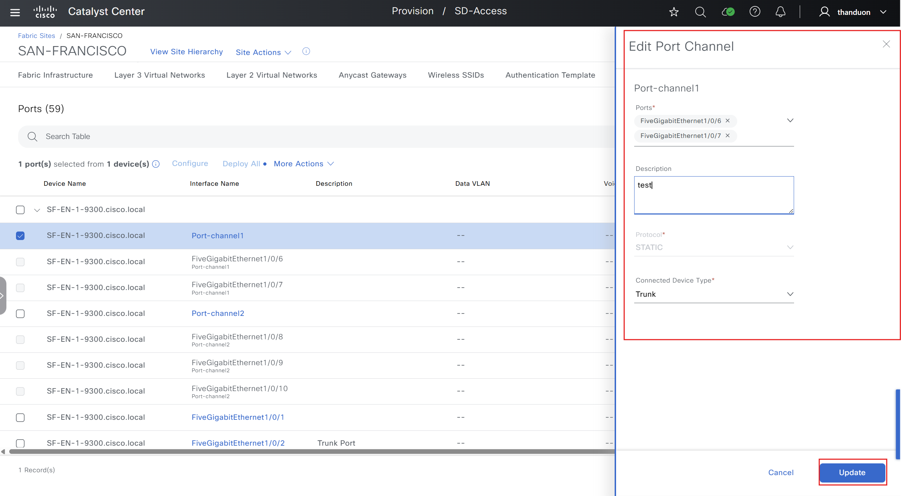

#### 7.3. Generate Input.

```yaml
---
#Select Catalyst Center version, this one overwrite the default version from host file
catalyst_center_version: 2.3.7.6
sda_host_onboarding_details: 
  - ip_address: 204.1.2.8
    fabric_site_name_hierarchy: Global/USA/SAN-FRANCISCO
    port_assignments:
      - interface_name: FiveGigabitEthernet1/0/1
        connected_device_type: TRUNKING_DEVICE
      - interface_name: FiveGigabitEthernet1/0/2
        connected_device_type: TRUNKING_DEVICE
        authentication_template_name: "No Authentication"
        interface_description: "Trunk Port"
      - interface_name: "FiveGigabitEthernet1/0/3"
        connected_device_type: ACCESS_POINT
        data_vlan_name: APPOOL_SF_INFRA_VN
        interface_description: "Test APPool"
      - interface_name: "FiveGigabitEthernet1/0/4"
        connected_device_type: ACCESS_POINT
        data_vlan_name: "APPOOL_SF_INFRA_VN"
        interface_description: "Access Point Port"
      - interface_name: "FiveGigabitEthernet1/0/5"
        connected_device_type: "USER_DEVICE"
        data_vlan_name: "EMPLOYEEPOOL_sf_Employee_VN"
        voice_vlan_name: VOICEPOOL_sf_Employee_VN
        authentication_template_name: "No Authentication"
        interface_description: "IPPhone and Laptop"
    port_channels:
      - interface_names: 
          - FiveGigabitEthernet1/0/6
          - FiveGigabitEthernet1/0/7
        connected_device_type: "TRUNK"
        port_channel_description: "Test"
      - interface_names: 
          - FiveGigabitEthernet1/0/8
          - FiveGigabitEthernet1/0/9
          - FiveGigabitEthernet1/0/10
        connected_device_type: "TRUNK"
        protocol: "PAGP"
```

#### 7.4. Result.

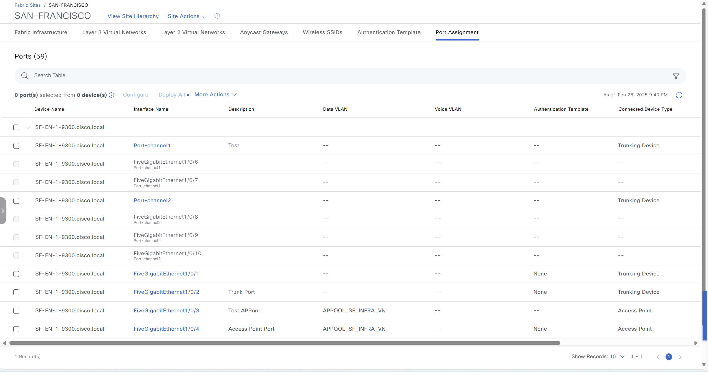

### 8. Delete port interfaces and port channels using interface names and port channel name.

#### 8.1. Delete port interfaces:

- Provision -> Fabric Sites -> Chose Fabric Site -> Port Assignment Tab


- Select Interface -> More Actions -> Clear Port Assignments

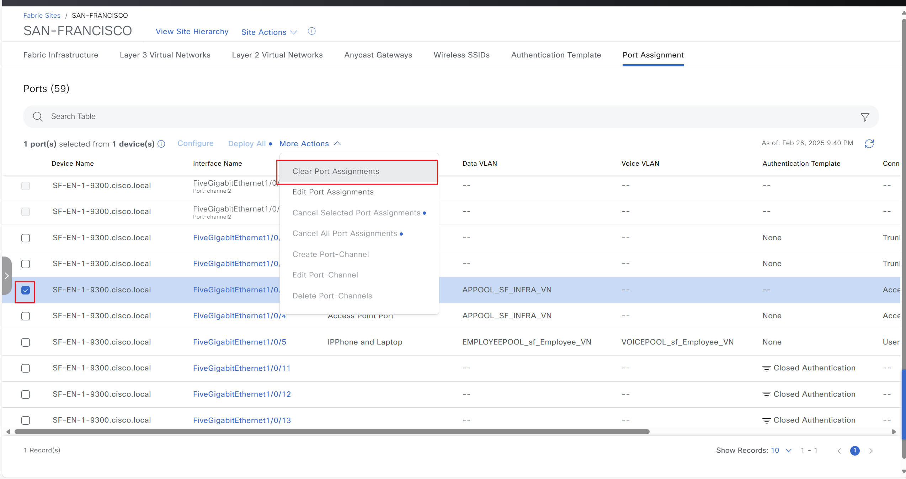

- Clear Configuration


- Deploy

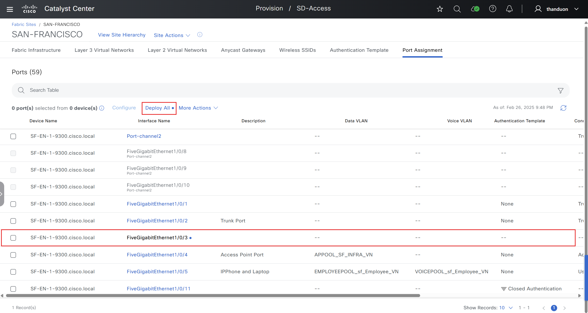

#### 8.2. Delete Port Channel.

- Provision -> Fabric Sites -> Chose Fabric Site -> Port Assignment Tab


- Select Port Channel -> More Actions -> Delete Port Channel

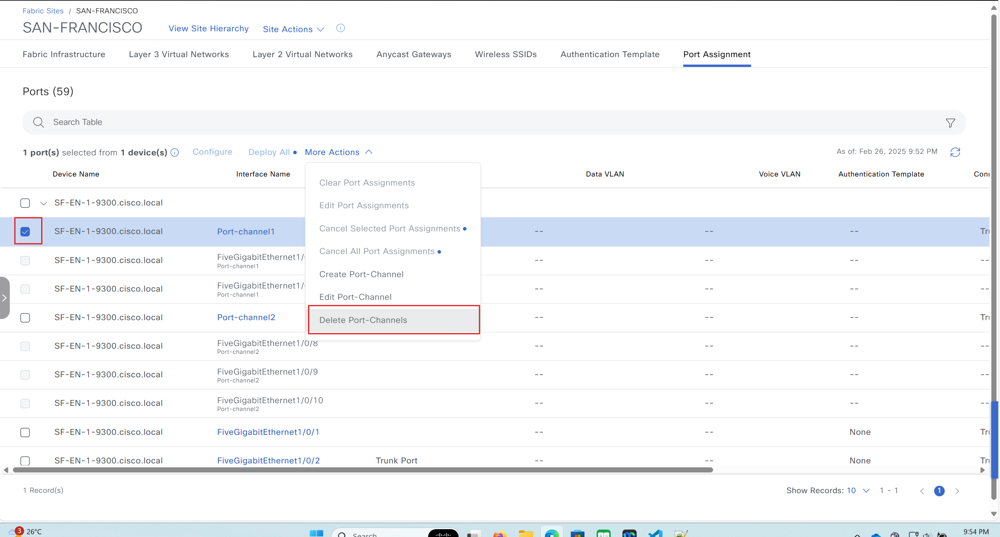

- Select Apply -> Check Config -> Deploy

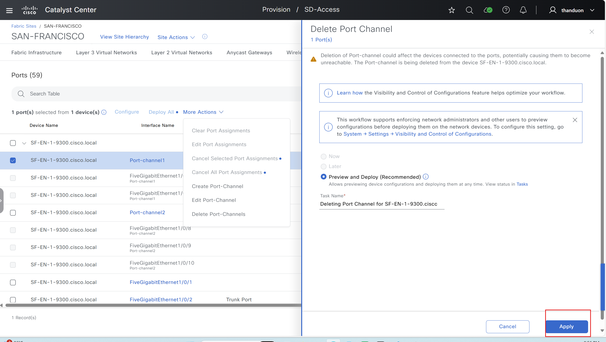

#### 8.3. Generate Input.

- Delete specific port assignments, port channels:

```yaml
---
#Select Catalyst Center version, this one overwrite the default version from host file
catalyst_center_version: 2.3.7.6
sda_host_onboarding_details: 
  - ip_address: 204.1.2.8
    fabric_site_name_hierarchy: Global/USA/SAN-FRANCISCO
    port_assignments:
      - interface_name: FiveGigabitEthernet1/0/1
        connected_device_type: TRUNKING_DEVICE
      - interface_name: FiveGigabitEthernet1/0/2
        connected_device_type: TRUNKING_DEVICE
        authentication_template_name: "No Authentication"
        interface_description: "Trunk Port"
      - interface_name: "FiveGigabitEthernet1/0/3"
        connected_device_type: ACCESS_POINT
        data_vlan_name: APPOOL_SF_INFRA_VN
        interface_description: "Test APPool"
      - interface_name: "FiveGigabitEthernet1/0/4"
        connected_device_type: ACCESS_POINT
        data_vlan_name: "APPOOL_SF_INFRA_VN"
        interface_description: "Access Point Port"
      - interface_name: "FiveGigabitEthernet1/0/5"
        connected_device_type: "USER_DEVICE"
        data_vlan_name: "EMPLOYEEPOOL_sf_Employee_VN"
        voice_vlan_name: VOICEPOOL_sf_Employee_VN
        authentication_template_name: "No Authentication"
        interface_description: "IPPhone and Laptop"
    port_channels:
      - interface_names: 
          - FiveGigabitEthernet1/0/6
          - FiveGigabitEthernet1/0/7
        connected_device_type: "TRUNK"
        port_channel_description: "Test"
      - interface_names: 
          - FiveGigabitEthernet1/0/8
          - FiveGigabitEthernet1/0/9
          - FiveGigabitEthernet1/0/10
        connected_device_type: "TRUNK"
        protocol: "PAGP"
```

        - Delete All Port Assignment And Port Channel:

```yaml
---
#Select Catalyst Center version, this one overwrite the default version from host file
catalyst_center_version: 2.3.7.6
sda_host_onboarding_details: 
  - ip_address: 204.1.2.8
    fabric_site_name_hierarchy: Global/USA/SAN-FRANCISCO
```
## III. How to execute playbook.

### 1. Validate the playbooks with schema.
- Command to Validate:
```bash
    yamale -s schema/sda_host_onboarding_schema.yml workflows/sda_hostonboarding/vars/sda_host_onboarding_input.yml
```
- Result:
```bash                            
    Finding yaml files...
    Found 2 yaml files.
    Validating...
    Validation success! 👍
```

### 2. Running playbook create and update port assignment and port channel.

- Command to run:

```bash
ansible-playbook -i host_inventory_dnac1/hosts.yml  workflows/sda_hostonboarding/playbook/sda_host_onboarding_playbook.yml --e VARS_FILE_PATH=../vars/sda_host_onboarding_input.yml -vvvv
```

- Result:
```
changed: [catalyst_center220] => {
    "changed": true,
    "diff": [],
    "invocation": {
        "module_args": {
            "config": [
                {
                    "fabric_site_name_hierarchy": "Global/USA/SAN-FRANCISCO",
                    "ip_address": "204.1.2.8",
                    "port_assignments": [
                        {
                            "connected_device_type": "TRUNKING_DEVICE",
                            "interface_name": "FiveGigabitEthernet1/0/1"
                        },
                        {
                            "authentication_template_name": "No Authentication",
                            "connected_device_type": "TRUNKING_DEVICE",
                            "interface_description": "Trunk Port",
                            "interface_name": "FiveGigabitEthernet1/0/2"
                        },
                        {
                            "connected_device_type": "ACCESS_POINT",
                            "data_vlan_name": "APPOOL_SF_INFRA_VN",
                            "interface_name": "FiveGigabitEthernet1/0/3"
                        },
                        {
                            "connected_device_type": "ACCESS_POINT",
                            "data_vlan_name": "APPOOL_SF_INFRA_VN",
                            "interface_description": "Access Point Port",
                            "interface_name": "FiveGigabitEthernet1/0/4"
                        },
                        {
                            "authentication_template_name": "No Authentication",
                            "connected_device_type": "USER_DEVICE",
                            "data_vlan_name": "EMPLOYEEPOOL_sf_Employee_VN",
                            "interface_description": "IPPhone and Laptop",
                            "interface_name": "FiveGigabitEthernet1/0/5",
                            "voice_vlan_name": "VOICEPOOL_sf_Employee_VN"
                        }
                    ],
                    "port_channels": [
                        {
                            "connected_device_type": "TRUNK",
                            "interface_names": [
                                "FiveGigabitEthernet1/0/6",
                                "FiveGigabitEthernet1/0/7"
                            ]
                        },
                        {
                            "connected_device_type": "TRUNK",
                            "interface_names": [
                                "FiveGigabitEthernet1/0/8",
                                "FiveGigabitEthernet1/0/9",
                                "FiveGigabitEthernet1/0/10"
                            ],
                            "protocol": "PAGP"
                        }
                    ]
                }
            ],
            "config_verify": false,
            "dnac_api_task_timeout": 1200,
            "dnac_debug": true,
            "dnac_host": "10.22.40.214",
            "dnac_log": true,
            "dnac_log_append": true,
            "dnac_log_file_path": "dnac.log",
            "dnac_log_level": "debug",
            "dnac_password": "VALUE_SPECIFIED_IN_NO_LOG_PARAMETER",
            "dnac_port": "443",
            "dnac_task_poll_interval": 2,
            "dnac_username": "thanduon",
            "dnac_verify": false,
            "dnac_version": "2.3.7.6",
            "state": "merged",
            "validate_response_schema": true
        }
    },
    "msg": {
        "Add Port Assignment(s) Task Succeeded for following interface(s)": {
            "success_count": 5,
            "success_interfaces": [
                "FiveGigabitEthernet1/0/1",
                "FiveGigabitEthernet1/0/2",
                "FiveGigabitEthernet1/0/3",
                "FiveGigabitEthernet1/0/4",
                "FiveGigabitEthernet1/0/5"
            ]
        },
        "Add Port Channel(s) Task Succeeded for following port channel(s)": {
            "success_count": 2,
            "success_port_channels": [
                "Port-channel2",
                "Port-channel1"
            ]
        }
    },
    "response": {
        "Add Port Assignment(s) Task Succeeded for following interface(s)": {
            "success_count": 5,
            "success_interfaces": [
                "FiveGigabitEthernet1/0/1",
                "FiveGigabitEthernet1/0/2",
                "FiveGigabitEthernet1/0/3",
                "FiveGigabitEthernet1/0/4",
                "FiveGigabitEthernet1/0/5"
            ]
        },
        "Add Port Channel(s) Task Succeeded for following port channel(s)": {
            "success_count": 2,
            "success_port_channels": [
                "Port-channel2",
                "Port-channel1"
            ]
        }
    },
    "status": "success"
}
```

### 3. Running playbook delete port assignment and port channel

- Command to run:

```bash
ansible-playbook -i host_inventory_dnac1/hosts.yml  workflows/sda_hostonboarding/playbook/delete_sda_host_onboarding_playbook.yml --e VARS_FILE_PATH=../vars/sda_host_onboarding_input.yml -vvvv
```

- Result:

```
changed: [catalyst_center220] => {
    "changed": true,
    "diff": [],
    "invocation": {
        "module_args": {
            "config": [
                {
                    "fabric_site_name_hierarchy": "Global/USA/SAN-FRANCISCO",
                    "ip_address": "204.1.2.8",
                    "port_assignments": [
                        {
                            "connected_device_type": "TRUNKING_DEVICE",
                            "interface_name": "FiveGigabitEthernet1/0/1"
                        },
                        {
                            "authentication_template_name": "No Authentication",
                            "connected_device_type": "TRUNKING_DEVICE",
                            "interface_description": "Trunk Port",
                            "interface_name": "FiveGigabitEthernet1/0/2"
                        },
                        {
                            "connected_device_type": "ACCESS_POINT",
                            "data_vlan_name": "APPOOL_SF_INFRA_VN",
                            "interface_description": "Test APPool",
                            "interface_name": "FiveGigabitEthernet1/0/3"
                        },
                        {
                            "connected_device_type": "ACCESS_POINT",
                            "data_vlan_name": "APPOOL_SF_INFRA_VN",
                            "interface_description": "Access Point Port",
                            "interface_name": "FiveGigabitEthernet1/0/4"
                        },
                        {
                            "authentication_template_name": "No Authentication",
                            "connected_device_type": "USER_DEVICE",
                            "data_vlan_name": "EMPLOYEEPOOL_sf_Employee_VN",
                            "interface_description": "IPPhone and Laptop",
                            "interface_name": "FiveGigabitEthernet1/0/5",
                            "voice_vlan_name": "VOICEPOOL_sf_Employee_VN"
                        }
                    ],
                    "port_channels": [
                        {
                            "connected_device_type": "TRUNK",
                            "interface_names": [
                                "FiveGigabitEthernet1/0/6",
                                "FiveGigabitEthernet1/0/7"
                            ],
                            "port_channel_description": "Test"
                        },
                        {
                            "connected_device_type": "TRUNK",
                            "interface_names": [
                                "FiveGigabitEthernet1/0/8",
                                "FiveGigabitEthernet1/0/9",
                                "FiveGigabitEthernet1/0/10"
                            ],
                            "protocol": "PAGP"
                        }
                    ]
                }
            ],
            "config_verify": false,
            "dnac_api_task_timeout": 1200,
            "dnac_debug": true,
            "dnac_host": "10.22.40.214",
            "dnac_log": true,
            "dnac_log_append": true,
            "dnac_log_file_path": "dnac.log",
            "dnac_log_level": "debug",
            "dnac_password": "VALUE_SPECIFIED_IN_NO_LOG_PARAMETER",
            "dnac_port": "443",
            "dnac_task_poll_interval": 2,
            "dnac_username": "thanduon",
            "dnac_verify": false,
            "dnac_version": "2.3.7.6",
            "state": "deleted",
            "validate_response_schema": true
        }
    },
    "msg": {
        "Delete Port Assignment(s) Task Succeeded for following interface(s)": {
            "success_count": 5,
            "success_interfaces": [
                "FiveGigabitEthernet1/0/1",
                "FiveGigabitEthernet1/0/2",
                "FiveGigabitEthernet1/0/3",
                "FiveGigabitEthernet1/0/4",
                "FiveGigabitEthernet1/0/5"
            ]
        },
        "Delete Port Channel(s) Task Succeeded for following port channel(s)": {
            "success_count": 2,
            "success_port_channels": [
                "Port-channel1",
                "Port-channel2"
            ]
        }
    },
    "response": {
        "Delete Port Assignment(s) Task Succeeded for following interface(s)": {
            "success_count": 5,
            "success_interfaces": [
                "FiveGigabitEthernet1/0/1",
                "FiveGigabitEthernet1/0/2",
                "FiveGigabitEthernet1/0/3",
                "FiveGigabitEthernet1/0/4",
                "FiveGigabitEthernet1/0/5"
            ]
        },
        "Delete Port Channel(s) Task Succeeded for following port channel(s)": {
            "success_count": 2,
            "success_port_channels": [
                "Port-channel1",
                "Port-channel2"
            ]
        }
    },
    "status": "success"
}
```