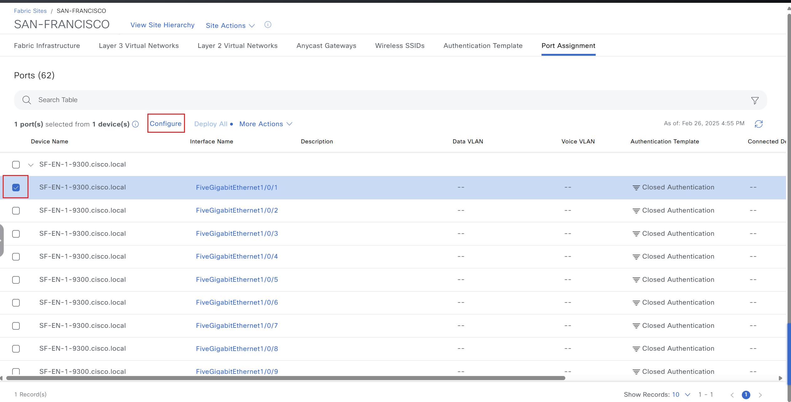

# SDA Host Onboarding Workflow Manager

Ansible playbook / workflow for managing host onboarding (wired port assignments, port channels, and Fabric Wireless SSID ↔ VLAN mappings) in a Cisco SD‑Access Fabric through Cisco Catalyst Center (DNA Center).  
Supports creation, update, and deletion of:
- Port assignments (device types: USER_DEVICE / ACCESS_POINT / TRUNKING_DEVICE)
- Port channels (device types: TRUNK / EXTENDED_NODE with protocols ON / LACP / PAGP)
- Wireless SSID ↔ Fabric Wireless Enabled VLAN mappings

### Minimum Catalyst Center Version Supported: 2.3.7.6  
### Advanced trunk VLAN controls (native_vlan_id, allowed_vlan_ranges) require Catalyst Center ≥ 3.1.3.0

---

# Playbook Use Cases

This playbook automates tasks such as:
1. Onboarding groups of hosts or mixed host types on one or multiple edge devices.
2. Updating a host port assignment (move host to a different port or port channel).
3. Deleting a host port assignment.
4. Creating and managing port channels (aggregation / redundancy).
5. Onboarding hosts over aggregated links (port channels).
6. Deleting all port assignments and port channels for a fabric device (by ip_address or hostname + site).
7. Removing specified hosts from interfaces and port channels.
8. Applying advanced trunk configuration (native VLAN + allowed VLAN ranges) for interfaces and port channels.
9. Managing SSID ↔ VLAN mappings at fabric site level (including selective removal).
10. Skipping device collection status validation when required (`device_collection_status_check: false`).

---

## Playbook parameters spec
Module documentation (Ansible Galaxy):  
https://galaxy.ansible.com/ui/repo/published/cisco/dnac/content/module/sda_host_port_onboarding_workflow_manager/

Host Onboarding Figure:  


---

## I. Key Features

### 1. Port Assignments Management
Create, update, and delete per-interface onboarding configurations; supports TRUNKING_DEVICE, ACCESS_POINT, USER_DEVICE. Advanced VLAN controls available for trunking device ports.

### 2. Port Channel Management
Create, update, and delete port channels with protocols ON / LACP / PAGP, applying idempotent membership logic and VLAN filtering for trunk types when supported.

### 3. Automation
Single or bulk operations across many interfaces and device types in one task.

### 4. Bulk Operations
Large-scale changes across multiple ports, channels, or SSID mappings in a single configuration structure.

---

## II. Procedure

### 1. Prepare your environment
- Install Ansible
- Ensure HTTPS connectivity to Catalyst Center
- Prepare credentials (UI admin or API user with SDA permissions)
- Confirm minimum required version for desired parameters
- Clone repository: `git@github.com:cisco-en-programmability/catalyst-center-ansible-iac.git`

### 2. Define Inputs and Validate

#### 2.1. Configure Host Inventory
File example: `host_inventory_dnac1/hosts.yml`
```yaml
---
catalyst_center_hosts:
  hosts:
    catalyst_center220:
      catalyst_center_host:  <CatC IP Address>
      catalyst_center_password: <CatC UI admin Password>
      catalyst_center_port: 443
      catalyst_center_timeout: 60
      catalyst_center_username: <CatC UI admin username>
      catalyst_center_verify: false
      catalyst_center_version: <CatC Release version>
      catalyst_center_debug: true
      catalyst_center_log_level: INFO
      catalyst_center_log: true
```

#### 2.2. Prerequisite
- Devices provisioned into Fabric (roles EN / WLC / Edge / Extended Node as required).
- Interfaces present in inventory.
- Wireless SSIDs created and assigned to the target Fabric Site.
- For trunk VLAN filters: Catalyst Center ≥ 3.1.3.0.

#### 2.3. Host Onboarding Schema (Updated)
Additional fields include `native_vlan_id`, `allowed_vlan_ranges` (for port assignments and port channels), and `device_collection_status_check`.

##### host onboarding

| Parameter | Type | Required | Default | Description |
|-----------|------|----------|---------|-------------|
| `ip_address` | String | No (Yes if port/port channel operations) | N/A | Device management IP (or use hostname). |
| `hostname` | String | No (Yes if port/port channel operations) | N/A | Device hostname alternative to IP. |
| `fabric_site_name_hierarchy` | String | Yes | N/A | Full path of Fabric Site hierarchy. |
| `port_assignments` | List[Dict] | No | [] | Interface-level onboarding list. |
| `port_channels` | List[Dict] | No | [] | Port channel configuration list. |
| `wireless_ssids` | List[Dict] | No | [] | Wireless SSID ↔ VLAN/IP pool mappings. |
| `device_collection_status_check` | Boolean | No | true | Skip or enforce collection status validation. |

##### port_assignments

| Parameter | Type | Required | Default | Description |
|-----------|------|----------|---------|-------------|
| `interface_name` | String | Yes (add/update) | N/A | Physical interface name. |
| `connected_device_type` | String | Yes | N/A | `USER_DEVICE`, `ACCESS_POINT`, `TRUNKING_DEVICE`. |
| `data_vlan_name` | String | Conditional | N/A | Required for ACCESS_POINT; one of data/voice for USER_DEVICE. |
| `voice_vlan_name` | String | Conditional | N/A | Use if USER_DEVICE without data VLAN. |
| `security_group_name` | String | No | N/A | Only with `No Authentication`. |
| `authentication_template_name` | String | Yes | "No Authentication" | One of: No/Open/Closed/Low Impact; TRUNKING_DEVICE must be No Authentication. |
| `interface_description` | String | No | N/A | Description label. |
| `native_vlan_id` | Integer | No (TRUNKING_DEVICE, version ≥3.1.3.0) | 1 | Native VLAN ID. |
| `allowed_vlan_ranges` | String | No (TRUNKING_DEVICE, version ≥3.1.3.0) | all | Comma separated VLANs and ranges or `all`; exclude native VLAN. |

##### port_channels

| Parameter | Type | Required | Default | Description |
|-----------|------|----------|---------|-------------|
| `interface_names` | List[String] | Yes (add/update/delete) | N/A | Members; max 8 (PAGP/ON), max 16 (LACP). |
| `connected_device_type` | String | Yes (add/update) | N/A | `TRUNK` or `EXTENDED_NODE`. |
| `protocol` | String | Add only | Based on type | `ON`, `LACP`, `PAGP`; immutable after creation. |
| `port_channel_description` | String | No | N/A | Description. |
| `native_vlan_id` | Integer | No (TRUNK, version ≥3.1.3.0) | 1 | Native VLAN for trunk channel. |
| `allowed_vlan_ranges` | String | No (TRUNK, version ≥3.1.3.0) | all | VLAN filter expression; exclude native VLAN. |

##### wireless_ssids

| Parameter | Type | Required | Default | Description |
|-----------|------|----------|---------|-------------|
| `vlan_name` | String | Yes | N/A | Fabric Wireless Enabled VLAN / IP pool name. |
| `ssid_details` | List[Dict] | No | [] | List to manage SSIDs; omit to remove all SSIDs from VLAN. |

##### ssid_details

| Parameter | Type | Required | Default | Description |
|-----------|------|----------|---------|-------------|
| `ssid_name` | String | Yes | N/A | Fabric SSID name. |
| `security_group_name` | String | No | N/A | Optional scalable group tag. |

---

### 3. Generate your Input
Prepare a YAML input (e.g. `vars/sda_host_onboarding_input.yml`) aligned with schema.

---

### 4. Add port interfaces and port channels for a specific fabric device

#### 4.1. Generate Input (Existing example)
```yaml
---
catalyst_center_version: 2.3.7.6
sda_host_onboarding_details:
  - ip_address: 204.1.2.8
    fabric_site_name_hierarchy: Global/USA/SAN-FRANCISCO
    port_assignments:
      - interface_name: FiveGigabitEthernet1/0/1
        connected_device_type: TRUNKING_DEVICE
      - interface_name: FiveGigabitEthernet1/0/2
        connected_device_type: TRUNKING_DEVICE
        authentication_template_name: "No Authentication"
        interface_description: "Trunk Port"
      - interface_name: "FiveGigabitEthernet1/0/3"
        connected_device_type: ACCESS_POINT
        data_vlan_name: APPOOL_SF_INFRA_VN
      - interface_name: "FiveGigabitEthernet1/0/4"
        connected_device_type: ACCESS_POINT
        data_vlan_name: "APPOOL_SF_INFRA_VN"
        interface_description: "Access Point Port"
      - interface_name: "FiveGigabitEthernet1/0/5"
        connected_device_type: "USER_DEVICE"
        data_vlan_name: "EMPLOYEEPOOL_sf_Employee_VN"
        security_group_name: Employees
        voice_vlan_name: VOICEPOOL_sf_Employee_VN
        authentication_template_name: "No Authentication"
        interface_description: "IPPhone and Laptop"
    port_channels:
      - interface_names:
          - FiveGigabitEthernet1/0/6
          - FiveGigabitEthernet1/0/7
        connected_device_type: "TRUNK"
      - interface_names:
          - FiveGigabitEthernet1/0/8
          - FiveGigabitEthernet1/0/9
          - FiveGigabitEthernet1/0/10
        connected_device_type: "TRUNK"
        protocol: "PAGP"
```

#### 4.1.1. Advanced trunk configuration (VLAN filtering)
```yaml
---
catalyst_center_version: 3.1.3.0
sda_host_onboarding_details:
  - ip_address: 204.1.2.8
    fabric_site_name_hierarchy: Global/USA/SAN-FRANCISCO
    port_assignments:
      - interface_name: FiveGigabitEthernet1/0/1
        connected_device_type: TRUNKING_DEVICE
        native_vlan_id: 100
        allowed_vlan_ranges: "200,300-350"
        authentication_template_name: "No Authentication"
        interface_description: "Secured trunk with filtered VLANs"
      - interface_name: FiveGigabitEthernet1/0/2
        connected_device_type: TRUNKING_DEVICE
        allowed_vlan_ranges: "10-20,100-120"
        interface_description: "Default native VLAN (1) trunk"
    port_channels:
      - interface_names:
          - FiveGigabitEthernet1/0/6
          - FiveGigabitEthernet1/0/7
        connected_device_type: TRUNK
        native_vlan_id: 50
        allowed_vlan_ranges: "100-110,200"
        protocol: LACP
        port_channel_description: "Trunk channel with VLAN filtering"
```

#### 4.2. Add port interfaces (UI)




#### 4.3. Add port channel (UI)


#### 4.4. Result


---

### 5. Update port interfaces and port channels for a specific fabric device

#### 5.1. Generate Input (Full update example)
```yaml
---
catalyst_center_version: 2.3.7.6
sda_host_onboarding_details:
  - ip_address: 204.1.2.8
    fabric_site_name_hierarchy: Global/USA/SAN-FRANCISCO
    port_assignments:
      - interface_name: FiveGigabitEthernet1/0/1
        connected_device_type: TRUNKING_DEVICE
      - interface_name: FiveGigabitEthernet1/0/2
        connected_device_type: TRUNKING_DEVICE
        authentication_template_name: "No Authentication"
        interface_description: "Trunk Port"
      - interface_name: "FiveGigabitEthernet1/0/3"
        connected_device_type: ACCESS_POINT
        data_vlan_name: APPOOL_SF_INFRA_VN
        interface_description: "Test APPool"
      - interface_name: "FiveGigabitEthernet1/0/4"
        connected_device_type: ACCESS_POINT
        data_vlan_name: "APPOOL_SF_INFRA_VN"
        interface_description: "Access Point Port"
      - interface_name: "FiveGigabitEthernet1/0/5"
        connected_device_type: "USER_DEVICE"
        data_vlan_name: "EMPLOYEEPOOL_sf_Employee_VN"
        voice_vlan_name: VOICEPOOL_sf_Employee_VN
        authentication_template_name: "No Authentication"
        interface_description: "IPPhone and Laptop"
    port_channels:
      - interface_names:
          - FiveGigabitEthernet1/0/6
          - FiveGigabitEthernet1/0/7
        connected_device_type: "TRUNK"
        port_channel_description: "Test"
      - interface_names:
          - FiveGigabitEthernet1/0/8
          - FiveGigabitEthernet1/0/9
          - FiveGigabitEthernet1/0/10
        connected_device_type: "TRUNK"
        protocol: "PAGP"
```

#### 5.1.1. Update trunk with VLAN filtering
```yaml
---
catalyst_center_version: 3.1.3.0
sda_host_onboarding_details:
  - ip_address: 204.1.2.8
    fabric_site_name_hierarchy: Global/USA/SAN-FRANCISCO
    port_assignments:
      - interface_name: FiveGigabitEthernet1/0/1
        connected_device_type: TRUNKING_DEVICE
        native_vlan_id: 1
        allowed_vlan_ranges: "100-110,200-205"
        interface_description: "Restricted VLAN scope"
    port_channels:
      - interface_names:
          - FiveGigabitEthernet1/0/6
          - FiveGigabitEthernet1/0/7
        connected_device_type: TRUNK
        native_vlan_id: 20
        allowed_vlan_ranges: "50-60,200"
        protocol: LACP
        port_channel_description: "Restricted trunk channel"
```

#### 5.1.2. Change device type when protocol is PAGP (TRUNK ↔ EXTENDED_NODE)
```yaml
---
catalyst_center_version: 3.1.3.0
sda_host_onboarding_details:
  - ip_address: 204.1.2.8
    fabric_site_name_hierarchy: Global/USA/SAN-FRANCISCO
    port_channels:
      - interface_names:
          - FiveGigabitEthernet1/0/8
          - FiveGigabitEthernet1/0/9
          - FiveGigabitEthernet1/0/10
        connected_device_type: EXTENDED_NODE
        protocol: PAGP
        port_channel_description: "Converted to extended node group"
```

#### 5.2. Update port interfaces (UI)


#### 5.3. Update port channel (UI)


#### 5.4. Result


---

### 6. Delete port interfaces and port channels using interface names and port channel name

#### 6.1. Generate Input (Existing patterns retained)

#### 6.1.1. Delete trunk objects with VLAN filtering context
```yaml
---
catalyst_center_version: 3.1.3.0
sda_host_onboarding_details:
  - ip_address: 204.1.2.8
    fabric_site_name_hierarchy: Global/USA/SAN-FRANCISCO
    port_assignments:
      - interface_name: FiveGigabitEthernet1/0/1
      - interface_name: FiveGigabitEthernet1/0/2
    port_channels:
      - interface_names:
          - FiveGigabitEthernet1/0/6
          - FiveGigabitEthernet1/0/7
```

#### 6.1.2. Delete all using hostname
```yaml
---
catalyst_center_version: 2.3.7.6
sda_host_onboarding_details:
  - hostname: EDGE-SF-9300.local
    fabric_site_name_hierarchy: Global/USA/SAN-FRANCISCO
```

#### 6.2. Delete port interfaces (UI)


#### 6.3. Delete Port Channel (UI)


---

### 7. Wireless SSIDs mapped to specific VLANs

#### 7.1. Generate Input (Existing patterns retained)

#### 7.1.1. Multiple SSIDs with Security Group Tags
```yaml
---
catalyst_center_version: 2.3.7.6
sda_host_onboarding_details:
  - fabric_site_name_hierarchy: "Global/USA/New York"
    wireless_ssids:
      - vlan_name: "GP_nyc-WirelessVNFGuest"
        ssid_details:
          - ssid_name: "IAC-WLAN"
            security_group_name: "Developers"
          - ssid_name: "GUEST2"
            security_group_name: "Guests"
```

#### 7.1.2. Remove all SSIDs from a VLAN
```yaml
---
catalyst_center_version: 2.3.7.6
sda_host_onboarding_details:
  - fabric_site_name_hierarchy: "Global/USA/New York"
    wireless_ssids:
      - vlan_name: "GP_nyc-WirelessVNFGuest"
```

#### 7.2. Result


---

## III. How to execute playbook

### 1. Validate the playbooks with schema
```bash
yamale -s schema/sda_host_onboarding_schema.yml workflows/sda_hostonboarding/vars/sda_host_onboarding_input.yml
```
Output:
```bash
Validation success! 👍
```

### 2. Run playbook (create/update)
```bash
ansible-playbook -i host_inventory_dnac1/hosts.yml \
  workflows/sda_hostonboarding/playbook/sda_host_onboarding_playbook.yml \
  --e VARS_FILE_PATH=../vars/sda_host_onboarding_input.yml -vvvv
```

### 2.1. Advanced trunk and skip collection status
Input:
```yaml
---
catalyst_center_version: 3.1.3.0
sda_host_onboarding_details:
  - ip_address: "204.1.2.2"
    device_collection_status_check: false
    fabric_site_name_hierarchy: "Global/USA/San Jose/BLDG23"
    port_assignments:
      - interface_name: "FortyGigabitEthernet1/1/1"
        connected_device_type: "TRUNKING_DEVICE"
        native_vlan_id: 100
        allowed_vlan_ranges: "200,300-400"
        authentication_template_name: "No Authentication"
    port_channels:
      - interface_names: ["TenGigabitEthernet1/0/37","TenGigabitEthernet1/0/38"]
        connected_device_type: "TRUNK"
        native_vlan_id: 50
        allowed_vlan_ranges: "100-120,300"
        protocol: "LACP"
```

### 3. Run playbook (delete)
```bash
ansible-playbook -i host_inventory_dnac1/hosts.yml \
  workflows/sda_hostonboarding/playbook/delete_sda_host_onboarding_playbook.yml \
  --e VARS_FILE_PATH=../vars/sda_host_onboarding_input.yml -vvvv
```

---

## IV. References
Environment used:
```
dnacentersdk: 2.8.3 (recommend ≥2.9.2)
cisco.dnac collection: 6.42.0
```

### Advanced Notes & Best Practices
- Exclude the native VLAN ID from `allowed_vlan_ranges` to avoid VLAN hopping exposure.
- Avoid `"all"` in production for `allowed_vlan_ranges`; restrict explicitly.
- Always provide complete `interface_names` list when updating a port channel (list replacement semantics).
- `protocol` cannot be changed post-creation; delete and recreate if needed.
- Use `device_collection_status_check: false` only in lab or where acceleration outweighs safety checks.

---

