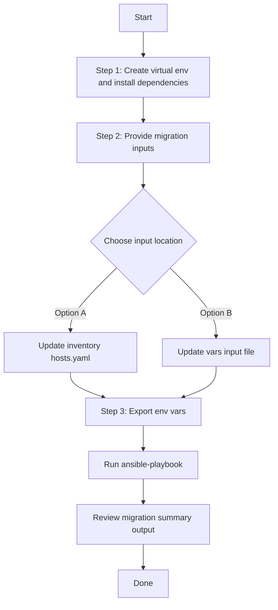
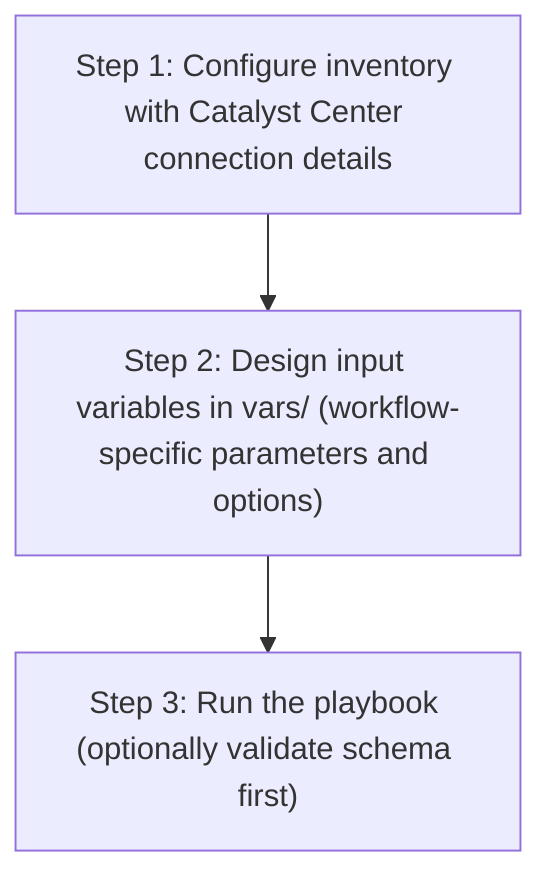

# SDA Port Assignment Migration

This workflow migrates SDA host port assignments from a source device IP to a destination device IP.

It uses:
- `cisco.dnac.sda_host_port_onboarding_playbook_config_generator` to export source port assignments.
- `cisco.dnac.sda_host_port_onboarding_workflow_manager` to apply those assignments to destination devices.

## Workflow Representation

The following diagram represents the end-to-end functionality performed by this workflow:


## Input Data Model

### Definition

| Field | Type | Required | Description |
|---|---|---|---|
| `port_assignment_migration` | `list[object]` | Yes | One or more migration entries. |
| `port_assignment_migration[].fabric_site` | `string` | Yes | Fabric site hierarchy (for example: `Global/California/23`). |
| `port_assignment_migration[].source_device_ip` | `string` | Yes | Source device management IP to export assignments from. |
| `port_assignment_migration[].destination_device_ip` | `string` | Yes | Destination device management IP to apply assignments to. |
| `port_assignment_migration[].interface_mappings` | `list[object]` | No | Optional source-to-destination interface remap list. If omitted, migration is 1:1 by interface name. |
| `port_assignment_migration[].interface_mappings[].source_interface_name` | `string` | Yes (when `interface_mappings` used) | Interface name from the source device payload. |
| `port_assignment_migration[].interface_mappings[].destination_interface_name` | `string` | Yes (when `interface_mappings` used) | Interface name to use on destination device payload. |

### Example 1: 1:1 Interface Migration (Default)

```yaml
port_assignment_migration:
  - fabric_site: "Global/California/23"
    source_device_ip: "10.0.0.1"
    destination_device_ip: "10.0.0.2"
```

### Example 2: Partial Interface Remap

```yaml
port_assignment_migration:
  - fabric_site: "Global/California/23"
    source_device_ip: "10.0.0.1"
    destination_device_ip: "10.0.0.2"
    interface_mappings:
      - source_interface_name: "GigabitEthernet1/0/1"
        destination_interface_name: "GigabitEthernet1/0/25"
      - source_interface_name: "GigabitEthernet1/0/2"
        destination_interface_name: "GigabitEthernet1/0/26"
```

Behavior for Example 2:
- Interfaces listed in `interface_mappings` are remapped.
- Interfaces not listed in `interface_mappings` keep the same interface name (1:1).

## Files

- `playbook/sda_port_assignment_migration_playbook.yml`
- `playbook/tasks/migrate_single_port_assignment.yml`
- `schema/sda_port_assignment_migration_schema.yml`
- `vars/sda_port_assignment_migration_input.yml`
- `slides/sda_port_assignment_migration_usecase_slide.md`

## New User Flow Diagram



## Step 1: Virtual Env Setup

Run the following from repository root:

```bash
# Create and activate virtual environment
python3 -m venv .venv
source .venv/bin/activate

# Upgrade pip tooling
python -m pip install --upgrade pip setuptools wheel

# Install Python dependencies (includes ansible and dnacentersdk)
pip install -r requirements.txt

# Install/upgrade Cisco DNAC Ansible collection
ansible-galaxy collection install cisco.dnac --force
```

## Step 2: Create Inputs

You can provide migration inputs in either of these ways:

### Option A (Simplest CLI): Put inputs in inventory

Add workflow input variables under your inventory host (`inventory/demo_lab/hosts.yaml`):

```yaml
---
catalyst_center_hosts:
  hosts:
    catalyst_center220:
      # existing Catalyst Center connection vars...
      state: merged
      cleanup_generated_files: true
      generated_config_dir: "/tmp/sda_port_assignment_migration"
      port_assignment_migration:
        - fabric_site: "Global/California/23"
          source_device_ip: "10.0.0.1"
          destination_device_ip: "10.0.0.2"
```

Optional interface remap:

```yaml
port_assignment_migration:
  - fabric_site: "Global/California/23"
    source_device_ip: "10.0.0.1"
    destination_device_ip: "10.0.0.2"
    interface_mappings:
      - source_interface_name: "GigabitEthernet1/0/1"
        destination_interface_name: "GigabitEthernet1/0/25"
      - source_interface_name: "GigabitEthernet1/0/2"
        destination_interface_name: "GigabitEthernet1/0/26"
```

### Option B: Keep inputs in a separate vars file

Update:
- `workflows/sda_port_assignment_migration/vars/sda_port_assignment_migration_input.yml`

## Step 3: Setup Env Variables and Run Playbook

The inventory file `inventory/demo_lab/hosts.yaml` reads Catalyst Center connection values from environment variables.

```bash
export HOSTIP=<host ip>
export CATALYST_CENTER_USERNAME=admin
export CATALYST_CENTER_PASSWORD='your_password'
# Optional override only (normally not needed):
# export ANSIBLE_PYTHON_INTERPRETER="$(pwd)/.venv/bin/python"
```

### Inventory File Explained (`inventory/demo_lab/hosts.yaml`)

This workflow runs against host group `catalyst_center_hosts` and expects one Catalyst Center target host (for example `catalyst_center220`).

Current inventory model:

```yaml
---
catalyst_center_hosts:
  hosts:
    catalyst_center220:
      catalyst_center_host: "{{ lookup('ansible.builtin.env', 'HOSTIP') }}"
      catalyst_center_username: "{{ lookup('ansible.builtin.env', 'CATALYST_CENTER_USERNAME') }}"
      catalyst_center_password: "{{ lookup('ansible.builtin.env', 'CATALYST_CENTER_PASSWORD') }}"
      ansible_python_interpreter: "{{ lookup('ansible.builtin.env', 'ANSIBLE_PYTHON_INTERPRETER') | default(ansible_playbook_python, true) }}"
      catalyst_center_port: 443
      catalyst_center_timeout: 60
      catalyst_center_verify: false
      catalyst_center_version: 2.3.7.9
      catalyst_center_debug: true
      catalyst_center_log: true
      catalyst_center_log_level: INFO
```

What each variable is used for:
- `catalyst_center_host` (required): Catalyst Center IP/FQDN used by all API calls.
- `catalyst_center_username` (required): login username.
- `catalyst_center_password` (required): login password.
- `ansible_python_interpreter` (auto): defaults to `ansible_playbook_python` (current active Python env running Ansible); can be overridden by `ANSIBLE_PYTHON_INTERPRETER`.
- `catalyst_center_port` (optional, default `443`): HTTPS port.
- `catalyst_center_timeout` (optional): request timeout value.
- `catalyst_center_verify` (optional, `true/false`): TLS certificate verification behavior.
- `catalyst_center_version` (recommended): target Catalyst Center version for SDK/module compatibility.
- `catalyst_center_debug`, `catalyst_center_log`, `catalyst_center_log_level` (optional): module logging/debug controls.

Why env variables are used:
- Keeps secrets out of git-tracked files.
- Lets the same inventory work across labs/environments.

Input source behavior:
- If `VARS_FILE_PATH` is provided, inputs are loaded from that vars file.
- If `VARS_FILE_PATH` is not provided, playbook uses inputs from inventory variables.

Run (inventory input mode, no extra vars):

```bash
ansible-playbook -i ./inventory/demo_lab/hosts.yaml \
  ./workflows/sda_port_assignment_migration/playbook/sda_port_assignment_migration_playbook.yml \
  -vvvv
```

Run (vars file mode, optional):

```bash
ansible-playbook -i ./inventory/demo_lab/hosts.yaml \
  ./workflows/sda_port_assignment_migration/playbook/sda_port_assignment_migration_playbook.yml \
  --extra-vars VARS_FILE_PATH=./workflows/sda_port_assignment_migration/vars/sda_port_assignment_migration_input.yml \
  -vvvv
```

## Example Migration Result (Run on March 25, 2026)

Input used:

```yaml
port_assignment_migration:
  - fabric_site: "Global/California/23"
    source_device_ip: "10.0.0.1"
    destination_device_ip: "10.0.0.2"
```

What was migrated from source `10.0.0.1` to destination `10.0.0.2`:
- Total interfaces in source payload: `14`
- Interfaces: `GigabitEthernet1/0/1`, `GigabitEthernet1/0/2`, `GigabitEthernet1/0/3`, `GigabitEthernet1/0/5`, `GigabitEthernet1/0/6`, `GigabitEthernet1/0/7`, `GigabitEthernet1/0/10`, `GigabitEthernet1/0/12`, `GigabitEthernet1/0/13`, `GigabitEthernet1/0/14`, `GigabitEthernet1/0/15`, `GigabitEthernet1/0/16`, `GigabitEthernet1/0/17`, `GigabitEthernet1/0/18`

Apply stage result (`sda_host_port_onboarding_workflow_manager`):
- `status: success`
- Added/updated interfaces count: `8`
- Added/updated interfaces: `GigabitEthernet1/0/10`, `GigabitEthernet1/0/12`, `GigabitEthernet1/0/13`, `GigabitEthernet1/0/14`, `GigabitEthernet1/0/15`, `GigabitEthernet1/0/16`, `GigabitEthernet1/0/17`, `GigabitEthernet1/0/18`
- No-update interfaces count: `6`
- No-update interfaces: `GigabitEthernet1/0/1`, `GigabitEthernet1/0/2`, `GigabitEthernet1/0/3`, `GigabitEthernet1/0/5`, `GigabitEthernet1/0/6`, `GigabitEthernet1/0/7`

Workflow summary from logs:
- `port_assignment_migration_results` showed `generator_status: success` and `migration_status: success`
- `port_assignment_migration_results` also reports `interface_mapping_count` per migration entry
- `port_assignment_migration_results` reports `source_export_filter_mode` (`device_ip` when advanced filter schema is supported, otherwise `fabric_site_only`)
- Post-migration summary now reports interface outcomes:
  - `interfaces_moved`
  - `interfaces_moved_count`
  - `interfaces_targeted`
  - `interfaces_updated` (created/updated by apply tasks)
  - `interfaces_no_change`
  - `interfaces_unreported` (targeted interfaces not explicitly listed by module result)
  - `catalyst_center_change_count` (only actual Catalyst Center updates/creates)
- Local housekeeping tasks (generated file create/remove, local temp directory handling) are excluded from Ansible `changed` count.
- Temporary generated source file was removed successfully
- `PLAY RECAP`: `failed=0`, `unreachable=0`

## How Verification Was Done

1. Verified source export succeeded and included site data for `Global/California/23`.
2. Verified source device selection by exact IP match (`10.0.0.1`) from `generated_source_config.config`.
3. Verified destination payload was built with destination IP (`10.0.0.2`) and source port assignments list (with optional `interface_mappings` remap when provided).
4. Verified apply task returned `status: success` and reported interface-level outcomes (`success_interfaces` and `port_assignments_no_update_needed`).
5. Verified final play recap had no failures.

## Notes

- Each migration entry is processed independently.
- The workflow fails fast only for real export/generator errors (for example, no generated source file after all export attempts).
- The workflow removes any existing generated export file before each run to avoid false-failure behavior from config generator idempotency checks.
- Export behavior supports both filter schemas for compatibility:
  - Preferred: per-site list with `device_ips` (source-device-aware export).
  - Fallback: legacy `fabric_site_name_hierarchy` only.
- If a source device has no port assignment onboarding in the exported data, that migration entry is skipped as a successful no-op with a clear message and zero Catalyst Center changes.
- The workflow validates interface remap integrity:
  - Duplicate `source_interface_name` values are rejected.
  - Duplicate `destination_interface_name` values are rejected.
  - Any mapped source interface missing from exported source payload is rejected.
  - Any duplicate destination interface in final payload (after remap) is rejected.
- Generated intermediate export files are removed by default (`cleanup_generated_files: true`).
- Set `cleanup_generated_files: false` only when you want to retain generated export files for troubleshooting.
- Apply operation defaults to `state: merged`; set `state` explicitly only when you need a different module behavior.


Example Run Logs:
ansible-playbook -i ./inventory/demo_lab/hosts.yaml ./workflows/sda_port_assignment_migration/playbook/sda_port_assignment_migration_playbook.yml

PLAY [Migrate SDA port assignments from source to destination devices] *****************************************************

TASK [Print input source] **************************************************************************************************
ok: [catalyst_center220] => {
    "msg": "Input source: inventory variables (VARS_FILE_PATH not provided)"
}

TASK [Load input variables from vars file when provided] *******************************************************************
skipping: [catalyst_center220]

TASK [Validate migration input list] ***************************************************************************************
skipping: [catalyst_center220]

TASK [Ensure generated config directory exists] ****************************************************************************
ok: [catalyst_center220]

TASK [Port assignment migration workflow start time] ***********************************************************************
ok: [catalyst_center220]

TASK [Process each source to destination migration entry] ******************************************************************
included: /Users/pawansi/dnac_ansible_workflows/workflows/sda_port_assignment_migration/playbook/tasks/migrate_single_port_assignment.yml for catalyst_center220 => (item=10.195.120.219 -> 10.195.120.173 (Global/California/23))

TASK [Validate source and destination are not the same] ********************************************************************
skipping: [catalyst_center220]

TASK [Build generated source config file path for migration] ***************************************************************
ok: [catalyst_center220]

TASK [Remove stale generated source config file before export] *************************************************************
ok: [catalyst_center220]

TASK [Initialize source export mode] ***************************************************************************************
ok: [catalyst_center220]

TASK [Export source port assignments using source device IP filter] ********************************************************
[DEPRECATION WARNING]: The cisco.dnac collection is deprecated. Please migrate to cisco.catalystcenter. This feature will 
be removed from cisco.dnac in version 7.0.0. Deprecation warnings can be disabled by setting deprecation_warnings=False in 
ansible.cfg.
ok: [catalyst_center220]

TASK [Check generated source config file after device IP export] ***********************************************************
ok: [catalyst_center220]

TASK [Export source port assignments using fabric-site-only fallback] ******************************************************
skipping: [catalyst_center220]

TASK [Check generated source config file after export attempts] ************************************************************
ok: [catalyst_center220]

TASK [Track export mode and generator result object used] ******************************************************************
ok: [catalyst_center220]

TASK [Fail when source export returned error and no file was generated] ****************************************************
skipping: [catalyst_center220]

TASK [Load generated source port assignment configuration] *****************************************************************
ok: [catalyst_center220]

TASK [Initialize empty generated source config when export produced no file] ***********************************************
skipping: [catalyst_center220]

TASK [Find source device port assignment entry] ****************************************************************************
ok: [catalyst_center220]

TASK [Capture source device port assignments for migration] ****************************************************************
ok: [catalyst_center220]

TASK [Capture source interface names and requested interface mappings] *****************************************************
ok: [catalyst_center220]

TASK [Notify when no source port assignment onboarding exists] *************************************************************
skipping: [catalyst_center220]

TASK [Validate mapped source interfaces are unique] ************************************************************************
skipping: [catalyst_center220]

TASK [Validate mapped destination interfaces are unique] *******************************************************************
skipping: [catalyst_center220]

TASK [Validate mapped source interfaces exist in source payload] ***********************************************************
ok: [catalyst_center220]

TASK [Fail when mapped source interfaces are missing in source payload] ****************************************************
skipping: [catalyst_center220]

TASK [Initialize source-to-destination interface mapping lookup] ***********************************************************
ok: [catalyst_center220]

TASK [Build source-to-destination interface mapping lookup] ****************************************************************
skipping: [catalyst_center220]

TASK [Initialize destination port assignment payload list] *****************************************************************
ok: [catalyst_center220]

TASK [Build destination port assignment payload with optional interface remap] *********************************************
ok: [catalyst_center220] => (item={'interface_name': 'GigabitEthernet1/0/6', 'connected_device_type': 'USER_DEVICE', 'data_vlan_name': 'testme', 'authentication_template_name': 'No Authentication'})
ok: [catalyst_center220] => (item={'interface_name': 'GigabitEthernet1/0/14', 'connected_device_type': 'USER_DEVICE', 'data_vlan_name': 'testme', 'authentication_template_name': 'No Authentication'})
ok: [catalyst_center220] => (item={'interface_name': 'GigabitEthernet1/0/15', 'connected_device_type': 'USER_DEVICE', 'data_vlan_name': 'testme', 'authentication_template_name': 'No Authentication', 'interface_description': 'Keith wuz Here'})
ok: [catalyst_center220] => (item={'interface_name': 'GigabitEthernet1/0/17', 'connected_device_type': 'USER_DEVICE', 'data_vlan_name': 'testme', 'authentication_template_name': 'No Authentication', 'interface_description': 'Keith wuz Here'})
ok: [catalyst_center220] => (item={'interface_name': 'GigabitEthernet1/0/2', 'connected_device_type': 'USER_DEVICE', 'data_vlan_name': 'MSRB', 'authentication_template_name': 'No Authentication'})
ok: [catalyst_center220] => (item={'interface_name': 'GigabitEthernet1/0/3', 'connected_device_type': 'USER_DEVICE', 'data_vlan_name': 'MSRB', 'authentication_template_name': 'No Authentication'})
ok: [catalyst_center220] => (item={'interface_name': 'GigabitEthernet1/0/16', 'connected_device_type': 'USER_DEVICE', 'data_vlan_name': 'testme', 'authentication_template_name': 'No Authentication', 'interface_description': 'Keith wuz Here'})
ok: [catalyst_center220] => (item={'interface_name': 'GigabitEthernet1/0/1', 'connected_device_type': 'USER_DEVICE', 'data_vlan_name': 'MSRB', 'authentication_template_name': 'No Authentication'})
ok: [catalyst_center220] => (item={'interface_name': 'GigabitEthernet1/0/12', 'connected_device_type': 'USER_DEVICE', 'data_vlan_name': 'MSRB', 'authentication_template_name': 'No Authentication'})
ok: [catalyst_center220] => (item={'interface_name': 'GigabitEthernet1/0/7', 'connected_device_type': 'USER_DEVICE', 'data_vlan_name': 'testme', 'authentication_template_name': 'No Authentication'})
ok: [catalyst_center220] => (item={'interface_name': 'GigabitEthernet1/0/13', 'connected_device_type': 'USER_DEVICE', 'data_vlan_name': 'MSRB', 'authentication_template_name': 'No Authentication'})
ok: [catalyst_center220] => (item={'interface_name': 'GigabitEthernet1/0/18', 'connected_device_type': 'USER_DEVICE', 'data_vlan_name': 'testme', 'authentication_template_name': 'No Authentication', 'interface_description': 'Keith wuz Here'})
ok: [catalyst_center220] => (item={'interface_name': 'GigabitEthernet1/0/10', 'connected_device_type': 'USER_DEVICE', 'data_vlan_name': 'testme', 'authentication_template_name': 'No Authentication'})
ok: [catalyst_center220] => (item={'interface_name': 'GigabitEthernet1/0/5', 'connected_device_type': 'USER_DEVICE', 'data_vlan_name': 'testme', 'authentication_template_name': 'No Authentication'})

TASK [Validate destination interfaces are unique after remap] **************************************************************
skipping: [catalyst_center220]

TASK [Build destination device onboarding payload from source interfaces] **************************************************
ok: [catalyst_center220]

TASK [Apply source port assignments to destination device] *****************************************************************
changed: [catalyst_center220]

TASK [Track skipped apply result when no source port assignment onboarding exists] *****************************************
skipping: [catalyst_center220]

TASK [Initialize apply outcome reporting containers] ***********************************************************************
ok: [catalyst_center220]

TASK [Build target destination interface list for reporting] ***************************************************************
ok: [catalyst_center220]

TASK [Collect apply message objects for reporting] *************************************************************************
ok: [catalyst_center220]

TASK [Flatten apply message dictionary blocks] *****************************************************************************
ok: [catalyst_center220] => (item={'Add Port Assignment(s) Task Succeeded for following interface(s)': {'success_count': 14, 'success_interfaces': ['GigabitEthernet1/0/6', 'GigabitEthernet1/0/14', 'GigabitEthernet1/0/15', 'GigabitEthernet1/0/17', 'GigabitEthernet1/0/2', 'GigabitEthernet1/0/3', 'GigabitEthernet1/0/16', 'GigabitEthernet1/0/1', 'GigabitEthernet1/0/12', 'GigabitEthernet1/0/7', 'GigabitEthernet1/0/13', 'GigabitEthernet1/0/18', 'GigabitEthernet1/0/10', 'GigabitEthernet1/0/5']}})
ok: [catalyst_center220] => (item={'Add Port Assignment(s) Task Succeeded for following interface(s)': {'success_count': 14, 'success_interfaces': ['GigabitEthernet1/0/6', 'GigabitEthernet1/0/14', 'GigabitEthernet1/0/15', 'GigabitEthernet1/0/17', 'GigabitEthernet1/0/2', 'GigabitEthernet1/0/3', 'GigabitEthernet1/0/16', 'GigabitEthernet1/0/1', 'GigabitEthernet1/0/12', 'GigabitEthernet1/0/7', 'GigabitEthernet1/0/13', 'GigabitEthernet1/0/18', 'GigabitEthernet1/0/10', 'GigabitEthernet1/0/5']}})

TASK [Expand nested apply message blocks] **********************************************************************************
ok: [catalyst_center220] => (item={'success_count': 14, 'success_interfaces': ['GigabitEthernet1/0/6', 'GigabitEthernet1/0/14', 'GigabitEthernet1/0/15', 'GigabitEthernet1/0/17', 'GigabitEthernet1/0/2', 'GigabitEthernet1/0/3', 'GigabitEthernet1/0/16', 'GigabitEthernet1/0/1', 'GigabitEthernet1/0/12', 'GigabitEthernet1/0/7', 'GigabitEthernet1/0/13', 'GigabitEthernet1/0/18', 'GigabitEthernet1/0/10', 'GigabitEthernet1/0/5']})
ok: [catalyst_center220] => (item={'success_count': 14, 'success_interfaces': ['GigabitEthernet1/0/6', 'GigabitEthernet1/0/14', 'GigabitEthernet1/0/15', 'GigabitEthernet1/0/17', 'GigabitEthernet1/0/2', 'GigabitEthernet1/0/3', 'GigabitEthernet1/0/16', 'GigabitEthernet1/0/1', 'GigabitEthernet1/0/12', 'GigabitEthernet1/0/7', 'GigabitEthernet1/0/13', 'GigabitEthernet1/0/18', 'GigabitEthernet1/0/10', 'GigabitEthernet1/0/5']})

TASK [Collect interfaces reported as updated/created] **********************************************************************
ok: [catalyst_center220] => (item={'success_count': 14, 'success_interfaces': ['GigabitEthernet1/0/6', 'GigabitEthernet1/0/14', 'GigabitEthernet1/0/15', 'GigabitEthernet1/0/17', 'GigabitEthernet1/0/2', 'GigabitEthernet1/0/3', 'GigabitEthernet1/0/16', 'GigabitEthernet1/0/1', 'GigabitEthernet1/0/12', 'GigabitEthernet1/0/7', 'GigabitEthernet1/0/13', 'GigabitEthernet1/0/18', 'GigabitEthernet1/0/10', 'GigabitEthernet1/0/5']})
skipping: [catalyst_center220] => (item=14) 
skipping: [catalyst_center220] => (item=['GigabitEthernet1/0/6', 'GigabitEthernet1/0/14', 'GigabitEthernet1/0/15', 'GigabitEthernet1/0/17', 'GigabitEthernet1/0/2', 'GigabitEthernet1/0/3', 'GigabitEthernet1/0/16', 'GigabitEthernet1/0/1', 'GigabitEthernet1/0/12', 'GigabitEthernet1/0/7', 'GigabitEthernet1/0/13', 'GigabitEthernet1/0/18', 'GigabitEthernet1/0/10', 'GigabitEthernet1/0/5']) 
ok: [catalyst_center220] => (item={'success_count': 14, 'success_interfaces': ['GigabitEthernet1/0/6', 'GigabitEthernet1/0/14', 'GigabitEthernet1/0/15', 'GigabitEthernet1/0/17', 'GigabitEthernet1/0/2', 'GigabitEthernet1/0/3', 'GigabitEthernet1/0/16', 'GigabitEthernet1/0/1', 'GigabitEthernet1/0/12', 'GigabitEthernet1/0/7', 'GigabitEthernet1/0/13', 'GigabitEthernet1/0/18', 'GigabitEthernet1/0/10', 'GigabitEthernet1/0/5']})
skipping: [catalyst_center220] => (item=14) 
skipping: [catalyst_center220] => (item=['GigabitEthernet1/0/6', 'GigabitEthernet1/0/14', 'GigabitEthernet1/0/15', 'GigabitEthernet1/0/17', 'GigabitEthernet1/0/2', 'GigabitEthernet1/0/3', 'GigabitEthernet1/0/16', 'GigabitEthernet1/0/1', 'GigabitEthernet1/0/12', 'GigabitEthernet1/0/7', 'GigabitEthernet1/0/13', 'GigabitEthernet1/0/18', 'GigabitEthernet1/0/10', 'GigabitEthernet1/0/5']) 

TASK [Collect interfaces reported as no-change] ****************************************************************************
skipping: [catalyst_center220] => (item={'success_count': 14, 'success_interfaces': ['GigabitEthernet1/0/6', 'GigabitEthernet1/0/14', 'GigabitEthernet1/0/15', 'GigabitEthernet1/0/17', 'GigabitEthernet1/0/2', 'GigabitEthernet1/0/3', 'GigabitEthernet1/0/16', 'GigabitEthernet1/0/1', 'GigabitEthernet1/0/12', 'GigabitEthernet1/0/7', 'GigabitEthernet1/0/13', 'GigabitEthernet1/0/18', 'GigabitEthernet1/0/10', 'GigabitEthernet1/0/5']}) 
skipping: [catalyst_center220] => (item=14) 
skipping: [catalyst_center220] => (item=['GigabitEthernet1/0/6', 'GigabitEthernet1/0/14', 'GigabitEthernet1/0/15', 'GigabitEthernet1/0/17', 'GigabitEthernet1/0/2', 'GigabitEthernet1/0/3', 'GigabitEthernet1/0/16', 'GigabitEthernet1/0/1', 'GigabitEthernet1/0/12', 'GigabitEthernet1/0/7', 'GigabitEthernet1/0/13', 'GigabitEthernet1/0/18', 'GigabitEthernet1/0/10', 'GigabitEthernet1/0/5']) 
skipping: [catalyst_center220] => (item={'success_count': 14, 'success_interfaces': ['GigabitEthernet1/0/6', 'GigabitEthernet1/0/14', 'GigabitEthernet1/0/15', 'GigabitEthernet1/0/17', 'GigabitEthernet1/0/2', 'GigabitEthernet1/0/3', 'GigabitEthernet1/0/16', 'GigabitEthernet1/0/1', 'GigabitEthernet1/0/12', 'GigabitEthernet1/0/7', 'GigabitEthernet1/0/13', 'GigabitEthernet1/0/18', 'GigabitEthernet1/0/10', 'GigabitEthernet1/0/5']}) 
skipping: [catalyst_center220] => (item=14) 
skipping: [catalyst_center220] => (item=['GigabitEthernet1/0/6', 'GigabitEthernet1/0/14', 'GigabitEthernet1/0/15', 'GigabitEthernet1/0/17', 'GigabitEthernet1/0/2', 'GigabitEthernet1/0/3', 'GigabitEthernet1/0/16', 'GigabitEthernet1/0/1', 'GigabitEthernet1/0/12', 'GigabitEthernet1/0/7', 'GigabitEthernet1/0/13', 'GigabitEthernet1/0/18', 'GigabitEthernet1/0/10', 'GigabitEthernet1/0/5']) 
skipping: [catalyst_center220]

TASK [Normalize apply outcome interface lists] *****************************************************************************
ok: [catalyst_center220]

TASK [Track migration result] **********************************************************************************************
ok: [catalyst_center220]

TASK [Remove generated source config file] *********************************************************************************
ok: [catalyst_center220]

TASK [Print migration workflow output summary] *****************************************************************************
ok: [catalyst_center220] => {
    "port_assignment_migration_results": [
        {
            "catalyst_center_change_count": 14,
            "catalyst_center_changed": true,
            "destination_device_ip": "10.195.120.173",
            "fabric_site": "Global/California/23",
            "generated_file": "/tmp/sda_port_assignment_migration/sda_port_assignment_source_10_195_120_219_to_10_195_120_173.yml",
            "generator_status": "success",
            "interface_mapping_count": 0,
            "interfaces_moved": [
                "GigabitEthernet1/0/1",
                "GigabitEthernet1/0/10",
                "GigabitEthernet1/0/12",
                "GigabitEthernet1/0/13",
                "GigabitEthernet1/0/14",
                "GigabitEthernet1/0/15",
                "GigabitEthernet1/0/16",
                "GigabitEthernet1/0/17",
                "GigabitEthernet1/0/18",
                "GigabitEthernet1/0/2",
                "GigabitEthernet1/0/3",
                "GigabitEthernet1/0/5",
                "GigabitEthernet1/0/6",
                "GigabitEthernet1/0/7"
            ],
            "interfaces_moved_count": 14,
            "interfaces_no_change": [],
            "interfaces_no_change_count": 0,
            "interfaces_targeted": [
                "GigabitEthernet1/0/1",
                "GigabitEthernet1/0/10",
                "GigabitEthernet1/0/12",
                "GigabitEthernet1/0/13",
                "GigabitEthernet1/0/14",
                "GigabitEthernet1/0/15",
                "GigabitEthernet1/0/16",
                "GigabitEthernet1/0/17",
                "GigabitEthernet1/0/18",
                "GigabitEthernet1/0/2",
                "GigabitEthernet1/0/3",
                "GigabitEthernet1/0/5",
                "GigabitEthernet1/0/6",
                "GigabitEthernet1/0/7"
            ],
            "interfaces_targeted_count": 14,
            "interfaces_unreported": [],
            "interfaces_unreported_count": 0,
            "interfaces_updated": [
                "GigabitEthernet1/0/1",
                "GigabitEthernet1/0/10",
                "GigabitEthernet1/0/12",
                "GigabitEthernet1/0/13",
                "GigabitEthernet1/0/14",
                "GigabitEthernet1/0/15",
                "GigabitEthernet1/0/16",
                "GigabitEthernet1/0/17",
                "GigabitEthernet1/0/18",
                "GigabitEthernet1/0/2",
                "GigabitEthernet1/0/3",
                "GigabitEthernet1/0/5",
                "GigabitEthernet1/0/6",
                "GigabitEthernet1/0/7"
            ],
            "interfaces_updated_count": 14,
            "migration_status": "success",
            "source_device_ip": "10.195.120.219",
            "source_export_filter_mode": "device_ip"
        }
    ]
}

TASK [Build migration interface outcome totals] ****************************************************************************
ok: [catalyst_center220]

TASK [Print migration interface outcome totals] ****************************************************************************
ok: [catalyst_center220] => {
    "msg": "SDA Port Assignment Migration Summary\n- Total migrations processed: 1\n- Interfaces moved: 14\n- Interfaces updated/created: 14\n- Interfaces no change needed: 0\n- Interfaces unreported by apply task: 0\n- Catalyst Center change count: 14\n- Migrations with Catalyst Center changes: 1\n"
}

TASK [Print per-migration interface outcome summary] ***********************************************************************
ok: [catalyst_center220] => (item=entry 1: 10.195.120.219 -> 10.195.120.173) => {
    "msg": "------------------------------------------------------------\nMigration Entry 1\nSource -> Destination : 10.195.120.219 -> 10.195.120.173\nFabric Site           : Global/California/23\nExport Filter Mode    : device_ip\nInterface Mappings    : 0\nCatalyst Ctr Changes  : 14\n\nInterface Outcomes\n  Moved (14):\n      - \\1\\n      - \\1\\n      - \\1\\n      - \\1\\n      - \\1\\n      - \\1\\n      - \\1\\n      - \\1\\n      - \\1\\n      - \\1\\n      - \\1\\n      - \\1\\n      - \\1\\n      - \\1\n  Updated/Created (14):\n      - \\1\\n      - \\1\\n      - \\1\\n      - \\1\\n      - \\1\\n      - \\1\\n      - \\1\\n      - \\1\\n      - \\1\\n      - \\1\\n      - \\1\\n      - \\1\\n      - \\1\\n      - \\1\n  No Change (0):\n      - None\n  Unreported (0):\n      - None\n"
}

TASK [Port assignment migration workflow end time] *************************************************************************
ok: [catalyst_center220]

TASK [Print migration workflow execution time] *****************************************************************************
ok: [catalyst_center220] => {
    "msg": "Start: 2026-03-26 18:24:09.333456, End: 2026-03-26 18:24:37.851458"
}

TASK [Get python path] *****************************************************************************************************
[WARNING]: Platform darwin on host catalyst_center220 is using the discovered Python interpreter at
/usr/local/bin/python3.12, but future installation of another Python interpreter could change the meaning of that path. See
https://docs.ansible.com/ansible-core/2.16/reference_appendices/interpreter_discovery.html for more information.
ok: [catalyst_center220 -> catalyst_center_hosts]

PLAY RECAP *****************************************************************************************************************
catalyst_center220         : ok=37   changed=1    unreachable=0    failed=0    skipped=14   rescued=0    ignored=0  
## User Flow (3 Steps)


