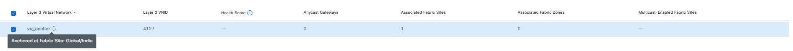
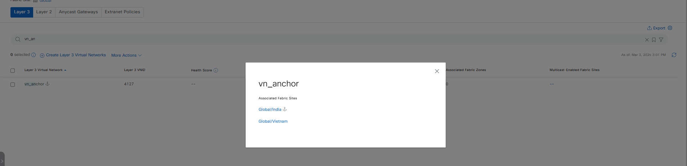
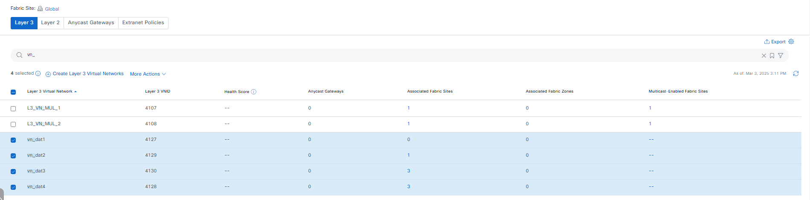
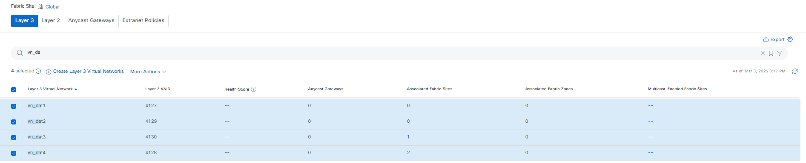
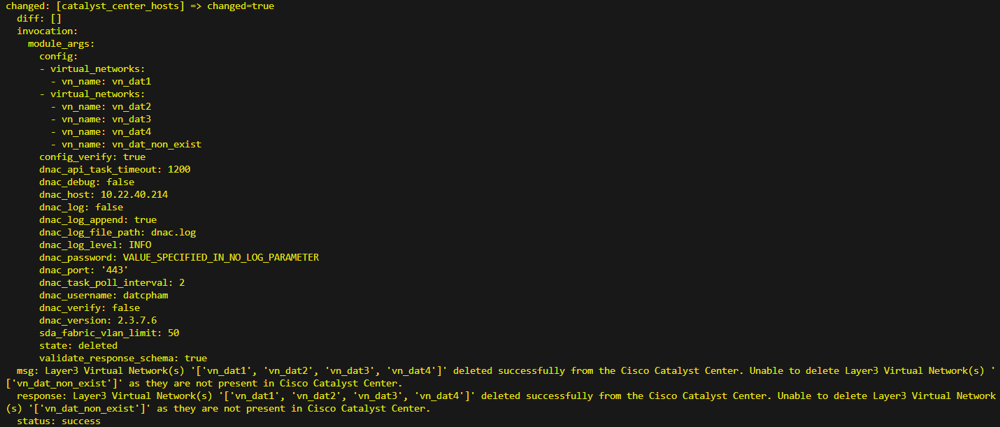
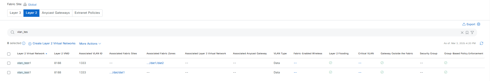
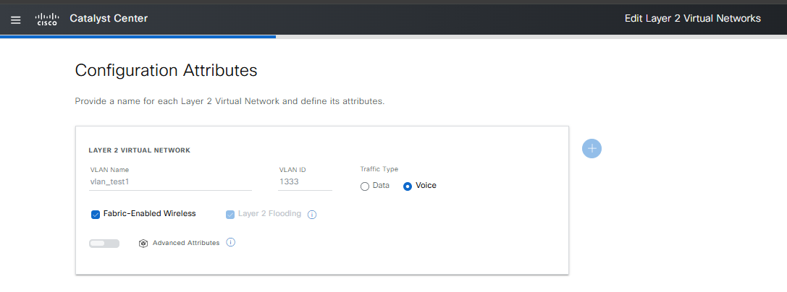
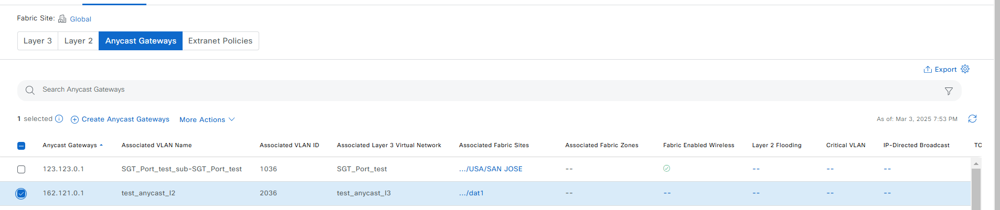
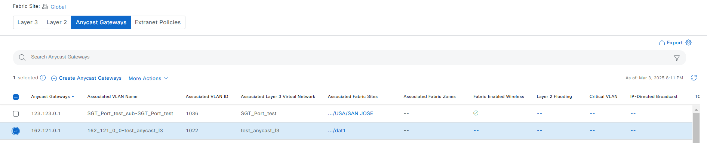

# SDA Fabric Virtual Networks Automation and onboarding anycast gaetways on fabric sites
This Ansible playbooks to automate the configuration of Fabric VLANs, Virtual Networks, and Anycast Gateways within a Cisco SD-Access fabric using the Cisco DNA Center.

# Requirements:
  - Cisco Catalyst Center (DNAC) version: 2.3.7.6 (minimum version)
  - DnacenterSDK 2.9.4 (minimum version)
  - Ansible 2.9.10 (minimum version)
  - Python 3.10.0 (minimum version)

## Playbook: 
sda_virtual_networks_l2_l3_gateways_playbook.yml
This playbook utilizes the cisco.dnac.sda_fabric_virtual_networks_workflow_manager Ansible module to manage various aspects of SD-Access virtual networks 
### including:
Fabric VLANs: Create, update, and delete Layer 2 Fabric VLANs.
Virtual Networks: Create, update, and delete Layer 3 Virtual Networks.
Anycast Gateways: Create, update, and delete Anycast Gateways for providing Layer 3 connectivity within the SD-Access fabric.


# How to execute playbook:

# Procedure
1. ## Prepare your Ansible environment:

Install Ansible if you haven't already
Ensure you have network connectivity to your Catalyst Center instance.
Checkout the project and playbooks: git@github.com:cisco-en-programmability/catalyst-center-ansible-iac.git

2. ## Configure Host Inventory:

The host_inventory_dnac1/hosts.yml file specifies the connection details (IP address, credentials, etc.) for your Catalyst Center instance.
Make sure the dnac_version in this file matches your actual Catalyst Center version.
##The Sample host_inventory_dnac1/hosts.yml

```bash
catalyst_center_hosts:
    hosts:
        catalyst_center220:
            dnac_host: xx.xx.xx.xx.
            dnac_password: XXXXXXXX
            dnac_port: 443
            dnac_timeout: 60
            dnac_username: admin
            dnac_verify: false
            dnac_version: 2.3.7.6
            dnac_debug: true
            dnac_log_level: INFO
            dnac_log: true
```
## Validate the playbooks with schema
```bash
(pyats) pawansi@PAWANSI-M-81A3 dnac_ansible_workflows % yamale -s workflows/sda_virtual_networks_l2l3_gateways/schema/sda_virtual_networks_l2_l3_gateways_schema.yml workflows/sda_virtual_networks_l2l3_gateways/vars
Finding yaml files...
Found 2 yaml files.
Validating...
Validation success! 👍
```

## Running playbook
```bash
ansible-playbook -i host_inventory_dnac1/hosts.yml  workflows/sda_virtual_networks_l2l3_gateways/playbook/sda_virtual_networks_l2_l3_gateways_playbook.yml --e VARS_FILE_PATH=../vars/sda_virtual_networks_l2_l3_gateways_input.yml -vvvv
```

# SDA Fabric Virtual Networks Tasks
## Understanding the NewConfigs for SDA Fabric Virtual Networks Tasks
In the context of SDA Fabric Virtual Networks, there are three main components: Layer 3 Virtual Networks (`layer3`), Layer 2 Fabric VLANs (`layer2`), and Anycast Gateways (`anycast_gateways`). This document will guide you through creating, updating, and deleting these components using configuration files.
### 1. Layer 3 Virtual Networks
  #### a. Create layer3
  Creating layer3 includes details such as name, associated fabric sites, and anchored site. You can only use `vn_name` to create layer3. If you want layer3 to associate with a site, you need to create the corresponding fabric site beforehand. If you want to anchor to a site, you need to add an SDA device with the role of [CONTROL_PLANE_NODE, BORDER_NODE] in the fabric site beforehand.
  
  + Example input config:
    ```yaml
      sda_fabric_virtual_networks_details:
        - virtual_networks:
          - vn_name: "vn_anchor"
            fabric_site_locations:
              - site_name_hierarchy: "Global/India"
                fabric_type: "fabric_site"
            anchored_site_name: "Global/India"
    ```
    mapping config to UI Actions:
    
  
  * Parameter Explanation:
    ```yaml
      vn_name: name of layer3
      site_name_hierarchy: fabric site that layer3 associate
      fabric_type: specifies the type of site to be managed. The acceptable values are 'fabric_site'  and 'fabric_zone'. The default value is 'fabric_site'
      anchored_site_name: specifies the name of the fabric site where the virtual network is anchored. When a Virtual Network is anchored at the site, at least one CP and External Border must be present
    ```

  #### b. Update layer3
  + Example input config associate multiple sites:
    ```yaml
      sda_fabric_virtual_networks_details:
        - virtual_networks:
          - vn_name: "vn_anchor"
            fabric_site_locations:
              - site_name_hierarchy: "Global/India"
                fabric_type: "fabric_site"
              - site_name_hierarchy: "Global/Vietnam"
    ```
    mapping config to UI Actions:
    

  + Example input config remove all fabric site:
    ```yaml
      sda_fabric_virtual_networks_details:
        - virtual_networks:
          - vn_name: "vn_anchor"
            fabric_site_locations: []
    ```

  #### c. Delete layer3
  + Example input config:
    ```yaml
      sda_fabric_virtual_networks_details:
        - virtual_networks:
            - vn_name: "vn_anchor"
    ```
    \* **Note**: If Layer 3 is associated with a fabric site or anchor previously, in the UI we will not be able to perform the delete action for Layer 3. However, with the Ansible playbook, it allows deletion by first deleting the associations to the fabric site and anchor (if have), and then deleting Layer 3.

  #### d. Add/Update/Delete Bulk layer3
  + Example config for `add` multiple layer3:
    ```yaml
      sda_fabric_virtual_networks_details:
        - virtual_networks:
            - vn_name: "vn_dat1"
        - virtual_networks:
            - vn_name: "vn_dat2"
              fabric_site_locations:
                - site_name_hierarchy: "Global/dat1"
            - vn_name: "vn_dat3"
              fabric_site_locations:
                - site_name_hierarchy: "Global/dat1"
                - site_name_hierarchy: "Global/dat2"
                - site_name_hierarchy: "Global/dat/dat1"
            - vn_name: "vn_dat4"
              fabric_site_locations:
                - site_name_hierarchy: "Global/dat1"
                  fabric_type: "fabric_site"
                - site_name_hierarchy: "Global/dat2"
                  fabric_type: "fabric_site"
                - site_name_hierarchy: "Global/dat/dat1"
                  fabric_type: "fabric_site"
    ```
    mapping config to UI Actions:
    

    \* If we want create parallel layer3, we can use:
      ```yaml
        sda_fabric_virtual_networks_details:
          - virtual_networks:
            - vn_name: "vn_dat1"
              ...
            - vn_name: "vn_dat2"
              ...
            - vn_name: "vn_dat3"
              ...
      ```

  + Example config for `update` multiple layer3:
    ```yaml
      sda_fabric_virtual_networks_details:
        - virtual_networks:
            - vn_name: "vn_dat1"
        - virtual_networks:
            - vn_name: "vn_dat2"
              fabric_site_locations: []
            - vn_name: "vn_dat3"
              fabric_site_locations:
                - site_name_hierarchy: "Global/dat1"
            - vn_name: "vn_dat4"
              fabric_site_locations:
                - site_name_hierarchy: "Global/dat1"
                - site_name_hierarchy: "Global/dat2"
    ```
    mapping config to UI Actions:
    

  + Example config for `delete` multiple layer3:
    ```yaml
      sda_fabric_virtual_networks_details:
        - virtual_networks:
            - vn_name: "vn_dat1"
        - virtual_networks:
            - vn_name: "vn_dat2"
            - vn_name: "vn_dat3"
            - vn_name: "vn_dat4"
            - vn_name: "vn_dat_non_exist"
    ```
    module return message:
    

### 2. Layer 2 Fabric VLANs
  #### a. Create layer2
  + Example input config:
    ```yaml
      sda_fabric_virtual_networks_details:
        - fabric_vlan:
          - vlan_name: "vlan_test1"
            fabric_site_locations:
              - site_name_hierarchy: "Global/dat/dat1"
                fabric_type: "fabric_site"
              - site_name_hierarchy: "Global/dat/dat1/dat2"
                fabric_type: "fabric_zone"
            vlan_id: 1333
            traffic_type: "DATA"
    ```
    mapping config to UI Actions:
    

  * Parameter Explanation:
    ```yaml
      vlan_name: name of layer2
      vlan_id: id for the layer2 VLAN network
      site_name_hierarchy: identifies the site for operations
      fabric_type: specifies the type of site to be managed. The acceptable values are 'fabric_site'  and 'fabric_zone'. The default value is 'fabric_site'
      traffic_type: the type of traffic handled by the VLAN (e.g., DATA, VOICE). By default, it is set to "DATA"
      fabric_enabled_wireless: indicates whether the fabric VLAN is enabled for wireless in the fabric environment. By default, it is set to False (Optional)
      associated_layer3_virtual_network: name of the layer3 virtual network associated with the layer2 fabric VLAN. This field is provided to support requests related to virtual network anchoring (Optional)
    ```

  #### b. Update layer2
  You can only edit traffic_type, fabric_enabled_wireless, and the fabric zone
  + Example input config:
    ```yaml
      sda_fabric_virtual_networks_details:
        - fabric_vlan:
          - vlan_name: "vlan_test1"
            fabric_site_locations:
              - site_name_hierarchy: "Global/dat/dat1"
                fabric_type: "fabric_site"
            vlan_id: 1333
            traffic_type: "VOICE"
            fabric_enabled_wireless: true
    ```
    mapping config to UI Actions:
    

  + If want to update the assigned fabric zones to empty, need to try deleting Layer 2 with the specified zone:
    ```yaml
      sda_fabric_virtual_networks_details:
        - fabric_vlan:
          - vlan_name: "vlan_test1"
            fabric_site_locations:
              - site_name_hierarchy: "Global/dat/dat1/dat2"
                fabric_type: "fabric_zone"
            vlan_id: 1333
    ``` 

  #### c. Delete layer2
  + Example input config:
    ```yaml
      sda_fabric_virtual_networks_details:
        - fabric_vlan:
          - vlan_name: "vlan_test1"
            fabric_site_locations:
              - site_name_hierarchy: "Global/dat/dat1"
                fabric_type: "fabric_site"
            vlan_id: 1333
    ```

  #### d. Add/Update/Delete Bulk layer2
  + Example config for `add` multiple layer2:
    ```yaml
      sda_fabric_virtual_networks_details:
        - fabric_vlan:
            - vlan_name: l2_dat1
              fabric_site_locations:
                - site_name_hierarchy: "Global/dat1"
                  fabric_type: "fabric_site"
              traffic_type: "DATA"
              vlan_id: 1200
            - vlan_name: l2_dat2
              fabric_site_locations:
                - site_name_hierarchy: "Global/dat1"
                  fabric_type: "fabric_site"
              traffic_type: "DATA"
              vlan_id: 1201
    ```

    \* **Note**: If we want create parallel layer2 (maximum 50), we can use:
    ```yaml
      sda_fabric_virtual_networks_details:
        - fabric_vlan:
            - vlan_name: l2_dat1
              ...
            - vlan_name: l2_dat2
              ...
        - fabric_vlan:
            - vlan_name: l2_dat3
              ...
            - vlan_name: l2_dat4
              ...
            - vlan_name: l2_dat5
              ...
    ```
    -> It will create parallel `l2_dat1`, `l2_dat2`, and after completion, it will continue to create parallel `l2_dat3`, `l2_dat4`, and `l2_dat5`

  + Example config for `update` multiple layer2:
    ```yaml
      sda_fabric_virtual_networks_details:
        - fabric_vlan:
            - vlan_name: l2_dat1
              fabric_site_locations:
                - site_name_hierarchy: "Global/dat1"
                  fabric_type: "fabric_site"
              traffic_type: "VOICE"
              vlan_id: 1200
            - vlan_name: l2_dat2
              fabric_site_locations:
                - site_name_hierarchy: "Global/dat1"
                  fabric_type: "fabric_site"
              traffic_type: "VOICE"
              vlan_id: 1201
    ```

  + Example config for `delete` multiple layer2:
    ```yaml
      sda_fabric_virtual_networks_details:
        - fabric_vlan:
            - vlan_name: l2_dat1
              fabric_site_locations:
                - site_name_hierarchy: "Global/dat1"
                  fabric_type: "fabric_site"
              vlan_id: 1200
            - vlan_name: l2_dat2
              fabric_site_locations:
                - site_name_hierarchy: "Global/dat1"
                  fabric_type: "fabric_site"
              vlan_id: 1201
    ```

### 3. Anycast Gateways
  #### a. Create anycast_gateways
  To create an anycast gateway, we need to have Layer 3 already associated with at least one fabric site beforehand and an IP pool reserved at the specified site associated with Layer 3. 
  + Here, we will assume that the conditions mentioned above have been created beforehand with the following input: `vn_name: "test_anycast_l3"` associated with fabric `site site_name_hierarchy: "Global/dat1"`, and at the site "Global/dat1," a sub pool has been created with the name `name: "dat1_ippool"`.
    ```yaml
      create_global_pool:
        - global_pool_details:
            settings:
              ip_pool:
              - name: test_ippool_sda
                pool_type: Generic
                ip_address_space: IPv4
                cidr: 162.121.0.0/16
                dhcp_server_ips: []
                dns_server_ips: []
      create_sub_pool:
        - reserve_pool_details:
          - site_name: Global/dat1
            name: dat1_ippool
            pool_type: Generic
            ipv6_address_space: False
            ipv4_global_pool: '162.121.0.0/16'
            ipv4_global_pool_name: test_ippool_sda
            ipv4_prefix: false
            ipv4_total_host: 200
      create_l3:
        - virtual_networks:
            - vn_name: "test_anycast_l3"
              fabric_site_locations:
                - site_name_hierarchy: "Global/dat1"
    ```

  + Example input config (1):
    ```yaml
      sda_fabric_virtual_networks_details:
        - anycast_gateways:
          - vn_name: "test_anycast_l3"
            fabric_site_location:
              site_name_hierarchy: "Global/dat1"
              fabric_type: "fabric_site"
            ip_pool_name: "dat1_ippool"
            vlan_name: "test_anycast_l2"
            vlan_id: 2036
            traffic_type: "DATA"
    ```
    mapping config to UI Actions:
    

  + Example input config (2):
    ```yaml
      sda_fabric_virtual_networks_details:
        - anycast_gateways:
          - vn_name: "test_anycast_l3"
            fabric_site_location:
              site_name_hierarchy: "Global/dat1"
              fabric_type: "fabric_site"
            ip_pool_name: "dat1_ippool"
            auto_generate_vlan_name: true
            traffic_type: "DATA"
    ```
    mapping config to UI Actions:
    

  * Parameter Explanation:
    ```yaml
      vn_name: name of layer3
      site_name_hierarchy: fabric site that layer3 associate
      fabric_type: specifies the type of site to be managed. The acceptable values are 'fabric_site'  and 'fabric_zone'. The default value is 'fabric_site'
      ip_pool_name: name of the IP pool associated with the anycast gateway
      vlan_name: name of the VLAN for the anycast gateway. This field is optional if the parameter 'auto_generate_vlan_name' is set to True
      vlan_id: id of the VLAN for the anycast gateway. This field is optional if the parameter 'auto_generate_vlan_name' is set to true traffic_type
      traffic_type: the type of traffic handled by the VLAN (e.g., DATA, VOICE). By default, it is set to "DATA"
      is_critical_pool: specifies whether this pool is marked as critical for the network. If set to true, 'auto_generate_vlan_name' must also be true
      tcp_mss_adjustment: the value used to adjust the TCP Maximum Segment Size (MSS). The value should be in the range (500, 1441).
      auto_generate_vlan_name: specifies whether the VLAN name should be auto-generated.
    ```

  #### b. Update anycast_gateways
  + Example input config:
    ```yaml
      sda_fabric_virtual_networks_details:
        - anycast_gateways:
          - vn_name: "test_anycast_l3"
            fabric_site_location:
              site_name_hierarchy: "Global/dat1"
              fabric_type: "fabric_site"
            ip_pool_name: "dat1_ippool"
            tcp_mss_adjustment: 600
    ```

  #### c. Delete anycast_gateways
  + Example input config:
    ```yaml
      sda_fabric_virtual_networks_details:
        - anycast_gateways:
          - vn_name: "test_anycast_l3"
            fabric_site_location:
              site_name_hierarchy: "Global/dat1"
              fabric_type: "fabric_site"
            ip_pool_name: "dat1_ippool"
    ```

  #### d. Add/Update/Delete Bulk anycast_gateways
  + Example config for `add` multiple anycast_gateways:
    ```yaml
      sda_fabric_virtual_networks_details:
        - anycast_gateways:
          - vn_name: "test1_anycast_l3"
            fabric_site_location:
              site_name_hierarchy: "Global/dat1"
              fabric_type: "fabric_site"
            ip_pool_name: "dat1_ippool"
            auto_generate_vlan_name: true
            traffic_type: "DATA"
          - vn_name: "test2_anycast_l3"
            fabric_site_location:
              site_name_hierarchy: "Global/dat2"
              fabric_type: "fabric_site"
            ip_pool_name: "dat2_ippool"
            auto_generate_vlan_name: true
            traffic_type: "DATA"
          - vn_name: "test3_anycast_l3"
            fabric_site_location:
              site_name_hierarchy: "Global/dat3"
              fabric_type: "fabric_site"
            ip_pool_name: "dat3_ippool"
            auto_generate_vlan_name: true
            traffic_type: "DATA"
    ```

    \* **Note**: If we want create parallel anycast_gateways (maximum 50), we can use:
    ```yaml
      sda_fabric_virtual_networks_details:
        - anycast_gateways:
          - vn_name: "test1_anycast_l3"
            ...
          - vn_name: "test2_anycast_l3"
            ...
        - anycast_gateways:    
          - vn_name: "test3_anycast_l3"
            ...
          - vn_name: "test4_anycast_l3"
            ...
          - vn_name: "test5_anycast_l3"
            ...
    ```
    -> It will create parallel `test1_anycast_l3`, `test2_anycast_l3`, and after completion, it will continue to create parallel `test3_anycast_l3`, `test4_anycast_l3`, and `test5_anycast_l3`

  + Example config for `update` multiple anycast_gateways:
    ```yaml
      sda_fabric_virtual_networks_details:
        - anycast_gateways:
          - vn_name: "test1_anycast_l3"
            fabric_site_location:
              site_name_hierarchy: "Global/dat1"
              fabric_type: "fabric_site"
            ip_pool_name: "dat1_ippool"
            tcp_mss_adjustment: 600
          - vn_name: "test2_anycast_l3"
            fabric_site_location:
              site_name_hierarchy: "Global/dat2"
              fabric_type: "fabric_site"
            ip_pool_name: "dat2_ippool"
            tcp_mss_adjustment: 601
          - vn_name: "test3_anycast_l3"
            fabric_site_location:
              site_name_hierarchy: "Global/dat3"
              fabric_type: "fabric_site"
            ip_pool_name: "dat3_ippool"
            tcp_mss_adjustment: 602
    ```  

  + Example config for `delete` multiple anycast_gateways:
    ```yaml
      sda_fabric_virtual_networks_details:
        - anycast_gateways:
          - vn_name: "test1_anycast_l3"
            fabric_site_location:
              site_name_hierarchy: "Global/dat1"
              fabric_type: "fabric_site"
            ip_pool_name: "dat1_ippool"
          - vn_name: "test2_anycast_l3"
            fabric_site_location:
              site_name_hierarchy: "Global/dat2"
              fabric_type: "fabric_site"
            ip_pool_name: "dat2_ippool"
          - vn_name: "test3_anycast_l3"
            fabric_site_location:
              site_name_hierarchy: "Global/dat3"
              fabric_type: "fabric_site"
            ip_pool_name: "dat3_ippool"
    ```


### 4. Create/Update all SDA Fabric Virtual Networks in a single input
  ```yaml
    sda_fabric_virtual_networks_details:
      - fabric_vlan:
        - vlan_name: "vlan_test1"
          fabric_site_locations:
            - site_name_hierarchy: "Global/India"
              fabric_type: "fabric_site"
            - site_name_hierarchy: "Global/India/Chennai"
              fabric_type: "fabric_zone"
          vlan_id: 1333
          traffic_type: "DATA"
      - virtual_networks:
        - vn_name: "vn_with_anchor"
          fabric_site_locations:
            - site_name_hierarchy: "Global/India"
              fabric_type: "fabric_site"
          anchored_site_name: "Global/India"
      - virtual_networks:
        - vn_name: "vn_test"
          fabric_site_locations:
            - site_name_hierarchy: "Global/India"
              fabric_type: "fabric_site"
            - site_name_hierarchy: "Global/USA"
              fabric_type: "fabric_site"
      - anycast_gateways:
        - vn_name: "VN_Anycast"
          fabric_site_location:
            site_name_hierarchy: "Global/India"
            fabric_type: "fabric_site"
          ip_pool_name: "IP_Pool_1"
          tcp_mss_adjustment: 580
          traffic_type: "DATA"
          is_critical_pool: false
          auto_generate_vlan_name: true
  ```

### 5. How to Run
  **Example Command to Run the SDA Fabric Virtual Networks Playbook with Merged Method:**
  ```bash
  ansible-playbook 
    -i ./inventory/demo_lab/inventory_demo_lab.yml # Reference to DNAC to run
    ./workflows/sda_virtual_networks_l2l3_gateways/playbook/sda_virtual_networks_l2_l3_gateways_playbook.yml # Playbook that will execute
    --extra-vars VARS_FILE_PATH=./../vars/sda_virtual_networks_l2_l3_gateways_input.yml # Location of the input file for playbook execution
    -vvv # Returns detailed information about the message; the more 'v', the more detail
  ```

  **For the Deleted Method**, change the destination playbook to: `./workflows/sda_virtual_networks_l2l3_gateways/playbook/delete_sda_virtual_networks_l2_l3_gateways_playbook.yml`

## References

*Note: The environment used for the references in the above instructions is as follows:*

```yaml
python: 3.12.0

dnac_version: 2.3.7.6

ansible: 9.9.0
ansible-core: 2.16.10
ansible-runner: 2.4.0

dnacentersdk: 2.8.6
cisco.dnac: 6.30.2
ansible.utils: 5.1.2