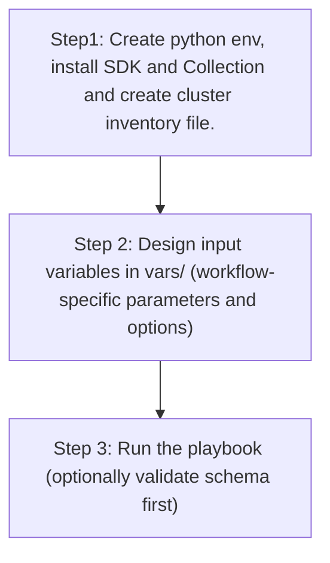

# Site Config Generator

## Table of Contents

- [User Flow (3 Steps)](#user-flow-3-steps)

- [Overview](#overview)
- [Features](#features)
- [Prerequisites](#prerequisites)
- [Workflow Structure](#workflow-structure)
- [Schema Parameters](#schema-parameters)
- [Getting Started](#getting-started)
- [Operations](#operations)
- [Examples](#examples)---

## Overview

The Site config generator automates YAML playbook generation for existing site hierarchy in Cisco Catalyst Center. It generates output compatible with `site_workflow_manager`, helping export areas, buildings, and floors for brownfield automation and migration workflows.

---

## Features

- **Configuration Generation**: Generate YAML configurations compatible with `site_workflow_manager`.
  - Extract site hierarchy data from Catalyst Center.
  - Convert API responses into playbook-ready YAML.
  - Reuse generated files for backup and migration.
- **Hierarchy Filtering**: Filter by `site_name_hierarchy` or `parent_name_hierarchy`.
- **Type Filtering**: Filter by `site_type` values: `area`, `building`, `floor`.
- **Flexible Output**: Supports custom `file_path` and `file_mode` (`overwrite` / `append`).
- **Brownfield Discovery**: Omit `config` (or use workflow convenience flag) to generate complete site hierarchy.

---

## Prerequisites

### Software Requirements

| Component | Version |
|-----------|---------|
| Ansible | 2.13+ |
| cisco.dnac collection | 6.45.0+ |
| Python | 3.9+ |
| Cisco Catalyst Center | 2.3.7.9+ |
| dnacentersdk | 2.10.10+ |

### Required Collections

```bash
ansible-galaxy collection install cisco.dnac
ansible-galaxy collection install ansible.utils
pip install dnacentersdk
pip install yamale
```

### Access Requirements

- Catalyst Center credentials with site API access
- Network connectivity to Catalyst Center
- Existing site hierarchy in Catalyst Center

---

## Workflow Structure

```
site_config_generator/
├── playbook/
│   └── site_config_generator.yml          # Main operations
├── vars/
│   └── site_config_inputs.yml             # Input examples
├── schema/
│   └── site_config_schema.yml             # Input validation
└── README.md
```

---

## Schema Parameters

### Basic Configuration

| Parameter | Type | Required | Default | Description |
|-----------|------|----------|---------|-------------|
| `generate_all_configurations` | boolean | No | false | Workflow convenience flag. When true, playbook omits module `config` |
| `file_path` | string | No | auto-generated | Output file path for generated YAML |
| `file_mode` | string | No | `overwrite` | File write mode: `overwrite` or `append` |
| `component_specific_filters` | dict | No | omitted | Component and filters passed to module `config` |

### Supported Components

- `site`

### Site Filters

- `site_name_hierarchy`: string or list of hierarchy strings
- `parent_name_hierarchy`: string or list of hierarchy strings
- `site_type`: list of `area`, `building`, `floor`

---

## Getting Started

## Workflow Steps

## User Flow (3 Steps)



### Step 1: Configure Inventory

Example `inventory/demo_lab/hosts.yml`:

```yaml
catalyst_center_hosts:
  hosts:
    catalyst_center_primary:
      catalyst_center_host: 10.0.0.0
      catalyst_center_username: admin
      catalyst_center_password: "password"
      catalyst_center_port: 443
      catalyst_center_verify: false
      catalyst_center_version: 2.3.7.9
```

### Step 2: Configure Variables

Edit:
`workflows/site_config_generator/vars/site_config_inputs.yml`

```yaml
site_config:
  - generate_all_configurations: true
    file_path: "/tmp/site_complete_config.yml"
```

### Step 3: Validate Configuration

```bash
./tools/validate.sh -s workflows/site_config_generator/schema/site_config_schema.yml \
  -d workflows/site_config_generator/vars/site_config_inputs.yml
```

### Step 4: Execute Playbook

#### Option A: Vars file input (recommended)

```bash
ansible-playbook -i inventory/demo_lab/hosts.yaml \
  workflows/site_config_generator/playbook/site_config_generator.yml \
  --extra-vars VARS_FILE_PATH=./workflows/site_config_generator/vars/site_config_inputs.yml \
  -vvvv
```

#### Option B: Inventory / host variable input

Omit `VARS_FILE_PATH` and define `site_config` in inventory or `host_vars`.

---

## Operations

### Generate Operations (state: gathered)

Use `site_config_generator.yml` for all generation tasks.

1. **Generate full site hierarchy**
- Set `generate_all_configurations: true`.

2. **Generate hierarchy by parent**
- Use `site[].parent_name_hierarchy`.

3. **Generate hierarchy by explicit site names**
- Use `site[].site_name_hierarchy`.

4. **Filter by type**
- Use `site[].site_type` with one or more of `area`, `building`, `floor`.

5. **Append generated output**
- Set `file_mode: append` to append into an existing file.

---

## Examples

### Example 1: Generate all site hierarchy

```yaml
site_config:
  - generate_all_configurations: true
    file_path: "/tmp/site_complete_config.yml"
```

### Example 2: Filter by parent hierarchy and site type

```yaml
site_config:
  - file_path: "/tmp/site_parent_and_type_filter.yml"
    component_specific_filters:
      components_list: ["site"]
      site:
        - parent_name_hierarchy: ["Global/USA", "Global/India"]
          site_type: ["building", "floor"]
```

### Example 3: Filter by explicit site hierarchy list

```yaml
site_config:
  - file_path: "/tmp/site_name_hierarchy_filter.yml"
    component_specific_filters:
      components_list: ["site"]
      site:
        - site_name_hierarchy:
            - "Global/USA/San Francisco"
            - "Global/USA/New York"
```

---

## Notes

- `site_playbook_config_generator` expects `config` as a dictionary when filters are used.
- This workflow omits `config` when filters are absent, which triggers full generation mode.
- Avoid combining `site_name_hierarchy` and `parent_name_hierarchy` in the same filter item to keep selection behavior unambiguous.
