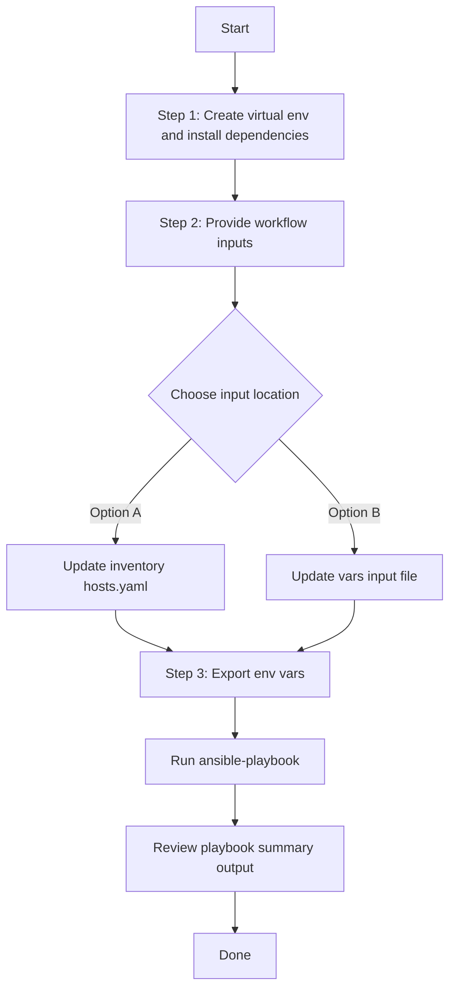

# Site Config Generator

## Table of Contents

- [User Flow (3 Steps)](#user-flow-3-steps)
- [Overview](#overview)
- [Features](#features)
- [Prerequisites](#prerequisites)
- [Workflow Structure](#workflow-structure)
- [Schema Parameters](#schema-parameters)
- [Getting Started](#getting-started)
- [Operations](#operations)
- [Examples](#examples)

---
## Overview

The Site Config Generator automates YAML configurations generation for existing site hierarchy in Cisco Catalyst Center. It extracts site configurations using the `site_playbook_config_generator` module and generates output compatible with `site_workflow_manager` for brownfield export, audit, and migration workflows.

---
## Features

- **Configuration Generation**: Generate YAML configurations compatible with `site_workflow_manager`.
  - Extract site hierarchy data from Catalyst Center.
  - Convert API responses into playbook-ready YAML.
  - Reuse generated files for backup and migration.
- **Component Filtering**: Filter by `site_name_hierarchy`, `parent_name_hierarchy`, or `site_type`.
- **Flexible Output**: Supports custom `file_path` and `file_mode` (`overwrite` / `append`).
- **Brownfield Discovery**: Omit `config` or leave it empty so the workflow generates the complete site hierarchy.

---

## Prerequisites

### Software Requirements

| Component | Version |
|-----------|---------|
| Ansible | 2.13+ |
| cisco.dnac collection | 6.49.0+ |
| Python | 3.9+ |
| Cisco Catalyst Center | 2.3.7.9+ |
| dnacentersdk | 2.10.10+ |

### Required Collections

```bash
ansible-galaxy collection install cisco.dnac
ansible-galaxy collection install ansible.utils
pip install dnacentersdk
pip install yamale
```

### Access Requirements

- Catalyst Center credentials with site API access
- Network connectivity to Catalyst Center
- Existing site hierarchy in Catalyst Center

---

## Workflow Structure

```
site_config_generator/
├── playbook/
│   └── site_config_generator.yml          # Main operations
├── vars/
│   └── site_config_inputs.yml             # Input examples
├── schema/
│   └── site_config_schema.yml             # Input validation
└── README.md
```

---

## Schema Parameters

### Top-Level Parameters

| Parameter | Type | Required | Default | Description |
|-----------|------|----------|---------|-------------|
| `file_path` | string | No | auto-generated | Output file path for generated YAML. Auto-generates timestamped filename if omitted: `site_playbook_config_<YYYY-MM-DD_HH-MM-SS>.yml` | 
| `file_mode` | string | No | `"overwrite"` | File write mode. `"overwrite"` replaces file content, `"append"` adds to existing file. | 
| `config` | dict | No | omitted (all sites) | Dictionary of filters for generating YAML playbook compatible with `site_workflow_manager`. If not provided, the workflow omits it and all site configurations will be generated. |

### Component Specific Filtering (within `config` parameter)

| Parameter | Type | Required | Default | Description | 
|-----------|------|----------|----------|-------------|
| `component_specific_filters` | dict | Yes (when `config` provided) | N/A | Filters to specify which components to include in the YAML configuration file. If filters for specific components (e.g., site) are provided without explicitly including them in `components_list`, those components will be automatically added to `components_list`. At least one of `components_list` or component filters must be provided. |

### Components List (within `component_specific_filters`)

| Parameter | Type | Required | Elements | Description | 
|-----------|------|----------|----------|-------------|
| `components_list` | list[str] | Conditional | str | List of components to include in the YAML configuration file. Valid value: `["site"]` (includes areas, buildings, floors). If not specified but component filters (site) are provided, components are automatically added to this list. If neither `components_list` nor component filters are provided, an error will be raised. |
| `site` | list[dict] | No | dict | Site filter expressions for site hierarchy extraction. Multiple list items are processed independently and merged as union in final output. `site_name_hierarchy` and `parent_name_hierarchy` cannot be used together in same site list item. | 

### Site Filters

| Parameter | Type | Required | Description | Examples |
|-----------|------|----------|-------------|-----------|
| `site_name_hierarchy` | str or list[str] | No | Exact site hierarchy path(s) for matching. Retrieves only specified sites (no children). Case-sensitive exact match. | `"Global/USA/San Francisco"` or `["Global/USA/San Francisco", "Global/USA/New York"]` |
| `parent_name_hierarchy` | str or list[str] | No | Parent hierarchy path(s) for scope matching. Includes parent and ALL descendant sites. Case-sensitive exact match. | `"Global/USA"` or `["Global/USA", "Global/India"]` |
| `site_type` | list[str] | No | Site type filter. Valid values: `["area", "building", "floor"]`. Can be combined with hierarchy filters. | `["building", "floor"]` |

### Site Type Values

| Site Type | Description | Use Case |
|-------------|-------------|----------|
| `area` | Geographic or administrative areas | Regional grouping of buildings |
| `building` | Physical building structures | Campus or office buildings |
| `floor` | Individual floors within buildings | Floor-specific configurations and mapping |

### Filter Behavior

- **site_name_hierarchy**: Exact matches only, no children included
- **parent_name_hierarchy**: Includes parent + all descendants (recursive)
- **Conflict**: Cannot use both site_name_hierarchy and parent_name_hierarchy in same filter entry
- **Multiple Entries**: Create OR logic (union of results)
- **Combined Filters**: Within single entry create AND logic (intersection of results)

---

## Getting Started

## Workflow Steps
## User Flow (3 Steps)



### Installation and Run (Aligned)

1. Create and activate a Python virtual environment, then install dependencies.

```bash
python3 -m venv .venv
source .venv/bin/activate
pip install -r requirements.txt
ansible-galaxy collection install cisco.dnac --force
```

2. Provide workflow inputs in either inventory (`inventory/demo_lab/hosts.yaml`) or the workflow `vars/` file.

3. Export Catalyst Center environment variables and run the playbook.

```bash
export HOSTIP=<catalyst-center-ip-or-fqdn>
export CATALYST_CENTER_USERNAME=<username>
export CATALYST_CENTER_PASSWORD='<password>'
ansible-playbook -i ./inventory/demo_lab/hosts.yaml ./workflows/site_config_generator/playbook/site_config_generator.yml -vvvv
```


## Operations

### Generate Operations (state: gathered)

Use `site_config_generator.yml` for all generation tasks.

1. **Generate full site hierarchy**
```yaml
site_config:
  # Generate all site hierarchy configurations
  - file_path: "/tmp/site_complete_config.yml"
```

2. **Generate hierarchy by parent**
```yaml
site_config:
  - file_path: "/tmp/site_parent_hierarchy_filter.yml"
    config:
      component_specific_filters:
        components_list: ["site"]
        site:
          - parent_name_hierarchy: "Global/USA"
```

3. **Generate hierarchy by explicit site names**
```yaml
site_config:
  - file_path: "/tmp/site_name_hierarchy_filter.yml"
    config:
      component_specific_filters:
        components_list: ["site"]
        site:
          - site_name_hierarchy:
              - "Global/USA/SAN-FRANCISCO"
              - "Global/USA/New York"
```

4. **Filter by parent hierarchy and site types**

```yaml
site_config:
  - file_path: "/tmp/site_parent_and_type_filter.yml"
    config:
      component_specific_filters:
        components_list: ["site"]
        site:
          - parent_name_hierarchy: ["Global/USA", "Global/India"]
            site_type: ["building", "floor"]
```


**Validate and Execute:**
Validate Configuration: To ensure a successful execution of the playbooks with your specified inputs, follow these steps:
Input Validation: Before executing the playbook, validate the input schema so the workflow shape matches the module contract. Run `./tools/schemavalidation.sh -s` with the schema path and `-d` with the input file path.


```bash
# Validate
./tools/schemavalidation.sh -s workflows/site_config_generator/schema/site_config_schema.yml \
 -d workflows/site_config_generator/vars/site_config_inputs.yml

```

Return result validate:
```bash
(pyats-nalakkam) [nalakkam@st-ds-4 dnac_ansible_workflows]$ ./tools/schemavalidation.sh -s workflows/site_config_generator/schema/site_config_schema.yml \
>  -d workflows/site_config_generator/vars/site_config_inputs.yml
workflows/site_config_generator/schema/site_config_schema.yml
workflows/site_config_generator/vars/site_config_inputs.yml
yamale   -s workflows/site_config_generator/schema/site_config_schema.yml  workflows/site_config_generator/vars/site_config_inputs.yml
Validating workflows/site_config_generator/vars/site_config_inputs.yml...
Validation success! 👍

```

```bash
# Execute
ansible-playbook -i inventory/demo_lab/hosts.yaml \
  workflows/site_config_generator/playbook/site_config_generator.yml \
  --extra-vars VARS_FILE_PATH=./workflows/site_config_generator/vars/site_config_inputs.yml
```

1.Generate All Configurations

Terminal Return 

```code 

 response:
        components_processed: 1
        components_skipped: 0
        configurations_count: 63
        file_mode: overwrite
        file_path: /tmp/site_complete_config.yml
        message: YAML configuration file generated successfully for module 'site_workflow_manager'
        status: success
      status: success

```

2. **Generate hierarchy by parent**

```code
 response:
        components_processed: 1
        components_skipped: 0
        configurations_count: 24
        file_mode: overwrite
        file_path: /tmp/site_parent_hierarchy_filter.yml
        message: YAML configuration file generated successfully for module 'site_workflow_manager'
        status: success
      status: success

```

3. **Generate hierarchy by explicit site names**
```code
response:
        components_processed: 1
        components_skipped: 0
        configurations_count: 1
        file_mode: overwrite
        file_path: /tmp/site_name_hierarchy_filter.yml
        message: YAML configuration file generated successfully for module 'site_workflow_manager'
        status: success
      status: success
```
4. **Filter by parent hierarchy and site types**

```code
response:
        components_processed: 1
        components_skipped: 0
        configurations_count: 20
        file_mode: overwrite
        file_path: /tmp/site_parent_and_type_filter.yml
        message: YAML configuration file generated successfully for module 'site_workflow_manager'
        status: success
      status: success
```
---

## Examples

### Example 1: Filter by parent hierarchy and site type

```yaml
site_config:
  - file_path: "/tmp/site_parent_and_type_filter.yml"
    component_specific_filters:
      components_list: ["site"]
      site:
        - parent_name_hierarchy: ["Global/USA", "Global/India"]
          site_type: ["building", "floor"]
```
After running the playbook, the following YAML configuration is generated:
```yaml
---
config:
- site:
    building:
      name: SJ_BLD20
      parent_name: 'Global/USA/SAN JOSE'
      address: 725 Alder Drive, Milpitas, California 95035, United States
      latitude: 37.415947
      longitude: -121.91633
      country: "United States"
  type: building
- site:
    building:
      name: SF_BLD1
      parent_name: 'Global/USA/SAN-FRANCISCO'
      address: Salesforce Tower, 415 Mission St, San Francisco, California 94105,
        United States
      latitude: 37.78986
      longitude: -122.39695
      country: "United States"
  type: building
- site:
    building:
      name: NY_BLD1
      parent_name: 'Global/USA/New York'
      address: 1 Pennsylvania Plaza, New York, New York 10119, United States
      latitude: 40.751205
      longitude: -73.99223
      country: "United States"
  type: building
- site:
    building:
      name: RTP_BLD10
      parent_name: 'Global/USA/RTP'
      address: 7200-10 Kit Creek Rd, Morrisville, North Carolina 27560, United States
      latitude: 35.85992
      longitude: -78.88293
      country: "United States"
  type: building
- site:
    building:
      name: RTP_BLD11
      parent_name: 'Global/USA/RTP'
      address: 7200-11 Kit Creek Rd, Morrisville, North Carolina 27560, United States
      latitude: 35.860596
      longitude: -78.88106
      country: "United States"
  type: building
- site:
    building:
      name: bld1
      parent_name: 'Global/India/Bangalore'
      address: Bureau of Indian Affairs Road 207, White Swan, Washington 98952, United States
      latitude: 46.2
      longitude: -121.2
      country: "India"
  type: building
- site:
    floor:
      name: FLOOR4
      parent_name: 'Global/USA/SAN JOSE/SJ_BLD22'
      rf_model: 'Cubes And Walled Offices'
      length: 100.0
      width: 100.0
      height: 10.0
      floor_number: 4
      units_of_measure: "feet"
  type: floor
- site:
    floor:
      name: FLOOR1
      parent_name: 'Global/USA/New York/NY_BLD1'
      rf_model: 'Cubes And Walled Offices'
      length: 100.0
      width: 100.0
      height: 10.0
      floor_number: 1
      units_of_measure: "feet"
  type: floor
- site:
    floor:
      name: floor1
      parent_name: 'Global/India/Bangalore/bld1'
      rf_model: 'Cubes And Walled Offices'
      length: 100.0
      width: 100.0
      height: 10.0
      floor_number: 1
      units_of_measure: "feet"
  type: floor
```

### Example 2: Filter by explicit site hierarchy list

```yaml
site_config:
  - file_path: "/tmp/site_name_hierarchy_filter.yml"
    component_specific_filters:
      components_list: ["site"]
      site:
        - site_name_hierarchy:
            - "Global/USA/SAN-FRANCISCO"
            - "Global/USA/New York"
```
After running the playbook, the following YAML configuration is generated:
```yaml
---
config:
- site:
    area:
      name: SAN-FRANCISCO
      parent_name: 'Global/USA'
  type: area
- site:
    area:
      name: New York
      parent_name: 'Global/USA'
  type: area
~

```
---
## Additional Resources

- [Cisco Catalyst Center Documentation](https://www.cisco.com/c/en/us/support/cloud-systems-management/dna-center/series.html)
- [Cisco DNA Center SDK](https://dnacentersdk.readthedocs.io/)
- [Ansible Documentation](https://docs.ansible.com/)
