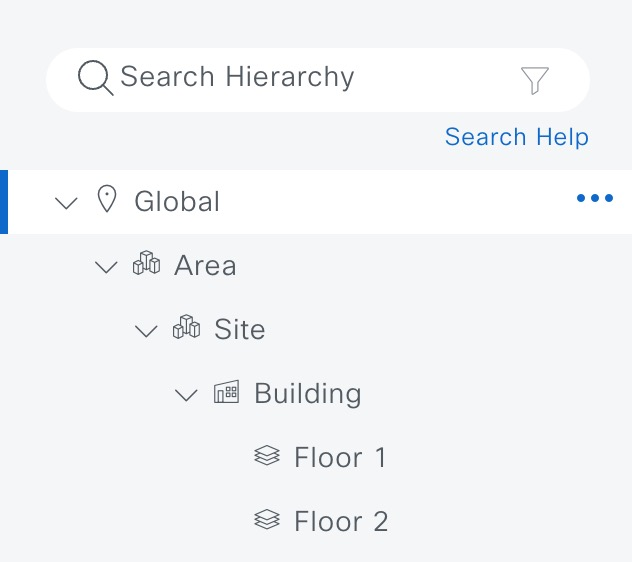
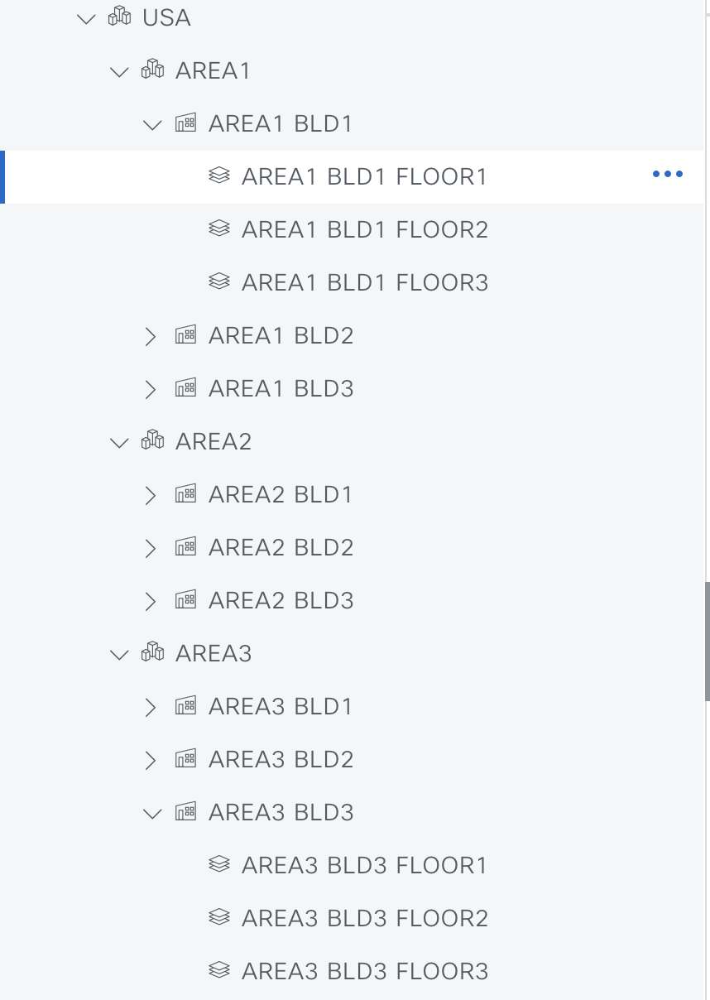
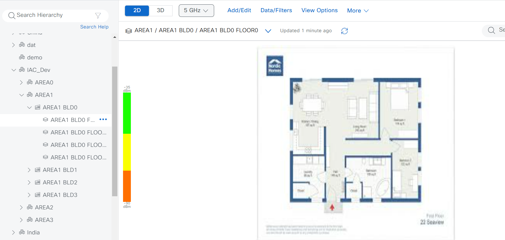

# Catalyst Center Site Hierarchy Playbook

## Overview

This playbook enables you to automate the creation, modification, and deletion of network site hierarchies in Cisco Catalyst Center. The site hierarchy represents your network’s geographical and logical structure, allowing you to apply design settings at various levels (Global, Area, Building, Floor).

**Key Features:**
- Automate creation of Areas, Buildings, and Floors.
- Support for bulk site creation using Jinja templates.
- Hierarchical organization for easy management and configuration
- Site deletion and cleanup workflows.

Network Hierarchy table, displaying Global, Area, Site, Building, and Floor.



---

## Workflow Steps

This workflow typically involves the following steps:

### Step 1: Install and Generate Inventory

Before running the playbooks, ensure you have Ansible installed and the necessary collections for Cisco Catalyst Center.

1. **Install Ansible:**  
   Follow the official Ansible documentation for installation instructions.

2. **Install Cisco Catalyst Center Collection:**  
   ```bash
   ansible-galaxy collection install cisco.dnac
   ```

3. **Generate Inventory:**  
   Create an Ansible inventory file (e.g., `host_inventory_dnac1/hosts.yml`) with your Catalyst Center appliance details:
   ```yaml
   catalyst_center_hosts:
      hosts:
         your_catalyst_center_instance_name:
            catalyst_center_host: xx.xx.xx.xx
            catalyst_center_password: XXXXXXXX
            catalyst_center_port: 443
            catalyst_center_timeout: 60
            catalyst_center_username: admin
            catalyst_center_verify: false # Set to true for production with valid certificates
            catalyst_center_version: 2.3.7.6 # Specify your DNA Center version
            catalyst_center_debug: true
            catalyst_center_log_level: INFO
            catalyst_center_log: true
   ```

### Step 2: Define Inputs and Validate

Prepare the input data for configuring your site hierarchy.

1. **Define Input Variables:**  
   Create the variable file (e.g., `workflows/site_hierarchy/vars/site_hierarchy_design_vars.yml`). This file should contain the list of sites (areas, buildings, floors) you want to configure.

2. **Review Structure and Options:**  
   Refer to the full workflow specification for detailed instructions:  
   [Site Workflow Manager Module Documentation](https://galaxy.ansible.com/ui/repo/published/cisco/dnac/content/module/site_workflow_manager/)

#### Schema for Site Hierarchy (Flat Attribute Structure)

| **Attribute**              | **Type** | **Required** | **Description**                        |
|---------------------------|----------|--------------|----------------------------------------|
| `type`                    | String   | Yes          | Entity type: `area`, `building`, `floor` |
| `name`                    | String   | Yes          | Name of the area/building/floor        |
| `parent_name`             | String   | Yes          | Parent hierarchy (e.g., `Global/USA`)  |
| `address`                 | String   | Yes          | Physical address of the building       |
| `latitude`                | Float    | Yes          | Latitude coordinate                    |
| `longitude`               | Float    | Yes          | Longitude coordinate                   |
| `country`                 | String   | Yes          | Country of the building                |
| `rfModel`                 | String   | Yes          | RF model for the floor                 |
| `width`                   | Float    | Yes          | Width of the floor                     |
| `length`                  | Float    | Yes          | Length of the floor                    |
| `height`                  | Float    | Yes          | Height of the floor                    |
| `floor_number`            | Integer  | Yes          | Floor number                           |
| `units_of_measure`        | String   | Yes          | Unit of measurement for floor dimensions, such as 'feet' or 'meters'|
| `upload_floor_image_path` | String   | Optional     | Path to floor image file.supported format such as JPG, PNG, or PDF|
| `force_upload_floor_image`| Boolean  | Optional     | If set to `true`, the floor image will be uploaded during the process. If set to `false`, the floor image upload will be skipped. During floor creation, if `upload_floor_image_path` is not provided, the image will not be uploaded. During floor update, if `force_upload_floor_image` is set to `False`, the image will not be uploaded, even if the path is provided. If `force_upload_floor_image` is "True", the image will be uploaded regardless of the path provided. |
---

## Example Input File

### 1. **Create Area, Building, and Floor**
To create an area named SAN JOSE under the existing area USA, and to define the building BLD23 along with FLOOR1 under Building 23, you can structure the input as follows:

```bash
---
#Select Catalyst Center version, this will overwrite the default version from host file
# Provide the Catalyst Center Version
catalyst_center_version: 2.3.7.6
# Sites Input List 
design_sites:
  - site:
      area:
        name: USA
        parent_name: Global
    type: area
  - site:
      area:
        name: SAN JOSE
        parent_name: Global/USA
    type: area
  - site:
      building:
        name: BLD23
        parent_name: Global/USA/SAN JOSE
        address: McCarthy Blvd, San Jose, California 95131, United States
        latitude: 37.398188
        longitude: -121.912974
        country: United States
    type: building
  - site:
      floor:
        name: FLOOR1
        parent_name: Global/USA/SAN JOSE/BLD23
        rfModel: Cubes And Walled Offices
        width: 100.00
        length: 100.00
        height: 10.00
        floor_number: 1
        units_of_measure: feet
        upload_floor_image_path: /workflows/sites/images/floor_image1.png
    type: floor
```
You can organize all the sites together, for example, grouping all floors under a single building and placing the building within the appropriate hierarchy.

4. Execute: Execute the playbook with your inputs and inventory. Specify your input file using the --e variable VARS_FILE_PATH.
```bash
    ansible-playbook -i host_inventory_dnac1/hosts.yml workflows/sites/playbook/site_hierarchy_playbook.yml --e VARS_FILE_PATH=/Users/pawansi/dnac_ansible_workflows/workflows/sites/vars/site_hierarchy_design_vars.yml -vvv
```
## Creating Bulk Site configurations using JINJA template and using the playbook

Below we have provided an example of Jinja template for sites.
This Example creates 3 Areas and in each area it creates 3 buildings and in each building it creates 3 floors. 
This example can be reused and customized to your requirement and increase the requirement scale.

### Creating bulk sites with JINJA template
workflow/sites/jinja_template/site_generation_template.j2 template can be used to customize the template and generate bulk sites.

```bash
---
# Define the Catalyst Center version
catalyst_center_version: 2.3.7.6

# List of floor images to be used for upload


design_sites:
  # Define the top-level area
  - site:
      area:
        name: USA
        parent_name: Global
    type: area

  # Loop through areas
  
  - site:
      area:
        name: AREA{{i}}
        parent_name: Global/USA
    type: area

    # Loop through buildings in each area
    
    - site:
        building:
          name: AREA{{i}} BLD{{j}}
          parent_name: Global/USA/AREA{{i}}
          address: McCarthy Blvd, San Jose, California 95131, United States
          latitude: 37.398188
          longitude: -121.912974
          country: United States
      type: building

      # Loop through floors in each building
      
      - site:
          floor:
            name: AREA{{i}} BLD{{j}} FLOOR{{l}}
            parent_name: Global/USA/AREA{{i}}/AREA{{i}} BLD{{j}}
            rfModel: Cubes And Walled Offices
            width: 100.00
            length: 100.00
            height: 10.00
            floor_number: {{ l }}
            units_of_measure: feet
            upload_floor_image_path: workflows/sites/images/{{ floor_images[(l - 1) % floor_images|length] }}
            force_upload_floor_image: True
        type: floor
      
    
  
```

Use the input var file: jinja_template_site_hierarchy_design_vars.yml and specify the name of your Jinja template in the input vars file.

5. Execute with Jinja template:
```bash
    ansible-playbook -i host_inventory_dnac1/hosts.yml workflows/sites/playbook/site_hierarchy_playbook.yml --e VARS_FILE_PATH=/Users/pawansi/dnac_ansible_workflows/workflows/sites/vars/jinja_template_site_hierarchy_design_vars.yml -vvv
```

### Example of Sites Created Using a Jinja Template
Figure 2: Example of a site design created using a Jinja template.



Figure 3: Example of a site created using a Jinja template, including floor image design.


Delete all the sites under a specified hierarchy.

You can use the below example to delete all the floors and buildings under the site hierarchy Global/USA/AREA1 and site AREA1.

```bash
---
catalyst_center_version: 2.3.7.6
design_sites:  
  - site:
      area:
        name: AREA1
        parent_name: Global/USA
    type: area
```

## Site Deletion
Playbook can be used to delete sites under a specified hierarchy.

6. Run the delete Playbook:
```bash
    ansible-playbook -i host_inventory_dnac1/hosts.yml workflows/sites/playbook/delete_site_hierarchy_playbook.yml --e VARS_FILE_PATH=/Users/pawansi/dnac_ansible_workflows/workflows/sites/vars/delete_site_hierarchy_design_vars.yml -vvv
```
### Example of Site Deletion
```bash
---
catalyst_center_version:2.3.7.6
delete sites:
  - site:
      area:
        name: Hyderabad
        parentName: Global/India
    type: area
  - site:
      building:
        name: hyd_bld1
        parentName: Global/India/Hyderabad
        country: India
    type: building
  - site:
      floor:
        name: Marketing
        parentName: Global/India/Hyderabad/hyd_bld1
    type: floor
```
Sites will be deleted from the Catalyst Center.

2. **Validate Configuration:**  
To ensure a successful execution of the playbooks with your specified inputs, follow these steps:

  **Input Validation:**  
  Before executing the playbook, it is essential to validate the input schema. This step ensures that all required parameters are included and correctly formatted. Run the following command to perform the validation, providing the schema path with `-s` and the input path with `-d`.

```bash
./tools/validate.sh -s ./workflows/site_hierarchy/schema/site_hierarchy_schema.yml -d ./workflows/site_hierarchy/vars/site_hierarchy_design_vars.yml
```

### Run Schema Validation
```bash
yamale -s workflows/site_hierarchy/schema/site_hierarchy_schema.yml workflows/site_hierarchy/vars/site_hierarchy_design_vars.yml
```
Validating workflows/site_hierarchy/vars/site_hierarchy_design_vars.yml...  
Validation success! 👍

---

### Step 3: Deploy and Verify

This is the final step where you deploy the configuration to Cisco Catalyst Center and verify the changes.

1. **Deploy Configuration:**  

Run the playbook to seamlessly apply the site hierarchy configuration defined in your input variables to Cisco Catalyst Center.  
Before proceeding, ensure that the input validation step has been completed successfully, with no errors detected in the provided variables. Once validated, execute the playbook by specifying the input file path using the `--extra-vars` variable as `VARS_FILE_PATH`. The `VARS_FILE_PATH` must be provided as a full path to the input file.  
This ensures that the configuration is accurately deployed to Cisco Catalyst Center, automating the setup process and reducing the risk of manual errors.

```bash
ansible-playbook -i ./inventory/demo_lab/hosts.yaml ./workflows/site_hierarchy/playbook/site_hierarchy_playbook.yml --extra-vars VARS_FILE_PATH=./../vars/site_hierarchy_design_vars.yml -vvvvvv
```

If there is an error in the input or an issue with the API call during execution, the playbook will halt and display the relevant error details.

2. **Verify Deployment:**  
After executing the playbook, check the Catalyst Center UI to verify the site hierarchy. If `debug_log` is enabled, you can also review the logs for detailed information on operations performed and any updates made.

---

## References

*Environment used for the above instructions:*

```yaml
python: 3.12.0
dnac_version: 2.3.7.6
ansible: 9.9.0
dnacentersdk: 2.8.6
cisco.dnac: 6.30.2
```

For more details, see the [Site Workflow Manager Module Documentation](https://galaxy.ansible.com/ui/repo/published/cisco/dnac/content/module/site_workflow_manager/).