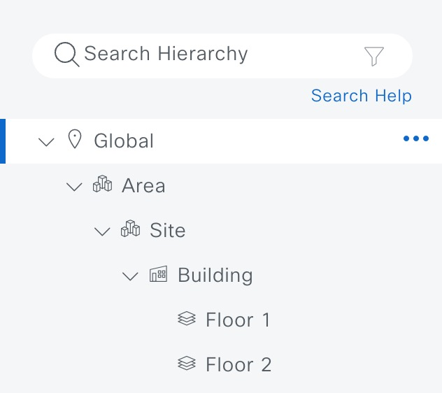

# Network Design Site Hierarchy

You can create a network hierarchy that represents your network's geographical locations. The hierarchical organization enables you to easily apply design settings or configurations to a specific hierarchical element. For example, you can apply design settings to an entire area or to only a floor.

You can name hierarchical elements to help you identify where to apply design settings later.

The hierarchical elements that you can create have rules that dictate under which elements they can reside and which elements can reside under them. See the following figure and descriptions:

Network Hierarchy
Figure 3: Network Hierarchy table, displaying Global, Area, Site, Building, and Floor.


Global: Default element under which all other hierarchical elements reside. Areas or sites are the only elements that can reside directly under Global.

Areas and Sites (Site and area icon in network hierarchy tree): Areas and sites reside under Global or under other areas or sites. They do not have a physical address. As the largest element, they identify a geographic region. They provide a way to group areas or sites.

Buildings (Buildings icon in network hierarchy tree): Buildings reside under areas or sites. When you create a building, specify a physical address or latitude and longitude coordinates. Buildings can't contain areas. However, they can contain floors.

Floors (Floor icon in network hierarchy tree): Floors reside under buildings. You can add floors to buildings with or without maps that contain various building components, like walls and windows. If you decide to use floor maps, you can manually create them or import them from files, such as DXF, DWG, JPG, GIF, PNG, or PDF file types. Then you can position your wireless devices on the floor maps to visualize your wireless network coverage.

You can change the site hierarchy for unprovisioned devices while preserving AP locations on floor maps. Note, however, that you can't move an existing floor to a different building.

## RMAC access to create and modify sites
Users with the SUPER-ADMIN-ROLE, NETWORK-ADMIN-ROLE can create,update, delete sites
Users with custome role with access to network design can create,update, delete sites

# Procedure
1. ## Prepare your Ansible environment:

Install Ansible if you haven't already
Ensure you have network connectivity to your Catalyst Center instance.
Checkout the project and playbooks: git@github.com:cisco-en-programmability/catalyst-center-ansible-iac.git

2. ## Configure Host Inventory:

The host_inventory_dnac1/hosts.yml file specifies the connection details (IP address, credentials, etc.) for your Catalyst Center instance.
Make sure the dnac_version in this file matches your actual Catalyst Center version.
##The Sample host_inventory_dnac1/hosts.yml

```bash
catalyst_center_hosts:
    hosts:
        catalyst_center220:
            dnac_host: xx.xx.xx.xx.
            dnac_password: XXXXXXXX
            dnac_port: 443
            dnac_timeout: 60
            dnac_username: admin
            dnac_verify: false
            dnac_version: 2.3.7.6
            dnac_debug: true
            dnac_log_level: INFO
            dnac_log: true
```
3. ## Define User and Role Data:
The workflow/sites/vars/site_hierarchy_design_vars.yaml file stores the sites details you want to configure.
Refer to the full workflow specification for detailed instructions on the available options and their structure: https://galaxy.ansible.com/ui/repo/published/cisco/dnac/content/module/site_workflow_manager/

### Creating bulk sites with jinja template
workflow/sites/jinja_template/site_generation_template.j2 template can be used to customize the template and generate bulk sites.


4. Execute:
```bash
    ansible-playbook -i host_inventory_dnac1/hosts.yml workflows/sites/playbook/site_hierarchy_playbook.yml --e VARS_FILE_PATH=/Users/pawansi/dnac_ansible_workflows/workflows/sites/vars/site_hierarchy_design_vars.yml -vvv
```

4. Execute with Jinja template:
```bash
    ansible-playbook -i host_inventory_dnac1/hosts.yml workflows/sites/playbook/site_hierarchy_playbook.yml --e VARS_FILE_PATH=/Users/pawansi/dnac_ansible_workflows/workflows/sites/vars/jinja_template_site_hierarchy_design_vars.yml -vvv
```
## Deleting the sites
Playbook can be used to delete roles and users
Run the delete Playbook
```bash
    ansible-playbook -i host_inventory_dnac1/hosts.yml workflows/sites/playbook/delete_site_hierarchy_playbook.yml --e VARS_FILE_PATH=/Users/pawansi/dnac_ansible_workflows/workflows/sites/vars/delete_site_hierarchy_design_vars.yml -vvv
```
Roles and Users will get deleted from the Catalyst Center
