# Catalyst Center Device Software Image Management (SWIM) Playbook
## Overview

The SWIM protocol provides a standardized way to manage and upgrade software images on Cisco devices. This workflow leverages Ansible's automation capabilities to streamline the upgrade process, reducing manual effort and potential errors.

## Features

* **Automated Image Transfer:** The playbook automatically transfers the desired software image to the target Catalyst switch.
* **Image Activation:**  Activates the new image on the switch.
* **Reload (Optional):**  Optionally reloads the switch to complete the upgrade process.
* **Verification:** Verifies the software version after the upgrade.
* **Error Handling:** Includes error handling mechanisms to gracefully handle potential issues during the upgrade.

## Requirements

* **Ansible:**  A system with Ansible installed.
* **Network Connectivity:**  SSH connectivity to the target Catalyst switch.
* **Credentials:** Valid login credentials for the switch (username/password or SSH key).
* **Software Image:** The desired Cisco IOS XE software image file (.bin).

## Demo Video
[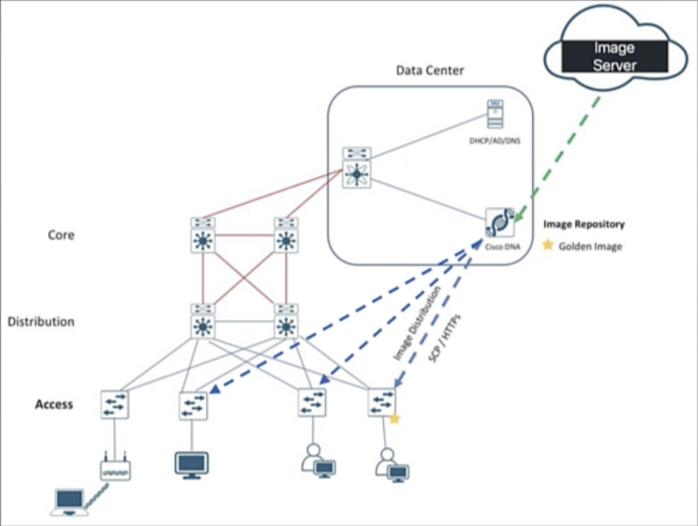](http://3.136.0.140/iac_demos/swim/SWIMDEMO.mp4)


# Detailed steps to perform
1. ## Import image:
We have three ways to import images into Catalyst Center:
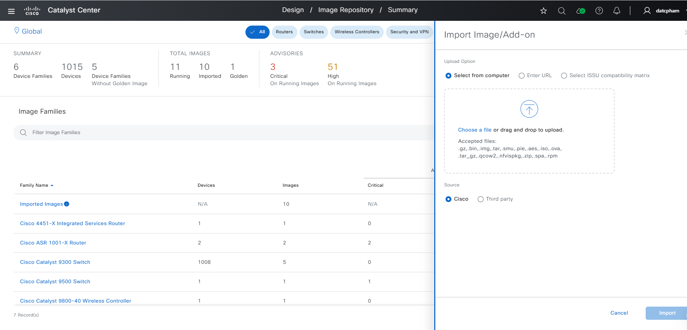

  ### a. local
  Download the image to your local machine and import directly.
  + Example input config:
  ```yaml
  swim_details:
    import_images:
      - import_image_details:
          type: local
          local_image_details:
              file_path: /Users/Downloads/cat9k_iosxe.17.12.01.SPA.bin
              is_third_party: False
  ```

  ### b. remote (commonly used)
  Upload the image to a server, and import via URL.
  + Example input config:
  ```yaml
  swim_details:
    import_images:
      - import_image_details:
          type: remote
          url_details:
            payload:
              - source_url: 
                  - http://xx.xx.xx.xx/swim/sanity_image_regr/17_12_4CCO/C9800-40-universalk9_wlc.17.12.04.SPA.bin
                is_third_party: False
  ```
  + Explain values:
  ```yaml
    type: Specifies the import source, supporting local file import (local) or remote url import (remote) or CCO.
    source_url: A mandatory parameter for importing a SWIM image via a remote URL. This parameter is required when using a URL to import an image..(For example, http://{host}/swim/cat9k_isoxe.16.12.10s.SPA.bin, ftp://user:password@{host}/swim/cat9k_isoxe.16.12.10s.SPA.iso)
    is_third_party: Flag indicates whether the image is uploaded from a third party (optional).
  ```

  * If you want to install parallel images (up to a maximum of 4), we can use with an input list in:
  ```yaml
              - source_url: 
                  - 
                  - 
                  ...
  ```
  for example with this input config:
  ```yaml
  swim_details:
    import_images:
      - import_image_details:
          type: remote
          url_details:
            payload:
              - source_url: 
                  - http://xx.xx.xx.xx/swim/V1715_1PRD18_FC1/cat9k_iosxe.17.15.01prd18.SPA.bin
                  - http://xx.xx.xx.xx/swim/V1715_1PRD18_FC1/C9800-SW-iosxe-wlc.17.15.01prd18.SPA.bin
                is_third_party: False
      - import_image_details:
          type: remote
          url_details:
            payload:
              - source_url: 
                  - http://xx.xx.xx.xx/swim/V1715_1PRD18_FC1/C9800-universalk9_wlc.17.15.01prd18.SPA.bin	
                is_third_party: False
  ```
  Catalyst Center will install in parallel with the two images: 'cat9k_iosxe.17.15.01prd18.SPA.bin' and 'C9800-SW-iosxe-wlc.17.15.01prd18.SPA.bin'. After the import is completed, Catalyst Center will continue to install the image 'C9800-universalk9_wlc.17.15.01prd18.SPA.bin'.
  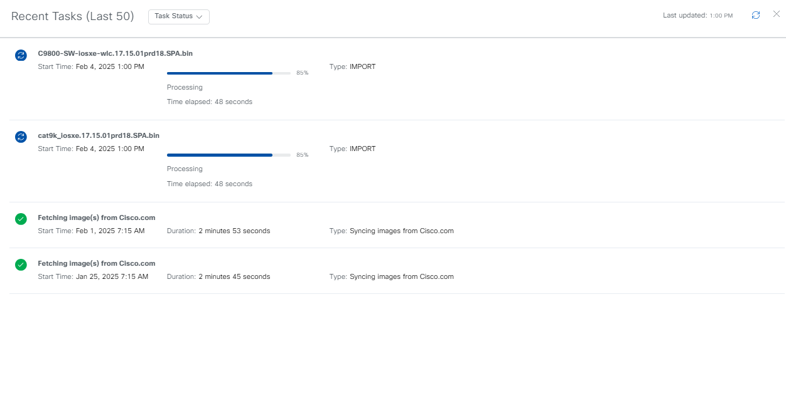
  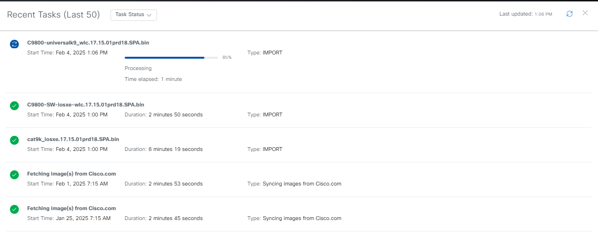

  ### c. cco
  Import images prepared for DNAC from Cisco Connection Online.
  + Example input config:
  ```yaml
  swim_details:
    import_images:
      - import_image_details:
          type: CCO
          cco_image_details:
            image_name: 
              - cat9k_iosxe_npe.17.09.06a.SPA.bin
              - C9800-40-universalk9_wlc.17.09.06.SPA.bin
  ```

  * Note: we can only install the CCO image to be displayed on Catalyst Center. The feature of installing images from CCO has limitations; we can only install images that have been prepared for display on Catalyst Center.
  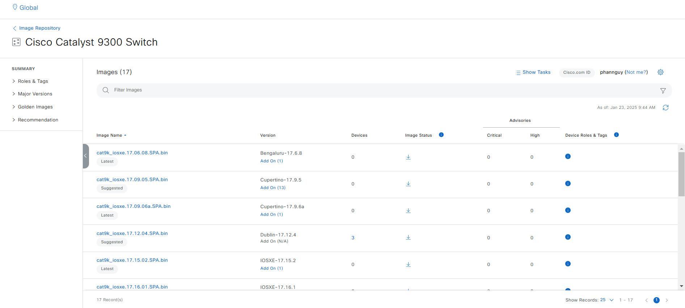
  For example, with the above images, we can see some CCO images that are proposed on Catalyst Center (cat9k_iosxe.17.06.08.SPA.bin, cat9k_iosxe.17.09.05.SPA.bin, cat9k_iosxe.17.09.06a.SPA.bin, ...). We can only install CCO type with those proposed images.

  ### d. Delete image in Cisco Catalyst Center
  After the image is imported to DNAC using the above methods (local, URL, CCO), it will exist on the Cisco Catalyst Center. We can delete it through the following playbook.
  
  + Example input config (state: "deleted"):
  ```yaml
  swim_details:
    delete_images:
      - image_name:
          - cat9k_iosxe.17.15.03.SPA.bin
          - C9800-L-universalk9_wlc.17.17.01.SPA.bin
  ```
  + Playbook return:
  ```yaml
  msg: 'Successfully deleted image(s): ''cat9k_iosxe.17.15.03.SPA.bin'', ''C9800-L-universalk9_wlc.17.17.01.SPA.bin''.'
  response: 'Successfully deleted image(s): ''cat9k_iosxe.17.15.03.SPA.bin'', ''C9800-L-universalk9_wlc.17.17.01.SPA.bin''.'
  status: success
  ```
  + The UI display:

  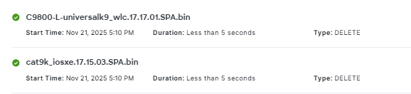

  **NOTE:The API for deleting images is only supported from DNAC version 2.3.7.9 and above.**

2. ## Tag/untag golden image:
Define and manage golden images that represent standard or preferred versions for your network devices.
+ Example input config:
```yaml
  swim_details:
    golden_tag_images:
      - tagging_details:
          image_name: cat9k_iosxe.17.06.08.SPA.bin
          device_role: ACCESS, CORE
          device_image_family_name : Cisco Catalyst 9300 Switch
          site_name: Global/USA/SAN JOSE
          tagging: true
```
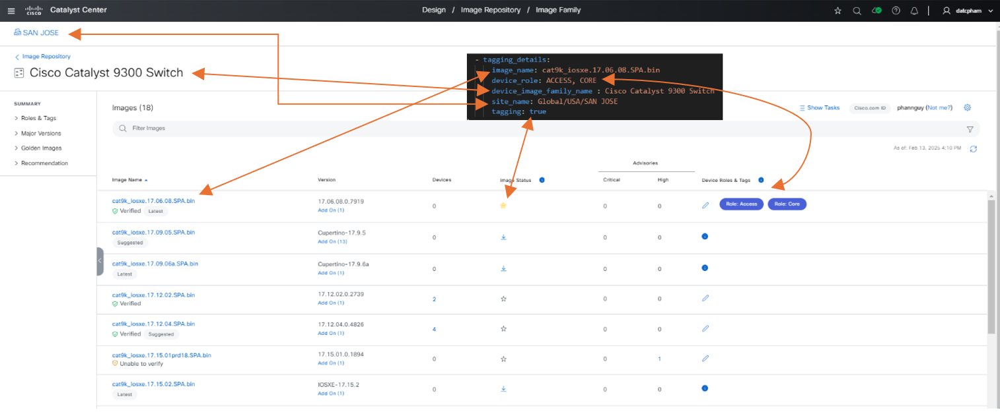

If you tag a different image with the same device_image_family_name, then the existing image will be untagged first.
```yaml
  swim_details:
    golden_tag_images:
      - tagging_details:
          image_name: cat9k_iosxe.17.12.04.SPA.bin
          device_role: ACCESS
          device_image_family_name : Cisco Catalyst 9300 Switch
          site_name: Global/USA/SAN JOSE
          tagging: true
```
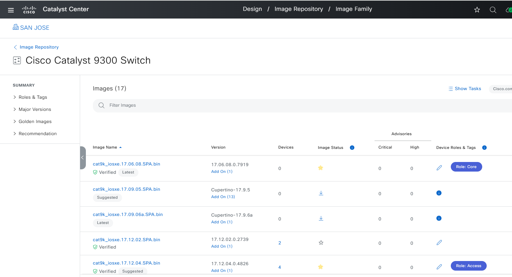

3. ## Distribute
Distribute the image to the device. In the playbook, we can have two types for distribution: distribute to a specific device (device_e2e) and distribute to multiple devices in parallel using device role and site filters (filter_e2e).

  ### a. Device End to End
  Provide a value for one of the following parameters: 'device_ip_address', 'device_hostname', 'device_serial_number', 'device_mac_address' to specify the exact device you want to distribute the image to.
  ```yaml
      - image_distribution_details:
          image_name: cat9k_iosxe.17.06.08.SPA.bin
          device_ip_address: 204.1.2.1
  ```

  ### b. Filter End to End
  You can distribute to multiple devices in parallel using filters for devices based on 'device_role', 'site_name', 'device_family_name', and 'device_series_name'.
  ```yaml
  swim_details:
    ...
    distribute_images:
      - image_distribution_details:
          image_name: cat9k_iosxe.17.06.08.SPA.bin
          device_role: ACCESS
          site_name: Global/USA/SAN JOSE
          device_family_name: Switches and Hubs
          device_series_name: Cisco Catalyst 9300 Series Switches
  ```
  UI action (includes distribute and activate):
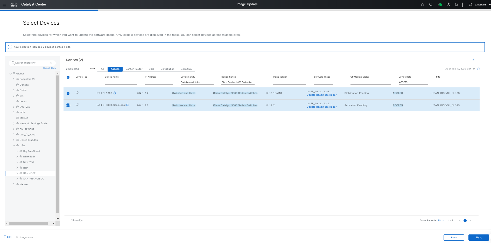

  ### c. Distribute & Activate without specifying image name (new enhancement)
  Automatically uses Golden Image tagged in Catalyst Center. It will satisfy the intersection of the specifications from `image_distribution_details` and `tagging_details`.
  ```yaml
  swim_details:
    ...
    distribute_images:
      - image_distribution_details:
          device_role: ACCESS
          site_name: Global/USA/SAN JOSE
          device_family_name: Switches and Hubs
          device_series_name: Cisco Catalyst 9300 Series Switches
  ```

  ### d. Support sub-package upgrades (new enhancement)
  Allows for a modular upgrade with the main image and additional packages.
  This will facilitate the conversion of the Switch to a Wireless Switch (Fiab device) by enabling the WLC option in the fabric (Embedded Wireless LAN Controller - WC role).

  *Note: Before we can enable the WLC option in the fabric, we need to distribute and activate the 9800 software images to these devices.
  The sub-package must correspond to the base image in terms of version to enable the upgrade.
  Also need to tag the corresponding golden image. Here, only need to tag the golden base image, and the accompanying sub-package will also be considered to be included in the golden tag.*

  + Example input config:
  ```yaml
  swim_details:
    ...
    distribute_images:
      - image_distribution_details:
          image_name: cat9k_iosxe.17.12.01.SPA.bin
          sub_package_images:
            - C9800-SW-iosxe-wlc.17.12.01.SPA.bin
          device_role: ACCESS
          site_name: Global/USA/SAN JOSE
          device_family_name: Switches and Hubs
          device_series_name: Cisco Catalyst 9300 Series Switches
  ```
  + Playbook return:
  ```yaml
  msg: "Bulk image distribution completed successfully - 204.1.2.1."
  response: "Bulk image distribution completed successfully - 204.1.2.1."
  status: success
  ```
  + The UI display (include activation):
  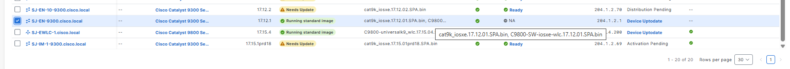
  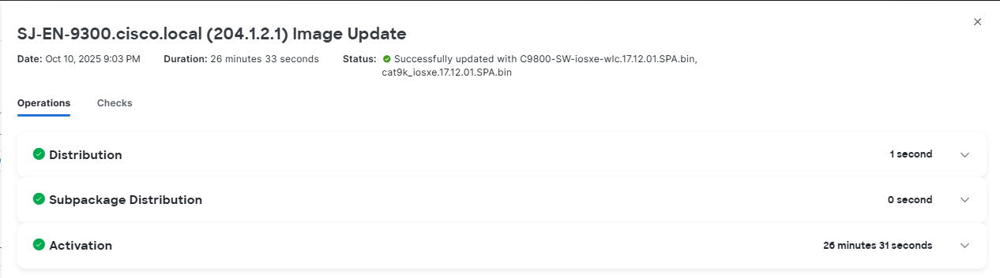

  **Note:**
  - We also can only need to provide the base image, or can choose not to provide both the base image and sub-package, and it can still upgrade the image using the image from the golden tag, include base and sub-package image (specifically for the case where `the device to be upgraded is currently running both the base and sub-package images`.)
  - In the case where `the device to be upgraded is currently running only the base image`, if we want to `upgrade to both the new base and sub-package images` completely, we need provide both the base image and the corresponding sub-package so that the API can perform the upgrade accurately. For example:
    + Current running: base image: cat9k_iosxe.17.12.01.SPA.bin
    + Want to update: base image: cat9k_iosxe.17.15.01.SPA.bin and sub-package: C9800-SW-iosxe-wlc.17.15.01.SPA.bin
  - In the case where `the device to be upgraded is currently running only the base image`, if we want to `upgrade only corresponding sub-package image for the base image`, we can providing only the sub-package for the update, but need to add the 'convert_to_wlc' parameter as True to ignore device compliance checks when activating the image, allowing the switch to WLC mode even if the device does not meet the requirements.
    + Current running: base image: cat9k_iosxe.17.12.01.SPA.bin
    + Want to update: sub-package: C9800-SW-iosxe-wlc.17.12.01.SPA.bin
  ```yaml
  swim_details:
    ...
    distribute_images:
      - image_distribution_details:
          sub_package_images:
            - C9800-SW-iosxe-wlc.17.12.01.SPA.bin
          device_role: ACCESS
          site_name: Global/USA/SAN JOSE
          device_family_name: Switches and Hubs
          device_series_name: Cisco Catalyst 9300 Series Switches
          convert_to_wlc: true
  ```

4. ## Activate
Activate the image to the device after successful distribution. In the playbook, we can have two types for activation: activate to a specific device (device_e2e) and activate to multiple devices in parallel using device role and site filters (filter_e2e).

  ### a. Device End to End
  You can provide a value for one of the following parameters: 'device_ip_address', 'device_hostname', 'device_serial_number', 'device_mac_address' to specify the exact device you want to activate the image to.
  ```yaml
      - image_activation_details:
          image_name: cat9k_iosxe.17.06.08.SPA.bin
          schedule_validate: false
          activate_lower_image_version: true
          distribute_if_needed: true
          device_ip_address: 204.1.2.1
          device_upgrade_mode: currentlyExists
  ```

  ### b. Filter End to End
  You can activate to multiple devices in parallel using filters for devices based on 'device_role', 'site_name', 'device_family_name', and 'device_series_name'.
  ```yaml
  swim_details:
    ...
    activate_images:
      - image_activation_details:
          image_name: cat9k_iosxe.17.06.08.SPA.bin
          device_role: ACCESS
          site_name: Global/USA/SAN JOSE
          device_family_name: Switches and Hubs
          device_series_name: Cisco Catalyst 9300 Series Switches
          activate_lower_image_version: true
          distribute_if_needed: true
          schedule_validate: false
          device_upgrade_mode: currentlyExists
  ```
  + Explain values:
  ```yaml
    image_name, device_role, site_name: Similar to distribution, these pinpoint the image and devices for activation.
    activate_lower_image_version: false: Ensures that only devices with the same or higher image versions will be considered for activation.
    distribute_if_needed: true: If the image isn't already present on the target devices, it will be distributed before activation.
    device_upgrade_mode: currentlyExists: This likely indicates that the activation process will target devices that already have the image in their inventory.
  ```
  UI action (includes distribute and activate):
  

  ### c. Distribute & Activate without specifying image name (new enhancement)
  Automatically uses Golden Image tagged in Catalyst Center. It will satisfy the intersection of the specifications from `image_activation_details` and `tagging_details`.
  ```yaml
  swim_details:
    ...
    activate_images:
      - image_activation_details:
          device_role: ACCESS
          site_name: Global/USA/SAN JOSE
          device_family_name: Switches and Hubs
          device_series_name: Cisco Catalyst 9300 Series Switches
          activate_lower_image_version: true
          distribute_if_needed: true
          schedule_validate: false
          device_upgrade_mode: currentlyExists
  ```

  ### d. Support sub-package upgrades (new enhancement)
  Allows for a modular upgrade with the main image and additional packages.
  This will facilitate the conversion of the Switch to a Wireless Switch (Fiab device) by enabling the WLC option in the fabric (Embedded Wireless LAN Controller - WC role).

  *Note: Before we can enable the WLC option in the fabric, we need to distribute and activate the 9800 software images to these devices.
  The sub-package must correspond to the base image in terms of version to enable the upgrade.
  Also need to tag the corresponding golden image. Here, only need to tag the golden base image, and the accompanying sub-package will also be considered to be included in the golden tag.*

  + Example input config:
  ```yaml
  swim_details:
    ...
    activate_images:
      - image_activation_details:
          image_name: cat9k_iosxe.17.12.01.SPA.bin
          sub_package_images:
            - C9800-SW-iosxe-wlc.17.12.01.SPA.bin
          device_role: ACCESS
          site_name: Global/USA/SAN JOSE
          device_family_name: Switches and Hubs
          device_series_name: Cisco Catalyst 9300 Series Switches
          activate_lower_image_version: true
          distribute_if_needed: true
          schedule_validate: false
          device_upgrade_mode: currentlyExists
  ```
  + Playbook return:
  ```yaml
  msg: "All eligible images activated successfully on the devices [204.1.2.1]."
  response: "All eligible images activated successfully on the devices [204.1.2.1]."
  status: success
  ```
  + The UI display:
  
  

  **Note:**
  - We also can only need to provide the base image, or can choose not to provide both the base image and sub-package, and it can still upgrade the image using the image from the golden tag, include base and sub-package image (specifically for the case where `the device to be upgraded is currently running both the base and sub-package images`.)
  - In the case where `the device to be upgraded is currently running only the base image`, if we want to `upgrade to both the new base and sub-package images` completely, we need provide both the base image and the corresponding sub-package so that the API can perform the upgrade accurately. For example:
    + Current running: base image: cat9k_iosxe.17.12.01.SPA.bin
    + Want to update: base image: cat9k_iosxe.17.15.01.SPA.bin and sub-package: C9800-SW-iosxe-wlc.17.15.01.SPA.bin
  - In the case where `the device to be upgraded is currently running only the base image`, if we want to `upgrade only corresponding sub-package image for the base image`, we can providing only the sub-package for the update, but need to add the 'convert_to_wlc' parameter as True to ignore device compliance checks when activating the image, allowing the switch to WLC mode even if the device does not meet the requirements.
    + Current running: base image: cat9k_iosxe.17.12.01.SPA.bin
    + Want to update: sub-package: C9800-SW-iosxe-wlc.17.12.01.SPA.bin
  ```yaml
  swim_details:
    ...
    activate_images:
      - image_activation_details:
          sub_package_images:
            - C9800-SW-iosxe-wlc.17.12.01.SPA.bin
          device_role: ACCESS
          site_name: Global/USA/SAN JOSE
          device_family_name: Switches and Hubs
          device_series_name: Cisco Catalyst 9300 Series Switches
          activate_lower_image_version: true
          distribute_if_needed: true
          schedule_validate: false
          device_upgrade_mode: currentlyExists
          convert_to_wlc: true
  ```

5. ## All steps are specified in one step
The software image (SWIM) can be updated on the device in a single run by combining all the steps (import, tag, distribute, activate) into one input.
```yaml
  swim_details:
    ...
    upload_tag_dis_activate_images:
      - import_image_details:
          type: remote
          url_details:
            payload:
              - source_url: 
                  - http://xx.xx.xx.xx/swim/V1715_1PRD18_FC1/cat9k_iosxe.17.15.01prd18.SPA.bin
                  - http://xx.xx.xx.xx/swim/V1715_1PRD18_FC1/C9800-SW-iosxe-wlc.17.15.01prd18.SPA.bin
                is_third_party: False
      - tagging_details:
            image_name: cat9k_iosxe.17.15.01prd18.SPA.bin
            device_role: ALL
            device_image_family_name: Cisco Catalyst 9300 Switch
            site_name: Global/USA/SAN JOSE/BLD23
            tagging: true
      - image_distribution_details:
          image_name: cat9k_iosxe.17.15.01prd18.SPA.bin
          device_role: ACCESS
          site_name: Global/USA/SAN JOSE/BLD23
          device_family_name: Switches and Hubs
      - image_activation_details:
          activate_lower_image_version: false
          device_family_name: Switches and Hubs
          device_role: ACCESS
          device_upgrade_mode: currentlyExists
          distribute_if_needed: true
          image_name: cat9k_iosxe.17.15.01prd18.SPA.bin
          schedule_validate: false
          site_name: Global/USA/SAN JOSE/BLD23
```

# How to run
  1. ## Command to run
  ### a. Include import/tag_untag/distribute/activate images (state = 'merged')
  Example command to run the swim playbook:
  ```bash
  ansible-playbook 
    -i ./inventory/demo_lab/hosts.yml # refer to Catalyst Center to run
    ./workflows/swim/playbook/swim_workflow_playbook.yml # playbook will run this
    --extra-vars VARS_FILE_PATH=./../vars/swim_vars.yml # location of the input file for the playbook to execute
    -vvv # return detailed information about the message; the more 'v', more detailed
  ```
  
  ### b. Include delete images (state = 'deleted')
  Example command to run the swim playbook:
  ```bash
  ansible-playbook 
    -i ./inventory/demo_lab/hosts.yml # refer to Catalyst Center to run
    ./workflows/swim/playbook/delete_swim_workflow_playbook.yml # playbook will run this
    --extra-vars VARS_FILE_PATH=./../vars/delete_swim_vars.yml # location of the input file for the playbook to execute
    -vvv # return detailed information about the message; the more 'v', more detailed
  ```

  2. ## Validate the schema input
  ### a. Include import/tag_untag/distribute/activate images (state = 'merged')
  ```bash
    ./tools/validate.sh \
    -s workflows/swim/schema/swim_schema.yml \
    -d workflows/swim/vars/swim_import_tag_distribute_activate_image_vars.yml
  ```

  ### b. Include delete images (state = 'deleted')
  ```bash
    ./tools/validate.sh \
    -s workflows/swim/schema/delete_swim_schema.yml \
    -d workflows/swim/vars/delete_swim_vars.yml
  ```


# Reference

*Note: The environment used for the references in the above instructions is as follows:*

```yaml
python: 3.12.0
dnac_version: 3.1.5
ansible: 9.9.0
dnacentersdk: 2.10.4
cisco.dnac: 6.42.0
```