# Catalyst Center Device Software Image Management (SWIM) Playbook
## Overview

The SWIM protocol provides a standardized way to manage and upgrade software images on Cisco devices. This workflow leverages Ansible's automation capabilities to streamline the upgrade process, reducing manual effort and potential errors.

## Features

* **Automated Image Transfer:** The playbook automatically transfers the desired software image to the target Catalyst switch.
* **Image Activation:**  Activates the new image on the switch.
* **Reload (Optional):**  Optionally reloads the switch to complete the upgrade process.
* **Verification:** Verifies the software version after the upgrade.
* **Error Handling:** Includes error handling mechanisms to gracefully handle potential issues during the upgrade.

## Requirements

* **Ansible:**  A system with Ansible installed.
* **Network Connectivity:**  SSH connectivity to the target Catalyst switch.
* **Credentials:** Valid login credentials for the switch (username/password or SSH key).
* **Software Image:** The desired Cisco IOS XE software image file (.bin).

## Demo Video
[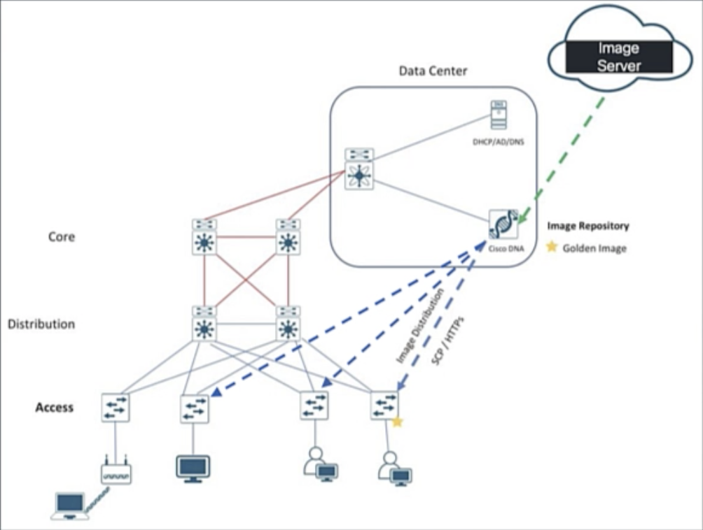](http://3.136.0.140/iac_demos/swim/SWIMDEMO.mp4)


# Detailed steps to perform
1. ## Import image:
We have three ways to import images into Catalyst Center:
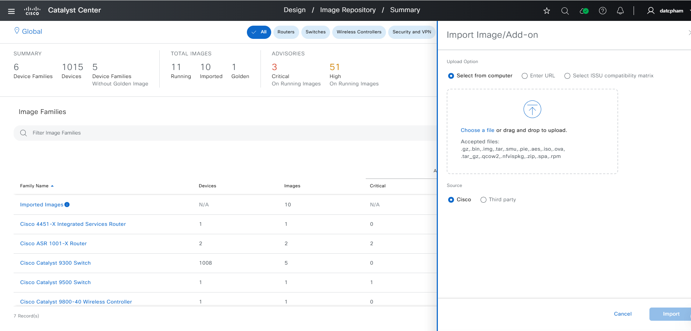

  ### a. local
  Download the image to your local machine and import directly.
  + Example input config:
  ```yaml
  swim_details:
    import_images:
      - import_image_details:
          type: local
          local_image_details:
              file_path: /Users/Downloads/cat9k_iosxe.17.12.01.SPA.bin
              is_third_party: False
  ```

  ### b. remote (commonly used)
  Upload the image to a server, and import via URL.
  + Example input config:
  ```yaml
  swim_details:
    import_images:
      - import_image_details:
          type: remote
          url_details:
            payload:
              - source_url: 
                  - http://xx.xx.xx.xx/swim/sanity_image_regr/17_12_4CCO/C9800-40-universalk9_wlc.17.12.04.SPA.bin
                is_third_party: False
  ```
  + Explain values:
  ```yaml
    type: Specifies the import source, supporting local file import (local) or remote url import (remote) or CCO.
    source_url: A mandatory parameter for importing a SWIM image via a remote URL. This parameter is required when using a URL to import an image..(For example, http://{host}/swim/cat9k_isoxe.16.12.10s.SPA.bin, ftp://user:password@{host}/swim/cat9k_isoxe.16.12.10s.SPA.iso)
    is_third_party: Flag indicates whether the image is uploaded from a third party (optional).
  ```

  * If you want to install parallel images (up to a maximum of 4), we can use with an input list in:
  ```yaml
              - source_url: 
                  - 
                  - 
                  ...
  ```
  for example with this input config:
  ```yaml
  swim_details:
    import_images:
      - import_image_details:
          type: remote
          url_details:
            payload:
              - source_url: 
                  - http://xx.xx.xx.xx/swim/V1715_1PRD18_FC1/cat9k_iosxe.17.15.01prd18.SPA.bin
                  - http://xx.xx.xx.xx/swim/V1715_1PRD18_FC1/C9800-SW-iosxe-wlc.17.15.01prd18.SPA.bin
                is_third_party: False
      - import_image_details:
          type: remote
          url_details:
            payload:
              - source_url: 
                  - http://xx.xx.xx.xx/swim/V1715_1PRD18_FC1/C9800-universalk9_wlc.17.15.01prd18.SPA.bin	
                is_third_party: False
  ```
  Catalyst Center will install in parallel with the two images: 'cat9k_iosxe.17.15.01prd18.SPA.bin' and 'C9800-SW-iosxe-wlc.17.15.01prd18.SPA.bin'. After the import is completed, Catalyst Center will continue to install the image 'C9800-universalk9_wlc.17.15.01prd18.SPA.bin'.
  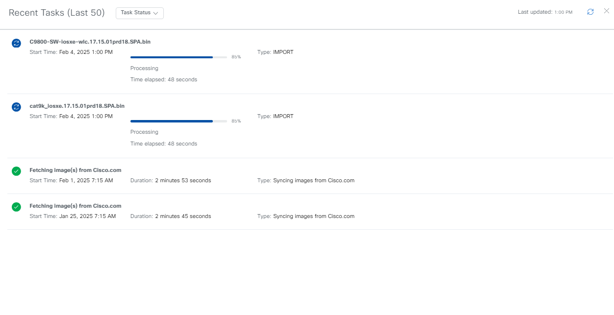
  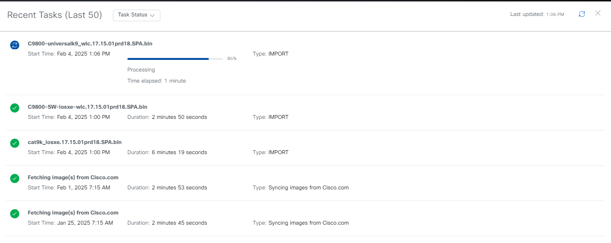

  ### c. cco
  Import images prepared for DNAC from Cisco Connection Online.
  + Example input config:
  ```yaml
  swim_details:
    import_images:
      - import_image_details:
          type: CCO
          cco_image_details:
            image_name: 
              - cat9k_iosxe_npe.17.09.06a.SPA.bin
              - C9800-40-universalk9_wlc.17.09.06.SPA.bin
  ```

  * Note: we can only install the CCO image to be displayed on Catalyst Center. The feature of installing images from CCO has limitations; we can only install images that have been prepared for display on Catalyst Center.
  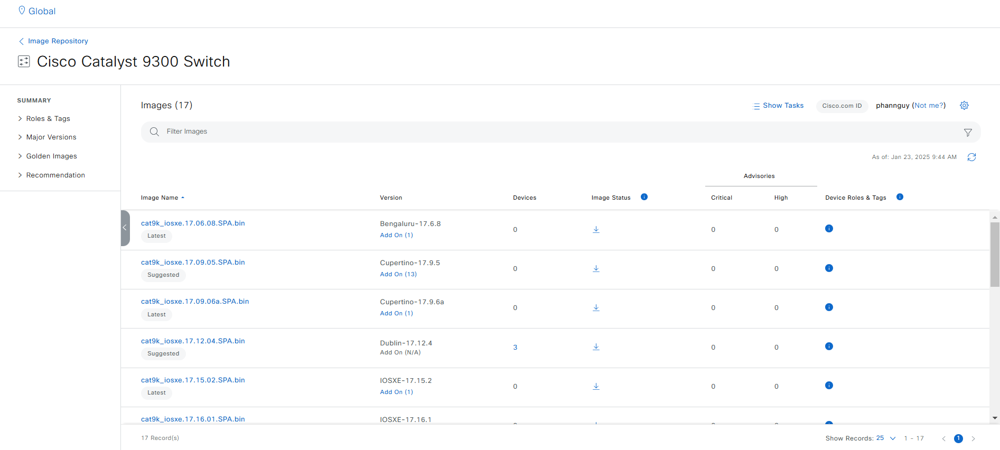
  For example, with the above images, we can see some CCO images that are proposed on Catalyst Center (cat9k_iosxe.17.06.08.SPA.bin, cat9k_iosxe.17.09.05.SPA.bin, cat9k_iosxe.17.09.06a.SPA.bin, ...). We can only install CCO type with those proposed images.

  ### d. Delete image in Cisco Catalyst Center
  After the image is imported to DNAC using the above methods (local, URL, CCO), it will exist on the Cisco Catalyst Center. We can delete it through the following playbook.
  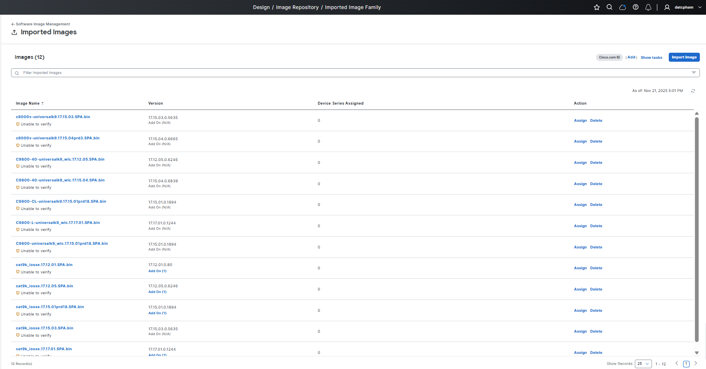
  + Example input config (state: "deleted"):
  ```yaml
  swim_details:
    delete_images:
      - image_name:
          - cat9k_iosxe.17.15.03.SPA.bin
          - C9800-L-universalk9_wlc.17.17.01.SPA.bin
  ```
  + Playbook return:
  ```yaml
  msg: 'Successfully deleted image(s): ''cat9k_iosxe.17.15.03.SPA.bin'', ''C9800-L-universalk9_wlc.17.17.01.SPA.bin''.'
  response: 'Successfully deleted image(s): ''cat9k_iosxe.17.15.03.SPA.bin'', ''C9800-L-universalk9_wlc.17.17.01.SPA.bin''.'
  status: success
  ```
  + The UI display:

  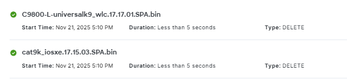

  **NOTE:The API for deleting images is only supported from DNAC version 2.3.7.9 and above.**

2. ## Tag/untag golden image:
Define and manage golden images that represent standard or preferred versions for your network devices.
+ Example input config:
```yaml
  swim_details:
    golden_tag_images:
      - tagging_details:
          image_name: cat9k_iosxe.17.06.08.SPA.bin
          device_role: ACCESS, CORE
          device_image_family_name : Cisco Catalyst 9300 Switch
          site_name: Global/USA/SAN JOSE
          tagging: true
```
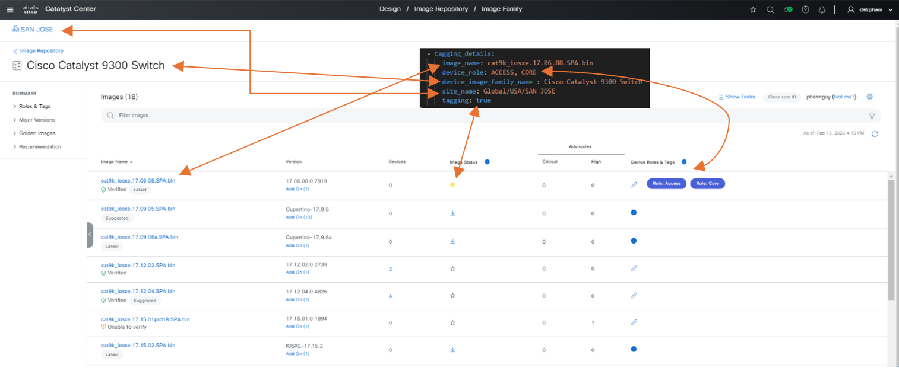

If you tag a different image with the same device_image_family_name, then the existing image will be untagged first.
```yaml
  swim_details:
    golden_tag_images:
      - tagging_details:
          image_name: cat9k_iosxe.17.12.04.SPA.bin
          device_role: ACCESS
          device_image_family_name : Cisco Catalyst 9300 Switch
          site_name: Global/USA/SAN JOSE
          tagging: true
```
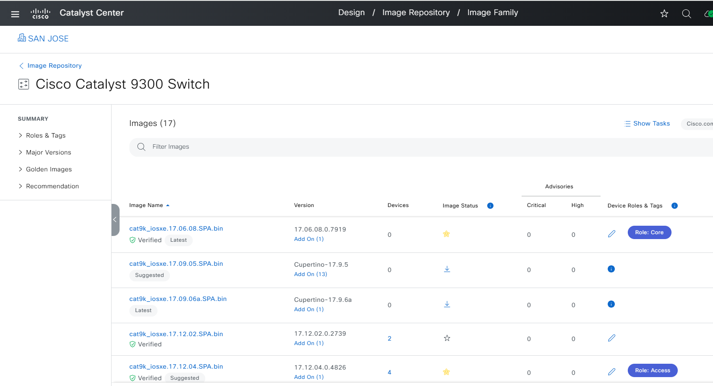

3. ## Distribute
Distribute the image to the device. In the playbook, we can have two types for distribution: distribute to a specific device (device_e2e) and distribute to multiple devices in parallel using device role and site filters (filter_e2e).

  ### a. Device End to End
  Provide a value for one of the following parameters: 'device_ip_address', 'device_hostname', 'device_serial_number', 'device_mac_address' to specify the exact device you want to distribute the image to.
  ```yaml
      - image_distribution_details:
          image_name: cat9k_iosxe.17.06.08.SPA.bin
          device_ip_address: 204.1.2.1
  ```

  ### b. Filter End to End
  You can distribute to multiple devices in parallel using filters for devices based on 'device_role', 'site_name', 'device_family_name', and 'device_series_name'.
  ```yaml
  swim_details:
    ...
    distribute_images:
      - image_distribution_details:
          image_name: cat9k_iosxe.17.06.08.SPA.bin
          device_role: ACCESS
          site_name: Global/USA/SAN JOSE
          device_family_name: Switches and Hubs
          device_series_name: Cisco Catalyst 9300 Series Switches
  ```
  UI action (includes distribute and activate):
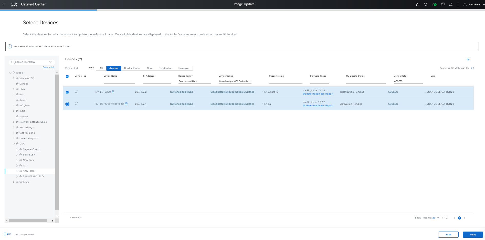

  ### c. Distribute & Activate without specifying image name (new enhancement)
  Automatically uses Golden Image tagged in Catalyst Center. It will satisfy the intersection of the specifications from `image_distribution_details` and `tagging_details`.
  ```yaml
  swim_details:
    ...
    distribute_images:
      - image_distribution_details:
          device_role: ACCESS
          site_name: Global/USA/SAN JOSE
          device_family_name: Switches and Hubs
          device_series_name: Cisco Catalyst 9300 Series Switches
  ```

  ### d. Support sub-package upgrades (new enhancement)
  Allows for a modular upgrade with the main image and additional packages.
  This will facilitate the conversion of the Switch to a Wireless Switch (Fiab device) by enabling the WLC option in the fabric (Embedded Wireless LAN Controller - WC role).

  *Note: Before we can enable the WLC option in the fabric, we need to distribute and activate the 9800 software images to these devices.
  The sub-package must correspond to the base image in terms of version to enable the upgrade.
  Also need to tag the corresponding golden image. Here, only need to tag the golden base image, and the accompanying sub-package will also be considered to be included in the golden tag.*

  + Example input config:
  ```yaml
  swim_details:
    ...
    distribute_images:
      - image_distribution_details:
          image_name: cat9k_iosxe.17.12.01.SPA.bin
          sub_package_images:
            - C9800-SW-iosxe-wlc.17.12.01.SPA.bin
          device_role: ACCESS
          site_name: Global/USA/SAN JOSE
          device_family_name: Switches and Hubs
          device_series_name: Cisco Catalyst 9300 Series Switches
  ```
  + Playbook return:
  ```yaml
  msg: "Bulk image distribution completed successfully - 204.1.2.1."
  response: "Bulk image distribution completed successfully - 204.1.2.1."
  status: success
  ```
  + The UI display (include activation):
  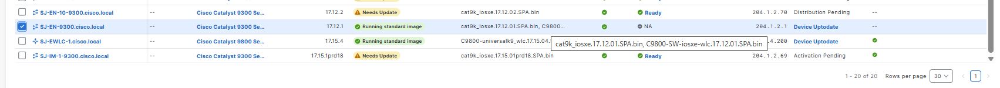
  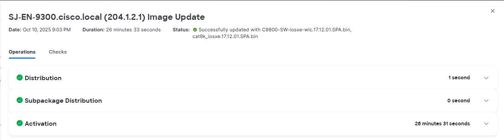

  **Note:**
  - We also can only need to provide the base image, or can choose not to provide both the base image and sub-package, and it can still upgrade the image using the image from the golden tag, include base and sub-package image (specifically for the case where `the device to be upgraded is currently running both the base and sub-package images`.)
  - In the case where `the device to be upgraded is currently running only the base image`, if we want to `upgrade to both the new base and sub-package images` completely, we need provide both the base image and the corresponding sub-package so that the API can perform the upgrade accurately. For example:
    + Current running: base image: cat9k_iosxe.17.12.01.SPA.bin
    + Want to update: base image: cat9k_iosxe.17.15.01.SPA.bin and sub-package: C9800-SW-iosxe-wlc.17.15.01.SPA.bin
  - In the case where `the device to be upgraded is currently running only the base image`, if we want to `upgrade only corresponding sub-package image for the base image`, we can providing only the sub-package for the update, but need to add the 'convert_to_wlc' parameter as True to ignore device compliance checks when activating the image, allowing the switch to WLC mode even if the device does not meet the requirements.
    + Current running: base image: cat9k_iosxe.17.12.01.SPA.bin
    + Want to update: sub-package: C9800-SW-iosxe-wlc.17.12.01.SPA.bin
  ```yaml
  swim_details:
    ...
    distribute_images:
      - image_distribution_details:
          sub_package_images:
            - C9800-SW-iosxe-wlc.17.12.01.SPA.bin
          device_role: ACCESS
          site_name: Global/USA/SAN JOSE
          device_family_name: Switches and Hubs
          device_series_name: Cisco Catalyst 9300 Series Switches
          convert_to_wlc: true
  ```

4. ## Activate
Activate the image to the device after successful distribution. In the playbook, we can have two types for activation: activate to a specific device (device_e2e) and activate to multiple devices in parallel using device role and site filters (filter_e2e).

  ### a. Device End to End
  You can provide a value for one of the following parameters: 'device_ip_address', 'device_hostname', 'device_serial_number', 'device_mac_address' to specify the exact device you want to activate the image to.
  ```yaml
      - image_activation_details:
          image_name: cat9k_iosxe.17.06.08.SPA.bin
          schedule_validate: false
          activate_lower_image_version: true
          distribute_if_needed: true
          device_ip_address: 204.1.2.1
          device_upgrade_mode: currentlyExists
  ```

  ### b. Filter End to End
  You can activate to multiple devices in parallel using filters for devices based on 'device_role', 'site_name', 'device_family_name', and 'device_series_name'.
  ```yaml
  swim_details:
    ...
    activate_images:
      - image_activation_details:
          image_name: cat9k_iosxe.17.06.08.SPA.bin
          device_role: ACCESS
          site_name: Global/USA/SAN JOSE
          device_family_name: Switches and Hubs
          device_series_name: Cisco Catalyst 9300 Series Switches
          activate_lower_image_version: true
          distribute_if_needed: true
          schedule_validate: false
          device_upgrade_mode: currentlyExists
  ```
  + Explain values:
  ```yaml
    image_name, device_role, site_name: Similar to distribution, these pinpoint the image and devices for activation.
    activate_lower_image_version: false: Ensures that only devices with the same or higher image versions will be considered for activation.
    distribute_if_needed: true: If the image isn't already present on the target devices, it will be distributed before activation.
    device_upgrade_mode: currentlyExists: This likely indicates that the activation process will target devices that already have the image in their inventory.
  ```
  UI action (includes distribute and activate):
  

  ### c. Distribute & Activate without specifying image name (new enhancement)
  Automatically uses Golden Image tagged in Catalyst Center. It will satisfy the intersection of the specifications from `image_activation_details` and `tagging_details`.
  ```yaml
  swim_details:
    ...
    activate_images:
      - image_activation_details:
          device_role: ACCESS
          site_name: Global/USA/SAN JOSE
          device_family_name: Switches and Hubs
          device_series_name: Cisco Catalyst 9300 Series Switches
          activate_lower_image_version: true
          distribute_if_needed: true
          schedule_validate: false
          device_upgrade_mode: currentlyExists
  ```

  ### d. Support sub-package upgrades (new enhancement)
  Allows for a modular upgrade with the main image and additional packages.
  This will facilitate the conversion of the Switch to a Wireless Switch (Fiab device) by enabling the WLC option in the fabric (Embedded Wireless LAN Controller - WC role).

  *Note: Before we can enable the WLC option in the fabric, we need to distribute and activate the 9800 software images to these devices.
  The sub-package must correspond to the base image in terms of version to enable the upgrade.
  Also need to tag the corresponding golden image. Here, only need to tag the golden base image, and the accompanying sub-package will also be considered to be included in the golden tag.*

  + Example input config:
  ```yaml
  swim_details:
    ...
    activate_images:
      - image_activation_details:
          image_name: cat9k_iosxe.17.12.01.SPA.bin
          sub_package_images:
            - C9800-SW-iosxe-wlc.17.12.01.SPA.bin
          device_role: ACCESS
          site_name: Global/USA/SAN JOSE
          device_family_name: Switches and Hubs
          device_series_name: Cisco Catalyst 9300 Series Switches
          activate_lower_image_version: true
          distribute_if_needed: true
          schedule_validate: false
          device_upgrade_mode: currentlyExists
  ```
  + Playbook return:
  ```yaml
  msg: "All eligible images activated successfully on the devices [204.1.2.1]."
  response: "All eligible images activated successfully on the devices [204.1.2.1]."
  status: success
  ```
  + The UI display:
  
  

  **Note:**
  - We also can only need to provide the base image, or can choose not to provide both the base image and sub-package, and it can still upgrade the image using the image from the golden tag, include base and sub-package image (specifically for the case where `the device to be upgraded is currently running both the base and sub-package images`.)
  - In the case where `the device to be upgraded is currently running only the base image`, if we want to `upgrade to both the new base and sub-package images` completely, we need provide both the base image and the corresponding sub-package so that the API can perform the upgrade accurately. For example:
    + Current running: base image: cat9k_iosxe.17.12.01.SPA.bin
    + Want to update: base image: cat9k_iosxe.17.15.01.SPA.bin and sub-package: C9800-SW-iosxe-wlc.17.15.01.SPA.bin
  - In the case where `the device to be upgraded is currently running only the base image`, if we want to `upgrade only corresponding sub-package image for the base image`, we can providing only the sub-package for the update, but need to add the 'convert_to_wlc' parameter as True to ignore device compliance checks when activating the image, allowing the switch to WLC mode even if the device does not meet the requirements.
    + Current running: base image: cat9k_iosxe.17.12.01.SPA.bin
    + Want to update: sub-package: C9800-SW-iosxe-wlc.17.12.01.SPA.bin
  ```yaml
  swim_details:
    ...
    activate_images:
      - image_activation_details:
          sub_package_images:
            - C9800-SW-iosxe-wlc.17.12.01.SPA.bin
          device_role: ACCESS
          site_name: Global/USA/SAN JOSE
          device_family_name: Switches and Hubs
          device_series_name: Cisco Catalyst 9300 Series Switches
          activate_lower_image_version: true
          distribute_if_needed: true
          schedule_validate: false
          device_upgrade_mode: currentlyExists
          convert_to_wlc: true
  ```

5. ## All steps are specified in one step
The software image (SWIM) can be updated on the device in a single run by combining all the steps (import, tag, distribute, activate) into one input.
```yaml
  swim_details:
    ...
    upload_tag_dis_activate_images:
      - import_image_details:
          type: remote
          url_details:
            payload:
              - source_url: 
                  - http://xx.xx.xx.xx/swim/V1715_1PRD18_FC1/cat9k_iosxe.17.15.01prd18.SPA.bin
                  - http://xx.xx.xx.xx/swim/V1715_1PRD18_FC1/C9800-SW-iosxe-wlc.17.15.01prd18.SPA.bin
                is_third_party: False
      - tagging_details:
            image_name: cat9k_iosxe.17.15.01prd18.SPA.bin
            device_role: ALL
            device_image_family_name: Cisco Catalyst 9300 Switch
            site_name: Global/USA/SAN JOSE/BLD23
            tagging: true
      - image_distribution_details:
          image_name: cat9k_iosxe.17.15.01prd18.SPA.bin
          device_role: ACCESS
          site_name: Global/USA/SAN JOSE/BLD23
          device_family_name: Switches and Hubs
      - image_activation_details:
          activate_lower_image_version: false
          device_family_name: Switches and Hubs
          device_role: ACCESS
          device_upgrade_mode: currentlyExists
          distribute_if_needed: true
          image_name: cat9k_iosxe.17.15.01prd18.SPA.bin
          schedule_validate: false
          site_name: Global/USA/SAN JOSE/BLD23
```

# New SWIM Enhancements

This section explains the capabilities present in the pinned development revision
[`7c739438`](https://github.com/cisco-en-programmability/catalystcenter-ansible-dev/blob/7c739438d533c028a9fe67f2f22272270081ddf4/plugins/modules/swim_workflow_manager.py).
It also explains whether each capability can be used through the existing SWIM
workflow or requires a small workflow update first.

## Read this first

There are two layers involved:

1. **SWIM workflow**: `workflows/swim/playbook/swim_workflow_playbook.yml` reads the
   customer input under `swim_details` and calls the module.
2. **SWIM module**: `cisco.catalystcenter.swim_workflow_manager` performs the actual
   Catalyst Center operations.

The newer module supports more parameters than the current workflow playbook and
schema. This means a parameter may be valid for the module but still be rejected by
the workflow schema or never passed by the workflow playbook.

Use the following rule:

* **Works through the existing workflow**: use the parameter in `swim_details`.
* **Workflow update required**: update the playbook and schema first, or call the
  module directly.

## What can be used now?

| Capability | Existing workflow status |
|---|---|
| `sync_cco` | Available now |
| `device_tag` | Available now |
| `image_distribution_timeout` | Available now; workflow default should be aligned with the module |
| `image_activation_timeout` | Available now; workflow default should be aligned with the module |
| `convert_to_wlc` | Available now |
| `compatible_features` | Available now |
| `distribution_poll_interval` | Workflow update required |
| `activation_poll_interval` | Workflow update required |
| `distribution_batch_size` | Workflow update required |
| `activation_batch_size` | Workflow update required |
| `catalystcenter_task_poll_interval` | Workflow update required |
| `device_serial_numbers` | Workflow schema update required |
| `device_ip_addresses` | Workflow schema update required |
| `device_hostnames` | Workflow schema update required |
| `device_mac_addresses` | Workflow schema update required |
| `force_distribution` | Workflow schema update required |
| `force_activation` | Workflow schema update required |

If the workflow has not been updated, use the direct-module example at the end of
this section for parameters marked **Workflow update required**.

## Enhancement summary

| Enhancement | Parameters | Purpose |
|---|---|---|
| Configurable status polling | `distribution_poll_interval`, `activation_poll_interval` | Reduces API request frequency and helps avoid HTTP 429 responses during long operations. |
| Configurable bulk batches | `distribution_batch_size`, `activation_batch_size` | Splits large device sets into independently monitored API requests. Valid range: 1-500. |
| Bulk explicit targeting | `device_serial_numbers`, `device_ip_addresses`, `device_hostnames`, `device_mac_addresses` | Targets multiple explicitly named devices in one operation. |
| Device-tag targeting | `device_tag` | Selects devices associated with a Catalyst Center device tag. |
| Operation-specific timeouts | `image_distribution_timeout`, `image_activation_timeout` | Allows long-running transfers, installations, reboots, and post-activation checks to complete. |
| Compliance override | `force_distribution`, `force_activation` | Deliberately bypasses IMAGE compliance eligibility for a requested image. |
| WLC conversion override | `convert_to_wlc` | Bypasses the compliance check for supported switch-to-WLC conversion workflows. |
| CCO catalog synchronization | `sync_cco` | Synchronizes Cisco Connection Online images with Catalyst Center. Catalyst Center 3.1.3.0 or later. |
| Activation feature controls | `compatible_features` | Sends feature choices such as ISSU and ROMMON update during activation. Catalyst Center 3.1.3.0 or later. |
| Role-aware golden-tag idempotency | `device_role` | Evaluates golden tags per requested role and handles `ALL` as a superset. |

## Module-level control parameters

These parameters belong at the same level as `config` when calling
`cisco.catalystcenter.swim_workflow_manager` directly.

| Parameter | Type | Default | How to use it |
|---|---:|---:|---|
| `distribution_poll_interval` | integer | `30` | Seconds between distribution status checks. Minimum is `1`. Increase it for large jobs or when Catalyst Center rate-limits polling. It also controls polling for distribution triggered by `distribute_if_needed`. |
| `activation_poll_interval` | integer | `30` | Seconds between activation status checks. Minimum is `1`. Increase it for upgrades with long reload times. |
| `distribution_batch_size` | integer | `50` | Devices per bulk distribution request. Valid values are `1` through `500`. Each batch receives its own task ID. |
| `activation_batch_size` | integer | `50` | Devices per bulk activation request. Valid values are `1` through `500`. Each batch receives its own task ID. |
| `catalystcenter_api_task_timeout` | integer | `1200` | General Catalyst Center asynchronous API task timeout, in seconds. This is separate from the full distribution and activation timeouts. |
| `catalystcenter_task_poll_interval` | integer | `2` | General Catalyst Center API task polling interval, in seconds. |
| `config_verify` | boolean | `false` | Verifies Catalyst Center state after the requested operation. |
| `state` | string | `merged` | Use `merged` for import, tag, distribute, or activate. Use `deleted` with `image_name` to remove images. |

### Example: tune polling and batch sizes

```yaml
- name: Distribute an image to a large device set
  cisco.catalystcenter.swim_workflow_manager:
    catalystcenter_host: "{{ catalystcenter_host }}"
    catalystcenter_username: "{{ catalystcenter_username }}"
    catalystcenter_password: "{{ catalystcenter_password }}"
    catalystcenter_version: "{{ catalystcenter_version }}"
    catalystcenter_verify: false
    distribution_poll_interval: 60
    distribution_batch_size: 25
    config:
      - image_distribution_details:
          image_name: cat9k_iosxe.17.12.04.SPA.bin
          image_distribution_timeout: 7200
          device_ip_addresses:
            - 10.10.10.11
            - 10.10.10.12
            - 10.10.10.13
```

Use a smaller batch when Catalyst Center or the network is under load. Use a
larger poll interval to reduce status-query volume. These controls change how the
module submits and monitors work; they do not change the image itself.

## Bulk device targeting

Distribution and activation now accept singular and plural identifiers.

| Identifier | One device | Multiple devices |
|---|---|---|
| Serial number | `device_serial_number` | `device_serial_numbers` |
| Management IP | `device_ip_address` | `device_ip_addresses` |
| Hostname | `device_hostname` | `device_hostnames` |
| MAC address | `device_mac_address` | `device_mac_addresses` |

Rules for explicit bulk targeting:

* Singular and plural identifiers may be supplied together. The module resolves all
  entries, combines the results, and removes duplicate device IDs.
* When a plural identifier is present, explicit identifiers take precedence and
  site-based device selection is skipped.
* Every supplied identifier must resolve. One unresolved entry fails the operation
  and is identified in the error message.
* Blank, whitespace-only, and non-string entries in plural lists are rejected.
* Unreachable devices and access points are excluded from bulk and site-based
  selection. SAPRO devices are not eligible for distribution or activation.
* Prefer one identifier type and one identifier per device. Mixed identifier types
  are supported when a common identifier is unavailable.

### Example: bulk distribution by hostname

```yaml
swim_details:
  distribute_images:
    - image_distribution_details:
        image_name: cat9k_iosxe.17.12.04.SPA.bin
        device_hostnames:
          - sj-access-01.cisco.com
          - sj-access-02.cisco.com
        image_distribution_timeout: 7200
```

### Example: bulk activation by serial number

```yaml
swim_details:
  activate_images:
    - image_activation_details:
        image_name: cat9k_iosxe.17.12.04.SPA.bin
        device_serial_numbers:
          - FOC1234A001
          - FOC1234A002
        activate_lower_image_version: false
        distribute_if_needed: true
        schedule_validate: true
        device_upgrade_mode: install
        image_activation_timeout: 10800
```

## Device-tag targeting

Use `device_tag` in distribution or activation details to select devices associated
with a Catalyst Center device tag. It can be combined with site, role, family, and
series filters where supported by Catalyst Center.

```yaml
swim_details:
  distribute_images:
    - image_distribution_details:
        image_name: cat9k_iosxe.17.12.04.SPA.bin
        site_name: Global/USA/San Jose
        device_role: ACCESS
        device_family_name: Switches and Hubs
        device_tag: SWIM-WAVE-1
```

## Distribution and activation timeouts

`image_distribution_timeout` and `image_activation_timeout` are measured in
seconds and default to `3600` in the pinned module revision.

The distribution timeout covers image preparation, transfer, installation
verification, and final distribution status. The activation timeout covers image
validation, upgrade-mode processing, device reload, connectivity restoration, and
post-activation checks.

Set these values generously. Image size, link speed, device count, device model,
reload time, and current Catalyst Center load all affect completion time. A timeout
does not cancel work already running on Catalyst Center; it means the module stopped
waiting before the controller reported a terminal result.

```yaml
swim_details:
  activate_images:
    - image_activation_details:
        image_name: cat9k_iosxe.17.12.04.SPA.bin
        device_ip_address: 10.10.10.11
        distribute_if_needed: true
        image_activation_timeout: 10800
```

## IMAGE compliance and forced operations

By default, distribution and activation eligibility comes from the device's
`IMAGE` compliance status in Catalyst Center. That status compares the installed
image with the golden image assigned for the device's site, family, and role.

* `NON_COMPLIANT`: eligible by default.
* `COMPLIANT`: skipped by default because the controller considers the device aligned.
* `NOT_APPLICABLE`: skipped by default, commonly because no applicable golden image is assigned.

The recommended approach is to tag the intended image as golden and let compliance
drive an idempotent rollout.

Use `force_distribution: true` or `force_activation: true` only for a deliberate,
targeted override, such as a downgrade or a non-golden image. These flags bypass
the compliance check; they do not bypass image compatibility or controller API
validation.

### Example: deliberately distribute and activate a non-golden image

```yaml
swim_details:
  distribute_images:
    - image_distribution_details:
        image_name: cat9k_iosxe.17.09.05.SPA.bin
        device_ip_address: 10.10.10.11
        force_distribution: true
        image_distribution_timeout: 7200

  activate_images:
    - image_activation_details:
        image_name: cat9k_iosxe.17.09.05.SPA.bin
        device_ip_address: 10.10.10.11
        force_activation: true
        activate_lower_image_version: true
        distribute_if_needed: false
        image_activation_timeout: 10800
```

## WLC conversion

`convert_to_wlc: true` bypasses the normal IMAGE compliance check for a supported
switch-to-WLC conversion. Confirm platform and image compatibility before using it.
The base image and WLC subpackage should have matching software versions.

```yaml
swim_details:
  activate_images:
    - image_activation_details:
        image_name: cat9k_iosxe.17.12.01.SPA.bin
        sub_package_images:
          - C9800-SW-iosxe-wlc.17.12.01.SPA.bin
        device_ip_address: 10.10.10.11
        convert_to_wlc: true
        distribute_if_needed: true
        activate_lower_image_version: false
        schedule_validate: true
```

## CCO synchronization

`sync_cco` refreshes the Cisco Connection Online image catalog in Catalyst Center.
It is supported for Catalyst Center 3.1.3.0 and later. Synchronization is distinct
from importing a named CCO image: synchronize first when the desired catalog entry
is not current, then run the CCO import.

```yaml
swim_details:
  import_images:
    - sync_cco: true
```

Import a selected image after synchronization:

```yaml
swim_details:
  import_images:
    - import_image_details:
        type: CCO
        cco_image_details:
          image_name:
            - cat9k_iosxe.17.16.01.SPA.bin
```

## Compatible activation features

`compatible_features` sends feature selections with an activation request. This is
supported for Catalyst Center 3.1.3.0 and later. Feature names and allowed values
must match those returned by Catalyst Center for the selected image and devices.

```yaml
swim_details:
  activate_images:
    - image_activation_details:
        image_name: cat9k_iosxe.17.12.04.SPA.bin
        device_ip_addresses:
          - 10.10.10.11
          - 10.10.10.12
        compatible_features:
          - key: ISSU
            value: Enable
          - key: Rommon update
            value: Disable
        schedule_validate: true
        distribute_if_needed: true
        image_activation_timeout: 10800
```

## Golden-tag role behavior

Golden-tag idempotency is evaluated per role in Catalyst Center 3.1.3.0 and later.
For example, an image already tagged for `ACCESS` can still be newly tagged for
`CORE`. A request is skipped only when all requested roles are already present.
`ALL` is treated as a superset of the individual roles.

```yaml
swim_details:
  golden_tag_images:
    - tagging_details:
        image_name: cat9k_iosxe.17.12.04.SPA.bin
        device_role: ACCESS,CORE
        device_image_family_name: Cisco Catalyst 9300 Switch
        site_name: Global/USA/San Jose
        tagging: true
```

To move a role to another golden image, untag the current assignment for that role
and then tag the replacement image.

## Changes required in the workflow

Complete these changes before using every new parameter through
`workflows/swim/playbook/swim_workflow_playbook.yml`.

1. Add these module-level variables to the playbook's `catalyst_center_login` anchor
   and to `workflows/swim/schema/swim_schema.yml`:

   ```yaml
   distribution_poll_interval: "{{ distribution_poll_interval | default(30) }}"
   activation_poll_interval: "{{ activation_poll_interval | default(30) }}"
   distribution_batch_size: "{{ distribution_batch_size | default(50) }}"
   activation_batch_size: "{{ activation_batch_size | default(50) }}"
   catalystcenter_task_poll_interval: "{{ catalyst_center_task_poll_interval | default(2) }}"
   ```

2. Add these fields to both the individual-operation and full-workflow schema types:

   * Distribution: `device_serial_numbers`, `device_ip_addresses`,
     `device_hostnames`, `device_mac_addresses`, and `force_distribution`.
   * Activation: `device_serial_numbers`, `device_ip_addresses`,
     `device_hostnames`, `device_mac_addresses`, and `force_activation`.
   * Keep `device_tag`, `image_distribution_timeout`, `image_activation_timeout`,
     `convert_to_wlc`, and `compatible_features`; they already exist in the checked
     workflow schema.
   * Keep `sync_cco`; it already exists under `import_image_details_type`.

3. Align the workflow schema defaults for `image_distribution_timeout` and
   `image_activation_timeout` with the module default of `3600` seconds. The checked
   workflow schema currently declares `1800`, while the pinned module uses `3600`.

Until these changes are merged, the existing workflow remains valid for the
parameters marked **Available now**. Call the module directly for parameters marked
**Workflow update required**.

## Complete enhanced example

The following direct module call demonstrates bulk targeting, batching, polling,
timeouts, and compatible activation features without relying on workflow-wrapper
changes:

```yaml
---
- name: Enhanced SWIM activation
  hosts: catalyst_center_hosts
  connection: local
  gather_facts: false

  tasks:
    - name: Distribute and activate an image on an explicit device set
      cisco.catalystcenter.swim_workflow_manager:
        catalystcenter_host: "{{ catalystcenter_host }}"
        catalystcenter_username: "{{ catalystcenter_username }}"
        catalystcenter_password: "{{ catalystcenter_password }}"
        catalystcenter_version: "{{ catalystcenter_version }}"
        catalystcenter_port: "{{ catalystcenter_port | default(443) }}"
        catalystcenter_verify: "{{ catalystcenter_verify | default(false) }}"
        catalystcenter_log: true
        catalystcenter_log_level: DEBUG
        catalystcenter_log_file_path: catalystcenter.log
        catalystcenter_api_task_timeout: 1800
        catalystcenter_task_poll_interval: 5
        distribution_poll_interval: 60
        activation_poll_interval: 60
        distribution_batch_size: 25
        activation_batch_size: 10
        config_verify: true
        state: merged
        config:
          - image_distribution_details:
              image_name: cat9k_iosxe.17.12.04.SPA.bin
              device_ip_addresses:
                - 10.10.10.11
                - 10.10.10.12
              image_distribution_timeout: 7200
          - image_activation_details:
              image_name: cat9k_iosxe.17.12.04.SPA.bin
              device_ip_addresses:
                - 10.10.10.11
                - 10.10.10.12
              distribute_if_needed: true
              activate_lower_image_version: false
              device_upgrade_mode: install
              schedule_validate: true
              compatible_features:
                - key: ISSU
                  value: Enable
                - key: Rommon update
                  value: Disable
              image_activation_timeout: 10800
```

# How to run
  1. ## Command to run
  ### a. Include import/tag_untag/distribute/activate images (state = 'merged')
  Example command to run the swim playbook:
  ```bash
  ansible-playbook 
    -i ./inventory/demo_lab/hosts.yml # refer to Catalyst Center to run
    ./workflows/swim/playbook/swim_workflow_playbook.yml # playbook will run this
    --extra-vars VARS_FILE_PATH=../vars/swim_vars.yml # location of the input file for the playbook to execute
    -vvv # return detailed information about the message; the more 'v', more detailed
  ```
  
  ### b. Include delete images (state = 'deleted')
  Example command to run the swim playbook:
  ```bash
  ansible-playbook 
    -i ./inventory/demo_lab/hosts.yml # refer to Catalyst Center to run
    ./workflows/swim/playbook/delete_swim_workflow_playbook.yml # playbook will run this
    --extra-vars VARS_FILE_PATH=../vars/delete_swim_vars.yml # location of the input file for the playbook to execute
    -vvv # return detailed information about the message; the more 'v', more detailed
  ```

  2. ## Validate the schema input
  ### a. Include import/tag_untag/distribute/activate images (state = 'merged')
  ```bash
    ./tools/schemavalidation.sh \
    -s workflows/swim/schema/swim_schema.yml \
    -v workflows/swim/vars/swim_import_tag_distribute_activate_image_vars.yml
  ```

  ### b. Include delete images (state = 'deleted')
  ```bash
    ./tools/schemavalidation.sh \
    -s workflows/swim/schema/delete_swim_schema.yml \
    -v workflows/swim/vars/delete_swim_vars.yml
  ```


# Reference

*Note: The environment used for the references in the above instructions is as follows:*

```yaml
python: 3.12.0
catalystcenter_version: 3.1.5
ansible: 9.9.0
catalystcentersdk: 2.10.4
cisco.catalystcenter: 2.6.0
```
## Workflow Steps
## User Flow (3 Steps)

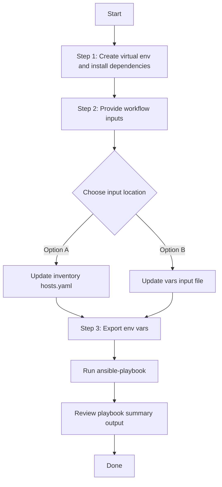
```mermaid
flowchart TD
  A[Start] --> B[Step 1: Create virtual env and install dependencies]
  B --> C[Step 2: Provide workflow inputs]
  C --> D{Choose input location}
  D -->|Option A| E[Update inventory hosts.yaml]
  D -->|Option B| F[Update vars input file]
  E --> G[Step 3: Export env vars]
  F --> G
  G --> H[Run ansible-playbook]
  H --> I[Review playbook summary output]
  I --> J[Done]
```

### Installation and Run (Aligned)

1. Create and activate a Python virtual environment, then install dependencies.

```bash
python3 -m venv .venv
source .venv/bin/activate
pip install -r requirements.txt
ansible-galaxy collection install cisco.catalystcenter --force
```

2. Provide workflow inputs in either inventory (`inventory/demo_lab/hosts.yaml`) or the workflow `vars/` file.

3. Export Catalyst Center environment variables and run the playbook.

```bash
export HOSTIP=<catalyst-center-ip-or-fqdn>
export CATALYST_CENTER_USERNAME=<username>
export CATALYST_CENTER_PASSWORD='<password>'
ansible-playbook -i ./inventory/demo_lab/hosts.yaml ./workflows/swim/playbook/swim_workflow_playbook.yml -vvvv
```

## Inventory / group_vars Example

You can also run this workflow without `VARS_FILE_PATH` by moving the sample workflow data into inventory, `host_vars`, or `group_vars`.

1. Create an inventory vars file such as `inventory/group_vars/all.yml` or `inventory/host_vars/<host>.yml`.
2. Copy the sample workflow data from `workflows/swim/vars/swim_import_tag_distribute_activate_image_vars.yml` into that inventory vars file.
3. Keep the same top-level variable name in inventory: `swim_details`.
4. Run the playbook without `VARS_FILE_PATH`:

```bash
ansible-playbook -i <inventory-file> workflows/swim/playbook/swim_workflow_playbook.yml -vvvv
```
## VARS_FILE_PATH Path Resolution

Ansible resolves `VARS_FILE_PATH` relative to the playbook directory, not the current working directory.

Use either of these forms:

- Relative to the playbook: `../vars/swim_import_tag_distribute_activate_image_vars.yml`
- Fully resolved from the repo root: `${PWD}/workflows/swim/vars/swim_import_tag_distribute_activate_image_vars.yml`
