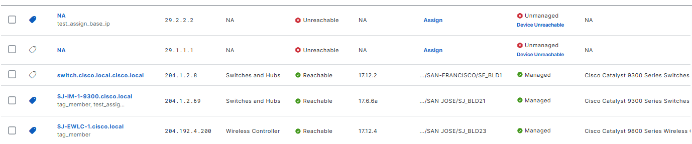

# Tags Manager Workflow

This workflow automates the management of tags within your infrastructure using Ansible.

## Key Features

- **Create, Update, and Delete Tags Use Cases**:
  - Create Tags (Single and Bulk)
  - Updated multiple tags and verified messages for create, update, and unchanged states.
  - Delete Tags (Single and Bulk)
- **Assign and Unassign Tags Use Cases**:
  - Assign/Unassign Tags to Devices Based on Device Rules
  - Assign/Unassign Devices to Tags based on Device Identifier

**Version Added**: 6.36.0

## Workflow Steps

### Step 1: Install and Generate Inventory

1. **Install Ansible**: Follow the [official Ansible documentation](https://docs.ansible.com/ansible/latest/installation_guide/intro_installation.html) for installation.
2. **Install Cisco Catalyst Center Collection**:
   ```bash
   ansible-galaxy collection install cisco.dnac
   ```
3. **Generate Inventory**: Create an Ansible inventory file (e.g., `inventory.yml`) with your Cisco Catalyst Center details.
   ```yaml
   catalyst_center_hosts:
     hosts:
       your_catalyst_center_instance_name:
         catalyst_center_host: xx.xx.xx.xx
         catalyst_center_password: XXXXXXXX
         catalyst_center_port: 443
         catalyst_center_timeout: 60
         catalyst_center_username: admin
         catalyst_center_verify: false  # Set to true for production
         catalyst_center_version: 2.3.7.9
         catalyst_center_debug: true
         catalyst_center_log_level: INFO
         catalyst_center_log: true
   ```

### Step 2: Define Inputs and Validate

1. **Define Input Variables**: Create variable files (e.g., `vars/tags_manager_inputs.yml`) to create a tag and assign it with the desired specification.

#### Schema for Wireless Network Profiles

The schema file (e.g., `schema/tags_manager_schema.yml`) defines the structure of the input file for configuring Tag in Cisco Catalyst Center.

**Tag Details**

| Parameter         | Type | Required | Default Value | Description                                                                 |
|-------------------|------|----------|---------------|-----------------------------------------------------------------------------|
| `tags_details`    | List | No       | N/A           | List of tag configurations. Includes `tag_detail_type`.                     |

**Tag Components**

| Parameter         | Type | Required | Default Value | Description                                                                 |
|-------------------|------|----------|---------------|-----------------------------------------------------------------------------|
| `tag`             | Dict | No       | N/A           | Tag configuration details. Includes `tags_type`.                           |
| `tag_memberships` | Dict | No       | N/A           | Tag membership configuration details. Includes `tag_membership_type`.      |

**Tag Configuration (`tags_type`)**

| Parameter                             | Type       | Required | Default Value | Description                                                                 |
|---------------------------------------|------------|----------|---------------|-----------------------------------------------------------------------------|
| `name`                                | String     | Yes      | N/A           | Unique name identifying the tag for creation, update, or deletion.         |
| `description`                         | String     | No       | N/A           | Brief description of the tag for additional context.                       |
| `force_delete`                        | Bool       | No       | False         | Forces tag deletion even if associated with devices/ports.                 |
| `device_rules`                        | Dict       | No       | N/A           | Rules for dynamically tagging devices. Includes `device_rules_type`.       |
| `port_rules`                          | Dict       | No       | N/A           | Rules for dynamically tagging ports. Includes `port_rules_type`.           |

**Device Rules (`device_rules_type`)**

| Parameter           | Type       | Required | Default Value | Description                                                                 |
|---------------------|------------|----------|---------------|-----------------------------------------------------------------------------|
| `rule_descriptions` | List[Dict] | Yes      | N/A           | List of rules for tagging devices. Includes `device_rule_descriptions_type`.|

**Port Rules (`port_rules_type`)**

| Parameter           | Type       | Required | Default Value | Description                                                                 |
|---------------------|------------|----------|---------------|-----------------------------------------------------------------------------|
| `scope_description` | Dict       | No       | N/A           | Scope for the rules. Includes `scope_description_type`.                    |
| `rule_descriptions` | List[Dict] | Yes      | N/A           | List of rules for tagging ports. Includes `port_rule_descriptions_type`.   |

**Device Rule Descriptions (`device_rule_descriptions_type`)** similar **Port Rule Descriptions (`port_rule_descriptions_type`)**

| Parameter         | Type       | Required | Default Value | Description                                                                 |
|-------------------|------------|----------|---------------|-----------------------------------------------------------------------------|
| `rule_name`       | Enum       | Yes      | N/A           | Port attribute for tagging: "speed", "admin_status", "port_name", "operational_status", "description". |
| `search_pattern`  | Enum       | Yes      | N/A           | Search pattern for matching: "contains", "equals", "starts_with", "ends_with". |
| `value`           | String     | Yes      | N/A           | Value to match against (e.g., port name, speed, or description).           |
| `operation`       | Enum       | No       | ILIKE         | Match operation: "ILIKE" (case-insensitive), "LIKE" (case-sensitive).      |

**Tag Membership (`tag_membership_type`)**

| Parameter                             | Type       | Required | Default Value | Description                                                                 |
|---------------------------------------|------------|----------|---------------|-----------------------------------------------------------------------------|
| `tags`                                | List[String] | Yes    | N/A           | List of tag names to assign to devices or interfaces.                      |
| `device_details`                      | List[Dict] | No       | N/A           | Device details for tagging. Includes `device_details_type`.                |
| `site_details`                        | List[Dict] | No       | N/A           | Site details for tagging. Includes `site_details_type`.                    |

**Device Details (`device_details_type`)**

| Parameter         | Type       | Required | Default Value | Description                                                                 |
|-------------------|------------|----------|---------------|-----------------------------------------------------------------------------|
| `ip_addresses`    | List[String] | No     | N/A           | List of IP addresses for devices.                                          |
| `hostnames`       | List[String] | No     | N/A           | List of hostnames for devices.                                            |
| `mac_addresses`   | List[String] | No     | N/A           | List of MAC addresses for devices.                                         |
| `serial_numbers`  | List[String] | No     | N/A           | List of serial numbers for devices.                                        |
| `port_names`      | List[String] | No     | N/A           | List of port names for tagging under devices.                              |

**Site Details (`site_details_type`)**

| Parameter         | Type       | Required | Default Value | Description                                                                 |
|-------------------|------------|----------|---------------|-----------------------------------------------------------------------------|
| `site_names`      | List[String] | Yes    | N/A           | List of site hierarchy names for tagging.                                  |
| `port_names`      | List[String] | No     | N/A           | List of port names for tagging under devices in sites.                     |


> **Note**: Refer to the official documentation for detailed information on defining workflows: https://galaxy.ansible.com/ui/repo/published/cisco/dnac/content/module/tags_workflow_manager/


## Example Input File
The Tags module allows you to create tags and use them to group devices together for easier management.


Refer to the full workflow specification for detailed instructions on the available options and their structure: https://galaxy.ansible.com/ui/repo/published/cisco/dnac/docs/

### 1. Create, Update, and Delete Tags Use Cases
Include the steps to create, update, and delete tags simply

#### a. Create
- Example inputs:
```yaml
tags_details:
  - tag:
      name: Tag 1
      description: "Tags with description: tag1"
  - tag:
      name: Tag 2
  - tag:
      name: Tag 3
```

- Terminal return:
```code
  msg: Tags 'Tags 1, Tags 2, Tags 3' have been created successfully in the Cisco Catalyst Center.
  response: Tags 'Tags 1, Tags 2, Tags 3' have been created successfully in the Cisco Catalyst Center.
  status: success
```

- Mapping in the UI:


#### b. Update
Update multiple tags including the statuses: new create, new update, and no change. The module will return detailed messages about their statuses.

- Example inputs:
```yaml
tags_details:
  - tag:
      name: Tag 1 # No need update
  - tag:
      name: Tag 2
      description: "Tag 2 with new update description"
  - tag:
      name: Tag 3 # No need update
  - tag:
      name: Tag 4 # Create new tag
```

- Terminal return:
```code
  msg: |-
    Tag 'Tag 4' has been created successfully in the Cisco Catalyst Center.
    Tag 'Tag 2' has been updated successfully in the Cisco Catalyst Center.
    Tags 'Tags 1, Tags 3' needs no update in the Cisco Catalyst Center.
  response: |-
    Tag 'Tag 4' has been created successfully in the Cisco Catalyst Center.
    Tag 'Tag 2' has been updated successfully in the Cisco Catalyst Center.
    Tags 'Tags 1, Tags 3' needs no update in the Cisco Catalyst Center.
  status: success
```

- Mapping in the UI:


#### b. Delete
To delete tag, specify the tag name in the playbook in the *deleted* state. The module will process this and return the exact and clear message regarding tags successfully deleted.

- Example inputs:
```yaml
tags_details:
  - tag:
      name: Tag 1
  - tag:
      name: Tag 2
  - tag:
      name: Tag 3
  - tag:
      name: Tag 4
  - tag:
      name: Tag 5  # non-exist    
```

- Terminal return:
```code
  msg: |-
    Tags 'Tags 1, Tags 2, Tags 3, Tags 4' have been deleted successfully in the Cisco Catalyst Center.
    Not able to perform delete operations for Tag 'Tag 5' because it is not present in the Cisco Catalyst Center.
  response: |-
    Tags 'Tags 1, Tags 2, Tags 3, Tags 4' have been deleted successfully in the Cisco Catalyst Center.
    Not able to perform delete operations for Tag 'Tag 5' because it is not present in the Cisco Catalyst Center.
  status: success
```

- Mapping in the UI:


***Note: If tags have been assigned to a device, a normal delete will not succeed. However, in the module, if we add the option 'force_delete: true', it will include steps to unassign the tags from the device and successfully delete the tags.***

```yaml
tags_details:
  - tag:
      name: assign_by_serial_numbers
      force_delete: true
```

### 2. Assign and Unassign Tags Use Cases
Include the steps to assign tags from the tag side to the device and from the device side to the tag

#### a. Assign/Unassign Tags to Devices Based on Device Rules
We can assign tags to devices based on device rules such as (Name, Family, Series, IP, Location, Version) with matches like equals, contains, starts_with, ...

- Example inputs:
```yaml
tags_details:
  - tag:
      name: test_assign_base_ip
      description: Tag for ip address '204.1.2.69', '29.2.2.2'
      device_rules:
        rule_descriptions:
          - rule_name: ip_address
            search_pattern: equals
            value: 204.1.2.69
          - rule_name: ip_address
            search_pattern: equals
            value: 29.2.2.2
```

- Terminal return:
```code
  msg: Tag 'test_assign_base_ip' has been updated successfully in the Cisco Catalyst Center.
  response: Tag 'test_assign_base_ip' has been updated successfully in the Cisco Catalyst Center.
  status: success
```

- Mapping in the UI:


In addition, we can define the device scope and add a port tag rule to save a port tag rule.
```yaml
tags_details:
  - tag:
      name: test_assign_base_ip
      description: Tag for ip address '204.1.2.69', '29.2.2.2'
      device_rules:
        rule_descriptions:
          - rule_name: ip_address
            search_pattern: equals
            value: 204.1.2.69
          - rule_name: ip_address
            search_pattern: equals
            value: 29.2.2.2
      port_rules:
        scope_description:
          scope_category: SITE
          scope_members:
            - Global
        rule_descriptions:
          - rule_name: admin_status
            search_pattern: contains
            value: Enabled
```

- Mapping in the UI:


***Note: We can unassign a tag using the same input as above, with the state set to `deleted`.***

#### b. Assign/Unassign Devices to Tags based on Device Identifier
We can assign Devices to Tags based on Device Identifier using device rules such as ip_addresses, hostname, mac_addresses, and serial_numbers. 
The tag must exist first to perform this function. Here, we will assume that the tag "tag_member" has already been created.

- Example inputs:
```yaml
tags_details:
  - tag_memberships:
      tags:
        - tag_member
      device_details:
        - hostnames:
            - SJ-IM-1-9300.cisco.local
            - abc1
            - SJ-EWLC-1.cisco.local
```

- Terminal return:
```code
  msg: |-
    The Device with hostname: SJ-IM-1-9300.cisco.local has been tagged to tag_member
    The Device with hostname: SJ-EWLC-1.cisco.local has been tagged to tag_member
    The Device with hostname: abc1 has not been tagged to any tags because: Device doesn't exist in Cisco Catalyst Center
  response: |-
    The Device with hostname: SJ-IM-1-9300.cisco.local has been tagged to tag_member
    The Device with hostname: SJ-EWLC-1.cisco.local has been tagged to tag_member
    The Device with hostname: abc1 has not been tagged to any tags because: Device doesn't exist in Cisco Catalyst Center
  status: success
```

- Mapping in the UI:



***Note: We can unassign a tag using the same input as above, with the state set to `deleted`.***

- Try deleting the tag with the force delete option; the tag will first be untagged from the devices and then deleted successfully:
```yaml
tags_details:
  - tag:
      name: test_assign_base_ip
      force_delete: true
  - tag:
      name: tag_member
      force_delete: true
```

- Terminal return:
```code
    msg: |-
      Tags 'test_assign_base_ip, tag_member' have been deleted successfully in the Cisco Catalyst Center.
      The Device with hostname: SJ-IM-1-9300.cisco.local has been untagged from test_assign_base_ip
      The Device with hostname: SJ-IM-1-9300.cisco.local has been untagged from tag_member
      The Device with hostname: SJ-EWLC-1.cisco.local has been untagged from tag_member
    response: |-
      Tags 'test_assign_base_ip, tag_member' have been deleted successfully in the Cisco Catalyst Center.
      The Device with hostname: SJ-IM-1-9300.cisco.local has been untagged from test_assign_base_ip
      The Device with hostname: SJ-IM-1-9300.cisco.local has been untagged from tag_member
      The Device with hostname: SJ-EWLC-1.cisco.local has been untagged from tag_member
    status: success
```

- Mapping in the UI:


### Step 3: Execute the Playbook

This is the final step where you deploy the configuration to Cisco Catalyst Center and verify the changes.

1. **Validate Configuration:** 
To ensure a successful execution of the playbooks with your specified inputs, follow these steps:

Input Validation:
Before executing the playbook, it is essential to validate the input schema. This step ensures that all required parameters are included and correctly formatted. Run the following command *./tools/validate.sh -s* to perform the validation providing the schema path -d and the input path.

```bash
  ./tools/validate.sh \
  -s workflows/tags_manager/schema/tags_manager_schema.yml \
  -d workflows/tags_manager/vars/tags_manager_inputs.yml
```

Return result validate:
```code
  (pyats-ansible-phamdat) bash-4.4$ ./tools/validate.sh -s workflows/tags_manager/schema/tags_manager_schema.yml -d workflows/tags_manager/vars/tags_manager_inputs.yml
  workflows/tags_manager/schema/tags_manager_schema.yml
  workflows/tags_manager/vars/tags_manager_inputs.yml
  yamale   -s workflows/tags_manager/schema/tags_manager_schema.yml  workflows/tags_manager/vars/tags_manager_inputs.yml
  Validating workflows/tags_manager/vars/tags_manager_inputs.yml...
  Validation success! 👍
  (pyats-ansible-phamdat) bash-4.4$
```
2. **Run the Playbook**

Run the playbook to seamlessly apply the tag configuration defined in your input variables to Cisco Catalyst Center. 
Before proceeding, ensure that the input validation step has been completed successfully, with no errors detected in the provided variables. Once validated, execute the playbook by specifying the input file path using the --e variable as VARS_FILE_PATH. The VARS_FILE_PATH must be provided as a full path to the input file.
This ensures that the configuration is accurately deployed to Cisco Catalyst Center, automating the setup process and reducing the risk of manual errors.

#### a. Include add/update/assign (state = 'merged') 
```bash
  ansible-playbook \
    -i inventory/demo_lab/hosts.yaml \
    workflows/tags_manager/playbook/tags_manager_playbook.yml \
    --e VARS_FILE_PATH=./../vars/tags_manager_inputs.yml \
    -vvv
``` 

#### b. Include delete/un-assign (state = 'deleted') 
```bash
  ansible-playbook \
    -i inventory/demo_lab/hosts.yaml \
    workflows/tags_manager/playbook/tags_manager_playbook.yml \
    --e VARS_FILE_PATH=./../vars/delete_tags_manager_inputs.yml \
    -vvv
``` 

If there is an error in the input or an issue with the API call during execution, the playbook will halt and display the relevant error details.

## References

*Note: The environment used for the references in the above instructions is as follows:*

```yaml
python: 3.12.0
dnac_version: 3.1.5
ansible: 9.9.0
dnacentersdk: 2.10.1
cisco.dnac: 6.36.0
```