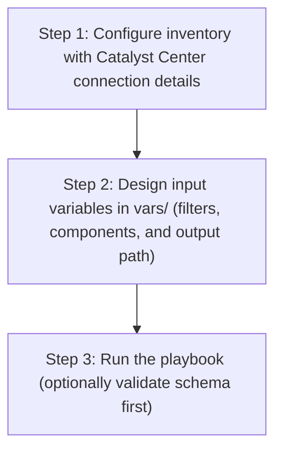

# Tags Playbook Config Generator

## Table of Contents

- [User Flow (3 Steps)](#user-flow-3-steps)

- [Overview](#overview)
- [Features](#features)
- [Prerequisites](#prerequisites)
- [Workflow Structure](#workflow-structure)
- [Schema Parameters](#schema-parameters)
- [Getting Started](#getting-started)
- [Operations](#operations)
- [Examples](#examples)

## User Flow (3 Steps)



---

## Overview

The Tags playbook config generator automates the creation of YAML playbook configurations for existing tag configurations and tag memberships deployed in Cisco Catalyst Center. This tool reduces the effort required to manually create Ansible playbooks by programmatically generating configurations from existing infrastructure.

---

## Features

- **Configuration Generation**: Generate YAML configurations compatible with `tags_workflow_manager` module.
Extract existing tag configurations and tag memberships from your Cisco Catalyst Center.
Convert them into properly formatted YAML files.
Generate files that are ready to use with Ansible automation.
- **Component Filtering**: Selective generation of tag configurations or tag membership configurations
- **Flexible Output**: Configurable file paths and naming conventions
- **Brownfield Support**: Extract configurations from existing Catalyst Center deployments
- **API Integration**: Leverages native Catalyst Center APIs for data retrieval

---

## Prerequisites

### Software Requirements

| Component | Version |
|-----------|---------|
| Ansible | 2.13+ |
| cisco.dnac collection | 6.49.0+ |
| Python | 3.9+ |
| Cisco Catalyst Center | 2.3.7.9+ |
| dnacentersdk | 2.4.5+ |

### Required Collections

```bash
ansible-galaxy collection install cisco.dnac    # >= 6.49.0
ansible-galaxy collection install ansible.utils
pip install dnacentersdk
pip install yamale
```

### Access Requirements

- Catalyst Center admin credentials
- Network connectivity to Catalyst Center API
- Tag infrastructure deployed and configured
- Existing tag configurations and tag memberships

---

## Workflow Structure

```
tags_playbook_config_generator/
├── playbook/
│   └── tags_playbook_config_generator.yml             # Main operations
├── vars/
│   ├── tags_playbook_config_generator_input.yml                 # Configuration examples
├── schema/
│   └── tags_playbook_config_generator_schema.yml                # Input validation
└── README.md                                                
```

---

## Schema Parameters

### Basic Configuration

| Parameter | Type | Required | Default | Description |
|-----------|------|----------|---------|-------------|
| generate_all_configurations | boolean | No | false | Generate all components automatically |
| file_path | string | No | auto-generated | Output file path for YAML configuration file |
| file_mode | string | No | overwrite | File write mode — `overwrite` replaces the file, `append` adds to it |
| component_specific_filters | dict | No | all components | Filters to specify which components to include |

### Component Specific Filtering

| Parameter      | Type | Required | Default | Description |
|--------------|------|----------|-------------|-----------|
| components_list | list | No | ["tag","tag_memberships"] |List of components to include in generation |
| tag      | list | No | all tag configurations|Tag configuration filtering criteria |
| tag_memberships | list | No | all tag membership configurations| Tag membership configuration filtering criteria |

**Valid Component Types:**
- `tag`: Tag configurations with device and port rules
- `tag_memberships`: Tag membership associations (devices and interfaces)

### Tag Configuration Filters

| Parameter | Type   | Required |  Description |
|-----------|--------|-------------|----------------|
| tag_name | string | True |  Filter by tag name | 

### Tag Membership Configuration Filters

| Parameter | Type | Required |  Description |
|-----------|------|-------------|-----------------|
| tag_name    | string | False |  Filter by tag name for membership retrieval | 

---

## Getting Started

### Step 1: Install Prerequisites

```bash
ansible-galaxy collection install cisco.dnac
ansible-galaxy collection install ansible.utils
pip install dnacentersdk
pip install yamale
```

### Step 2: Configure Inventory

Edit `inventory/demo_lab/hosts.yml`:

```yaml
catalyst_center_hosts:
  hosts:
    catalyst_center_primary:
      catalyst_center_host: 10.0.0.0
      catalyst_center_username: admin
      catalyst_center_password: "password"
```

### Step 3: Configure Variables

Edit `workflows/tags_playbook_config_generator/vars/tags_playbook_config_generator_input.yml`:

```yaml
tags_config:
  - generate_all_configurations: true
    file_path: "generated_file/complete_tags_config.yml"
```

### Step 4: Validate Configuration

```bash
./tools/validate.sh -s workflows/tags_playbook_config_generator/schema/tags_playbook_config_generator_schema.yml \
     -d workflows/tags_playbook_config_generator/vars/tags_playbook_config_generator_input.yml
```

### Step 5: Execute Playbook

The playbook supports two input methods:

#### Option A: Vars file input (recommended for version-controlled configs)

```bash
ansible-playbook -i inventory/demo_lab/hosts.yaml \
  workflows/tags_playbook_config_generator/playbook/tags_playbook_config_generator.yml \
  --extra-vars VARS_FILE_PATH=./workflows/tags_playbook_config_generator/vars/tags_playbook_config_generator_input.yml \
  -vvvv
```

#### Option B: Inventory / host variable input

Omit `VARS_FILE_PATH` and define `tags_config` directly as a host variable in your inventory file or in `host_vars`/`group_vars`.

**Example inventory snippet (`inventory/demo_lab/hosts.yaml`):**

```yaml
catalyst_center_hosts:
  hosts:
    catalyst_center_primary:
      catalyst_center_host: "{{ lookup('ansible.builtin.env', 'HOSTIP') }}"
      catalyst_center_password: "{{ lookup('ansible.builtin.env', 'CATALYST_CENTER_PASSWORD') }}"
      catalyst_center_port: 443
      catalyst_center_username: "{{ lookup('ansible.builtin.env', 'CATALYST_CENTER_USERNAME') }}"
      catalyst_center_verify: false
      catalyst_center_version: 2.3.7.9

      # Workflow data defined as host variables
      tags_config:
        - generate_all_configurations: true
          file_path: "generated_file/complete_tags_config.yml"
```

Then run **without** `VARS_FILE_PATH`:

```bash
ansible-playbook -i inventory/demo_lab/hosts.yaml \
  workflows/tags_playbook_config_generator/playbook/tags_playbook_config_generator.yml \
  -vvvv
```

The playbook auto-detects the input source and prints it at the start:
- `Input source: vars file <path>` when using Option A
- `Input source: inventory / host variables (VARS_FILE_PATH not provided)` when using Option B

> **Note:** When `VARS_FILE_PATH` is provided, it takes **precedence** over inventory variables.

### Workflow Execution

The workflow follows these steps:

1. **Load input** from `VARS_FILE_PATH` (if provided) or fall back to inventory / host variables
2. **Connect** to Catalyst Center using provided credentials
3. **Extract** `file_path` and `file_mode` as top-level module parameters; pass `component_specific_filters` inside `config`
4. **Omit** `config` entirely when `generate_all_configurations: true` (module runs in full auto-discovery mode)
5. **Retrieve** existing tag configurations and tag memberships via API calls
6. **Filter** components based on specified criteria
7. **Transform** API responses into Ansible-compatible format
8. **Generate** YAML configuration file with proper structure
9. **Write** output to specified file path using configured `file_mode`

---

## Operations

### Generate Operations (state: gathered)

Use `tags_playbook_config_generator.yml` for generating YAML playbook configuration operations.

#### Generate All Configurations

**Description**: Retrieves all tag configurations and tag memberships from Catalyst Center regardless of any filters.

```yaml
tags_config:
  - generate_all_configurations: true
    file_path: "generated_file/complete_tags_config.yml"
```

#### Component-Specific Generation

**Description**: Generates configuration for specific component types only.

**Extract Tag Configurations Only**

```yaml
tags_config:
  - file_path: "generated_file/tag_configurations_config.yml"
    component_specific_filters:
      components_list: ["tag"]
```

**Extract Tag Memberships Only**

```yaml
tags_config:
  - file_path: "generated_file/tag_memberships_config.yml"
    component_specific_filters:
      components_list: ["tag_memberships"]
```

**Validate and Execute:**

```bash
# Validate
./tools/validate.sh -s workflows/tags_playbook_config_generator/schema/tags_playbook_config_generator_schema.yml \
                   -d workflows/tags_playbook_config_generator/vars/tags_playbook_config_generator_input.yml
````
Return result validate:
```bash
(pyats-mekandar) [mekandar@st-ds-4 dnac_ansible_workflows]$ ./tools/validate.sh -s workflows/tags_playbook_config_generator/schema/tags_playbook_config_generator_schema.yml \
>                    -d workflows/tags_playbook_config_generator/vars/tags_playbook_config_generator_input.yml
workflows/tags_playbook_config_generator/schema/tags_playbook_config_generator_schema.yml
workflows/tags_playbook_config_generator/vars/tags_playbook_config_generator_input.yml
yamale   -s workflows/tags_playbook_config_generator/schema/tags_playbook_config_generator_schema.yml  workflows/tags_playbook_config_generator/vars/tags_playbook_config_generator_input.yml
Validating workflows/tags_playbook_config_generator/vars/tags_playbook_config_generator_input.yml...
Validation success! 👍
```

```bash
# Execute
ansible-playbook -i inventory/demo_lab/hosts.yaml \
  workflows/tags_playbook_config_generator/playbook/tags_playbook_config_generator.yml \
  --extra-vars VARS_FILE_PATH=./workflows/tags_playbook_config_generator/vars/tags_playbook_config_generator_input.yml
```

Expected Terminal Output:

1. Generate All Configurations

```code
        file_path: generated_file/complete_tags_config.yml
        generate_all_configurations: true
   "msg": "YAML configuration file generated successfully for module 'tags_workflow_manager'. File: generated_file/complete_tags_config.yml, Components processed: 2, Components skipped: 0, Configurations count: 9",
                "response": "YAML configuration file generated successfully for module 'tags_workflow_manager'. File: generated_file/complete_tags_config.yml, Components processed: 2, Components skipped: 0, Configurations count: 9",
                "status": "success"
```

2. Component Specific Generation:

a. Tag Configuration Filter:

```code
        component_specific_filters:
          components_list:
          - tag
        file_path: generated_file/tag_configurations_config2.yml
      "msg": "YAML configuration file generated successfully for module 'tags_workflow_manager'. File: generated_file/tag_definitions_config2.yml, Components processed: 1, Components skipped: 0, Configurations count: 7",
                "response": "YAML configuration file generated successfully for module 'tags_workflow_manager'. File: generated_file/tag_definitions_config2.yml, Components processed: 1, Components skipped: 0, Configurations count: 7",
                "status": "success"

```

b. Tag Memberships Configuration Filter:

```code
component_specific_filters:
          components_list:
          - tag_memberships
        file_path: generated_file/tag_memberships_config3.yml
      "msg": "YAML configuration file generated successfully for module 'tags_workflow_manager'. File: generated_file/tag_memberships_config3.yml, Components processed: 1, Components skipped: 0, Configurations count: 2",
                "response": "YAML configuration file generated successfully for module 'tags_workflow_manager'. File: generated_file/tag_memberships_config3.yml, Components processed: 1, Components skipped: 0, Configurations count: 2",
                "status": "success"

```

---

## Examples

### Example 1: Generate ALL tag components

```yaml
tags_config:
  - generate_all_configurations: true
    file_path: "generated_file/complete_tags_infrastructure.yml"
```
**Sample Generated Output**:

Below is a sample YAML configuration file generated by the module when `generate_all_configurations: true` is used:

```yaml
---
config:
- tag:
    name: WAN
- tag:
    name: AUTO_INV_EVENT_SYNC_DISABLED
- tag:
    name: Day0Configuration
- tag:
    name: b
- tag:
    name: INV_EVENT_SYNC_DISABLED
- tag:
    name: a
- tag:
    name: Data-Center
    description: Data-Center
- tag:
    name: Role
    description: Value
    device_rules:
      rule_descriptions:
      - rule_name: device_family
        search_pattern: equals
        value: Switches and Hubs
        operation: ILIKE
- tag:
    name: Campus-Switches
    description: Campus-Switches
- tag:
    name: Production
    description: Production
- tag:
    name: Core-Routers
    description: Core-Routers
- tag:
    name: Access-Points
    description: Access-Points
- tag_memberships:
    tags:
    - b
    device_details:
    - serial_numbers:
      - FJC272121AG
- tag_memberships:
    tags:
    - a
    device_details:
    - serial_numbers:
      - FJC27212582
      - FJC272121AG
```

### Example 2: Tag Configuration Filters only

Extract all tag configurations.

```yaml
tags_config:
  - file_path: "generated_file/tag_configurations_audit.yml"
    component_specific_filters:
      components_list: ["tag"]
```

**Sample Generated Output**:

Below is a sample YAML configuration file generated by the module when only tag configurations are requested:

```yaml
---
config:
- tag:
    name: WAN
- tag:
    name: AUTO_INV_EVENT_SYNC_DISABLED
- tag:
    name: Day0Configuration
- tag:
    name: b
- tag:
    name: INV_EVENT_SYNC_DISABLED
- tag:
    name: a
- tag:
    name: Data-Center
    description: Data-Center
- tag:
    name: Role
    description: Value
    device_rules:
      rule_descriptions:
      - rule_name: device_family
        search_pattern: equals
        value: Switches and Hubs
        operation: ILIKE
- tag:
    name: Campus-Switches
    description: Campus-Switches
- tag:
    name: Production
    description: Production
- tag:
    name: Core-Routers
    description: Core-Routers
- tag:
    name: Access-Points
    description: Access-Points
```

### Example 3: Tag Membership Configuration Filters only

Extract all tag memberships

```yaml
tags_config:
  - file_path: "generated_file/tag_memberships_configurations.yml"
    component_specific_filters:
      components_list: ["tag_memberships"]
```

**Sample Generated Output**:

Below is a sample YAML configuration file generated by the module when only tag memberships are requested:

```yaml
---
config:
- tag_memberships:
    tags:
    - b
    device_details:
    - serial_numbers:
      - FJC272121AG
- tag_memberships:
    tags:
    - a
    device_details:
    - serial_numbers:
      - FJC27212582
      - FJC272121AG
```

### Example 4: Filtered Tag Configurations

```yaml
tags_config:
  - file_path: "generated_file/filtered_tag_configurations.yml"
    component_specific_filters:
      components_list: ["tag"]
      tag:
        - tag_name: "Production"
        - tag_name: "Data-Center"
```

**Sample Generated Output**:

Below is a sample YAML configuration file generated by the module when filtered tag configurations are requested:

```yaml
---
config:
- tag:
    name: Production
    description: Production
- tag:
    name: Data-Center
    description: Data-Center
```

### Example 5: Multi-Component configurations

```yaml
tags_config:
  - file_path: "generated_file/tags_and_memberships.yml"
    component_specific_filters:
      components_list: ["tag", "tag_memberships"]
      tag:
        - tag_name: "Production"
      tag_memberships:
        - tag_name: "Production"
```

### Example 6: Tag Memberships with multiple tag names

```yaml
tags_config:
  - file_path: "generated_file/multiple_tag_memberships.yml"
    component_specific_filters:
      components_list: ["tag_memberships"]
      tag_memberships:
        - tag_name: "Production"
        - tag_name: "Campus-Switches"
        - tag_name: "Core-Routers"
```

### Example 7: Specific tag with memberships

```yaml
tags_config:
  - file_path: "generated_file/production_tags_complete.yml"
    component_specific_filters:
      components_list: ["tag", "tag_memberships"]
      tag:
        - tag_name: "Production"
      tag_memberships:
        - tag_name: "Production"
```

### Example 8: Network infrastructure tags

```yaml
tags_config:
  - file_path: "generated_file/network_infrastructure_tags.yml"
    component_specific_filters:
      components_list: ["tag", "tag_memberships"]
      tag:
        - tag_name: "Campus-Switches"
        - tag_name: "Access-Points"
        - tag_name: "Core-Routers"
      tag_memberships:
        - tag_name: "Campus-Switches"
        - tag_name: "Access-Points"
        - tag_name: "Core-Routers"
```

---

## Additional Resources

- [Cisco Catalyst Center Documentation](https://www.cisco.com/c/en/us/support/cloud-systems-management/dna-center/series.html)
- [Cisco DNA Center SDK](https://dnacentersdk.readthedocs.io/)
- [Ansible Documentation](https://docs.ansible.com/)