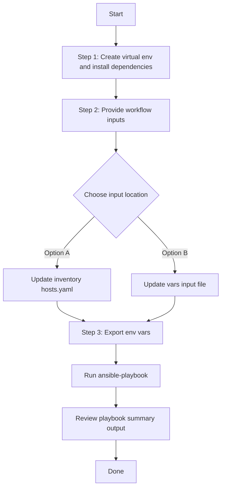

# Template Config Generator

## Table of Contents

- [User Flow (3 Steps)](#user-flow-3-steps)

- [Overview](#overview)
- [Features](#features)
- [Prerequisites](#prerequisites)
- [Workflow Structure](#workflow-structure)
- [Schema Parameters](#schema-parameters)
- [Getting Started](#getting-started)
- [Operations](#operations)
- [Examples](#examples)---

## Overview

The Template config generator automates YAML playbook generation for existing template projects and configuration templates in Cisco Catalyst Center. It produces output compatible with `template_workflow_manager`, making brownfield extraction and reuse of template data straightforward.

---

## Features

- **Configuration Generation**: Generate YAML configurations compatible with `template_workflow_manager`.
  - Extract existing template projects and configuration templates.
  - Transform Catalyst Center data into playbook-ready YAML.
  - Reuse generated content for automation, migration, and backup use cases.
- **Component Filtering**: Generate `projects`, `configuration_templates`, or both.
- **Template Filtering**: Filter templates by `template_name`, `project_name`, and `include_uncommitted`.
- **Flexible Output**: Configure custom `file_path` and `file_mode` (`overwrite` / `append`).
- **Brownfield Discovery**: Omit `config` (or set workflow convenience flag) to generate all available template data.

---

## Prerequisites

### Software Requirements

| Component | Version |
|-----------|---------|
| Ansible | 2.13+ |
| cisco.dnac collection | 6.44.0+ |
| Python | 3.9+ |
| Cisco Catalyst Center | 2.3.7.9+ |
| dnacentersdk | 2.9.3+ |

### Required Collections

```bash
ansible-galaxy collection install cisco.dnac
ansible-galaxy collection install ansible.utils
pip install dnacentersdk
pip install yamale
```

### Access Requirements

- Catalyst Center credentials with access to template APIs
- Network connectivity to Catalyst Center
- Existing template projects and/or configuration templates

---

## Workflow Structure

```
template_config_generator/
├── playbook/
│   └── template_config_generator.yml          # Main operations
├── vars/
│   └── template_config_inputs.yml             # Input examples
├── schema/
│   └── template_config_schema.yml             # Input validation
└── README.md
```

---

## Schema Parameters

### Basic Configuration

| Parameter | Type | Required | Default | Description |
|-----------|------|----------|---------|-------------|
| `generate_all_configurations` | boolean | No | false | Workflow convenience flag. When true, playbook omits module `config` |
| `file_path` | string | No | auto-generated | Output file path for YAML configuration file |
| `file_mode` | string | No | `overwrite` | File write mode: `overwrite` or `append` |
| `component_specific_filters` | dict | No | omitted | Component and filter details passed to module `config` |

### Component Filters

| Parameter | Type | Required | Description |
|-----------|------|----------|-------------|
| `components_list` | list[string] | No | Supported values: `projects`, `configuration_templates` |
| `projects` | list[dict] | No | Project filters (`name`) |
| `configuration_templates` | list[dict] | No | Template filters (`template_name`, `project_name`, `include_uncommitted`) |

---

## Getting Started

## Workflow Steps
## User Flow (3 Steps)



### Installation and Run (Aligned)

1. Create and activate a Python virtual environment, then install dependencies.

```bash
python3 -m venv .venv
source .venv/bin/activate
pip install -r requirements.txt
ansible-galaxy collection install cisco.dnac --force
```

2. Provide workflow inputs in either inventory (`inventory/demo_lab/hosts.yaml`) or the workflow `vars/` file.

3. Export Catalyst Center environment variables and run the playbook.

```bash
export HOSTIP=<catalyst-center-ip-or-fqdn>
export CATALYST_CENTER_USERNAME=<username>
export CATALYST_CENTER_PASSWORD='<password>'
ansible-playbook -i ./inventory/demo_lab/hosts.yaml ./workflows/template_config_generator/playbook/template_config_generator.yml -vvvv
```


## Operations

### Generate Operations (state: gathered)

Use `template_config_generator.yml` for all generation tasks.

1. **Generate all template data**
- Set `generate_all_configurations: true` (or omit filters).

2. **Generate projects only**
- Use `component_specific_filters.components_list: ["projects"]`.

3. **Generate templates only**
- Use `component_specific_filters.components_list: ["configuration_templates"]`.

4. **Filter templates**
- Filter by `template_name`, `project_name`, and/or `include_uncommitted`.

5. **Append output**
- Set `file_mode: append` to append new generated content to an existing file.

---

## Examples

### Example 1: Generate all projects and templates

```yaml
template_config:
  - generate_all_configurations: true
    file_path: "/tmp/template_complete_config.yml"
```

### Example 2: Project-specific generation

```yaml
template_config:
  - file_path: "/tmp/template_project_filter.yml"
    component_specific_filters:
      components_list: ["projects"]
      projects:
        - name: "Onboarding Configuration"
```

### Example 3: Template-specific generation including uncommitted

```yaml
template_config:
  - file_path: "/tmp/template_with_uncommitted.yml"
    component_specific_filters:
      components_list: ["configuration_templates"]
      configuration_templates:
        - project_name: "Onboarding Configuration"
          template_name: "PnP-Devices-SW"
          include_uncommitted: true
```

---

## Notes

- `template_playbook_config_generator` expects `config` as a dictionary when filters are used.
- An empty dictionary for `config` is invalid at module level.
- This workflow omits `config` when filters are absent, which triggers full generation mode.
