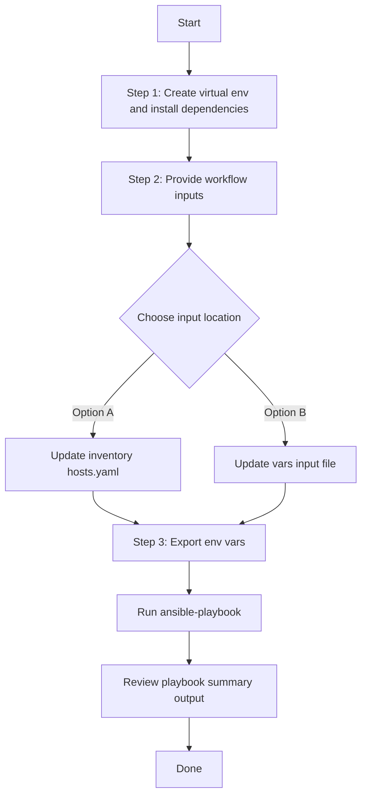

# Template Config Generator

## Table of Contents

- [User Flow (3 Steps)](#user-flow-3-steps)

- [Overview](#overview)
- [Features](#features)
- [Prerequisites](#prerequisites)
- [Workflow Structure](#workflow-structure)
- [Schema Parameters](#schema-parameters)
- [Getting Started](#getting-started)
- [Operations](#operations)
- [Examples](#examples)

## Overview

The Template config generator automates YAML playbook generation for existing template projects and configuration templates in Cisco Catalyst Center. It produces output compatible with `template_workflow_manager`, making brownfield extraction and reuse of template data straightforward.

---

## Features

- **Configuration Generation**: Generate YAML configurations compatible with `template_workflow_manager`.
  - Extract existing template projects and configuration templates.
  - Transform Catalyst Center data into playbook-ready YAML.
  - Reuse generated content for automation, migration, and backup use cases.
- **Component Filtering**: Generate `projects`, `configuration_templates`, or both.
- **Template Filtering**: Filter templates by `template_name`, `project_name`, and `include_uncommitted`.
- **Flexible Output**: Configure custom `file_path` and `file_mode` (`overwrite` / `append`).
- **Brownfield Discovery**: Omit `config` to generate all committed template data. Use `include_uncommitted: true` filters when you need uncommitted templates too.

---

## Prerequisites

### Software Requirements

| Component | Version |
|-----------|---------|
| Ansible | 2.13+ |
| cisco.dnac collection | 6.49.0+ |
| Python | 3.9+ |
| Cisco Catalyst Center | 2.3.7.9+ |
| dnacentersdk | 2.9.3+ |

### Required Collections

```bash
ansible-galaxy collection install cisco.dnac
ansible-galaxy collection install ansible.utils
pip install dnacentersdk
pip install yamale
```

### Access Requirements

- Catalyst Center credentials with access to template APIs
- Network connectivity to Catalyst Center
- Existing template projects and/or configuration templates

---

## Workflow Structure

```
template_config_generator/
├── playbook/
│   └── template_config_generator.yml          # Main operations
├── vars/
│   └── template_config_inputs.yml             # Input examples
├── schema/
│   └── template_config_schema.yml             # Input validation
└── README.md
```

---

## Schema Parameters

### Basic Configuration

| Parameter | Type | Required | Default | Description |
|-----------|------|----------|---------|-------------|
| `file_path` | string | No | auto-generated | Output file path for YAML configuration file |
| `file_mode` | string | No | `overwrite` | File write mode: `overwrite` or `append` |
| `config` | dict | No | omitted | Module config dictionary passed to `template_playbook_config_generator`. If provided, it must contain `component_specific_filters`. |

### Config Filters (`config.component_specific_filters`)

| Parameter | Type | Required | Description |
|-----------|------|----------|-------------|
| `components_list` | list[string] | No | Supported values: `projects`, `configuration_templates` |
| `projects` | list[dict] | No | Project filters (`name`) |
| `configuration_templates` | list[dict] | No | Template filters (`template_name`, `project_name`, `include_uncommitted`) |

**Component Logic Rules:**
- **No `config`**: All components are retrieved (equivalent to both projects and configuration_templates)
- **`config` provided**: `component_specific_filters` is mandatory
- **Component filter blocks provided** (e.g., `configuration_templates`): Those components are automatically added to `components_list` when missing
- **No component filter blocks**: `components_list` is required and must not be empty

**Valid Component Types:**
- `projects`: Include only projects in the generated configuration
- `configuration_templates`: Include only configuration templates in the generated configuration

### Project Filters

| Parameter | Type | Description |
|-----------|--------|-------------|
| `name` | string | Filter by project name |

### Configuration Template Filters

| Parameter | Type | Description |
|-----------|------|-------------|
| `template_name` | string | Filter by template name |
| `project_name` | string | Filter by project name |
| `include_uncommitted` | bool | Include uncommitted template configurations |

---

## Getting Started

## Workflow Steps
## User Flow (3 Steps)



### Installation and Run (Aligned)

1. Create and activate a Python virtual environment, then install dependencies.

```bash
python3 -m venv .venv
source .venv/bin/activate
pip install -r requirements.txt
ansible-galaxy collection install cisco.dnac --force
```

2. Provide workflow inputs in either inventory (`inventory/demo_lab/hosts.yaml`) or the workflow `vars/` file.

3. Export Catalyst Center environment variables and run the playbook.

```bash
export HOSTIP=<catalyst-center-ip-or-fqdn>
export CATALYST_CENTER_USERNAME=<username>
export CATALYST_CENTER_PASSWORD='<password>'
ansible-playbook -i ./inventory/demo_lab/hosts.yaml ./workflows/template_config_generator/playbook/template_config_generator.yml -vvvv
```


## Operations

### Generate Operations (state: gathered)

Use `template_config_generator.yml` for all generation tasks.

1. **Generate all template data**
- Omit `config`.

2. **Generate projects only**
- Use `config.component_specific_filters.components_list: ["projects"]`.

3. **Generate templates only**
- Use `config.component_specific_filters.components_list: ["configuration_templates"]`.

4. **Filter templates**
- Filter by `template_name`, `project_name`, and/or `include_uncommitted`.

5. **Append output**
- Set `file_mode: append` to append new generated content to an existing file.

---

## Examples

### Example 1: Generate all projects and templates

```yaml
template_config:
  - file_path: "/tmp/template_complete_config.yml"
```

### Example 2: Project-specific generation

```yaml
template_config:
  - file_path: "/tmp/template_project_filter.yml"
    config:
      component_specific_filters:
        components_list: ["projects"]
        projects:
          - name: "Onboarding Configuration"
```

### Example 3: Template-specific generation including uncommitted

```yaml
template_config:
  - file_path: "/tmp/template_with_uncommitted.yml"
    config:
      component_specific_filters:
        components_list: ["configuration_templates"]
        configuration_templates:
          - project_name: "Onboarding Configuration"
            template_name: "PnP-Devices-SW"
            include_uncommitted: true
```

**Validate and Execute:**

```bash
# Validate
./tools/schemavalidation.sh -s workflows/template_config_generator/schema/template_config_schema.yml \
 -d workflows/template_config_generator/vars/template_config_inputs.yml

```

Return result validate:
```bash
./tools/schemavalidation.sh -s workflows/template_config_generator/schema/template_config_schema.yml \
>  -d workflows/template_config_generator/vars/template_config_inputs.yml
workflows/template_config_generator/schema/template_config_schema.yml
workflows/template_config_generator/vars/template_config_inputs.yml
yamale   -s workflows/template_config_generator/schema/template_config_schema.yml  workflows/template_config_generator/vars/template_config_inputs.yml
Validating workflows/template_config_generator/vars/template_config_inputs.yml...
Validation success! 👍

```

```bash
# Execute
ansible-playbook -i inventory/demo_lab/hosts.yaml \
  workflows/template_config_generator/playbook/template_config_generator.yml \
  --extra-vars VARS_FILE_PATH=./workflows/template_config_generator/vars/template_config_inputs.yml
```

1.Generate All Configurations

Terminal Return

```code

 response:
        components_processed: 3
        components_skipped: 0
        configurations_count: 3
        file_mode: overwrite
        file_path: /tmp/template_config.yml
        message: YAML configuration file generated successfully for module 'template_workflow_manager'
        status: success
      status: success
```
---

## Examples

### Example 1: Generate ALL template configuration (full discovery)

```yaml
template_config:
  - file_path: "/tmp/all_template_config.yml"
```

After running the playbook, the following YAML configuration is generated.

```yaml
---
config:
- projects:
  - name: Cloud DayN Templates
  - name: Onboarding Configuration
    description: Onboarding Configuration
  - name: Sample Jinja Templates
    description: Sample Jinja Templates
- configuration_templates:
    template_name: Ans Switch DayN 1
    project_name: Cloud DayN Templates
    author: admin
    language: JINJA
    composite: false
    software_type: IOS-XE
    custom_params_order: false
    device_types:
    - product_family: Switches and Hubs
- configuration_templates:
    template_name: Ans Switch DayN 2
    project_name: Cloud DayN Templates
    author: admin
    language: JINJA
    composite: false
    software_type: IOS-XE
    custom_params_order: false
    device_types:
    - product_family: Switches and Hubs
```

### Example 2: Generate only project component (config: key)

Extract all projects

```yaml
template_config:
  - file_path: "/tmp/all_project_components_config3.yml"
    config:
      component_specific_filters:
        components_list: ["projects"]
```

After running the playbook, the following YAML configuration is generated:

```yaml
---
config:
- projects:
  - name: Cloud DayN Templates
  - name: Onboarding Configuration
    description: Onboarding Configuration
  - name: Sample Jinja Templates
    description: Sample Jinja Templates
```

### Example 3: Generate only configuration template component (config: key)

Extract all configuration template

```yaml
template_config:
  - file_path: "/tmp/all_config_template_components_config3.yml"
    config:
      component_specific_filters:
        components_list: ["configuration_templates"]
```

After running the playbook, the following YAML configuration is generated:

```yaml
---
config:
- configuration_templates:
    template_name: Ans Switch DayN 1
    project_name: Cloud DayN Templates
    author: admin
    language: JINJA
    composite: false
    software_type: IOS-XE
    custom_params_order: false
    device_types:
    - product_family: Switches and Hubs
- configuration_templates:
    template_name: Ans Switch DayN 2
    project_name: Cloud DayN Templates
    author: admin
    language: JINJA
    composite: false
    software_type: IOS-XE
    custom_params_order: false
    device_types:
    - product_family: Switches and Hubs
```

### Example 4: Specific project name Filter configurations

```yaml
template_config:
  - file_path: "/tmp/specific_projects_config3.yml"
    config:
      component_specific_filters:
        components_list: ["projects"]
        projects:
          - name: "Sample Project1"
          - name: "Sample Project2"
```

### Example 5: Generate the playbook config for template with multiple filters

```yaml
template_config:
  - file_path: "/tmp/specific_config_template_config3.yml"
    config:
      component_specific_filters:
        components_list: ["configuration_templates"]
        configuration_templates:
          - template_name: "Template1"
            project_name: "Project1"
            include_uncommitted: true
          - template_name: "Template2"
            project_name: "Project2"
```
