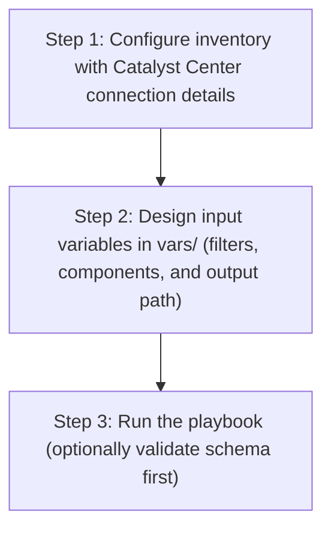

# User Role Config Generator

## Table of Contents

- [User Flow (3 Steps)](#user-flow-3-steps)

- [Overview](#overview)
- [Features](#features)
- [Prerequisites](#prerequisites)
- [Workflow Structure](#workflow-structure)
- [Schema Parameters](#schema-parameters)
- [Getting Started](#getting-started)
- [Operations](#operations)
- [Examples](#examples)

## User Flow (3 Steps)



---

## Overview

The User Role config generator automates YAML playbook generation for existing users and custom roles in Cisco Catalyst Center. It produces output compatible with `user_role_workflow_manager`, helping with brownfield extraction, backup, and role/user migration workflows.

---

## Features

- **Configuration Generation**: Generate YAML configurations compatible with `user_role_workflow_manager`.
  - Extract existing user accounts and custom role definitions.
  - Transform API data into playbook-ready YAML.
  - Reuse generated files for automation and recovery scenarios.
- **Component Filtering**: Generate `user_details`, `role_details`, or both.
- **User Filtering**: Filter users by `username`, `email`, and assigned `role_name`.
- **Role Filtering**: Filter custom roles by `role_name`.
- **Flexible Output**: Supports custom `file_path` and `file_mode` (`overwrite` / `append`).
- **Brownfield Discovery**: Omit `config` (or use workflow convenience flag) to generate all supported user/role components.

---

## Prerequisites

### Software Requirements

| Component | Version |
|-----------|---------|
| Ansible | 2.13+ |
| cisco.dnac collection | 6.44.0+ |
| Python | 3.9+ |
| Cisco Catalyst Center | 2.3.5.3+ |
| dnacentersdk | 2.7.2+ |

### Required Collections

```bash
ansible-galaxy collection install cisco.dnac
ansible-galaxy collection install ansible.utils
pip install dnacentersdk
pip install yamale
```

### Access Requirements

- Catalyst Center credentials with access to user/role APIs
- Network connectivity to Catalyst Center
- Existing users and/or custom roles in Catalyst Center

---

## Workflow Structure

```
user_role_config_generator/
├── playbook/
│   └── user_role_config_generator.yml          # Main operations
├── vars/
│   └── user_role_config_inputs.yml             # Input examples
├── schema/
│   └── user_role_config_schema.yml             # Input validation
└── README.md
```

---

## Schema Parameters

### Basic Configuration

| Parameter | Type | Required | Default | Description |
|-----------|------|----------|---------|-------------|
| `generate_all_configurations` | boolean | No | false | Workflow convenience flag. When true, playbook omits module `config` |
| `file_path` | string | No | auto-generated | Output file path for generated YAML |
| `file_mode` | string | No | `overwrite` | File write mode: `overwrite` or `append` |
| `component_specific_filters` | dict | No | omitted | Component and filters passed to module `config` |

### Supported Components

- `user_details`
- `role_details`

### Filters

- `user_details` filter keys (list of dictionaries):
  - `username`: list of usernames
  - `email`: list of email addresses
  - `role_name`: list of role names assigned to users
- `role_details` filter keys (list of dictionaries):
  - `role_name`: list of custom role names

---

## Getting Started

### Step 1: Configure Inventory

Example `inventory/demo_lab/hosts.yml`:

```yaml
catalyst_center_hosts:
  hosts:
    catalyst_center_primary:
      catalyst_center_host: 10.0.0.0
      catalyst_center_username: admin
      catalyst_center_password: "password"
      catalyst_center_port: 443
      catalyst_center_verify: false
      catalyst_center_version: 2.3.7.9
```

### Step 2: Configure Variables

Edit:
`workflows/user_role_config_generator/vars/user_role_config_inputs.yml`

```yaml
user_role_config:
  - generate_all_configurations: true
    file_path: "/tmp/user_role_complete_config.yml"
```

### Step 3: Validate Configuration

```bash
./tools/validate.sh -s workflows/user_role_config_generator/schema/user_role_config_schema.yml \
  -d workflows/user_role_config_generator/vars/user_role_config_inputs.yml
```

### Step 4: Execute Playbook

#### Option A: Vars file input (recommended)

```bash
ansible-playbook -i inventory/demo_lab/hosts.yaml \
  workflows/user_role_config_generator/playbook/user_role_config_generator.yml \
  --extra-vars VARS_FILE_PATH=./workflows/user_role_config_generator/vars/user_role_config_inputs.yml \
  -vvvv
```

#### Option B: Inventory / host variable input

Omit `VARS_FILE_PATH` and define `user_role_config` in inventory or `host_vars`.

---

## Operations

### Generate Operations (state: gathered)

Use `user_role_config_generator.yml` for all generation tasks.

1. **Generate all user/role configurations**
- Set `generate_all_configurations: true`.

2. **Generate user component only**
- Use `component_specific_filters.components_list: ["user_details"]`.

3. **Generate role component only**
- Use `component_specific_filters.components_list: ["role_details"]`.

4. **Generate filtered user/role slices**
- Provide list-based filters under `user_details` / `role_details`.

5. **Append generated output**
- Set `file_mode: append` to append into an existing file.

---

## Examples

### Example 1: Generate all users and roles

```yaml
user_role_config:
  - generate_all_configurations: true
    file_path: "/tmp/user_role_complete_config.yml"
```

### Example 2: Generate users by email filter

```yaml
user_role_config:
  - file_path: "/tmp/user_role_users_by_email.yml"
    component_specific_filters:
      components_list: ["user_details"]
      user_details:
        - email: ["admin@example.com", "operator@example.com"]
```

### Example 3: Generate custom roles by role_name

```yaml
user_role_config:
  - file_path: "/tmp/user_role_role_name_filter.yml"
    component_specific_filters:
      components_list: ["role_details"]
      role_details:
        - role_name: ["Custom-Admin-Role"]
```

---

## Notes

- `user_role_playbook_config_generator` expects `config` as a dictionary when filters are used.
- This workflow omits `config` when filters are absent, which triggers full generation mode.
- Role filtering under `role_details` includes only custom roles returned by the module logic.
